# `matplotlib\galleries\examples\subplots_axes_and_figures\axes_margins.py` 详细设计文档

这是一个matplotlib示例脚本，演示了如何使用margins方法控制坐标轴的视图限制，以及解释sticky_edges概念如何影响自动边距调整行为。

## 整体流程

```mermaid
graph TD
    A[开始] --> B[定义函数 f(t) = exp(-t)*cos(2πt)]
    B --> C[生成时间序列 t1]
    C --> D[创建子图 ax1, 设置 margins(0.05)]
    D --> E[创建子图 ax2, 设置 margins(2, 2)]
    E --> F[创建子图 ax3, 设置 margins(0, -0.25)]
    F --> G[调用 plt.show() 显示第一张图]
    G --> H[定义网格数据 y, x 和多边形坐标]
    H --> I[创建包含两个子图的 figure]
    I --> J[设置 ax2.use_sticky_edges = False]
    J --> K[循环绘制 pcolor 和 Polygon]
    K --> L[设置 margins 并显示第二张图]
```

## 类结构

```
Python 脚本 (无类定义)
├── 全局函数: f(t)
├── 全局变量: t1, y, x, poly_coords
└── matplotlib 对象: fig, ax1, ax2, ax3, cells, Polygon
```

## 全局变量及字段


### `t1`
    
时间序列数组，从0.0到3.0，步长0.01

类型：`numpy.ndarray`
    


### `y`
    
5x5网格的y坐标

类型：`numpy.ndarray`
    


### `x`
    
5x5网格的x坐标

类型：`numpy.ndarray`
    


### `poly_coords`
    
多边形顶点坐标列表

类型：`list`
    


### `fig`
    
图形对象

类型：`matplotlib.figure.Figure`
    


### `ax1`
    
第一个子图的坐标轴

类型：`matplotlib.axes.Axes`
    


### `ax2`
    
第二个子图的坐标轴

类型：`matplotlib.axes.Axes`
    


### `ax3`
    
第三个子图的坐标轴

类型：`matplotlib.axes.Axes`
    


### `cells`
    
pcolor返回的网格集合

类型：`matplotlib.collections.QuadMesh`
    


### `ax`
    
循环中的坐标轴变量

类型：`matplotlib.axes.Axes`
    


### `f`
    
指数衰减余弦函数，用于生成测试数据

类型：`function`
    


### `status`
    
循环中表示是否使用sticky edges状态的字符串

类型：`str`
    


    

## 全局函数及方法


### f

计算衰减余弦函数 $e^{-t} \cos(2\pi t)$ 的值。该函数接收时间变量 $t$，计算指数衰减部分与余弦振荡部分的乘积，常用于信号处理或演示matplotlib绘图功能。

参数：
-  `t`：`float` 或 `numpy.ndarray`，时间变量，支持标量输入或numpy数组（向量化计算）。

返回值：`float` 或 `numpy.ndarray`，返回输入 $t$ 对应的衰减余弦函数计算结果。

#### 流程图

```mermaid
graph LR
    A([开始]) --> B{输入参数 t}
    B --> C[计算 exp(-t)]
    B --> D[计算 cos(2πt)]
    C --> E[计算乘积 result = exp(-t) * cos(2πt)]
    D --> E
    E --> F([返回结果])
```

#### 带注释源码

```python
def f(t):
    """
    计算衰减余弦函数 exp(-t) * cos(2πt)

    参数:
        t: 时间变量，类型为 float 或 numpy.ndarray

    返回值:
        类型为 float 或 numpy.ndarray，计算结果
    """
    # 第一步：计算衰减因子 exp(-t)
    # 第二步：计算余弦因子 cos(2πt)
    # 第三步：返回两者的乘积
    return np.exp(-t) * np.cos(2*np.pi*t)
```


### `np.mgrid`

`np.mgrid` 是 NumPy 的一个函数，用于创建一个多维网格（mesh grid），返回用于索引的数组列表。它与 `np.ogrid` 的区别在于 `mgrid` 返回的是"密集"（dense）网格，而 `ogrid` 返回的是"开放"（open）网格。

参数：

-  `*indices`：`tuple of slice`，表示每个维度的索引范围，格式为 `start:stop:step`，支持省略步长（默认步长为1）

返回值：`ndarray` 或 `ndarray列表`，返回一个多维数组（当只有一个维度时）或多个多维数组（多个维度时），每个数组代表对应维度的网格索引

#### 流程图

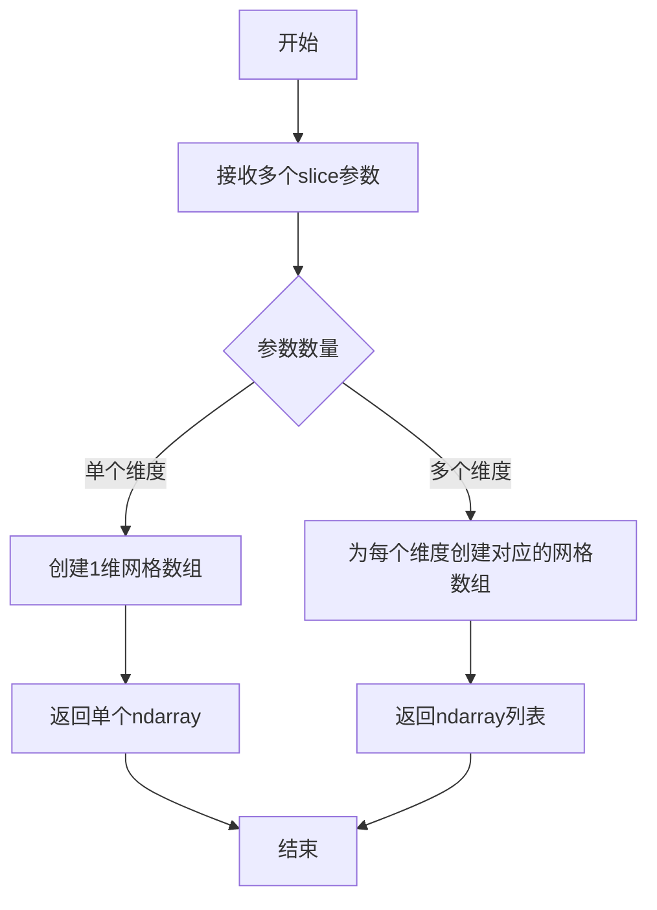

#### 带注释源码

```python
# np.mgrid 是 NumPy 中用于创建多维网格的函数
# 它返回一个用于多维索引的数组（或数组列表）

# 使用示例 1：一维网格
# 创建一个从0到4的一维数组，等同于 np.arange(0, 5, 1)
arr_1d = np.mgrid[:5]
# 结果: array([0, 1, 2, 3, 4])

# 使用示例 2：二维网格（代码中的实际用法）
# 创建两个5x5的网格数组
# 第一个数组 y: 行索引 (0-4按行重复)
# 第二个数组 x: 列索引 (1-6按列重复，但不包含6)
y, x = np.mgrid[:5, 1:6]

# y 的输出:
# array([[0, 0, 0, 0, 0],
#        [1, 1, 1, 1, 1],
#        [2, 2, 2, 2, 2],
#        [3, 3, 3, 3, 3],
#        [4, 4, 4, 4, 4]])

# x 的输出:
# array([[1, 2, 3, 4, 5],
#        [1, 2, 3, 4, 5],
#        [1, 2, 3, 4, 5],
#        [1, 2, 3, 4, 5],
#        [1, 2, 3, 4, 5]])

# 使用示例 3：带步长的网格
y_step, x_step = np.mgrid[0:6:2, 0:6:2]
# y_step: [[0, 0, 0], [2, 2, 2], [4, 4, 4]]
# x_step: [[0, 2, 4], [0, 2, 4], [0, 2, 4]]

# 使用场景：在pcolor绘图中生成网格坐标
# 在代码示例中用于绘制pcolor图形
y, x = np.mgrid[:5, 1:6]  # 生成5x5的网格
cells = ax.pcolor(x, y, x+y, cmap='inferno', shading='auto')
# x+y 计算每个单元的值，x和y作为网格坐标
```


### `np.arange`

NumPy库中的`arange`函数，用于生成一个在指定间隔内的均匀间隔值数组，类似于Python内置的`range`函数，但返回的是NumPy数组。

参数：

- `start`：`float`（可选），起始值，默认为0.0
- `stop`：`float`，结束值（不包含）
- `step`：`float`（可选），步长，默认为1.0
- `dtype`：`dtype`（可选），输出数组的数据类型

返回值：`numpy.ndarray`，一个一维数组，包含从start到stop（不包含）的值，间隔为step

#### 流程图

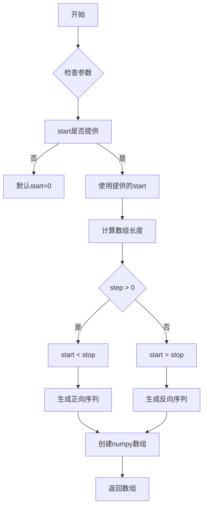

#### 带注释源码

```python
# 在代码中的实际使用
t1 = np.arange(0.0, 3.0, 0.01)

# 等价于Python的range(0, 300), 然后每个值除以100
# 生成了从0.0开始，0.01为步长，到3.0（不包含）的数组
# 结果类似: [0.0, 0.01, 0.02, ..., 2.99]

# 函数原型（NumPy源码简化版）
# def arange(start=0.0, stop=None, step=1.0, dtype=None):
#     """
#     返回均匀间隔的值。
#     
#     参数:
#         start: 起始值，默认为0
#         stop: 结束值（不包含）
#         step: 相邻值之间的差值
#         dtype: 输出数组的数据类型
#     
#     返回:
#         ndarray - 均匀间隔的数组
#     """
```

#### 实际应用场景

在提供的Matplotlib示例代码中，`np.arange`用于生成时间序列数据：

```python
# 生成从0.0到3.0（不包含），步长为0.01的时间数组
# 用于绘制衰减振荡函数 f(t) = exp(-t) * cos(2*pi*t)
t1 = np.arange(0.0, 3.0, 0.01)

# 后续用于创建图表的时间轴数据
ax1.plot(t1, f(t1))  # 绘制函数图像
```


### `np.exp`

NumPy的指数函数，计算自然常数e（约等于2.71828）的x次方（e^x），广泛应用于科学计算中进行指数运算。

参数：

- `x`：任意数值或数组（int、float、ndarray），输入的指数幂值

返回值：`ndarray` 或 `scalar`，返回e的x次方的结果，类型与输入类型相关

#### 流程图

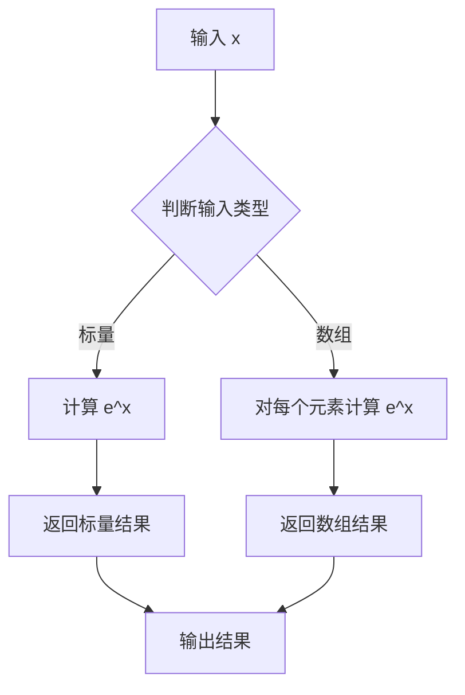

#### 带注释源码

```python
def np_exp_implementation(x):
    """
    NumPy exp 函数的简化实现原理说明
    
    参数:
        x: 数值或数组，表示指数幂
    
    返回:
        e^x 的值，其中 e ≈ 2.71828...
    """
    # 欧拉数常数
    EULER_NUMBER = 2.718281828459045
    
    # 使用幂运算计算 e^x
    # 等价于 exp(x) = e^x
    result = EULER_NUMBER ** x
    
    return result

# 在代码中的实际使用示例：
# f(t) = np.exp(-t) * np.cos(2*np.pi*t)
# 计算衰减振荡函数：e的-t次方乘以余弦函数
t1 = np.arange(0.0, 3.0, 0.01)
y = np.exp(-t1) * np.cos(2 * np.pi * t1)  # 指数衰减包络
```

> **注**：实际源码位于NumPy C语言实现中，此处为Python层面的原理说明。`np.exp`支持标量、数组等多种输入，并利用向量化操作实现高效计算。


### `np.cos`

NumPy的余弦函数，计算输入数组或标量的逐元素余弦值，广泛用于数学运算和信号处理领域。

参数：

- `x`：`array_like`，输入角度值，可以是标量、列表或NumPy数组，单位为弧度

返回值：`ndarray` 或 scalar，输入的余弦值，类型与输入相同

#### 流程图

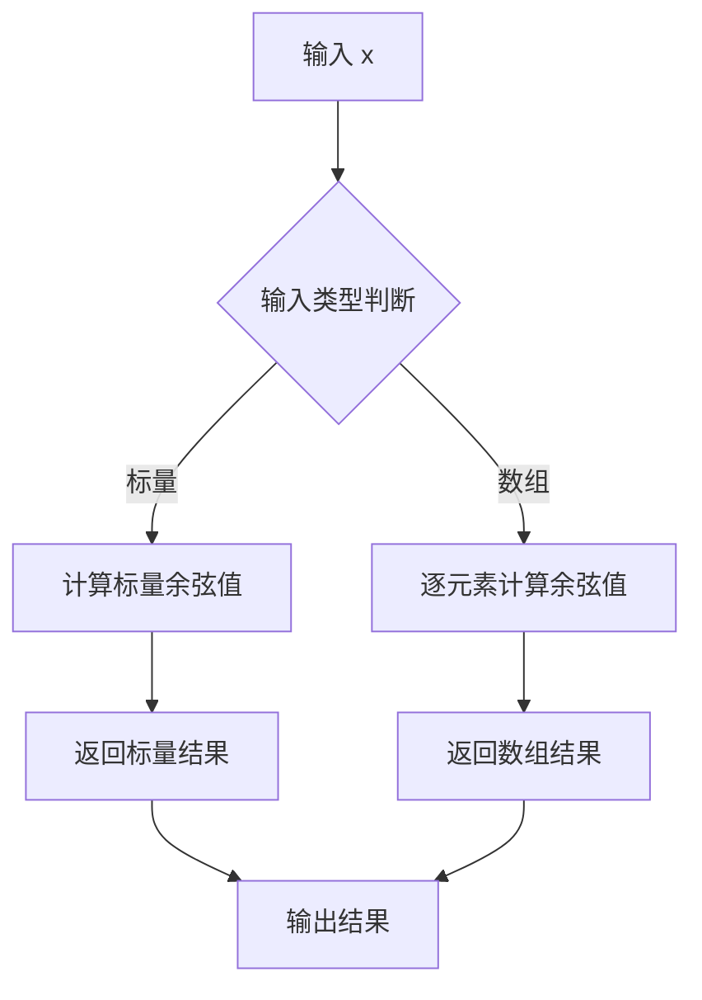

#### 带注释源码

```python
def f(t):
    """
    示例函数：复指数衰减振荡
    使用 np.cos 计算余弦分量
    """
    # np.exp(-t): 指数衰减包络
    # np.cos(2*np.pi*t): 频率为1Hz的余弦波
    # 两者相乘得到衰减余弦信号
    return np.exp(-t) * np.cos(2*np.pi*t)
```

#### 额外说明

在代码中的具体应用：

```python
import numpy as np

# 创建时间向量，从0到3秒，步长0.01秒
t1 = np.arange(0.0, 3.0, 0.01)

# f(t) 函数使用 np.cos(2*np.pi*t) 生成余弦波
# 2*np.pi*t 将时间转换为弧度（周期为1秒）
result = np.cos(2*np.pi*t1)  # 生成1Hz余弦信号
```

**技术特性：**

- 输入必须是弧度制，若需角度制需先转换为弧度
- 支持向量化操作，返回与输入形状一致的数组
- 属于NumPy数学函数库（numpy.matlib.sin等也有类似接口）


### `plt.subplot`

`plt.subplot` 是 matplotlib.pyplot 模块中的函数，用于在当前图形中创建一个子图（Axes 对象）。它接受一个表示子图布局的位置参数（如 3 位数字或行数、列数、索引的组合），返回新创建的 Axes 对象，可用于在该子图上进行绘图操作。

参数：

-  `*args`：位置参数，可以是以下两种形式之一：
    - 一个 3 位整数（如 212、221、222），其中第一位表示行数，第二位表示列数，第三位表示子图位置索引
    - 三个整数 `(nrows, ncols, index)`，分别表示子图的行数、列数和位置索引
-  `**kwargs`：可选的关键字参数，将传递给 `Axes` 类的构造函数，用于配置子图的各种属性

返回值：`matplotlib.axes.Axes`，返回创建的子图轴对象，后续可用于调用 plot()、set_title()、margins() 等方法进行绘图和设置。

#### 流程图

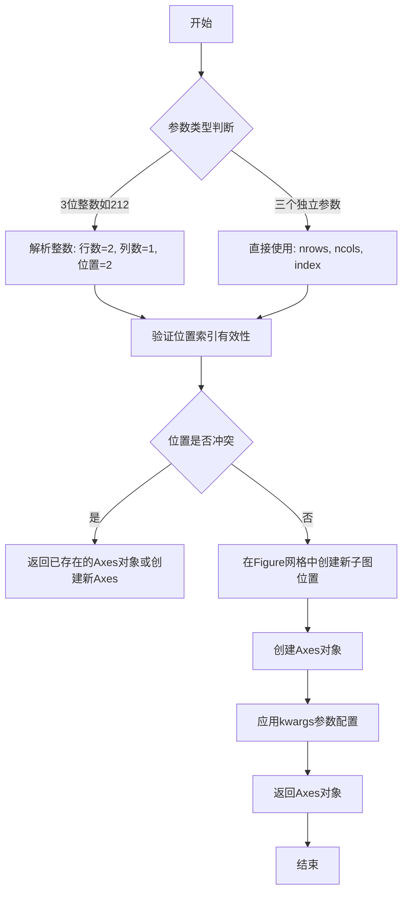

#### 带注释源码

```python
# matplotlib.pyplot.subplot 源码分析

# 使用示例 1: 使用3位整数创建子图
ax1 = plt.subplot(212)  
# 解析: 2行 x 1列网格, 位置2 (下方的子图)
# 返回Axes对象赋值给ax1

# 使用示例 2: 创建2x2网格的第一个子图
ax2 = plt.subplot(221)  
# 解析: 2行 x 2列网格, 位置1 (左上角)
# 随后设置margins并绘图
ax2.margins(2, 2)           # 设置 margins 用于缩放
ax2.plot(t1, f(t1))        # 绑定数据到子图
ax2.set_title('Zoomed out') # 设置子图标题

# 使用示例 3: 创建2x2网格的第二个子图  
ax3 = plt.subplot(222)
# 解析: 2行 x 2列网格, 位置2 (右上角)
ax3.margins(x=0, y=-0.25)   # x轴无margin, y轴负margin实现放大
ax3.plot(t1, f(t1))
ax3.set_title('Zoomed in')

# 另一个用法: 关键字参数形式
# fig, (ax1, ax2) = plt.subplots(ncols=2)  # 这是另一种创建方式
# plt.subplot 也支持 projection, facecolor 等 kwargs 参数

plt.show()  # 显示所有创建的子图
```

#### 关键组件信息

| 组件名称 | 描述 |
|---------|------|
| `matplotlib.pyplot` | matplotlib 的顶层接口，提供了类似 MATLAB 的绘图风格 |
| `Axes` | 子图对象，表示一个绘图区域，包含坐标轴、刻度、标签等 |
| `Figure` | 整个图形窗口，包含一个或多个 Axes |

#### 潜在的技术债务或优化空间

1. **位置参数解析**：使用 3 位整数（如 212）不够直观，容易混淆，建议始终使用 `(nrows, ncols, index)` 形式提高可读性
2. **缺少错误处理**：当位置索引超出网格范围时，matplotlib 会抛出异常但错误信息不够友好
3. **与 `plt.subplots` 的重叠功能**：`plt.subplots` 一次性创建多个子图更高效，当前代码可改用 `plt.subplots(2, 2)` 替代多个 `plt.subplot` 调用


### `plt.subplots`

`plt.subplots` 是 matplotlib.pyplot 模块中的函数，用于创建一个包含多个子图的.figure 和 axes 对象的便捷函数。该函数简化了创建子图网格的过程，允许用户同时定义行数、列数以及子图之间的共享关系，并返回 Figure 对象和 Axes 对象（或数组），以便后续进行绑图操作。

参数：

- `nrows`：`int`，可选，默认值为 1，表示子图网格的行数。
- `ncols`：`int`，可选，默认值为 1，表示子图网格的列数。
- `sharex`：`bool` 或 `str`，可选，默认值为 False。如果为 True，则所有子图共享 x 轴刻度；如果为 'row'，则每行子图共享 x 轴刻度；如果为 'col'，则每列子图共享 x 轴刻度。
- `sharey`：`bool` 或 `str`，可选，默认值为 False。如果为 True，则所有子图共享 y 轴刻度；如果为 'row'，则每行子图共享 y 轴刻度；如果为 'col'，则每列子图共享 y 轴刻度。
- `squeeze`：`bool`，可选，默认值为 True。如果为 True，则返回的 axes 对象会被降维处理：当 nrows 或 ncols 为 1 时，返回的不是数组而是单个 Axes 对象；当 nrows 和 ncols 都为 1 时，返回标量；否则返回 2D 数组。
- `width_ratios`：`array-like`，可选，定义每列的宽度比例，长度必须等于 ncols。
- `height_ratios`：`array-like`，可选，定义每行的高度比例，长度必须等于 nrows。
- `**fig_kw`：接受任何 Figure构造函数接受的参数，如 `figsize`、`dpi`、`facecolor` 等，用于配置 Figure 对象。

返回值：`tuple(Figure, Axes or array of Axes)`，返回一个元组，元组第一个元素是 Figure 对象（整个图形窗口），第二个元素是 Axes 对象（子图）。当 squeeze=True 时，如果 nrows=1 且 ncols=1，返回单个 Axes 对象；如果 nrows=1 或 ncols=1，返回 1D Axes 数组；否则返回 2D Axes 数组。

#### 流程图

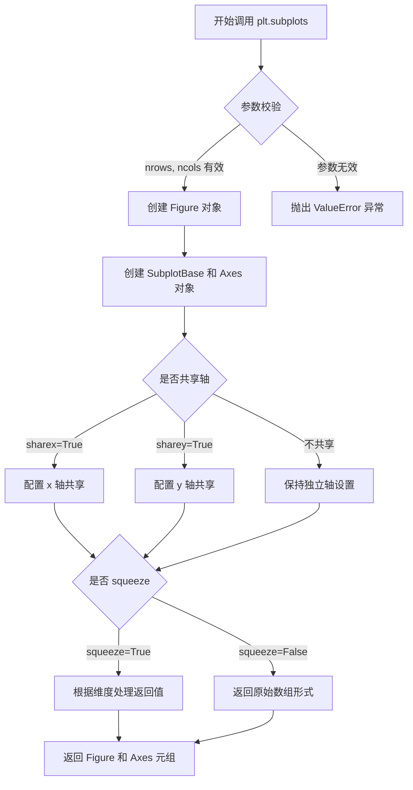

#### 带注释源码

```python
# plt.subplots 函数的简化实现原理（基于 matplotlib 源码概念）
def subplots(nrows=1, ncols=1, sharex=False, sharey=False, 
             squeeze=True, width_ratios=None, height_ratios=None, 
             **fig_kw):
    """
    创建包含多个子图的图形窗口
    
    参数:
        nrows: 子图行数，默认1
        ncols: 子图列数，默认1
        sharex: 是否共享x轴，False/'row'/'col'/True
        sharey: 是否共享y轴，False/'row'/'col'/True
        squeeze: 是否压缩返回值维度
        width_ratios: 列宽度比例数组
        height_ratios: 行高度比例数组
        **fig_kw: 传递给Figure的参数
    
    返回:
        (fig, axes): Figure对象和Axes对象或数组
    """
    
    # 步骤1: 创建 Figure 对象
    fig = Figure(**fig_kw)  # 根据 fig_kw 参数创建图形
    
    # 步骤2: 计算子图网格布局
    # 使用 GridSpec 或 SubplotSpec 确定子图位置
    gs = GridSpec(nrows, nrows, width_ratios=width_ratios, 
                  height_ratios=height_ratios)
    
    # 步骤3: 创建 Axes 对象数组
    axes = np.empty((nrows, ncols), dtype=object)
    
    for i in range(nrows):
        for j in range(ncols):
            # 创建子图位置
            position = gs[i, j]
            
            # 创建 Axes 对象（add_subplot 或 add_gridspec）
            ax = fig.add_subplot(position)
            
            # 配置共享轴逻辑
            if sharex and (i > 0 or j > 0):
                # 共享x轴：隐藏子图的x刻度标签
                if sharex == 'row' and j > 0:
                    ax.sharex(axes[i, 0])
                elif sharex == 'col' and i > 0:
                    ax.sharex(axes[0, j])
                elif sharex == True:
                    # 找到前一个子图进行共享
                    ax.sharex(axes.flat[i * ncols + j - 1])
                    
            if sharey and (i > 0 or j > 0):
                # 共享y轴：隐藏子图的y刻度标签
                if sharey == 'row' and j > 0:
                    ax.sharey(axes[i, 0])
                elif sharey == 'col' and i > 0:
                    ax.sharey(axes[0, j])
                elif sharey == True:
                    ax.sharey(axes.flat[i * ncols + j - 1])
            
            axes[i, j] = ax
    
    # 步骤4: 根据 squeeze 参数处理返回值
    if squeeze:
        # 压缩维度
        if nrows == 1 and ncols == 1:
            return fig, axes[0, 0]  # 返回单个Axes对象
        elif nrows == 1 or ncols == 1:
            return fig, axes.flat  # 返回1D数组
        else:
            return fig, axes  # 返回2D数组
    else:
        return fig, axes  # 始终返回2D数组形式


# 代码中的实际使用示例
# fig, (ax1, ax2) = plt.subplots(ncols=2)
# 相当于:
#   nrows=1, ncols=2, squeeze=False (隐式)
#   返回: fig -> Figure对象, (ax1, ax2) -> 包含2个Axes对象的元组
```


### `plt.show`

`plt.show` 是 matplotlib 库中的顶层显示函数，用于将所有打开的图形窗口显示到屏幕上，并进入 matplotlib 的事件循环。该函数会阻塞程序的执行（除非设置了 `block=False`），直到所有图形窗口关闭。

参数：

- `block`：`bool`，可选参数。默认为 `True`。如果设置为 `True`，则函数会阻塞程序执行，直到用户关闭所有图形窗口；如果设置为 `False`，则函数会立即返回，允许程序继续执行。

返回值：`None`，该函数没有返回值。

#### 流程图

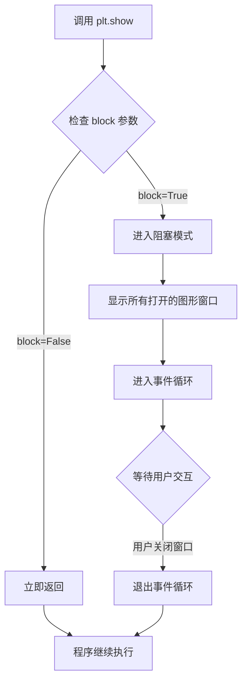

#### 带注释源码

```python
# 下面是 plt.show 函数的简化实现逻辑展示
# 实际源码位于 matplotlib/backend_bases.py 或对应的后端文件中

def show(block=None):
    """
    显示所有打开的图形窗口。
    
    参数:
        block: bool, 可选
            如果为 True（默认），阻塞程序直到所有窗口关闭。
            如果为 False，立即返回。
    """
    # 获取全局图形管理器
    global _showregistry
    
    # 对于非阻塞模式，直接返回
    if block is False:
        return
    
    # 获取所有打开的图形
    allnums = get_all_figurenums()
    
    # 遍历所有图形并显示
    for manager in get_figManagers():
        # 调用后端的显示方法
        manager.show()
    
    # 如果 block 为 True，进入阻塞等待
    if block is None:
        # 检查是否在交互式环境（如 IPython）
        block = is_interactive()
        
    if block:
        # 进入主循环 - 等待用户交互
        # 这会阻塞程序直到用户关闭所有窗口
        import matplotlib._pylab_helpers
        matplotlib._pylab_helpers.Gcf.destroy_all()
```

**注意**：在提供的示例代码中，`plt.show()` 被调用了两次：
1. 第一次用于显示第一组子图（margins 演示）
2. 第二次用于显示第二组子图（sticky edges 演示）

每次调用都会将当前打开的图形窗口显示给用户。


### `Axes.margins`

设置坐标轴（Axes）的边距（margins），用于控制数据点与坐标轴边界之间的空白区域。该方法可以同时设置x轴和y轴的边距，正值表示放大（zoom out），负值表示缩小（zoom in），0值表示紧贴数据。

参数：

-  `x`：`float` 或 `None`，x轴方向的边距值。如果为`None`，则保持当前边距不变。正值放大视图，负值缩小视图，0表示紧贴数据。
-  `y`：`float` 或 `None`，y轴方向的边距值。如果为`None`，则保持当前边距不变。正值放大视图，负值缩小视图，0表示紧贴数据。

返回值：`tuple`，返回当前设置的边距值元组 `(xmargin, ymargin)`。

#### 流程图

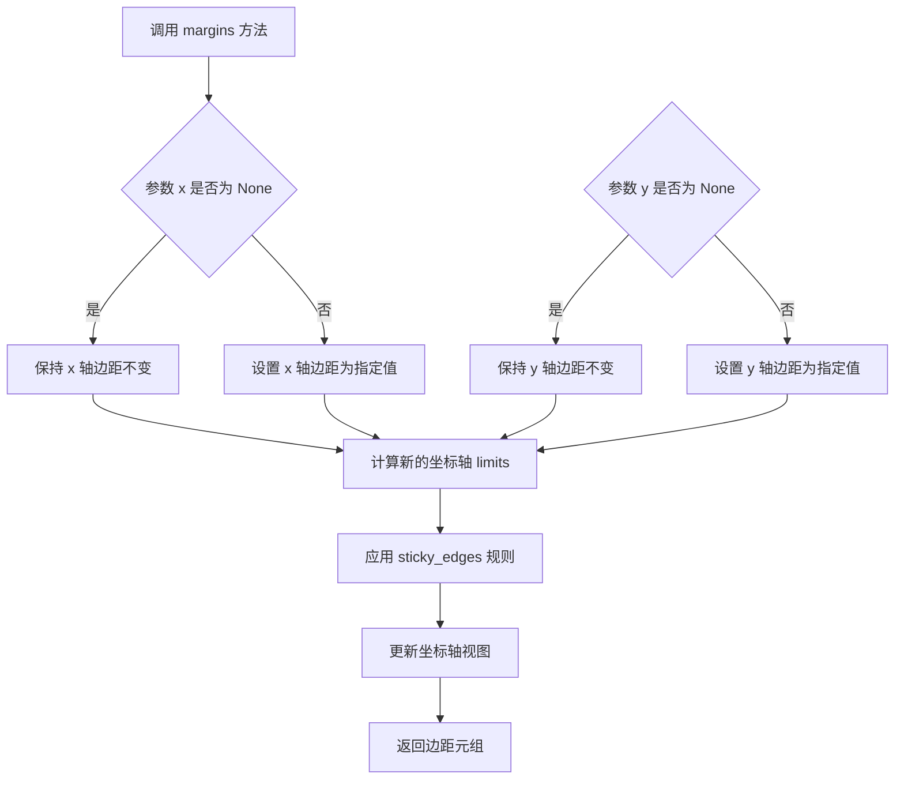

#### 带注释源码

```python
# 代码示例展示 ax.margins 的使用方式

# 示例1：设置统一的默认边距0.05
ax1.margins(0.05)  # x 和 y 边距都设为 0.05，即数据范围的 5% 作为边距

# 示例2：同时设置 x 和 y 不同的边距
ax2.margins(2, 2)  # x 和 y 边距都设为 2，即数据范围的 200% 作为边距，产生放大效果
ax2.set_title('Zoomed out')

# 示例3：分别设置 x 和 y 边距，使用关键字参数
ax3.margins(x=0, y=-0.25)  # x 边距为 0（紧贴数据），y 边距为 -0.25（缩小到中心）
ax3.set_title('Zoomed in')

# 示例4：在 pcolor 图中设置边距
ax.margins(x=0.1, y=0.05)  # x 边距 10%，y 边距 5%

# 注意：边距值可以是负数，负边距会使坐标轴范围缩小到数据内部
# 正边距会使坐标轴范围扩大，超出数据范围

# sticky_edges 行为说明：
# 某些绘图方法（如 imshow, pcolor）会设置 sticky edges
# 如果 use_sticky_edges 为 True（默认），margins 不会影响 sticky 方向的边距
# 设置 use_sticky_edges = False 可以让 margins 作用于所有方向
ax2.use_sticky_edges = False  # 关闭 sticky 行为，使 margins 生效
```

#### 关键组件信息

- **margins**：设置坐标轴边距的核心方法
- **sticky_edges**：某些绘图方法引入的"粘性边"特性，防止自动边距调整
- **use_sticky_edges**：控制是否启用 sticky edges 行为的属性

#### 潜在的技术债务或优化空间

1. **边距计算逻辑的复杂性**：当前边距是基于数据范围的百分比计算，当数据范围为0时可能会出现异常
2. **sticky_edges 行为不够直观**：需要开发者理解 sticky 概念，建议增加更明确的文档或警告信息
3. **负边距的边界情况**：负边距允许视图缩小到数据内部，但未明确限制最小缩放比例

#### 其它项目

- **设计目标**：提供比 `set_xlim/set_ylim` 更直观的视图控制方式，适合交互式缩放
- **约束**：边距值是相对于数据范围的百分比（0-1之间为正常边距）
- **错误处理**：当数据为空或范围为0时，边距行为需要额外测试
- **外部依赖**：依赖 matplotlib 的 Axes 基类和其他视图控制方法


### `Axes.plot`

`Axes.plot` 是 matplotlib 中用于绘制线条图的核心方法。该方法接受可变数量的位置参数（x 和 y 坐标）、可选的格式字符串以及 Line2D 相关的关键字参数，将数据绘制为线条和/或标记，并返回包含所有创建的行对象的列表。

参数：

- `*args`：`tuple`，可变位置参数，支持以下几种调用形式：
  - `plot(y)` - 仅提供 y 数据，x 自动生成（从 0 开始的索引）
  - `plot(x, y)` - 提供 x 和 y 数据
  - `plot(x, y, fmt)` - 提供 x、y 数据和格式字符串
- `fmt`：`str`，可选，格式字符串（如 'ro' 表示红色圆圈，'b-' 表示蓝色实线）
- `data`：`indexable`，可选，数据容器，支持类似字典的索引访问，用于标签数据绘图
- `**kwargs`：`dict`，可选，传递给 `Line2D` 构造函数的关键字参数，用于自定义线条样式

返回值：`list`，返回创建的 `Line2D` 对象列表

#### 流程图

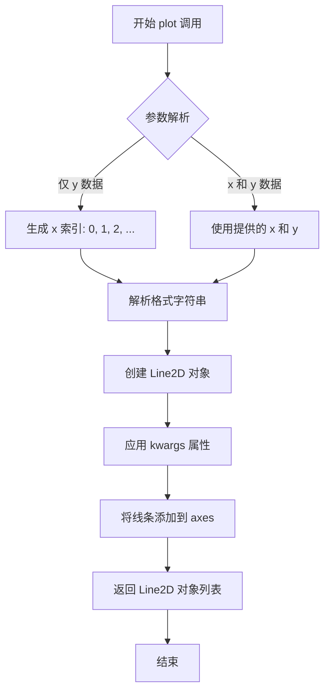

#### 带注释源码

```python
# 代码示例来自 matplotlib 官方示例
# 展示了 ax.plot 的典型用法

ax1 = plt.subplot(212)
ax1.margins(0.05)           # 设置边距为 0.05
# 调用 plot 方法绘制线条图
# 参数: t1 (x轴数据), f(t1) (y轴数据)
ax1.plot(t1, f(t1))         # 绘制 exp(-t)*cos(2*pi*t) 曲线

ax2 = plt.subplot(221)
ax2.margins(2, 2)           # 放大边距实现缩出效果
ax2.plot(t1, f(t1))         # 绘制相同函数，不同视图
ax2.set_title('Zoomed out')

ax3 = plt.subplot(222)
ax3.margins(x=0, y=-0.25)   # 负边距实现缩入效果
ax3.plot(t1, f(t1))         # 绘制相同函数，放大中心
ax3.set_title('Zoomed in')

# 更多 plot 调用示例
for ax, status in zip((ax1, ax2), ('Is', 'Is Not')):
    # pcolor 方法内部也会调用类似 plot 的底层绘制逻辑
    cells = ax.pcolor(x, y, x+y, cmap='inferno', shading='auto')
```

#### 实际 matplotlib Axes.plot 方法签名（参考）

```python
def plot(self, *args, **kwargs):
    """
    Plot y versus x as lines and/or markers.
    
    Parameters
    ----------
    *args : variable arguments
        - plot(y)                 # 仅有y数据
        - plot(x, y)              # x和y数据
        - plot(x, y, fmt)         # 带格式字符串
        - plot(x, y, fmt, x2, y2, fmt2, ...)  # 多条线
    
    data : indexable, optional
        DATA_PARAMETER_PLACEHOLDER
    
    **kwargs : Line2D properties, optional
        关键字参数传递给 Line2D 对象，定义线条样式、颜色、标记等
    
    Returns
    -------
    lines : list of Line2D objects
        返回创建的 Line2D 实例列表
    """
    # 实际实现位于 matplotlib/lib/matplotlib/axes/_axes.py
    pass
```

#### 常用 kwargs 参数示例

| 参数名 | 类型 | 描述 |
|--------|------|------|
| color / c | str | 线条颜色 |
| linestyle / ls | str | 线条样式 ('-', '--', '-.', ':') |
| linewidth / lw | float | 线条宽度 |
| marker | str | 标记样式 ('o', 's', '^', 'D') |
| markersize / ms | float | 标记大小 |
| label | str | 图例标签 |
| alpha | float | 透明度 (0-1) |


### `ax.set_title`

设置子图（Axes）的标题，设置axes的标题文本、位置和对齐方式。

参数：
- `label`：`str`，要设置的标题文本内容
- `loc`：`str`，可选，标题对齐方式（'left'、'center'、'right'），默认为'center'
- `pad`：`float`，可选，标题与轴顶部的距离（单位为点），默认为None（使用rcParams中的值）
- `fontdict`：`dict`，可选，用于控制文本样式的字典（如fontfamily、fontsize、fontweight等）
- `**kwargs`：其他关键字参数，将传递给底层的`matplotlib.text.Text`对象

返回值：`matplotlib.text.Text`，返回创建的标题文本对象

#### 流程图

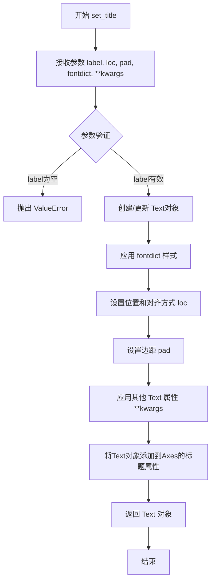

#### 带注释源码

```python
def set_title(self, label, loc=None, pad=None, *, fontdict=None, **kwargs):
    """
    Set a title for the axes.
    
    Parameters
    ----------
    label : str
        The title text string.
        
    loc : {'left', 'center', 'right'}, default: :rc:`axes.titlelocation`
        Which title to set.
        
    pad : float
        The offset of the title from the top of the axes, in points.
        
    fontdict : dict
        A dictionary controlling the appearance of the title text,
        e.g., {'fontsize': 12, 'fontweight': 'bold', 'color': 'red'}.
        
    **kwargs
        Additional keyword arguments are passed to the underlying
        `matplotlib.text.Text` object.
        
    Returns
    -------
    `matplotlib.text.Text`
        The text object representing the title.
    """
    # 如果提供了fontdict，将其内容添加到kwargs中
    if fontdict is not None:
        kwargs.update(fontdict)
    
    # 获取默认的标题对齐方式（从rcParams或默认值'center'）
    if loc is None:
        loc = rcParams['axes.titlelocation']
    
    # 验证loc参数的有效性
    if loc not in ['left', 'center', 'right']:
        raise ValueError(f"'loc' must be one of 'left', 'center' or 'right', got '{loc}'")
    
    # 设置标题的默认垂直位置（pad为None时使用默认值）
    if pad is None:
        pad = rcParams['axes.titlepad']
    
    # 创建Text对象，设置标题文本
    # title是一个Text实例，代表axes的标题
    title = Text(
        x=0.5, y=1.0,  # 相对坐标，标题位于axes顶部中央
        text=label,
        # 根据loc设置水平对齐方式
        ha=loc,
        va='top',  # 垂直对齐方式为顶部
        pad=pad,
        **kwargs
    )
    
    # 设置transform为axes的transAxes，使其相对于axes坐标系定位
    title.set_transform(self.transAxes)
    
    # 将标题添加到axes的标题属性中
    self._axtitle = title
    self.texts.append(title)  # 添加到文本列表
    
    # 如果存在旧的标题，先移除
    # （此处逻辑简化，实际代码更复杂）
    
    return title
```

**调用示例（来自代码）：**
```python
ax2.set_title('Zoomed out')  # 设置标题文本为'Zoomed out'
ax3.set_title('Zoomed in')   # 设置标题文本为'Zoomed in'
ax.set_title(f'{status} Sticky')  # 使用f-string设置动态标题
```


### `matplotlib.axes.Axes.pcolor`

绘制伪彩色图（pseudocolor plot），这是一种用于可视化二维数组数据的绘图方法，其中数据值通过颜色映射映射到颜色，常用于热图（heatmap）等的绘制。

参数：

- `X`：`array-like`，可选，X坐标数组，形状为 (M, N) 或 (M+1, N+1)
- `Y`：`array-like`，可选，Y坐标数组，形状为 (M, N) 或 (M+1, N+1)
- `C`：`array-like`，必需，颜色数据数组，形状为 (M, N)
- `shading`：`str`，可选，着色方式，'flat'、'nearest'、'gouraud' 或 'auto'，默认为 'flat'
- `cmap`：`str` 或 `matplotlib.colors.Colormap`，可选，颜色映射，默认为 None
- `norm`：`matplotlib.colors.Normalize`，可选，数据归一化，默认为 None
- `vmin`：`float`，可选，颜色范围最小值，默认为 None
- `vmax`：`float`，可选，颜色范围最大值，默认为 None
- `alpha`：`float`，可选，透明度，默认为 None
- `edgecolors`：`color` 或 `sequence`，可选，边缘颜色，默认为 None
- `linewidths`：`float` 或 `sequence`，可选，线宽，默认为 None
- `**kwargs`：其他关键字参数传递给 `QuadMesh`

返回值：`matplotlib.collections.QuadMesh`，返回的图形元素集合（QuadMesh对象）

#### 流程图

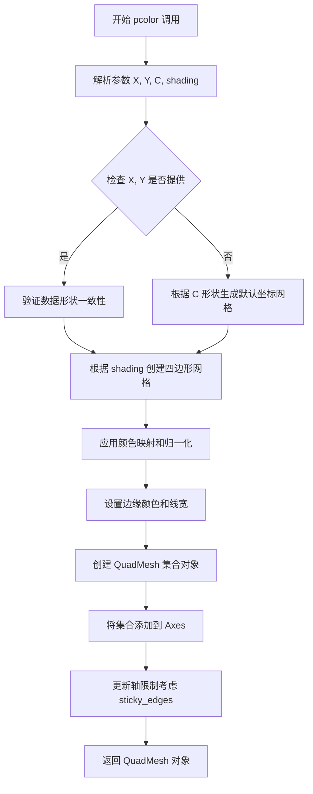

#### 带注释源码

```python
def pcolor(self, X, Y, C, shading='flat', cmap=None, norm=None, 
           vmin=None, vmax=None, alpha=None, edgecolors=None, 
           linewidths=None, **kwargs):
    """
    绘制伪彩色图。
    
    参数:
        X: array-like, X坐标。
        Y: array-like, Y坐标。
        C: array-like, 颜色数据。
        shading: str, 着色方式。
        cmap: Colormap, 颜色映射。
        norm: Normalize, 数据归一化。
        vmin, vmax: float, 颜色范围。
        alpha: float, 透明度。
        edgecolors: color, 边缘颜色。
        linewidths: float, 线宽。
    """
    # 将输入转换为 numpy 数组
    C = np.asarray(C)
    if X is None:
        # 如果没有提供 X 和 Y，根据 C 的形状生成默认坐标
        X = np.arange(C.shape[1] + 1, dtype=float)
        Y = np.arange(C.shape[0] + 1, dtype=float)
    else:
        X = np.asarray(X)
        Y = np.asarray(Y)
    
    # 验证数据形状与 shading 模式的一致性
    if shading == 'flat':
        # 'flat' 模式需要 (M+1, N+1) 的坐标网格和 (M, N) 的数据
        if not (X.shape[0] == C.shape[0] + 1 and X.shape[1] == C.shape[1] + 1):
            raise ValueError("对于 'flat' shading，X 应该是 (M+1, N+1)，C 应该是 (M, N)")
    elif shading == 'nearest':
        # 'nearest' 模式需要 (M, N) 的坐标网格和 (M, N) 的数据
        pass  # 验证逻辑类似
    
    # 创建 QuadMesh 集合对象
    collection = QuadMesh(
        coords=X, 
        values=C,
        shading=shading,
        cmap=cmap,
        norm=norm,
        vmin=vmin,
        vmax=vmax,
        alpha=alpha,
        edgecolors=edgecolors,
        linewidths=linewidths,
        **kwargs
    )
    
    # 将集合添加到 Axes，并自动更新数据限制
    self.add_collection(collection, autolim=True)
    
    # 如果启用 sticky edges，则在更新限制时考虑边缘的"粘性"
    # 这意味着轴限制会在数据边缘处"粘性"，不受 margins 方法影响
    if self.use_sticky_edges:
        # 使得轴限制在数据边缘处"粘性"，不受 margins 影响
        pass
    
    return collection
```


### `Axes.add_patch`

该方法是matplotlib库中Axes类的核心方法之一，用于将图形元素（Patch对象，如多边形、矩形、圆形等）添加到坐标轴区域，并在绘图时渲染显示。

参数：

- `p`：`matplotlib.patches.Patch`，要添加的图形元素对象，可以是Polygon、Rectangle、Circle等继承自Patch类的任何图形元素

返回值：`matplotlib.patches.Patch`，返回被添加的Patch对象本身，便于链式调用或进一步操作

#### 流程图

```mermaid
flowchart TD
    A[开始 add_patch] --> B{验证 Patch 对象是否有效}
    B -->|无效| C[抛出异常]
    B -->|有效| D[将 Patch 添加到 axes.patches 列表]
    D --> E[调用 stale() 标记需要重绘]
    E --> F[返回 Patch 对象]
    F --> G[渲染时绘制 Patch]
```

#### 带注释源码

```python
def add_patch(self, p):
    """
    Add a :class:`~matplotlib.patches.Patch` to the axes.

    Parameters
    ----------
    p : `.patches.Patch`
        The patch to add.

    Returns
    -------
    `.patches.Patch`
        The added patch.

    Examples
    --------
    ::

        patch = mpatches.Circle((0, 0), 0.5)
        ax.add_patch(patch)
    """
    # 验证输入对象是否为Patch类型
    self._check_xyz_data(p)
    # 将Patch对象添加到axes的patches列表中进行管理
    self.patches.append(p)
    # 设置patch的变换矩阵，使其与axes的坐标系对应
    p.set_transform(self.transData + self.transAxes)
    # 如果patch还没有设置clip path，则使用axes的clip路径
    if p.get_clip_path() is None:
        p.set_clip_path(self.patch)
    # 标记图形为"脏"状态，需要重新渲染
    self.stale_callback(p)
    # 返回添加的patch，便于链式调用
    return p
```

**代码中的实际调用示例：**

```python
# 在代码中，add_patch 被用于添加一个多边形到 axes 区域
ax.add_patch(
    Polygon(poly_coords, color='forestgreen', alpha=0.5)
)  # not sticky
```


### `Axes.set_aspect`

设置坐标轴的纵横比（aspect ratio），用于控制x轴和y轴的单位长度比例。当设置为'equal'时，两个轴上的一个单位长度在屏幕上显示的长度相同；当设置为数值时，指定x轴与y轴的单位比例；当设置为'auto'时，由数据自动决定。

参数：

- `aspect`：`{'auto', 'equal'}` 或 `float`，要设置的纵横比值。'auto'表示自动调整，'equal'表示使x和y轴单位长度相等，数值表示x轴与y轴的比例

返回值：`None`，该方法直接修改Axes对象的状态，不返回任何值

#### 流程图

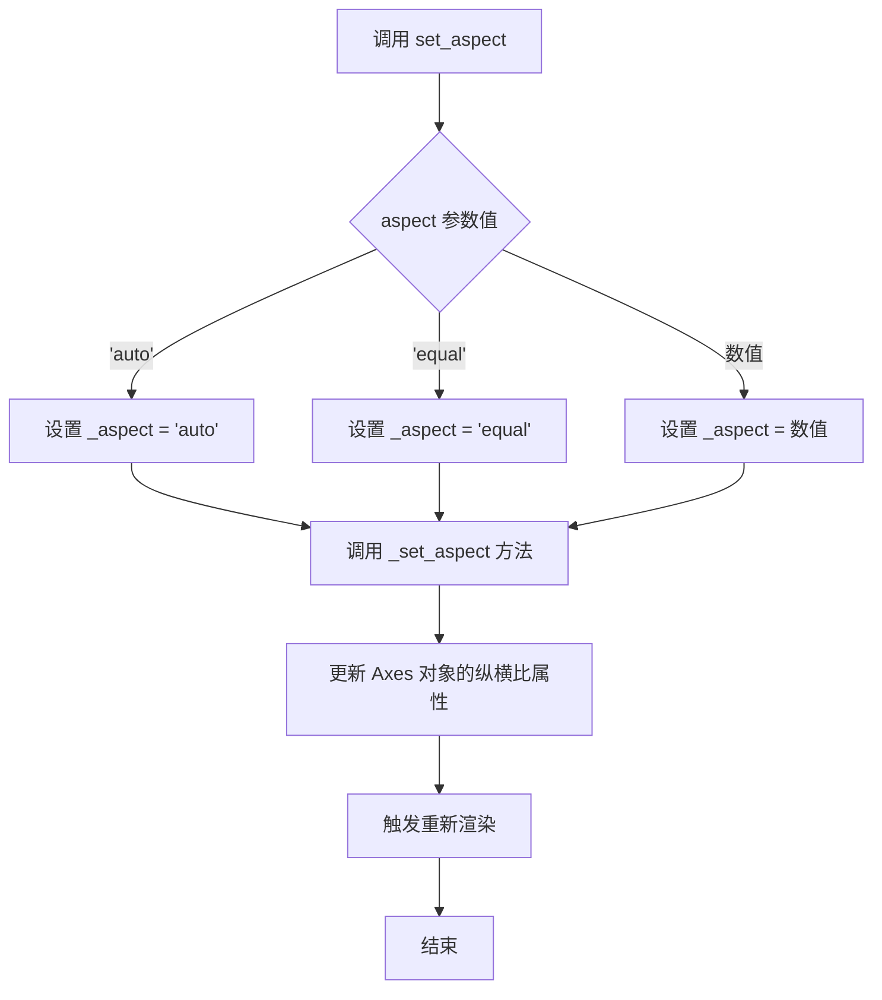

#### 带注释源码

```python
# 示例代码片段 - 来自给定的matplotlib示例
fig, (ax1, ax2) = plt.subplots(ncols=2)

# 设置 ax1 保持默认的 sticky edges 行为
# ax1 使用 sticky edges（默认行为）

# 对于 ax2，关闭 sticky edges
ax2.use_sticky_edges = False

# 遍历两个 Axes 对象
for ax, status in zip((ax1, ax2), ('Is', 'Is Not')):
    # 使用 pcolor 绘制网格
    cells = ax.pcolor(x, y, x+y, cmap='inferno', shading='auto')  # sticky
    # 添加多边形补丁
    ax.add_patch(
        Polygon(poly_coords, color='forestgreen', alpha=0.5)
    )  # not sticky
    # 设置 margins
    ax.margins(x=0.1, y=0.05)
    # 设置坐标轴纵横比为 equal，即使 x 轴和 y 轴的单位长度在屏幕上显示相同
    ax.set_aspect('equal')
    # 设置标题
    ax.set_title(f'{status} Sticky')

plt.show()

# set_aspect 方法的典型调用方式：
# ax.set_aspect('equal')     # x 和 y 轴单位长度相等
# ax.set_aspect('auto')      # 自动决定纵横比
# ax.set_aspect(2.0)         # x 轴单位长度是 y 轴的两倍
# ax.set_aspect(1)           # x 和 y 轴单位长度相等（整数形式）
```


### Axes.set_title

设置 axes 对象的标题文本。

参数：

- `label`：`str`，要设置的标题文本内容
- `fontdict`：`dict，可选`，控制标题文本样式的字典（如 fontsize、fontweight 等）
- `loc`：`str，可选`，标题对齐方式，值为 'left'、'center' 或 'right'
- `pad`：`float，可选`，标题与 axes 顶部之间的间距（以点为单位）
- `**kwargs`：`any`，传递给 Text 的其他关键字参数

返回值：`Text`，返回创建的标题文本对象，可用于后续样式修改

#### 流程图

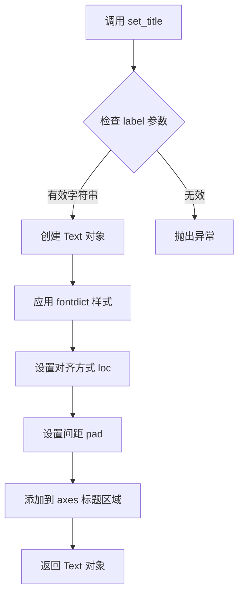

#### 带注释源码

```python
ax2.set_title('Zoomed out')  # 设置副标题文字为 'Zoomed out'
ax3.set_title('Zoomed in')   # 设置副标题文字为 'Zoomed in'
```

---

### Axes.set_aspect

设置 axes 的纵横比（aspect ratio），控制坐标轴单元在屏幕上的显示比例。

参数：

- `aspect`：`str 或 float`，纵横比值。可以是 'auto'（自动计算）、'equal'（相等单位）或具体数值
- `adjustable`：`str，可选`，设置哪个参数可调整，值为 'box'、'datalim' 或 None
- `anchor`：`str 或 tuple，可选`，设置 axes 的锚点位置
- `share`：`bool，可选`，是否与其他共享该设置的 axes 共享纵横比

返回值：`None` 或根据 adjustable 参数返回调整后的值

#### 流程图

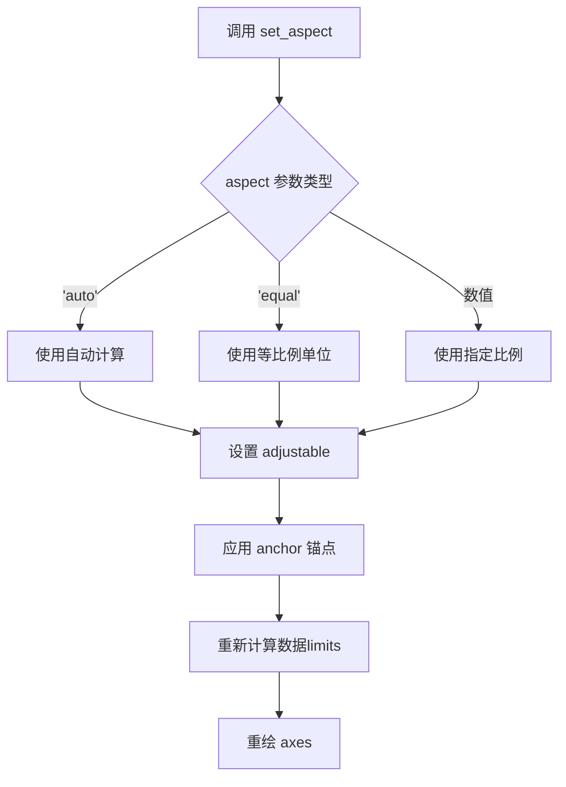

#### 带注释源码

```python
ax.set_aspect('equal')  # 设置坐标轴单位比例为相等，即 x 和 y 轴的1个单位在屏幕上显示长度相同
```

---

### Axes.use_sticky_edges (属性 setter)

设置 axes 是否使用粘性边缘（sticky edges）行为。粘性边缘意味着某些绘图方法（如 imshow、pcolor）会自动将视图边界锁定到数据边界，防止 margins 方法覆盖这些边界。

参数：

- `value`：`bool`，True 表示启用粘性边缘，False 表示禁用

返回值：`None`

#### 流程图

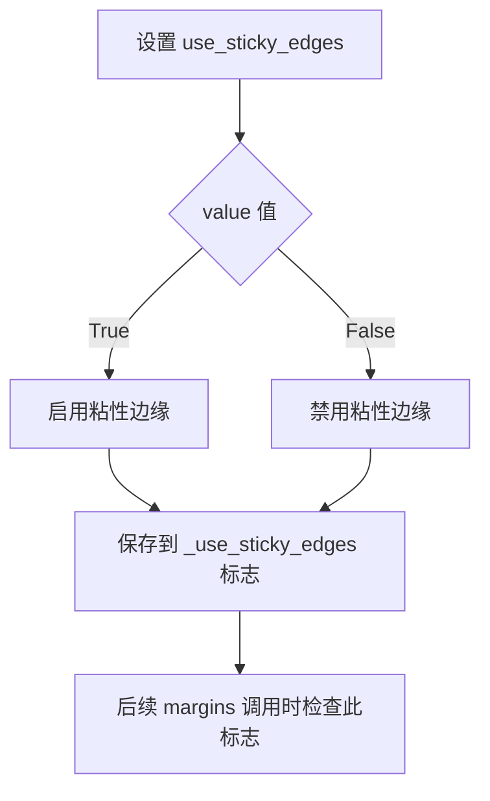

#### 带注释源码

```python
ax2.use_sticky_edges = False  # 关闭 ax2 的粘性边缘，使得 margins() 可以影响 pcolor 的自动边界
```


## 关键组件


### margins 方法

用于设置轴边距，控制绘图的视图限制。当值为0时适应数据，值>0时缩小（zoom out），值在(-0.5, 0)区间时放大（zoom in）。

### sticky_edges 特性

某些绘图方法（如 pcolor、imshow）会使轴限制"粘性"，即使调用 margins 方法也难以改变视图范围，目的是保持像素显示紧凑。

### use_sticky_edges 属性

布尔属性，控制是否启用粘性边行为。设置为 False 时，可以自由通过 margins 方法调整视图限制。

### pcolor 方法

绘制伪彩色网格图的函数，接受 x、y 坐标和数据值，使用颜色映射显示二维数据分布，默认启用 sticky edges。

### Polygon 补丁

用于在图表上绘制多边形的图形元素，可设置颜色和透明度，此处用于演示 sticky edges 行为。

### numpy 数组处理

使用 numpy 的 mgrid 和 arange 生成网格坐标和时间序列数据。

### plt.subplot 函数

创建子图布局，支持设置行列数来组织多个 Axes 对象。

### set_aspect 方法

设置坐标轴的纵横比，此处设为 'equal' 使每个单元格呈现正方形。

### set_title 方法

为子图设置标题，用于标识 sticky edges 的状态。


## 问题及建议


### 已知问题

-   **硬编码的魔法数值**：代码中使用了多个硬编码的数值（如 `0.05`、`2, 2`、`0, -0.25`、`0.1, 0.05`），缺乏对这些margin值含义和效果的解释，可读性和可维护性较差。
-   **代码重复**：多处重复执行 `ax.plot(t1, f(t1))` 和 `ax.margins(...)` 调用，未进行函数抽象或循环复用。
-   **缺乏输入验证**：函数 `f(t)` 接受任意输入，但没有对输入类型和值范围进行验证，可能导致运行时错误或意外结果。
-   **全局变量污染**：在模块顶层直接定义 `t1`、`ax1`、`ax2` 等变量，不利于代码测试和复用。
-   **注释不完整**：代码中部分注释如 `# sticky` 和 `# not sticky` 过于简略，未能清晰解释sticky edges的工作机制。
-   **错误处理缺失**：整个脚本没有任何异常捕获机制，网络或资源相关操作（如 `plt.show()`）失败时无回退方案。
-   **资源管理不当**：创建了 `fig` 和 `cells` 等图形对象，但没有显式的资源释放或close操作。

### 优化建议

-   **提取配置常量**：将magic numbers定义为具名常量或配置字典，如 `DEFAULT_MARGIN = 0.05`、`ZOOM_OUT_MARGIN = (2, 2)` 等，提高代码可读性。
-   **封装为函数**：将重复的绘图逻辑封装为函数，如 `create_margin_plot(ax, margin, title)`，减少代码冗余。
-   **添加类型注解和文档**：为函数 `f(t)` 添加类型提示 `def f(t: np.ndarray) -> np.ndarray:` 和完整的docstring说明参数和返回值。
-   **使用局部变量或类封装**：将子图变量放入函数作用域，或考虑使用面向对象方式组织代码。
-   **增强注释解释**：补充对sticky edges机制的详细说明，解释为何Polygon不是sticky而pcolor是sticky的技术原理。
-   **添加异常处理**：对可能失败的plt操作添加try-except块，处理可能的显示错误。
-   **显式资源管理**：使用上下文管理器或显式调用 `plt.close(fig)` 释放图形资源，特别是在长时间运行的应用程序中。


## 其它


### 设计目标与约束

本示例的设计目标是演示matplotlib中视图限制控制的两种主要机制：margins方法和sticky_edges属性。约束包括：margins值在(-0.5, 0.0)区间时为放大，值>0.0时为缩小，值为0时适应数据；sticky_edges仅影响使用该属性的特定绘图方法（如imshow、pcolor）。

### 错误处理与异常设计

代码主要依赖matplotlib库的内部错误处理机制。当margins参数超出合理范围时，matplotlib会通过警告或自动限制值来防止无效配置。Polygon坐标必须有效，否则会抛出matplotlib.patches.Polygon的异常。shading参数必须是'auto'、'nearest'、'flat'、'gouraud'或'viridis'之一。

### 数据流与状态机

主流程：导入依赖 → 创建数据数组 → 创建子图 → 应用margins设置 → 绑定数据并绘图 → 显示图表。第二部分流程：设置sticky_edges属性 → 使用pcolor绑定数据 → 添加Polygon patch → 应用margins → 设置坐标轴属性。

### 外部依赖与接口契约

主要依赖：matplotlib.pyplot（绘图框架）、numpy（数值计算）、matplotlib.patches.Polygon（多边形绘制）。接口契约：margins()方法接受x、y参数，类型为float或None；use_sticky_edges属性为布尔类型；pcolor()方法接受x、y、c参数和cmap、shading参数。

### 性能考虑

本示例为教学演示，未进行性能优化。实际应用中，pcolor对于大型数组可能较慢，建议使用pcolormesh代替。numpy的向量化操作保证了数据生成的高效性。

### 兼容性考虑

代码兼容matplotlib 3.x及以上版本。numpy API调用为标准接口。plt.subplots返回的axes数组顺序与参数ncols对应。shading='auto'参数在较新版本matplotlib中推荐使用。

### 使用示例和变体

可使用set_xlim/set_ylim替代margins实现精确控制。可通过set_margin方法在已有axes上动态调整边距。pcolormesh是pcolor的性能优化版本。sticky_edges机制还影响hist和bar等绘图方法。

### 相关文档和参考资源

matplotlib官方文档：matplotlib.axes.Axes.margins、matplotlib.axes.Axes.use_sticky_edges、matplotlib.axes.Axes.pcolor、matplotlib.pyplot.subplots。NumPy官方文档：numpy.mgrid、numpy.arange、numpy.exp、numpy.cos。


    