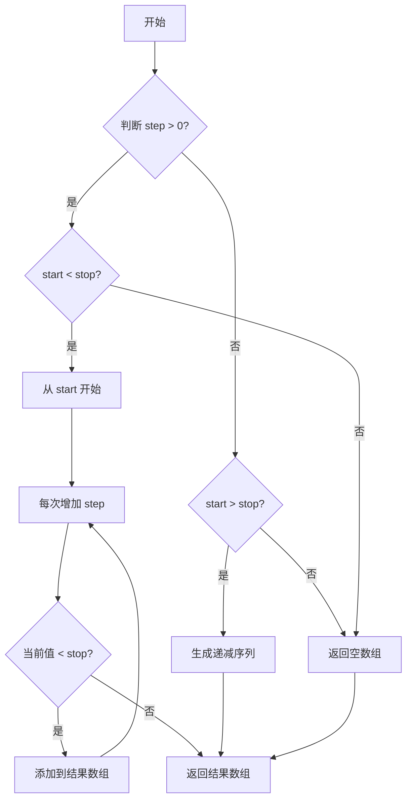
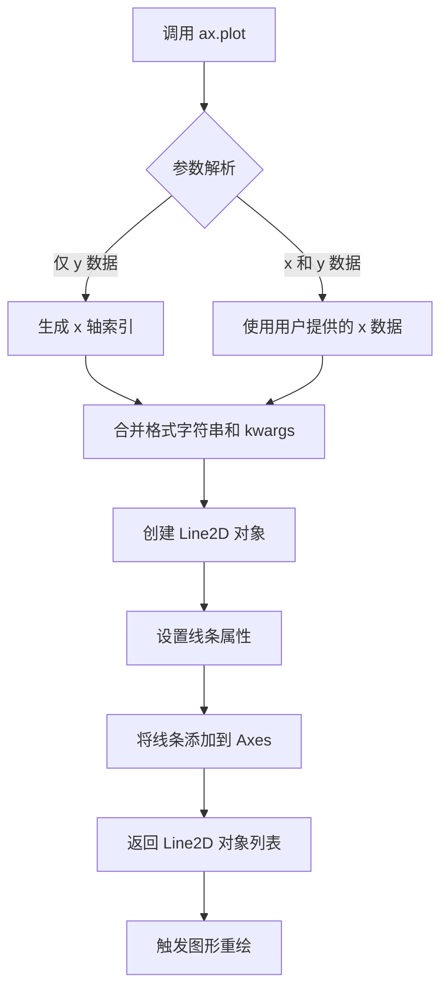
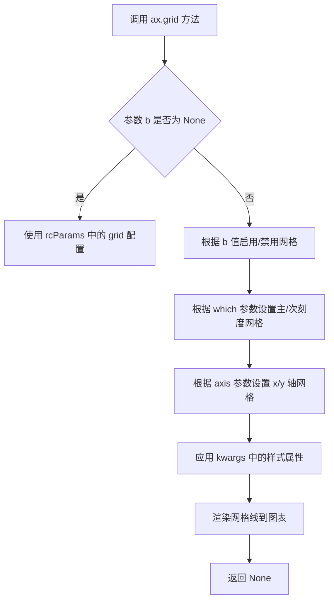
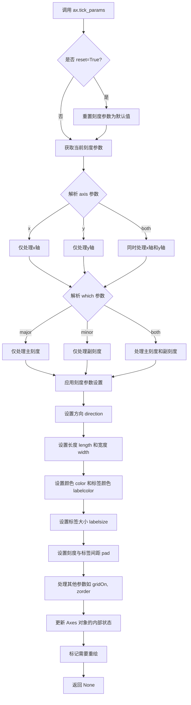
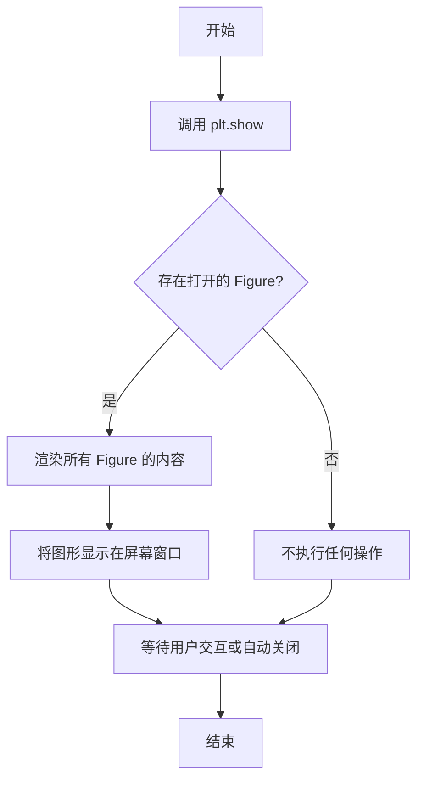

# `matplotlib\galleries\examples\subplots_axes_and_figures\axes_props.py` 详细设计文档

这是一个matplotlib示例脚本，演示如何创建正弦波图表并自定义坐标轴的刻度和网格属性，包括设置网格线样式和刻度标签颜色、大小等。

## 整体流程

```mermaid
graph TD
    A[开始] --> B[导入 matplotlib.pyplot 和 numpy]
    B --> C[生成时间数组 t: 0.0 到 2.0，步长 0.01]
    C --> D[计算正弦波数据 s = sin(2πt)]
    D --> E[创建画布 fig 和坐标轴 ax]
    E --> F[在坐标轴上绘制 t-s 曲线]
    F --> G[设置网格: linestyle='-.' ]
    G --> H[设置刻度参数: 标签颜色='r', 标签大小='medium', 宽度=3]
    H --> I[显示图表 plt.show()]
    I --> J[结束]
```

## 类结构

```
此代码为脚本形式，无自定义类层次结构
仅使用第三方库: matplotlib.pyplot, numpy
```

## 全局变量及字段


### `t`
    
时间数组，从0.0到2.0，步长0.01

类型：`numpy.ndarray`
    


### `s`
    
对应时间t的正弦波数据

类型：`numpy.ndarray`
    


### `fig`
    
图形画布对象

类型：`matplotlib.figure.Figure`
    


### `ax`
    
坐标轴对象

类型：`matplotlib.axes.Axes`
    


    

## 全局函数及方法


### `np.arange`

生成等间隔数组的函数，返回一个包含从起始值到结束值（不包含）的等间隔数值的 ndarray。

参数：

- `start`：`float`，可选，起始值，默认为 0.0
- `stop`：`float`，结束值（不包含）
- `step`：`float`，可选，步长，默认为 1.0

返回值：`numpy.ndarray`，包含等间隔数值的数组

#### 流程图



#### 带注释源码

```python
# np.arange 函数源码示例（简化版）
def arange(start=0.0, stop=None, step=1.0):
    """
    生成等间隔数组
    
    参数:
        start: 起始值，默认为0.0
        stop: 结束值（不包含）
        step: 步长，默认为1.0
    
    返回:
        ndarray: 等间隔数值数组
    """
    # 处理单个参数情况（只有stop）
    if stop is None:
        stop = start
        start = 0.0
    
    # 计算数组长度
    num = int(np.ceil((stop - start) / step)) if step != 0 else 0
    
    # 生成数组
    return np.linspace(start, start + (num - 1) * step, num, endpoint=True)
```


### np.sin

计算输入数组或标量的正弦值（sin），返回对应角度（弧度制）的正弦结果。

参数：

- `x`：`ndarray` 或 `float`，输入角度（以弧度为单位），可以是标量或数组

返回值：`ndarray` 或 `float`，输入角度的正弦值，类型与输入相同

#### 流程图

```mermaid
graph LR
    A[输入 x] --> B{判断输入类型}
    B -->|标量| C[计算 sin(x)]
    B -->|数组| D[逐元素计算 sin]
    C --> E[返回标量结果]
    D --> F[返回数组结果]
```

#### 带注释源码

```python
# np.sin 函数实现原理（基于 NumPy 源码概念）
# 注意：这是解释性代码，非实际源码

def sin(x):
    """
    计算正弦值
    
    参数:
        x: 输入角度，弧度制
            - 可以是单个数值（标量）
            - 也可以是数组（ndarray）
    
    返回:
        输入角度对应的正弦值
            - 标量输入返回标量
            - 数组输入返回同形状数组
    """
    # NumPy 内部使用 C/Fortran 实现的数学库（如 libsin）
    # 这里简化展示逻辑流程
    
    # 1. 将输入转换为弧度（如果需要）
    # 2. 调用底层 C 函数计算正弦
    # 3. 返回结果
    
    # 实际使用示例：
    import numpy as np
    
    # 标量计算
    result_scalar = np.sin(np.pi / 2)  # 返回 1.0
    
    # 数组计算
    angles = np.array([0, np.pi/2, np.pi])
    result_array = np.sin(angles)  # 返回 [0. 1. 0.]
    
    return result
```

---

### 补充信息

在给定代码中的实际使用：

```python
t = np.arange(0.0, 2.0, 0.01)  # 生成时间数组 [0, 0.01, 0.02, ..., 1.99]
s = np.sin(2 * np.pi * t)      # 计算正弦波：2πt 的正弦值
```

- **输入**：`2 * np.pi * t`（频率为 1Hz 的正弦波的弧度值）
- **输出**：`s`（对应时刻的正弦幅值，范围 [-1, 1]）
- **物理意义**：生成标准的正弦波信号，频率为 1Hz，周期为 1秒


### `plt.subplots`

创建画布（Figure）和坐标轴（Axes），返回图形对象和坐标轴对象，支持创建单个或多个子图布局。

参数：

- `nrows`：`int`，子图的行数，默认为 1
- `ncols`：`int`，子图的列数，默认为 1
- `sharex`：`bool or str`，是否共享 X 轴，默认为 False
- `sharey`：`bool or str`，是否共享 Y 轴，默认为 False
- `squeeze`：`bool`，是否压缩返回的 axes 数组维度，默认为 True
- `figsize`：`tuple`，图形尺寸，格式为（宽度，高度），单位英寸
- `dpi`：`int`，图形分辨率，默认为 100
- `facecolor`：`str`，图形背景颜色
- `edgecolor`：`str`，图形边框颜色
- `linewidth`：`float`，边框线宽
- `frameon`：`bool`，是否显示边框
- `sharex`、`sharey`：`bool or str`，控制子图之间的坐标轴共享
- `subplot_kw`：`dict`，传递给 `add_subplot` 的关键字参数
- `gridspec_kw`：`dict`，传递给 GridSpec 的关键字参数

返回值：`tuple`，返回 (fig, ax) 元组，其中 fig 为 `matplotlib.figure.Figure` 对象，ax 为 `matplotlib.axes.Axes` 对象（当 squeeze=False 或 nrows*ncols>1 时返回 Axes 数组）

#### 流程图

```mermaid
flowchart TD
    A[开始 plt.subplots 调用] --> B{检查参数 nrows, ncols}
    B --> C[创建 Figure 对象]
    C --> D[根据 gridspec_kw 创建 GridSpec]
    D --> E[循环创建 SubplotSpec]
    E --> F[调用 Figure.add_subplot 创建 Axes]
    F --> G{处理 squeeze 参数}
    G -->|True and 单子图| H[返回压缩后的 Axes]
    G -->|False or 多子图| I[返回 Axes 数组]
    H --> J[返回 (fig, ax) 元组]
    I --> J
```

#### 带注释源码

```python
import matplotlib.pyplot as plt
import numpy as np

# 1. 导入所需库
#    - matplotlib.pyplot: 提供绘图接口
#    - numpy: 用于生成数值数据

# 2. 准备数据
t = np.arange(0.0, 2.0, 0.01)  # 生成时间序列，从0到2秒，步长0.01
s = np.sin(2 * np.pi * t)      # 生成正弦波信号

# 3. 创建画布和坐标轴
#    fig: 整个图形对象（画布）
#    ax: 坐标轴对象，用于绘制数据
fig, ax = plt.subplots()       # 等价于 fig, ax = plt.subplots(nrows=1, ncols=1)

# 4. 在坐标轴上绑制数据
ax.plot(t, s)                  # 绘制 t 和 s 的折线图

# 5. 设置坐标轴网格样式
ax.grid(True, linestyle='-.') # 启用网格，线型为点划线

# 6. 设置刻度标签样式
ax.tick_params(
    labelcolor='r',            # 标签颜色为红色
    labelsize='medium',        # 标签大小为中等
    width=3                   # 刻度线宽度为3
)

# 7. 显示图形
plt.show()                     # 阻塞模式显示图形，等待用户交互
```


### `Axes.plot`

`Axes.plot` 是 matplotlib 库中 `Axes` 类的核心方法，用于在坐标轴上绘制 y 相对于 x 的数据曲线，支持线条样式、颜色、标记等多种自定义选项，返回一个包含 `Line2D` 对象的列表。

参数：

- `*args`：可变参数，支持多种调用方式：
  - `plot(y)`：仅传入 y 轴数据，x 轴自动使用索引 (0, 1, 2, ...)
  - `plot(x, y)`：分别传入 x 和 y 轴数据
  - `plot(x, y, format_string)`：在数据后传入格式字符串（如 'ro' 表示红色圆形标记）
  - `plot(x, y, format_string, **kwargs)`：在格式字符串后传入关键字参数
- `**kwargs`：关键字参数，用于设置线条属性，包括但不限于：
  - `color` 或 `c`：线条颜色
  - `linewidth` 或 `lw`：线条宽度
  - `linestyle` 或 `ls`：线条样式（如 '-' 实线，'--' 虚线，':' 点线）
  - `marker`：标记样式
  - `markersize` 或 `ms`：标记大小
  - `label`：图例标签
  - 其它 Line2D 属性

返回值：`list[matplotlib.lines.Line2D]`，返回在 axes 上创建的线条对象列表，每个 `Line2D` 对象代表一条绘制的曲线。

#### 流程图



#### 带注释源码

```python
# 导入必要的库
import matplotlib.pyplot as plt
import numpy as np

# 生成数据：时间 t 从 0 到 2，步长 0.01
t = np.arange(0.0, 2.0, 0.01)
# 计算对应的正弦波数值
s = np.sin(2 * np.pi * t)

# 创建图形和坐标轴对象
fig, ax = plt.subplots()

# 调用 Axes.plot 方法绘制曲线
# 参数说明：
#   t: x 轴数据（时间）
#   s: y 轴数据（正弦值）
#   格式字符串（隐含）：默认蓝色实线 '-'
#   返回值：lines 是包含 Line2D 对象的列表
lines = ax.plot(t, s)

# 可选：访问返回的 Line2D 对象进行进一步自定义
line = lines[0]  # 获取第一个（也是唯一一个）线条对象
line.set_linewidth(2)  # 设置线条宽度
```

#### 关键组件信息

| 组件名称 | 描述 |
|---------|------|
| `Axes` | matplotlib 中的坐标轴容器，用于放置图形元素 |
| `Line2D` | 表示 2D 线条的图形对象，包含线条样式、颜色、标记等属性 |
| `matplotlib.pyplot` | MATLAB 风格的绘图接口，提供便捷的绘图函数 |

#### 潜在技术债务与优化空间

1. **格式字符串的使用**：matplotlib 官方推荐使用关键字参数（如 `color='red', marker='o'`）代替格式字符串（如 `'ro'`），以提高代码可读性和一致性
2. **显式返回值处理**：代码中未保存 `ax.plot()` 的返回值，在需要操作具体线条对象时应显式捕获
3. **数据验证**：未对输入数据进行类型和长度验证，可能在运行时产生意外错误

#### 其它项目

- **设计目标**：提供简单直观的 API 用于绘制二维数据曲线
- **约束**：x 和 y 数据长度必须一致（当两者都提供时）
- **错误处理**：当数据长度不匹配时抛出 `ValueError`；当格式字符串无效时抛出 `ValueError`
- **外部依赖**：NumPy（用于数据生成）、matplotlib 核心库


### `Axes.grid`

设置坐标轴的网格属性，用于控制是否显示网格线以及网格线的样式。

参数：

- `b`：`bool` 或 `None`，可选参数，表示是否显示网格线。默认为 `None`（使用 rcParams 中的设置）。
- `which`：`{'major', 'minor', 'both'}`，可选参数，控制网格线应用于主刻度线、次刻度线还是两者。默认为 `'major'`。
- `axis`：`{'both', 'x', 'y'}`，可选参数，控制网格线应用于哪个坐标轴。默认为 `'both'`。
- `**kwargs`：其他关键字参数，用于设置网格线的属性，如 `linestyle`、`linewidth`、`color`、`alpha` 等。

返回值：`None`，该方法无返回值，直接作用于当前 Axes 对象。

#### 流程图



#### 带注释源码

```python
# 导入必要的库
import matplotlib.pyplot as plt
import numpy as np

# 创建时间序列数据
t = np.arange(0.0, 2.0, 0.01)  # 从 0 到 2，步长 0.01
s = np.sin(2 * np.pi * t)      # 正弦波信号

# 创建图形和坐标轴对象
fig, ax = plt.subplots()

# 绘制正弦曲线
ax.plot(t, s)

# 设置网格属性
# 参数说明：
#   第一个参数 True: 启用网格显示
#   linestyle='-.': 设置网格线为点划线样式
ax.grid(True, linestyle='-.')

# 设置刻度标签属性
#   labelcolor='r': 标签颜色为红色
#   labelsize='medium': 标签大小为中等
#   width=3: 刻度线宽度为 3
ax.tick_params(labelcolor='r', labelsize='medium', width=3)

# 显示图形
plt.show()
```


### `ax.tick_params`

设置坐标轴刻度线（tick）和刻度标签（tick label）的各种视觉属性，包括刻度方向、长度、宽度、颜色、标签大小、标签颜色等。

参数：

- `axis`：`{'x', 'y', 'both'}`，可选参数，指定要设置哪个坐标轴的刻度参数，默认为 `'x'`
- `which`：`{'major', 'minor', 'both'}`，可选参数，指定要设置主刻度（major）、副刻度（minor）还是两者，默认为 `'major'`
- `reset`：`bool`，可选参数，如果为 `True`，则在设置新参数前重置为默认值，默认为 `False`
- `direction`：`{'in', 'out', 'inout'}`，可选参数，设置刻度线的方向（向内、向外或双向），默认为 `'out'`
- `length`：`float`，可选参数，设置刻度线的长度（以点为单位），默认为 `None`
- `width`：`float`，可选参数，设置刻度线的宽度（以点为单位），默认为 `None`
- `color`：`color`，可选参数，设置刻度线的颜色，默认为 `None`
- `pad`：`float`，可选参数，设置刻度线与刻度标签之间的距离（以点为单位），默认为 `None`
- `labelsize`：`float` 或 `str`，可选参数，设置刻度标签的字体大小，可以是数值（以点为单位）或字符串（如 `'small'`、`'medium'`、`'large'`），默认为 `None`
- `labelcolor`：`color`，可选参数，设置刻度标签的字体颜色，默认为 `None`
- `colors`：`color`，可选参数，同时设置刻度线和刻度标签的颜色，默认为 `None`
- `gridOn`：`bool`，可选参数，控制是否显示与该刻度相关的网格线，默认为 `None`（自动判断）
- `zorder`：`float`，可选参数，设置刻度线和标签的绘制顺序，默认为 `None`
- `**kwargs`：接受额外的关键字参数传递给文本属性设置器

返回值：`None`，该方法无返回值，直接修改 Axes 对象的属性

#### 流程图



#### 带注释源码

```python
# matplotlib/axes/_base.py 中的 tick_params 方法（简化版）

def tick_params(self, axis='x', which='major', reset=False, **kwargs):
    """
    Change the appearance of ticks, tick labels, and gridlines.
    
    Parameters
    ----------
    axis : {'x', 'y', 'both'}, default: 'x'
        Which axis to apply the parameters to.
    
    which : {'major', 'minor', 'both'}, default: 'major'
        The group of ticks for which the parameters are changed.
    
    reset : bool, default: False
        If True, remove all overrides before setting parameters.
    
    **kwargs
        Other parameters control the appearance of ticks, labels, etc.
        See the method docstring for a complete list.
    """
    # 如果 reset 为 True，先清除所有已保存的刻度参数
    if reset:
        # 重置为默认参数
        self._reset_tick_params()
    
    # 获取需要修改的轴（x轴、y轴或两者）
    xk = dict(
        x=self.xaxis,
        y=self.yaxis,
        both=(self.xaxis, self.yaxis),
    )[axis]
    
    # 获取需要修改的刻度类型（主刻度、副刻度或两者）
    which_key = {'major': 'major', 'minor': 'minor', 'both': 'both'}[which]
    
    # 遍历所有需要修改的轴
    for ax in (self.xaxis, self.yaxis):
        # 检查当前轴是否在需要修改的列表中
        if axis in ('both', ax.axis_name):
            # 获取对应刻度类型的 tick 
```参数更新器
            if which in ('major', 'both'):
                ax._update_params(self._set_tick_params, **kwargs)
            if which in ('minor', 'both'):
                ax._update_params(self._set_tick_params, **kwargs)
    
    # 设置各种刻度属性
    # 1. 设置刻度方向（向内/向外/双向）
    if 'direction' in kwargs:
        direction = kwargs.pop('direction')
        for ax in xk:
            ax.set_tick_params(direction=direction)
    
    # 2. 设置刻度长度和宽度
    if 'length' in kwargs:
        for ax in xk:
            ax.set_tick_params(length=kwargs.pop('length'))
    if 'width' in kwargs:
        for ax in xk:
            ax.set_tick_params(width=kwargs.pop('width'))
    
    # 3. 设置刻度颜色
    if 'color' in kwargs:
        color = kwargs.pop('color')
        for ax in xk:
            # 设置主刻度和副刻度的颜色
            for tick in ax.get_major_ticks() + ax.get_minor_ticks():
                tick.tick1line.set_color(color)
                tick.tick2line.set_color(color)
    
    # 4. 设置标签颜色
    if 'labelcolor' in kwargs:
        labelcolor = kwargs.pop('labelcolor')
        for ax in xk:
            # 设置所有刻度标签的颜色
            for label in ax.get_ticklabels():
                label.set_color(labelcolor)
    
    # 5. 设置标签字体大小
    if 'labelsize' in kwargs:
        labelsize = kwargs.pop('labelsize')
        for ax in xk:
            for label in ax.get_ticklabels():
                label.set_fontsize(labelsize)
    
    # 6. 设置刻度与标签之间的间距
    if 'pad' in kwargs:
        for ax in xk:
            ax.set_tick_params(pad=kwargs.pop('pad'))
    
    # 标记 Axes 需要重新绘制
    self.stale_callback = True
```


### `plt.show`

`plt.show` 是 Matplotlib 库中的全局函数，用于显示所有打开的图形窗口并渲染图形。在本代码中，它负责将之前通过 `fig, ax = plt.subplots()` 创建的 Figure 对象以及通过 `ax.plot()` 和 `ax.grid()` 配置的 Axes 对象渲染到屏幕，供用户查看。

参数：此函数无参数。

返回值：`None`，无返回值。该函数直接作用于显示系统，不返回任何值。

#### 流程图



#### 带注释源码

```python
# 导入 matplotlib.pyplot 模块并简称为 plt
# plt 是 MATLAB 风格的绘图接口
import matplotlib.pyplot as plt
# 导入 numpy 模块并简称为 np
# np 用于生成数值数据
import numpy as np

# 使用 numpy 的 arange 函数生成从 0.0 到 2.0（不包含）的数组
# 步长为 0.01，共生成 200 个数据点
t = np.arange(0.0, 2.0, 0.01)
# 对 t 中的每个元素计算 sin(2 * π * t)
# 生成正弦波信号数据
s = np.sin(2 * np.pi * t)

# 使用 plt.subplots 创建一个新的 Figure 和一个 Axes 对象
# fig: Figure 对象，代表整个图形窗口
# ax: Axes 对象，代表坐标系区域
fig, ax = plt.subplots()
# 在 Axes 上绘制 t（x轴）和 s（y轴）的数据
# 默认绘制蓝色线条
ax.plot(t, s)

# 启用坐标轴网格，并设置网格线样式为 '-.'
# 网格线将以点划线形式显示
ax.grid(True, linestyle='-.')
# 配置坐标轴刻度标签的属性
# labelcolor='r': 标签颜色为红色
# labelsize='medium': 标签字体大小为中等
# width=3: 刻度线宽度为 3
ax.tick_params(labelcolor='r', labelsize='medium', width=3)

# 显示图形
# 这是 Matplotlib 的阻塞调用
# 程序执行会暂停在这里，直到用户关闭图形窗口
# 或者在某些后端（如 Qt, Tkinter）窗口弹出后继续执行
plt.show()

# %% 
# .. tags::
#    component: ticks
#    plot-type: line
#    level: beginner
```

## 关键组件


### 数据生成与绑定

使用 numpy 的 arange 函数生成时间序列 t，以及对应的正弦波数据 s，为后续绘图提供数据基础。

### 图形与坐标轴创建

使用 plt.subplots() 创建 Figure 和 Axes 对象，建立绘图容器和坐标轴系统。

### 折线图绘制

使用 Axes.plot() 方法将正弦波数据绑定到坐标轴，生成折线可视化。

### 坐标轴网格配置

使用 Axes.grid() 方法配置坐标轴网格，支持设置网格线条样式（linestyle='-.'）。

### 刻度参数配置

使用 Axes.tick_params() 方法自定义刻度标签样式，包括标签颜色（labelcolor='r'）、字体大小（labelsize='medium'）和刻度线宽度（width=3）。

### 图形展示

使用 plt.show() 启动图形显示循环，渲染并展示最终的可视化结果。


## 问题及建议


### 已知问题

-   导入未使用的模块：导入了`matplotlib.pyplot`，但实际只使用了其中的`plt.subplots()`和`plt.show()`，可以更精确地导入以减少依赖
-   缺少脚本级别的文档字符串：整个脚本只有一个模块级文档字符串描述的是matplotlib官方示例内容，没有自定义的脚本说明
-   硬编码参数：网格样式`linestyle='-.'`、刻度颜色`labelcolor='r'`、标签大小`labelsize='medium'`、宽度`width=3`等参数都是硬编码，可维护性差
-   缺少类型注解：没有对变量进行类型标注，降低了代码的可读性和IDE支持
-   缺少错误处理：没有对`np.arange()`和`np.sin()`的输入参数进行验证，如果参数异常可能导致难以追踪的错误
-   未使用`if __name__ == "__main__"`保护：直接执行的脚本代码没有入口保护，在作为模块导入时可能会意外执行
-   魔法命令`# %%`依赖特定IDE：这种分割符在不同开发环境中支持程度不同，降低了代码的可移植性

### 优化建议

-   使用精确导入：`from matplotlib.pyplot import subplots, show, grid` 或 `import matplotlib.pyplot as plt` 保持一致性
-   将硬编码参数提取为配置常量或配置文件，提高可维护性
-   添加类型注解：`t: np.ndarray = np.arange(0.0, 2.0, 0.01)`
-   添加参数验证和异常处理机制
-   使用`if __name__ == "__main__"`包裹主执行逻辑
-   移除或妥善处理IDE特定的魔法命令，使用标准Python组织方式
-   考虑将绘图逻辑封装为函数，接受参数以提高可复用性


## 其它


### 设计目标与约束

本代码是一个演示性质的示例，旨在展示matplotlib的坐标轴属性设置功能，包括网格线样式和刻度标签样式。设计目标是为初学者提供清晰的可视化示例，不涉及复杂的业务逻辑或性能优化约束。代码仅用于教学演示，不适合直接用于生产环境。

### 错误处理与异常设计

代码未包含显式的错误处理机制。在实际应用中，应考虑添加异常捕获来处理numpy数组生成过程中的数值溢出、matplotlib绘图失败、内存不足等潜在异常。当前代码假设运行环境具备完整的matplotlib和numpy依赖，且输入参数始终有效。

### 数据流与状态机

数据流从numpy数组生成开始，经过matplotlib的Figure和Axes对象创建，最终通过plot()方法绑定数据并渲染显示。状态机方面，代码遵循固定的流程：数据准备 -> 图形创建 -> 属性设置 -> 渲染显示。plt.show()调用后图形进入阻塞状态等待用户交互。

### 外部依赖与接口契约

代码依赖两个核心外部库：numpy（数值计算）和matplotlib（数据可视化）。numpy.arange()返回浮点型ndarray，matplotlib.pyplot.subplots()返回Figure和Axes对象，ax.plot()接受一维数组并返回Line2D对象。这些接口契约需保证依赖版本兼容性，建议numpy>=1.20.0，matplotlib>=3.5.0。

### 性能考虑

当前代码数据量较小（200个采样点），性能表现良好。对于大规模数据场景，应考虑使用向量化操作替代循环、预先分配数组内存、选择性关闭交互式后端等措施。ax.plot()在处理超过10^5个数据点时可能出现性能瓶颈，此时应考虑数据采样或使用更高效的后端。

### 安全性考虑

代码不涉及用户输入处理、网络通信或文件操作，安全性风险较低。但若作为模块被其他代码引用，需注意plt.show()可能导致的阻塞问题，应考虑使用非交互式后端（如Agg）以适应服务器端渲染场景。

### 可测试性设计

代码以脚本形式呈现，缺乏可测试性设计。若要提高可测试性，应将绘图逻辑封装为函数，接收数据参数和配置参数，返回Figure或Axes对象，便于单元测试验证输出属性。建议将数据生成、图形创建、属性设置分离为独立的可测试单元。

### 部署和配置

代码可作为独立脚本直接运行，无需特殊部署配置。运行时需要配置matplotlib后端（默认自动选择）、DPI设置、图形尺寸等。若部署到无图形界面的服务器环境，需设置Agg后端并配置matplotlibrc.yml文件。

### 版本兼容性

代码使用了matplotlib 3.3.0引入的tick_params()方法的某些参数，早期版本可能不支持。ax.grid()的linestyle参数支持字符串和元组形式，建议明确指定以保证兼容性。numpy的np.arange()在处理浮点参数时存在精度问题，大版本升级时需注意边界值行为变化。

### 维护性和扩展性

代码结构简单但缺乏模块化设计，扩展性有限。若要支持多种图表类型或多数据源，应重构为类或函数库形式。关键扩展点包括：支持自定义颜色映射、支持多种坐标轴类型、支持动态数据更新等。当前硬编码的参数（颜色、字体大小、线宽）应提取为配置常量或外部参数。

    