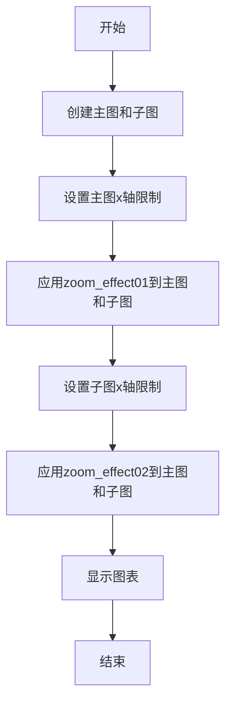
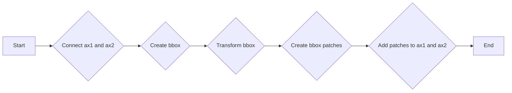
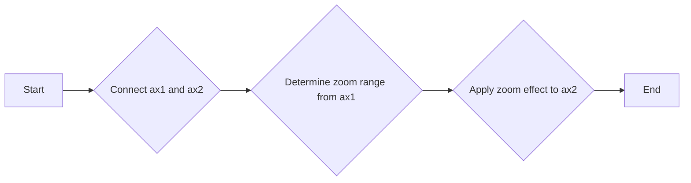
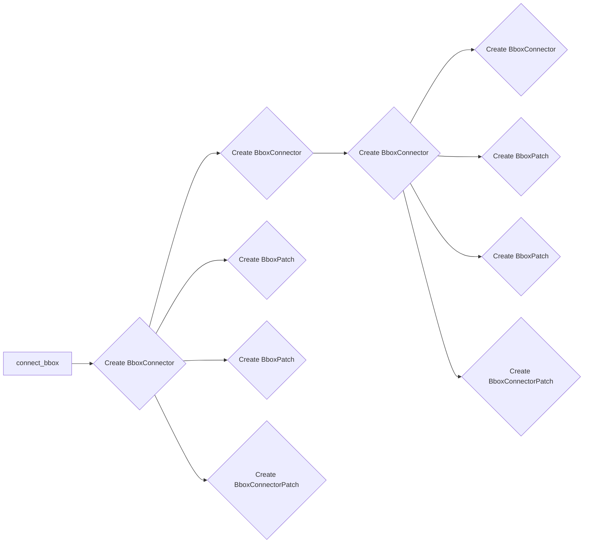
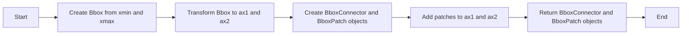
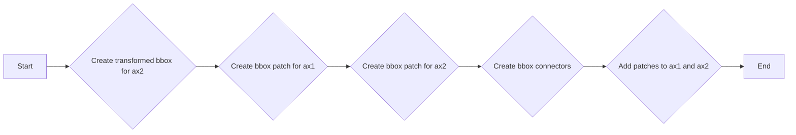

# `matplotlib\galleries\examples\subplots_axes_and_figures\axes_zoom_effect.py` 详细设计文档

This code provides functions to create a zoom effect on a matplotlib plot by connecting a main plot with a zoomed-in plot using bounding boxes and connectors.

## 整体流程



## 类结构

```
Axes_zoom_effect (主模块)
```

## 全局变量及字段


### `axs`
    
A dictionary containing the axes of the plot.

类型：`dict`
    


### `xmin`
    
The minimum x-axis limit for the zoomed area.

类型：`float`
    


### `xmax`
    
The maximum x-axis limit for the zoomed area.

类型：`float`
    


### `loc1a`
    
The location of the first anchor for the bbox connector.

类型：`int`
    


### `loc2a`
    
The location of the second anchor for the bbox connector.

类型：`int`
    


### `loc1b`
    
The location of the first anchor for the bbox connector in the second direction.

类型：`int`
    


### `loc2b`
    
The location of the second anchor for the bbox connector in the second direction.

类型：`int`
    


### `prop_lines`
    
Properties for the lines of the bbox connector.

类型：`dict`
    


### `prop_patches`
    
Properties for the patches of the bbox connector.

类型：`dict`
    


### `c1`
    
The first bbox connector.

类型：`BboxConnector`
    


### `c2`
    
The second bbox connector.

类型：`BboxConnector`
    


### `bbox_patch1`
    
The first bbox patch.

类型：`BboxPatch`
    


### `bbox_patch2`
    
The second bbox patch.

类型：`BboxPatch`
    


### `p`
    
The bbox connector patch.

类型：`BboxConnectorPatch`
    


    

## 全局函数及方法


### connect_bbox

This function connects two bounding boxes visually using connectors and patches.

参数：

- `bbox1`：`Bbox`，The first bounding box to connect.
- `bbox2`：`Bbox`，The second bounding box to connect.
- `loc1a`：`int`，Location of the first connection point on bbox1.
- `loc2a`：`int`，Location of the first connection point on bbox2.
- `loc1b`：`int`，Location of the second connection point on bbox1.
- `loc2b`：`int`，Location of the second connection point on bbox2.
- `prop_lines`：`dict`，Properties for the lines used in the connectors.
- `prop_patches`：`dict`，Properties for the patches used to represent the bounding boxes.

返回值：`tuple`，A tuple containing the connectors and patches used to connect the bounding boxes.

#### 流程图

```mermaid
graph LR
A[connect_bbox] --> B{Create BboxConnector}
B --> C{Create BboxConnectorPatch}
C --> D{Create BboxPatch}
D --> E{Create BboxPatch}
D --> F{Create BboxConnectorPatch}
F --> G[Return (c1, c2, bbox_patch1, bbox_patch2, p)]
```

#### 带注释源码

```python
def connect_bbox(bbox1, bbox2,
                 loc1a, loc2a, loc1b, loc2b,
                 prop_lines, prop_patches=None):
    if prop_patches is None:
        prop_patches = {
            **prop_lines,
            "alpha": prop_lines.get("alpha", 1) * 0.2,
            "clip_on": False,
        }

    c1 = BboxConnector(
        bbox1, bbox2, loc1=loc1a, loc2=loc2a, clip_on=False, **prop_lines)
    c2 = BboxConnector(
        bbox1, bbox2, loc1=loc1b, loc2=loc2b, clip_on=False, **prop_lines)

    bbox_patch1 = BboxPatch(bbox1, **prop_patches)
    bbox_patch2 = BboxPatch(bbox2, **prop_patches)

    p = BboxConnectorPatch(bbox1, bbox2,
                           loc1a=loc1a, loc2a=loc2a, loc1b=loc1b, loc2b=loc2b,
                           clip_on=False,
                           **prop_patches)

    return c1, c2, bbox_patch1, bbox_patch2, p
```


### zoom_effect01

Connect two axes (`ax1` and `ax2`) and mark the specified range (`xmin` to `xmax`) in both axes.

参数：

- `ax1`：`matplotlib.axes.Axes`，The main Axes.
- `ax2`：`matplotlib.axes.Axes`，The zoomed Axes.
- `xmin`：`float`，The lower limit of the colored area in both plot Axes.
- `xmax`：`float`，The upper limit of the colored area in both plot Axes.
- `**kwargs`：`dict`，Additional keyword arguments passed to the patch constructor.

返回值：`tuple`，A tuple containing the BboxConnector objects and BboxPatch objects used to connect the two axes.

#### 流程图



#### 带注释源码

```python
def zoom_effect01(ax1, ax2, xmin, xmax, **kwargs):
    """
    Connect *ax1* and *ax2*. The *xmin*-to-*xmax* range in both Axes will
    be marked.

    Parameters
    ----------
    ax1
        The main Axes.
    ax2
        The zoomed Axes.
    xmin, xmax
        The limits of the colored area in both plot Axes.
    **kwargs
        Arguments passed to the patch constructor.
    """

    bbox = Bbox.from_extents(xmin, 0, xmax, 1)

    mybbox1 = TransformedBbox(bbox, ax1.get_xaxis_transform())
    mybbox2 = TransformedBbox(bbox, ax2.get_xaxis_transform())

    prop_patches = {**kwargs, "ec": "none", "alpha": 0.2}

    c1, c2, bbox_patch1, bbox_patch2, p = connect_bbox(
        mybbox1, mybbox2,
        loc1a=3, loc2a=2, loc1b=4, loc2b=1,
        prop_lines=kwargs, prop_patches=prop_patches)

    ax1.add_patch(bbox_patch1)
    ax2.add_patch(bbox_patch2)
    ax2.add_patch(c1)
    ax2.add_patch(c2)
    ax2.add_patch(p)

    return c1, c2, bbox_patch1, bbox_patch2, p
```


### zoom_effect02

This function connects two axes, `ax1` and `ax2`, and applies a zoom effect. It uses the view limits of `ax1` to determine the zoom range for `ax2`.

参数：

- `ax1`：`matplotlib.axes.Axes`，The main Axes.
- `ax2`：`matplotlib.axes.Axes`，The zoomed Axes.
- `**kwargs`：`dict`，Additional keyword arguments passed to the patch constructor.

返回值：`tuple`，A tuple containing the following elements:
- `c1`：`matplotlib.patches.BboxConnector`，The first BboxConnector.
- `c2`：`matplotlib.patches.BboxConnector`，The second BboxConnector.
- `bbox_patch1`：`matplotlib.patches.BboxPatch`，The first BboxPatch.
- `bbox_patch2`：`matplotlib.patches.BboxPatch`，The second BboxPatch.
- `p`：`matplotlib.patches.BboxConnectorPatch`，The BboxConnectorPatch.

#### 流程图



#### 带注释源码

```python
def zoom_effect02(ax1, ax2, **kwargs):
    """
    ax1 : the main Axes
    ax1 : the zoomed Axes

    Similar to zoom_effect01.  The xmin & xmax will be taken from the
    ax1.viewLim.
    """

    tt = ax1.transScale + (ax1.transLimits + ax2.transAxes)
    trans = blended_transform_factory(ax2.transData, tt)

    mybbox1 = ax1.bbox
    mybbox2 = TransformedBbox(ax1.viewLim, trans)

    prop_patches = {**kwargs, "ec": "none", "alpha": 0.2}

    c1, c2, bbox_patch1, bbox_patch2, p = connect_bbox(
        mybbox1, mybbox2,
        loc1a=3, loc2a=2, loc1b=4, loc2b=1,
        prop_lines=kwargs, prop_patches=prop_patches)

    ax1.add_patch(bbox_patch1)
    ax2.add_patch(bbox_patch2)
    ax2.add_patch(c1)
    ax2.add_patch(c2)
    ax2.add_patch(p)

    return c1, c2, bbox_patch1, bbox_patch2, p
```


### connect_bbox

Connect two bounding boxes visually using connectors and patches.

参数：

- `bbox1`：`Bbox`，The first bounding box to connect.
- `bbox2`：`Bbox`，The second bounding box to connect.
- `loc1a`：`int`，Location of the first connection point on bbox1.
- `loc2a`：`int`，Location of the first connection point on bbox2.
- `loc1b`：`int`，Location of the second connection point on bbox1.
- `loc2b`：`int`，Location of the second connection point on bbox2.
- `prop_lines`：`dict`，Properties for the lines used in the connectors.
- `prop_patches`：`dict`，Properties for the patches used to represent the bounding boxes.

返回值：`tuple`，A tuple containing the connectors and patches for the bounding boxes.

返回值描述：The tuple contains the following elements:
- `c1`：`BboxConnector`，The first connector between bbox1 and bbox2.
- `c2`：`BboxConnector`，The second connector between bbox1 and bbox2.
- `bbox_patch1`：`BboxPatch`，The patch representing bbox1.
- `bbox_patch2`：`BboxPatch`，The patch representing bbox2.
- `p`：`BboxConnectorPatch`，The patch connecting bbox1 and bbox2.

#### 流程图



#### 带注释源码

```python
def connect_bbox(bbox1, bbox2,
                 loc1a, loc2a, loc1b, loc2b,
                 prop_lines, prop_patches=None):
    if prop_patches is None:
        prop_patches = {
            **prop_lines,
            "alpha": prop_lines.get("alpha", 1) * 0.2,
            "clip_on": False,
        }

    c1 = BboxConnector(
        bbox1, bbox2, loc1=loc1a, loc2=loc2a, clip_on=False, **prop_lines)
    c2 = BboxConnector(
        bbox1, bbox2, loc1=loc1b, loc2=loc2b, clip_on=False, **prop_lines)

    bbox_patch1 = BboxPatch(bbox1, **prop_patches)
    bbox_patch2 = BboxPatch(bbox2, **prop_patches)

    p = BboxConnectorPatch(bbox1, bbox2,
                           loc1a=loc1a, loc2a=loc2a, loc1b=loc1b, loc2b=loc2b,
                           clip_on=False,
                           **prop_patches)

    return c1, c2, bbox_patch1, bbox_patch2, p
```


### zoom_effect01

Connect two axes (`ax1` and `ax2`) and mark the specified range (`xmin` to `xmax`) in both axes.

参数：

- `ax1`：`matplotlib.axes.Axes`，The main Axes.
- `ax2`：`matplotlib.axes.Axes`，The zoomed Axes.
- `xmin`：`float`，The lower limit of the colored area in both plot Axes.
- `xmax`：`float`，The upper limit of the colored area in both plot Axes.
- `**kwargs`：`dict`，Additional keyword arguments passed to the patch constructor.

返回值：`tuple`，A tuple containing the BboxConnector objects and BboxPatch objects used to connect the two axes.

#### 流程图



#### 带注释源码

```python
def zoom_effect01(ax1, ax2, xmin, xmax, **kwargs):
    """
    Connect *ax1* and *ax2*. The *xmin*-to-*xmax* range in both Axes will
    be marked.

    Parameters
    ----------
    ax1
        The main Axes.
    ax2
        The zoomed Axes.
    xmin, xmax
        The limits of the colored area in both plot Axes.
    **kwargs
        Arguments passed to the patch constructor.
    """

    bbox = Bbox.from_extents(xmin, 0, xmax, 1)

    mybbox1 = TransformedBbox(bbox, ax1.get_xaxis_transform())
    mybbox2 = TransformedBbox(bbox, ax2.get_xaxis_transform())

    prop_patches = {**kwargs, "ec": "none", "alpha": 0.2}

    c1, c2, bbox_patch1, bbox_patch2, p = connect_bbox(
        mybbox1, mybbox2,
        loc1a=3, loc2a=2, loc1b=4, loc2b=1,
        prop_lines=kwargs, prop_patches=prop_patches)

    ax1.add_patch(bbox_patch1)
    ax2.add_patch(bbox_patch2)
    ax2.add_patch(c1)
    ax2.add_patch(c2)
    ax2.add_patch(p)

    return c1, c2, bbox_patch1, bbox_patch2, p
```


### zoom_effect02

This function connects two axes, `ax1` and `ax2`, and marks the xmin to xmax range in both axes. It is similar to `zoom_effect01` but automatically takes the xmin and xmax from `ax1.viewLim`.

参数：

- `ax1`：`matplotlib.axes.Axes`，The main Axes.
- `ax2`：`matplotlib.axes.Axes`，The zoomed Axes.
- `**kwargs`：`dict`，Arguments passed to the patch constructor.

返回值：`tuple`，A tuple containing the BboxConnector, BboxConnectorPatch, BboxPatch objects for the two axes and the patch connecting them.

#### 流程图



#### 带注释源码

```python
def zoom_effect02(ax1, ax2, **kwargs):
    """
    ax1 : the main Axes
    ax1 : the zoomed Axes

    Similar to zoom_effect01.  The xmin & xmax will be taken from the
    ax1.viewLim.
    """

    tt = ax1.transScale + (ax1.transLimits + ax2.transAxes)
    trans = blended_transform_factory(ax2.transData, tt)

    mybbox1 = ax1.bbox
    mybbox2 = TransformedBbox(ax1.viewLim, trans)

    prop_patches = {**kwargs, "ec": "none", "alpha": 0.2}

    c1, c2, bbox_patch1, bbox_patch2, p = connect_bbox(
        mybbox1, mybbox2,
        loc1a=3, loc2a=2, loc1b=4, loc2b=1,
        prop_lines=kwargs, prop_patches=prop_patches)

    ax1.add_patch(bbox_patch1)
    ax2.add_patch(bbox_patch2)
    ax2.add_patch(c1)
    ax2.add_patch(c2)
    ax2.add_patch(p)

    return c1, c2, bbox_patch1, bbox_patch2, p
``` 


## 关键组件


### 张量索引与惰性加载

张量索引与惰性加载是代码中用于处理数据访问和计算的关键组件，它允许在需要时才进行数据加载和计算，从而提高效率。

### 反量化支持

反量化支持是代码中用于处理数据量化和反量化的组件，它允许在数据量化和反量化过程中进行精确控制，以适应不同的应用场景。

### 量化策略

量化策略是代码中用于处理数据量化的组件，它定义了数据量化的方法和参数，以确保数据在量化过程中的准确性和效率。


## 问题及建议


### 已知问题

-   **全局变量和函数的复用性低**：代码中定义了多个函数，如`connect_bbox`、`zoom_effect01`和`zoom_effect02`，这些函数在功能上相似，但参数和实现细节有所不同。这可能导致维护困难，因为每个函数都需要单独维护。
-   **代码注释不足**：虽然代码中包含了一些注释，但它们并不充分，特别是对于复杂的逻辑和参数说明。这可能会影响其他开发者理解代码。
-   **硬编码的参数值**：例如，`loc1a=3, loc2a=2, loc1b=4, loc2b=1`在`connect_bbox`函数中是硬编码的，这可能会限制代码的灵活性和可配置性。

### 优化建议

-   **提取公共逻辑**：将`connect_bbox`、`zoom_effect01`和`zoom_effect02`中的公共逻辑提取到一个单独的函数中，减少代码重复，并提高代码的可维护性。
-   **增加详细的注释**：为每个函数和重要的代码块添加详细的注释，解释其目的、参数和返回值。
-   **使用配置参数**：将硬编码的参数值替换为配置参数，这样用户可以根据需要调整它们，提高代码的灵活性和可配置性。
-   **代码重构**：考虑将代码重构为更模块化的结构，例如使用面向对象的方法来封装功能，这样可以提高代码的可读性和可维护性。
-   **单元测试**：编写单元测试来验证每个函数的行为，确保代码的稳定性和可靠性。


## 其它


### 设计目标与约束

- 设计目标：
  - 实现一个可扩展的轴缩放效果，允许用户在主轴和缩放轴之间连接和显示范围。
  - 提供灵活的配置选项，允许用户自定义连接线的样式和属性。
  - 确保代码的可读性和可维护性，便于未来的扩展和修改。

- 约束条件：
  - 必须使用matplotlib库进行绘图。
  - 代码应尽可能简洁，避免不必要的复杂性。
  - 应考虑性能，确保在处理大量数据时仍能保持良好的响应速度。

### 错误处理与异常设计

- 错误处理：
  - 对于无效的输入参数，应抛出异常，并提供清晰的错误信息。
  - 在函数执行过程中，如果遇到不可预见的错误，应记录错误信息并抛出异常。

- 异常设计：
  - 定义自定义异常类，用于处理特定的错误情况。
  - 使用try-except块捕获和处理异常，确保程序不会因为未处理的异常而崩溃。

### 数据流与状态机

- 数据流：
  - 用户输入参数（如轴对象、范围限制等）。
  - 函数处理这些参数，生成连接线和范围标记。
  - 将生成的元素添加到轴上，显示缩放效果。

- 状态机：
  - 无状态机，函数直接处理输入并生成输出。

### 外部依赖与接口契约

- 外部依赖：
  - matplotlib库：用于绘图和创建轴对象。

- 接口契约：
  - 函数`connect_bbox`和`zoom_effect01`/`zoom_effect02`的接口应清晰定义，包括参数和返回值。
  - 参数类型和返回值类型应明确指定，确保函数的正确使用。


    