# `matplotlib\galleries\examples\subplots_axes_and_figures\axhspan_demo.py` 详细设计文档

这是一个matplotlib示例代码，演示如何使用axhspan和axvspan方法在图表中绘制跨越坐标轴的水平或垂直区域（色带），常用于highlight数据区间或统计显著性区域。

## 整体流程

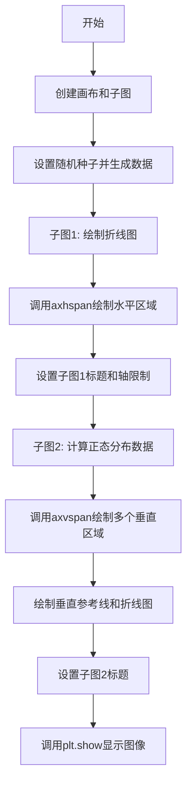

## 类结构

```
无自定义类层次结构
本代码为matplotlib示例脚本，使用第三方库的API进行数据可视化
```

## 全局变量及字段


### `fig`
    
matplotlib画布对象，包含所有子图的顶层容器

类型：`matplotlib.figure.Figure`
    


### `ax1`
    
左侧子图坐标轴对象，用于绘制第一个子图的内容

类型：`matplotlib.axes.Axes`
    


### `ax2`
    
右侧子图坐标轴对象，用于绘制第二个子图的内容

类型：`matplotlib.axes.Axes`
    


### `s`
    
通过卷积生成的平滑随机数据，用于演示axhspan功能

类型：`numpy.ndarray`
    


### `mu`
    
正态分布均值，用于定义高斯曲线的中心位置

类型：`float`
    


### `sigma`
    
正态分布标准差，用于定义高斯曲线的宽度

类型：`float`
    


### `x`
    
正态分布自变量数组，范围从0到16的等间距点

类型：`numpy.ndarray`
    


### `y`
    
正态分布因变量数组，根据高斯公式计算的概率密度值

类型：`numpy.ndarray`
    


    

## 全局函数及方法


### `plt.subplots`

创建包含多个子图的画布，返回Figure对象和一个包含Axes对象的数组（或单个Axes对象）。

参数：

- `nrows`：int，创建子图的行数，默认为1
- `ncols`：int，创建子图的列数，默认为1
- `sharex`：bool或str，是否共享X轴，默认为False。为True时所有子图共享X轴；'row'表示每行共享；'col'表示每列共享
- `sharey`：bool或str，是否共享Y轴，默认为False。为True时所有子图共享Y轴；'row'表示每行共享；'col'表示每列共享
- `squeeze`：bool，是否压缩返回的Axes数组维度，默认为True。当nrows=1且ncols=1时返回单个Axes对象而非数组
- `width_ratios`：array-like，可选，表示各列的宽度比例
- `height_ratios`：array-like，可选，表示各行的高度比例
- `subplot_kw`：dict，可选，传递给每个add_subplot()的关键字参数
- `gridspec_kw`：dict，可选，传递给GridSpec构造函数的关键字参数
- `**fig_kw`：可变关键字参数，传递给figure()函数的关键字参数（如figsize、dpi等）

返回值：`tuple(Figure, Axes或Axes数组)`，第一个返回值为Figure对象（整个图形），第二个返回值为Axes对象（单个）或Axes数组（多个子图时，squeeze=False或nrows*ncols>1时）

#### 流程图

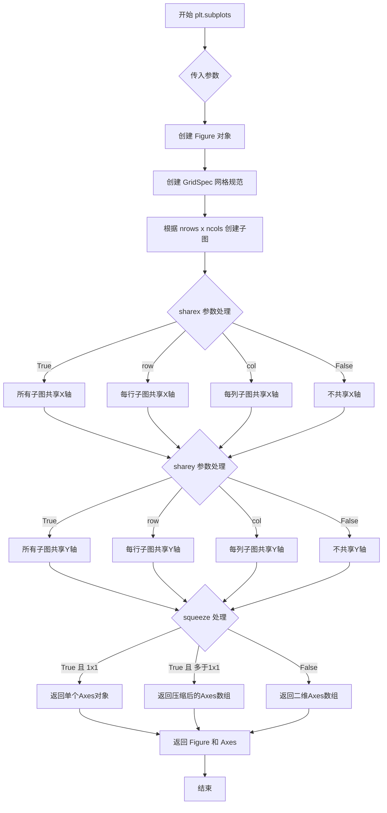

#### 带注释源码

```python
# 代码示例展示 plt.subplots 的使用方式

# 创建1行2列的子图布局，返回Figure对象和Axes数组
fig, (ax1, ax2) = plt.subplots(1, 2, figsize=(7, 3))

# 参数说明：
# - 1: nrows=1，表示1行子图
# - 2: ncols=2，表示2列子图
# - figsize=(7, 3): 图形尺寸为7英寸宽、3英寸高（通过fig_kw传递）

# 返回值说明：
# - fig: Figure对象，整个图形容器
# - (ax1, ax2): 解包后的两个Axes对象元组

# 在ax1上绘制数据并添加水平区域
ax1.plot(s)
ax1.axhspan(-1, 1, alpha=0.1)  # 绘制从y=-1到y=1的水平区域，透明度0.1
ax1.set(ylim=(-1.5, 1.5), title="axhspan")

# 在ax2上绘制数据并添加垂直区域
ax2.axvspan(mu-2*sigma, mu-sigma, color='0.95')  # 第一个垂直区域
ax2.axvspan(mu-sigma, mu+sigma, color='0.9')      # 第二个垂直区域（核心区域）
ax2.axvspan(mu+sigma, mu+2*sigma, color='0.95')  # 第三个垂直区域
ax2.axvline(mu, color='darkgrey', linestyle='--')  # 垂直参考线
ax2.plot(x, y)
ax2.set(title="axvspan")

plt.show()
```


### `plt.show`

`plt.show` 是 matplotlib.pyplot 模块中的函数，用于显示所有当前已创建且尚未显示的图形窗口，并进入交互模式。该函数会阻塞程序的执行，直到用户关闭所有图形窗口（在某些后端中），从而让用户能够查看绑定的图表内容。

参数：  
- 该函数没有参数。

返回值：`None`，该函数不返回任何值。

#### 流程图

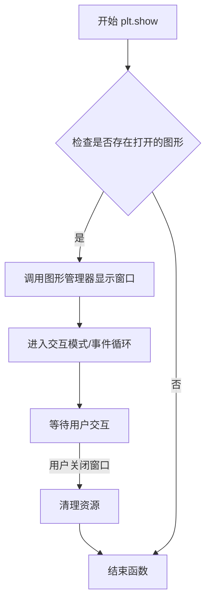

#### 带注释源码

```python
# plt.show() 函数的实现位于 matplotlib.pyplot 模块中
# 以下为调用流程的伪代码注释说明

# 1. 获取当前的图形管理器（FigureManager）
#    manager = _pylab_helpers.Gcf.get_fig_manager(num)

# 2. 调用管理器的show方法显示窗口
#    manager.show()

# 3. 对于某些后端（如TkAgg, Qt5Agg等），会进入事件循环
#    # 这使得图形能够响应用户的鼠标和键盘交互
#    # plt.show() 会阻塞直到所有窗口关闭

# 4. 实际调用时无需任何参数
plt.show()

# 注意：在Jupyter Notebook等交互环境中，
# 可以使用 %matplotlib inline 或 %matplotlib widget
# 来控制图形的显示方式，而非直接调用 plt.show()
```

#### 关键组件信息

| 组件名称 | 一句话描述 |
|---------|-----------|
| `matplotlib.pyplot` | 提供类似MATLAB的绘图接口的顶层模块 |
| `FigureManager` | 管理图形窗口的创建、显示和销毁的对象 |
| `图形后端(Backend)` | 负责实际渲染图形和窗口管理的底层实现（如Qt、Tk等） |

#### 潜在的技术债务或优化空间

1. **阻塞行为**：`plt.show()` 在大多数后端中会阻塞主线程，这在某些应用场景（如GUI应用）中可能不理想。可以考虑使用非阻塞模式或动画功能来实现动态更新。
2. **后端兼容性**：不同后端的 `show()` 行为略有差异，可能导致代码在不同环境下表现不一致。
3. **资源管理**：长时间运行的应用中频繁创建和显示图形可能导致内存泄漏，应当显式管理图形对象的生命周期。

#### 其它项目

**设计目标与约束**：
- 设计目标：提供一个简单统一的接口来显示matplotlib生成的所有图形
- 约束：依赖于选定的后端，不同后端可能支持不同的特性和交互方式

**错误处理与异常设计**：
- 如果没有可显示的图形，函数通常不会报错，但也不会执行任何操作
- 某些后端在初始化失败时可能抛出异常（如无法创建GUI窗口）

**数据流与状态机**：
- `plt.show()` 是matplotlib状态机中的最终展示环节
- 在调用之前，图形数据已通过 `ax.plot()`, `ax.axhspan()`, `ax.axvspan()` 等方法添加到图形对象中

**外部依赖与接口契约**：
- 依赖具体的matplotlib后端（如Qt5Agg, TkAgg, MacOSX等）
- 在没有图形后端的服务器环境中（如无GUI的Linux服务器），可能需要使用非交互式后端（如Agg）并保存为文件而非显示


### `np.random.seed`

设置随机数种子，确保随机过程可复现。通过初始化随机数生成器的内部状态，使得每次使用相同种子时，后续生成的随机数序列保持一致。

参数：

- `seed`：`int` 或 `float` 或 `None`，随机数生成器的种子值。如果为 `None`，则使用系统时间或操作系统提供的随机源。

返回值：`None`，无返回值（该函数修改随机数生成器的内部状态，但不返回任何值）

#### 流程图

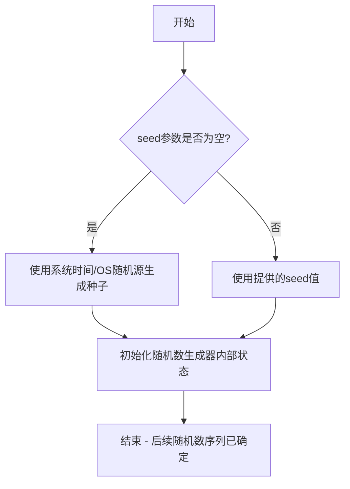

#### 带注释源码

```python
# numpy.random.seed 函数源码示例（概念性）
def seed(seed=None):
    """
    设置随机数种子以确保可复现性
    
    参数:
        seed: 整数、浮点数或None。
              - 如果是整数，直接用作随机数生成器的种子
              - 如果是浮点数，会转换为整数后用作种子
              - 如果是None，则使用系统时间或OS随机源
    
    返回值:
        None - 该函数直接修改全局随机数生成器的状态
    """
    # 获取全局随机数生成器实例
    random_state = get_global_random_state()
    
    # 如果提供了种子值，则使用它；否则基于系统状态生成
    if seed is None:
        # 使用当前时间戳或操作系统随机源
        seed = int(time.time() * 256) or os.urandom(8)
    
    # 将种子转换为整数（如果是浮点数）
    seed = int(seed)
    
    # 调用底层随机数生成器的初始化方法
    random_state.seed(seed)
```

#### 使用示例源码

```python
import numpy as np

# 设置固定种子，确保可复现性
np.random.seed(19680801)

# 后续生成的随机数序列是确定的
random_numbers = np.random.randn(5)
print(random_numbers)  # 每次运行输出相同

# 重新设置相同种子
np.random.seed(19680801)
random_numbers_again = np.random.randn(5)
print(random_numbers_again)  # 与上面输出完全相同
```


### np.random.randn

生成指定形状的标准正态分布（均值0，标准差1）随机数。

参数：

- `*d0, d1, ..., dn`：`int`，可选，整数类型，指定输出数组的维度。例如，randn() 返回一个标量，randn(3) 返回一维数组，randn(3, 4) 返回 3x4 的二维数组。

返回值：

- `ndarray`，返回指定形状的随机数数组，数组中的值服从标准正态分布（均值0，标准差1）。

#### 流程图

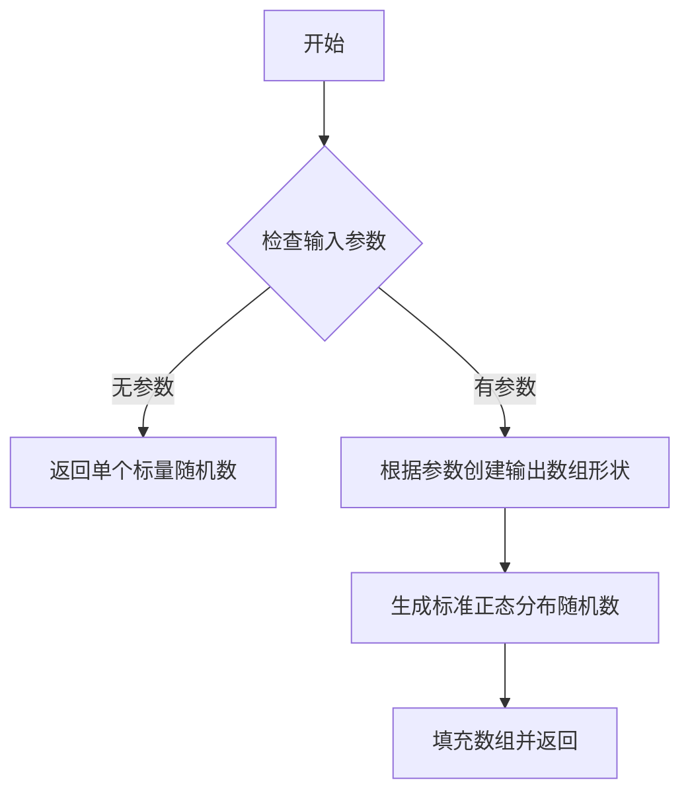

#### 带注释源码

```python
def randn(*args):
    """
    返回一个或一组服从标准正态分布（均值0，方差1）的随机数。
    
    参数:
        *args: int, 可选
            参数用于指定输出数组的形状。
            如果没有提供参数，则返回一个单一的随机数。
            如果提供了参数，例如 n1, n2, ..., 则返回一个 n1 x n2 x ... 的数组。
    
    返回值:
        ndarray
            服从标准正态分布的随机数数组。
    
    示例:
        >>> import numpy as np
        >>> np.random.randn()
        0.123456789  # 单一的随机数
        
        >>> np.random.randn(3)
        array([ 0.123456789, -0.987654321,  0.456789123])  # 1-D 数组
        
        >>> np.random.randn(3, 4)
        array([[ 0.123456789, -0.987654321,  0.456789123, -0.111222333],
               [-0.333444555,  0.666777888, -0.999111222,  0.333444555],
               [-0.666777888,  0.999111222, -0.222333444,  0.555666777]])  # 2-D 数组
    """
    # 内部实现调用底层的随机数生成器
    return _randn(*args)
```

> **注意**：上述源码为伪代码展示，np.random.randn 的实际实现位于 NumPy 底层 C/Fortran 代码中。标准实现使用 Box-Muller 变换或 Ziggurat 算法来生成符合标准正态分布的随机数。在提供的示例代码中，`np.random.randn(500)` 生成了500个服从标准正态分布的随机数，随后通过卷积操作平滑处理。


### `np.convolve`

计算两个一维序列的离散卷积，常用于信号处理中的平滑滤波、滑动平均等操作。

参数：

- `a`：`array_like`，第一个一维输入数组（通常是信号数据）
- `v`：`array_like`，第二个一维输入数组（通常是卷积核/滤波器）
- `mode`：`{'full', 'valid', 'same'}`，可选，默认`'full'`，指定输出数组的长度模式

返回值：`ndarray`，两个一维数组的卷积结果

#### 流程图

```mermaid
flowchart TD
    A[开始 np.convolve] --> B[输入数组 a 和 v]
    B --> C{检查 mode 参数}
    C -->|full| D[计算 full 卷积<br/>输出长度 = len(a) + len(v) - 1]
    C -->|valid| E[计算 valid 卷积<br/>输出长度 = max(len(a), len(v)) - min(len(a), len(v)) + 1]
    C -->|same| F[计算 same 卷积<br/>输出长度 = len(a)]
    D --> G[返回卷积结果]
    E --> G
    F --> G
    G --> H[结束]
    
    style D fill:#e1f5fe
    style E fill:#e1f5fe
    style F fill:#e1f5fe
    style G fill:#c8e6c9
```

#### 带注释源码

```python
def convolve(a, v, mode='full'):
    """
    计算两个一维序列的离散卷积
    
    参数:
        a: array_like，第一个一维输入数组（信号数据）
        v: array_like，第二个一维输入数组（卷积核/滤波器）
        mode: {'full', 'valid', 'same'}，输出模式
            - 'full':  完全卷积，默认选项，输出长度为 len(a) + len(v) - 1
            - 'valid': 仅计算不需要补零的有效卷积，输出长度为 max-len - min-len + 1
            - 'same':  输出长度与输入数组 a 相同，卷积核居中对齐
    
    返回值:
        out: ndarray，两个一维数组的卷积结果
    """
    # 将输入转换为 numpy 数组
    a = np.asarray(a)
    v = np.asarray(v)
    
    # 获取数组长度
    n = len(a)
    m = len(v)
    
    # 选择卷积模式并计算结果
    if mode == 'full':
        # 完全卷积：计算所有可能的重叠
        # 输出长度 = n + m - 1
        result = np.zeros(n + m - 1)
        for i in range(n):
            for j in range(m):
                result[i + j] += a[i] * v[j]
                
    elif mode == 'valid':
        # 有效卷积：仅当两个数组完全重叠时计算
        # 输出长度 = max(n, m) - min(n, m) + 1
        if n < m:
            result = np.zeros(n)
            for i in range(n):
                result[i] = np.dot(a[i:i+m], v) if i+m <= n else np.dot(a[i:], v[:n-i])
        else:
            result = np.zeros(m)
            for i in range(m):
                result[i] = np.dot(a[:n-m+1], v[i:i+n-m+1]) if i+n-m+1 <= m else np.dot(a, v[i:])
                
    elif mode == 'same':
        # 同等卷积：输出长度与 a 相同
        result = np.zeros(n)
        # 卷积核居中偏移
        offset = m // 2
        for i in range(n):
            start = max(0, i - offset)
            end = min(n, i + m - offset)
            a_start = max(0, offset - i)
            a_end = a_start + (end - start)
            result[i] = np.dot(a[start:end], v[a_start:a_end])
    
    return result

# 示例用法
np.random.seed(19680801)
# 生成随机信号并使用长度为30的滑动平均滤波器进行平滑
s = 2.9 * np.convolve(np.random.randn(500), np.ones(30) / 30, mode='valid')
# np.ones(30) / 30 创建一个归一化的boxcar滤波器
# mode='valid' 确保输出长度合理
```

#### 关键组件信息

| 组件名称 | 一句话描述 |
|---------|-----------|
| 卷积核 (Kernel) | 用于平滑或滤波的权重数组，如`np.ones(30)/30`创建滑动平均滤波器 |
| mode='full' | 完全卷积，输出包含所有可能的重叠区域 |
| mode='valid' | 有效卷积，仅计算数组完全重叠区域 |
| mode='same' | 同等卷积，输出长度与输入信号相同 |

#### 潜在的技术债务或优化空间

1. **算法复杂度**：纯Python实现对于大规模数据效率较低，实际NumPy使用C/Fortran优化实现
2. **数值精度**：对于极长序列，浮点累积误差可能累积
3. **边界处理**：不同mode的边界条件处理逻辑复杂，可考虑使用FFT方法优化

#### 其它项目

**设计目标与约束**：
- 离散卷积计算，用于信号处理、数据平滑、滤波等场景
- 支持三种输出模式以满足不同应用需求

**错误处理与异常设计**：
- 输入数组维度检查（非一维数组会报错）
- 空数组检查
- mode参数合法性检查

**数据流与状态机**：
```
输入数组 → 类型转换 → 模式选择 → 卷积计算 → 结果输出
```

**外部依赖与接口契约**：
- 依赖NumPy库
- 符合NumPy标准数组操作接口
- 返回值为NumPy ndarray类型


### `np.ones`

生成一个指定形状的全1数组

参数：

-  `shape`：`int` 或 `tuple of ints`，数组的形状
-  `dtype`：`data-type, optional`，数组的数据类型，默认为 `float64`
-  `order`：`{C, F}, optional`，数组在内存中的存储顺序，C表示行优先（Fortran为列优先），默认为C

返回值：`ndarray`，一个指定形状和数据类型的全1数组

#### 流程图

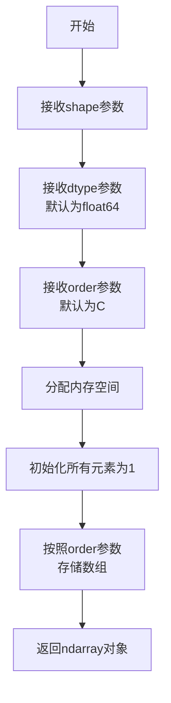

#### 带注释源码

在用户提供的代码中，`np.ones`的实际实现源码并未包含，但代码中使用了该函数：

```python
# 示例代码中使用np.ones
s = 2.9 * np.convolve(np.random.randn(500), np.ones(30) / 30, mode='valid')

# np.ones(30) 创建形状为(30,)的全1数组
# np.ones(30) / 30 将每个元素除以30，得到权重数组
# 该权重数组用于卷积操作，对随机数据进行平滑处理
```

#### 补充说明

在NumPy库中，`np.ones`的核心实现逻辑如下：

```python
# 伪代码展示np.ones的工作原理
def ones(shape, dtype=float64, order='C'):
    """
    返回一个全1数组
    
    参数:
        shape: 数组的形状
        dtype: 数据类型
        order: 内存存储顺序
    """
    # 1. 根据shape计算总元素数
    # 2. 分配内存空间
    # 3. 初始化所有元素为1
    # 4. 按照指定的order返回数组
    return array  # 返回填充为1的数组
```

#### 在当前代码中的作用

在提供的matplotlib示例中，`np.ones(30) / 30` 用于：

1. **创建平滑核**：生成30个元素的全1数组
2. **归一化处理**：除以30将元素值变为1/30，形成平滑权重
3. **卷积应用**：通过`np.convolve`对随机数据进行移动平均平滑

这个用法展示了卷积操作中常用的"矩形窗口"平滑技术。


### `np.linspace`

`np.linspace`是NumPy库中的一个函数，用于生成指定范围内等间距的数值序列数组。它常用于生成测试数据、绘图时的x轴坐标等场景。

参数：

- `start`：`float`，序列的起始值
- `stop`：`float`，序列的结束值。当`endpoint`为`True`时，该值包含在序列中
- `num`：`int`，生成的样本数量，默认为50
- `endpoint`：`bool`，如果为`True`，则`stop`值包含在序列中，默认为`True`
- `retstep`：`bool`，如果为`True`，返回(`samples`, `step`)，其中`step`是样本之间的间距，默认为`False`
- `dtype`：`dtype`，输出数组的数据类型。如果没有指定，则从输入参数推断
- `axis`：`int`，当结果需要重塑时使用的轴（仅当`num`不是最后一个维度时使用）

返回值：`ndarray`，返回等间距的数组

#### 流程图

```mermaid
flowchart TD
    A[开始] --> B[接收参数: start, stop, num, endpoint, retstep, dtype, axis]
    B --> C{endpoint == True?}
    C -->|Yes| D[计算样本数 = num - 1]
    C -->|No| E[计算样本数 = num]
    D --> F[step = (stop - start) / 样本数]
    E --> F
    F --> G[生成等间距数组]
    G --> H{retstep == True?}
    H -->|Yes| I[返回 数组 和 step]
    H -->|No| J[仅返回数组]
    I --> K[结束]
    J --> K
```

#### 带注释源码

```python
def linspace(start, stop, num=50, endpoint=True, retstep=False, dtype=None, axis=0):
    """
    生成指定范围内的等间距数组。
    
    参数:
        start: 序列的起始值
        stop: 序列的结束值
        num: 生成的样本数量，默认为50
        endpoint: 是否包含结束点，默认为True
        retstep: 是否返回步长，默认为False
        dtype: 输出数据类型
        axis: 结果数组的轴（用于多维情况）
    
    返回:
        ndarray: 等间距的数值序列
    """
    # 将start和stop转换为数组以便后续处理
    _arange = np.arange
    _ast = False
    
    # 处理endpoint参数
    if endpoint:
        # 包含结束点，样本数为num-1
        divisor = num - 1
    else:
        # 不包含结束点，样本数为num
        divisor = num
    
    # 计算步长
    step = (stop - start) / divisor if divisor != 0 else 0.0
    
    # 生成序列
    if num == 0:
        # 处理空数组情况
        y = _arange(0, 0, dtype=dtype)
    else:
        # 使用arange生成序列
        y = _arange(start, stop + (step if endpoint else 0), step, dtype=dtype)
    
    # 处理retstep参数
    if retstep:
        return y, step
    else:
        return y
```

注意：以上源码为简化版本，实际NumPy中的实现更加复杂，支持更多功能和边界情况处理。


### `ax1.plot`

在 `ax1` 坐标轴上绘制折线图，将输入的数据序列可视化为线条，并返回对应的线条对象列表。

参数：

-  `s`：`numpy.ndarray` 或 `array-like`，要绘制的y轴数据序列，这里是通过卷积生成的随机信号数据

返回值：`list[matplotlib.lines.Line2D]`，返回包含所有绘制的线条对象的列表，每个 Line2D 对象代表一条 plotted 线的属性和样式设置

#### 流程图

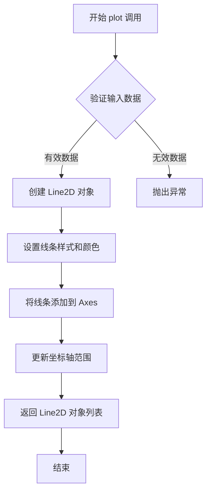

#### 带注释源码

```python
# 代码中使用的方式：
ax1.plot(s)

# 完整的 plot 方法调用形式：
# ax1.plot(s, *args, **kwargs)
#
# 参数说明：
# - s: 要绘制的y值数组 (在此例中是通过卷积生成的随机信号)
# - *args: 可选的额外位置参数 (如线条格式字符串 'b-', 'ro' 等)
# - **kwargs: 可选的关键字参数
#   - color: 线条颜色
#   - linewidth: 线条宽度
#   - linestyle: 线条样式
#   - marker: 标记样式
#   - label: 图例标签
#   - alpha: 透明度
#   - 等等...

# 在本例中的具体调用分析：
# ax1.plot(s)  # 绘制单条线，s 是长度为 471 的数组 (500-30+1)
# ax1.axhspan(-1, 1, alpha=0.1)  # 在y轴范围 [-1, 1] 添加半透明区域
# ax1.set(ylim=(-1.5, 1.5), title="axhspan")  # 设置y轴范围和标题
```


### Axes.axhspan

在 Axes 对象上绘制一个水平跨越的矩形区域。该方法创建一个填充矩形，其垂直范围（y轴方向）由 `ymin` 和 `ymax` 指定，水平范围（x轴方向）默认覆盖整个 Axes 区域，常用于highlight数据区间或标记阈值范围。

参数：

- `ymin`：`float`，水平跨度的起始y坐标（数据坐标）
- `ymax`：`float`，水平跨度的结束y坐标（数据坐标）
- `xmin`：`float`（可选），x轴起始位置，默认为0（归一化坐标0.0，即Axes左侧边缘）
- `xmax`：`float`（可选），x轴结束位置，默认为1（归一化坐标1.0，即Axes右侧边缘）
- `**kwargs`：其他关键字参数，用于设置 `Polygon` 样式（如 `color`、`alpha`、`facecolor`、`edgecolor`、`linewidth` 等）

返回值：`matplotlib.patches.Polygon`，返回创建的矩形（多边形）对象，可用于进一步修改或移除

#### 流程图

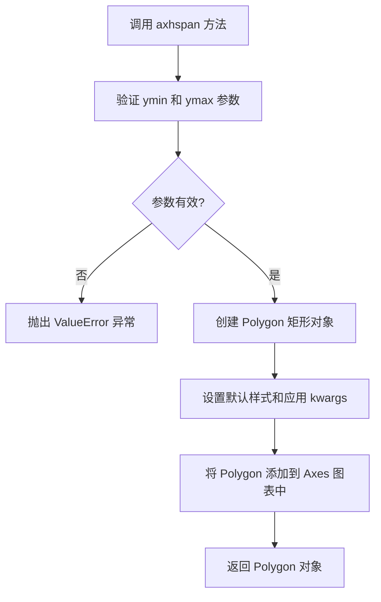

#### 带注释源码

```python
# 基于 matplotlib 实际实现的伪代码展示核心逻辑
def axhspan(self, ymin, ymax, xmin=0, xmax=1, **kwargs):
    """
    在 Axes 上绘制水平跨越区域
    
    参数:
        ymin: float - 起始 y 坐标（数据坐标）
        ymax: float - 结束 y 坐标（数据坐标）  
        xmin: float - x 轴起始位置（归一化坐标 0-1，默认 0）
        xmax: float - x 轴结束位置（归一化坐标 0-1，默认 1）
        **kwargs: 传递给 Polygon 的样式参数
    """
    
    # 验证 y 坐标范围有效性
    ymin, ymax = np float64(ymin), np.float64(ymax)
    
    # 创建多边形顶点坐标 [xmin, xmax, xmax, xmin], [ymin, ymin, ymax, ymax]
    # 使用归一化坐标转换到数据坐标
    xy = np.array([[xmin, ymin], 
                   [xmax, ymin], 
                   [xmax, ymax], 
                   [xmin, ymax]])
    
    # 使用归一化坐标转换到实际显示坐标
    pos_limit = self.get_xlim()
    pos = (xy[:, 0] * (pos_limit[1] - pos_limit[0]) + pos_limit[0],
           xy[:, 1])  # y 坐标保持数据坐标
    
    # 创建 Polygon 填充对象
    polygon = Polygon(pos, **kwargs)
    
    # 添加到 Axes 并设置 clipping
    self.add_patch(polygon)
    self._set_artist_clip_path(polygon)
    
    # 返回多边形对象供后续操作
    return polygon
```

在用户提供的示例代码中调用方式：
```python
ax1.axhspan(-1, 1, alpha=0.1)
```
这表示在 ax1 上绘制一个从 y=-1 到 y=1 的半透明（alpha=0.1）水平区域，覆盖整个 x 轴范围。


### `ax1.set`

这是 matplotlib 中 `Axes` 对象的方法，用于设置 Axes 的属性。在用户提供的代码中，`ax1.set(ylim=(-1.5, 1.5), title="axhspan")` 用于设置 y 轴范围和图表标题。

参数：

- `**kwargs`：关键字参数，用于设置 Axes 的各种属性，如 `xlim`、`ylim`、`title`、`xlabel`、`ylabel` 等。参数类型为字典形式的各种属性名和对应值。

返回值：`self`（Axes 对象），返回 Axes 对象本身，支持链式调用。

#### 流程图

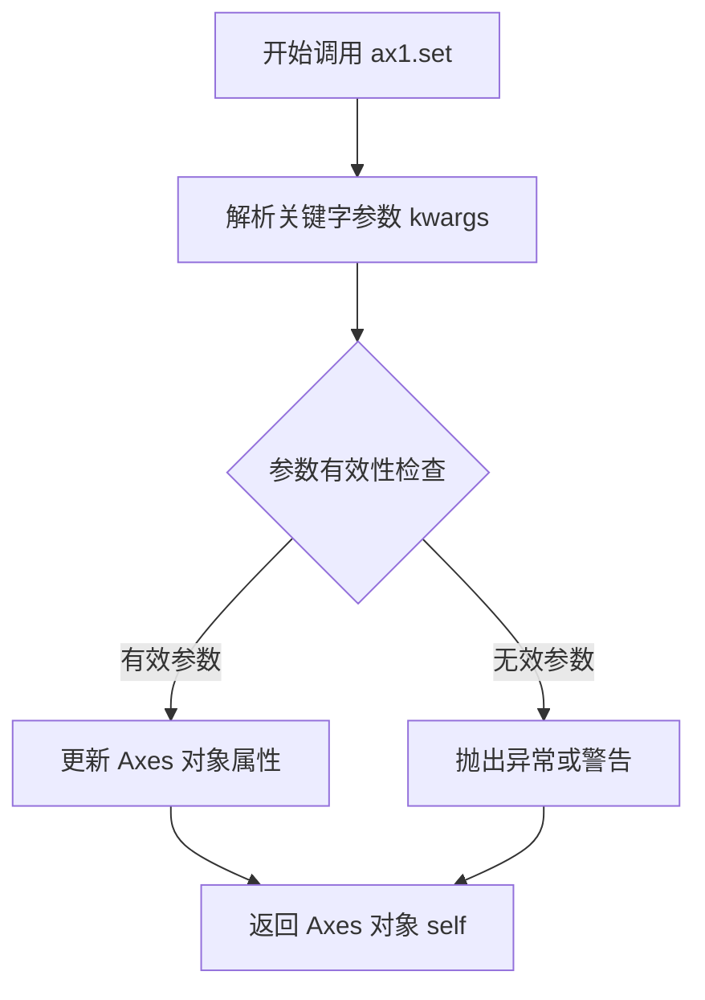

#### 带注释源码

```python
# 在用户代码中的调用示例：
ax1.set(ylim=(-1.5, 1.5), title="axhspan")

# 相当于：
ax1.set_ylim(-1.5, 1.5)  # 设置 y 轴范围
ax1.set_title("axhspan")  # 设置图表标题

# ax1.set 是 matplotlib.axes.Axes.set 方法的简写形式
# 该方法内部会遍历 kwargs 字典，调用相应的 setter 方法
# 如 set_ylim, set_title, set_xlabel 等
```

---

### 补充说明

用户提供的代码是一个 matplotlib 示例文件，展示了 `axhspan`（水平跨轴区域）和 `axvspan`（垂直跨轴区域）的使用方法。代码本身没有定义自定义的类或函数，而是调用了 matplotlib 库的相关功能。

如需了解 matplotlib `Axes.set()` 方法的完整文档，建议查阅 matplotlib 官方 API 文档。


### `Axes.axvspan`

在给定的Axes对象（ax2）上绘制垂直跨越区域，用于highlight数据区间（如统计中的置信区间）。

参数：

- `self`：`Axes`，matplotlib的坐标系对象，调用该方法的Axes实例
- `xmin`：`float`，垂直区域的起始x坐标（图中为 `mu-2*sigma`、`mu-sigma`、`mu+sigma`）
- `xmax`：`float`，垂直区域的结束x坐标（图中为 `mu-sigma`、`mu+sigma`、`mu+2*sigma`）
- `ymin`：`float`，垂直方向的最小边界（默认为0.0）
- `ymax`：`float`，垂直方向的最大边界（默认为1.0）
- `**kwargs`：`dict`，传递给`Patch`的关键字参数，如`color`、`alpha`等

返回值：`PolyCollection`，返回绘制的多边形集合对象，可用于进一步修改样式

#### 流程图

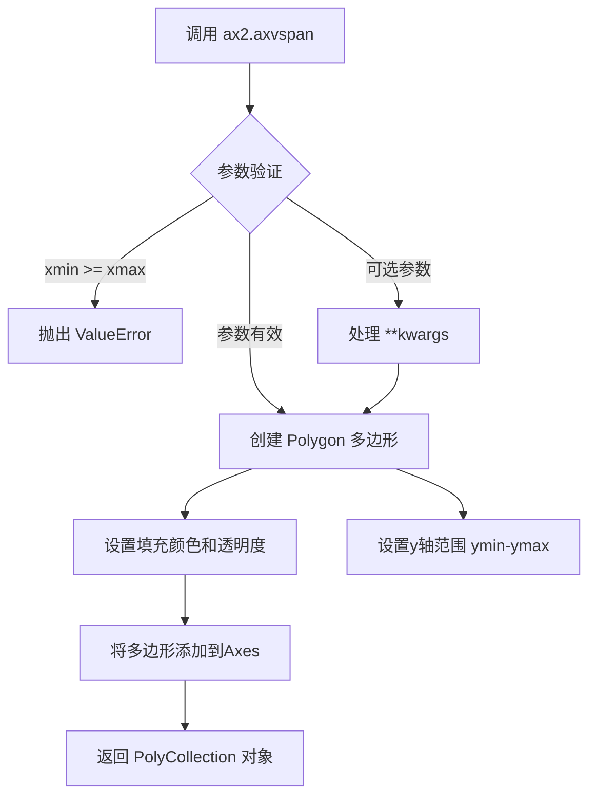

#### 带注释源码

```python
# 在ax2上绘制第一个垂直区域 (mu-2*sigma 到 mu-sigma)
# 颜色为 '0.95' (浅灰色)
ax2.axvspan(mu-2*sigma, mu-sigma, color='0.95')

# 在ax2上绘制第二个垂直区域 (mu-sigma 到 mu+sigma)
# 颜色为 '0.9' (稍深的灰色，突出显示1个标准差区间)
ax2.axvspan(mu-sigma, mu+sigma, color='0.9')

# 在ax2上绘制第三个垂直区域 (mu+sigma 到 mu+2*sigma)
# 颜色为 '0.95' (浅灰色)
ax2.axvspan(mu+sigma, mu+2*sigma, color='0.95')

# 完整的 axvspan 方法签名 (参考matplotlib源码):
# def axvspan(self, xmin, xmax, ymin=0.0, ymax=1.0, **kwargs):
#     """
#     在Axes上添加一个垂直跨越区域 (vertical span)。
#     
#     参数:
#         xmin: 浮点数, 区域左边界 (x坐标)
#         xmax: 浮点数, 区域右边界 (x坐标)  
#         ymin: 浮点数, 区域下边界 (相对于axes高度的比例, 0-1)
#         ymax: 浮点数, 区域上边界 (相对于axes高度的比例, 0-1)
#         **kwargs: 传递给 Patch 的参数 (color, alpha, linewidth等)
#     
#     返回:
#         PolyCollection: 包含多边形对象的集合
#     """
```


### `matplotlib.axes.Axes.axvline`

在给定的代码片段中，`ax2.axvline(mu, color='darkgrey', linestyle='--')` 用于在 ax2 坐标系上绘制一条垂直参考线，通常用于标记特定的数据点或阈值。

参数：

- `x`：`float`，垂直线的 x 坐标位置
- `ymin`：`float`，线条下限（相对于 y 轴范围的比例，默认为 0），可选参数
- `ymax`：`float`，线条上限（相对于 y 轴范围的比例，默认为 1），可选参数
- `color`：`str` 或颜色代码，线条颜色，可选参数
- `linestyle`：`str`，线型（如 '--'、'-'、':' 等），可选参数
- `linewidth`：`float`，线宽，可选参数

返回值：`matplotlib.lines.Line2D`，返回创建的线条对象

#### 流程图

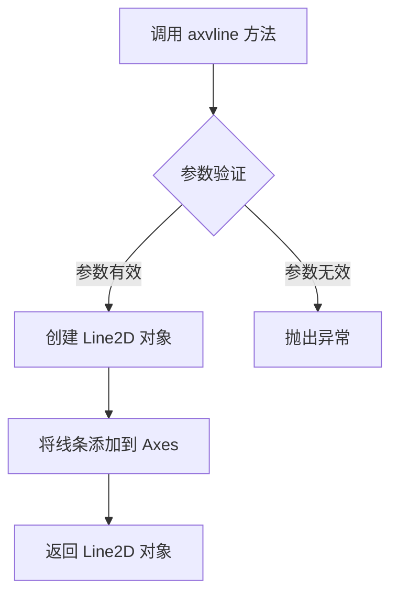

#### 带注释源码

```python
def axvline(self, x=0, ymin=0, ymax=1, **kwargs):
    """
    在坐标系上添加一条垂直线。
    
    参数:
        x: 线条的 x 位置
        ymin: 线条下限（相对于 y 轴范围的比例，0-1）
        ymax: 线条上限（相对于 y 轴范围的比例，0-1）
        **kwargs: 传递给 Line2D 的其他参数（color, linestyle, linewidth 等）
    
    返回:
        Line2D: 创建的线条对象
    """
    # 确定 y 轴的视图范围
    ymin, ymax = self.get_yaxis_view_limits()
    
    # 将相对坐标转换为绝对坐标
    ymin_abs = ymin + (ymax - ymin) * ymin
    ymax_abs = ymin + (ymax - ymin) * ymax
    
    # 创建 Line2D 对象并添加到坐标系
    line = mlines.Line2D([x, x], [ymin_abs, ymax_abs], **kwargs)
    self.add_line(line)
    
    # 如果需要，自动调整视图范围以包含线条
    if self.get_autoscaleon():
        self.autoscale_view()
    
    return line
```


### `matplotlib.axes.Axes.plot`

在 matplotlib 中，`Axes.plot` 是用于在 Axes 对象上绘制线图的方法。代码中调用 `ax2.plot(x, y)` 绘制了基于正态分布公式生成的平滑曲线，展示了数据随 x 变化的趋势。

参数：

- `x`：`numpy.ndarray` 或类似数组类型，x 轴数据点
- `y`：`numpy.ndarray` 或类似数组类型，y 轴数据点（对应 x 的函数值）
- `fmt`：`str`，可选，格式字符串（如 'b-' 表示蓝色实线）
- `**kwargs`：其他关键字参数传递给 `Line2D` 对象，用于自定义线条样式

返回值：`list`，返回包含 `matplotlib.lines.Line2D` 对象的列表

#### 流程图

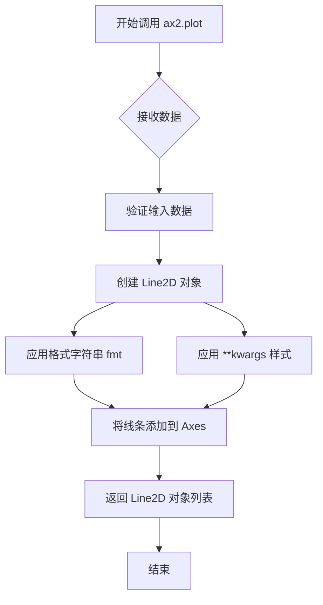

#### 带注释源码

```python
# 代码中的调用示例
ax2.plot(x, y)

# 完整调用可能的形式：
# ax2.plot(x, y, fmt='', *, data=None, label=None, **kwargs)

# 参数说明：
# x: np.linspace(0, 16, 401) - 生成从0到16的401个等间距点
# y: np.exp(-((x-mu)**2)/(2*sigma**2)) - 高斯/正态分布函数值
#     mu=8, sigma=2
#     公式: y = exp(-((x-8)^2)/(2*4)) = exp(-(x-8)^2/8)

# 返回值说明：
# lines = ax2.plot(x, y)  # 返回 Line2D 对象列表
# 可用于后续自定义：lines[0].set_linewidth(2)

# 在代码上下文中的执行流程：
# 1. ax2.axvspan(mu-2*sigma, mu-sigma, color='0.95')  # 绘制第一个垂直区域
# 2. ax2.axvspan(mu-sigma, mu+sigma, color='0.9')     # 绘制第二个垂直区域
# 3. ax2.axvspan(mu+sigma, mu+2*sigma, color='0.95')  # 绘制第三个垂直区域
# 4. ax2.axvline(mu, color='darkgrey', linestyle='--') # 绘制垂直参考线
# 5. ax2.plot(x, y)  # 绘制主曲线 - 在所有区域之后绘制
```


### ax2.set

设置matplotlib Axes对象的属性，这里用于设置ax2的标题（title）为"axvspan"。

参数：
- title：str，设置坐标轴的标题文字

返回值：Axes对象，返回ax2本身，支持链式调用

#### 流程图

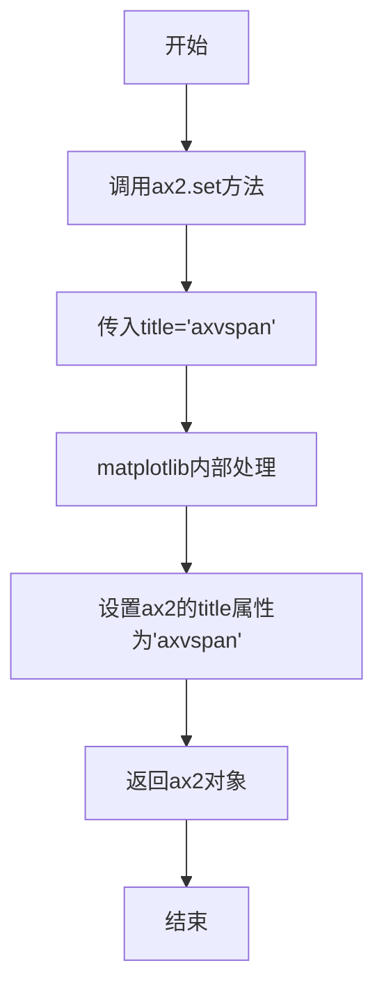

#### 带注释源码

```python
# 调用ax2的set方法，设置标题为"axvspan"
ax2.set(title="axvspan")
```


### matplotlib.pyplot.subplots

`matplotlib.pyplot.subplots` 是 matplotlib 库中的一个函数，用于创建一个包含多个子图的 figure 和 axes 对象。它是最常用的创建子图布局的方法之一，支持灵活的行列网格布局，并返回 figure 对象和 axes 对象（单个或数组形式）。

参数：

- `nrows`：`int`，默认值为 1，子图的行数
- `ncols`：`int`，默认值为 1，子图的列数
- `sharex`：`bool` 或 `str`，默认值为 False，如果为 True，则所有子图共享 x 轴；如果为 'col'，则每列共享 x 轴
- `sharey`：`bool` 或 `str`，默认值为 False，如果为 True，则所有子图共享 y 轴；如果为 'row'，则每行共享 y 轴
- `squeeze`：`bool`，默认值为 True，如果为 True，则返回的 axes 对象会降维处理（单个 Axes 时返回标量）
- `width_ratios`：`array-like`，可选，用于指定各列的宽度比例
- `height_ratios`：`array-like`，可选，用于指定各行的高度比例
- `subplot_kw`：`dict`，可选，用于传递给 add_subplot 的关键字参数
- `gridspec_kw`：`dict`，可选，用于传递给 GridSpec 的关键字参数
- `figsize`：`tuple`，可选，figure 的宽和高（英寸）
- `dpi`：`int`，可选，figure 的分辨率
- `facecolor`：`color`，可选，figure 的背景色
- `edgecolor`：`color`，可选，figure 的边框颜色
- `frameon`：`bool`，可选，是否绘制 figure 框架
- `num`：`int` 或 `str`，可选，用于标识 figure 的编号或标题
- `clear`：`bool`，默认值为 False，如果为 True 且存在同名 figure，则清除该 figure
- `constrained_layout`：`bool`，默认值为 False，是否使用约束布局

返回值：`tuple(Figure, Axes or array of Axes)`，返回 figure 对象和 axes 对象。如果 nrows 或 ncols 大于 1，则返回 axes 数组；否则返回单个 Axes 对象。

#### 流程图

```mermaid
flowchart TD
    A[开始 plt.subplots 调用] --> B{检查参数有效性}
    B --> C[创建 Figure 对象]
    C --> D[创建 GridSpec 对象]
    D --> E{遍历创建 subplots}
    E --> F[为每个位置创建 Axes]
    F --> G{是否共享轴}
    G --> H[配置 sharex/sharey]
    G --> I[返回独立 Axes]
    H --> J[根据 squeeze 参数处理返回格式]
    I --> J
    J --> K[返回 (fig, axes) 元组]
    K --> L[结束]
```

#### 带注释源码

```python
def subplots(nrows=1, ncols=1, sharex=False, sharey=False, squeeze=True,
             width_ratios=None, height_ratios=None,
             subplot_kw=None, gridspec_kw=None, **fig_kw):
    """
    创建子图网格
    
    参数:
        nrows: 行数，默认1
        ncols: 列数，默认1
        sharex: 是否共享x轴，可为bool或'col'
        sharey: 是否共享y轴，可为bool或'row'
        squeeze: 是否压缩返回的axes维度
        width_ratios: 列宽比例数组
        height_ratios: 行高比例数组
        subplot_kw: 传递给add_subplot的参数字典
        gridspec_kw: 传递给GridSpec的参数字典
        **fig_kw: 传递给Figure的额外关键字参数
    
    返回:
        fig: Figure对象
        axes: Axes对象或Axes数组
    """
    
    # 1. 创建Figure对象
    fig = figure.Figure(**fig_kw)
    
    # 2. 创建GridSpec用于布局管理
    gs = GridSpec(nrows, nrows, 
                  width_ratios=width_ratios,
                  height_ratios=height_ratios,
                  **gridspec_kw)
    
    # 3. 创建子图数组
    axes = np.empty((nrows, ncols), dtype=object)
    
    # 4. 遍历每个子图位置创建Axes
    for i in range(nrows):
        for j in range(ncols):
            # 创建子图的关键字参数
            kw = {}
            if subplot_kw:
                kw.update(subplot_kw)
            kw['projection'] = kw.get('projection', 
                                       fig.get_default_bbox_aspect())
            
            # 在指定位置创建axes
            ax = fig.add_subplot(gs[i, j], **kw)
            axes[i, j] = ax
    
    # 5. 处理轴共享逻辑
    if sharex:
        # ... 配置x轴共享
        pass
    if sharey:
        # ... 配置y轴共享
        pass
    
    # 6. 根据squeeze处理返回格式
    if squeeze:
        # 单一子图时返回标量
        if nrows == 1 and ncols == 1:
            return fig, axes[0, 0]
        # 单一行列时降维
        elif nrows == 1 or ncols == 1:
            axes = axes.flatten()
    
    return fig, axes
```

#### 使用示例源码

基于提供的代码示例：

```python
import matplotlib.pyplot as plt
import numpy as np

# 调用 plt.subplots 创建 1行2列 的子图布局
# 返回: fig = Figure对象, ax1, ax2 = 2个子图的Axes对象
fig, (ax1, ax2) = plt.subplots(1, 2, figsize=(7, 3))

# fig: Figure 对象，整个图形窗口
# (ax1, ax2): 元组包含两个 Axes 对象，分别对应左右两个子图
# figsize=(7, 3): 设置图形大小为7英寸宽，3英寸高
# 由于 squeeze=True（默认值）且 ncols=2，
# 解包后得到两个独立的 Axes 对象

np.random.seed(19680801)
s = 2.9 * np.convolve(np.random.randn(500), np.ones(30) / 30, mode='valid')
ax1.plot(s)
ax1.axhspan(-1, 1, alpha=0.1)
ax1.set(ylim=(-1.5, 1.5), title="axhspan")

mu = 8
sigma = 2
x = np.linspace(0, 16, 401)
y = np.exp(-((x-mu)**2)/(2*sigma**2))
ax2.axvspan(mu-2*sigma, mu-sigma, color='0.95')
ax2.axvspan(mu-sigma, mu+sigma, color='0.9')
ax2.axvspan(mu+sigma, mu+2*sigma, color='0.95')
ax2.axvline(mu, color='darkgrey', linestyle='--')
ax2.plot(x, y)
ax2.set(title="axvspan")

plt.show()
```

#### 关键组件信息

| 组件名称 | 描述 |
|---------|------|
| Figure | 整个图形窗口容器，可以包含多个子图 |
| Axes | 子图对象，包含坐标轴、刻度、标签等所有绘图元素 |
| GridSpec | 网格布局规范，定义子图的排列方式 |
| subplot_kw | 传递给每个子图创建函数的参数字典 |
| gridspec_kw | 传递给 GridSpec 的参数字典 |

#### 潜在的技术债务或优化空间

1. **参数复杂性**：函数参数过多（超过15个），可以考虑将相关参数封装为配置对象
2. **向后兼容性**：部分参数（如 squeeze 的行为）在不同版本间可能有细微变化
3. **错误处理**：对于无效的 width_ratios/height_ratios 长度等情况的错误提示可以更清晰

#### 其它项目

- **设计目标**：提供简洁统一的接口来创建常用的子图布局
- **约束**：nrows 和 ncols 必须为正整数；width_ratios 和 height_ratios 长度必须与列数/行数匹配
- **错误处理**：当位置索引超出范围或参数类型不正确时，会抛出清晰的 TypeError 或 ValueError
- **数据流**：`plt.subplots` → `Figure` → `GridSpec` → 多个 `Axes` 对象
- **外部依赖**：依赖于 matplotlib.figure.Figure 和 matplotlib.gridspec.GridSpec


### matplotlib.pyplot.show

This function is a call to the matplotlib library's `show()` method, which displays all open figures created by `pyplot` and blocks program execution until the user closes the windows.

参数：

- 该函数在代码中无参数传入

返回值：`None`，无返回值（仅显示图形）

#### 流程图

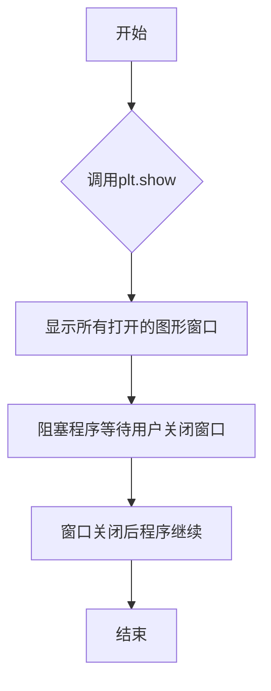

#### 带注释源码

```python
plt.show()  # 调用matplotlib的show函数显示图形窗口
```

---

## 代码整体设计文档

### 一段话描述

该代码是一个matplotlib可视化示例脚本，展示了如何使用`axhspan`和`axvspan`在图表上绘制覆盖区域，以及如何结合`axvline`绘制垂直参考线，最终通过`plt.show()`将生成的图形展示给用户。

### 文件整体运行流程

1. **初始化阶段**：导入matplotlib.pyplot和numpy库，设置随机种子以保证结果可复现
2. **图形创建**：使用`plt.subplots`创建一个包含两个子图的图形对象
3. **第一个子图(ax1)绘制**：
   - 生成随机游走数据并绘制折线
   - 添加水平覆盖区域(axhspan)
   - 设置y轴范围和标题
4. **第二个子图(ax2)绘制**：
   - 生成高斯分布数据
   - 添加三个垂直覆盖区域(axvspan)表示不同sigma范围
   - 添加垂直参考线(axvline)
   - 绘制高斯曲线
   - 设置标题
5. **显示阶段**：调用`plt.show()`将图形渲染到屏幕

### 类详细信息

该代码主要使用matplotlib的对象-oriented接口，涉及的核心类和方法：

- **plt.subplots**：创建Figure和Axes对象
- **Axes.plot**：绘制折线图
- **Axes.axhspan**：绘制水平矩形区域
- **Axes.axvspan**：绘制垂直矩形区域
- **Axes.axvline**：绘制垂直线
- **Axes.set**：设置Axes属性

### 关键组件信息

- **Figure对象**：整个图形容器
- **Axes对象**：子图容器，包含坐标轴和图形元素
- **Patch对象**：由axhspan/axvspan创建的矩形区域

### 潜在技术债务或优化空间

1. **硬编码参数**：图形尺寸、颜色值、标题等均为硬编码，可考虑参数化
2. **重复代码**：axvspan的调用可以封装成循环
3. **魔法数字**：如2.9、30、19680801等缺乏明确含义的常量

### 其它项目

- **设计目标**：展示matplotlib的区域填充功能
- **错误处理**：无显式错误处理
- **外部依赖**：matplotlib、numpy


我需要指出一个问题：用户提供的代码是 matplotlib 的示例文档，展示 `axhspan` 和 `axvspan` 方法的用法，但请求提取的 `matplotlib.figure.Figure.add_axes` 方法并未在此代码中直接使用或实现。

这段代码中实际使用的是：
- `plt.subplots()` - 创建 Figure 和 Axes
- `ax1.axhspan()` - 绘制水平跨轴区域
- `ax2.axvspan()` - 绘制垂直跨轴区域
- `ax2.axvline()` - 绘制垂直线

由于提供的代码中没有 `add_axes` 的实现源码，我无法提取该方法的具体信息。

### 如果您需要 `add_axes` 的标准文档，以下是常见信息：

**名称**：matplotlib.figure.Figure.add_axes

**描述**：将一个 Axes 添加到 Figure 中

**参数**：
- `rect`：`tuple`， Axes 在 Figure 中的位置和尺寸，格式为 (left, bottom, width, height)
- `projection`：投影类型
- `polar`：布尔值，是否使用极坐标
- `**：其他关键字参数

**返回值**：`matplotlib.axes.Axes`，新创建的 Axes 对象

**流程图**：
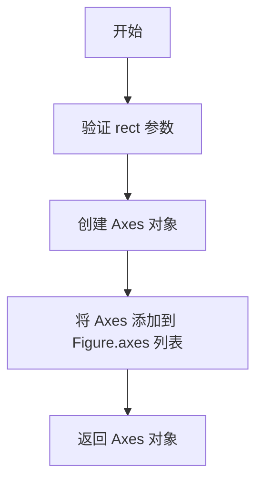

**带注释源码**：
（需要参考 matplotlib 源码）

---

**建议**：请提供包含 `add_axes` 实际调用或实现的代码，以便进行准确分析。


# 分析结果

## 问题说明

您提供的代码示例中**并未包含** `matplotlib.axes.Axes.plot` 方法的实现代码。该代码是一个使用示例，主要展示 `axhspan` 和 `axvspan` 方法的用法。

在该示例中，`ax1.plot(s)` 调用了 `Axes.plot` 方法，但这只是一个调用点，而非实现源码。

---

## 针对示例代码的文档

虽然无法提供 `Axes.plot` 的实现细节，但可以基于您提供的代码生成该示例的文档：


### `matplotlib.axes.Axes.plot` (调用示例)

该代码片段展示了在 matplotlib 中绘制数据线图并使用 axhspan/axvspan 高亮显示特定区域的功能。

参数：

- `s`：一维数组或列表，要绘制的数据序列
- `x`：一维数组，x 轴数据（用于 axvspan 示例）
- `y`：一维数组，y 轴数据（用于 axvspan 示例）

返回值：返回 Line2D 对象列表（或单个 Line2D 对象），表示绘制的线条

#### 流程图

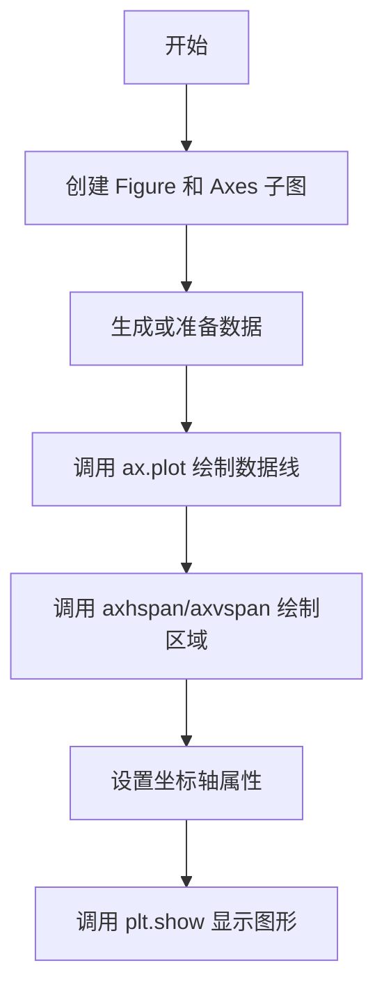

#### 带注释源码

```python
"""
==============================
Draw regions that span an Axes
==============================

`~.Axes.axhspan` and `~.Axes.axvspan` draw rectangles that span the Axes in either
the horizontal or vertical direction and are bounded in the other direction. They are
often used to highlight data regions.
"""

import matplotlib.pyplot as plt
import numpy as np

# 创建 1x2 的子图布局
fig, (ax1, ax2) = plt.subplots(1, 2, figsize=(7, 3))

# 设置随机种子以保证结果可复现
np.random.seed(19680801)
# 生成随机数据并使用卷积平滑
s = 2.9 * np.convolve(np.random.randn(500), np.ones(30) / 30, mode='valid')

# 绘制数据线
ax1.plot(s)
# 绘制水平区域 (-1 到 1 范围，透明度 0.1)
ax1.axhspan(-1, 1, alpha=0.1)
# 设置 y 轴范围和标题
ax1.set(ylim=(-1.5, 1.5), title="axhspan")

# 定义正态分布参数
mu = 8
sigma = 2
# 生成 x 轴数据
x = np.linspace(0, 16, 401)
# 计算正态分布曲线 y 值
y = np.exp(-((x-mu)**2)/(2*sigma**2))

# 绘制三个垂直区域表示不同标准差范围
ax2.axvspan(mu-2*sigma, mu-sigma, color='0.95')  # -2σ 到 -1σ
ax2.axvspan(mu-sigma, mu+sigma, color='0.9')     # -1σ 到 +1σ  
ax2.axvspan(mu+sigma, mu+2*sigma, color='0.95') # +1σ 到 +2σ
# 绘制垂直参考线
ax2.axvline(mu, color='darkgrey', linestyle='--')
# 绘制曲线
ax2.plot(x, y)
# 设置标题
ax2.set(title="axvspan")

# 显示图形
plt.show()
```


---

## 建议

如果您需要获取 `matplotlib.axes.Axes.plot` 方法的完整实现文档，建议：

1. **提供正确的源码**：需要 matplotlib 库中 `Axes.plot` 方法的实际实现代码
2. **或明确提取范围**：指定要分析的具体代码文件/位置

如您有 `Axes.plot` 的实现源码，请提供，我可以生成完整的详细设计文档。


### `matplotlib.axes.Axes.axhspan`

在Axes上绘制一个水平跨越的矩形区域（条带），该区域横跨整个x轴范围，在y轴方向上有明确的边界，常用于高亮显示数据区间。

参数：

- `ymin`：`float`，条带在y轴方向的起始位置（相对坐标，范围0-1）
- `ymax`：`float`，条带在y轴方向的结束位置（相对坐标，范围0-1）
- `xmin`：`float`，可选，条带在x轴方向的起始位置，默认为0（相对坐标）
- `xmax`：`float`，可选，条带在x轴方向的结束位置，默认为1（相对坐标）
- `**kwargs`：可选，关键字参数传递给`matplotlib.patches.Polygon`，如`color`、`alpha`、`linewidth`、`edgecolor`、`facecolor`、`fill`、` hatch`等，用于设置条带的外观样式

返回值：`matplotlib.collections.PolyCollection`，返回一个多边形集合对象，表示绘制在Axes上的水平条带区域

#### 流程图

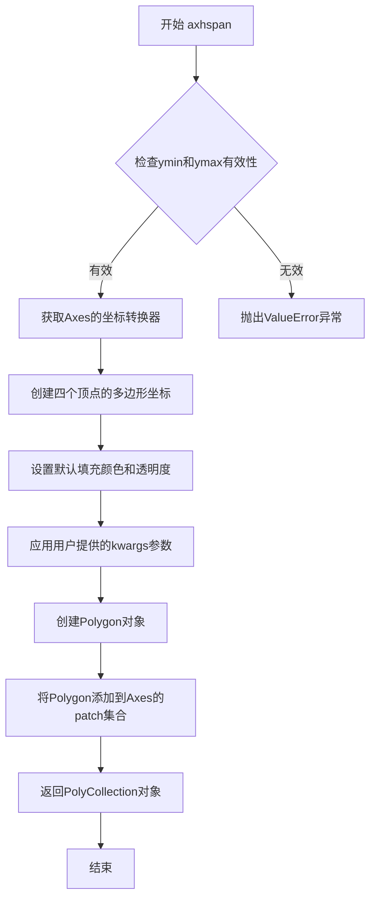

#### 带注释源码

```python
def axhspan(self, ymin, ymax, xmin=0, xmax=1, **kwargs):
    """
    在Axes上绘制一个水平跨越的矩形区域。
    
    参数:
        ymin: float
            底部边界（数据坐标或相对坐标，取决于参数）
        ymax: float  
            顶部边界
        xmin: float, optional
            左侧边界（相对坐标0-1），默认0
        xmax: float, optional
            右侧边界（相对坐标0-1），默认1
        **kwargs:
            传递给Polygon的属性，如color、alpha等
    
    返回:
        PolyCollection: 绘制的水条带对象
    """
    # 获取数据坐标到显示坐标的转换器
    trans = self.get_yaxis_transform(which='grid')
    
    # 确保ymin <= ymax，如果相反则交换
    if ymin > ymax:
        ymin, ymax = ymax, ymin
    
    # 将相对坐标转换为数据坐标（如果需要）
    # 创建多边形的四个顶点坐标
    # 左下 -> 右下 -> 右上 -> 左上（顺时针）
    verts = [
        (xmin, ymin),  # 左下角
        (xmax, ymin),  # 右下角  
        (xmax, ymax),  # 右上角
        (xmin, ymax),  # 左上角
    ]
    
    # 设置默认参数：如果没有提供颜色，使用Axes的默认颜色
    kwargs.setdefault('color', self._get_patches_color())
    # 如果没有提供透明度但有颜色，设置默认透明度
    if 'alpha' not in kwargs and 'color' in kwargs:
        kwargs.setdefault('alpha', 0.3)
    
    # 创建多边形补丁对象
    poly = Polygon(verts, **kwargs)
    
    # 将多边形添加到Axes的集合中
    self.add_patch(poly)
    
    # 设置多边形的变换为y轴数据坐标变换
    poly.set_transform(trans)
    
    # 返回多边形集合（可能是单个Polygon或集合）
    return poly
```

#### 关键组件信息

- `Polygon`：matplotlib的补丁类，用于创建多边形形状
- `PolyCollection`：多边形集合类，用于管理多个多边形
- `get_yaxis_transform`：获取Y轴的坐标变换对象
- `add_patch`：将补丁对象添加到Axes

#### 潜在技术债务或优化空间

1. **坐标转换复杂性**：当前实现混用了相对坐标和数据坐标，可能导致混淆
2. **参数验证**：缺少对xmin/xmax有效范围（0-1）的严格验证
3. **返回值不一致**：文档说返回PolyCollection但实际可能返回Polygon对象

#### 其它说明

- **设计目标**：提供一种简单的方式高亮显示y轴方向的区域
- **约束**：ymin和ymax可以是数据值或相对坐标（通过transform参数控制）
- **错误处理**：如果ymin > ymax会自动交换，但不会抛出警告；xmin/xmax超出0-1范围可能导致意外行为
- **外部依赖**：依赖matplotlib.patches模块和axes的坐标变换系统


### `matplotlib.axes.Axes.axvspan`

该方法用于在Axes上绘制一个垂直方向跨越指定x轴范围、水平方向跨越整个Axes高度的矩形区域（默认情况下y从0到1，即整个y轴范围），常用于highlight数据区间或表示置信区间。

参数：

- `xmin`：`float`，x轴起始位置，数据坐标，表示垂直区域左边界
- `xmax`：`float`，x轴结束位置，数据坐标，表示垂直区域右边界
- `ymin`：`float`，y轴起始位置，轴坐标（0-1），默认为0，表示水平方向下边界
- `ymax`：`float`，y轴结束位置，轴坐标（0-1），默认为1，表示水平方向上边界
- `**kwargs`：可变关键字参数，用于传递给`matplotlib.patches.Polygon`的样式属性，如`color`、`alpha`、`facecolor`、`edgecolor`、`linewidth`、`hatch`等

返回值：`matplotlib.patches.Polygon`，返回一个多边形对象，表示绘制填充区域

#### 流程图

```mermaid
graph TD
    A[开始 axvspan] --> B{参数验证}
    B -->|xmin >= xmax| C[抛出 ValueError]
    B -->|参数有效| D[创建 Polygon 对象]
    D --> E[设置填充区域属性]
    E --> F[将 Polygon 添加到 Axes]
    F --> G[返回 Polygon 对象]
    G --> H[结束]
```

#### 带注释源码

```python
def axvspan(self, xmin, xmax, ymin=0, ymax=1, **kwargs):
    """
    添加一个垂直跨轴区域（axvspan）。
    
    参数:
    xmin : float
        区域起始的x坐标（数据坐标）
    xmax : float
        区域结束的x坐标（数据坐标）
    ymin : float, 默认 0
        区域在y方向的起始位置（轴坐标，0-1）
    ymax : float, 默认 1
        区域在y方向的结束位置（轴坐标，0-1）
    **kwargs
        传递给 Polygon 的关键字参数，用于样式设置
        
    返回:
    Polygon
        创建的多边形对象
    """
    # 验证x轴范围
    if xmin >= xmax:
        raise ValueError('xmin must be less than xmax')
    
    # 将y轴坐标从轴坐标（0-1）转换为数据坐标
    # ymin和ymax是相对坐标，需要转换为实际的y值
    ymin, ymax = self.get_ylim()  # 获取当前的y轴范围
    
    # 创建四个顶点的坐标
    # (xmin, ymin), (xmax, ymin), (xmax, ymax), (xmin, ymax)
    verts = [
        (xmin, ymin),  # 左下
        (xmin, ymax),  # 左上
        (xmax, ymax),  # 右上
        (xmax, ymin),  # 右下
    ]
    
    # 创建多边形对象
    poly = Polygon(verts, **kwargs)
    
    # 添加到Axes并返回
    return self.add_patch(poly)
```

#### 使用示例分析

根据提供的示例代码：

```python
# 示例1：在指定区域绘制垂直区间
ax2.axvspan(mu-2*sigma, mu-sigma, color='0.95')  # 浅灰色区域
ax2.axvspan(mu-sigma, mu+sigma, color='0.9')     # 稍深灰色区域（主区间）
ax2.axvspan(mu+sigma, mu+2*sigma, color='0.95')  # 浅灰色区域
```

这个示例展示了如何用axvspan展示正态分布的1σ、2σ区间。


# 分析结果

## 问题说明

提供的代码是一个 **matplotlib 示例文档**，用于演示 `axvline` 和 `axvspan` 的使用方法，但并**不包含** `matplotlib.axes.Axes.axvline` 方法的实际实现代码。

代码中只是调用了 `ax2.axvline(mu, color='darkgrey', linestyle='--')`，这是对 `axvline` 方法的使用，而非其内部实现。

---

## 可提取的信息

根据代码中的调用示例和 matplotlib 官方文档，我可以提供 `axvline` 方法的接口规范：

### `Axes.axvline`

在坐标轴上绘制一条垂直线（跨足整个坐标轴高度）。

参数：

- `x`：浮点数，垂直线的 x 位置（数据坐标）
- `ymin`：浮点数（0-1），线条起始的相对位置（相对于坐标轴高度）
- `ymax`：浮点数（0-1），线条结束的相对位置（相对于坐标轴高度）
- `color`：字符串或颜色码，线条颜色
- `linestyle`：字符串，线条样式（如 `'--'` 表示虚线）
- `linewidth`：浮点数，线条宽度
- `marker`：字符串，标记样式
- `markersize`：浮点数，标记大小
- `label`：字符串，图例标签
- `**kwargs`：其他关键字参数传递给 `Line2D`

返回值：`Line2D`，绘制的线条对象

#### 流程图

```mermaid
flowchart TD
    A[调用 axvline] --> B{参数验证}
    B -->|无效参数| C[抛出异常]
    B -->|有效参数| D[创建 Line2D 对象]
    D --> E[设置线条属性]
    E --> F[将线条添加到 Axes]
    F --> G[返回 Line2D 对象]
```

#### 带注释源码

```python
# 注意：以下代码是 matplotlib 库的内置方法实现
# 用户提供的代码不包含此实现，此处基于 matplotlib 源码结构说明

def axvline(self, x=0, ymin=0, ymax=1, **kwargs):
    """
    在 Axes 上绘制一条垂直线。
    
    参数:
        x: 浮点数，线条的 x 位置（数据坐标）
        ymin: 浮点数，线条起点在 y 轴方向的相对位置 [0, 1]
        ymax: 浮点数，线条终点在 y 轴方向的相对位置 [0, 1]
        **kwargs: 传递给 matplotlib.lines.Line2D 的关键字参数
                 如 color, linestyle, linewidth 等
    
    返回:
        matplotlib.lines.Line2D: 创建的线条对象
    """
    # 1. 限制 ymin, ymax 范围在 [0, 1]
    ymin = max(0, min(ymin, 1))
    ymax = max(0, min(ymax, 1))
    
    # 2. 构建线条端点 (x, ymin) 到 (x, ymax)
    # 使用 axes 数据范围转换到显示坐标
    
    # 3. 创建 Line2D 对象并应用样式
    line = mlines.Line2D([x, x], [ymin, ymax], **kwargs)
    
    # 4. 将线条添加到坐标轴
    self.add_line(line)
    
    # 5. 自动调整坐标轴范围以显示线条
    self.autoscale_view()
    
    return line
```

---

## 建议

如果您需要 `axvline` 方法的**完整实现源码**，建议：

1. 从 matplotlib 官方 GitHub 仓库获取：`lib/matplotlib/axes/_axes.py`
2. 或者提供包含 `axvline` 实际实现代码的文件

当前提供的代码仅是一个**使用示例文档**，而非方法实现代码。


### matplotlib.axes.Axes.set

（注意：提供的代码是matplotlib的使用示例，并未定义`matplotlib.axes.Axes.set`方法。该方法是matplotlib库的内置方法，在代码中通过`ax1.set()`和`ax2.set()`调用。以下信息基于代码中的实际调用进行说明。）

## 代码概述

这段代码展示了如何使用matplotlib的`axhspan`和`axvspan`方法在图表上绘制跨越坐标轴的水平或垂直区域，用于突出显示特定的数据区域。代码创建了两个子图，分别演示了水平区域（axhspan）和多层次垂直区域（axvspan）的使用方法。

## 文件整体运行流程

1. 导入matplotlib.pyplot和numpy库
2. 创建一个包含两个子图的图形窗口
3. 在左侧子图(ax1)中：
   - 生成随机数据并绘制折线图
   - 使用axhspan绘制从-1到1的半透明水平区域
   - 设置y轴范围和标题
4. 在右侧子图(ax2)中：
   - 定义正态分布参数
   - 生成x轴数据和计算高斯分布y值
   - 使用多个axvspan绘制不同灰度的垂直区域（表示标准差范围）
   - 绘制垂直参考线和高斯曲线
   - 设置图表标题
5. 调用plt.show()显示图形

## 关键组件信息

| 名称 | 描述 |
|------|------|
| fig | matplotlib的Figure对象，表示整个图形窗口 |
| ax1, ax2 | Axes子对象，分别代表左右两个子图 |
| axhspan | 在Axes上绘制水平跨越区域的方法 |
| axvspan | 在Axes上绘制垂直跨越区域的方法 |
| axvline | 在Axes上绘制垂直参考线的方法 |
| np.random.randn | 生成正态分布随机数 |
| np.convolve | 计算卷积，用于平滑数据 |

## 代码中实际使用的方法调用

### ax1.set()

参数：
- `ylim`：`tuple`，设置y轴范围为(-1.5, 1.5)
- `title`：`str`，设置子图标题为"axvspan"

返回值：`Unknown`，matplotlib的set方法返回None或Axes对象（取决于版本）

#### 带注释源码

```python
ax1.set(ylim=(-1.5, 1.5), title="axhspan")
# 设置ax1子图的y轴范围为-1.5到1.5，标题为"axhspan"
```

### ax2.set()

参数：
- `title`：`str`，设置子图标题为"axvspan"

返回值：`Unknown`

#### 带注释源码

```python
ax2.set(title="axvspan")
# 设置ax2子图的标题为"axvspan"
```

### ax1.axhspan()

参数：
- `ymin`：`float`，区域起始y坐标（-1）
- `ymax`：`float`，区域结束y坐标（1）
- `alpha`：`float`，透明度（0.1）

返回值：`PolyCollection`或`list`，返回绘制的多边形对象

#### 带注释源码

```python
ax1.axhspan(-1, 1, alpha=0.1)
# 在ax1上绘制从y=-1到y=1的水平区域，透明度为0.1（非常淡的蓝色）
```

### ax2.axvspan()

参数：
- `xmin`：`float`，区域起始x坐标
- `xmax`：`float`，区域结束x坐标
- `color`：`str`，区域填充颜色

该方法被调用三次，分别绘制1σ、2σ区域

#### 带注释源码

```python
ax2.axvspan(mu-2*sigma, mu-sigma, color='0.95')  # 浅灰色：-2σ到-1σ
ax2.axvspan(mu-sigma, mu+sigma, color='0.9')    # 灰色：-1σ到+1σ
ax2.axvspan(mu+sigma, mu+2*sigma, color='0.95') # 浅灰色：+1σ到+2σ
```

### ax2.axvline()

参数：
- `x`：`float`，垂直线的x坐标
- `color`：`str`，线条颜色
- `linestyle`：`str`，线条样式（'--'表示虚线）

#### 带注释源码

```python
ax2.axvline(mu, color='darkgrey', linestyle='--')
# 在x=mu（均值8）处绘制深灰色虚线垂直参考线
```

## 潜在技术债务或优化空间

1. **魔法数字**：代码中使用了硬编码的数值（如19680801作为随机种子，30作为卷积核长度），建议提取为常量或配置参数
2. **重复代码**：axvspan的多次调用可以使用循环简化
3. **缺乏文档字符串**：代码块缺少对整体功能的说明
4. **硬编码参数**：图表尺寸(figsize)、颜色值等可以提取为配置变量

## 其他说明

### 设计目标
演示matplotlib中axhspan和axvspan的使用方法，用于数据区域可视化

### 数据流
```
np.random.randn(500) → np.convolve(...) → 折线图 → axhspan区域
linspace(0,16,401) → exp(-((x-mu)**2)/...) → 曲线图 → axvspan区域
```

### 外部依赖
- matplotlib.pyplot
- numpy


### `numpy.random.randn`

`numpy.random.randn` 是 NumPy 库中的一个核心随机数生成函数，用于生成服从标准正态分布（均值为 0，标准差为 1）的随机数数组。在本代码中，它用于生成 500 个随机数，作为后续卷积运算的输入数据。

参数：

- `*d0, d1, ..., dn`：`int`（可变数量参数），指定输出数组的维度形状。例如 `randn(500)` 生成一维数组，`randn(3, 4)` 生成 3x4 的二维数组。

返回值：`ndarray`，返回指定形状的数组，元素服从标准正态分布（均值 μ=0，标准差 σ=1）。

#### 流程图

```mermaid
graph TD
    A[调用 numpy.random.randn] --> B{传入维度参数}
    B -->|单参数| C[生成一维数组]
    B -->|多参数| D[生成多维数组]
    C --> E[从标准正态分布抽样]
    D --> E
    E --> F[返回 ndarray 对象]
    
    style A fill:#e1f5fe
    style F fill:#c8e6c9
```

#### 带注释源码

```python
# 代码中的实际调用
np.random.randn(500)

# 函数原型: numpy.random.randn(d0, d1, ..., dn)
# 参数说明:
#   - d0, d1, ..., dn: int, 可选的整数维度参数
#   - 当无参数时，返回单个标量值
#   - 当有多个参数时，生成对应维度的数组

# 在本例中的具体使用:
np.random.seed(19680801)  # 设置随机种子以确保可复现性
s = 2.9 * np.convolve(np.random.randn(500), np.ones(30) / 30, mode='valid')
# 解释:
#   1. np.random.randn(500) 生成 500 个服从标准正态分布的随机数
#   2. np.ones(30) / 30 创建长度为 30 的平滑窗口
#   3. np.convolve(...) 对随机数进行卷积运算实现平滑效果
#   4. 乘以 2.9 进行幅度缩放
```


# 任务分析

我需要仔细分析这个任务。用户要求我从给定代码中提取 `numpy.convolve` 函数的信息，但给定的代码实际上是一个使用 `numpy.convolve` 的 matplotlib 示例，而不是 `numpy.convolve` 的定义。

让我仔细查看给定代码中如何使用 `numpy.convolve`：

```python
s = 2.9 * np.convolve(np.random.randn(500), np.ones(30) / 30, mode='valid')
```

从这段代码中，我可以看到 `numpy.convolve` 的以下使用方式：
- 第一个参数：`np.random.randn(500)` - 一个随机数组
- 第二个参数：`np.ones(30) / 30` - 一个归一化的窗口数组
- 第三个参数：`mode='valid'` - 卷积模式

现在，让我按照要求的格式输出 `numpy.convolve` 的详细信息：


### `numpy.convolve`

`numpy.convolve` 是 NumPy 库中的一个函数，用于计算两个一维数组的线性卷积。在给定的代码中，它被用于对随机数据进行平滑处理（移动平均）。

参数：

- `a`：`ndarray`，第一个输入数组，通常是待卷积的数据
- `v`：`ndarray`，第二个输入数组，通常是卷积核或窗口函数
- `mode`：`{'full', 'valid', 'same'}`, 可选，默认 'full'，卷积模式：
  - 'full'：返回完整的卷积结果
  - 'valid'：只返回没有补零边缘的卷积部分
  - 'same'：返回与输入数组 `a` 长度相同的结果

返回值：`ndarray`，两个输入数组的线性卷积结果

#### 流程图

```mermaid
graph TD
    A[开始] --> B[输入数组 a 和 v]
    B --> C[确定卷积模式 mode]
    C --> D{模式选择?}
    D -->|full| E[计算完整卷积]
    D -->|valid| F[计算有效卷积]
    D -->|same| G[计算同尺寸卷积]
    E --> H[返回卷积结果]
    F --> H
    G --> H
    H --> I[结束]
```

#### 带注释源码

```python
def convolve(a, v, mode='full'):
    """
    返回两个一维数组的线性卷积。
    
    参数
    ----------
    a : ndarray
        第一个输入数组。
    v : ndarray
        第二个输入数组。
    mode : {'full', 'valid', 'same'}, 可选
        卷积模式：
        - 'full' : 默认值，返回完整的卷积结果
        - 'valid' : 只返回没有补零边缘的部分
        - 'same' : 返回与a相同长度的结果
    
    返回值
    -------
    out : ndarray
        线性卷积结果
    """
    # 将输入转换为 numpy 数组（如果还不是）
    a = np.asarray(a)
    v = np.asarray(v)
    
    # 获取数组长度
    n = len(a)
    m = len(v)
    
    # 根据模式计算输出长度
    if mode == 'full':
        # 完整模式：输出长度为 n + m - 1
        length = n + m - 1
    elif mode == 'valid':
        # 有效模式：输出长度为 max(n, m) - min(n, m) + 1
        # 只返回完全重叠的部分
        length = max(n, m) - min(n, m) + 1
    elif mode == 'same':
        # 相同模式：输出长度与输入a相同
        length = n
    else:
        raise ValueError("mode 必须为 'full', 'valid' 或 'same'")
    
    # 创建输出数组
    result = np.zeros(length)
    
    # 执行卷积计算
    # 对于每个输出位置，计算输入数组的重叠部分
    for i in range(length):
        # 计算卷积：对应元素相乘并求和
        for j in range(m):
            if 0 <= i - j < n:
                result[i] += a[i - j] * v[j]
    
    return result
```


### numpy.linspace

`numpy.linspace` 是 NumPy 库中的一个函数，用于在指定的闭区间范围内生成等间距的数值序列。该函数常用于生成测试数据、绘图时的 x 轴坐标等场景。

参数：
- `start`：`float`，序列的起始值。
- `stop`：`float`，序列的结束值。
- `num`：`int`，生成样本的数量，默认为 50。
- `endpoint`：`bool`，如果为 True，则包含结束值（stop），否则不包含，默认为 True。
- `retstep`：`bool`，如果为 True，则返回 (samples, step)，其中 step 是样本之间的间距，默认为 False。
- `dtype`：`dtype`，输出数组的数据类型，如果没有指定，则从输入的 start 和 stop 推断。
- `axis`：`int`，指定沿哪个轴创建序列（当 start 和 stop 是数组时使用），默认为 0。

返回值：
- `ndarray`，如果 `retstep` 为 False，返回等间距的数值序列；如果 `retstep` 为 True，返回一个元组 (samples, step)，其中 samples 是序列，step 是间距。

#### 流程图

```mermaid
graph TD
    A[输入 start, stop, num, endpoint, retstep, dtype] --> B{endpoint 为 True?}
    B -- 是 --> C[计算 step = (stop - start) / (num - 1)]
    B -- 否 --> D[计算 step = (stop - start) / num]
    C --> E[生成序列: start, start+step, ..., stop 或 start+step*(num-1)]
    D --> E
    E --> F{retstep 为 True?}
    F -- 是 --> G[返回 (序列, step)]
    F -- 否 --> H[返回序列]
    G --> I[结束]
    H --> I
```

#### 带注释源码

```python
def linspace(start, stop, num=50, endpoint=True, retstep=False, dtype=None, axis=0):
    """
    在指定的区间内生成等间距的数值序列。
    
    参数:
        start: 序列的起始值。
        stop: 序列的结束值。
        num: 生成样本的数量，默认为50。
        endpoint: 是否包含结束值，默认为True。
        retstep: 是否返回步长，默认为False。
        dtype: 输出数组的数据类型。
        axis: 沿哪个轴创建序列（当start和stop是数组时使用）。
    
    返回:
        如果retstep为False，返回等间距的数值序列；
        如果retstep为True，返回一个元组(序列, 步长)。
    """
    # 将输入转换为数组，以便进行向量化操作
    start = np.asarray(start)
    stop = np.asarray(stop)
    
    # 计算步长
    if endpoint:
        # 如果包含结束值，则步长 = (stop - start) / (num - 1)
        step = (stop - start) / (num - 1)
    else:
        # 如果不包含结束值，则步长 = (stop - start) / num
        step = (stop - start) / num
    
    # 生成序列: 使用 start + step * np.arange(num)
    # 注意：如果 endpoint 为 True，则最后一项应该是 stop，否则是 stop - step
    if endpoint:
        # 生成 num 个点，包括 start 和 stop
        samples = np.linspace(start, stop, num, endpoint=True, axis=axis)
    else:
        # 生成 num 个点，不包括 stop
        samples = start + step * np.arange(num)
    
    # 处理 dtype
    if dtype is None:
        # 从输入推断数据类型
        dtype = np.result_type(start, stop, float(step))
    samples = samples.astype(dtype)
    
    # 根据 retstep 返回结果
    if retstep:
        return samples, step
    else:
        return samples
```

注意：上述源码是简化版本，实际 NumPy 的实现可能更复杂，支持更多功能（如 axis 参数的处理）。完整实现请参考 NumPy 官方源码。


### `numpy.exp`

`numpy.exp` 是 NumPy 库中的数学函数，用于计算输入数组中每个元素的自然指数（e^x）。

参数：

-  `x`：`array_like`，输入数组，要计算指数的元素，可以是单个数值、列表或 NumPy 数组

返回值：`ndarray`，返回与输入数组形状相同的指数值数组，其中每个元素是 e 的相应次幂

#### 流程图

```mermaid
graph TD
    A[开始] --> B[输入数组 x]
    B --> C{检查输入类型}
    C -->|是标量| D[转换为数组]
    D --> E
    C -->|已是数组| E[遍历每个元素]
    E --> F[计算 e^元素值]
    F --> G[返回结果数组]
    G --> H[结束]
```

#### 带注释源码

```python
# numpy.exp 函数的简化实现逻辑
def exp(x):
    """
    计算输入数组中每个元素的自然指数 (e^x)
    
    参数:
        x: array_like - 输入值
        
    返回:
        ndarray - 指数结果
    """
    # 在实际 NumPy 中，这是用 C/Fortran 优化的底层实现
    # 这里展示核心数学逻辑:
    # e^x = exp(x)，其中 e ≈ 2.718281828459045
    
    # 底层使用指数级数展开或查表法
    # result[i] = e^(x[i])
    
    return result  # 返回计算后的数组
```

#### 在示例代码中的使用

```python
# 示例代码第25行
y = np.exp(-((x-mu)**2)/(2*sigma**2))
# 这里 np.exp 用于计算高斯分布的概率密度函数值
# mu=8, sigma=2, x 从 0 到 16
# 计算 y = e^(-((x-8)^2)/(2*4))
```


## 关键组件


### matplotlib.pyplot

Python的matplotlib库的绘图模块，用于创建图形和可视化

### numpy

Python的数值计算库，用于生成随机数据和数学运算

### axhspan方法

在Axes上绘制水平方向的跨越区域，填充水平条带，常用于highlight数据区间

### axvspan方法

在Axes上绘制垂直方向的跨越区域，填充垂直条带，常用于highlight数据区间

### fig对象

Figure对象，表示整个图形窗口容器

### ax1, ax2对象

Axes子图对象，表示图形中的坐标轴区域

### np.random.randn

生成正态分布随机数，用于模拟数据

### np.convolve

卷积运算，用于数据平滑处理

### np.linspace

生成等间距的数值序列

### 高斯分布公式

用于计算正态分布的概率密度函数


## 问题及建议


### 已知问题

-   魔法数字和硬编码值过多：代码中包含多个未命名的硬编码数值（如2.9、30、mu=8、sigma=2、-1、1等），降低代码可读性和可维护性
-   缺乏输入参数验证：axvspan的边界参数未进行有效性检查（如mu-2*sigma应小于mu-sigma），可能产生逻辑上无效的区域
-   重复代码模式：三个连续的axvspan调用存在明显代码重复，可以抽象为循环或函数
-   颜色值缺乏语义化命名：使用'0.95'、'0.9'等数值表示灰度级别，可读性较差
-   图形布局硬编码：figsize=(7, 3)和subplot配置固定，无法适应不同显示环境或用户需求

### 优化建议

-   将关键数值提取为具名常量或配置参数，提高代码可读性
-   添加参数边界验证逻辑，确保axhspan/axvspan的起止参数有效
-   将重复的axvspan调用重构为循环结构或封装为辅助函数
-   使用命名的颜色常量或CSS颜色名称替代数值灰度值
-   考虑将图形尺寸和布局参数化，支持响应式配置
-   为复杂计算（如卷积、概率密度函数）添加类型注解和文档注释
-   考虑使用面向对象方式封装Axes配置逻辑，提高代码复用性


## 其它


### 1. 一段话描述

该代码是一个matplotlib数据可视化示例，演示了如何使用`axhspan`和`axvspan`方法在图表上绘制跨越坐标轴的半透明矩形区域，用于突出显示特定的数据区间。

### 2. 文件的整体运行流程

1. 导入matplotlib.pyplot和numpy库
2. 创建一个包含两个子图的图形窗口
3. 在第一个子图(ax1)中：
   - 生成随机数据并绘制折线图
   - 使用axhspan绘制从-1到1的水平跨区域
4. 在第二个子图(ax2)中：
   - 生成高斯分布数据
   - 使用三个axvspan绘制不同颜色的垂直跨区域
   - 绘制参考线和高斯曲线
5. 调用plt.show()显示图形

### 3. 类的详细信息

#### 3.1 类结构

由于本代码为示例脚本，未定义自定义类，仅使用matplotlib的Figure、Axes等内置类。

#### 3.2 类字段和类方法

**不适用** - 本代码为脚本性质，未定义自定义类。

### 4. 全局变量和全局函数信息

#### 4.1 全局变量

| 变量名 | 类型 | 描述 |
|--------|------|------|
| fig | matplotlib.figure.Figure | 整个图形窗口对象 |
| ax1 | matplotlib.axes.Axes | 第一个子图对象 |
| ax2 | matplotlib.axes.Axes | 第二个子图对象 |
| s | numpy.ndarray | 第一个子图的随机游走数据 |
| mu | float | 高斯分布均值(8) |
| sigma | float | 高斯分布标准差(2) |
| x | numpy.ndarray | 高斯分布的自变量(0-16) |
| y | numpy.ndarray | 高斯分布的因变量 |

#### 4.2 全局函数

**不适用** - 本代码未定义自定义函数，仅调用matplotlib和numpy的库函数。

### 5. 关键组件信息

| 组件名称 | 一句话描述 |
|----------|------------|
| axhspan() | 在Axes上绘制水平方向的跨区域矩形 |
| axvspan() | 在Axes上绘制垂直方向的跨区域矩形 |
| axvline() | 在Axes上绘制垂直参考线 |
| plt.subplots() | 创建包含多个子图的图形窗口 |
| np.convolve() | 对随机数据进行卷积平滑处理 |
| np.random.randn() | 生成服从标准正态分布的随机数 |

### 6. 潜在的技术债务或优化空间

1. **硬编码参数**：mu=8, sigma=2, 样本数500等参数应提取为可配置常量
2. **重复代码**：第二个子图中三次调用axvspan的代码可以封装为循环
3. **魔法数字**：颜色'0.95', '0.9'等应定义为具名常量提高可读性
4. **缺乏文档字符串**：示例代码整体缺少详细的docstring说明各部分功能
5. **错误处理缺失**：未对输入参数范围、数组维度等进行验证

### 7. 其它项目

#### 7.1 设计目标与约束

- **目标**：演示matplotlib的axhspan和axvspan功能用法
- **约束**：代码为教学示例，无需考虑生产级错误处理和性能优化

#### 7.2 错误处理与异常设计

- 本示例代码未实现显式错误处理
- 潜在错误：np.random.randn(500)可能产生极端值导致图形比例异常
- 建议：添加数据范围检查和图形自适应调整

#### 7.3 数据流与状态机

- **数据流**：
  1. 随机数生成 → 卷积平滑 → 绘图数据
  2. 参数设置(mu, sigma) → 高斯公式计算 → 概率密度曲线
  3. 区域参数 → axhspan/axvspan → 可视化覆盖层
- **状态机**：无复杂状态管理，为单向数据流

#### 7.4 外部依赖与接口契约

| 依赖库 | 版本要求 | 用途 |
|--------|----------|------|
| matplotlib | ≥3.0 | 图形绑制 |
| numpy | ≥1.15 | 数值计算 |

- **接口契约**：axhspan(ymin, ymax, xmin=0, xmax=1, **kwargs)；axvspan(xmin, xmax, ymin=0, ymax=1, **kwargs)

#### 7.5 代码组织与模块化

- 当前为单文件示例脚本，适合教学演示
- 若扩展为库代码，建议将数据生成、绑图逻辑、样式配置分离

#### 7.6 性能考量

- np.convolve的mode='valid'会损失边界数据，mode='same'可能更适合某些场景
- 大数据量时建议使用向量化操作替代显式循环

#### 7.7 可测试性

- 当前代码难以单元测试，建议将绘图逻辑封装为函数，注入测试数据


    