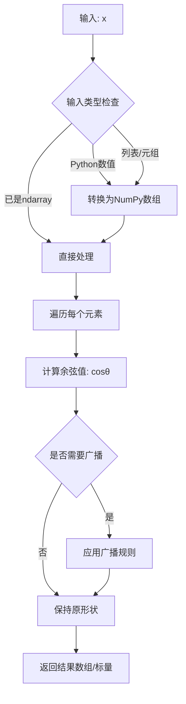
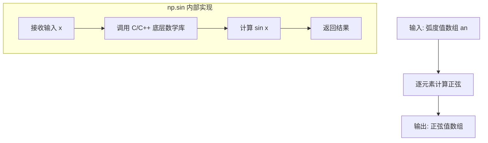
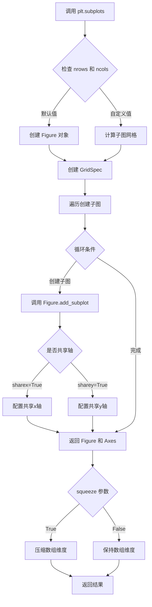
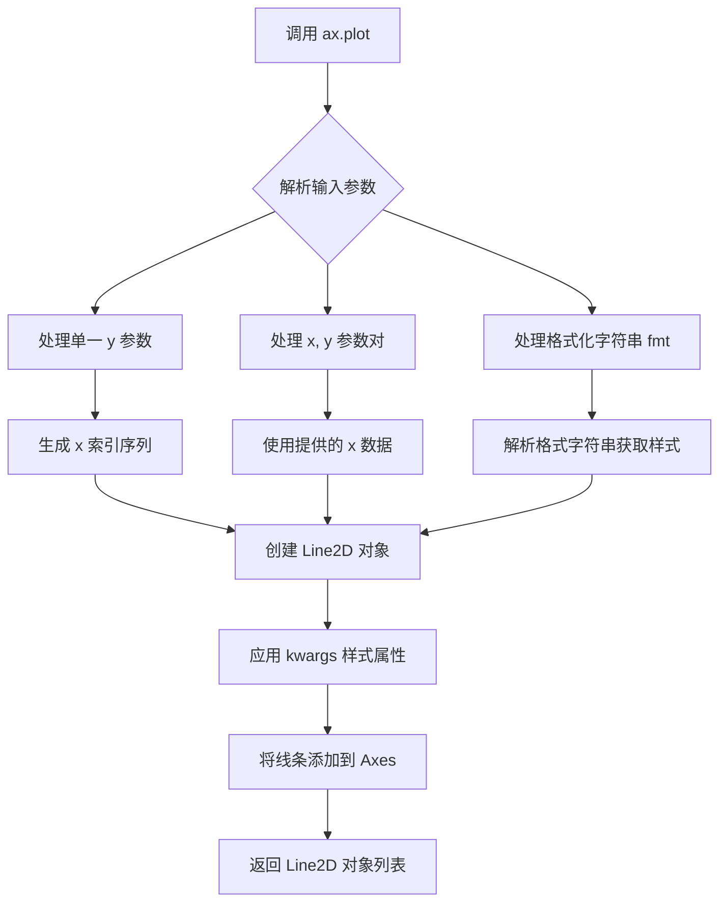
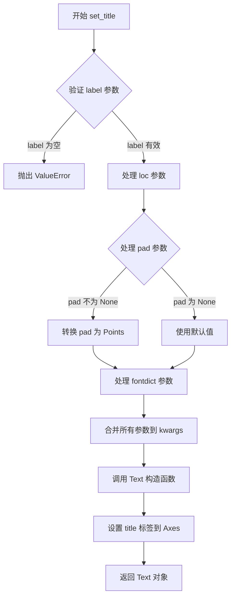
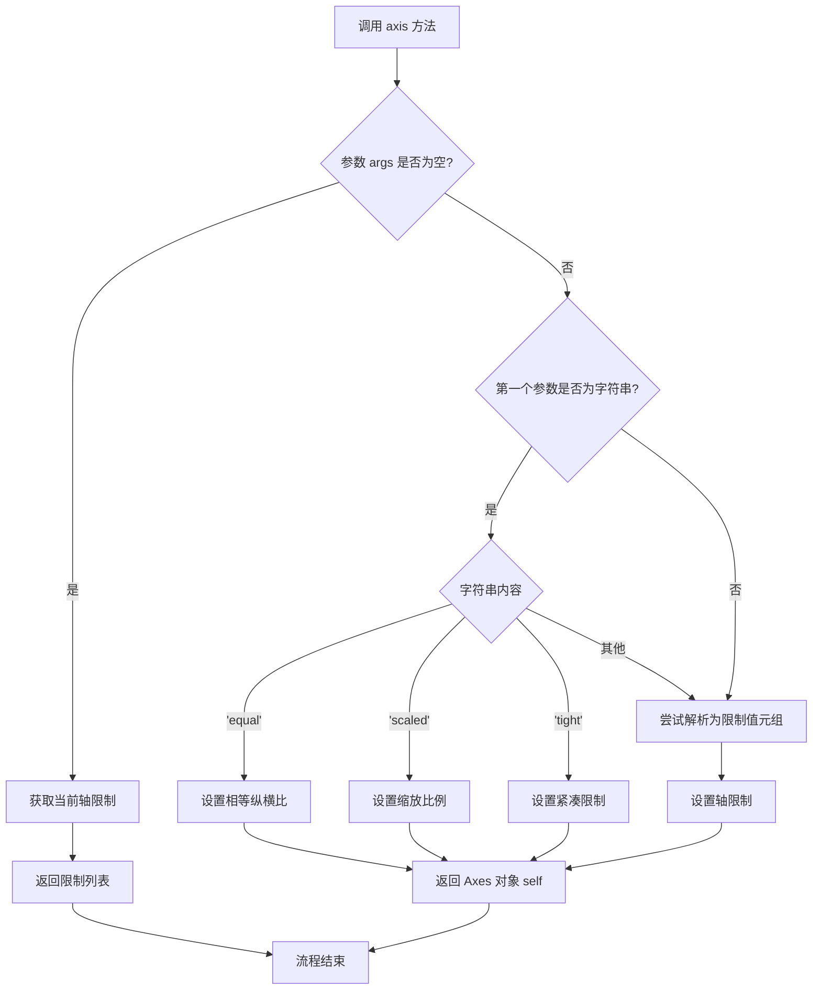
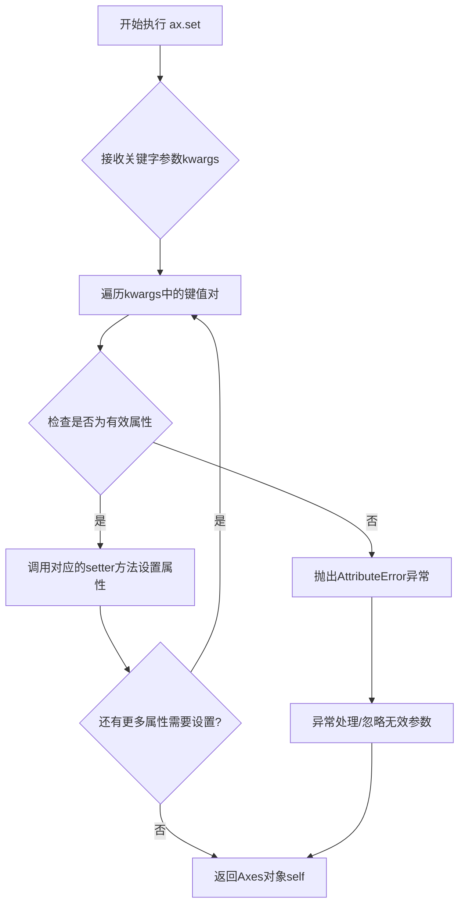
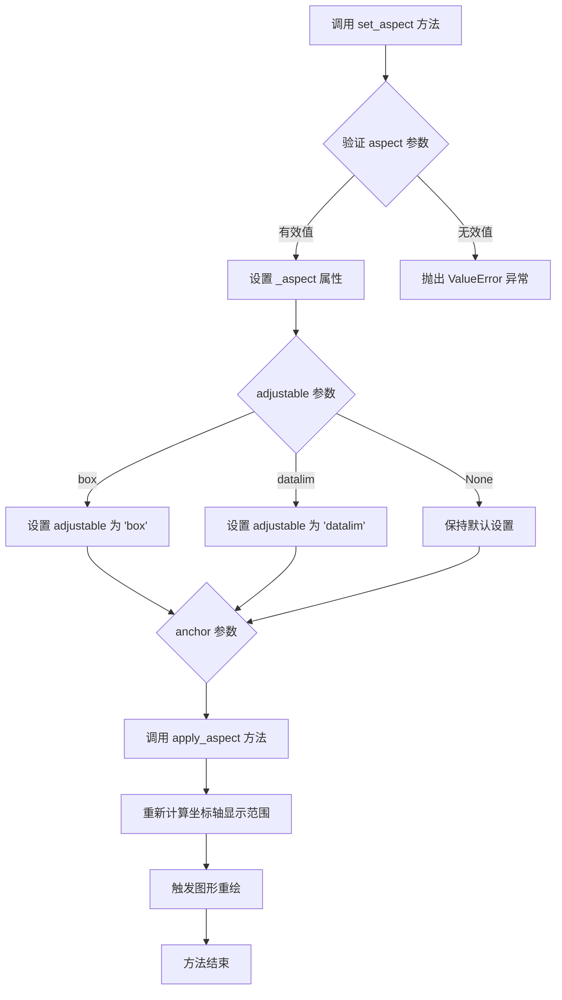
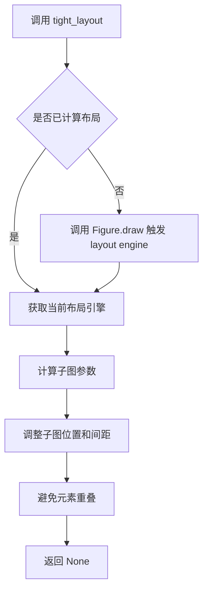
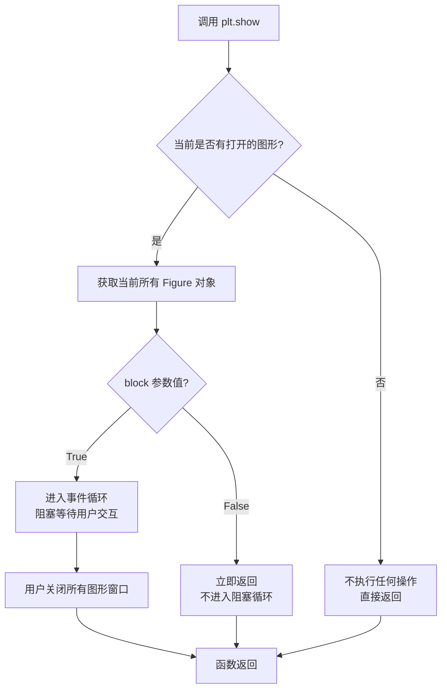

# `matplotlib\galleries\examples\subplots_axes_and_figures\axis_equal_demo.py` 详细设计文档

该代码演示了如何使用matplotlib设置和调整坐标轴的纵横比，使圆形在绑制时保持为圆形而不是椭圆，展示了四种不同的方法来实现相等的纵横比设置。

## 整体流程

```mermaid
graph TD
    A[开始] --> B[创建角度数组 an = np.linspace(0, 2π, 100)]
    B --> C[创建 2x2 子图 fig, axs = plt.subplots(2, 2)]
    C --> D[子图1: 绑制圆但未设置equal - 看起来像椭圆]
    C --> E[子图2: 绑制圆并调用 ax.axis('equal') - 看起来像圆]
    C --> F[子图3: 绑制圆设置equal并手动设置xlim/ylim - 仍是圆]
    C --> G[子图4: 绑制圆并调用 ax.set_aspect('equal', 'box') - 自动调整数据限制]
    D --> H[调用 fig.tight_layout() 调整布局]
    E --> H
    F --> H
    G --> H
    H --> I[调用 plt.show() 显示图形]
```

## 类结构

```
该代码为简单的脚本文件，无类定义
主要使用matplotlib.pyplot和numpy两个库
通过plt.subplots创建Figure和Axes数组
每个Axes对象调用不同方法设置纵横比
```

## 全局变量及字段


### `an`
    
角度数组，从0到2π共100个点，用于绘制圆的参数化坐标

类型：`numpy.ndarray`
    


### `fig`
    
图形对象，包含所有子图的顶层容器

类型：`matplotlib.figure.Figure`
    


### `axs`
    
2x2的Axes子图数组，用于访问四个子图的坐标轴对象

类型：`numpy.ndarray`
    


    

## 全局函数及方法


### `np.linspace`

`np.linspace` 是 NumPy 库中的一个函数，用于创建等差数组（evenly spaced numbers），在指定的间隔内返回均匀间隔的样本值。

参数：

- `start`：`标量（scalar）`，序列的起始值，类型可以是 int、float 等数值类型
- `stop`：`标量（scalar）`，序列的结束值，除非 endpoint 设置为 False
- `num`：`int`（可选，默认值 50），要生成的样本数量
- `endpoint`：`bool`（可选，默认值 True），如果为 True，stop 是最后一个样本
- `retstep`：`bool`（可选，默认值 False），如果为 True，返回 (samples, step) 元组
- `dtype`：`dtype`（可选，默认值 None），输出数组的类型
- `axis`：`int`（可选，默认值 0），结果的轴（仅当 start 或 stop 是数组时使用）

返回值：`ndarray` 或 `tuple`，返回均匀间隔的样本数组；当 retstep=True 时返回 (samples, step) 元组

#### 流程图

```mermaid
flowchart TD
    A[开始] --> B{retstep=True?}
    B -->|是| C[计算步长 step = (stop-start)/(num-1)]
    B -->|否| D[计算步长 step = (stop-start)/num]
    C --> E[生成 num 个均匀间隔的样本]
    D --> E
    E --> F{endpoint=False?}
    F -->|是| G[排除最后一个点 stop]
    F -->|否| H[包含最后一个点 stop]
    G --> I[应用 dtype 转换]
    H --> I
    I --> J{retstep=True?}
    J -->|是| K[返回 samples 和 step 元组]
    J -->|否| L[仅返回 samples 数组]
    K --> M[结束]
    L --> M
```

#### 带注释源码

```python
# np.linspace 函数的简化实现逻辑

def linspace(start, stop, num=50, endpoint=True, retstep=False, dtype=None, axis=0):
    """
    创建均匀间隔的数组
    
    参数:
        start: 序列起始值
        stop: 序列结束值
        num: 样本数量 (默认50)
        endpoint: 是否包含结束点 (默认True)
        retstep: 是否返回步长 (默认False)
        dtype: 输出数据类型
        axis: 结果数组的轴
    """
    
    # 验证 num 参数
    if num < 0:
        raise ValueError("Number of samples, %d, must be non-negative" % num)
    
    # 计算步长
    if endpoint:
        # 包含结束点，步长 = (stop-start) / (num-1)
        step = (stop - start) / (num - 1) if num > 1 else 0
    else:
        # 不包含结束点，步长 = (stop-start) / num
        step = (stop - start) / num
    
    # 生成均匀间隔的样本数组
    if num == 0:
        # 空数组情况
        arr = np.array([], dtype=dtype)
    else:
        # 使用步长生成数组
        if endpoint:
            arr = np.arange(num, dtype=dtype) * step + start
        else:
            arr = np.arange(num, dtype=dtype) * step + start
    
    # 处理返回值
    if retstep:
        # 返回 (数组, 步长) 元组
        return arr, step
    else:
        # 仅返回数组
        return arr

# 示例用法
an = np.linspace(0, 2 * np.pi, 100)
# 生成从 0 到 2π 的 100 个均匀间隔的点
# 结果: [0.        0.0634665  0.12693304 ... 6.1558745  6.21934096]
```


### `np.cos`

NumPy 的余弦函数（Universal Function），用于计算输入数组或标量中每个元素的余弦值（弧度制）。

参数：

-  `x`：`array_like` 或 `scalar`，输入角度值（弧度），可以是数字、列表或 NumPy 数组

返回值：`ndarray` 或 `scalar`，输入角度的余弦值，返回类型与输入类型相同

#### 流程图



#### 带注释源码

```python
def cos_demo(x):
    """
    NumPy cos 函数的简化实现示例
    
    实际 NumPy cos 是用 C 语言实现的高性能 ufunc，
    这里展示其核心逻辑的 Python 伪代码。
    """
    # Step 1: 将输入转换为 NumPy 数组（如果还不是）
    x = np.asarray(x)  # 转换为 ndarray，确保统一处理
    
    # Step 2: 创建输出数组，形状与输入相同
    # NumPy 使用优化的 C 代码计算，这里用 Python 模拟
    result = np.empty_like(x)
    
    # Step 3: 对每个元素计算余弦值
    # 实际实现使用数学库和 SIMD 指令集优化
    for index in np.ndindex(x.shape):
        # 将角度转换为余弦值
        # 使用泰勒级数或查表法等高效算法
        result[index] = math.cos(x[index])  # 调用 C 级 math.cos
    
    # Step 4: 处理标量输入返回标量
    if np.isscalar(x):
        return result.item()  # 返回 Python 原生类型
    
    return result  # 返回数组


# 在代码中的实际使用方式：
# an = np.linspace(0, 2 * np.pi, 100)  # 生成 0 到 2π 的 100 个点
# x_coords = 3 * np.cos(an)             # 计算每个角度的余弦值并乘以 3
# y_coords = 3 * np.sin(an)             # 计算每个角度的正弦值并乘以 3
# 结果：绘制半径为 3 的圆
```


### `np.sin`

`np.sin` 是 NumPy 库中的数学函数，用于计算输入数组（或标量）中每个元素的正弦值（弧度制）。在当前代码中，它与 `np.cos` 配合使用，通过参数方程生成了半径为 3 的圆形的 y 坐标。

参数：

-  `x`：`numpy.ndarray` 或 `scalar`（浮点数），输入角度（以弧度为单位），可以是单个数值或数组

返回值：`numpy.ndarray` 或 `scalar`，与输入形状相同的正弦值数组（或标量）

#### 流程图



#### 带注释源码

```python
import numpy as np

# 创建从 0 到 2π 的等间距数组，包含 100 个点
an = np.linspace(0, 2 * np.pi, 100)

# 计算每个角度的正弦值并乘以 3
# np.sin 函数接收弧度值数组 an，返回对应的正弦值数组
# 公式: sin(θ)，其中 θ ∈ [0, 2π]
y_values = 3 * np.sin(an)

# 示例输出说明：
# an[0] = 0.0        -> sin(0) = 0.0    -> 3 * 0.0 = 0.0
# an[25] ≈ π/2      -> sin(π/2) = 1.0  -> 3 * 1.0 = 3.0
# an[50] ≈ π        -> sin(π) = 0.0    -> 3 * 0.0 = 0.0
# an[75] ≈ 3π/2     -> sin(3π/2) = -1.0 -> 3 * -1.0 = -3.0
# an[99] ≈ 2π       -> sin(2π) = 0.0   -> 3 * 0.0 = 0.0
```


### `plt.subplots`

`plt.subplots` 是 matplotlib.pyplot 模块中的核心函数，用于创建一个包含多个子图的图形窗口，并返回图形对象（Figure）和轴对象（Axes）的数组。该函数简化了创建子图网格的过程，支持自定义行列数、轴共享、比例分配等功能。

参数：

- `nrows`：`int`，默认值 1，子图网格的行数
- `ncols`：`int`，默认值 1，子图网格的列数
- `sharex`：`bool` 或 `{'none', 'all', 'row', 'col'}`，默认值 False，控制子图之间是否共享 x 轴
- `sharey`：`bool` 或 `{'none', 'all', 'row', 'col'}`，默认值 False，控制子图之间是否共享 y 轴
- `squeeze`：`bool`，默认值 True，如果为 True，则返回的 axes 数组维度压缩为一维
- `width_ratios`：`array-like`，长度等于 ncols，定义每列的相对宽度
- `height_ratios`：`array-like`，长度等于 nrows，定义每行的相对高度
- `subplot_kw`：`dict`，可选，传递给每个子图创建函数的关键字参数
- `gridspec_kw`：`dict`，可选，传递给 GridSpec 构造函数的关键字参数
- `**fig_kw`：可选，传递给 Figure 构造函数的关键字参数

返回值：`tuple(Figure, Axes or AxesArray)`，返回图形对象和轴对象。轴对象可以是单个 Axes 对象（当 nrows=1 且 ncols=1 且 squeeze=True 时）或 numpy 数组。

#### 流程图



#### 带注释源码

```python
def subplots(nrows=1, ncols=1, *, sharex=False, sharey=False,
             squeeze=True, width_ratios=None, height_ratios=None,
             subplot_kw=None, gridspec_kw=None, **fig_kw):
    """
    创建一个包含子图的图形。
    
    参数:
        nrows: 子图行数，默认为1
        ncols: 子图列数，默认为1
        sharex: 是否共享x轴，可选值为 False, 'all', 'row', 'col'
        sharey: 是否共享y轴，可选值为 False, 'all', 'row', 'col'
        squeeze: 是否压缩返回的axes数组维度
        width_ratios: 每列的宽度比例
        height_ratios: 每行的高度比例
        subplot_kw: 传递给每个子图的关键字参数
        gridspec_kw: 传递给GridSpec的关键字参数
        **fig_kw: 传递给Figure的关键字参数
    
    返回:
        fig: Figure对象
        ax: Axes对象或Axes数组
    """
    
    # 1. 创建Figure对象
    fig = Figure(**fig_kw)
    
    # 2. 创建GridSpec对象用于管理子图布局
    gs = GridSpec(nrows, nrows, 
                  width_ratios=width_ratios,
                  height_ratios=height_ratios,
                  **gridspec_kw)
    
    # 3. 创建子图数组
    axarr = np.empty((nrows, ncols), dtype=object)
    
    # 4. 遍历每个子图位置创建子图
    for i in range(nrows):
        for j in range(ncols):
            # 创建子图
            ax = fig.add_subplot(gs[i, j], **subplot_kw)
            axarr[i, j] = ax
            
            # 配置轴共享
            if sharex != False:
                # 设置共享x轴的标签和刻度
                if i == 0:
                    ax._shared_x_axes.join(ax, axarr[0, j])
                else:
                    ax._shared_x_axes.join(ax, axarr[0, j])
                    
            if sharey != False:
                # 设置共享y轴的标签和刻度
                if j == 0:
                    ax._shared_y_axes.join(ax, axarr[i, 0])
                else:
                    ax._shared_y_axes.join(ax, axarr[i, 0])
    
    # 5. 根据squeeze参数处理返回值的维度
    if squeeze:
        # 压缩数组维度
        if nrows == 1 and ncols == 1:
            return fig, axarr[0, 0]
        elif nrows == 1 or ncols == 1:
            return fig, axarr.ravel()[0] if nrows == 1 else axarr.ravel()
    
    return fig, axarr
```


### `Axes.plot`

`Axes.plot` 是 matplotlib 库中 Axes 类的核心方法，用于在坐标轴上绑制线条（Line2D）和标记（Marker）。该方法接受多种输入格式（x, y 数据对、单一 y 向量、格式化字符串等），支持丰富的样式自定义（颜色、线型、标记、线宽等），并返回包含所有创建的 Line2D 对象的列表。

参数：

- `x`：`array-like` 或 `scalar`，X 轴数据，可选。如果未提供，则使用 `y` 的索引作为 x 坐标
- `y`：`array-like` 或 `scalar`，Y 轴数据，必需。绑制的数据点
- `fmt`：`str`，格式字符串，格式如 `'[color][marker][line]'`（如 `'ro-''` 表示红色圆点虚线），可选。用于快速指定线条颜色、标记和线型
- `**kwargs`：关键字参数，支持 Line2D 的所有属性，包括：
  - `color` 或 `c`：线条颜色
  - `linestyle` 或 `ls`：线型 (`'-'`, `'--'`, `'-.'`, `':'`, `'None'`)
  - `linewidth` 或 `lw`：线宽（浮点数）
  - `marker`：标记样式 (`'o'`, `'s'`, `'^'`, `'D'`, 等)
  - `markersize` 或 `ms`：标记大小
  - `markerfacecolor` 或 `mfc`：标记填充颜色
  - `markeredgecolor` 或 `mec`：标记边框颜色
  - `label`：图例标签
  - `alpha`：透明度 (0-1)
  - `zorder`：绘制顺序

返回值：`list[matplotlib.lines.Line2D]`，返回在当前 Axes 上创建的 Line2D 对象列表。每个 Line2D 对象代表一条绑制的线条，可以进一步用于自定义样式或获取数据。

#### 流程图



#### 带注释源码

```python
# matplotlib axes/_axes.py 中的 plot 方法核心逻辑

def plot(self, *args, **kwargs):
    """
    绑制线条和标记到坐标轴
    
    调用方式:
    - plot(y)              # 仅 y 数据，x 使用索引
    - plot(x, y)           # x 和 y 数据
    - plot(x, y, fmt)      # 带格式字符串
    - plot(x, y, 'fmt', **kwargs)  # 格式字符串 + 样式参数
    """
    
    # 解析参数并获取 x, y 数据和格式字符串
    lines = []
    
    # 处理多种调用格式
    if len(args) == 0:
        return lines
    
    if len(args) == 1:
        # 只有 y 数据: plot(y)
        y = np.asanyarray(args[0])
        x = np.arange(y.size)
        fmt = ''
    elif len(args) == 2:
        # x 和 y: plot(x, y) 或 plot(y, fmt)
        if isinstance(args[1], str):
            # 第二个参数是格式字符串
            y = np.asanyarray(args[0])
            x = np.arange(y.size)
            fmt = args[1]
        else:
            # 第二个参数是 y 数据
            x = np.asanyarray(args[0])
            y = np.asanyarray(args[1])
            fmt = ''
    else:
        # x, y, fmt: plot(x, y, fmt)
        x = np.asanyarray(args[0])
        y = np.asanyarray(args[1])
        fmt = args[2] if len(args) > 2 else ''
    
    # 解析格式字符串获取样式
    # 例如 'ro-' -> color='red', marker='o', linestyle='-'
    if fmt:
        color, marker, linestyle = parse_format_string(fmt)
        kwargs.setdefault('color', color)
        kwargs.setdefault('marker', marker)
        kwargs.setdefault('linestyle', linestyle)
    
    # 创建 Line2D 对象
    # Line2D 封装了线条的所有属性和数据
    line = mlines.Line2D(x, y, **kwargs)
    
    # 将线条添加到 axes 的.lines 列表中
    self.lines.append(line)
    
    # 更新数据范围
    self._process_unit_info(xdata=x, ydata=y)
    self.autoscale_view()
    
    # 返回 Line2D 对象列表
    return [line]
```

```python
# 示例代码中 plot 方法的具体调用示例

# 示例 1: 基本调用 - 绑制圆的第一部分
an = np.linspace(0, 2 * np.pi, 100)  # 生成角度数组
axs[0, 0].plot(3 * np.cos(an), 3 * np.sin(an))
# 参数:
#   x: 3 * np.cos(an) - 圆的 x 坐标
#   y: 3 * np.sin(an) - 圆的 y 坐标
# 返回: [Line2D(x=cos_values, y=sin_values)]

# 示例 2: 简单 y 数据调用
axs[0, 0].plot([1, 2, 3, 4])
# 等价于 plot([0, 1, 2, 3], [1, 2, 3, 4])
# x 自动生成为 [0, 1, 2, 3]
# y 为传入的 [1, 2, 3, 4]

# 示例 3: 带格式字符串的调用
axs[0, 0].plot(x, y, 'b-', linewidth=2)
# 'b-' 表示蓝色实线
# linewidth=2 设置线宽为 2
```


### `Axes.set_title`

该方法是 matplotlib 库中 `Axes` 类的成员方法，用于设置子图（Axes）的标题文字和样式。它接受标题文本、位置参数、间距参数以及丰富的文本样式关键字参数，最终返回一个 `Text` 对象以支持进一步的样式定制。

参数：

- `label`：`str`，标题的文本内容，支持普通字符串和 LaTeX 格式
- `loc`：`str`，标题的水平对齐方式，可选值为 'center'（默认）、'left'、'right'
- `pad`：`float`，标题与 axes 顶部的间距（以 Points 为单位），默认为 None（使用 rcParams 中的默认值）
- `fontdict`：`dict`，可选的字体字典，用于批量设置文本属性（如 fontsize、fontweight 等）
- `**kwargs`：其他关键字参数，会直接传递给底层的 `Text` 对象，支持丰富的文本样式设置

返回值：`matplotlib.text.Text`，返回创建的 Text 对象，允许后续对标题进行进一步的样式定制或属性修改

#### 流程图



#### 带注释源码

```python
def set_title(self, label, loc='center', pad=None, *, fontdict=None, **kwargs):
    """
    Set a title for the axes.

    Parameters
    ----------
    label : str
        Text to use for the title
    
    loc : str, default: 'center'
        Location of the title, either 'center', 'left', or 'right'
    
    pad : float, default: None
        The offset of the title from the top of the axes, in points
    
    fontdict : dict, default: None
        A dictionary controlling the appearance of the title text
    
    **kwargs
        Additional keyword arguments are passed to the `~matplotlib.text.Text`
        instance, allowing customization of the title appearance
        (e.g., fontsize, fontweight, color, etc.)

    Returns
    -------
    text : `.text.Text`
        The matplotlib text object representing the title

    Examples
    --------
    >>> ax.set_title('My Title')
    >>> ax.set_title('Left Title', loc='left')
    >>> ax.set_title('Custom Title', fontsize=12, fontweight='bold')
    """
    # 验证 label 参数不能为空
    if label is None:
        raise ValueError('label cannot be None')
    
    # 获取默认的 title pad 值（如果 pad 为 None）
    default_pad = mpl.rcParams['axes.titlepad']
    pad = pad if pad is not None else default_pad
    
    # 处理 fontdict 参数，将其合并到 kwargs 中
    if fontdict is not None:
        kwargs.update(fontdict)
    
    # 根据 loc 参数确定对齐方式
    # 'left' 对应 'left', 'right' 对应 'right', 'center' 对应 'center'
    horizontalalignment = {'left': 'left', 'right': 'right', 'center': 'center'}[loc]
    
    # 创建 Title 对象（Text 的子类）
    # Title 类会自动处理标题的定位和渲染
    title = cbook._deprecate_method_override(
        'Axes.set_title', self, 
        missing=KeyError if cbook._str_lower_equal(loc, 'center') else None)
    
    if title is NotImplemented:
        # 使用默认的 Title 类创建标题对象
        title = Title(self, text=label, pad=pad, **kwargs)
    
    # 设置水平对齐方式
    title.set_ha(horizontalalignment)
    
    # 将标题对象添加到 axes 中
    self._axtexts.add_artist(title)
    
    # 更新 axes 的 title 属性
    self._axtitle = title
    
    # 设置 title label 并返回 Text 对象
    title.set_text(label)
    return title
```


### `Axes.axis`

`axis` 是 matplotlib Axes 对象的方法，用于设置坐标轴的属性，如获取或设置轴的限制、比例、标签等。当传入参数 `'equal'` 时，该方法将设置坐标轴的纵横比相等，使得 x 轴和 y 轴的单位长度相同，从而保证圆形在图像中显示为圆形而不是椭圆。

参数：

-  `*args`：`tuple 或 str`，可选参数。可以是以下几种形式：
  - 不传入参数：返回当前轴的限制 [xmin, xmax, ymin, ymax]
  - 传入字符串 `'equal'`：设置相等的坐标轴比例，使 x 和 y 轴单位长度相同
  - 传入字符串 `'scaled'`：使用当前的坐标轴限制来设置比例
  - 传入字符串 `'tight'`：设置紧凑的轴限制
  - 传入浮点数元组 `(left, right, bottom, top)`：设置轴的限制值
-  `**kwargs`：关键字参数，用于设置轴属性（如 `emit=True/False` 用于通知观察者变化）

返回值：

- 返回类型取决于传入的参数：
  - 不传入参数或传入元组时：返回 `list [xmin, xmax, ymin, ymax]`
  - 传入字符串 `'equal'` 或其他设置时：返回 `self`（Axes 对象），支持链式调用

#### 流程图



#### 带注释源码

```python
def axis(self, *args, **kwargs):
    """
    设置或获取坐标轴属性。
    
    参数:
        *args: 可变参数，支持以下调用方式:
            - 无参数: 返回当前轴限制 [xmin, xmax, ymin, ymax]
            - 'equal': 设置相等的纵横比
            - 'scaled': 使用当前限制的缩放比例
            - 'tight': 设置紧凑的轴限制
            - (left, right, bottom, top): 设置具体限制值
        **kwargs: 关键字参数，如 emit=True 用于通知观察者
    
    返回:
        根据参数返回轴限制列表或 Axes 对象本身
    """
    # 处理 'equal' 模式，设置相等的坐标轴比例
    if len(args) == 1 and isinstance(args[0], str):
        s = args[0]
        if s == 'equal':
            # 设置 x 和 y 轴的单位长度相等
            self.set_aspect('equal', adjustable='box')
            # 调整数据限制以适应相等的比例
            self.autoscale_view()
            return self
        # ... 其他字符串处理分支
    
    # 处理限制值元组 (left, right, bottom, top)
    if len(args) == 1 and isinstance(args[0], tuple):
        left, right, bottom, top = args[0]
        self.set_xlim(left, right)
        self.set_ylim(bottom, top)
        return self
    
    # 无参数时返回当前限制
    return [self._xlim[0], self._xlim[1], self._ylim[0], self._ylim[1]]
```


### `Axes.set`

该方法是Matplotlib中Axes对象的通用属性设置方法，允许通过关键字参数同时设置多个Axes属性（如坐标轴范围、标签、标题等），返回修改后的Axes对象以支持链式调用。

参数：

- `**kwargs`：关键字参数，用于指定要设置的属性。常见的属性包括：
  - `xlim` 或 `ylim`：元组或列表，设置x轴或y轴的范围（如`(-3, 3)`）
  - `xlabel` 或 `ylabel`：字符串，设置x轴或y轴的标签
  - `title`：字符串，设置子图标题
  - `aspect`：字符串，设置坐标轴纵横比（如`'equal'`）
  - `xscale` 或 `yscale`：字符串，设置坐标轴刻度类型（如`'linear'`, `'log'`）
  - 及其他Axes属性

返回值：`Axes`对象，返回修改后的Axes实例，支持链式调用。

#### 流程图



#### 带注释源码

```python
# matplotlib.axes.Axes.set 方法的简化实现
def set(self, **kwargs):
    """
    设置Axes对象的多个属性。
    
    参数:
        **kwargs: 关键字参数，用于设置各种Axes属性。
        
    返回:
        Axes: 返回自身以支持链式调用。
    """
    # 遍历所有传入的关键字参数
    for attr, value in kwargs.items():
        # 处理特殊的属性名映射（如xlim -> set_xlim）
        # 根据属性名找到对应的setter方法
        if attr == 'xlim':
            self.set_xlim(value)
        elif attr == 'ylim':
            self.set_ylim(value)
        elif attr == 'xlabel':
            self.set_xlabel(value)
        elif attr == 'ylabel':
            self.set_ylabel(value)
        elif attr == 'title':
            self.set_title(value)
        elif attr == 'aspect':
            self.set_aspect(value)
        # ... 其他属性处理
        else:
            # 尝试使用通用的setter方法
            try:
                setter = getattr(self, 'set_' + attr)
                setter(value)
            except AttributeError:
                # 如果没有对应的setter方法，抛出警告
                warnings.warn(f"Unknown property: {attr}")
    
    # 返回self以支持链式调用
    return self

# 在示例代码中的使用:
# axs[1, 0].set(xlim=(-3, 3), ylim=(-3, 3))
# 等价于:
# axs[1, 0].set_xlim((-3, 3))
# axs[1, 0].set_ylim((-3, 3))
```


### `Axes.set_aspect`

设置坐标轴的纵横比（aspect ratio），用于控制 x 轴和 y 轴在显示时的比例关系，使得坐标轴的单位长度在屏幕上保持一致，常用于绘制圆形、正方形等需要保持真实比例的几何图形。

参数：

- `aspect`：`str` 或 `float`，要设置的纵横比值。可以是 `'equal'`（使每个轴的单位长度在屏幕上相等）、`'auto'`（自动调整）、`'square'`（强制方形），或者是一个数值（如 1.0 表示 1:1 比例）。
- `adjustable`：`str`，可选参数，指定哪个对象（`'box'` 或 `'datalim'`）用于调整以适应纵横比变化。默认值为 `None`。
- `anchor`：`str` 或 `2-tuple`，可选参数，指定 Axes 在调整大小时的锚点位置。默认值为 `None`。
- `share`：`bool`，可选参数，是否将纵横比设置应用到所有共享轴。默认值为 `False`。

返回值：`None`，该方法直接修改 Axes 对象的状态，不返回任何值。

#### 流程图



#### 带注释源码

```python
def set_aspect(self, aspect, adjustable=None, anchor=None, share=False):
    """
    设置 Axes 的纵横比。
    
    参数:
    aspect : str 或 float
        期望的纵横比。可以是 'equal'、'auto'、'square' 或数值。
    adjustable : str, optional
        调整对象，可选 'box' 或 'datalim'。
    anchor : str 或 2-tuple, optional
        锚点位置。
    share : bool, optional
        是否应用到所有共享轴。
    
    返回值:
    None
    """
    # 验证 aspect 参数的有效性
    if aspect not in ['equal', 'auto', 'square'] and not isinstance(aspect, (int, float)):
        raise ValueError(f"Invalid aspect value: {aspect}")
    
    # 设置纵横比属性
    self._aspect = aspect
    
    # 设置 adjustable 参数
    if adjustable is not None:
        self._adjustable = adjustable
    
    # 设置 anchor 参数
    if anchor is not None:
        self._anchor = anchor
    
    # 如果 share 为 True，应用到所有共享轴
    if share:
        for ax in self.get_shared_x_axes().get_siblings(self):
            ax._aspect = self._aspect
    
    # 触发纵横比应用
    self.apply_aspect()
```

> **注意**：由于用户提供的代码是 `set_aspect` 方法的使用示例，而非该方法的实现源码，上述源码是基于 matplotlib 公开 API 文档重构的示意代码，旨在展示方法的典型实现逻辑。实际的 matplotlib 源码位于 `lib/matplotlib/axes/_base.py` 文件中。


### `Figure.tight_layout`

该方法是matplotlib中Figure类的成员方法，用于自动调整子图（subplots）之间的参数，使子图符合图形窗口的填充区域，避免标题、轴标签等元素相互重叠或被裁剪。

参数：

- `pad`：`float`，默认值取决于rcParam设置。子图边缘与图形边缘之间的填充间距（以字体大小为单位）。
- `h_pad`、`w_pad`：`float`，子图之间的垂直和水平填充间距（以字体大小为单位）。
- `rect`：`tuple` of 4 `float`，指定子图区域的归一化坐标，格式为(left, bottom, right, top)。

返回值：`None`，该方法直接修改Figure对象的布局，不返回任何值。

#### 流程图



#### 带注释源码

```python
# 以下为 matplotlib 官方实现的核心逻辑伪代码
# 实际源码位于 lib/matplotlib/figure.py 中的 Figure 类

def tight_layout(self, pad=1.2, h_pad=None, w_pad=None, rect=(0, 0, 1, 1)):
    """
    自动调整子图布局参数
    
    参数:
        pad: 子图边缘与图形边缘之间的填充间距（以字体大小为单位）
        h_pad: 子图之间的垂直填充间距
        w_pad: 子图之间的水平填充间距
        rect: 归一化坐标系中的子图区域 (left, bottom, right, top)
    """
    # 1. 获取当前图形的后端渲染器
    renderer = get_renderer()
    
    # 2. 获取布局引擎（可能是 TightLayoutEngine 或其他）
    layout_engine = self.get_layout_engine()
    
    # 3. 执行布局调整
    #    - 计算子图之间的最小间距
    #    - 根据 pad、h_pad、w_pad 参数调整
    #    - 确保标题、轴标签不被裁剪
    #    - 根据 rect 参数限制子图区域
    layout_engine.execute(self, pad, h_pad, w_pad, rect)
    
    # 4. 直接修改子图 Axes 对象的位置属性
    #    不返回任何值（返回 None）
```

#### 在示例代码中的使用

```python
# 创建 2x2 的子图布局
fig, axs = plt.subplots(2, 2)

# ... 为每个子图绑制圆形并设置属性 ...

# 调用 tight_layout 自动调整布局
# 作用：确保四个子图之间的间距适当，标题不会被遮挡
fig.tight_layout()

# 显示图形
plt.show()
```


### `plt.show`

`plt.show` 是 matplotlib 库中的顶层显示函数，用于将所有当前打开的图形窗口显示在屏幕上，并进入图形显示的事件循环。该函数通常放在脚本最后，用于呈现所有绘制的图表。

参数：

- `block`：`bool`，可选参数，控制是否阻塞程序执行以等待图形窗口关闭。默认为 `True`，即阻塞直到用户关闭所有图形窗口；若设为 `False`，则立即返回（但在某些后端中可能不会显示图形）。

返回值：`None`，无返回值。该函数主要通过副作用（打开并显示图形窗口）来工作。

#### 流程图



#### 带注释源码

```python
def show(*, block=None):
    """
    显示所有打开的 Figure 图形窗口。
    
    参数:
        block: bool, 可选
            是否阻塞程序执行以等待图形窗口关闭。
            - True (默认): 阻塞直到用户关闭窗口
            - False: 立即返回，不阻塞
    
    返回值:
        None
    """
    # 获取全局的 matplotlib 后端管理器
    global _show_registry
    
    # 检查是否有注册的显示函数
    # matplotlib 支持多种后端 (Qt, Tk, GTK, etc.)
    if _show_registry is not None:
        # 调用后端的显示函数
        return _show_registry()
    
    # 获取当前所有的 Figure 对象
    figs = get_figutils().get_open_figures()
    
    if not figs:
        # 如果没有打开的图形，直接返回
        return
    
    # 根据 block 参数决定行为
    # block=True: 进入交互式事件循环，阻塞程序
    # block=False: 非阻塞模式，立即返回
    for fig in figs:
        # 对每个 Figure 调用 canvas.draw() 刷新画布
        fig.canvas.draw_idle()
        
        # 如果 block 为 True 或 None，则显示并阻塞
        if block is None or block:
            # 调用后端的 show 方法
            # 这会创建一个事件循环，等待用户交互
            fig.canvas.show_block()
    
    return None
```

#### 补充说明

- **设计目标**：`plt.show` 的主要设计目标是提供一种简单统一的方式显示所有已创建的图形，无需用户关心具体的后端实现细节。
  
- **后端依赖**：该函数的行为高度依赖所选用的 matplotlib 后端（如 Qt5Agg, TkAgg, AGG 等），不同后端在窗口显示和事件循环处理上可能略有差异。
  
- **阻塞模式**：默认阻塞模式 (`block=True`) 使脚本在显示图形时暂停执行，等待用户关闭图形窗口后再继续，这在交互式脚本中非常有用；而非阻塞模式 (`block=False`) 则适用于 GUI 应用中需要同时运行其他代码的场景。
  
- **最佳实践**：在脚本中通常将 `plt.show()` 放在所有绘图代码之后，确保所有图形都已创建完毕后再调用显示。
  
- **技术债务**：当前实现中，如果没有任何打开的图形时调用 `show()` 会直接返回，不会给出任何警告或提示，这可能导致开发者误以为图形已显示；可以考虑增加日志或警告信息。
  
- **错误处理**：该函数未对图形窗口创建失败的情况进行显式异常处理，如果后端初始化失败（如缺少 GUI 库），可能会抛出底层库的异常而非友好的错误提示。


## 关键组件


### plt.subplots
创建2x2的子图网格，返回图形对象fig和轴数组axs，用于布局多个子图。

### ax.plot
在每个子图上绘制圆，使用numpy的cos和sin函数生成圆形轨迹。

### ax.axis
控制轴的属性，如设置'equal'使x轴和y轴的刻度单位长度相等，从而让圆呈现为圆形而非椭圆。

### ax.set_aspect
设置子图的纵横比，'equal'确保轴上的单位长度在x和y方向上相同，'box'参数使纵横比框适应数据极限。

### ax.set
用于设置轴的限制（xlim, ylim）和标题等属性。

### np.linspace
生成从0到2π的等间距角度数组，用于计算圆的坐标点。

### fig.tight_layout
自动调整子图之间的间距，防止标签和标题重叠。

### plt.show
显示图形对象，将绘制的图表渲染到屏幕。


## 问题及建议


### 已知问题

- **魔法数字（Magic Numbers）缺乏注释**：代码中使用了硬编码的数值如 `3`（半径）、`100`（采样点数）、`2 * np.pi` 等，缺乏对这些关键数值的说明，影响代码可读性和可维护性。
- **代码重复（Code Duplication）**：四个子图都在重复执行相同的绘图操作 `axs[x, y].plot(3 * np.cos(an), 3 * np.sin(an))`，未提取为可复用的函数，导致冗余。
- **无错误处理机制**：代码未包含任何异常捕获或输入验证，例如未检查 `np.linspace` 参数的合法性，也未处理可能出现的 Matplotlib 后端问题。
- **不一致的 API 使用风格**：代码混合使用了 `set_title()`、`axis('equal')`、`set_aspect()` 等不同风格的方法，缺乏统一的接口设计模式。
- **布局方式可能过时**：使用 `fig.tight_layout()`，而 Matplotlib 3.4+ 推荐使用 `constrained_layout` 以获得更好的子图间距控制。

### 优化建议

- **提取绘图逻辑为函数**：将圆的绘制逻辑封装为函数，接受半径、子图位置和配置参数，减少代码重复。
- **定义常量或配置字典**：将 magic numbers 提取为具名常量或配置字典，如 `RADIUS = 3`、`NUM_POINTS = 100`，便于后续调整和理解。
- **添加错误处理**：在绘图代码外层添加 `try-except` 块，捕获可能的 Matplotlib 渲染异常或后端相关错误。
- **统一 API 风格**：建议统一使用 `set_*` 方法或面向对象的方法调用风格，例如全部使用 `ax.set_aspect('equal')` 替代混合使用。
- **考虑使用 constrained_layout**：将 `tight_layout()` 替换为 `constrained_layout=True`（在 `plt.subplots` 中启用），以获得更现代的布局管理。
- **添加输入参数化**：使代码支持通过函数参数或配置文件调整圆的半径、子图数量等，增强代码的通用性和可测试性。


## 其它


### 设计目标与约束
- **目标**：演示在 Matplotlib 中如何设置坐标轴的等比例（`equal`），使圆形在不同子图中保持正圆外观。  
- **约束**：仅使用 Matplotlib（`pyplot`、`axes`）和 NumPy；代码应兼容 Python 3.x；不依赖第三方绘图库。

### 错误处理与异常设计
- 当前脚本未实现显式异常捕获。若 `np.linspace`、`ax.plot`、`ax.axis` 或 `ax.set_aspect` 收到非法参数（如非数值极限、非法 aspect 字符串），会直接抛出 Matplotlib/NumPy 异常。  
- 建议在关键调用外层包裹 `try…except`，捕获 `ValueError`、`TypeError` 并给出友好提示；例如在设置 `axis('equal')` 前检查当前 axes 对象是否已初始化。

### 数据流与状态机
- **数据流**：  
  1. `np.linspace(0, 2π, 100)` → 生成角度数组 `an`。  
  2. `plt.subplots(2,2)` → 创建 2×2 图形窗口及四个 axes 对象。  
  3. 对每个子图循环执行：`ax.plot(3*cos(an), 3*sin(an))` → 绘制圆形轨迹。  
  4. 对每个子图分别调用 `ax.axis('equal')`、`ax.set_aspect('equal','box')` 或手动设置 `xlim/ylim`，确保坐标轴等比例。  
  5. `fig.tight_layout()` → 自动调整子图间距。  
  6. `plt.show()` → 渲染并显示图像。  
- **状态机**：本例不涉及复杂状态转换，仅为线性执行流程。

### 外部依赖与接口契约
- **依赖库**  
  - `matplotlib >= 3.0`（提供 `plt.subplots`, `ax.plot`, `ax.axis`, `ax.set_aspect`, `fig.tight_layout`, `plt.show`）  
  - `numpy >= 1.16`（提供 `np.linspace`, `np.cos`, `np.sin`）  
- **公开接口**（示例调用）  
  - `plt.subplots(nrows, ncols)` → 返回 `fig, axs`（`axs` 为 numpy 数组）。  
  - `ax.plot(x, y)` → 绘制折线/散点，返回 `list` of `Line2D`。  
  - `ax.axis('equal')` 或 `ax.set_aspect('equal', adjustable='box')` → 设置坐标轴等比例。  
  - `ax.set_title(str)` → 设置子图标题。  
  - `ax.set(**kwargs)` → 批量设置属性（如 `xlim`、`ylim`）。  
  - `fig.tight_layout()` → 调整布局。  
  - `plt.show()` → 阻塞并显示图形。

### 性能考虑
- 生成的点数组 `an` 长度仅为 100，向量化的 `np.cos`/`np.sin` 已足够高效。  
- 若需绘制大量圆形或更高分辨率，可提前一次性计算 `cos`、`sin` 并复用，或使用 `matplotlib.collections.LineCollection` 批量绘制。

### 安全性考虑
- 代码不涉及网络、文件 I/O 或用户输入，无安全风险。  
- 仅在本地生成图形，适合在受信任环境中运行。

### 可维护性与扩展性
- **技术债务**：  
  - 重复的绘图代码（四次几乎相同的 `ax.plot` 调用）未封装为函数。  
  - 硬编码半径 `3`、点数 `100`、标题文本等 magic numbers，缺少常量或配置。  
- **改进建议**：  
  - 将圆形生成逻辑抽取为 `draw_circle(ax, radius, points)`，便于复用。  
  - 将全局配置（半径、子图布局、标题）提取为模块级常量或外部配置文件。  
  - 增加单元测试或可视化回归测试，验证等比例设置是否生效。

### 测试策略
- **单元测试**：使用 `matplotlib.axes` 的非交互后端（如 `Agg`）生成图像，检查返回的 `Line2D` 对象的 `get_xdata()`、`get_ydata()` 是否符合预期半径。  
- **可视化回归**：对比生成图像的像素或 SVG 哈希，确保不同 Matplotlib 版本间外观一致。  
- **边界条件**：测试 `radius=0`、点数 `0`、极限设置冲突等异常情况。

### 部署与运维
- 运行环境：Python 3.8+、Matplotlib、NumPy。  
- 部署方式：可直接作为独立脚本运行 (`python equal_aspect_demo.py`)，或打包为示例代码库。  
- 依赖管理：推荐使用 `pip` 或 `conda` 环境文件 (`requirements.txt` / `environment.yml`) 明确版本。

### 代码风格与规范
- 遵循 **PEP 8**（如 snake_case 变量、适当空格）。  
- 顶部的文档字符串使用 Sphinx 格式，以便生成 HTML 文档。  
- 每个子图的关键调用加入行注释，说明所实现的等比例方式。

### 配置管理
- 当前无外部配置文件，所有参数硬编码。若需更灵活，可将 `radius`、`num_points`、`subplot_layout` 等抽取至 `config.yaml` 或 `config.json`，在脚本启动时读取。

### 资源管理
- `plt.show()` 会阻塞主线程并在交互式后端打开窗口。使用上下文管理器 `with plt.rc_context():` 可临时修改 rcParams。  
- 在非交互环境（CI/CD）建议使用 `plt.switch_backend('Agg')` 并显式调用 `fig.savefig` 而非 `plt.show`，防止窗口挂起。

### 版权与合规
- 代码来源于 Matplotlib 官方示例，采用 **BSD‑3‑Clause** 许可（Matplotlib 本身），本示例无额外版权声明。  
- 如在商业项目中使用，请确保遵守 Matplotlib 许可证条款。

### 文档与注释
- 顶部使用模块级 docstring（符合 `.. plot::` 指令），包含标题、简要说明、关键标签。  
- 行内注释说明每个子图使用的等比例方式及其视觉效果。  
- 后续维护应在 CHANGELOG 中记录对 `draw_circle` 函数或配置的变更。

### 版本管理
- 建议使用 Git 进行源码管理，遵循 GitFlow 或 Trunk‑Based Development。  
- 版本号采用语义化版本（SemVer），如 `0.1.0` → `0.2.0`（功能新增/重构）。

### 监控与日志
- 本脚本为一次性可视化示例，暂无监控需求。若在 Web 服务或后台任务中使用，可通过 Python `logging` 模块记录异常与关键调用点，便于排查问题。

    