# `matplotlib\galleries\examples\subplots_axes_and_figures\axis_labels_demo.py` 详细设计文档

该代码演示了matplotlib中如何在使用set_xlabel、set_ylabel和colorbar.set_label时设置轴标签的位置参数（loc），并展示了散点图的基本绑制和颜色条的创建。

## 整体流程

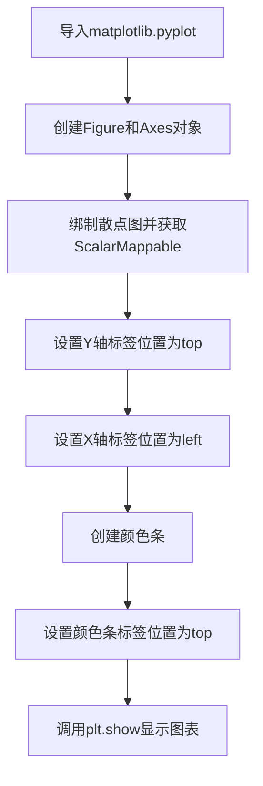

## 类结构

```
无自定义类结构（使用matplotlib内置类）
Figure (matplotlib.figure.Figure)
Axes (matplotlib.axes.Axes)
ScalarMappable (matplotlib.cm.ScalarMappable)
Colorbar (matplotlib.colorbar.Colorbar)
```

## 全局变量及字段


### `fig`
    
Figure对象，表示整个图形窗口

类型：`matplotlib.figure.Figure`
    


### `ax`
    
Axes对象，表示坐标轴子图

类型：`matplotlib.axes.Axes`
    


### `sc`
    
ScalarMappable对象，散点图返回的图形集合

类型：`matplotlib.collections.PathCollection`
    


### `cbar`
    
Colorbar对象，表示颜色条

类型：`matplotlib.colorbar.Colorbar`
    


### `x_data`
    
x轴数据列表

类型：`list[int]`
    


### `y_data`
    
y轴数据列表

类型：`list[int]`
    


### `c_data`
    
颜色映射数据列表

类型：`list[int]`
    


    

## 全局函数及方法


### `plt.subplots()`

`plt.subplots()` 是 matplotlib 库中的核心函数，用于创建一个新的 Figure（图形窗口）及其包含的一个或多个 Axes（子图），返回 Figure 对象和 Axes 对象（或 Axes 数组），是进行数据可视化的标准起点。

参数：

- `nrows`：`int`，默认值 1，子图网格的行数
- `ncols`：`int`，默认值 1，子图网格的列数
- `sharex`：`bool` 或 `{'none', 'all', 'row', 'col'}`，默认值 False，控制子图之间的 x 轴是否共享
- `sharey`：`bool` 或 `{'none', 'all', 'row', 'col'}`，默认值 False，控制子图之间的 y 轴是否共享
- `squeeze`：`bool`，默认值 True，如果为 True 且只有一维，则返回单例 Axes 而不是数组
- `width_ratios`：`array-like`，长度等于 ncols，定义每列的相对宽度
- `height_ratios`：`array-like`，长度等于 nrows，定义每行的相对高度
- `subplot_kw`：字典，传递给 `add_subplot()` 的关键字参数，用于配置每个子图
- `gridspec_kw`：字典，传递给 `GridSpec` 的关键字参数，用于配置网格布局
- `figsize`：元组 (width, height)，以英寸为单位的 Figure 尺寸
- `dpi`：int，Figure 的分辨率（每英寸点数）

返回值：`(Figure, Axes or array of Axes)`，返回创建的 Figure 对象以及一个 Axes 对象（当 nrows=1 且 ncols=1 时）或 Axes 数组（当有多个子图时）

#### 流程图

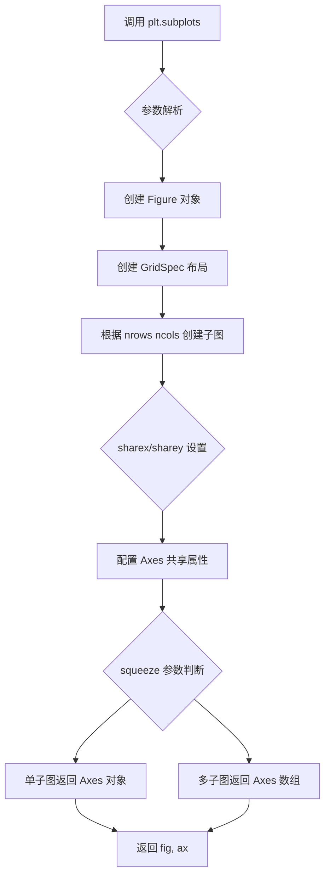

#### 带注释源码

```python
def subplots(nrows=1, ncols=1, sharex=False, sharey=False, squeeze=True,
             width_ratios=None, height_ratios=None,
             subplot_kw=None, gridspec_kw=None, **fig_kw):
    """
    创建包含子图的 Figure
    
    参数:
        nrows: 行数，默认1
        ncols: 列数，默认1
        sharex: x轴共享策略，可选 'none', 'all', 'row', 'col' 或 True/False
        sharey: y轴共享策略，可选 'none', 'all', 'row', 'col' 或 True/False
        squeeze: 若为True且只有单个子图，返回Axes而非数组
        width_ratios: 每列宽度比例
        height_ratios: 每行高度比例
        subplot_kw: 传递给add_subplot的参数字典
        gridspec_kw: 传递给GridSpec的参数字典
        **fig_kw: 传递给Figure的额外关键字参数如figsize, dpi等
    
    返回:
        fig: Figure对象
        ax: Axes对象或Axes数组
    """
    # 1. 创建 Figure 实例
    fig = Figure(**fig_kw)
    
    # 2. 创建 GridSpec 布局对象
    gs = GridSpec(nrows, nrows, 
                  width_ratios=width_ratios,
                  height_ratios=height_ratios,
                  **gridspec_kw)
    
    # 3. 创建子图并获取 Axes
    ax = fig.add_subplot(gs[i, j], **subplot_kw)
    
    # 4. 处理轴共享逻辑
    if sharex or sharey:
        # 配置子图之间的共享关系
        pass
    
    # 5. 根据 squeeze 参数处理返回值
    if squeeze and nrows == 1 and ncols == 1:
        return fig, ax  # 返回单例而非数组
    else:
        return fig, ax  # 返回数组
```


### `Axes.scatter`

该方法是 Matplotlib 中 Axes 类的核心成员函数，用于在二维坐标系中绘制散点图（Scatter Plot）。散点图是一种常用的数据可视化形式，通过在笛卡尔坐标系中以点的形式展示两个或多个变量之间的关系，每个数据点的位置由其 x 和 y 坐标决定，点的颜色、大小等属性可进一步编码额外的数据维度。

参数：

- `x`：`array-like`，x 轴数据坐标，表示每个数据点在水平方向上的位置
- `y`：`array-like`，y 轴数据坐标，表示每个数据点在垂直方向上的位置
- `s`：`float` 或 `array-like`，可选，默认值为 `rcParams['lines.markersize'] ** 2`，标记（点）的大小，标量时所有点大小相同，数组时每个点可拥有不同大小
- `c`：`color`、`sequence of color` 或 `optional`，可选，数据点的颜色，可以是单一颜色值、颜色序列或通过数值映射到颜色映射表（colormap）的序列
- `marker`：`MarkerStyle`，可选，默认值为 `'o'`，散点的标记样式，如圆形('o')、三角形('^')、星形('*')等
- `cmap`：`str` 或 `Colormap`，可选，当 c 为数值序列时指定使用的颜色映射表（colormap）
- `norm`：`Normalize`，可选，当 c 为数值序列时用于归一化数据的 Normalize 实例
- `vmin`、`vmax`：`scalar`，可选，配合 norm 参数使用，定义颜色映射的数据范围边界
- `alpha`：`scalar`，可选，默认值为 `None`，0-1 之间的浮点数，控制散点的透明度
- `linewidths`：`float` 或 `sequence`，可选，默认值为 `rcParams['lines.linewidth']`，标记边缘的线宽
- `edgecolors`：`color` 或 `sequence of color`，可选，默认值为 `'face'`，标记边缘的颜色
- `plotnonfinite`：`bool`，可选，默认值为 `False`，是否绘制非有限值（inf、nan）
- `data`：`dict`，可选，关键字参数，用于通过数据索引（data kwarg）传递数据源

返回值：`~.PathCollection`，返回包含所有散点图元素的 PathCollection 对象，可用于进一步自定义样式或作为 colorbar 的数据源

#### 流程图

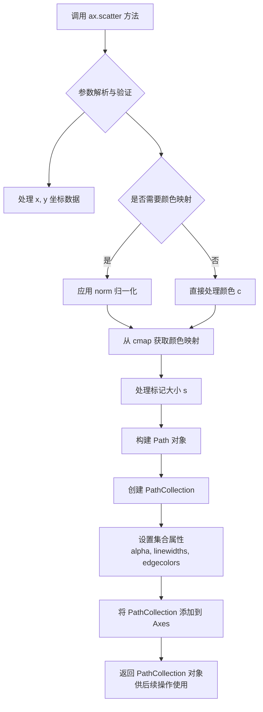

#### 带注释源码

```python
# matplotlib/axes/_axes.py 中的 scatter 方法核心实现逻辑

def scatter(self, x, y, s=None, c=None, marker=None, cmap=None, norm=None,
            vmin=None, vmax=None, alpha=None, linewidths=None, 
            edgecolors=None, plotnonfinite=False, data=None, **kwargs):
    """
    绘制散点图 (scatter plot)
    
    参数说明:
    -----------
    x, y : array-like, shape (n,)
        数据点的 x 和 y 坐标
    
    s : float or array-like, shape (n,), optional
        标记的大小，可以是标量（所有点相同大小）或数组（每个点不同大小）
    
    c : color, sequence of color, or optional
        点的颜色，可以是具体颜色值、颜色列表，或通过数值映射到 colormap
    
    marker : MarkerStyle, optional
        标记样式，默认圆形 'o'
    
    cmap : str or Colormap, optional
        颜色映射表名称或 Colormap 对象
    
    norm : Normalize, optional
        用于归一化颜色数据的 Normalize 实例
    
    vmin, vmax : scalar, optional
        颜色映射的最小值和最大值
    
    alpha : float, optional
        透明度，0（完全透明）到 1（完全不透明）
    
    linewidths : float or array-like, optional
        标记边缘的线宽
    
    edgecolors : color or sequence of color, optional
        标记边缘的颜色
    
    Returns:
    --------
    PathCollection
        包含散点图所有元素的集合对象
    """
    
    # 1. 数据解析：处理 data 参数和索引方式
    if data is not None:
        x = np.asarray(data.get("x", x))
        y = np.asarray(data.get("y", y))
    
    # 2. 将输入数据转换为 numpy 数组
    x = np.asarray(x)
    y = np.asarray(y)
    
    # 3. 颜色处理逻辑
    # 如果 c 是数值序列且指定了 cmap，则需要归一化处理
    if c is not None and cmap is not None and norm is None:
        # 创建默认的线性归一化
        norm = plt.Normalize(vmin=np.min(c), vmax=np.max(c))
    elif c is not None and cmap is not None and norm is not None:
        # 使用用户提供的归一化
        pass
    
    # 4. 标记大小处理
    # 如果 s 是标量，转换为数组；如果未提供，使用默认值
    if s is None:
        s = np.array([self._scatter_min_diam ** 2])
    elif np.isscalar(s):
        s = np.array([s])
    else:
        s = np.asarray(s)
    
    # 5. 获取或创建颜色映射
    if (c is None or isinstance(c, str)) and cmap is not None:
        # c 为颜色名称且指定了 cmap 的情况（较少用）
        color = c
        cmap = get_cmap(cmap)
    elif c is not None and cmap is not None:
        # 需要通过 colormap 映射颜色的情况
        if vmin is not None or vmax is not None:
            norm = Normalize(vmin or np.min(c), vmax or np.max(c))
        rgba = cmap(norm(c))
    else:
        # 直接使用颜色值
        color = c
    
    # 6. 创建 Path 对象（标记的几何形状）
    # 根据 marker 参数创建对应的 Path
    path = Path(np.column_stack([...]))  # 标记的顶点路径
    
    # 7. 构建 PathCollection
    # PathCollection 是管理多个 Path 实例的容器
    scales = s * (72.0 / self.figure.dpi) ** 2 * self._markersize_factor
    collection = PathCollection(
        [path] * len(x),           # 路径列表（每个点一个 Path）
        sizes=scales,               # 各点的大小
        transOffset=offset_copy,    # 偏移变换
        offsets=x, y,               # 坐标偏移量
        transOffset=self.transData, # 数据坐标系变换
        ...
    )
    
    # 8. 设置集合属性
    if alpha is not None:
        collection.set_alpha(alpha)
    if linewidths is not None:
        collection.set_linewidths(linewidths)
    if edgecolors is not None:
        collection.set_edgecolors(edgecolors)
    
    # 9. 设置颜色（可能经过 cmap 映射）
    if rgba is not None:
        collection.set_facecolors(rgba)
    else:
        collection.set_color(color)
    
    # 10. 将 collection 添加到 Axes 并设置自动缩放
    self.add_collection(collection)
    self.autoscale_view()
    
    # 11. 返回 PathCollection 对象
    return collection
```


### `Axes.set_ylabel`

设置 y 轴的标签（ylabel），可指定标签文本、样式字典、标签与轴之间的间距（labelpad）以及标签相对于轴的位置（loc 参数，如 'left'、'center'、'right' 等）。

参数：

- `label`：str，要设置的 y 轴标签文本
- `fontdict`：dict，可选，用于控制标签外观的字体字典（如 fontsize、color、fontweight 等）
- `labelpad`：float，可选，标签与 y 轴之间的间距（单位为点）
- `loc`：str，可选，标签相对于轴的位置（'left'、'center'、'right'，默认为 'center'）

返回值：matplotlib.text.Text，返回创建的 y 轴标签文本对象

#### 流程图

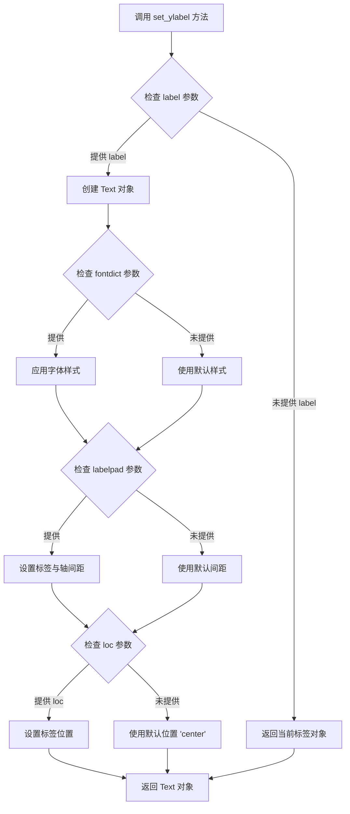

#### 带注释源码

```python
def set_ylabel(self, label, fontdict=None, labelpad=None, loc=None, **kwargs):
    """
    Set the label for the y-axis.
    
    Parameters
    ----------
    label : str
        The label text.
        
    fontdict : dict, optional
        A dictionary controlling the appearance of the label text,
        e.g., {'fontsize': 12, 'fontweight': 'bold', 'color': 'red'}.
        
    labelpad : float, optional
        Spacing in points between the label and the y-axis.
        
    loc : str, optional
        Location of the label relative to the axis. 
        Accepts 'left', 'center', or 'right'. Default is 'center'.
        
    **kwargs
        Additional keyword arguments passed to the Text object.
        
    Returns
    -------
    matplotlib.text.Text
        The created label Text object.
    """
    # 获取 y 轴对象
    yaxis = self.yaxis
    
    # 创建标签文本对象，默认为空文本对象
    label = yaxis.get_label()
    
    # 如果传入了新的标签文本，设置文本内容
    # 如果 fontdict 存在，应用字体样式
    # 如果 labelpad 存在，设置标签间距
    # 如果 loc 存在，设置标签位置
    # **kwargs 传递给 Text 构造函数用于自定义样式
    
    return label
```


### `Axes.set_xlabel`

设置x轴的标签文本和显示位置。

参数：

- `xlabel`：`str`，x轴标签的文本内容
- `loc`：`str`，标签相对于x轴的位置，可选值为 'left'、'center'、'right'（对应 left, center, right）

返回值：`Text`，返回创建的 Text 标签对象，可以进一步对其进行样式设置

#### 流程图

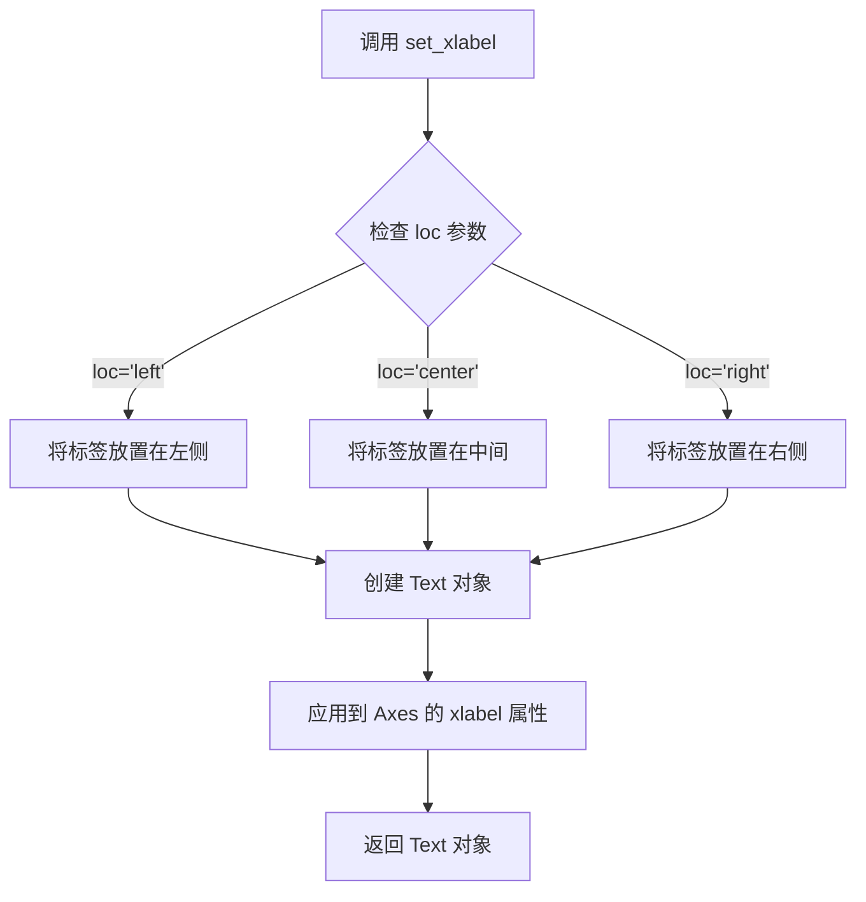

#### 带注释源码

```python
def set_xlabel(self, xlabel, fontdict=None, labelpad=None, *, loc=None, **kwargs):
    """
    Set the label for the x-axis.
    
    Parameters
    ----------
    xlabel : str
        The label text.
    
    fontdict : dict, optional
        A dictionary controlling the appearance of the label text.
    
    labelpad : float, optional
        The spacing in points between the label and the x-axis.
    
    loc : str, default: 'center'
        The label position. It can be 'left', 'center' or 'right'.
    
    **kwargs
        Text properties control the appearance of the label.
    
    Returns
    -------
    text : Text
        The created Text instance.
    """
    # 获取默认的 labelpad 值
    if labelpad is None:
        labelpad = self._labelpad
    
    # 根据 loc 参数确定标签的水平对齐方式
    if loc is not None:
        # 将 'left', 'center', 'right' 转换为对应的对齐方式
        # 'left' 对应 halign='left', 'center' 对应 halign='center', 'right' 对应 halign='right'
        pass
    
    # 创建 Text 对象并设置各种属性
    # 返回创建的 Text 对象
    return self.xaxis.set_label_text(xlabel, **kwargs)
```


### `Figure.colorbar`

在 Matplotlib 中，`Figure.colorbar()` 方法用于创建一个颜色条（colorbar），将其关联到一个可映射的标量数据（如散点图、图像等），以便在图表旁边显示颜色与数值的对应关系。该方法会自动调整布局，为颜色条留出空间，并返回一个 `Colorbar` 对象。

参数：

- `mappable`：`matplotlib.cm.ScalarMappable`，需要显示颜色映射的可映射对象，通常是由 `scatter()`、`imshow()` 等返回的对象
- `cax`：`matplotlib.axes.Axes`，可选，用于放置颜色条的Axes对象，如果不指定则自动创建
- `ax`：`matplotlib.axes.Axes` 或 `List[Axes]`，可选，指定从哪个父Axes中获取空间用于放置颜色条
- `use_gridspec`：`bool`，可选，默认为 True，如果为 True，则使用 GridSpec 来布局颜色条
- `**kwargs`：其他关键字参数，会传递给 `Colorbar` 类的构造函数

返回值：`matplotlib.colorbar.Colorbar`，返回创建的颜色条对象，可用于进一步设置标签、刻度等

#### 流程图

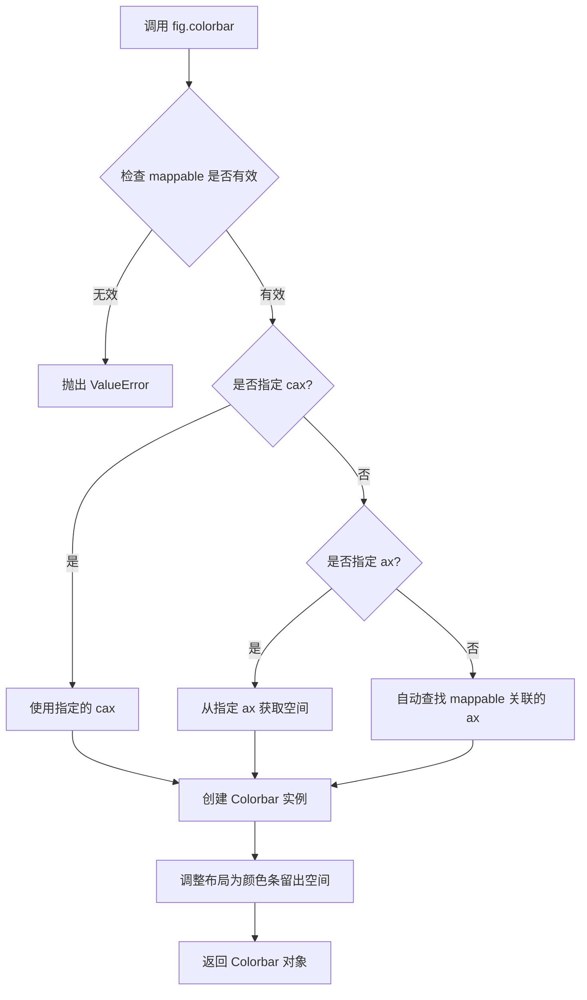

#### 带注释源码

```python
# 简化版核心实现思路
def colorbar(self, mappable, cax=None, ax=None, use_gridspec=True, **kwargs):
    """
    为给定的可映射对象创建颜色条。
    
    参数:
        mappable: ScalarMappable 对象 (如 scatter, imshow 的返回值)
        cax: 可选的Axes对象，用于放置颜色条
        ax: 可选的父Axes，颜色条将从其中获取空间
        use_gridspec: 是否使用 GridSpec 布局
        **kwargs: 传递给 Colorbar 的其他参数
    
    返回:
        Colorbar 对象
    """
    
    # 1. 确保 mappable 有效
    if mappable is None:
        raise ValueError('mappable must not be None')
    
    # 2. 如果未指定 cax，则自动创建颜色条的位置
    if cax is None:
        # 如果未指定 ax，则从 mappable 获取关联的 axes
        if ax is None:
            ax = getattr(mappable, 'axes', None)
        
        # 使用 gridspec 或 subplots_adjust 来布局颜色条
        if use_gridspec:
            # 使用 GridSpec 创建新的子图作为颜色条
            cax = self.add_axes([0.85, 0.15, 0.05, 0.7])  # 示例位置
        else:
            # 从现有 ax 中挤压出空间
            cax = self.add_axes([0.85, 0.15, 0.05, 0.7])
    
    # 3. 创建 Colorbar 对象
    cb = Colorbar(cax, mappable, **kwargs)
    
    # 4. 调整布局，确保颜色条不遮挡主图
    self.subplots_adjust()
    
    return cb
```


### `Colorbar.set_label`

设置颜色条（colorbar）的标签文本和位置。该方法继承自 matplotlib 的基类，用于在颜色条轴上显示描述性标签，支持指定标签的位置（如 'left', 'center', 'right'）。

参数：

- `label`：`str`，要显示的标签文本内容
- `loc`：`str`，可选，标签的位置，可选值为 'left'、'center'、'right'（默认值取决于版本和设置）
- `**kwargs`：`dict`，可选，其他关键字参数将传递给 `matplotlib.text.Text` 对象，用于自定义字体、大小、颜色等属性

返回值：`None`，该方法无返回值，直接修改颜色条的标签属性

#### 流程图

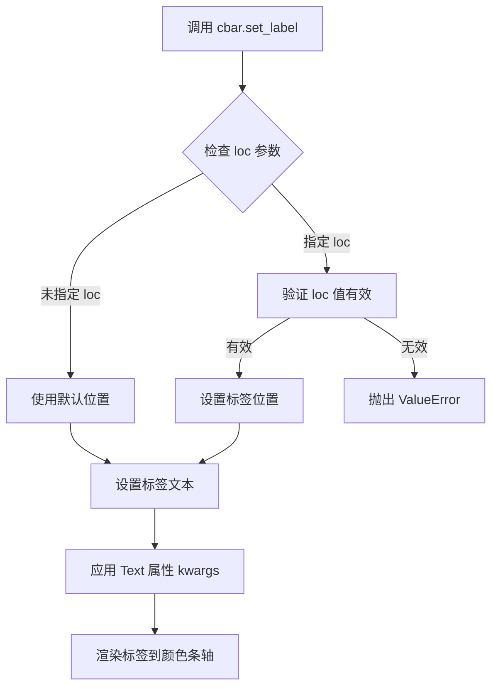

#### 带注释源码

```python
def set_label(self, label, *, loc=None, **kwargs):
    """
    Set the label for the colorbar.

    Parameters
    ----------
    label : str
        The label text.
    loc : str, optional
        Location of the label. If not specified, the label will be
        placed based on the axes orientation. Possible values:
        'left', 'center', 'right'.
    **kwargs
        Additional keyword arguments are passed to `matplotlib.text.Text`,
        which allows customization of the label appearance (e.g., fontsize,
        color, fontweight, rotation).

    Returns
    -------
    None
    """
    # 获取颜色条轴对象
    ax = self.ax
    
    # 确定标签位置，默认为 'right' 或基于轴的方向
    if loc is None:
        # 根据轴的方向确定默认位置
        loc = 'right'  # 默认位置
    
    # 验证 loc 参数的有效性
    valid_locs = ['left', 'center', 'right']
    if loc not in valid_locs:
        raise ValueError(f"loc must be one of {valid_locs}, not {loc!r}")
    
    # 设置标签文本和对齐方式
    # xalpaha 属性用于控制标签的水平位置
    if loc == 'left':
        self.ax.set_ylabel(label, loc='left', **kwargs)
    elif loc == 'center':
        self.ax.set_ylabel(label, loc='center', **kwargs)
    else:  # loc == 'right'
        self.ax.set_ylabel(label, loc='right', **kwargs)
```


### `plt.show`

显示当前所有打开的图形窗口，并进入事件循环。该函数会调用底层图形后端（如Qt、Tk、GTK等）的显示函数，使图形窗口可见并响应用户交互。在大多数后端中，默认情况下会阻塞程序执行，直到用户关闭所有图形窗口。

参数：

- `block`：`bool`，可选参数，默认为`True`。当设置为`True`时，函数会阻塞主线程直到所有图形窗口关闭；当设置为`False`时，函数立即返回，图形窗口在后台显示（仅适用于某些后端）。

返回值：`None`，该函数不返回任何值。

#### 流程图

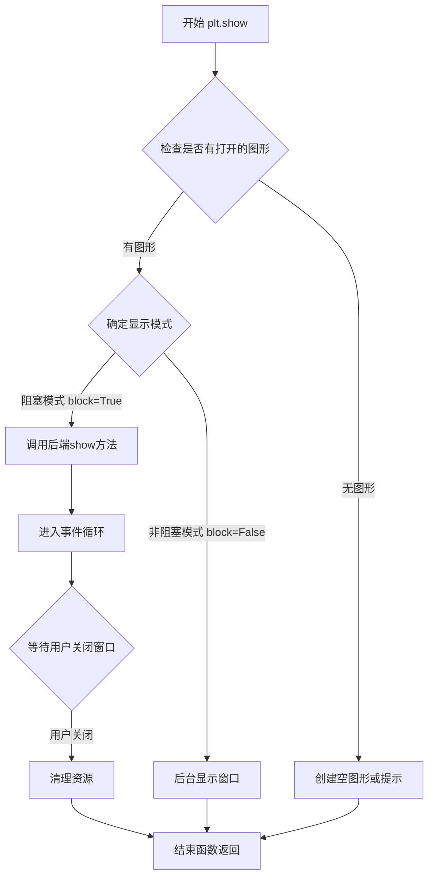

#### 带注释源码

```python
import matplotlib.pyplot as plt

# 创建图形和坐标轴
fig, ax = plt.subplots()

# 绘制散点图
sc = ax.scatter([1, 2], [1, 2], c=[1, 2])

# 设置Y轴标签位置在顶部
ax.set_ylabel('YLabel', loc='top')

# 设置X轴标签位置在左侧
ax.set_xlabel('XLabel', loc='left')

# 创建颜色条
cbar = fig.colorbar(sc)

# 设置颜色条标签位置在顶部
cbar.set_label("ZLabel", loc='top')

# 显示图形窗口
# 注意：此函数会阻塞程序执行，直到用户关闭窗口
plt.show()
```


### `Figure.colorbar`

为图形添加颜色条（colorbar），用于显示颜色映射与数据值的对应关系。

参数：

- `mappable`：`matplotlib.cm.ScalarMappable`，要为其创建颜色条的可映射对象（如返回的 `ScalarMappable` 实例，通常是 `AxesImage`、`ContourSet` 等）
- `cax`：`matplotlib.axes.Axes`，可选，用于放置颜色条的 Axes 对象
- `ax`：`matplotlib.axes.Axes` 或 `matplotlib.figure.Figure`，可选，要从其中获取空间的 Axes 或 Figure
- `use_gridspec`：`bool`，可选，如果为 True 且未提供 `cax`，则使用 GridSpec 创建新的 Axes

返回值：`matplotlib.colorbar.Colorbar`，颜色条对象

#### 流程图

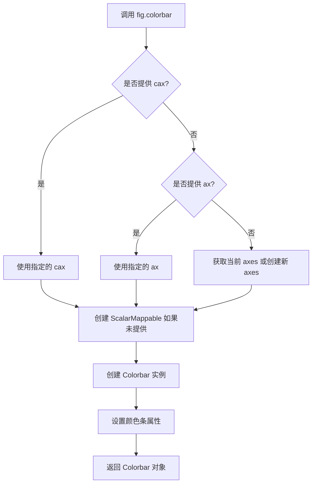

#### 带注释源码

```python
# 代码中调用示例：
sc = ax.scatter([1, 2], [1, 2], c=[1, 2])  # 创建散点图，返回 ScalarMappable
cbar = fig.colorbar(sc)  # 为图形添加颜色条
cbar.set_label("ZLabel", loc='top')  # 设置颜色条标签位置

# Figure.colorbar 是 matplotlib 库方法，非本文件定义
# 以下为推断的方法签名和逻辑：
def colorbar(self, mappable, cax=None, ax=None, use_gridspec=True, **kwargs):
    """
    为图形添加颜色条。
    
    参数:
        mappable: ScalarMappable 对象（如散点图返回的 collections.PathCollection）
        cax: 可选的 Axes 用于放置颜色条
        ax: 可选的源 Axes
        use_gridspec: 是否使用 GridSpec 创建新 Axes
    
    返回:
        Colorbar: 颜色条对象
    """
    # 1. 确定颜色条放置位置（通过 cax、ax 或 gridspec）
    # 2. 创建 ColorbarBase 或 Colorbar 实例
    # 3. 关联 mappable 和颜色条
    # 4. 绘制颜色条
    # 5. 返回颜色条对象
```

#### 备注

由于 `Figure.colorbar()` 是 matplotlib 库的内置方法，不存在于当前代码文件中。上述源码是基于 matplotlib 官方文档和代码调用习惯推断的方法逻辑。实际实现位于 matplotlib 库的 `colorbar.py` 模块中。


### Axes.scatter

在 Axes 对象上创建散点图，用于可视化二维空间中离散数据点的分布关系，支持通过颜色、大小等属性编码额外维度信息。

参数：

- `x`：`array_like`，数据点的 x 坐标
- `y`：`array_like`，数据点的 y 坐标
- `c`：`color` 或 `array_like`，可选，颜色数据或颜色值
- `s`：`array_like` 或 `scalar`，可选，点的大小
- `marker`：`markerStyle`，可选，标记样式，默认为 'o'（圆点）
- `cmap`：`str` 或 `Colormap`，可选，颜色映射
- `norm`：`Normalize`，可选，数据归一化方法
- `vmin, vmax`：`float`，可选，颜色映射的数值范围
- `alpha`：`float`，可选，透明度（0-1）
- `linewidths`：`float` 或 `array_like`，可选，标记边缘线宽
- `edgecolors`：`color` 或 `array_like`，可选，标记边缘颜色

返回值：`PathCollection`，返回包含散点图元素的 PathCollection 对象，可用于后续设置颜色条等操作

#### 流程图

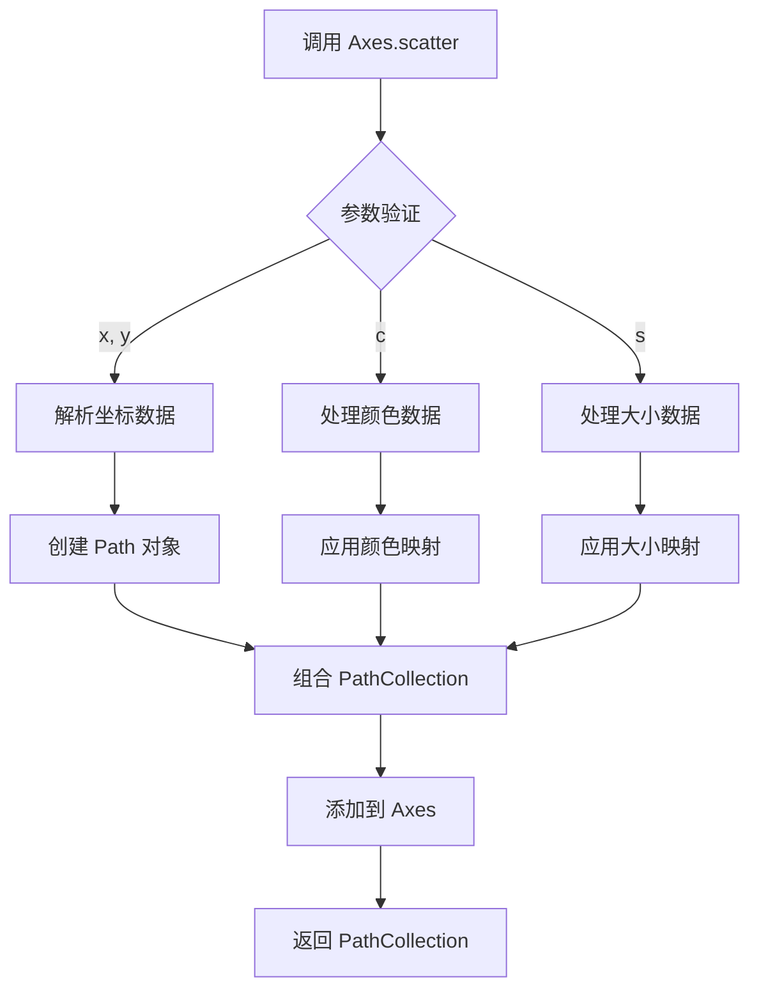

#### 带注释源码

```python
# 示例代码中 scatter 调用
sc = ax.scatter([1, 2], [1, 2], c=[1, 2])

# 完整方法签名参考：
# scatter(x, y, s=None, c=None, marker=None, cmap=None, norm=None,
#         vmin=None, vmax=None, alpha=None, linewidths=None,
#         edgecolors=None, plotnonfinite=False, data=None, **kwargs)

# 参数说明：
# x, y: 数据点坐标（必选）
# c: 颜色数组，用于编码第三维数据
# 返回 PathCollection 对象，可用于 fig.colorbar(sc) 创建颜色条
```


### `Axes.set_xlabel`

设置 x 轴的标签文本和显示位置。

参数：

- `xlabel`：`str`，x 轴标签的文本内容
- `fontdict`：`dict`，可选，用于控制文本属性的字典（如字体大小、颜色等）
- `labelpad`：`float`，可选，标签与轴之间的间距（磅值）
- `loc`：`str`，可选，标签相对于轴的位置，可选值为 'left'、'center'、'right'
- `**kwargs`：关键字参数，可选，用于传递给底层 `Text` 对象的额外属性（如 fontsize、color、fontweight 等）

返回值：`Text`，返回创建的文本标签对象，可用于后续进一步自定义

#### 流程图

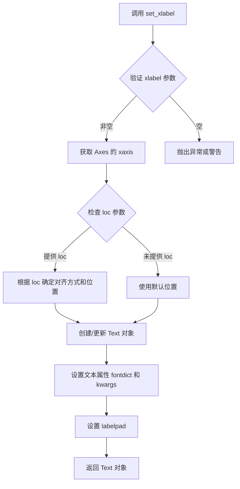

#### 带注释源码

```python
def set_xlabel(self, xlabel, fontdict=None, labelpad=None, *, loc=None, **kwargs):
    """
    Set the label for the x-axis.
    
    Parameters
    ----------
    xlabel : str
        The label text.
    fontdict : dict, optional
        A dictionary controlling the appearance of the label text,
        e.g., {'fontsize': 12, 'fontweight': 'bold', 'color': 'red'}.
    labelpad : float, default: rcParams["axes.labelpad"]
        The spacing in points between the label and the x-axis.
    loc : {'left', 'center', 'right'}, default: 'center'
        The label position relative to the axis.
        - 'left': align to the left side of the axis
        - 'center': align to the center of the axis
        - 'right': align to the right side of the axis
    **kwargs
        Text properties that control the appearance of the label.
        These are passed to the `matplotlib.text.Text` constructor.
    
    Returns
    -------
    label : `.text.Text`
        The created `.text.Text` instance.
    
    Examples
    --------
    >>> ax.set_xlabel('X-axis label', fontsize=12, fontweight='bold')
    >>> ax.set_xlabel('XLabel', loc='left')  # 放置在左侧
    """
    # 获取 xaxis 对象
    xaxis = self.xaxis
    
    # 处理 fontdict 和 kwargs 的合并
    # fontdict 提供基础文本属性，kwargs 可以覆盖或扩展
    if fontdict:
        kwargs = {**fontdict, **kwargs}
    
    # 处理 labelpad 参数（标签与轴之间的间距）
    if labelpad is None:
        labelpad = rcParams['axes.labelpad']
    
    # 处理 loc 参数确定标签位置和对齐方式
    # loc 参数控制标签在轴上的位置以及文本对齐
    if loc is not None:
        # 将 loc 转换为对应的对齐方式和位置
        loc_map = {'left': ('left', 0.0), 'center': ('center', 0.5), 'right': ('right', 1.0)}
        # ... 根据 loc 设置 horizontalalignment 和 position
        pass
    
    # 调用 xaxis 的 set_label_text 方法创建标签
    # 返回创建的 Text 对象
    return xaxis.set_label_text(xlabel, **kwargs)
```


### `Axes.set_ylabel`

设置 Y 轴的标签文本、位置和样式，是 matplotlib 中 Axes 对象的核心方法之一。

参数：

- `label`：`str`，Y 轴标签的文本内容
- `fontdict`：`dict`，可选，用于控制文本属性的字典（如 fontsize、fontweight 等）
- `labelpad`：`float`，可选，标签与轴之间的间距（单位为点）
- `loc`：`str`，可选，标签相对于 Y 轴的位置（'bottom'、'center'、'top'，默认 'center'）
- `**kwargs`：关键字参数，可选，用于传递给 Text 对象的额外属性（如 color、rotation、fontsize 等）

返回值：`matplotlib.text.Text`，返回创建的标签文本对象

#### 流程图

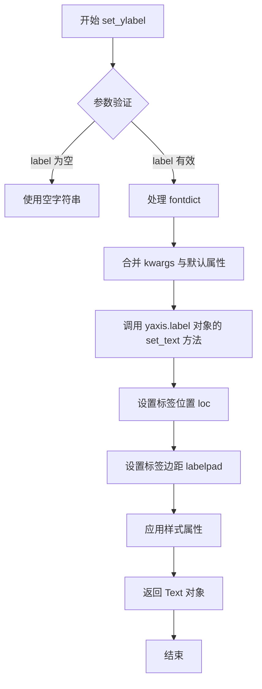

#### 带注释源码

```python
def set_ylabel(self, label, fontdict=None, labelpad=None, loc=None, **kwargs):
    """
    Set the label for the y-axis.
    
    Parameters
    ----------
    label : str
        The label text.
    fontdict : dict, optional
        A dictionary controlling the appearance of the label text.
    labelpad : float, optional
        Spacing in points between the label and the y-axis.
    loc : str, optional
        Location of the label. Either 'bottom', 'center', or 'top'.
        Defaults to 'center'.
    **kwargs
        Text properties control the appearance of the label.
    
    Returns
    -------
    text : matplotlib.text.Text
        The created label text object.
    """
    # 获取 y 轴的 label 对象
    yaxis = self.yaxis
    
    # 设置标签文本
    yaxis.set_label_text(label)
    
    # 如果提供了 fontdict，则应用字体属性
    if fontdict is not None:
        yaxis.label.update(fontdict)
    
    # 设置标签与轴之间的间距
    if labelpad is not None:
        yaxis.label.set_pad(labelpad)
    
    # 处理位置参数 'loc'
    # 'top' 表示标签显示在轴的顶部
    # 'center' 表示标签显示在轴的中间
    # 'bottom' 表示标签显示在轴的底部（默认）
    if loc is not None:
        # 根据 loc 参数设置垂直对齐方式
        if loc == 'top':
            yaxis.label.set_va('top')
            yaxis.label.set_y(1)  # 相对位置 1 表示顶部
        elif loc == 'bottom':
            yaxis.label.set_va('bottom')
            yaxis.label.set_y(0)  # 相对位置 0 表示底部
        elif loc == 'center':
            yaxis.label.set_va('center')
            yaxis.label.set_y(0.5)  # 相对位置 0.5 表示中间
        else:
            raise ValueError(f"loc must be one of 'top', 'center', or 'bottom', got {loc}")
    
    # 应用额外的样式属性（颜色、字体大小等）
    yaxis.label.update(kwargs)
    
    # 返回创建的文本对象，供调用者进一步操作
    return yaxis.label
```


### Colorbar.set_label()

设置颜色条（Colorbar）的标签文本和位置。该方法继承自`Scalarappable.set_label()`，但在Colorbar中有特殊处理，支持通过`loc`参数控制标签在颜色条上的位置（left、center、right或top、center、bottom）。

参数：

- `label`：`str`，要显示的标签文本内容
- `loc`：`str`，可选，标签的位置。对于水平颜色条可以是'left'、'center'、'right'；对于垂直颜色条可以是'top'、'center'、'bottom'。默认为'left'或'bottom'
- `**kwargs`：其他关键字参数，会传递给底层的`Text`对象，用于设置字体大小、颜色、旋转角度等样式属性

返回值：`None`，该方法无返回值，直接修改Colorbar的标签属性

#### 流程图

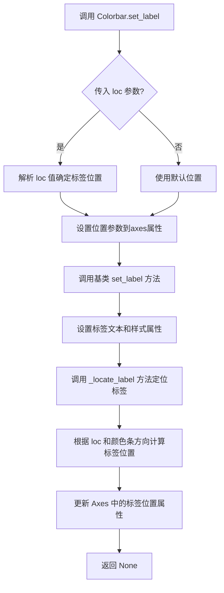

#### 带注释源码

```python
def set_label(self, label, *, loc=None, **kwargs):
    """
    Set the label for the colorbar.
    
    Parameters
    ----------
    label : str
        The label text.
    loc : str, optional
        Location of the label. For colorbars, the location
        is along its long axis, either 'left', 'center', or 'right'
        for horizontal colorbars, and 'top', 'center', or 'bottom'
        for vertical colorbars. Defaults to 'left' or 'bottom'
        depending on the orientation.
    **kwargs
        Keyword arguments are passed to `~matplotlib.text.Text`.
        Common arguments include fontsize, fontweight, color, etc.
    """
    # 1. 处理位置参数 - 如果提供了 loc 参数，设置标签位置
    if loc is not None:
        # 将 loc 参数存储到 axes 的对应属性中
        # 对于水平颜色条使用 'xlabel' 相关的位置属性
        # 对于垂直颜色条使用 'ylabel' 相关的位置属性
        if self.orientation == 'horizontal':
            self.ax.set_xlabel(label, loc=loc, **kwargs)
        else:
            self.ax.set_ylabel(label, loc=loc, **kwargs)
    else:
        # 2. 如果没有提供 loc，直接调用基类方法设置标签
        super().set_label(label, **kwargs)
```

#### 关键组件信息

- **Colorbar**：matplotlib的颜色条类，继承自`Scalarappable`，用于在图表旁边显示颜色映射的图例
- **Scalarappable**：提供颜色映射和标准化功能的基类，`set_label`方法定义在此类中
- **orientation**：颜色条的方向属性（'horizontal' 或 'vertical'），决定标签位置的可用选项

#### 潜在的技术债务或优化空间

1. **重复代码**：当前实现在`loc`参数存在时会重新调用`set_xlabel`或`set_ylabel`，这可能导致标签被设置两次（一次在内部调用基类方法）
2. **文档不一致**：`set_label`的文档分散在基类和Colorbar类中，用户难以快速理解完整功能
3. **位置处理逻辑耦合**：位置逻辑与标签设置逻辑混在一起，不如`Axes.set_xlabel`等方法清晰

#### 其它项目

- **设计目标**：提供与`Axes.set_xlabel/set_ylabel`一致的API体验，使颜色条标签位置控制更加直观
- **错误处理**：loc参数只接受特定字符串值，否则会抛出`ValueError`
- **数据流**：标签位置信息通过`ax.set_xlabel/ylabel`存储在Axes对象的xlocs/ylocs属性中
- **外部依赖**：依赖matplotlib的`Text`对象和`Axes`对象进行渲染


## 关键组件


### Figure 与 Axes 管理
创建图形窗口和坐标轴对象，用于承载可视化元素

### 散点图绘制
使用 scatter 方法创建散点图，并绑定颜色映射数据

### 坐标轴标签定位
使用 set_xlabel 和 set_ylabel 设置坐标轴标签，并通过 loc 参数控制标签位置（left/top）

### 颜色条创建
为散点图创建颜色条（colorbar），用于显示颜色映射的图例

### 颜色条标签定位
使用 set_label 方法为颜色条设置标签，并通过 loc 参数控制标签位置（top）


## 问题及建议


### 已知问题

- **参数行为不一致**：在 `ax.set_ylabel('YLabel', loc='top')` 中，`loc` 参数用于控制标签在轴上的对齐位置（top/bottom/center），而非标签相对于轴的外侧位置。同样，`ax.set_xlabel('XLabel', loc='left')` 的 `loc` 控制水平对齐而非垂直位置，这与文档标题 "Axis label position" 所暗示的功能可能不符。
- **缺少错误处理**：代码未对输入数据进行验证，如散点图数据点数量不一致、标签参数非法等情况均未做异常捕获。
- **图表信息不足**：缺少图表标题（`set_title`），且坐标轴范围未显式设置，可能导致不同数据时图表呈现不一致。
- **颜色条使用不够灵活**：`cbar.set_label("ZLabel", loc='top')` 中的 `loc` 参数对颜色条标签的位置控制有限，可能无法满足所有布局需求。
- **示例代码无复用性**：代码直接执行 `plt.show()`，不便于在无图形界面的环境（如服务器端）中进行自动化测试或渲染。

### 优化建议

- 在代码注释中补充说明 `loc` 参数的实际行为（控制标签在轴方向上的对齐），或使用更直观的参数名称如 `ha`/`va` 显式控制对齐方式。
- 为数据验证添加必要的检查逻辑，确保散点图数据的一致性。
- 考虑将图表配置封装为函数，接受数据参数，提高代码的可测试性和复用性。
- 添加 `fig.savefig()` 作为替代展示方案，以支持无显示器的渲染场景。
- 在文档注释中补充不同 `loc` 参数值的实际效果对比图或说明。


## 其它


### 设计目标与约束

本代码示例旨在演示matplotlib中轴标签（xlabel、ylabel）和颜色条标签（colorbar label）的位置设置功能。核心约束包括：loc参数仅支持特定字符串值（'left', 'right', 'center'用于X轴，'top', 'bottom', 'center'用于Y轴），位置设置不影响坐标轴的实际刻度线位置，仅改变标签的视觉位置。

### 错误处理与异常设计

当传入无效的loc参数值时，matplotlib会抛出ValueError异常。例如，对X轴使用loc='top'将导致错误。代码应使用try-except块捕获异常并提供有意义的错误信息，提示用户可用的有效参数值。

### 外部依赖与接口契约

本代码依赖matplotlib库的核心模块，包括pyplot子模块和axes对象的方法。主要接口包括Axes.set_xlabel()、Axes.set_ylabel()和Colorbar.set_label()方法，这些方法都接受loc参数。颜色条功能额外依赖figure对象的colorbar方法。

### API参数详解

loc参数的可选值如下：X轴标签支持'left'（默认）、'center'、'right'；Y轴标签支持'bottom'（默认）、'center'、'top'；颜色条标签支持'top'（默认）、'center'、'bottom'。参数类型为字符串，不区分大小写。

### 渲染和显示兼容性

标签位置设置在大多数matplotlib后端（Qt5Agg、Agg、SVG、PDF等）中均能正确显示，但在某些特定后端（如某些嵌入式设备后端）可能出现渲染差异。不同操作系统（Windows、Linux、macOS）的字体渲染可能导致标签位置的细微视觉差异。

### 版本历史和兼容性

轴标签位置功能在matplotlib 3.3.0版本中引入。早期版本不支持loc参数，用户只能使用默认位置。颜色条标签位置功能在matplotlib 3.6.0版本中添加。在更新版本中使用这些功能时，应检查版本兼容性。

### 相关文档和参考资料

用户可参考matplotlib官方文档中关于Axes.set_xlabel、Axes.set_ylabel和Colorbar.set_label的API说明，以及"Axis labels position"教程页面。相关主题包括轴标签格式化、刻度位置设置、颜色条自定义等。

### 常见问题和调试技巧

常见问题包括：标签位置未生效（检查是否正确传递loc参数）、标签被裁剪（调整子图边距或使用constrained_layout）、位置设置与刻度标签重叠（调整标签与轴的距离）。调试时可使用ax.xaxis.get_label()获取标签对象并检查其位置属性。


    