# `matplotlib\galleries\examples\subplots_axes_and_figures\demo_constrained_layout.py` 详细设计文档

This code demonstrates the use of constrained layout in Matplotlib to manage subplot sizes and prevent label overlaps.

## 整体流程

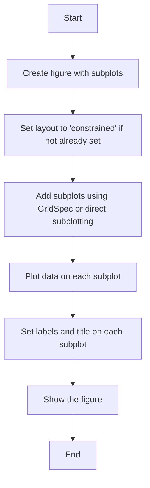

## 类结构

```
Figure
├── Subplots (Axes)
│   ├── Axes (from GridSpec)
│   └── Axes (from direct subplotting)
└── Layout (constrained)
```

## 全局变量及字段


### `fig`
    
The main figure object containing all subplots.

类型：`matplotlib.figure.Figure`
    


### `axs`
    
An array of axes objects representing the subplots.

类型：`numpy.ndarray of matplotlib.axes.Axes`
    


### `gs0`
    
GridSpec object for the first grid in the figure.

类型：`matplotlib.gridspec.GridSpec`
    


### `gs1`
    
GridSpec object for the first grid within the first grid in the figure.

类型：`matplotlib.gridspec.GridSpec`
    


### `gs2`
    
GridSpec object for the second grid within the first grid in the figure.

类型：`matplotlib.gridspec.GridSpec`
    


### `example_plot`
    
Function to create a simple plot with an x-label, y-label, and title.

类型：`function`
    


### `Figure.fig`
    
The main figure object containing all subplots.

类型：`matplotlib.figure.Figure`
    


### `Figure.dpi`
    
Dots per inch for the figure.

类型：`int`
    


### `Figure.facecolor`
    
Face color for the figure.

类型：`color`
    


### `Figure.edgecolor`
    
Edge color for the figure.

类型：`color`
    


### `Figure.frameon`
    
Whether to draw the figure frame.

类型：`bool`
    


### `Figure.figsize`
    
Size of the figure in inches.

类型：`tuple`
    


### `Figure.constrained_layout`
    
Whether to enable constrained layout.

类型：`bool`
    


### `Axes.ax`
    
The main axes object of the plot.

类型：`matplotlib.axes.Axes`
    


### `Axes.label`
    
Label for the axes object.

类型：`str`
    


### `Axes.title`
    
Title of the plot.

类型：`str`
    


### `Axes.xlabel`
    
Label for the x-axis.

类型：`str`
    


### `Axes.ylabel`
    
Label for the y-axis.

类型：`str`
    


### `Axes.xaxis`
    
The x-axis object of the plot.

类型：`matplotlib.axis.Axis`
    


### `Axes.yaxis`
    
The y-axis object of the plot.

类型：`matplotlib.axis.Axis`
    
    

## 全局函数及方法


### example_plot

The `example_plot` function is used to plot a simple line graph with specified labels and title on a given axes object.

参数：

- `ax`：`matplotlib.axes.Axes`，The axes object on which to plot the graph.

返回值：`None`，This function does not return any value.

#### 流程图


#### 带注释源码

```python
def example_plot(ax):
    # Plot a line graph with x values [1, 2]
    ax.plot([1, 2])
    
    # Set the x-axis label with specified fontsize
    ax.set_xlabel('x-label', fontsize=12)
    
    # Set the y-axis label with specified fontsize
    ax.set_ylabel('y-label', fontsize=12)
    
    # Set the title of the plot with specified fontsize
    ax.set_title('Title', fontsize=14)
``` 


### plt.subplots

`plt.subplots` 是一个用于创建子图（subplot）的函数，它允许用户在单个图形窗口中创建多个子图，并可以自定义它们的布局。

参数：

- `nrows`：`int`，指定子图的总行数。
- `ncols`：`int`，指定子图的总列数。
- `sharex`：`bool`，指定是否共享所有子图的x轴。
- `sharey`：`bool`，指定是否共享所有子图的y轴。
- `sharewspace`：`bool`，指定是否共享子图之间的空白空间。
- `sharewspace`：`bool`，指定是否共享子图之间的空白空间。
- `fig`：`matplotlib.figure.Figure`，指定要添加子图的图形对象。
- `gridspec`：`matplotlib.gridspec.GridSpec`，指定子图的网格布局。
- `constrained_layout`：`bool`，指定是否启用约束布局。

返回值：`matplotlib.axes.Axes`，一个包含子图的数组。

#### 流程图

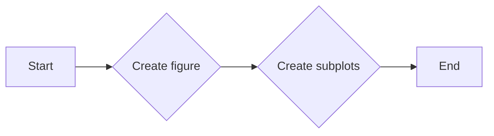

#### 带注释源码

```python
import matplotlib.pyplot as plt

def example_plot(ax):
    ax.plot([1, 2])
    ax.set_xlabel('x-label', fontsize=12)
    ax.set_ylabel('y-label', fontsize=12)
    ax.set_title('Title', fontsize=14)

fig, axs = plt.subplots(nrows=2, ncols=2, layout='constrained')

for ax in axs.flat:
    example_plot(ax)

plt.show()
```


### plt.subplots

`plt.subplots` 是一个用于创建子图（subplot）的函数。

参数：

- `nrows`：`int`，子图行数。
- `ncols`：`int`，子图列数。
- `sharex`：`bool`，是否共享X轴。
- `sharey`：`bool`，是否共享Y轴。
- `fig`：`matplotlib.figure.Figure`，可选，用于创建子图的父图。
- `gridspec`：`matplotlib.gridspec.GridSpec`，可选，用于定义子图的网格布局。
- `constrained_layout`：`bool`，可选，是否启用约束布局。

返回值：`matplotlib.figure.Figure`，包含子图的父图。

#### 流程图

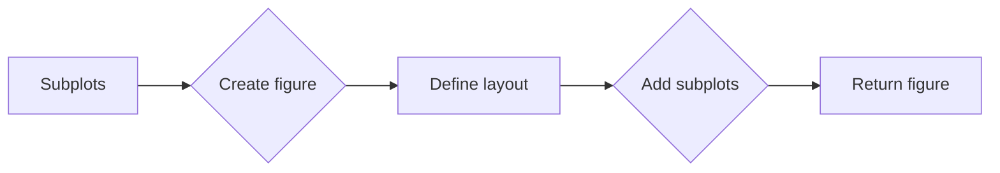

#### 带注释源码

```python
fig, axs = plt.subplots(nrows=2, ncols=2, layout='constrained')
```


### example_plot

`example_plot` 是一个用于绘制示例图表的函数。

参数：

- `ax`：`matplotlib.axes.Axes`，用于绘图的轴对象。

返回值：无。

#### 流程图

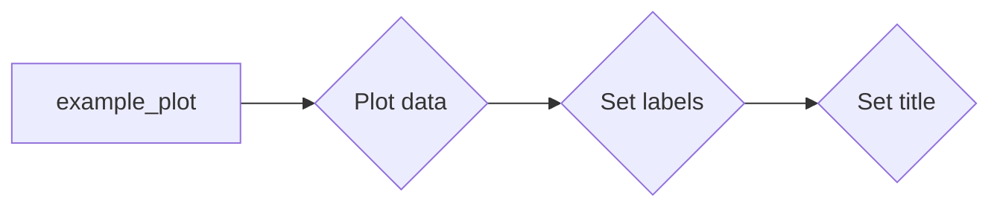

#### 带注释源码

```python
def example_plot(ax):
    ax.plot([1, 2])
    ax.set_xlabel('x-label', fontsize=12)
    ax.set_ylabel('y-label', fontsize=12)
    ax.set_title('Title', fontsize=14)
```


### matplotlib.gridspec.GridSpec

`matplotlib.gridspec.GridSpec` 是一个用于定义子图网格布局的类。

参数：

- `ncols`：`int`，列数。
- `nrows`：`int`，行数。
- `width_ratios`：`list`，列宽比例。
- `height_ratios`：`list`，行高比例。
- `wspace`：`float`，列间距。
- `hspace`：`float`，行间距。

#### 流程图

```mermaid
graph LR
A[GridSpec] --> B{Define grid layout}
B --> C[Create subplots}
```

#### 带注释源码

```python
import matplotlib.gridspec as gridspec

gs0 = gridspec.GridSpec(1, 2, figure=fig)
```


### matplotlib.gridspec.GridSpecFromSubplotSpec

`matplotlib.gridspec.GridSpecFromSubplotSpec` 是一个用于从现有子图创建网格布局的类。

参数：

- `ncols`：`int`，列数。
- `nrows`：`int`，行数。
- `subplot_spec`：`matplotlib.gridspec.GridSpec`，现有子图的网格布局。

#### 流程图

```mermaid
graph LR
A[GridSpecFromSubplotSpec] --> B{Create grid layout from subplot}
B --> C[Add subplots}
```

#### 带注释源码

```python
gs1 = gridspec.GridSpecFromSubplotSpec(3, 1, subplot_spec=gs0[0])
```


### plt.show

`plt.show` 是一个用于显示图表的函数。

参数：无。

返回值：无。

#### 流程图

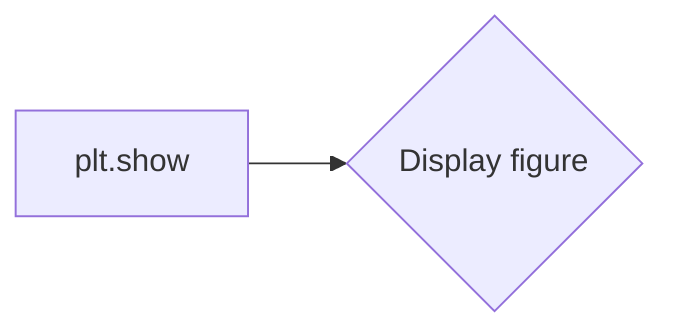

#### 带注释源码

```python
plt.show()
```

## 关键组件信息

- `matplotlib.pyplot`：用于创建和显示图表的库。
- `matplotlib.axes.Axes`：用于绘图的轴对象。
- `matplotlib.figure.Figure`：用于包含子图的父图。
- `matplotlib.gridspec.GridSpec`：用于定义子图网格布局的类。
- `matplotlib.gridspec.GridSpecFromSubplotSpec`：用于从现有子图创建网格布局的类。

## 潜在的技术债务或优化空间

- 代码中使用了硬编码的字体大小，这可能导致在不同环境中显示不一致。
- 可以考虑使用更高级的布局管理器，如 `constrained_layout`，以自动调整子图大小和位置。

## 设计目标与约束

- 设计目标是创建一个示例，展示如何使用 `matplotlib` 创建和显示图表。
- 约束是使用 `matplotlib` 库中的函数和方法。

## 错误处理与异常设计

- 代码中没有显式的错误处理或异常设计。
- 可以考虑添加异常处理，以捕获和处理可能发生的错误。

## 数据流与状态机

- 数据流：用户调用 `plt.subplots` 创建子图，然后调用 `example_plot` 绘制图表。
- 状态机：代码中没有使用状态机。

## 外部依赖与接口契约

- 代码依赖于 `matplotlib` 库。
- 接口契约由 `matplotlib` 库定义。


### example_plot(ax)

该函数用于绘制一个简单的折线图，并设置坐标轴标签和标题。

参数：

- `ax`：`matplotlib.axes.Axes`，表示要绘制图形的坐标轴对象。

返回值：无

#### 流程图

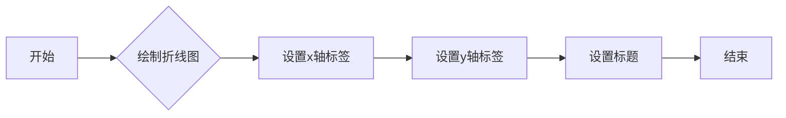

#### 带注释源码

```python
def example_plot(ax):
    ax.plot([1, 2])  # 绘制折线图
    ax.set_xlabel('x-label', fontsize=12)  # 设置x轴标签
    ax.set_ylabel('y-label', fontsize=12)  # 设置y轴标签
    ax.set_title('Title', fontsize=14)  # 设置标题
```


### example_plot(ax)

该函数用于绘制一个简单的折线图，并设置坐标轴标签和标题。

参数：

- `ax`：`matplotlib.axes.Axes`，用于绘图的坐标轴对象。

返回值：无

#### 流程图

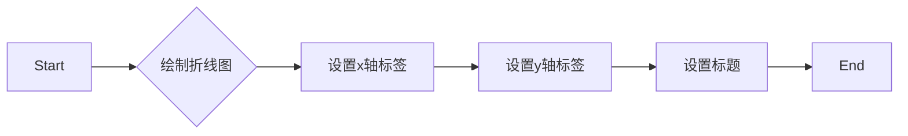

#### 带注释源码

```python
def example_plot(ax):
    ax.plot([1, 2])  # 绘制折线图
    ax.set_xlabel('x-label', fontsize=12)  # 设置x轴标签
    ax.set_ylabel('y-label', fontsize=12)  # 设置y轴标签
    ax.set_title('Title', fontsize=14)  # 设置标题
```

### matplotlib.gridspec

全局变量，用于创建网格布局。

参数：

- 无

返回值：`matplotlib.gridspec.GridSpec`对象

#### 流程图

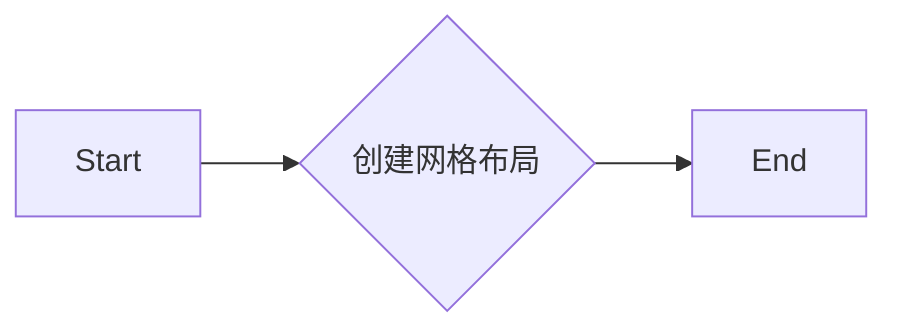

#### 带注释源码

```python
import matplotlib.gridspec as gridspec
```


### Figure.add_subplot

`Figure.add_subplot` 是一个方法，用于向当前图（Figure）中添加一个子图（Axes）。

参数：

- `gs`：`GridSpec` 或 `GridSpecFromSubplotSpec` 对象，指定子图的位置和大小。

返回值：`Axes` 对象，表示添加的子图。

#### 流程图

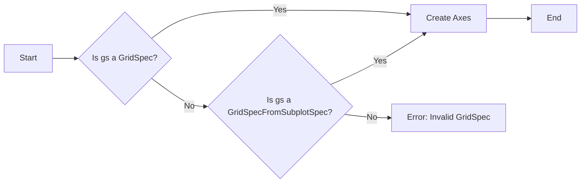

#### 带注释源码

```python
import matplotlib.gridspec as gridspec

def add_subplot(self, gs):
    """
    Add an Axes to the figure.

    Parameters
    ----------
    gs : GridSpec or GridSpecFromSubplotSpec
        The GridSpec or GridSpecFromSubplotSpec object that specifies the position and size of the subplot.

    Returns
    -------
    Axes : The Axes object that was added to the figure.
    """
    # Check if gs is a GridSpec or GridSpecFromSubplotSpec
    if isinstance(gs, gridspec.GridSpec):
        # Create an Axes object at the specified position and size
        ax = self._create_subplot(gs)
    elif isinstance(gs, gridspec.GridSpecFromSubplotSpec):
        # Create an Axes object at the specified position and size
        ax = self._create_subplot(gs)
    else:
        # If gs is not a valid GridSpec or GridSpecFromSubplotSpec, raise an error
        raise ValueError("Invalid GridSpec")

    # Add the Axes object to the figure
    self.axes.append(ax)

    # Return the Axes object
    return ax
```


### plt.subplots_adjust

`plt.subplots_adjust` 是一个用于调整子图间距的函数，它允许用户在matplotlib绘图中手动调整子图之间的间距。

参数：

- `left`：`float`，子图左侧与图框的间距。
- `right`：`float`，子图右侧与图框的间距。
- `top`：`float`，子图顶部与图框的间距。
- `bottom`：`float`，子图底部与图框的间距。
- `wspace`：`float`，子图之间的水平间距。
- `hspace`：`float`，子图之间的垂直间距。

返回值：`None`，该函数没有返回值。

#### 流程图

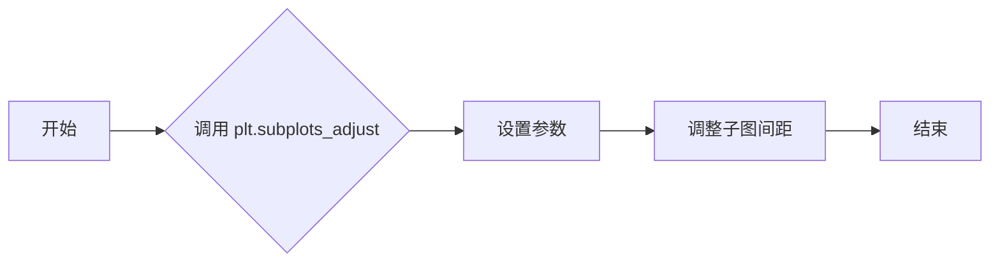

#### 带注释源码

```python
import matplotlib.pyplot as plt

# 设置子图间距
plt.subplots_adjust(left=0.1, right=0.9, top=0.9, bottom=0.1, wspace=0.4, hspace=0.4)
```


### Figure.savefig

`Figure.savefig` is a method of the `Figure` class in the `matplotlib.pyplot` module. It is used to save the figure to a file.

参数：

- `filename`：`str`，指定保存文件的名称。
- `dpi`：`int`，指定图像的分辨率（每英寸点数），默认为100。
- `bbox_inches`：`str`，指定裁剪边界框，默认为`'tight'`。
- `pad_inches`：`float`，指定额外的填充，默认为0.1。

返回值：`None`，没有返回值。

#### 流程图

```mermaid
graph LR
A[Start] --> B{Call Figure.savefig()}
B --> C[End]
```

#### 带注释源码

```python
def savefig(self, filename, dpi=100, bbox_inches='tight', pad_inches=0.1):
    """
    Save the figure to a file.

    Parameters
    ----------
    filename : str
        The name of the file to save the figure to.
    dpi : int, optional
        The resolution of the image in dots per inch. Default is 100.
    bbox_inches : str, optional
        The bounding box to use for the tight layout. Default is 'tight'.
    pad_inches : float, optional
        Additional padding around the bounding box. Default is 0.1.

    Returns
    -------
    None
    """
    # Implementation details are omitted for brevity.
    pass
```


### example_plot

This function creates a simple plot with a given axis object, setting the x-label, y-label, and title.

参数：

- `ax`：`matplotlib.axes.Axes`，The axis object to plot on.

返回值：`None`，No return value, the plot is drawn on the provided axis object.

#### 流程图

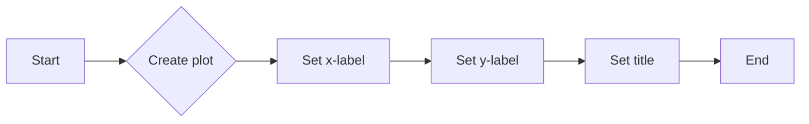

#### 带注释源码

```python
def example_plot(ax):
    ax.plot([1, 2])
    ax.set_xlabel('x-label', fontsize=12)
    ax.set_ylabel('y-label', fontsize=12)
    ax.set_title('Title', fontsize=14)
```


### example_plot

This function is used to plot a simple line graph with specified labels and title on an Axes object.

参数：

- `ax`：`matplotlib.axes.Axes`，The Axes object on which to plot the line graph.

返回值：`None`，This function does not return any value.

#### 流程图


#### 带注释源码

```python
def example_plot(ax):
    ax.plot([1, 2])  # Plot a line graph with x and y values [1, 2]
    ax.set_xlabel('x-label', fontsize=12)  # Set the x-axis label with specified fontsize
    ax.set_ylabel('y-label', fontsize=12)  # Set the y-axis label with specified fontsize
    ax.set_title('Title', fontsize=14)  # Set the title of the plot with specified fontsize
```


### `Axes.set_xlabel`

`Axes.set_xlabel` 方法用于设置轴标签的文本和字体大小。

参数：

- `xlabel`：`str`，轴标签的文本内容。
- `fontsize`：`int`，轴标签的字体大小。

返回值：`None`，该方法不返回任何值。

#### 流程图


#### 带注释源码

```python
def example_plot(ax):
    ax.plot([1, 2])
    ax.set_xlabel('x-label', fontsize=12)  # Set the x-axis label with a specific font size
    ax.set_ylabel('y-label', fontsize=12)
    ax.set_title('Title', fontsize=14)
```


### `Axes.set_ylabel`

`Axes.set_ylabel` 方法用于设置轴标签的文本和字体大小。

参数：

- `label`：`str`，轴标签的文本。
- `fontsize`：`int` 或 `float`，轴标签的字体大小。

返回值：`None`，该方法不返回任何值。

#### 流程图

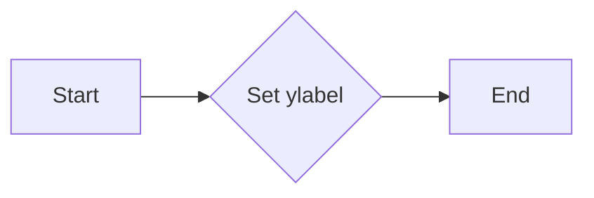

#### 带注释源码

```python
def example_plot(ax):
    ax.plot([1, 2])
    ax.set_xlabel('x-label', fontsize=12)  # Set x-axis label with fontsize 12
    ax.set_ylabel('y-label', fontsize=12)  # Set y-axis label with fontsize 12
    ax.set_title('Title', fontsize=14)  # Set title with fontsize 14
```


### `example_plot`

`example_plot` 是一个函数，用于在给定的轴对象上绘制一个简单的折线图，并设置轴的标题、x轴标签和y轴标签。

参数：

- `ax`：`matplotlib.axes.Axes`，轴对象，用于绘制图形和设置标签。

返回值：无

#### 流程图

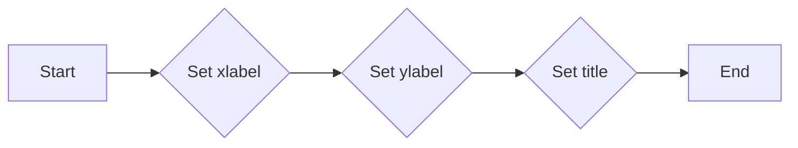

#### 带注释源码

```python
def example_plot(ax):
    # 绘制一个简单的折线图
    ax.plot([1, 2])
    
    # 设置x轴标签
    ax.set_xlabel('x-label', fontsize=12)
    
    # 设置y轴标签
    ax.set_ylabel('y-label', fontsize=12)
    
    # 设置标题
    ax.set_title('Title', fontsize=14)
```


### example_plot

This function creates a simple plot with a given axis object, setting the x-label, y-label, and title.

参数：

- `ax`：`matplotlib.axes.Axes`，The axis object to plot on.

返回值：`None`，No return value, the plot is drawn on the provided axis object.

#### 流程图

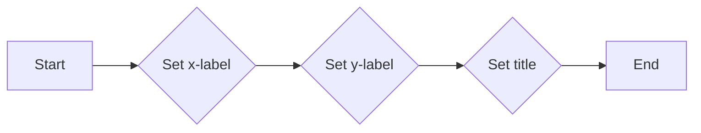

#### 带注释源码

```python
def example_plot(ax):
    ax.plot([1, 2])
    ax.set_xlabel('x-label', fontsize=12)
    ax.set_ylabel('y-label', fontsize=12)
    ax.set_title('Title', fontsize=14)
```


## 关键组件


### 张量索引与惰性加载

张量索引与惰性加载是处理大型数据集时提高性能的关键技术，它允许在需要时才计算或加载数据，从而减少内存消耗和提高处理速度。

### 反量化支持

反量化支持是针对量化计算优化的一种技术，它允许在量化过程中保留部分精度，以减少量化误差。

### 量化策略

量化策略是用于将浮点数转换为固定点数表示的方法，以减少计算资源消耗和提高计算速度。它包括不同的量化方法，如均匀量化、非均匀量化等。


## 问题及建议


### 已知问题

-   **代码重复**：`example_plot` 函数在多个地方被调用，每次调用都执行相同的操作，这可能导致维护困难。
-   **全局变量**：代码中未使用全局变量，但使用全局函数 `plt.show()` 可能导致代码的可重入性差。
-   **异常处理**：代码中没有异常处理机制，如果出现错误（如matplotlib版本不兼容），程序可能会崩溃。

### 优化建议

-   **代码重构**：将 `example_plot` 函数的调用封装在一个类或模块中，以减少代码重复并提高可维护性。
-   **局部变量**：如果需要使用全局变量，应确保它们被适当地声明和初始化，并考虑使用类变量或实例变量来替代全局变量。
-   **异常处理**：添加异常处理来捕获和处理可能发生的错误，例如使用 `try-except` 块来捕获 `ImportError` 或 `ValueError`。
-   **代码注释**：增加代码注释，特别是对于复杂的逻辑和函数调用，以提高代码的可读性和可维护性。
-   **测试**：编写单元测试来验证代码的功能，确保在修改代码时不会破坏现有功能。
-   **文档**：更新文档，包括代码的用途、如何使用它以及可能遇到的错误。


## 其它


### 设计目标与约束

- 设计目标：实现一个能够自动调整子图大小的功能，以确保子图之间没有重叠，并保持标签的可读性。
- 约束条件：必须使用matplotlib库进行绘图，且需要支持嵌套的gridspec布局。

### 错误处理与异常设计

- 错误处理：在绘图过程中，如果发生matplotlib相关的错误（如无法创建图形、子图等），应捕获异常并给出友好的错误信息。
- 异常设计：定义自定义异常类，用于处理特定的错误情况，如`PlottingError`。

### 数据流与状态机

- 数据流：从创建图形和子图开始，通过调用`example_plot`函数添加数据，最后显示图形。
- 状态机：图形和子图的状态包括创建、绘制、调整布局和显示。

### 外部依赖与接口契约

- 外部依赖：依赖于matplotlib库和gridspec模块。
- 接口契约：`example_plot`函数定义了接口契约，包括输入参数和返回值。


    