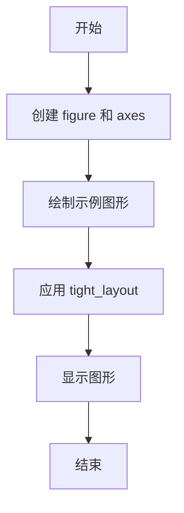
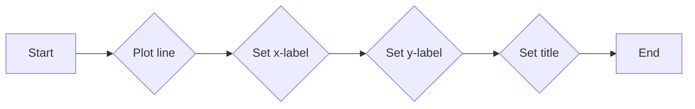
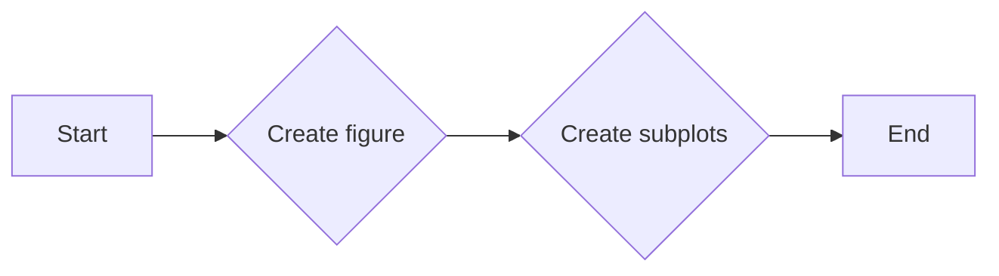
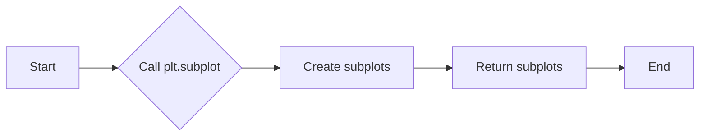
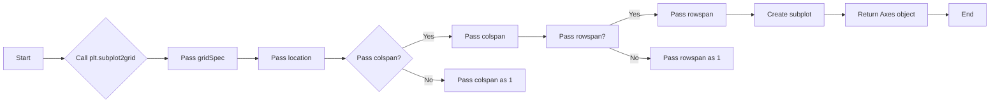
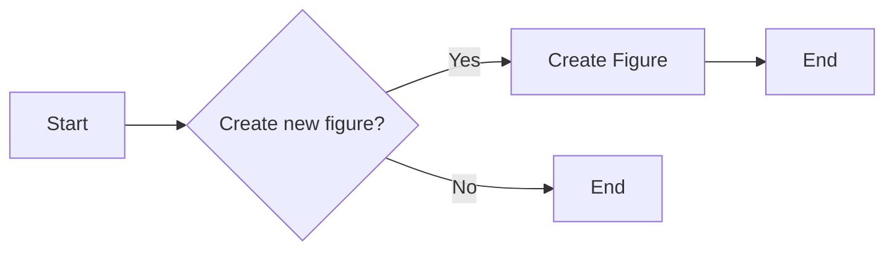

# `matplotlib\galleries\examples\subplots_axes_and_figures\demo_tight_layout.py` 详细设计文档

This code demonstrates the use of `tight_layout` in matplotlib to automatically adjust subplot parameters to give specified padding.

## 整体流程



## 类结构

```
matplotlib.pyplot (全局模块)
├── Figure.tight_layout
│   ├── example_plot
│   ├── plt.subplots
│   ├── plt.subplot
│   ├── plt.subplot2grid
│   └── plt.figure
```

## 全局变量及字段


### `fig`
    
The main figure object where all subplots are added.

类型：`matplotlib.figure.Figure`
    


### `ax`
    
An individual axes object where plots are drawn.

类型：`matplotlib.axes.Axes`
    


### `axs`
    
An array of axes objects for a grid of subplots.

类型：`numpy.ndarray of matplotlib.axes.Axes`
    


### `gs1`
    
A GridSpec object for defining the layout of subplots in a figure.

类型：`matplotlib.gridspec.GridSpec`
    


### `gs2`
    
A GridSpec object for defining the layout of subplots in a figure.

类型：`matplotlib.gridspec.GridSpec`
    


### `top`
    
The top boundary of the subplots in the figure.

类型：`float`
    


### `bottom`
    
The bottom boundary of the subplots in the figure.

类型：`float`
    


    

## 全局函数及方法


### example_plot

The `example_plot` function is designed to plot a simple line graph with labeled axes and a title. It also adjusts the font size of the labels and title dynamically.

参数：

- `ax`：`matplotlib.axes.Axes`，The axes object on which to plot the line graph.

返回值：`None`，This function does not return any value.

#### 流程图



#### 带注释源码

```python
def example_plot(ax):
    ax.plot([1, 2])  # Plot a line graph with x values [1, 2]
    ax.set_xlabel('x-label', fontsize=next(fontsizes))  # Set x-axis label with dynamic font size
    ax.set_ylabel('y-label', fontsize=next(fontsizes))  # Set y-axis label with dynamic font size
    ax.set_title('Title', fontsize=next(fontsizes))  # Set title with dynamic font size
```


### plt.subplots

`plt.subplots` 是一个用于创建子图（subplot）的函数，它允许用户在单个图形窗口中创建多个子图。

参数：

- `nrows`：`int`，指定子图的行数。
- `ncols`：`int`，指定子图的列数。
- `sharex`：`bool`，指定是否共享所有子图的x轴。
- `sharey`：`bool`，指定是否共享所有子图的y轴。
- `sharewx`：`bool`，指定是否共享所有子图的宽x轴。
- `sharewy`：`bool`，指定是否共享所有子图的宽y轴。
- `fig`：`matplotlib.figure.Figure`，指定要添加子图的图形对象。
- `gridspec`：`matplotlib.gridspec.GridSpec`，指定子图的网格布局。

返回值：`matplotlib.axes.Axes`，一个包含子图的列表。

#### 流程图



#### 带注释源码

```python
import matplotlib.pyplot as plt

fig, axs = plt.subplots(nrows=2, ncols=2)
# axs is a list of Axes objects representing the subplots
```


### plt.subplot

`plt.subplot` 是一个用于创建子图的函数，它允许用户在同一个图形窗口中创建多个子图。

参数：

- `nrows`：`int`，子图的总行数。
- `ncols`：`int`，子图的总列数。
- `sharex`：`bool`，是否共享x轴。
- `sharey`：`bool`，是否共享y轴。
- `sharewx`：`bool`，是否共享宽x轴。
- `sharewy`：`bool`，是否共享宽y轴。
- `rowspan`：`int`，子图在行方向上的跨行数。
- `colspan`：`int`，子图在列方向上的跨列数。
- `fig`：`matplotlib.figure.Figure`，子图所属的图形对象。

返回值：`matplotlib.axes.Axes`，创建的子图对象。

#### 流程图



#### 带注释源码

```python
import matplotlib.pyplot as plt

# 创建一个图形对象
fig = plt.figure()

# 创建一个2行2列的子图
ax1 = plt.subplot(221)
ax2 = plt.subplot(223)
ax3 = plt.subplot(122)

# 在子图上绘制图形
ax1.plot([1, 2])
ax2.plot([1, 2, 3])
ax3.plot([1, 2, 3, 4])

# 显示图形
plt.show()
``` 


### plt.subplot2grid

`plt.subplot2grid` 是一个用于创建子图（subplot）的函数，它允许用户在网格中指定子图的位置和大小。

参数：

- `gridSpec`：一个元组，指定网格的行数和列数。
- `location`：一个元组，指定子图在网格中的起始行和起始列。
- `colspan`：一个整数，指定子图在水平方向上跨越的列数。
- `rowspan`：一个整数，指定子图在垂直方向上跨越的行数。

返回值：`matplotlib.axes.Axes`，返回创建的子图对象。

#### 流程图



#### 带注释源码

```python
import matplotlib.pyplot as plt

# 创建一个3x3的网格
fig, ax = plt.subplots()
ax1 = plt.subplot2grid((3, 3), (0, 0), colspan=2, rowspan=2)
ax2 = plt.subplot2grid((3, 3), (0, 2), colspan=1, rowspan=2)
ax3 = plt.subplot2grid((3, 3), (2, 0), colspan=3)

# 在子图上绘制图形
ax1.plot([1, 2, 3])
ax2.bar([1, 2, 3], [1, 2, 3])
ax3.scatter([1, 2, 3], [1, 2, 3])

plt.tight_layout()
plt.show()
```


### plt.figure()

`plt.figure()` 是一个全局函数，用于创建一个新的图形窗口。

参数：

- 无

返回值：`matplotlib.figure.Figure`，一个代表新图形窗口的 Figure 对象。

#### 流程图



#### 带注释源码

```python
# 创建一个新的图形窗口
fig = plt.figure()
```


### plt.tight_layout

`plt.tight_layout` is a function in the `matplotlib.pyplot` module that attempts to resize subplots in a figure so that there are no overlaps between Axes objects and labels on the Axes.

参数：

- 无

返回值：无

#### 流程图

```mermaid
graph LR
A[Start] --> B{Call plt.tight_layout()}
B --> C[End]
```

#### 带注释源码

```python
# Import necessary module
import matplotlib.pyplot as plt

# Function to demonstrate the use of plt.tight_layout
def example_plot(ax):
    ax.plot([1, 2])
    ax.set_xlabel('x-label', fontsize=next(fontsizes))
    ax.set_ylabel('y-label', fontsize=next(fontsizes))
    ax.set_title('Title', fontsize=next(fontsizes))

# Create a figure and an axis
fig, ax = plt.subplots()

# Plot some data
example_plot(ax)

# Call plt.tight_layout to adjust subplot params to give specified padding
fig.tight_layout()
```


## 关键组件


### 张量索引与惰性加载

张量索引与惰性加载是代码中用于处理数据结构的核心组件，它允许在需要时才计算或访问数据，从而提高效率。

### 反量化支持

反量化支持是代码中用于处理量化数据的核心组件，它允许在量化过程中进行反向操作，以便恢复原始数据。

### 量化策略

量化策略是代码中用于处理数据量化的核心组件，它定义了如何将浮点数转换为固定点数，以减少内存和计算需求。


## 问题及建议


### 已知问题

-   **代码重复性**：在多个地方调用了 `example_plot` 函数，这可能导致维护困难，如果 `example_plot` 的逻辑需要更改，需要修改多个地方。
-   **字体大小循环**：`fontsizes` 使用 `itertools.cycle` 来循环字体大小，这可能导致字体大小重复，如果需要不同的字体大小模式，需要重新定义循环。
-   **异常处理**：代码中没有显示的异常处理机制，如果出现错误，可能会导致程序崩溃。
-   **代码注释**：代码注释主要集中在文档字符串中，而实际代码中的注释较少，这可能会影响代码的可读性。

### 优化建议

-   **代码重构**：将重复的 `example_plot` 调用替换为函数调用，或者使用类来封装绘图逻辑，减少代码重复。
-   **字体大小管理**：引入一个配置文件或参数来管理字体大小，而不是硬编码在循环中，这样更容易调整和扩展。
-   **异常处理**：添加异常处理来捕获和处理可能发生的错误，例如使用 `try-except` 块来捕获 `plt.subplots` 或 `plt.subplot2grid` 可能抛出的异常。
-   **代码注释**：增加代码中的注释，特别是对于复杂的逻辑和算法，以提高代码的可读性和可维护性。
-   **测试**：编写单元测试来验证代码的功能，确保在修改代码时不会破坏现有功能。
-   **文档**：更新文档以反映代码的当前状态，包括所有函数和类的详细说明，以及如何使用它们。


## 其它


### 设计目标与约束

- 设计目标：实现一个灵活的绘图工具，能够根据不同的布局需求调整子图的大小，确保标签和轴对象之间没有重叠。
- 约束条件：必须使用matplotlib库进行绘图，且不能修改其核心功能。

### 错误处理与异常设计

- 错误处理：在绘图过程中，如果出现matplotlib库内部错误，应捕获异常并给出友好的错误信息。
- 异常设计：对于用户输入的参数，应进行类型检查和范围检查，确保输入有效。

### 数据流与状态机

- 数据流：用户输入数据 -> 绘图函数处理数据 -> 生成图形 -> 显示图形。
- 状态机：绘图过程中，状态包括初始化、绘图、调整布局、显示图形等。

### 外部依赖与接口契约

- 外部依赖：matplotlib库。
- 接口契约：绘图函数接受轴对象作为参数，并返回绘制好的图形。

### 测试与验证

- 测试方法：单元测试、集成测试。
- 验证方法：手动测试、自动化测试。

### 维护与更新

- 维护策略：定期检查matplotlib库更新，确保代码兼容性。
- 更新策略：根据用户反馈和需求变化，更新代码功能。


    