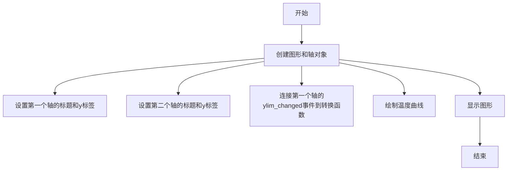
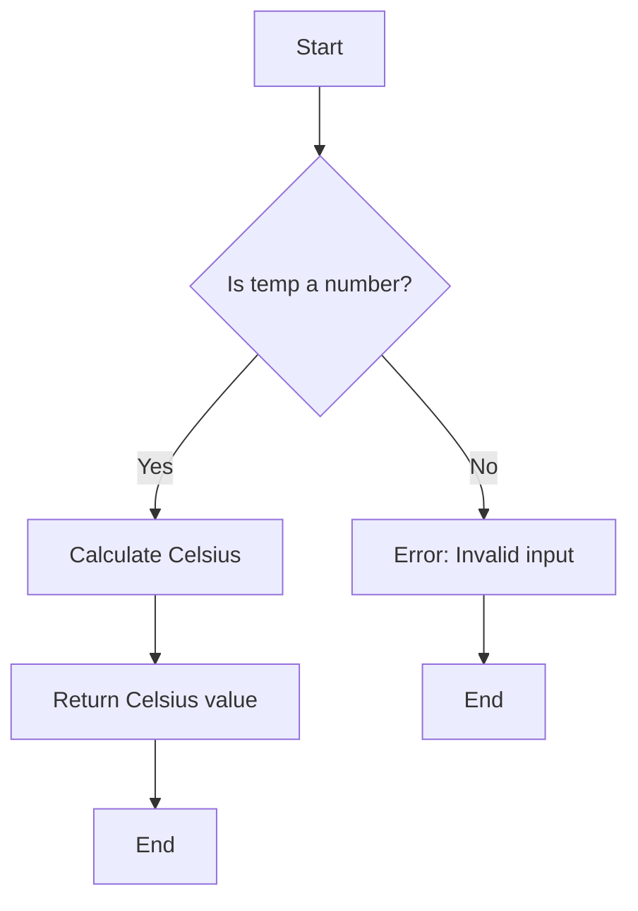
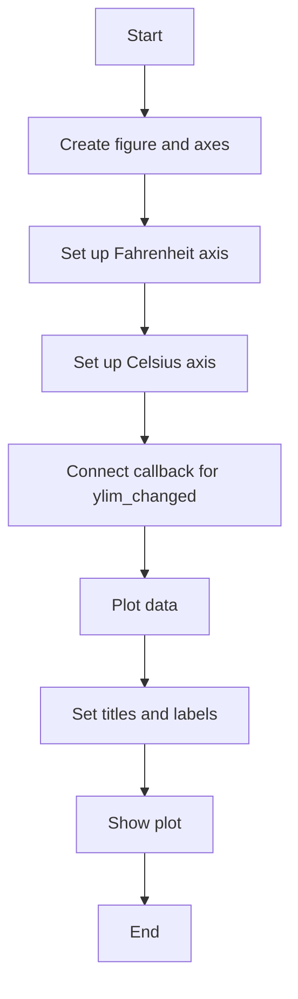
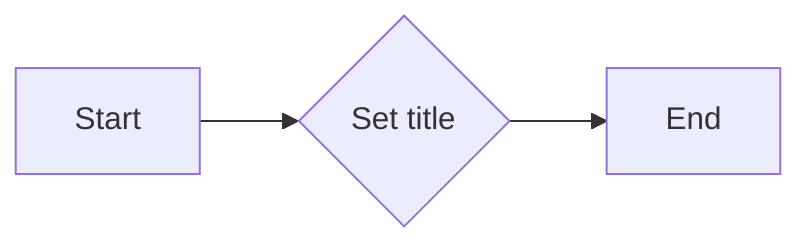
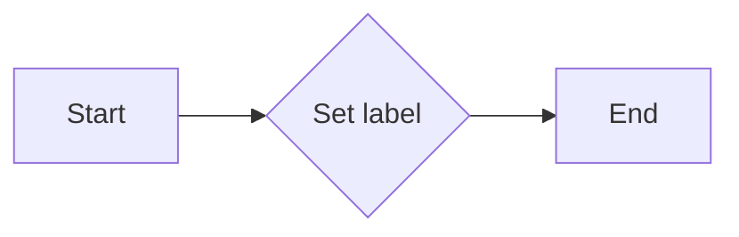
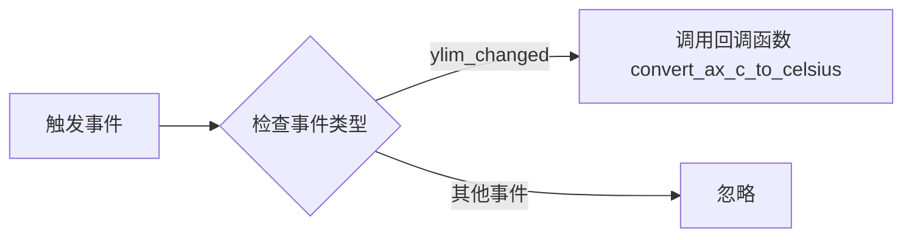

# `matplotlib\galleries\examples\subplots_axes_and_figures\fahrenheit_celsius_scales.py` 详细设计文档

This code generates a plot with two y-axes, one displaying Fahrenheit temperatures and the other displaying Celsius temperatures, demonstrating how to use twin x-axes in matplotlib.

## 整体流程



## 类结构

```
matplotlib.pyplot (matplotlib模块)
├── fahrenheit2celsius (函数)
│   ├── temp (float): 华氏温度
│   └── 返回摄氏温度
└── make_plot (函数)
    ├── fig (matplotlib.figure.Figure): 图形对象
    ├── ax_f (matplotlib.axes.Axes): 第一个轴对象
    ├── ax_c (matplotlib.axes.Axes): 第二个轴对象
    ├── convert_ax_c_to_celsius (函数): 转换函数
    └── temp (numpy.ndarray): 温度数组
```

## 全局变量及字段


### `temp`
    
Temperature value in Fahrenheit.

类型：`float`
    


### `matplotlib.pyplot.fig`
    
The main figure object created by matplotlib.

类型：`matplotlib.figure.Figure`
    


### `matplotlib.pyplot.ax_f`
    
The first axis object for Fahrenheit scale.

类型：`matplotlib.axes._subplots.AxesSubplot`
    


### `matplotlib.pyplot.ax_c`
    
The second axis object for Celsius scale.

类型：`matplotlib.axes._subplots.AxesSubplot`
    


### `matplotlib.pyplot.convert_ax_c_to_celsius`
    
Closure function to update Celsius axis when Fahrenheit axis changes.

类型：`function`
    


### `matplotlib.pyplot.temp`
    
Temperature value in Fahrenheit, same as 'temp' variable.

类型：`float`
    


### `matplotlib.pyplot.temp`
    
Temperature value in Fahrenheit.

类型：`float`
    


### `matplotlib.pyplot.fig`
    
The main figure object created by matplotlib.

类型：`matplotlib.figure.Figure`
    


### `matplotlib.pyplot.ax_f`
    
The first axis object for Fahrenheit scale.

类型：`matplotlib.axes._subplots.AxesSubplot`
    


### `matplotlib.pyplot.ax_c`
    
The second axis object for Celsius scale.

类型：`matplotlib.axes._subplots.AxesSubplot`
    


### `matplotlib.pyplot.convert_ax_c_to_celsius`
    
Closure function to update Celsius axis when Fahrenheit axis changes.

类型：`function`
    


### `matplotlib.pyplot.temp`
    
Temperature value in Fahrenheit, same as 'temp' variable.

类型：`float`
    
    

## 全局函数及方法


### fahrenheit2celsius

Converts a temperature from Fahrenheit to Celsius.

参数：

- `temp`：`float`，The temperature in Fahrenheit to be converted to Celsius.

返回值：`float`，The temperature in Celsius.

#### 流程图



#### 带注释源码

```python
def fahrenheit2celsius(temp):
    """
    Returns temperature in Celsius given Fahrenheit temperature.
    """
    return (5. / 9.) * (temp - 32)
```


### make_plot()

This function creates a plot with two y-axes, one displaying Fahrenheit temperatures and the other displaying Celsius temperatures. It uses a callback to update the Celsius scale when the Fahrenheit scale's limits change.

参数：

- 无

返回值：`None`，This function does not return any value; it only displays the plot.

#### 流程图



#### 带注释源码

```python
def make_plot():
    # Define a closure function to register as a callback
    def convert_ax_c_to_celsius(ax_f):
        """
        Update second axis according to first axis.
        """
        y1, y2 = ax_f.get_ylim()
        ax_c.set_ylim(fahrenheit2celsius(y1), fahrenheit2celsius(y2))
        ax_c.figure.canvas.draw()

    fig, ax_f = plt.subplots()
    ax_c = ax_f.twinx()

    # automatically update ylim of ax2 when ylim of ax1 changes.
    ax_f.callbacks.connect("ylim_changed", convert_ax_c_to_celsius)
    ax_f.plot(np.linspace(-40, 120, 100))
    ax_f.set_xlim(0, 100)

    ax_f.set_title('Two scales: Fahrenheit and Celsius')
    ax_f.set_ylabel('Fahrenheit')
    ax_c.set_ylabel('Celsius')

    plt.show()
```


### `plt.subplots`

`matplotlib.pyplot.subplots` 是一个用于创建一个包含一个或多个子图的图形窗口的函数。

参数：

- `figsize`：`tuple`，指定图形窗口的宽度和高度（单位为英寸）。
- `ncols`：`int`，指定子图的列数。
- `nrows`：`int`，指定子图的行数。
- `sharex`：`bool`，指定是否共享所有子图的x轴。
- `sharey`：`bool`，指定是否共享所有子图的y轴。
- `fig`：`matplotlib.figure.Figure`，如果提供，则使用该图形窗口。
- `gridspec_kw`：`dict`，用于指定GridSpec的参数。
- `constrained_layout`：`bool`，指定是否启用约束布局。

返回值：`matplotlib.figure.Figure`，包含子图的图形窗口。

#### 流程图


#### 带注释源码

```python
import matplotlib.pyplot as plt

fig, ax = plt.subplots()
```


### matplotlib.pyplot.set_title

matplotlib.pyplot.set_title 是一个用于设置图表标题的函数。

参数：

- `title`：`str`，要设置的标题文本。

返回值：`None`，没有返回值。

#### 流程图



#### 带注释源码

```python
# 假设以下代码块是 make_plot 函数的一部分
ax_f.set_title('Two scales: Fahrenheit and Celsius')
```

在这段代码中，`set_title` 方法被调用来设置 `ax_f`（Fahrenheit 轴的轴对象）的标题为 `'Two scales: Fahrenheit and Celsius'`。


### matplotlib.pyplot.set_ylabel

matplotlib.pyplot.set_ylabel 是一个用于设置轴标签的函数。

参数：

- `label`：`str`，轴标签的文本内容。

返回值：`None`，没有返回值。

#### 流程图



#### 带注释源码

```python
# 假设 ax_f 是一个轴对象，并且已经创建
ax_f.set_ylabel('Fahrenheit')
```

在这个例子中，`set_ylabel` 被调用来设置 Fahrenheit 标签：

```python
ax_f.set_ylabel('Fahrenheit')
```

这个调用将 Fahrenheit 作为标签文本设置在轴 ax_f 上。


### matplotlib.pyplot.plot

matplotlib.pyplot.plot 是一个用于绘制二维线图的函数。

参数：

- `np.linspace(-40, 120, 100)`：`numpy.ndarray`，生成一个从 -40 到 120 的等差数列，包含 100 个元素，用于 x 轴的数据点。
- ...

返回值：`matplotlib.lines.Line2D`，返回一个 Line2D 对象，表示绘制的线。

#### 流程图


#### 带注释源码

```python
ax_f.plot(np.linspace(-40, 120, 100))
```

在这行代码中，`np.linspace(-40, 120, 100)` 生成一个从 -40 到 120 的等差数列，包含 100 个元素，作为 x 轴的数据点。`ax_f.plot()` 使用这些数据点绘制一条线。


### plt.show()

显示matplotlib图形。

参数：

- 无

返回值：无

#### 流程图

```mermaid
graph LR
A[开始] --> B{调用plt.show()}
B --> C[结束]
```

#### 带注释源码

```python
plt.show()
```


### matplotlib.pyplot.callbacks.connect

该函数用于连接一个回调函数到matplotlib轴对象的特定事件。

参数：

- `event`: `str`，指定触发回调的事件类型。
- `func`: `callable`，当指定事件发生时将被调用的函数。

返回值：`None`，该函数不返回任何值。

#### 流程图



#### 带注释源码

```python
# 连接回调函数到 ax_f 的 ylim_changed 事件
ax_f.callbacks.connect("ylim_changed", convert_ax_c_to_celsius)
```


## 关键组件


### 张量索引与惰性加载

张量索引与惰性加载允许在数据量较大时，只对需要的数据进行操作，从而提高效率。

### 反量化支持

反量化支持使得代码能够处理不同量级的数值，增强了代码的通用性和灵活性。

### 量化策略

量化策略决定了如何将浮点数转换为固定点数，以适应硬件加速的需求。


## 问题及建议


### 已知问题

-   {问题1: 代码中使用了全局变量 `ax_f` 和 `ax_c`，这些变量在 `convert_ax_c_to_celsius` 函数中直接被修改，这可能导致代码的可读性和可维护性降低，尤其是在更大的项目中。}
-   {问题2: `convert_ax_c_to_celsius` 函数中的 `ax_c.set_ylim()` 调用可能会在 `ax_c` 的 `ylim` 未定义的情况下引发错误，应该添加相应的检查。}
-   {问题3: 代码中使用了 `plt.subplots()` 和 `ax_f.plot()`，但没有对异常情况进行处理，例如当 `plt` 或 `numpy` 库不可用或发生错误时。}
-   {问题4: 代码没有提供任何形式的日志记录或错误消息，这可能会在调试过程中造成困难。}

### 优化建议

-   {建议1: 将 `ax_f` 和 `ax_c` 作为参数传递给 `convert_ax_c_to_celsius` 函数，而不是在全局作用域中直接引用它们，以提高代码的可读性和可维护性。}
-   {建议2: 在 `convert_ax_c_to_celsius` 函数中添加对 `ax_c.get_ylim()` 返回值的检查，确保在调用 `set_ylim()` 之前 `ylim` 已定义。}
-   {建议3: 添加异常处理，确保在 `plt.subplots()` 和 `ax_f.plot()` 调用失败时能够优雅地处理错误。}
-   {建议4: 引入日志记录，以便在出现问题时提供更多的上下文信息，有助于调试和问题解决。}
-   {建议5: 考虑使用面向对象的方法来封装绘图逻辑，这样可以更好地组织代码，并可能提高代码的重用性。}
-   {建议6: 如果这个代码片段是更大项目的一部分，考虑使用配置文件来定义温度转换函数，以便于维护和更新。}


## 其它


### 设计目标与约束

- 设计目标：实现一个能够同时显示两种不同温度尺度（华氏度和摄氏度）的图表。
- 约束条件：使用matplotlib库进行绘图，确保代码简洁且易于理解。

### 错误处理与异常设计

- 错误处理：在函数`fahrenheit2celsius`中，如果输入的温度值不是数字类型，将抛出`TypeError`。
- 异常设计：未使用try-except块来捕获和处理异常，因为函数的输入类型和范围是明确的。

### 数据流与状态机

- 数据流：用户输入华氏度温度，通过`fahrenheit2celsius`函数转换为摄氏度，然后在图表中显示。
- 状态机：没有使用状态机，因为代码流程是线性的，没有状态转换。

### 外部依赖与接口契约

- 外部依赖：依赖于matplotlib库进行绘图。
- 接口契约：`fahrenheit2celsius`函数提供了一个清晰的接口，将华氏度转换为摄氏度。


    