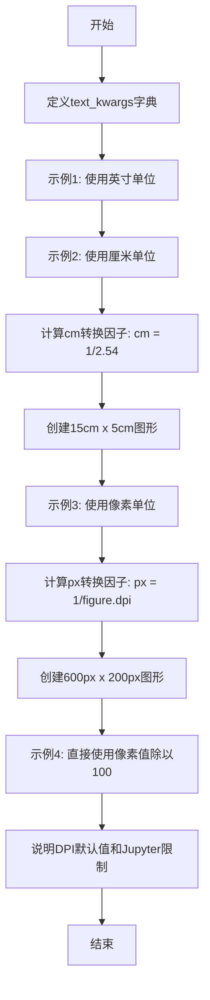
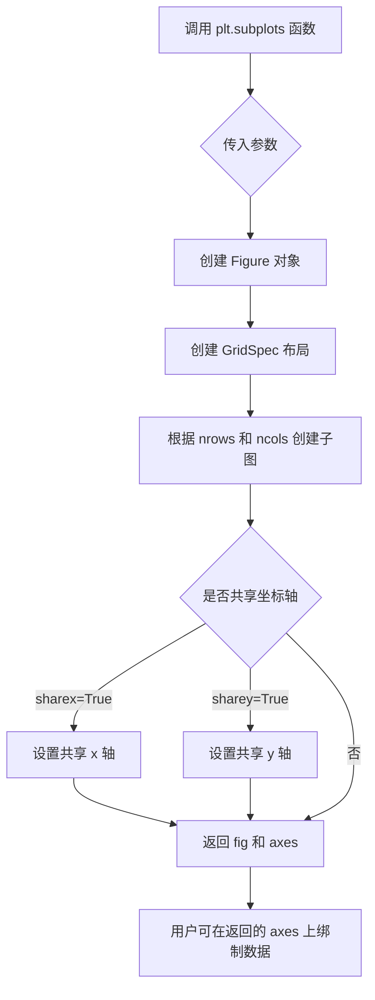
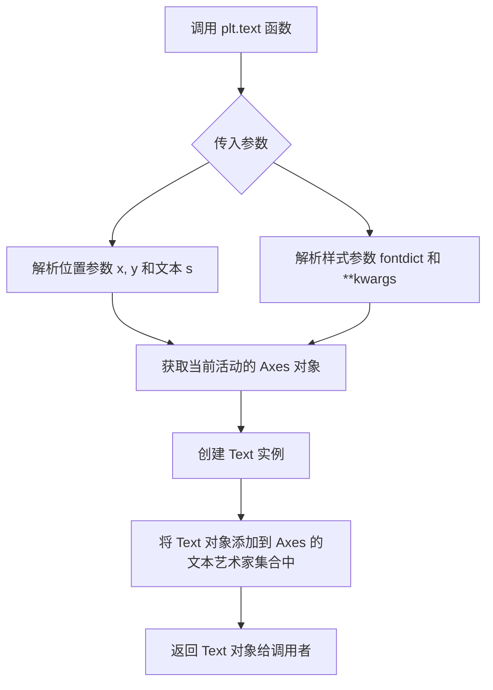

# `matplotlib\galleries\examples\subplots_axes_and_figures\figure_size_units.py` 详细设计文档

这是一个Matplotlib示例脚本，演示了如何以不同单位（英寸、厘米、像素）设置图形大小，帮助用户在打印和屏幕显示场景中灵活配置Figure尺寸。

## 整体流程



## 类结构

```
无类层次结构（脚本式代码）
└── 全局变量和函数
```

## 全局变量及字段


### `text_kwargs`
    
存储文本对齐、字体大小和颜色的字典参数

类型：`dict`
    


### `cm`
    
厘米到英寸的转换因子 (1/2.54)

类型：`float`
    


### `px`
    
像素到英寸的转换因子 (1/figure.dpi)

类型：`float`
    


    

## 全局函数及方法


### `plt.subplots()`

`plt.subplots()` 是 Matplotlib 库中用于创建一个新的图形窗口和一个或多个子图的函数。该函数是 `matplotlib.pyplot` 模块中最常用的函数之一，它结合了 `figure()` 和 `add_subplot()` 的功能，可以一次性创建包含多个子图的图形布局，并返回图形对象和轴对象（Axes）。

参数：

- `nrows`：`int`，默认值：1，表示子图的行数
- `ncols`：`int`，默认值：1，表示子图的列数
- `sharex`：`bool` 或 `{'row', 'col', 'all', 'none'}`，默认值：False，控制是否共享 x 轴
- `sharey`：`bool` 或 `{'row', 'col', 'all', 'none'}`，默认值：False，控制是否共享 y 轴
- `squeeze`：`bool`，默认值：True，是否压缩返回的轴数组维度
- `width_ratios`：`array-like`，可选，表示子图行宽的比例
- `height_ratios`：`array-like`，可选，表示子图列高的比例
- `subplot_kw`：`dict`，可选，传递给每个子图的关键字参数
- `gridspec_kw`：`dict`，可选，传递给 GridSpec 构造函数的关键字参数
- `**fig_kw`：额外关键字参数，传递给 `figure()` 函数（如 `figsize`、`dpi` 等）

返回值：`tuple(Figure, Axes or array of Axes)`，返回图形对象和轴对象（或轴对象数组）

#### 流程图



#### 带注释源码

```python
import matplotlib.pyplot as plt

# 定义文本渲染的关键字参数
text_kwargs = dict(ha='center', va='center', fontsize=28, color='C1')

# 示例1：使用默认单位（英寸）创建子图
# figsize 参数以英寸为单位，创建一个 6x2 英寸的图形
fig1, ax1 = plt.subplots(figsize=(6, 2))
plt.text(0.5, 0.5, '6 inches x 2 inches', **text_kwargs)
plt.show()

# 示例2：使用厘米单位创建子图
# 定义厘米到英寸的转换因子（1英寸 = 2.54厘米）
cm = 1/2.54
# 将厘米尺寸转换为英寸：15cm x 5cm
fig2, ax2 = plt.subplots(figsize=(15*cm, 5*cm))
plt.text(0.5, 0.5, '15cm x 5cm', **text_kwargs)
plt.show()

# 示例3：使用像素单位创建子图
# 通过 figure.dpi 获取每英寸的像素数，计算像素到英寸的转换因子
px = 1/plt.rcParams['figure.dpi']
# 将像素尺寸转换为英寸：600px x 200px
fig3, ax3 = plt.subplots(figsize=(600*px, 200*px))
plt.text(0.5, 0.5, '600px x 200px', **text_kwargs)
plt.show()

# 示例4：利用默认 DPI=100 进行快速像素换算
# 默认 figure.dpi = 100，所以直接除以 100 即可得到英寸数
fig4, ax4 = plt.subplots(figsize=(6, 2))  # 6*100=600px, 2*100=200px
plt.text(0.5, 0.5, '600px x 200px', **text_kwargs)
plt.show()
```


### `plt.text`

在Matplotlib中，`plt.text()`函数用于在当前的图表（Figure）或子图（Axes）上的指定位置添加文本标签。该函数是`matplotlib.pyplot`模块的顶层接口，内部调用了`Axes.text()`方法。

参数：

- `x`：`float`，文本的x坐标（相对于axes的坐标系，通常在0到1之间）
- `y`：`float`，文本的y坐标（相对于axes的坐标系，通常在0到1之间）
- `s`：`str`，要显示的文本内容字符串
- `fontdict`：`dict`，可选，用于覆盖默认文本属性的字典，默认为None
- `**kwargs`：可变关键字参数，接受所有`matplotlib.text.Text`对象的属性，如`fontsize`、`color`、`ha`（水平对齐）、`va`（垂直对齐）等

返回值：`matplotlib.text.Text`，返回创建的Text对象，可以用于后续对文本进行进一步操作（如修改样式、位置等）

#### 流程图



#### 带注释源码

```python
# 导入matplotlib.pyplot模块
import matplotlib.pyplot as plt

# 定义文本样式关键字参数字典
text_kwargs = dict(ha='center', va='center', fontsize=28, color='C1')

# 创建子图，返回fig和ax对象
# figsize=(6, 2) 表示图形大小为6英寸宽、2英寸高
fig, ax = plt.subplots(figsize=(6, 2))

# 调用plt.text在指定位置添加文本
# 参数说明：
#   0.5: x坐标，位于图形宽度的50%位置（中心）
#   0.5: y坐标，位于图形高度的50%位置（中心）
#   '6 inches x 2 inches': 要显示的文本内容
#   **text_kwargs: 展开之前定义的样式字典，等价于ha='center', va='center', fontsize=28, color='C1'
# 返回值：text_obj是matplotlib.text.Text类型的对象
text_obj = plt.text(0.5, 0.5, '6 inches x 2 inches', **text_kwargs)

# 显示图形
plt.show()

# 后续可以通过text_obj进行操作，例如：
# text_obj.set_fontsize(20)  # 修改字体大小
# text_obj.set_color('red')  # 修改颜色
# text_obj.set_position((0.3, 0.7))  # 修改位置
```


### `plt.show()`

`plt.show()` 是 Matplotlib 库中的核心函数，用于将所有当前打开的图形窗口显示到屏幕上，是可视化工作的最终展示步骤。

参数：

- 无参数

返回值：`None`，无返回值

#### 流程图

```mermaid
flowchart TD
    A[调用 plt.show()] --> B{存在打开的图形窗口?}
    B -->|是| C[渲染图形到默认后端]
    C --> D[打开显示窗口/输出到屏幕]
    D --> E[等待用户交互或自动关闭]
    B -->|否| F[不执行任何操作]
    E --> G[函数返回]
    F --> G
```

#### 带注释源码

```python
# matplotlib.pyplot 模块中的 show() 函数
# 位置: lib/matplotlib/pyplot.py

def show(*, block=None):
    """
    显示所有打开的图形窗口。
    
    Parameters
    ----------
    block : bool, optional
        控制是否阻塞程序执行。
        - True: 阻塞等待窗口关闭
        - False: 非阻塞模式
        - None: 使用后端的默认行为 (默认)
    
    Returns
    -------
    None
    """
    # 获取当前活动的图形管理器
    # _pylab_helpers 模块管理所有打开的图形窗口
    for manager in Gcf.get_all_fig_managers():
        # 调用后端的 show 方法渲染图形
        # 后端可能是 Qt, Tk, GTK, WebAgg 等
        manager.show()
        
        # 如果 block 为 True 或 None 且后端需要阻塞
        if block:
            # 阻塞主线程，等待用户交互
            manager._fig_show_block()
```

#### 关键组件信息

| 组件名称 | 一句话描述 |
|---------|-----------|
| `matplotlib.pyplot` | 提供 MATLAB 风格的绘图接口 |
| `Gcf.get_all_fig_managers()` | 获取所有活跃的图形管理器 |
| `FigureCanvasBase.show()` | 实际渲染和显示图形的底层方法 |
| 后端系统 | Matplotlib 支持多种渲染后端 (Qt, Tk, GTK, Agg 等) |

#### 潜在技术债务或优化空间

1. **平台依赖性**：不同操作系统的图形后端行为可能不一致，block 参数在某些后端上可能无效
2. **阻塞行为不明确**：block 参数的默认行为 (None) 在不同后端和环境下表现不同，可能导致跨平台问题
3. **错误处理不足**：当没有图形可显示或后端初始化失败时，错误信息不够友好

#### 其它项目

**设计目标与约束**：
- 目标是提供统一的跨平台图形显示接口
- 约束是必须依赖已配置的后端系统

**错误处理与异常设计**：
- 如果没有可用后端，抛出 `RuntimeError: No backend name specified and no default backend found`
- 如果图形管理器为空，则静默返回，不抛出异常

**数据流与状态机**：
```
状态: 无图形 → 创建图形 → 渲染图形 → 显示图形 → (阻塞等待/立即返回)
```

**外部依赖与接口契约**：
- 依赖 `matplotlib.backends` 模块
- 依赖图形后端 (通过 `matplotlib.rcParams['backend']` 配置)
- 契约：调用 show() 后，原有的图形对象仍然可访问和修改


## 关键组件


### 图形尺寸单位转换 (cm)

厘米到英寸的转换因子，用于将厘米单位的图形尺寸转换为英寸

### 图形尺寸单位转换 (px)

像素到英寸的转换因子，基于当前 figure.dpi 设置进行转换

### 图形创建 (plt.subplots)

创建带有所需尺寸的图形窗口，支持不同单位的尺寸输入

### 文本渲染 (plt.text_kwargs)

预定义的文本渲染参数，包含对齐方式和字体样式配置

### 图形显示 (plt.show)

渲染并显示创建的图形到屏幕

### DPI配置访问 (plt.rcParams['figure.dpi'])

获取当前图形的DPI设置，用于像素到英寸的换算


## 问题及建议


### 已知问题

-   **硬编码的转换因子**：厘米到英寸的转换因子 `1/2.54` 和像素转换因子 `1/plt.rcParams['figure.dpi']` 被直接写在代码中，没有封装成可重用的工具函数，导致重复计算和潜在的复制粘贴错误。
-   **重复代码模式**：创建子图、添加文本、显示图表的模式在代码中重复了四次，违反了 DRY（Don't Repeat Yourself）原则，增加了维护成本。
-   **Magic Numbers 散布**：`6`, `2`, `15`, `5`, `600`, `200` 等数值散布在代码中，缺乏有意义的命名常量，降低了代码可读性和可维护性。
-   **紧耦合设计**：代码直接依赖 `matplotlib.pyplot` 全局状态，缺乏抽象，单元测试困难，且可能受到其他代码修改 `rcParams` 的影响。
-   **缺少错误处理**：没有对无效参数（如负数尺寸、零 DPI 等）进行验证，可能导致运行时错误或难以调试的行为。
-   **注释与代码耦合**：文档注释中的数值（15cm x 5cm, 600px x 200px）与实际代码中的数值需要手动保持同步，容易出现不一致。
-   **全局状态依赖**：直接读取和修改 `plt.rcParams['figure.dpi']`，可能在复杂应用中对其他图表产生意外的副作用。

### 优化建议

-   **封装单位转换工具**：创建专门的工具函数或类来处理单位转换，例如 `def cm_to_inch(cm): return cm / 2.54` 和 `def px_to_inch(px, dpi): return px / dpi`。
-   **提取公共函数**：将创建图形、添加文本的重复模式封装成函数，如 `create_figure_with_text(fig_size, text, **kwargs)`。
-   **定义常量或配置**：将图形尺寸定义为命名常量或配置字典，提高可读性和可维护性。
-   **引入参数验证**：在函数入口添加参数验证，检查尺寸为正数、DPI 大于零等。
-   **使用面向对象方式**：考虑使用 `matplotlib.figure.Figure` 类的面向对象接口，减少对全局状态的依赖。
-   **添加类型注解**：为函数参数和返回值添加类型注解，提高代码可读性和 IDE 支持。
-   **文档自动化**：如果可能，使用代码生成文档而非手动维护注释中的数值。
-   **提供上下文管理器**：在修改全局设置时使用上下文管理器确保状态恢复。


## 其它


### 设计目标与约束

本代码示例旨在演示Matplotlib中图形尺寸的灵活设置方式，帮助用户在不同单位（英寸、厘米、像素）间进行转换。约束条件包括：依赖matplotlib默认的figure.dpi=100设置；使用plt.rcParams['figure.dpi']获取当前DPI值；在Jupyter inline后端下使用bbox_inches='tight'会导致实际尺寸不可预测。

### 错误处理与异常设计

代码本身较为简单，主要依赖matplotlib的异常机制。潜在错误包括：若plt.rcParams['figure.dpi']未定义或返回None会导致px计算错误；figure.dpi为0或负数时会导致除零错误；图形尺寸为负数时 matplotlib 会抛出 ValueError。建议在实际应用中增加 DPI 值的校验。

### 数据流与状态机

数据流：用户输入尺寸数值 → 乘以转换系数(cm或px) → 转换为英寸 → 传入 plt.subplots(figsize=) → matplotlib 创建 Figure 对象 → 显示或保存。状态机涉及：图形创建状态(show()前) → 显示状态(show()后) → 关闭状态(close()后)。

### 外部依赖与接口契约

主要依赖：matplotlib.pyplot 模块（plt.subplots, plt.text, plt.show, plt.rcParams）；matplotlib.figure.Figure 对象（间接使用）。接口契约：plt.subplots 返回 (fig, ax) 元组；plt.rcParams['figure.dpi'] 返回浮点数；plt.text 返回 Text 对象。

### 性能考虑

代码本身性能开销极低，主要计算为简单的浮点运算。px = 1/plt.rcParams['figure.dpi'] 在每次调用时都会读取 rcParams，存在轻微的重复计算开销，可缓存 DPI 值以优化频繁调用场景。

### 安全性考虑

本示例代码无用户输入、无文件操作、无网络请求，安全性风险较低。潜在风险：若通过外部输入控制 figsize 参数，需对数值进行范围校验防止内存溢出或负值导致的异常行为。

### 使用场景

典型使用场景包括：学术论文中需要按厘米或毫米指定图形尺寸；Web 应用中需要按像素指定图形尺寸；打印输出时需要将像素单位转换为物理尺寸；Jupyter Notebook 中的交互式可视化。

### 配置说明

关键配置项：plt.rcParams['figure.dpi'] - 图形 DPI 默认值（100）；plt.rcParams['figure.figsize'] - 默认图形尺寸；plt.rcParams['figure.facecolor'] - 图形背景色；plt.rcParams['savefig.dpi'] - 保存图形时的 DPI。

### 测试策略

测试方法：验证不同单位转换的准确性（如 15cm 应等于 5.91 英寸）；验证不同 DPI 设置下的像素转换；验证负值或零值输入的错误处理；验证与不同 matplotlib 后端的兼容性。

### 版本兼容性

代码使用标准的 matplotlib API，兼容 matplotlib 1.5+ 版本。plt.rcParams 字典式访问在 matplotlib 2.0+ 中更加稳定。Text 对象的 **kwargs 语法需要 matplotlib 1.3+。建议使用 matplotlib 3.x 以获得最佳兼容性。

    