# `matplotlib\galleries\examples\subplots_axes_and_figures\figure_title.py` 详细设计文档

本代码演示了matplotlib中Figure级别的标签功能，包括使用suptitle设置总标题、supxlabel设置全局x轴标签、supylabel设置全局y轴标签，以及通过layout='constrained'和sharex/sharey参数实现子图布局控制。

## 整体流程

```mermaid
graph TD
    A[开始] --> B[导入matplotlib.pyplot和numpy]
B --> C[创建x轴数据.linspace(0, 5, 501)]
C --> D[创建1x2子图布局ax1, ax2]
D --> E[绘制两个子图的cos曲线]
E --> F[调用fig.suptitle设置总标题]
F --> G[加载Stocks.csv数据]
G --> H[创建4x2子图网格]
H --> I[遍历绘制8只股票数据]
I --> J[调用fig.supxlabel设置全局x标签]
J --> K[调用fig.supylabel设置全局y标签]
K --> L[plt.show显示图表]
```

## 类结构

```
Python脚本 (无自定义类)
├── 全局变量区域
│   └── x: numpy.ndarray (0-5的等间距数组)
├── 导入模块
│   ├── matplotlib.pyplot
│   ├── numpy
│   └── matplotlib.cbook.get_sample_data
```

## 全局变量及字段


### `x`
    
用于绘图的时间/数值序列数据

类型：`numpy.ndarray`
    


### `stocks`
    
从CSV加载的股票数据

类型：`numpy.ndarray`
    


### `fig`
    
matplotlib图形对象

类型：`matplotlib.figure.Figure`
    


### `ax1`
    
第一个子图

类型：`matplotlib.axes.Axes`
    


### `ax2`
    
第二个子图

类型：`matplotlib.axes.Axes`
    


### `axs`
    
4x2子图数组

类型：`numpy.ndarray`
    


### `column_name`
    
股票数据列名

类型：`str`
    


### `y`
    
股票价格数据

类型：`numpy.ndarray`
    


### `line`
    
绘制的线条对象

类型：`matplotlib.lines.Line2D`
    


### `nn`
    
循环计数器

类型：`int`
    


    

## 全局函数及方法


### `plt.subplots`

`plt.subplots` 是 matplotlib 库中用于创建一个图形窗口（Figure）并在其中生成多个子图（Axes）的核心函数。它通过指定行数和列数创建网格布局，并返回图形对象和包含所有子图的数组，支持共享坐标轴、约束布局以及灵活的自定义参数配置。

参数：

- `nrows`：`int`，默认值为 1，子图网格的行数
- `ncols`：`int`，默认值为 1，子图网格的列数
- `sharex`：`bool` 或 `str`，默认值为 False，是否共享 x 轴。当设为 True 时，所有子图共享 x 轴；设为 'row' 时，每行子图共享 x 轴；设为 'col' 时，每列子图共享 x 轴
- `sharey`：`bool` 或 `str`，默认值为 False，是否共享 y 轴。共享方式与 sharex 类似
- `squeeze`：`bool`，默认值为 True，是否压缩返回的轴数组。当为 True 时，如果只返回一个子图则返回单个 Axes 对象而非数组
- `width_ratios`：`array-like`，可选参数，长度为 nrows，定义每行的宽度相对比例
- `height_ratios`：`array-like`，可选参数，长度为 ncols，定义每列的高度相对比例
- `subplot_kw`：`dict`，可选参数，传递给每个子图创建函数（如 add_subplot）的关键字参数
- `gridspec_kw`：`dict`，可选参数，传递给 GridSpec 构造函数的关键字参数，如 `layout='constrained'` 用于约束布局
- `**fig_kw`：额外关键字参数，传递给 Figure 构造函数的其他参数，如 figsize、dpi 等

返回值：`tuple(Figure, Axes or array of Axes)`，返回图形对象和子图对象。当 nrows 或 ncols 大于 1 时，返回一个 numpy Axes 数组；否则根据 squeeze 参数返回单个 Axes 对象或数组

#### 流程图

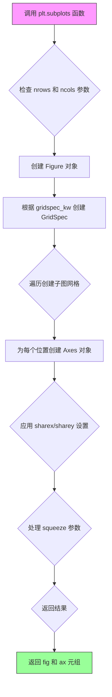

#### 带注释源码

```python
def subplots(nrows=1, ncols=1, *, sharex=False, sharey=False, squeeze=True,
             width_ratios=None, height_ratios=None,
             subplot_kw=None, gridspec_kw=None, **fig_kw):
    """
    创建一个包含子图网格的图形。
    
    参数
    ----------
    nrows : int, default 1
        子图网格的行数
    ncols : int, default 1
        子图网格的列数
    sharex : bool or str, default False
        如果为 True，所有子图共享 x 轴
        'row': 每行共享 x 轴
        'col': 每列共享 x 轴
    sharey : bool or str, default False
        如果为 True，所有子图共享 y 轴
        'row': 每行共享 y 轴
        'col': 每列共享 y 轴
    squeeze : bool, default True
        如果为 True，返回单例数组时进行压缩
    width_ratios : array-like of length ncols, optional
        定义列的相对宽度
    height_ratios : array-like of length nrows, optional
        定义行的相对高度
    subplot_kw : dict, optional
        传递给 add_subplot 的关键字参数
    gridspec_kw : dict, optional
        传递给 GridSpec 的关键字参数
    **fig_kw
        传递给 Figure 的关键字参数
    
    返回
    -------
    fig : Figure 对象
    ax : Axes 或 Axes 数组
    """
    # 1. 创建 Figure 对象，传入 fig_kw 参数如 figsize, dpi 等
    fig = figure(**fig_kw)
    
    # 2. 创建 GridSpec 对象，用于定义子图网格结构
    gs = GridSpec(nrows, ncols, width_ratios=width_ratios,
                  height_ratios=height_ratios, **gridspec_kw)
    
    # 3. 创建子图数组
    axs = [[add_subplot(gs[i, j], **subplot_kw) for j in range(ncols)]
           for i in range(nrows)]
    
    # 4. 处理 sharex 共享设置
    if sharex == 'col':
        for j in range(ncols):
            for i in range(nrows - 1):
                axs[i+1][j].sharex(axs[i][j])
    elif sharex == 'row':
        for i in range(nrows):
            for j in range(ncols - 1):
                axs[i][j+1].sharex(axs[i][j])
    elif sharex:
        for ax in axs.flat:
            ax.sharex(axs[0][0])
    
    # 5. 处理 sharey 共享设置（逻辑类似 sharex）
    # ... (sharey 处理代码)
    
    # 6. 处理 squeeze 参数
    if squeeze:
        axs = np.squeeze(axs)
    
    # 7. 返回 fig 和 ax(s) 元组
    return fig, axs
```


### `matplotlib.axes.Axes.plot`

绘制 y 相对于 x 的线条和/或标记。该方法是 matplotlib 中最常用的绘图函数之一，支持多种调用方式，能够根据输入数据自动处理坐标，并返回包含所有绘制的线条对象的列表。

参数：

- `x`：`array-like or scalar`，x 轴坐标数据，可选参数，默认为 `range(len(y))`
- `y`：`array-like or scalar`，y 轴坐标数据，必填参数
- `fmt`：`str`，可选，格式字符串（例如 'bo' 表示蓝色圆圈）
- `**kwargs`：其他关键字参数，用于传递给 `Line2D` 构造函数（如 `linewidth`、`color`、`marker` 等）

返回值：`list of matplotlib.lines.Line2D`，返回包含所有绘制的线条对象的列表

#### 流程图

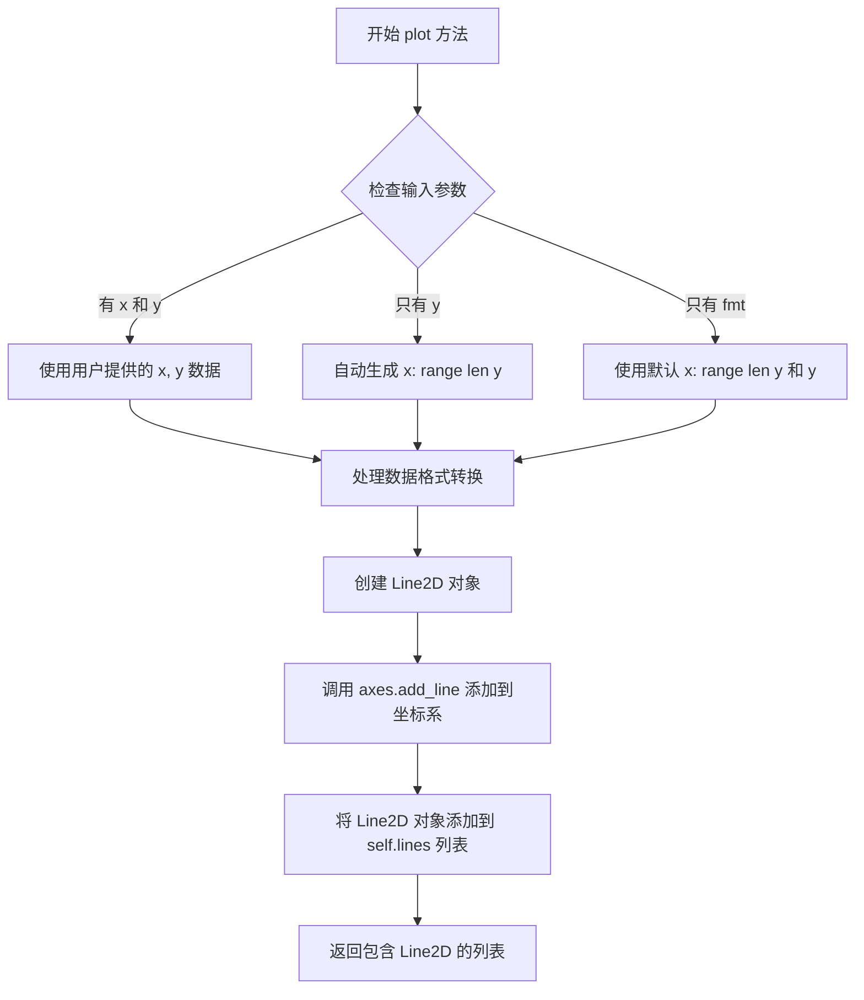

#### 带注释源码

```python
def plot(self, *args, **kwargs):
    """
    Plot y versus x as lines and/or markers.

    Call signatures::

        plot(x, y)        # plot x and y using default line style and color
        plot(x, y, 'bo')  # plot x and y using blue circle markers
        plot(y)           # plot y using x as index array 0..N-1
        plot(y, 'r+')     # plot y using '+' line style

    Parameters
    ----------
    x, y : array-like or scalar
        The horizontal / vertical coordinates of the data points.
        *x* values are optional and default to ``range(len(y))``.
        If both *x* and *y* are missing, *y* is used, and *x* will be generated
        using the ``range(len(y))`` function.

    fmt : str, optional
        A format string, e.g. 'ro' for red circles. See `Plotting guide`
        for more information.

    **kwargs : `~matplotlib.lines.Line2D` properties, optional
        Keyword arguments are passed to the `~matplotlib.lines.Line2D`
        constructor, which defines the properties of the line.

    Returns
    -------
    lines : list of `~matplotlib.lines.Line2D`
        List of lines representing the plotted data.

    Other Parameters
    ----------------
    scalex, scaley : bool, default: True
        If ``False``, the respective axis limits are preserved.

    Notes
    -----
    .. [1] Additional keywords arguments are passed to the
        `matplotlib.axes.Axes.errorbar` function

    Examples
    --------
    ::

        >>> import matplotlib.pyplot as plt
        >>> plt.rcParams['lines.linewidth'] = 3
        >>> plt.plot([1, 2, 3], [1, 2, 3], 'r', label='linear')
        >>> plt.plot([1, 2, 3], [3, 2, 1], 'g', label='inverse')
        >>> plt.legend()
        >>> plt.show()
    """
    # 获取 Axes 对象的测试工具（用于测试目的）
    self._axobservers.process("_axes_change_event", self)
    # 解析参数，返回 Line2D 对象列表
    # 这个方法会处理各种不同形式的输入参数
    lines = [*self._plot_args(*args, **kwargs)]
    # 遍历每个 Line2D 对象
    for line in lines:
        # 获取当前行标签（如果有）
        label = line.get_label()
        # 如果标签为空或者是临时标签（以 '_' 开头），则设置为 None
        # 这样不会在图例中显示
        if not label or label.startswith('_'):
            line.set_label(None)
        # 将线条添加到 Axes
        self.add_line(line)
    # 更新轴的限制范围
    self.autoscale_view()
    # 返回线条列表
    return lines
```


### `ax.set_title`

设置子图（Axes）的标题，用于在图表的顶部显示文本标签，支持自定义位置、字体大小、字体属性等。

参数：

- `s`：`str`，标题文本内容，要显示的标题字符串
- `loc`：`str`，可选值为 'center', 'left', 'right'，标题在子图水平方向上的对齐位置，默认为 'center'
- `pad`：`float`，标题与子图顶部边缘的距离（以点为单位），用于控制标题与坐标轴的间距
- `fontsize`：`str` 或 `int`，标题字体大小，可使用字符串如 'small', 'large' 或数字如 12
- `fontweight`：`str` 或 `int`，标题字体粗细，如 'normal', 'bold', 'light' 等
- `verticalalignment`：`str`，可选 'top', 'center', 'bottom'，标题垂直对齐方式
- `**kwargs`：其他关键字参数传递给 `matplotlib.text.Text` 对象，用于自定义字体颜色、背景色、旋转角度等

返回值：`matplotlib.text.Text`，返回创建的标题文本对象，可用于后续修改标题样式或位置

#### 流程图

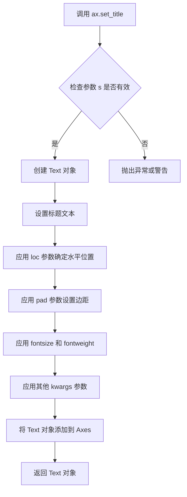

#### 带注释源码

```python
# matplotlib.axes._axes.Axes.set_title 方法的典型实现逻辑

def set_title(self, s, loc=None, pad=None, **kwargs):
    """
    设置 Axes 的标题
    
    参数:
        s: 标题文本
        loc: 标题位置 ('left', 'center', 'right')
        pad: 与顶部的距离
        **kwargs: 传递给 Text 的其他参数
    """
    
    # 1. 获取当前 Axes 的标题属性容器
    title = self._get_title()
    
    # 2. 设置标题文本内容
    title.set_text(s)
    
    # 3. 如果未指定 loc，使用默认的 rcParams['axes.titlelocation']
    if loc is None:
        loc = mpl.rcParams['axes.titlelocation']
    
    # 4. 根据 loc 参数设置对齐方式
    if loc == 'left':
        title.set_ha('left')  # 水平对齐设为左
        title.set_x(0)        # x 位置设为 0
    elif loc == 'right':
        title.set_ha('right') # 水平对齐设为右
        title.set_x(1)        # x 位置设为 1
    else:  # 'center'
        title.set_ha('center') # 水平对齐设为中心
        title.set_x(0.5)       # x 位置设为 0.5
    
    # 5. 设置 pad 参数（标题与 Axes 顶部的距离）
    if pad is None:
        pad = mpl.rcParams['axes.titlepad']
    title.set_y(1 + pad / title.get_size())  # 调整 y 位置
    
    # 6. 应用其他样式参数（fontsize, fontweight, color 等）
    title.update(kwargs)
    
    # 7. 返回 Text 对象以便后续操作
    return title
```

#### 使用示例

```python
import matplotlib.pyplot as plt
import numpy as np

# 创建示例数据
x = np.linspace(0.0, 5.0, 501)

# 创建子图
fig, (ax1, ax2) = plt.subplots(1, 2, layout='constrained', sharey=True)

# 绘制图形
ax1.plot(x, np.cos(6*x) * np.exp(-x))
ax1.set_xlabel('time (s)')
ax1.set_ylabel('amplitude')

ax2.plot(x, np.cos(6*x))
ax2.set_xlabel('time (s)')

# 使用 set_title 设置子图标题
# 示例1：基本用法，设置简单标题
ax1.set_title('damped')

# 示例2：设置标题并指定位置
ax2.set_title('undamped')

# 示例3：在循环中设置带样式的标题
fig, axs = plt.subplots(4, 2, figsize=(9, 5), layout='constrained')
for nn, ax in enumerate(axs.flat):
    column_name = f"Series {nn+1}"
    y = np.random.randn(100)
    ax.plot(y)
    # 设置标题：左侧对齐，小字体
    ax.set_title(column_name, fontsize='small', loc='left')

plt.show()
```


### ax.set_xlabel

设置 Axes 对象的 x 轴标签，用于为图表的 x 轴添加描述性文本标签。

参数：

- `xlabel`：`str`，x 轴标签的文本内容
- `fontdict`：可选的字典，用于控制标签文本的字体属性（如 fontsize、fontweight 等）
- `labelpad`：可选的浮点数，表示标签与 x 轴之间的间距（单位为点）
- `**kwargs`：其他关键字参数，将传递给 matplotlib 的 `Text` 对象，用于自定义文本样式（如 color、rotation、ha、va 等）

返回值：`str` 或 `Text`，返回创建的标签对象（通常是文本标签本身），允许链式调用。

#### 流程图

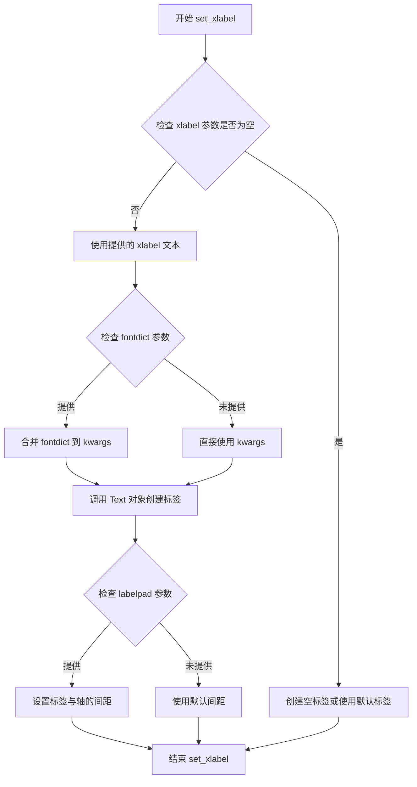

#### 带注释源码

```python
def set_xlabel(self, xlabel, fontdict=None, labelpad=None, **kwargs):
    """
    Set the label for the x-axis.
    
    Parameters
    ----------
    xlabel : str
        The label text.
    fontdict : dict, optional
        A dictionary to control the appearance of the label
        (e.g., {'fontsize': 12, 'fontweight': 'bold'}).
    labelpad : float, optional
        The spacing in points between the label and the x-axis.
    **kwargs
        Additional keyword arguments are passed to the `.Text` instance.
    
    Returns
    -------
    label : `.Text`
        The created text label.
    """
    # 获取 x 轴对象
    axis = self.xaxis
    # 获取或创建标签
    label = axis.get_label()
    
    # 设置标签文本
    label.set_text(xlabel)
    
    # 如果提供了 fontdict，更新标签属性
    if fontdict is not None:
        label.update(fontdict)
    
    # 如果提供了 labelpad，设置标签与轴的间距
    if labelpad is not None:
        axis.set_label_coords(0.5, -labelpad)
    
    # 应用其他关键字参数（如颜色、旋转角度等）
    label.update(kwargs)
    
    # 返回标签对象以支持链式调用
    return label
```


### `Axes.set_ylabel`

`Axes.set_ylabel` 是 matplotlib 库中 Axes 类的方法，用于设置 y 轴的标签（_ylabel），即显示在坐标轴左侧的文本描述。该方法允许用户通过参数自定义标签文本、字体样式、标签与坐标轴之间的间距等，并返回一个 Text 对象供进一步样式设置。

参数：

- `label`：`str`，y轴标签的文本内容，例如 "amplitude"、"Stock price relative to max" 等。
- `fontdict`：`dict`，可选，用于控制标签外观的字体字典，如 {'fontsize': 12, 'fontweight': 'bold'}。
- `labelpad`：`float`，可选，标签与 y 轴之间的间距（磅值），默认为 None（使用 matplotlib 的默认值）。
- `**kwargs`：其他关键字参数，会传递给 matplotlib.text.Text 对象，用于设置颜色、旋转、字体属性等。

返回值：`matplotlib.text.Text`，返回创建的 Text 对象，可用于后续的样式设置或属性修改。

#### 流程图

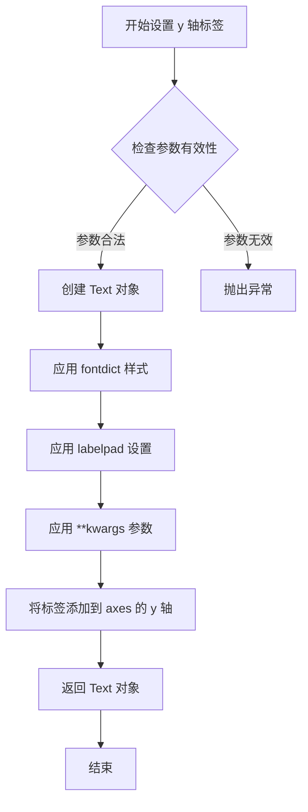

#### 带注释源码

```python
def set_ylabel(self, ylabel, fontdict=None, labelpad=None, **kwargs):
    """
    Set the label for the y-axis.
    
    Parameters
    ----------
    ylabel : str
        The label text.
    fontdict : dict, optional
        A dictionary to control the appearance of the label,
        e.g., {'fontsize': 12, 'fontweight': 'bold', 'color': 'red'}.
    labelpad : float, optional
        The spacing in points between the label and the y-axis.
    **kwargs
        Additional keyword arguments are passed to the `.Text` instance,
        allowing control over text properties like color, rotation, etc.
    
    Returns
    -------
    Text
        The `.Text` instance representing the label.
    """
    # 获取 y 轴对象（YAxis 类实例）
    yaxis = self.yaxis
    
    # 创建文本标签，初始位置设置在 y 轴左侧
    # 'y' 位置表示标签将在 y 轴左侧显示
    label = yaxis.set_label_text(ylabel, fontdict, **kwargs)
    
    # 如果指定了 labelpad，调整标签与轴之间的间距
    if labelpad is not None:
        yaxis.set_label_coords(-labelpad / self.figure.dpi * 72, 0.5)
    
    # 返回创建的 Text 对象，供调用者进一步自定义
    return label
```


### Figure.suptitle

该方法属于 `matplotlib.figure.Figure` 类，用于在整个图形（Figure）或子图（SubFigure）的顶层设置一个居中的总标题（Suptitle）。它与每个子图（Axes）的 `set_title` 类似，但是作用于整个画布，通常用于描述整张图表的主旨。

参数：

- `s`：`str`，要显示的标题文本内容。
- `x`：`float`，标题显示的 x 轴相对坐标（范围 0.0-1.0），默认为 `0.5`（水平居中）。
- `y`：`float`，标题显示的 y 轴相对坐标，默认为 `0.98`（接近顶部），具体数值取决于 `va`（垂直对齐）的设置。
- `fontsize`：`int` 或 `str`，标题的字体大小，默认为 `rcParams['figure.titlesize']`。
- `fontweight`：`str` 或 `int`，标题的字体粗细，默认为 `rcParams['figure.titleweight']`。
- `color`：`str` 或 `RGBA`，标题的字体颜色。
- `verticalalignment` (`va`)：`str`，垂直对齐方式（如 `'top'`, `'center'`, `'bottom'`）。
- `horizontalalignment` (`ha`)：`str`，水平对齐方式（如 `'center'`, `'left'`, `'right'`）。
- `**kwargs`：其他关键字参数，将直接传递给底层的 `matplotlib.text.Text` 对象，用于控制更高级的样式（如背景色 `bbox`、旋转 `rotation` 等）。

返回值：`matplotlib.text.Text`，返回创建的标题文本对象。通过操作此返回值，可以进一步动态修改标题的样式或内容。

#### 流程图

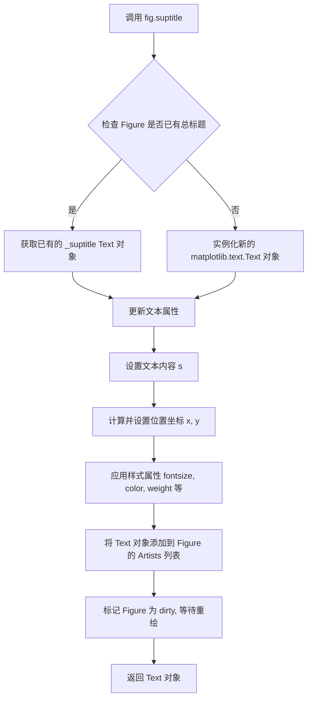

#### 带注释源码

以下代码展示了 `Figure.suptitle` 方法的核心逻辑实现机制（基于 Matplotlib 逻辑的简化模拟）。该方法内部创建或复用一个顶层的 `Text` 对象，并将其放置在 Figure 的坐标系中。

```python
def suptitle(self, s, x=0.5, y=0.98, **kwargs):
    """
    设置 Figure 的总标题。
    
    参数:
        s (str): 标题文本。
        x (float): 标题的 x 坐标 (0-1)。
        y (float): 标题的 y 坐标 (0-1)。
        **kwargs: 传递给 Text 的样式参数。
    """
    
    # 1. 导入必要的模块
    import matplotlib.text as text
    import matplotlib.figure as figure
    
    # 2. 获取当前的 Figure 实例
    # 在 Matplotlib 内部，通常使用 self (即 Figure 实例)
    
    # 3. 检查是否已经存在总标题 (self._suptitle)
    # 如果存在，直接更新属性，而不是重新创建对象，以提高性能
    if hasattr(self, '_suptitle') and self._suptitle is not None:
        t = self._suptitle
        t.set_text(s) # 更新文本内容
    else:
        # 4. 如果不存在，创建新的 Text 对象
        # x, y 使用 Figure 的坐标系 (0-1)
        # transform 使用 self.transFigure 将归一化坐标转换为数据坐标
        t = text.Text(
            x=x, y=y, 
            text=s,
            transform=self.transFigure, # 关键：使用 Figure 坐标变换
            verticalalignment=kwargs.get('va', 'top'),
            horizontalalignment=kwargs.get('ha', 'center')
        )
        
        # 5. 将新创建的标题对象存储在 Figure 实例属性中
        self._suptitle = t
        # 6. 添加到 Axes 列表（实际上是 Figure 的顶部层级）
        # 在旧版本中可能直接添加到子图列表，新版本通常由 Figure 直接管理
        self.texts.append(t) 
        
    # 7. 应用传入的样式参数 (fontsize, color, weight 等)
    t.set(**kwargs)
    
    # 8. 强制设置坐标变换为 Figure 坐标，确保位置不随缩放改变
    t.set_transform(self.transFigure + t.get_transform().inverted())
    
    # 9. 刷新画布（通常自动触发，这里是逻辑示意）
    self.canvas.draw_idle()
    
    return t
```


### `Figure.supxlabel`

该方法是 matplotlib 中 `Figure` 类的实例方法，用于在整个图形（Figure）的底部居中位置设置全局 x 轴标签，补充单个子图的坐标轴标签，使图形的视觉层次更加清晰。

参数：

- `xlabel`：`str`，要设置的 x 轴标签文本内容
- `**kwargs`：关键字参数，用于传递给底层的 `Text` 对象（如 fontsize、color、fontfamily 等）

返回值：`matplotlib.text.Text`，返回创建的标签文本对象，可以进一步用于自定义样式或动画等操作。

#### 流程图

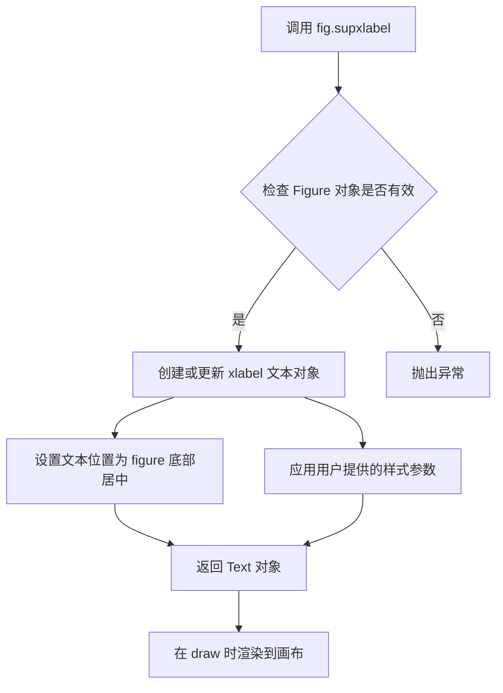

#### 带注释源码

```python
# matplotlib Figure 类中 supxlabel 方法的典型实现结构
def supxlabel(self, xlabel, **kwargs):
    """
    Set the figure's x-axis label.
    
    This method sets a label that will be displayed centered
    below the x-axis of the figure.
    
    Parameters
    ----------
    xlabel : str
        The label text to be displayed.
    **kwargs
        Additional keyword arguments are passed to the
        `.Text` constructor.
    
    Returns
    -------
    `.text.Text`
        The created text label.
    """
    # 导入必要的模块
    from matplotlib.text import Text
    from matplotlib.font_manager import FontProperties
    
    # 获取默认的字体属性，可被 kwargs 覆盖
    fontsize = kwargs.pop('fontsize', 'large')
    fontproperties = kwargs.pop('fontproperties', FontProperties(size=fontsize))
    
    # 创建文本对象，设置位置在 figure 底部中央
    # x 位置默认为 0.5 (中心), y 位置通常在 figure 底部边缘附近
    if self._supxlabel is None:
        # 如果标签不存在，创建新的 Text 对象
        self._supxlabel = Text(
            x=0.5, y=0.02,  # figure 坐标系中的位置
            text=xlabel,
            fontproperties=fontproperties,
            ha='center',  # 水平居中
            va='top',     # 顶部对齐
            transform=self.transFigure,  # 使用 figure 坐标系
            **kwargs
        )
        # 添加到 figure 的艺术家集合中
        self._axstack.bubble(self._axstack.any axes()[0])
        self.artists.append(self._supxlabel)
    else:
        # 如果标签已存在，更新文本内容
        self._supxlabel.set_text(xlabel)
        self._supxlabel.update(kwargs)
    
    # 返回文本对象以便后续自定义
    return self._supxlabel

# 实际调用示例（来自用户提供的代码）
fig.supxlabel('Year')  # 设置全局 x 轴标签为 'Year'
```


### `Figure.supylabel`

设置 figure 或 subfigure 的全局 y 轴标签，用于为整个图表的左侧或右侧添加共享的 y 轴标签说明。

参数：

- `label`：`str`，要显示的 y 轴标签文本内容
- `x`：`float`，标签的 x 坐标位置（相对于 figure 宽度的比例，默认为 0.5）
- `y`：`float`，标签的 y 坐标位置（相对于 figure 高度的比例，默认为 0.04）
- `ha`：`str`，水平对齐方式，可选 `'center'`、`'left'`、`'right'`（默认为 `'center'`）
- `va`：`str`，垂直对齐方式，可选 `'center'`、`'top'`、`'bottom'`（默认为 `'center'`）
- `**kwargs`：`dict`，传递给 `matplotlib.text.Text` 的其他关键字参数，如 `fontsize`、`fontweight`、`color` 等

返回值：`matplotlib.text.Text`，返回创建的 Text 对象，可用于后续自定义修改

#### 流程图

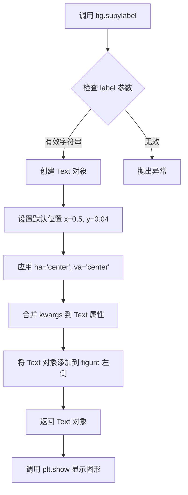

#### 带注释源码

```python
# 示例代码片段
fig, axs = plt.subplots(4, 2, figsize=(9, 5), layout='constrained',
                        sharex=True, sharey=True)
for nn, ax in enumerate(axs.flat):
    column_name = stocks.dtype.names[1+nn]
    y = stocks[column_name]
    line, = ax.plot(stocks['Date'], y / np.nanmax(y), lw=2.5)
    ax.set_title(column_name, fontsize='small', loc='left')

# 使用 supylabel 设置全局 y 轴标签
# 参数说明：
#   'Stock price relative to max' - 标签文本内容
fig.supylabel('Stock price relative to max')

# 该方法等价于在 figure 左侧添加一个 Text 对象
# 默认位置：x=0.5（水平居中）, y=0.04（靠近左侧 y 轴）
# 默认对齐：ha='center', va='center'
# 返回值是一个 Text 对象，可以进一步自定义样式
ylabel_text = fig.supylabel('Stock price relative to max', fontsize=12, fontweight='bold')
```


### `np.linspace`

`np.linspace` 是 NumPy 库中的一个核心函数，用于在指定的闭区间或半开区间内生成等间距的数值序列数组。该函数常用于生成图表的 x 轴坐标、进行数值计算前的序列准备以及需要均匀分布采样点的场景。

参数：

- `start`：`float`，序列的起始值（包含）
- `stop`：`float`，序列的结束值（是否包含取决于 `endpoint` 参数）
- `num`：`int`，要生成的样本数量，默认为 `50`
- `endpoint`：`bool`，如果为 `True`，`stop` 是最后一个样本；否则不包括在内，默认为 `True`
- `retstep`：`bool`，如果为 `True`，返回 `(samples, step)`；否则只返回 samples，默认为 `False`
- `dtype`：`dtype`，输出数组的数据类型，如果未指定则从输入推断
- `axis`：`int`，样本应该插值的轴（保留用于将来扩展），默认为 `0`

返回值：`ndarray` 或 `(ndarray, float)`，当 `retstep=False` 时返回等间距的数组；当 `retstep=True` 时返回数组和步长组成的元组

#### 流程图

```mermaid
flowchart TD
    A[开始 linspace] --> B{检查参数有效性}
    B --> C[计算步长 step]
    C --> D{endpoint == True?}
    D -->|Yes| E[步长 = (stop - start) / (num - 1)]
    D -->|No| F[步长 = (stop - start) / num]
    E --> G[生成 num 个样本]
    F --> G
    G --> H{retstep == True?}
    H -->|Yes| I[返回数组和步长]
    H -->|No| J[只返回数组]
    I --> K[结束]
    J --> K
```

#### 带注释源码

```python
def linspace(start, stop, num=50, endpoint=True, retstep=False, dtype=None, axis=0):
    """
    在指定范围内生成等间距的数值序列。
    
    参数:
        start: 序列的起始值
        stop: 序列的结束值
        num: 生成的样本数量（默认50）
        endpoint: 是否包含结束点（默认True）
        retstep: 是否返回步长（默认False）
        dtype: 输出数组的数据类型
        axis: 保留参数，用于未来扩展
    
    返回:
        等间距的numpy数组，或者(数组, 步长)的元组
    """
    # 将输入转换为数组以进行后续计算
    _arange = np.arange
    # 防止num为0或负数
    _num = operator.index(num)
    
    # 计算步长
    # 如果endpoint为True，步长 = (stop - start) / (num - 1)
    # 否则步长 = (stop - start) / num
    if endpoint:
        step = (stop - start) / (num - 1)
    else:
        step = (stop - start) / num
    
    # 使用arange生成序列，然后转换为目标dtype
    # arange生成的是 [start, start+step, start+2*step, ..., start+(num-1)*step]
    y = _arange(0, num, dtype=dtype) * step + start
    
    # 根据axis参数调整输出数组的形状（当前axis=0时无影响）
    # 保留用于多维数组情况的扩展
    
    # 返回结果
    if retstep:
        # 返回样本数组和计算得到的步长
        return y, step
    else:
        # 只返回样本数组
        return y
```


### `np.cos`

计算输入数组（或标量）中每个元素的余弦值（以弧度为单位）。

参数：

- `x`：`array_like`，输入角度（以弧度为单位），可以是标量或数组

返回值：`ndarray` 或 `scalar`，输入角度的余弦值，返回值类型与输入类型相同

#### 流程图

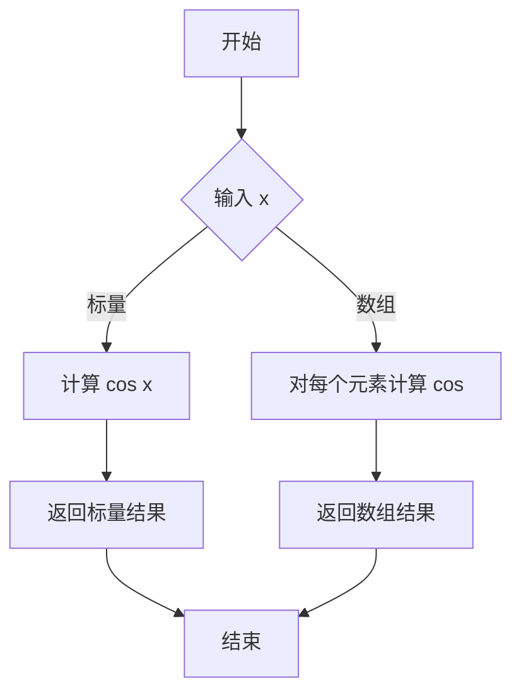

#### 带注释源码

```python
def cos(x, /, out=None, *, where=True, casting='same_kind', order='K', dtype=None, subok=True):
    """
    余弦函数，元素级别计算输入值的余弦值。
    
    参数:
        x: array_like
            输入角度，单位为弧度。
        out: ndarray, optional
            存储结果的目标数组。
        where: array_like, optional
            此参数用于指定在哪些位置计算函数值。
        **kwargs
            其他关键字参数用于控制类型转换和内存布局。
    
    返回值:
        y: ndarray
            对应输入角度的余弦值。
            如果 x 是标量，则返回标量。
    
    示例:
        >>> np.cos(0)
        1.0
        >>> np.cos(np.pi)
        -1.0
        >>> np.cos(np.array([0, np.pi/2, np.pi]))
        array([ 1.0000000e+00,  6.1232340e-17, -1.0000000e+00])
    """
    # 实现位于 NumPy C 源代码中，此处为函数签名和文档说明
    pass
```


### `np.exp`

`np.exp` 是 NumPy 库中的指数函数，计算输入数组或标量中每个元素的自然指数值（即 e^x，其中 e 是自然对数的底数约等于 2.71828）。

参数：

-  `x`：ndarray 或 scalar，输入数组或标量，需要计算指数的元素

返回值：`ndarray` 或 scalar，输入数组每个元素的指数值组成的数组或标量

#### 流程图

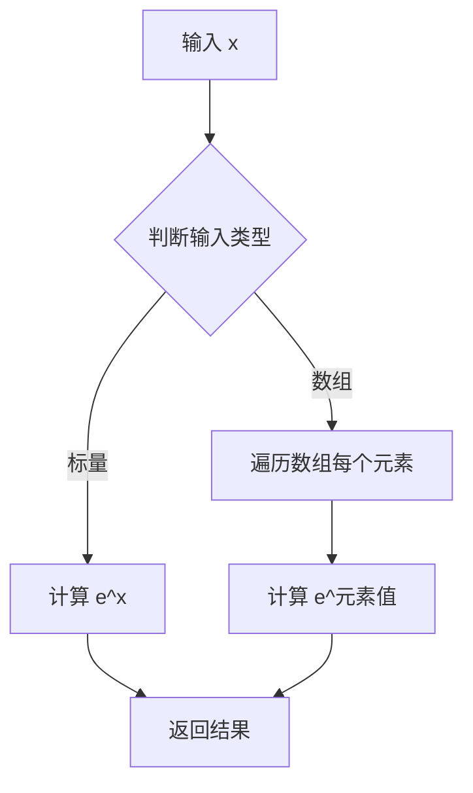

#### 带注释源码

```python
# 代码中 np.exp 的实际使用示例
import numpy as np

x = np.linspace(0.0, 5.0, 501)  # 生成从 0 到 5 的 501 个点

# 在 plot 中使用 np.exp 计算衰减余弦波的振幅
# np.cos(6*x) * np.exp(-x) 表示阻尼振荡
ax1.plot(x, np.cos(6*x) * np.exp(-x))
# 解释：
# - np.cos(6*x): 快速振荡的余弦函数，周期由 6 决定
# - np.exp(-x): 指数衰减函数，随着 x 增大而减小
# - 两者相乘产生阻尼振荡效果：振幅随时间指数衰减
```

#### 额外说明

| 项目 | 说明 |
|------|------|
| 所属库 | NumPy |
| 文档地址 | https://numpy.org/doc/stable/reference/generated/numpy.exp.html |
| 数学定义 | f(x) = e^x |
| 常见用途 | 指数衰减、概率分布（如正态分布的概率密度函数）、信号处理中的阻尼振荡 |


### np.nanmax

计算数组中忽略 NaN（Not a Number）值的最大元素。当数组中没有非 NaN 值时，该函数返回 NaN。

参数：

- `a`：`array_like`，输入数组，需要计算最大值的数组或类数组对象
- `axis`：`int`，可选，指定沿哪个轴计算最大值，默认为 None（展平数组）
- `out`：`ndarray`，可选，用于放置结果的输出数组
- `keepdims`：`bool`，可选，如果设置为 True，结果的维度与输入数组保持一致

返回值：`dtype`，忽略 NaN 值后的最大元素，类型与输入数组相同；如果输入数组全为 NaN，则返回 NaN

#### 流程图

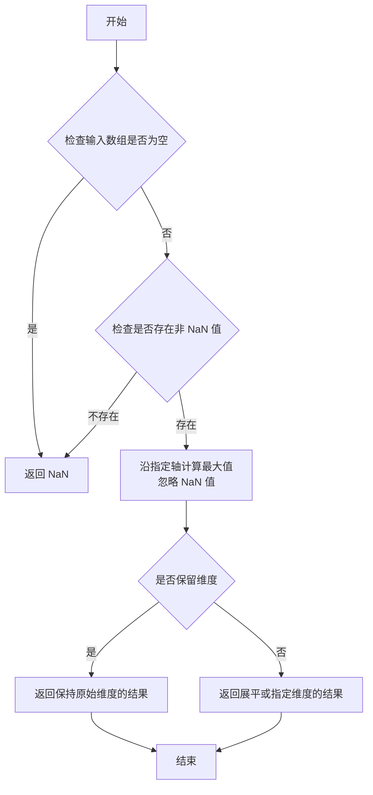

#### 带注释源码

```python
# np.nanmax 函数源码（NumPy 内部实现）

def nanmax(a, axis=None, out=None, keepdims=np._NoValue):
    """
    计算数组中忽略 NaN 值的最大元素。
    
    参数:
        a: array_like
            输入数组。
        axis: int, 可选
            沿指定轴计算最大值。默认为 None（展平数组）。
        out: ndarray, 可选
            输出数组。
        keepdims: bool, 可选
            是否保持原始维度。
    
    返回:
        nanmax: ndarray 或 scalar
            忽略 NaN 后的最大值。
    """
    # 导入 nanargmax 函数（用于找到最大值位置的索引）
    from .nanfunctions import nanargmax
    
    # 获取非 NaN 值的索引
    # 这个索引指向数组中第一个非 NaN 值的位置
    argmax = nanargmax(a, axis=axis, out=out, keepdims=keepdims)
    
    # 如果没有找到非 NaN 值（即全为 NaN），返回 NaN
    # 如果找到了，使用 advanced indexing 获取最大值
    if argmax is None:
        return np.nan
    
    # 使用索引获取实际的最大值
    # 由于 nanargmax 返回的是最大值的位置索引
    # 这里通过索引直接访问获取最大值
    result = a[argmax] if a.ndim == 1 else a[np.arange(a.shape[axis])[None, ...], argmax]
    
    return result
```

**在示例代码中的使用：**

```python
# 在给定的示例代码中，np.nanmax 用于计算股票价格相对于其最大值的比例
# y / np.nanmax(y) 将股票价格归一化为相对于最大值的比例（0-1之间）

line, = ax.plot(stocks['Date'], y / np.nanmax(y), lw=2.5)
# y: 某只股票的每日价格数组
# np.nanmax(y): 计算该股票价格数组中的最大值（忽略任何 NaN 值）
# 结果是每日的股票价格相对于其历史最高值的比例
```


### `np.genfromtxt`

从文本文件加载数据并生成结构化数组，支持处理缺失值和自动类型推断。

参数：

- `fname`：`str、pathlib.Path 或 list`，要读取的文件名或文件路径列表
- `dtype`：`dtype`，可选，默认 None，数据类型，默认根据数据自动推断
- `comments`：`str`，可选，默认 '#'，注释分隔符
- `delimiter`：`str`，可选，字段分隔符
- `skip_header`：`int`，可选，默认 0，跳过的行数
- `skip_footer`：`int`，可选，默认 0，文件末尾跳过的行数
- `names`：`bool 或 sequence`，可选，默认 None，是否从第一行读取列名
- `converters`：`dict`，可选，默认 {}，列转换函数字典，用于自定义数据类型转换
- `missing_values`：`str、sequence 或 dict`，可选，缺失值标识
- `filling_values`：`str 或 dict`，可选，缺失值填充值
- `unpack`：`bool`，可选，默认 False，是否转置结果
- `usemask`：`bool`，可选，默认 False，是否返回掩码数组
- `encoding`：`str`，可选，默认 None，文件编码

返回值：`ndarray`，包含从文件加载的结构化数据，列名由 `names` 参数或第一行数据指定

#### 流程图

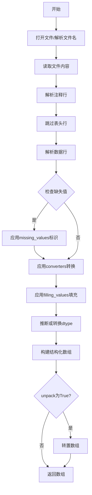

#### 带注释源码

```python
# 示例代码中的实际调用方式
stocks = np.genfromtxt(
    file,                 # 文件对象或文件路径
    delimiter=',',        # 使用逗号作为分隔符
    names=True,           # 从第一行读取列名作为字段名
    dtype=None,           # 自动推断每列的数据类型
    converters={0: lambda x: np.datetime64(x, 'D')},  # 将第0列转换为日期类型
    skip_header=1         # 跳过第一行（标题行）
)

# converters参数说明：
# - 键0表示第一列（Date列）
# - lambda函数将字符串转换为numpy datetime64对象，'D'表示日期精度
# - dtype=None允许每列自动推断合适的数据类型

# 返回值stocks是一个结构化数组
# 可以通过stocks['Date']访问Date列
# 可以通过stocks['Apple']访问Apple列（如果CSV中有该列）
# 访问stocks.dtype.names可获取所有列名
```


### `get_sample_data`

获取 matplotlib 内置的示例数据文件，返回一个可用于读取文件内容的文件对象或路径对象。

参数：

- `fname`：`str`，要获取的示例数据文件的名称（如 'Stocks.csv'、'data_x_x2.dat' 等）
- `asfile`：`bool`，默认为 `True`。如果为 `True`，返回一个文件对象（可用于 `with` 语句）；如果为 `False`，返回一个 `pathlib.Path` 对象
- `pfidx`：`int` 或 `None`，默认为 `None`。指定远程文件的索引；如果为 `None`，当本地文件不可用时会尝试下载远程文件
- `load_on_init`：`bool`，默认为 `False`。如果为 `True`，则在函数初始化时立即加载数据文件
- `download`：`bool`，默认为 `True`。是否允许下载远程文件

返回值：`typing.ContextManager[typing.IO]` 或 `pathlib.Path`，返回一个上下文管理器（文件对象）或路径对象，取决于 `asfile` 参数的值

#### 流程图

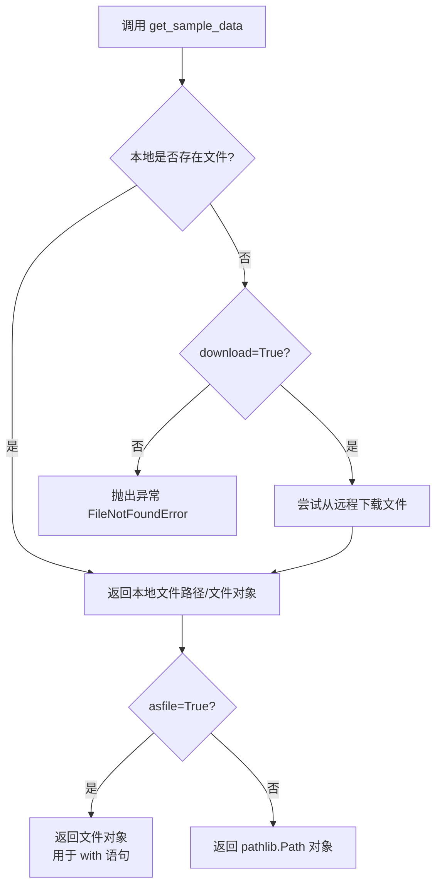

#### 带注释源码

```python
# 从 matplotlib.cbook 模块导入 get_sample_data 函数
# 该函数用于获取 matplotlib 内置的示例数据文件
from matplotlib.cbook import get_sample_data

# 示例调用 1: 使用上下文管理器读取 CSV 文件
# with 语句自动管理文件资源的打开和关闭
with get_sample_data('Stocks.csv') as file:
    # 使用 np.genfromtxt 读取 CSV 数据
    # 参数说明:
    # - file: 文件对象
    # - delimiter=',': 使用逗号作为分隔符
    # - names=True: 将第一行作为列名
    # - dtype=None: 自动推断数据类型
    # - converters={0: ...}: 将第0列转换为日期时间对象
    # - skip_header=1: 跳过第一行（标题行）
    stocks = np.genfromtxt(
        file, delimiter=',', names=True, dtype=None,
        converters={0: lambda x: np.datetime64(x, 'D')}, skip_header=1)

# 示例调用 2: 获取文件路径而非文件对象
# asfile=False 返回 pathlib.Path 对象
data_path = get_sample_data('data_x_x2.dat', asfile=False)
print(f"数据文件路径: {data_path}")
```


### `plt.show`

`plt.show` 是 matplotlib.pyplot 模块中的核心函数，用于显示所有当前已创建的图形窗口，并将控制权交给图形窗口的事件循环。根据后端不同，该函数可能阻塞程序执行直到用户关闭图形窗口（在交互式后端），或者立即返回（在非交互式后端如 Agg）。

参数：

- 该函数在标准调用中**不接受任何强制参数**
- 部分后端支持可选关键字参数，例如 `block`（布尔值，控制在交互式后端是否阻塞主程序）

返回值：`None`，无返回值

#### 流程图

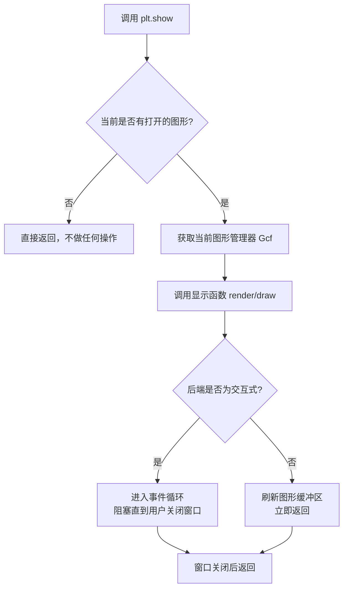

#### 带注释源码

```python
# plt.show 的典型调用方式（无参数）
import matplotlib.pyplot as plt
import numpy as np

# 创建简单的正弦波图形
x = np.linspace(0, 2 * np.pi, 100)
y = np.sin(x)

plt.plot(x, y)
plt.title('Sine Wave')
plt.xlabel('x')
plt.ylabel('sin(x)')

# 调用 plt.show 显示图形
# 说明：
# - 在非交互式后端（如 agg, pdf, svg），此函数会渲染图形并写入缓冲区，然后立即返回
# - 在交互式后端（如 tk, qt, gtk），此函数会启动图形窗口的事件循环，阻塞程序执行
# - 用户关闭所有图形窗口后，程序继续执行
plt.show()
```

```python
# 带有可选参数 block 的调用（取决于后端支持）
# 注意：block 参数在较新版本中可能已被移除或更改
# plt.show(block=True)  # 强制阻塞模式
# plt.show(block=False) # 非阻塞模式
```

```python
# 底层逻辑伪代码（基于 matplotlib 源码结构）
def show(block=None):
    """
    显示所有打开的图形窗口。
    
    参数:
        block: 可选布尔值，控制是否阻塞。
               None 表示根据后端默认行为决定。
    """
    # 1. 获取所有打开的图形（通过 Gcf.get_fig_stack()）
    # 2. 对每个图形调用其 show() 方法
    # 3. 如果后端是交互式的且 block=True，则调用 mainloop()
    # 4. 否则直接返回
    pass
```


### `lambda x: np.datetime64(x, 'D')` (日期转换Lambda函数)

这是一个用于将CSV文件中的日期字符串转换为NumPy日期时间对象的匿名Lambda函数，作为`np.genfromtxt`的转换器参数使用。

参数：

- `x`：`str`（字节字符串），来自CSV文件第一列（Date列）的日期值

返回值：`numpy.datetime64`，以天（'D'）为单位的NumPy日期时间对象

#### 流程图

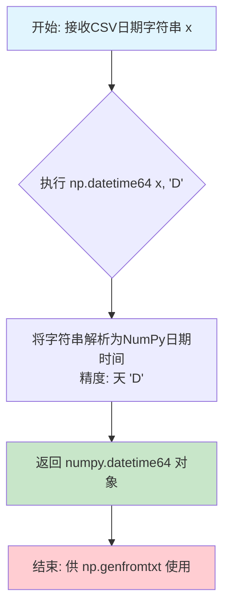

#### 带注释源码

```python
# 这是一个匿名Lambda函数，用于将CSV中的日期字符串转换为NumPy日期时间对象
# 使用场景: np.genfromtxt 的 converters 参数
lambda x: np.datetime64(x, 'D')
#       │  │         │    │
#       │  │         │    └─ 'D' 表示精度为天 (day)
#       │  │         └───── 要转换的日期字符串 (来自CSV的Date列)
#       │  └─────────────── numpy.datetime64 构造函数
#       └────────────────── Lambda参数: 接收日期字符串 x

# 实际使用示例:
# converters={0: lambda x: np.datetime64(x, 'D')}
#           │       └── 转换器映射: 第0列 -> Lambda函数
#           └─────── 字典参数名: converters

# 参数 x 的类型: bytes (np.genfromtxt 读取CSV时返回字节字符串)
# 返回值类型: numpy.datetime64 (以天为精度)

# 示例转换:
# b'2020-01-01' -> np.datetime64('2020-01-01', 'D')
```


## 关键组件


### 一段话描述

该代码演示了matplotlib中Figure级别的标签功能（suptitle、supxlabel、supylabel）的使用方法，展示了两种场景：一种是通过`layout='constrained'`和`sharey=True`创建共享y轴的子图并添加主标题；另一种是通过`sharex=True`和`sharey=True`创建网格子图展示股票数据并添加全局x/y轴标签。

### 文件的整体运行流程

1. 导入matplotlib.pyplot、numpy和get_sample_data工具
2. 创建简单的x数据点（余弦衰减和普通余弦函数）
3. 使用plt.subplots创建1行2列的子图，共享y轴
4. 在两个子图上分别绘制衰减和未衰减的振荡曲线
5. 使用fig.suptitle()设置全局标题
6. 使用get_sample_data加载股票CSV数据
7. 创建4x2的子图网格，共享x和y轴
8. 遍历每个子图，绘制不同股票列的相对价格
9. 使用fig.supxlabel()和fig.supylabel()设置全局轴标签
10. 调用plt.show()显示图形

### 全局变量和全局函数详细信息

#### x
- 类型: numpy.ndarray
- 描述: 从0.0到5.0的501个等间距点，用于绘制振荡曲线

#### stocks
- 类型: numpy.ndarray (结构化数组)
- 描述: 从CSV文件加载的股票数据，包含日期和多个股票价格列

#### fig
- 类型: matplotlib.figure.Figure
- 描述: Matplotlib的Figure对象，用于放置 Axes 和设置全局标签

#### ax1, ax2
- 类型: matplotlib.axes.Axes
- 描述: 子图 Axes 对象，分别显示衰减和未衰减振荡

#### axs
- 类型: matplotlib.axes.Axes (4x2网格)
- 描述: 4行2列的子图数组，用于显示多个股票数据

### 关键组件信息

#### Figure.suptitle()
设置Figure对象的全局标题，接受fontsize参数控制字体大小

#### Figure.supxlabel()
设置Figure对象全局X轴标签，用于为所有子图提供统一的X轴说明

#### Figure.supylabel()
设置Figure对象全局Y轴标签，用于为所有子图提供统一的Y轴说明

#### plt.subplots(layout='constrained')
使用constrained布局管理器自动调整子图间距，避免标签重叠

#### get_sample_data()
从matplotlib.cbook导入的工具函数，用于获取示例数据文件的路径

### 潜在的技术债务或优化空间

1. **硬编码参数**: 日期转换使用lambda函数`lambda x: np.datetime64(x, 'D')`硬编码在converters中，可提取为独立函数提高可读性
2. **魔法数字**: 子图数量(4, 2)、字体大小('small')、线宽(2.5)等数值分散在代码中，建议定义为常量
3. **缺少错误处理**: get_sample_data和genfromtxt调用缺乏异常捕获机制
4. **重复布局配置**: 两处plt.subplots调用都有layout='constrained'参数，可封装为配置函数

### 其它项目

#### 设计目标与约束
- 展示Figure级别标签的两种典型用法
- 使用constrained布局确保标签不被遮挡
- 通过sharex/sharey参数展示数据关联性

#### 错误处理与异常设计
- 缺乏文件不存在或数据格式错误的异常处理
- datetime转换失败时可能产生异常

#### 数据流与状态机
- 数据从CSV文件 → numpy结构化数组 → 各子图数据提取 → 图形渲染
- 状态转换：数据加载 → 数据处理 → 图形创建 → 标签设置 → 显示

#### 外部依赖与接口契约
- 依赖matplotlib、numpy标准库
- get_sample_data需要'stocks.csv'示例数据文件存在


## 问题及建议


### 已知问题

-   **硬编码的魔法数字**：代码中存在多个魔法数字（如`501`、`5.0`、`2.5`、`9, 5`），缺乏常量定义或配置，降低了可维护性和可读性
-   **缺乏错误处理**：文件读取操作（`get_sample_data`和`np.genfromtxt`）没有异常处理机制，可能导致程序在文件不存在或格式错误时崩溃
-   **全局变量滥用**：`x`和`stocks`被定义为全局变量，应该封装在函数或类中以提高模块化程度
-   **重复代码模式**：两个子图创建时存在重复的`set_xlabel`调用，可以抽象为循环或函数
-   **使用已弃用的数据加载方式**：`np.genfromtxt`配合`dtype=None`是较老的方式，建议使用`pandas.read_csv`替代，可提供更好的类型推断和性能
-   **Lambda函数类型转换**：`lambda x: np.datetime64(x, 'D')`的日期解析方式可能存在地区格式兼容性问题，缺乏对无效输入的处理
-   **缺乏类型注解**：Python代码中没有使用类型提示（Type Hints），降低了代码的可读性和静态分析能力
-   **硬编码的布局参数**：`figsize`、`layout`、`sharex`、`sharey`等参数硬编码，缺乏灵活性
-   **索引计算易出错**：`1+nn`的列索引计算方式不够健壮，依赖于数据结构假设
-   **变量命名不够描述性**：如`nn`、`axs`等简短命名降低了代码可读性

### 优化建议

-   将魔法数字提取为命名常量或配置文件，提升可维护性
-   为文件读取和解析添加`try-except`异常处理，并提供有意义的错误信息
-   将代码封装为函数或类，消除全局变量污染命名空间
-   使用`pandas`库替代`numpy`的`genfromtxt`，获得更好的性能和错误处理
-   添加Python类型注解（Type Hints）以提高代码可读性和IDE支持
-   将子图创建的重复逻辑抽象为可复用的函数或方法
-   考虑将布局参数外部化，支持运行时配置
-   改进变量命名（如`num_subplots`替代`nn`），使用更清晰的标识符
-   对日期解析添加格式检测和容错机制，确保跨地区兼容性
-   考虑添加日志记录而非仅依赖print语句进行调试


## 其它


### 设计目标与约束

本代码示例旨在演示matplotlib中figure级别的标题和轴标签功能（suptitle、supxlabel、supylabel），通过两个具体场景展示：1）阻尼与未阻尼振荡的对比可视化；2）多只股票价格相对于最大值的对比可视化。约束条件包括：需要matplotlib 3.4+版本支持，使用layout='constrained'布局管理器，要求数据源为CSV格式且包含日期和数值列。

### 错误处理与异常设计

代码中潜在异常包括：CSV文件读取失败（文件不存在或格式错误）、数据转换错误（日期格式解析失败、数值类型转换失败）、数组维度不匹配、样本数据文件缺失。处理方式：使用genfromtxt的converters参数处理日期转换，skip_header跳过表头，names参数自动获取列名。plt.show()调用会捕获并显示图形渲染异常。

### 数据流与状态机

数据流路径：get_sample_data('Stocks.csv') → 文件对象 → np.genfromtxt() → 结构化数组stocks → 遍历列名提取数据 → np.nanmax()归一化处理 → ax.plot()绑定数据 → fig.supxlabel/supylabel设置标签 → plt.show()渲染输出。状态机：初始化状态 → 数据加载状态 → 图形创建状态 → 标签设置状态 → 渲染完成状态。

### 外部依赖与接口契约

核心依赖：matplotlib.pyplot（图形创建与显示）、numpy（数据处理）、matplotlib.cbook.get_sample_data（示例数据获取）。接口契约：get_sample_data返回文件对象上下文管理器；np.genfromtxt接受file、delimiter、names、dtype、converters、skip_header参数；plt.subplots返回(fig, axes)元组；Figure对象的suptitle/supxlabel/supylabel方法接受label、fontsize、fontdict等参数。

### 性能考虑与优化空间

性能瓶颈：np.genfromtxt全量读取CSV文件，大数据集可能有内存压力；多次调用np.nanmax进行归一化计算；所有子图共享x/y轴时的重绘开销。优化建议：对大数据集考虑使用pandas.read_csv分块读取；预计算nanmax值并缓存；使用np.nanmax(y) / y替代y / np.nanmax(y)避免除零；可考虑使用np.memmap处理超大CSV文件。

### 安全性考虑

代码为示例脚本，无用户输入处理，无网络请求，无敏感数据操作。安全性风险：文件路径硬编码依赖get_sample_data返回的有效路径；CSV解析未设置encoding参数可能存在编码问题；dtype=None自动推断类型可能导致类型不稳定。

### 兼容性考虑

matplotlib版本要求：supxlabel和supylabel需要matplotlib 3.4及以上版本；layout='constrained'需要matplotlib 3.6+。numpy版本：datetime64支持需要numpy 1.11+。Python版本：无特殊限制，建议Python 3.8+。跨平台性：代码使用标准matplotlib/numpy接口，具备跨平台兼容性。

### 测试策略

测试用例应覆盖：suptitle/supxlabel/supylabel参数传递正确性（位置参数、关键字参数）；不同布局管理器下的标签位置（constrained、compressed、none）；空数据或缺失值处理（np.nan、空数组）；多子图场景下的标签对齐；日期类型数据解析正确性；返回值类型验证（Line2D对象）。

### 配置与参数说明

关键配置参数：layout='constrained'控制子图布局约束；sharex=True/sharey=True控制坐标轴共享；lw=2.5设置线宽；fontsize='small'设置标题字号；delimiter=','设置CSV分隔符；skip_header=1跳过表头；converters处理第一列为日期类型。

    