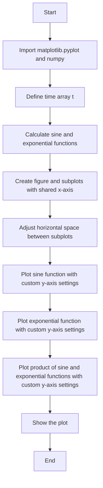
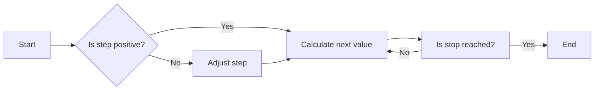
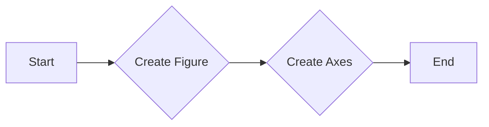
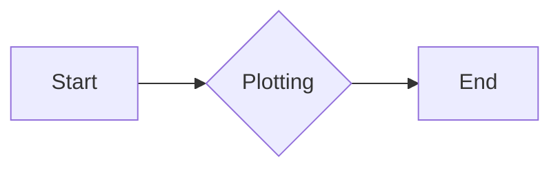
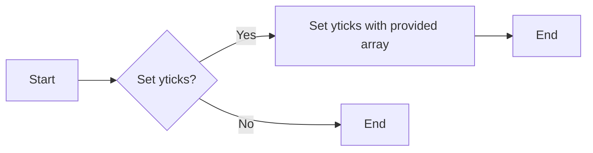
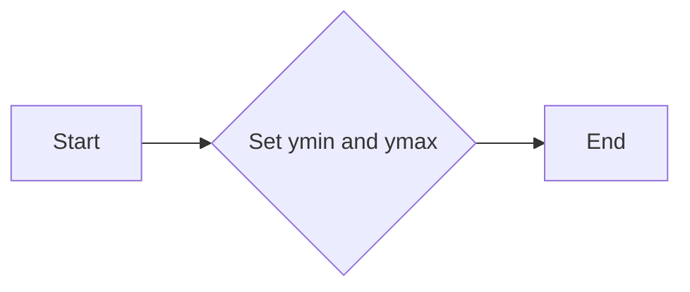

# `matplotlib\galleries\examples\subplots_axes_and_figures\ganged_plots.py` 详细设计文档

This code generates a series of subplots with shared x-axis and customized y-axis ticks and limits.

## 整体流程



## 类结构

```
matplotlib.pyplot
├── subplots(3, 1, sharex=True)
│   ├── axs[0]
│   ├── axs[1]
│   └── axs[2]
```

## 全局变量及字段


### `t`
    
An array of time values ranging from 0.0 to 2.0 with a step of 0.01.

类型：`numpy.ndarray`
    


### `s1`
    
An array of sine values calculated from the time array t.

类型：`numpy.ndarray`
    


### `s2`
    
An array of exponential values calculated from the time array t.

类型：`numpy.ndarray`
    


### `s3`
    
An array of values calculated by multiplying s1 and s2.

类型：`numpy.ndarray`
    


### `matplotlib.pyplot.fig`
    
The figure object created by the subplots method.

类型：`matplotlib.figure.Figure`
    


### `matplotlib.pyplot.axs`
    
An array of axes objects created by the subplots method, each corresponding to a subplot in the figure.

类型：`numpy.ndarray of matplotlib.axes._subplots.AxesSubplot`
    
    

## 全局函数及方法


### np.arange

`np.arange` 是 NumPy 库中的一个函数，用于生成一个沿指定间隔的数字序列。

参数：

- `start`：`int`，序列的起始值。
- `stop`：`int`，序列的结束值（不包括此值）。
- `step`：`int`，序列中相邻元素之间的间隔，默认为 1。

返回值：`numpy.ndarray`，一个沿指定间隔的数字序列。

#### 流程图



#### 带注释源码

```python
import numpy as np

t = np.arange(0.0, 2.0, 0.01)  # Generate a sequence of numbers from 0.0 to 2.0 with a step of 0.01
```


### np.sin

计算输入数组中每个元素的余弦值。

参数：

- `x`：`numpy.ndarray`，输入数组，包含要计算余弦值的元素。

返回值：`numpy.ndarray`，包含输入数组中每个元素的余弦值。

#### 流程图

```mermaid
graph TD
A[Start] --> B{Is x a numpy.ndarray?}
B -- Yes --> C[Calculate sin(x)]
B -- No --> D[Error: x must be a numpy.ndarray]
C --> E[End]
```

#### 带注释源码

```python
import numpy as np

def np_sin(x):
    """
    Calculate the sine of each element in the input array.

    Parameters:
    - x: numpy.ndarray, the input array containing elements to calculate the sine of.

    Returns:
    - numpy.ndarray, an array containing the sine of each element in x.
    """
    return np.sin(x)
```


### np.exp

计算自然指数函数的值。

参数：

- `x`：`float` 或 `array_like`，输入值，可以是单个数值或数组。

返回值：`float` 或 `ndarray`，自然指数函数的值。

#### 流程图

```mermaid
graph TD
A[Start] --> B{Is x a number or array?}
B -- Yes --> C[Calculate exp(x)]
B -- No --> D[Error: x must be a number or array]
C --> E[End]
D --> E
```

#### 带注释源码

```python
import numpy as np

def np_exp(x):
    """
    Calculate the exponential of x.
    
    Parameters:
    - x: float or array_like, the input value, can be a single number or an array.
    
    Returns:
    - float or ndarray, the value of the exponential function.
    """
    return np.exp(x)
```


### plt.subplots

`plt.subplots` 是 `matplotlib.pyplot` 模块中的一个函数，用于创建一个或多个子图，并返回一个 `Figure` 对象和一个或多个 `Axes` 对象。

参数：

- `nrows`：`int`，子图行数。
- `ncols`：`int`，子图列数。
- `sharex`：`bool`，是否共享 x 轴。
- `sharey`：`bool`，是否共享 y 轴。
- `fig`：`matplotlib.figure.Figure`，可选，如果提供，则子图将添加到该图。
- `gridspec_kw`：`dict`，可选，用于定义子图网格的参数。
- `constrained_layout`：`bool`，可选，是否启用约束布局。

返回值：`matplotlib.figure.Figure`，`matplotlib.axes.Axes`，`matplotlib.axes.Axes`，...，一个 `Figure` 对象和一个或多个 `Axes` 对象。

#### 流程图



#### 带注释源码

```python
import matplotlib.pyplot as plt

fig, axs = plt.subplots(3, 1, sharex=True)
# Remove vertical space between Axes
fig.subplots_adjust(hspace=0)
```


### matplotlib.pyplot.plot

matplotlib.pyplot.plot 是一个用于绘制二维线条图的函数。

参数：

- `t`：`numpy.ndarray`，时间序列或数据点。
- `s1`：`numpy.ndarray`，与时间序列对应的函数值。

返回值：`matplotlib.lines.Line2D`，绘制的线条对象。

#### 流程图



#### 带注释源码

```python
import matplotlib.pyplot as plt
import numpy as np

t = np.arange(0.0, 2.0, 0.01)
s1 = np.sin(2 * np.pi * t)

# Plotting the function
line = plt.plot(t, s1)
```


### matplotlib.pyplot.set_yticks

matplotlib.pyplot.set_yticks 是一个用于设置轴的 y 轴刻度的函数。

参数：

- `ticks`：`array_like`，指定 y 轴的刻度值。

返回值：无

#### 流程图



#### 带注释源码

```python
# 假设以下代码是 set_yticks 函数的一部分
def set_yticks(self, ticks):
    """
    Set the y-axis ticks.

    Parameters
    ----------
    ticks : array_like
        The y-axis ticks to set.

    Returns
    -------
    None
    """
    # 设置 y 轴刻度
    self._yaxis.set_ticks(ticks)
    # 更新 y 轴刻度标签
    self._yaxis.set_ticklabels(ticks)
```


### matplotlib.pyplot.set_ylim

matplotlib.pyplot.set_ylim 是一个用于设置轴的 y 轴限制的函数。

参数：

- `ymin`：`float`，y 轴的最小值。
- `ymax`：`float`，y 轴的最大值。

返回值：`None`，没有返回值。

#### 流程图



#### 带注释源码

```python
# 设置 y 轴的最小值为 -1，最大值为 1
axs[0].set_ylim(-1, 1)
```


### plt.show()

`plt.show()` 是一个全局函数，用于显示当前图形。

参数：

- 无

返回值：`None`，该函数不返回任何值，它只是用于显示图形。

#### 流程图

```mermaid
graph TD
    A[Start] --> B[Import matplotlib.pyplot as plt]
    B --> C[Import numpy as np]
    C --> D[Create an array t with values from 0.0 to 2.0 with step 0.01]
    D --> E[Calculate s1 as sin(2 * pi * t)]
    E --> F[Calculate s2 as exp(-t)]
    F --> G[Calculate s3 as s1 * s2]
    G --> H[Create a figure and a list of subplots with 3 rows and 1 column, sharing the x-axis]
    H --> I[Adjust the vertical space between subplots to zero]
    I --> J[Plot s1 on the first subplot]
    J --> K[Set y-ticks and y-limits for the first subplot]
    K --> L[Plot s2 on the second subplot]
    L --> M[Set y-ticks and y-limits for the second subplot]
    M --> N[Plot s3 on the third subplot]
    N --> O[Set y-ticks and y-limits for the third subplot]
    O --> P[Show the plot]
    P --> Q[End]
```

#### 带注释源码

```python
import matplotlib.pyplot as plt
import numpy as np

t = np.arange(0.0, 2.0, 0.01)
s1 = np.sin(2 * np.pi * t)
s2 = np.exp(-t)
s3 = s1 * s2

fig, axs = plt.subplots(3, 1, sharex=True)
fig.subplots_adjust(hspace=0)

axs[0].plot(t, s1)
axs[0].set_yticks(np.arange(-0.9, 1.0, 0.4))
axs[0].set_ylim(-1, 1)

axs[1].plot(t, s2)
axs[1].set_yticks(np.arange(0.1, 1.0, 0.2))
axs[1].set_ylim(0, 1)

axs[2].plot(t, s3)
axs[2].set_yticks(np.arange(-0.9, 1.0, 0.4))
axs[2].set_ylim(-1, 1)

plt.show()
```


## 关键组件


### subplot

用于创建共享共同轴（视觉上）的子图。

### matplotlib.pyplot

用于创建和显示图形的库。

### numpy

用于科学计算和数据分析的库。

### sin

计算正弦值的数学函数。

### exp

计算自然指数的数学函数。

### arange

生成等差数列的函数。

### plot

在轴上绘制线条的函数。

### set_yticks

设置轴的y刻度值的函数。

### set_ylim

设置轴的y轴限制的函数。

### subplots_adjust

调整子图参数的函数。

### show

显示图形的函数。


## 问题及建议


### 已知问题

-   {问题1}：代码中手动设置了每个子图的y轴刻度值和范围，这可能导致维护困难，特别是当数据范围或刻度间隔发生变化时。
-   {问题2}：代码没有进行任何异常处理，如果matplotlib库无法正常工作或数据生成过程中出现错误，程序可能会崩溃。
-   {问题3}：代码没有提供任何形式的日志记录或调试信息，这可能会在问题诊断时造成困难。

### 优化建议

-   {建议1}：使用matplotlib的自动刻度设置功能，例如`axs[0].autoscale(enable=True, axis='y')`，以自动调整y轴刻度和范围。
-   {建议2}：添加异常处理来捕获可能发生的错误，并记录错误信息，以便于问题追踪和调试。
-   {建议3}：引入日志记录，使用Python的`logging`模块来记录程序的运行状态和潜在问题。
-   {建议4}：考虑将绘图逻辑封装到一个函数中，以便于重用和测试。
-   {建议5}：如果数据是动态生成的，可以考虑使用参数化函数来生成图表，这样可以在不同的数据集上重用相同的代码。


## 其它


### 设计目标与约束

- 设计目标：实现一个能够绘制共享x轴的子图的matplotlib图表。
- 约束条件：必须使用matplotlib库进行绘图，且子图之间共享x轴。

### 错误处理与异常设计

- 错误处理：确保在绘图过程中捕获并处理任何可能的异常，如matplotlib库未安装或数据格式错误。
- 异常设计：定义明确的异常处理策略，包括记录错误信息、提供用户友好的错误消息和恢复机制。

### 数据流与状态机

- 数据流：从numpy生成时间序列数据，通过matplotlib进行绘图。
- 状态机：程序从初始化matplotlib图表开始，经过数据生成、绘图、调整轴标签和显示图表，最后结束。

### 外部依赖与接口契约

- 外部依赖：依赖于matplotlib和numpy库。
- 接口契约：matplotlib的subplots函数用于创建子图，plot函数用于绘制数据，set_yticks和set_ylim用于设置y轴的刻度和范围。


    