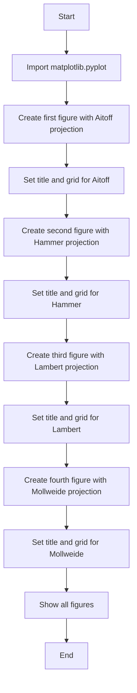
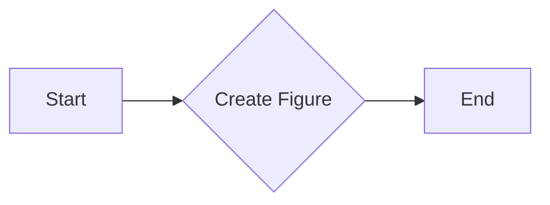
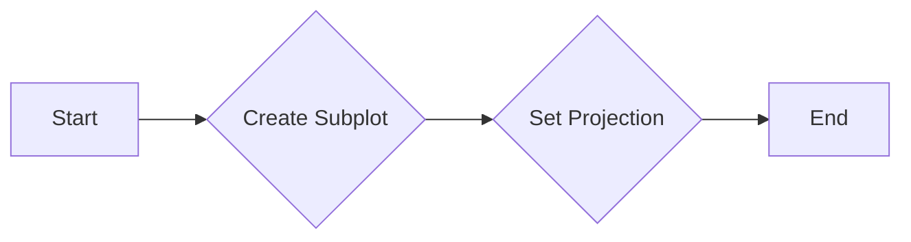
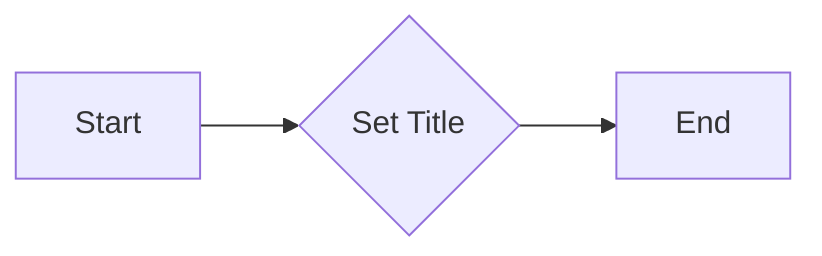
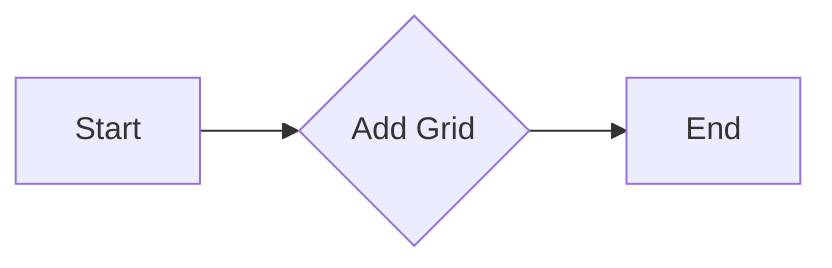
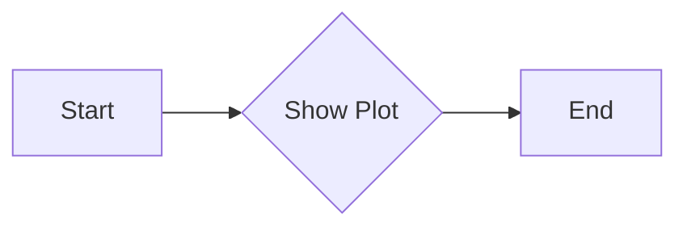

# `matplotlib\galleries\examples\subplots_axes_and_figures\geo_demo.py` 详细设计文档

This Python script generates visual representations of four different geographic projections using the Cartopy library and Matplotlib for plotting.

## 整体流程



## 类结构

```
Geographic_Projections (主脚本)
```

## 全局变量及字段


### `plt`
    
The matplotlib.pyplot module provides a collection of functions that let you plot almost anything. It is used here to create and manipulate plots.

类型：`matplotlib.pyplot`
    


    

## 全局函数及方法


### matplotlib.pyplot.figure()

描述：创建一个新的图形窗口，并返回一个Figure对象。

参数：

- 无

返回值：`Figure`，一个matplotlib.figure.Figure对象，用于绘制图形。

#### 流程图



#### 带注释源码

```python
import matplotlib.pyplot as plt

plt.figure()
```

### matplotlib.pyplot.subplot()

描述：在当前Figure中创建一个新的subplot。

参数：

- projection：字符串，指定子图使用的投影类型，例如 "aitoff"、"hammer"、"lambert"、"mollweide"。

返回值：无

#### 流程图



#### 带注释源码

```python
plt.subplot(projection="aitoff")
```

### matplotlib.pyplot.title()

描述：为当前Axes对象设置标题。

参数：

- title：字符串，标题文本。

返回值：无

#### 流程图



#### 带注释源码

```python
plt.title("Aitoff")
```

### matplotlib.pyplot.grid()

描述：在当前Axes对象上添加网格。

参数：

- visible：布尔值，指定是否显示网格。

返回值：无

#### 流程图



#### 带注释源码

```python
plt.grid(True)
```

### matplotlib.pyplot.show()

描述：显示所有当前图形。

参数：

- 无

返回值：无

#### 流程图



#### 带注释源码

```python
plt.show()
```


## 关键组件


### 地理投影

地理投影是用于将地球表面上的点映射到二维平面的数学方法。

### Matplotlib

Matplotlib 是一个用于创建静态、交互式和动画可视化图表的 Python 库。

### 图形对象

图形对象是 Matplotlib 中的核心概念，用于表示图表中的元素，如线条、标记、文本和图像。

### 子图

子图是图形对象的一种，用于在图表中创建多个独立的图表区域。

### 投影

投影是 Matplotlib 中用于指定子图如何映射到二维平面的参数。

### 图形绘制

图形绘制是使用 Matplotlib 创建图表的过程，包括设置标题、网格和显示图表。


## 问题及建议


### 已知问题

-   {问题1}：代码中使用了硬编码的投影类型，这限制了代码的灵活性和可扩展性。如果需要支持更多的投影类型，需要手动添加更多的代码块。
-   {问题2}：代码没有进行任何错误处理，如果matplotlib或其他依赖库出现异常，程序可能会崩溃。
-   {问题3}：代码没有进行任何性能优化，例如，如果需要频繁地生成这些图，可能会对性能产生影响。

### 优化建议

-   {建议1}：将投影类型作为参数传递给函数，这样可以通过修改参数来支持更多的投影类型，而不需要修改代码本身。
-   {建议2}：添加异常处理来捕获并处理可能出现的错误，确保程序的健壮性。
-   {建议3}：如果需要频繁生成这些图，可以考虑使用缓存机制来存储已经生成的图，避免重复计算。


## 其它


### 设计目标与约束

- 设计目标：实现一个能够展示四种地理投影的代码示例，以帮助用户理解不同投影的特点。
- 约束条件：使用matplotlib库进行绘图，不使用额外的第三方库。

### 错误处理与异常设计

- 错误处理：代码中未包含显式的错误处理机制，但应确保matplotlib库的调用不会引发未处理的异常。
- 异常设计：未定义特定的异常类，但应捕获并处理matplotlib可能抛出的异常。

### 数据流与状态机

- 数据流：代码中数据流简单，从matplotlib库获取绘图功能，通过循环创建不同投影的图形。
- 状态机：代码中没有状态变化，因此不涉及状态机设计。

### 外部依赖与接口契约

- 外部依赖：代码依赖于matplotlib库进行绘图。
- 接口契约：matplotlib库的绘图接口被用于创建和展示投影图形。

### 测试与验证

- 测试策略：应编写单元测试来验证不同投影的图形是否正确生成。
- 验证方法：通过视觉检查和比较已知投影的预期输出进行验证。

### 性能考量

- 性能考量：代码的性能主要受matplotlib库的性能影响，应确保matplotlib的绘图操作高效执行。

### 安全性考量

- 安全性考量：代码中不涉及用户输入，因此安全性风险较低。应确保matplotlib库的版本不受已知安全漏洞的影响。

### 可维护性与可扩展性

- 可维护性：代码结构简单，易于理解和维护。
- 可扩展性：代码可以通过添加更多的投影类型来扩展功能。

### 用户文档与帮助

- 用户文档：提供代码的简要说明和使用方法。
- 帮助信息：在代码中添加注释，说明每个绘图步骤的功能。


    