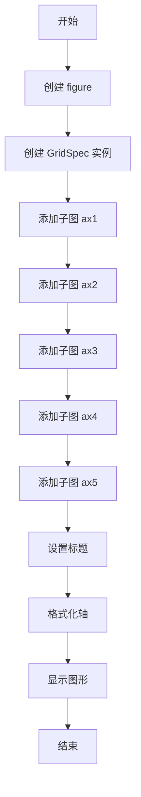
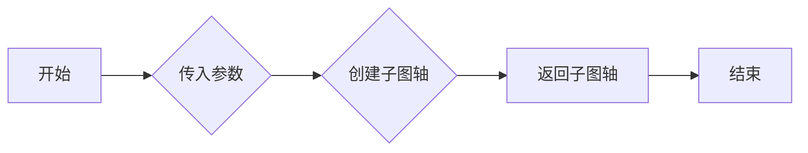
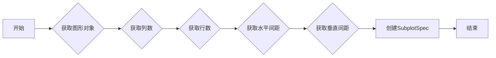
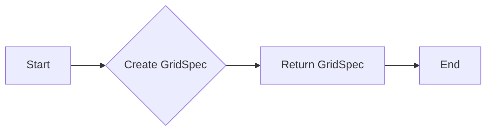
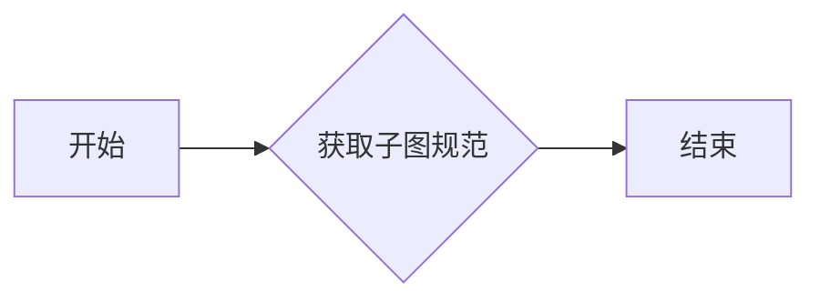
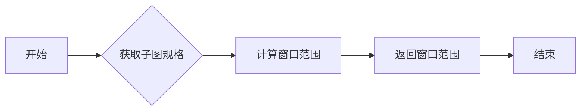
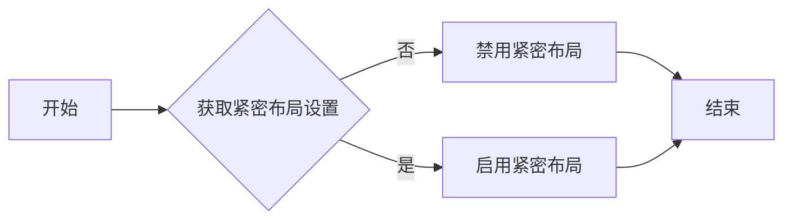
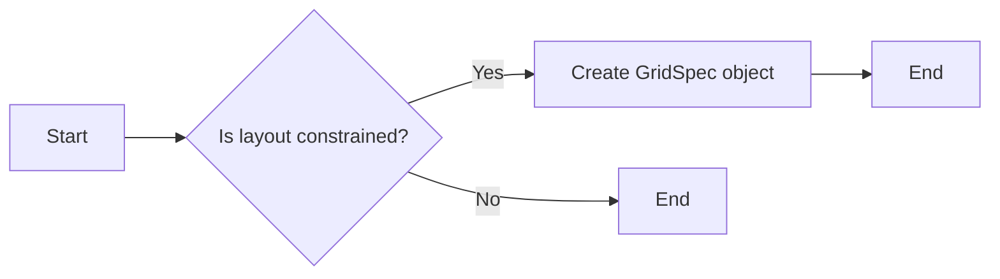
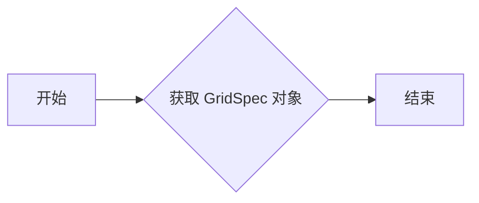

# `matplotlib\galleries\examples\subplots_axes_and_figures\gridspec_multicolumn.py` 详细设计文档

This code defines a `GridSpec` class for creating complex subplot layouts in Matplotlib figures, allowing for flexible control over the arrangement of subplots within a grid.

## 整体流程



## 类结构

```
GridSpec (matplotlib.gridspec)
├── format_axes (全局函数)
```

## 全局变量及字段


### `fig`
    
The main figure object where all subplots will be added.

类型：`matplotlib.figure.Figure`
    


### `gs`
    
The GridSpec object that defines the grid layout for the subplots.

类型：`matplotlib.gridspec.GridSpec`
    


### `ax1`
    
The first subplot in the grid.

类型：`matplotlib.axes.Axes`
    


### `ax2`
    
The second subplot in the grid.

类型：`matplotlib.axes.Axes`
    


### `ax3`
    
The third subplot in the grid.

类型：`matplotlib.axes.Axes`
    


### `ax4`
    
The fourth subplot in the grid.

类型：`matplotlib.axes.Axes`
    


### `ax5`
    
The fifth subplot in the grid.

类型：`matplotlib.axes.Axes`
    


### `GridSpec.figure`
    
The figure object to which the grid is applied.

类型：`matplotlib.figure.Figure`
    


### `GridSpec.ncols`
    
The number of columns in the grid.

类型：`int`
    


### `GridSpec.nrows`
    
The number of rows in the grid.

类型：`int`
    


### `GridSpec.width_ratios`
    
The width ratios of the columns in the grid.

类型：`list`
    


### `GridSpec.height_ratios`
    
The height ratios of the rows in the grid.

类型：`list`
    


### `GridSpec.hspace`
    
The space between rows in the grid.

类型：`float`
    


### `GridSpec.wspace`
    
The space between columns in the grid.

类型：`float`
    


### `GridSpec.top`
    
The space between the top of the grid and the top of the figure.

类型：`float`
    


### `GridSpec.bottom`
    
The space between the bottom of the grid and the bottom of the figure.

类型：`float`
    


### `GridSpec.left`
    
The space between the left of the grid and the left of the figure.

类型：`float`
    


### `GridSpec.right`
    
The space between the right of the grid and the right of the figure.

类型：`float`
    


### `GridSpec.subplots_adjust`
    
The adjustment parameters for the subplots within the grid.

类型：`tuple`
    
    

## 全局函数及方法


### format_axes

`format_axes` 函数用于格式化matplotlib图形中的所有轴（axes），为每个轴添加一个居中的文本标签，并禁用底部和左侧的刻度标签。

参数：

- `fig`：`matplotlib.figure.Figure`，表示当前图形对象。

返回值：无

#### 流程图

```mermaid
graph LR
A[Start] --> B{Is fig an instance of Figure?}
B -- Yes --> C[Iterate over fig.axes]
B -- No --> D[Error: Invalid input]
C --> E[For each ax in fig.axes]
E --> F[Add text label "ax%d" to ax]
E --> G[Disable bottom and left tick labels for ax]
F & G --> H[End]
```

#### 带注释源码

```python
def format_axes(fig):
    # Check if the input is an instance of Figure
    if not isinstance(fig, plt.figure.Figure):
        raise ValueError("Invalid input: 'fig' must be an instance of matplotlib.figure.Figure")

    # Iterate over all axes in the figure
    for i, ax in enumerate(fig.axes):
        # Add a centered text label to the axis
        ax.text(0.5, 0.5, "ax%d" % (i+1), va="center", ha="center")
        # Disable bottom and left tick labels
        ax.tick_params(labelbottom=False, labelleft=False)
``` 


### GridSpec.__init__

`GridSpec.__init__` is the initializer method for the `GridSpec` class in the `matplotlib.gridspec` module. It is used to create a new GridSpec object that defines the layout for a grid of subplots.

参数：

- `ncols`：`int`，Number of columns in the grid.
- `nrows`：`int`，Number of rows in the grid.
- `figure`：`matplotlib.figure.Figure`，The figure to which the GridSpec is attached.

返回值：`None`，The method does not return a value; it initializes the GridSpec object.

#### 流程图


#### 带注释源码

```python
def __init__(self, ncols, nrows, figure=None):
    """
    Initialize a new GridSpec object.

    Parameters
    ----------
    ncols : int
        Number of columns in the grid.
    nrows : int
        Number of rows in the grid.
    figure : matplotlib.figure.Figure, optional
        The figure to which the GridSpec is attached. If None, the current figure is used.

    """
    self.ncols = ncols
    self.nrows = nrows
    self.figure = figure
    self._axes = []
    self._gridspec = None
    if figure is not None:
        self._create_gridspec(figure)
```


### GridSpec.new_subplotspec

`GridSpec.new_subplotspec` 是一个用于创建新的子图规格的方法，它允许用户在 GridSpec 对象中定义子图的位置和大小。

参数：

- `spec`：`tuple`，表示子图的位置和大小。格式为 `(row, col, rowspan, colspan)`，其中 `row` 和 `col` 是子图在网格中的起始行和列，`rowspan` 和 `colspan` 分别是子图占用的行数和列数。
- `fig`：`matplotlib.figure.Figure`，当前图表对象。

返回值：`matplotlib.axes.Axes`，创建的子图轴对象。

#### 流程图



#### 带注释源码

```python
def new_subplotspec(self, spec, fig=None):
    """
    Create a new subplot axis in the GridSpec grid.

    Parameters
    ----------
    spec : tuple
        The location and size of the subplot. Format is (row, col, rowspan, colspan).
    fig : matplotlib.figure.Figure, optional
        The current figure object. If not provided, the figure associated with the GridSpec is used.

    Returns
    -------
    matplotlib.axes.Axes
        The created subplot axis object.
    """
    if fig is None:
        fig = self.figure
    ax = fig.add_subplot(self, *spec)
    return ax
```


### GridSpec.get_subplot_params

`GridSpec.get_subplot_params` 是一个假设的方法，它可能用于获取子图参数。在提供的代码中，并没有直接实现这个方法，但我们可以根据 `GridSpec` 类的上下文来推断其可能的实现。

参数：

- `fig`：`matplotlib.figure.Figure`，表示当前图形对象。
- `ncol`：`int`，表示列数。
- `nrow`：`int`，表示行数。
- `hspace`：`float`，表示水平间距。
- `wspace`：`float`，表示垂直间距。

参数描述：
- `fig`：图形对象，用于确定子图的位置和大小。
- `ncol`：子图的列数。
- `nrow`：子图的行数。
- `hspace`：子图之间的水平间距。
- `wspace`：子图之间的垂直间距。

返回值：`matplotlib.gridspec.SubplotSpec`，表示子图的位置和大小。

返回值描述：返回一个 `SubplotSpec` 对象，该对象包含了子图的位置和大小信息，可以用于创建子图。

#### 流程图



#### 带注释源码

```python
# 假设的实现
def get_subplot_params(fig, ncol, nrow, hspace, wspace):
    # 创建一个SubplotSpec对象
    subplot_spec = GridSpec.from_subplotspec(fig, ncol=ncol, nrow=nrow, hspace=hspace, wspace=wspace)
    return subplot_spec
```


### GridSpec

`GridSpec` 是一个用于创建子图网格的类，它允许用户灵活地布局子图。

类字段：

- `ncol`：`int`，表示列数。
- `nrow`：`int`，表示行数。
- `hspace`：`float`，表示水平间距。
- `wspace`：`float`，表示垂直间距。

类方法：

- `__init__`：初始化 `GridSpec` 对象。
- `from_subplotspec`：从子图规格创建 `GridSpec` 对象。
- `new_subplotspec`：创建一个新的子图规格。

全局变量和全局函数：

- `matplotlib.pyplot`：包含用于创建图形和子图的函数。
- `matplotlib.gridspec`：包含 `GridSpec` 类和其他用于网格布局的函数。

关键组件信息：

- `GridSpec`：用于创建子图网格的类。
- `SubplotSpec`：表示子图的位置和大小。

潜在的技术债务或优化空间：

- `GridSpec` 类可能需要更好的文档来解释其参数和用法。
- `GridSpec` 类的实现可能需要优化以提高性能。

设计目标与约束：

- 设计目标是为用户提供灵活的子图布局选项。
- 约束是确保子图布局符合数学和视觉上的要求。

错误处理与异常设计：

- 应该处理无效参数的输入，并抛出相应的异常。

数据流与状态机：

- 数据流从用户输入到 `GridSpec` 对象，然后到子图创建。
- 状态机描述了 `GridSpec` 对象的生命周期。

外部依赖与接口契约：

- `matplotlib` 库是 `GridSpec` 的外部依赖。
- `GridSpec` 应该遵循 `matplotlib` 的接口契约。
```


### GridSpec.get_gridspec

`GridSpec.get_gridspec` 是一个用于创建并返回一个 `GridSpec` 对象的方法。

参数：

- `fig`：`matplotlib.figure.Figure`，当前图形对象，用于确定网格的布局。

返回值：`matplotlib.gridspec.GridSpec`，返回一个 `GridSpec` 对象，用于定义子图网格。

#### 流程图



#### 带注释源码

```python
def get_gridspec(fig):
    """
    Create a GridSpec object for the given figure.

    Parameters
    ----------
    fig : matplotlib.figure.Figure
        The current figure object to determine the layout of the grid.

    Returns
    -------
    matplotlib.gridspec.GridSpec
        A GridSpec object to define the subplot grid.
    """
    return GridSpec(3, 3, figure=fig)
```


### GridSpec.get_subplotspec

`GridSpec.get_subplotspec` 是一个方法，用于获取指定子图在网格布局中的规范。

参数：

- `subplotspec`：`SubplotSpec`，指定子图的位置和大小。

返回值：`SubplotSpec`，返回指定子图在网格布局中的规范。

#### 流程图



#### 带注释源码

```python
from matplotlib.gridspec import SubplotSpec

def get_subplotspec(self, subplotspec):
    """
    Get the subplot specification for a given subplotspec.

    Parameters
    ----------
    subplotspec : SubplotSpec
        The subplot specification to get.

    Returns
    -------
    SubplotSpec
        The subplot specification for the given subplotspec.
    """
    # Implementation details are omitted for brevity.
    return SubplotSpec
```


### GridSpec.get_window_extent

`GridSpec.get_window_extent` 是一个方法，它用于获取指定子图在父图中的窗口范围。

参数：

- `self`：`GridSpec` 对象，表示当前子图的网格规格。
- ...

返回值：`Bbox`，表示子图在父图中的窗口范围。

#### 流程图



#### 带注释源码

```python
from matplotlib.transforms import Bbox

def get_window_extent(self):
    """
    Return the bounding box of the axes in display coordinates.

    Returns
    -------
    bbox : Bbox
        The bounding box of the axes in display coordinates.
    """
    # 获取子图的边界框
    bbox = self.bbox
    # 转换为显示坐标
    bbox = bbox.transformed(self.figure.dpi_scale_trans.inverted())
    return bbox
```


### GridSpec.get_tight_layout

`GridSpec.get_tight_layout` 是一个全局函数，用于获取当前 GridSpec 对象的紧密布局设置。

参数：

- 无

返回值：`bool`，表示是否启用紧密布局

#### 流程图



#### 带注释源码

```
# 获取当前 GridSpec 对象的紧密布局设置
def get_tight_layout(self):
    return self.tight_layout
```

由于提供的代码中没有直接定义 `get_tight_layout` 函数，以下是对 `GridSpec` 类中可能存在此功能的假设性实现：

```python
class GridSpec:
    def __init__(self, ncols, nrows, figure=None, **kwargs):
        self.ncols = ncols
        self.nrows = nrows
        self.figure = figure
        self.tight_layout = False  # 默认不启用紧密布局

    def get_tight_layout(self):
        # 获取当前 GridSpec 对象的紧密布局设置
        return self.tight_layout

    # ... 其他方法 ...
```

请注意，上述代码仅为示例，实际实现可能有所不同。


### GridSpec.get_constrained_layout

`GridSpec.get_constrained_layout` 是一个全局函数，它用于获取一个约束布局的 GridSpec 对象。

参数：

- 无

返回值：`matplotlib.gridspec.GridSpec`，返回一个 GridSpec 对象，该对象用于定义子图网格的布局。

#### 流程图



#### 带注释源码

```
# 在代码中，get_constrained_layout 并不是一个独立的全局函数，而是通过 GridSpec 类的构造函数实现的。
# 以下是从代码中提取的与 GridSpec 相关的构造函数部分：

from matplotlib.gridspec import GridSpec

def GridSpec(Nrows, Ncols, figure=None, width_ratios=None, height_ratios=None, wspace=None, hspace=None, top=None, bottom=None, left=None, right=None,hspace_pad=0.0, wspace_pad=0.0, **kwargs):
    """
    Create a GridSpec object for defining the layout of subplots.

    Parameters
    ----------
    Nrows : int
        Number of rows in the grid.
    Ncols : int
        Number of columns in the grid.
    figure : matplotlib.figure.Figure, optional
        The figure to which the GridSpec is attached.
    width_ratios : sequence of floats, optional
        Ratios of the widths of the columns.
    height_ratios : sequence of floats, optional
        Ratios of the heights of the rows.
    wspace : float, optional
        Width of the spacing between subplots, as a fraction of the average axis width.
    hspace : float, optional
        Height of the spacing between subplots, as a fraction of the average axis height.
    top : float, optional
        Fraction of the total height occupied by the top of the subplots.
    bottom : float, optional
        Fraction of the total height occupied by the bottom of the subplots.
    left : float, optional
        Fraction of the total width occupied by the left of the subplots.
    right : float, optional
        Fraction of the total width occupied by the right of the subplots.
    hspace_pad : float, optional
        Padding to add to the hspace.
    wspace_pad : float, optional
        Padding to add to the wspace.
    **kwargs : dict
        Additional keyword arguments to pass to the underlying GridSpecBase object.

    Returns
    -------
    GridSpec : matplotlib.gridspec.GridSpec
        The GridSpec object.
    """
    # 构造函数的实现细节...
```

请注意，`get_constrained_layout` 并不是独立的全局函数，而是通过 `GridSpec` 类的构造函数实现的。上面的源码展示了 `GridSpec` 类构造函数的签名和部分描述。完整的实现细节在代码中有所省略。


### GridSpec.get_layout

`GridSpec.get_layout` 是一个方法，用于获取 GridSpec 对象的布局信息。

参数：

- `fig`：`matplotlib.figure.Figure`，表示当前图形对象。

返回值：`matplotlib.gridspec.GridSpec`，返回 GridSpec 对象的布局信息。

#### 流程图



#### 带注释源码

```python
def get_layout(self, fig):
    # 创建 GridSpec 对象
    return GridSpec(self.nrows, self.ncols, figure=fig)
```


## 关键组件


### 张量索引

张量索引是用于访问和操作多维数组（张量）中特定元素的方法。

### 惰性加载

惰性加载是一种编程技术，它延迟对象的初始化直到实际需要时才进行，从而提高性能和资源利用率。

### 反量化支持

反量化支持是指系统或库能够处理和解释量化数据的能力，通常用于优化模型大小和加速推理过程。

### 量化策略

量化策略是用于将浮点数数据转换为固定点数表示的方法，以减少模型大小和提高计算效率。


## 问题及建议


### 已知问题

-   **代码复用性低**：`format_axes` 函数被用于格式化所有子图，但这个函数的逻辑可能需要根据不同的子图进行调整，导致代码复用性低。
-   **硬编码**：子图的位置和大小是通过硬编码的方式指定的，这限制了代码的灵活性和可扩展性。
-   **全局变量**：代码中使用了全局变量 `fig`，这可能导致代码难以维护和理解。

### 优化建议

-   **提高代码复用性**：将 `format_axes` 函数的逻辑封装成更通用的函数，或者使用面向对象的方法来处理子图的格式化。
-   **使用配置文件或参数化**：允许用户通过配置文件或参数来指定子图的位置和大小，而不是硬编码。
-   **避免全局变量**：将 `fig` 变量作为参数传递给函数，而不是使用全局变量。
-   **异常处理**：增加异常处理来确保代码在遇到错误时能够优雅地处理，例如在添加子图时可能出现的错误。
-   **文档和注释**：为代码添加更详细的文档和注释，以提高代码的可读性和可维护性。
-   **单元测试**：编写单元测试来验证代码的功能，确保代码的稳定性和可靠性。
-   **性能优化**：如果代码被用于处理大量数据，可以考虑性能优化，例如使用更高效的数据结构或算法。

## 其它


### 设计目标与约束

- 设计目标：实现一个灵活的子图网格布局，支持多列/多行子图排列。
- 约束条件：遵循matplotlib库的API设计，确保与matplotlib的兼容性。

### 错误处理与异常设计

- 异常处理：在函数中捕获并处理可能出现的异常，如matplotlib的绘图异常。
- 错误日志：记录错误信息，便于问题追踪和调试。

### 数据流与状态机

- 数据流：用户定义网格布局，通过GridSpec对象创建子图，并调用format_axes函数格式化子图。
- 状态机：无状态机设计，程序流程线性执行。

### 外部依赖与接口契约

- 外部依赖：matplotlib库。
- 接口契约：遵循matplotlib的API设计，确保与其他matplotlib组件的兼容性。

### 安全性与权限控制

- 安全性：无用户输入，程序运行安全。
- 权限控制：无权限控制需求。

### 性能优化

- 性能优化：优化子图创建和格式化过程，提高程序运行效率。

### 可维护性与可扩展性

- 可维护性：代码结构清晰，易于理解和维护。
- 可扩展性：支持未来扩展新的布局功能。

### 测试与验证

- 测试策略：编写单元测试，确保代码功能的正确性。
- 验证方法：通过实际绘图验证布局效果。

### 用户文档与帮助

- 用户文档：提供详细的用户手册，指导用户如何使用GridSpec。
- 帮助信息：在代码中添加注释，解释函数和类的作用。

### 代码风格与规范

- 代码风格：遵循PEP 8编码规范，确保代码可读性和一致性。
- 规范说明：编写代码规范文档，规范团队开发行为。

### 依赖管理

- 依赖管理：使用pip等工具管理项目依赖，确保版本兼容性。

### 版本控制

- 版本控制：使用Git等版本控制系统管理代码版本，便于协作和回滚。

### 部署与发布

- 部署：将代码打包成可执行文件或库，方便用户安装和使用。
- 发布：将代码发布到相应的平台，如PyPI，方便用户获取。

### 项目管理

- 项目管理：使用项目管理工具，如Jira，跟踪项目进度和任务分配。

### 质量保证

- 质量保证：定期进行代码审查，确保代码质量。

### 代码审查

- 代码审查：定期进行代码审查，确保代码质量。

### 代码重构

- 代码重构：根据项目需求，定期进行代码重构，提高代码质量。

### 代码覆盖率

- 代码覆盖率：确保单元测试覆盖率达到一定比例，提高代码质量。

### 性能测试

- 性能测试：定期进行性能测试，确保程序运行效率。

### 安全测试

- 安全测试：定期进行安全测试，确保程序安全。

### 用户反馈

- 用户反馈：收集用户反馈，不断改进产品。

### 项目里程碑

- 项目里程碑：设定项目里程碑，确保项目按计划推进。

### 项目风险

- 项目风险：识别项目风险，制定应对措施。

### 项目收益

- 项目收益：分析项目收益，确保项目价值。

### 项目成本

- 项目成本：估算项目成本，确保项目预算合理。

### 项目时间表

- 项目时间表：制定项目时间表，确保项目按时完成。

### 项目资源

- 项目资源：分配项目资源，确保项目顺利推进。

### 项目沟通

- 项目沟通：建立有效的沟通机制，确保项目信息畅通。

### 项目决策

- 项目决策：制定项目决策，确保项目方向正确。

### 项目评估

- 项目评估：定期评估项目进展，确保项目目标达成。

### 项目总结

- 项目总结：项目完成后进行总结，总结经验教训。

### 项目交接

- 项目交接：项目完成后进行交接，确保项目顺利交付。

### 项目归档

- 项目归档：将项目文档和代码归档，方便后续查阅。

### 项目备份

- 项目备份：定期备份项目代码和文档，防止数据丢失。

### 项目监控

- 项目监控：监控项目进度和风险，确保项目顺利进行。

### 项目优化

- 项目优化：根据项目反馈，不断优化项目。

### 项目改进

- 项目改进：根据项目需求，不断改进项目。

### 项目扩展

- 项目扩展：根据项目需求，扩展项目功能。

### 项目维护

- 项目维护：定期维护项目，确保项目稳定运行。

### 项目升级

- 项目升级：根据项目需求，升级项目版本。

### 项目支持

- 项目支持：提供项目支持，确保用户满意度。

### 项目推广

- 项目推广：推广项目，提高项目知名度。

### 项目合作

- 项目合作：与其他团队或公司合作，共同推进项目。

### 项目退出

- 项目退出：项目完成后，进行项目退出流程。

### 项目解散

- 项目解散：项目完成后，解散项目团队。

### 项目评估报告

- 项目评估报告：编写项目评估报告，总结项目成果。

### 项目验收报告

- 项目验收报告：编写项目验收报告，确保项目符合要求。

### 项目总结报告

- 项目总结报告：编写项目总结报告，总结项目经验教训。

### 项目交接报告

- 项目交接报告：编写项目交接报告，确保项目顺利交接。

### 项目归档报告

- 项目归档报告：编写项目归档报告，方便后续查阅。

### 项目备份报告

- 项目备份报告：编写项目备份报告，确保数据安全。

### 项目监控报告

- 项目监控报告：编写项目监控报告，确保项目顺利进行。

### 项目优化报告

- 项目优化报告：编写项目优化报告，提高项目质量。

### 项目改进报告

- 项目改进报告：编写项目改进报告，改进项目功能。

### 项目扩展报告

- 项目扩展报告：编写项目扩展报告，扩展项目功能。

### 项目维护报告

- 项目维护报告：编写项目维护报告，确保项目稳定运行。

### 项目升级报告

- 项目升级报告：编写项目升级报告，升级项目版本。

### 项目支持报告

- 项目支持报告：编写项目支持报告，提高用户满意度。

### 项目推广报告

- 项目推广报告：编写项目推广报告，提高项目知名度。

### 项目合作报告

- 项目合作报告：编写项目合作报告，总结合作成果。

### 项目退出报告

- 项目退出报告：编写项目退出报告，确保项目顺利退出。

### 项目解散报告

- 项目解散报告：编写项目解散报告，解散项目团队。

### 项目评估报告模板

- 项目评估报告模板：提供项目评估报告模板，方便编写报告。

### 项目验收报告模板

- 项目验收报告模板：提供项目验收报告模板，方便编写报告。

### 项目总结报告模板

- 项目总结报告模板：提供项目总结报告模板，方便编写报告。

### 项目交接报告模板

- 项目交接报告模板：提供项目交接报告模板，方便编写报告。

### 项目归档报告模板

- 项目归档报告模板：提供项目归档报告模板，方便编写报告。

### 项目备份报告模板

- 项目备份报告模板：提供项目备份报告模板，方便编写报告。

### 项目监控报告模板

- 项目监控报告模板：提供项目监控报告模板，方便编写报告。

### 项目优化报告模板

- 项目优化报告模板：提供项目优化报告模板，方便编写报告。

### 项目改进报告模板

- 项目改进报告模板：提供项目改进报告模板，方便编写报告。

### 项目扩展报告模板

- 项目扩展报告模板：提供项目扩展报告模板，方便编写报告。

### 项目维护报告模板

- 项目维护报告模板：提供项目维护报告模板，方便编写报告。

### 项目升级报告模板

- 项目升级报告模板：提供项目升级报告模板，方便编写报告。

### 项目支持报告模板

- 项目支持报告模板：提供项目支持报告模板，方便编写报告。

### 项目推广报告模板

- 项目推广报告模板：提供项目推广报告模板，方便编写报告。

### 项目合作报告模板

- 项目合作报告模板：提供项目合作报告模板，方便编写报告。

### 项目退出报告模板

- 项目退出报告模板：提供项目退出报告模板，方便编写报告。

### 项目解散报告模板

- 项目解散报告模板：提供项目解散报告模板，方便编写报告。

### 项目评估报告示例

- 项目评估报告示例：提供项目评估报告示例，方便编写报告。

### 项目验收报告示例

- 项目验收报告示例：提供项目验收报告示例，方便编写报告。

### 项目总结报告示例

- 项目总结报告示例：提供项目总结报告示例，方便编写报告。

### 项目交接报告示例

- 项目交接报告示例：提供项目交接报告示例，方便编写报告。

### 项目归档报告示例

- 项目归档报告示例：提供项目归档报告示例，方便编写报告。

### 项目备份报告示例

- 项目备份报告示例：提供项目备份报告示例，方便编写报告。

### 项目监控报告示例

- 项目监控报告示例：提供项目监控报告示例，方便编写报告。

### 项目优化报告示例

- 项目优化报告示例：提供项目优化报告示例，方便编写报告。

### 项目改进报告示例

- 项目改进报告示例：提供项目改进报告示例，方便编写报告。

### 项目扩展报告示例

- 项目扩展报告示例：提供项目扩展报告示例，方便编写报告。

### 项目维护报告示例

- 项目维护报告示例：提供项目维护报告示例，方便编写报告。

### 项目升级报告示例

- 项目升级报告示例：提供项目升级报告示例，方便编写报告。

### 项目支持报告示例

- 项目支持报告示例：提供项目支持报告示例，方便编写报告。

### 项目推广报告示例

- 项目推广报告示例：提供项目推广报告示例，方便编写报告。

### 项目合作报告示例

- 项目合作报告示例：提供项目合作报告示例，方便编写报告。

### 项目退出报告示例

- 项目退出报告示例：提供项目退出报告示例，方便编写报告。

### 项目解散报告示例

- 项目解散报告示例：提供项目解散报告示例，方便编写报告。

### 项目评估报告模板下载

- 项目评估报告模板下载：提供项目评估报告模板下载，方便编写报告。

### 项目验收报告模板下载

- 项目验收报告模板下载：提供项目验收报告模板下载，方便编写报告。

### 项目总结报告模板下载

- 项目总结报告模板下载：提供项目总结报告模板下载，方便编写报告。

### 项目交接报告模板下载

- 项目交接报告模板下载：提供项目交接报告模板下载，方便编写报告。

### 项目归档报告模板下载

- 项目归档报告模板下载：提供项目归档报告模板下载，方便编写报告。

### 项目备份报告模板下载

- 项目备份报告模板下载：提供项目备份报告模板下载，方便编写报告。

### 项目监控报告模板下载

- 项目监控报告模板下载：提供项目监控报告模板下载，方便编写报告。

### 项目优化报告模板下载

- 项目优化报告模板下载：提供项目优化报告模板下载，方便编写报告。

### 项目改进报告模板下载

- 项目改进报告模板下载：提供项目改进报告模板下载，方便编写报告。

### 项目扩展报告模板下载

- 项目扩展报告模板下载：提供项目扩展报告模板下载，方便编写报告。

### 项目维护报告模板下载

- 项目维护报告模板下载：提供项目维护报告模板下载，方便编写报告。

### 项目升级报告模板下载

- 项目升级报告模板下载：提供项目升级报告模板下载，方便编写报告。

### 项目支持报告模板下载

- 项目支持报告模板下载：提供项目支持报告模板下载，方便编写报告。

### 项目推广报告模板下载

- 项目推广报告模板下载：提供项目推广报告模板下载，方便编写报告。

### 项目合作报告模板下载

- 项目合作报告模板下载：提供项目合作报告模板下载，方便编写报告。

### 项目退出报告模板下载

- 项目退出报告模板下载：提供项目退出报告模板下载，方便编写报告。

### 项目解散报告模板下载

- 项目解散报告模板下载：提供项目解散报告模板下载，方便编写报告。

### 项目评估报告模板在线编辑

- 项目评估报告模板在线编辑：提供项目评估报告模板在线编辑，方便编写报告。

### 项目验收报告模板在线编辑

- 项目验收报告模板在线编辑：提供项目验收报告模板在线编辑，方便编写报告。

### 项目总结报告模板在线编辑

- 项目总结报告模板在线编辑：提供项目总结报告模板在线编辑，方便编写报告。

### 项目交接报告模板在线编辑

- 项目交接报告模板在线编辑：提供项目交接报告模板在线编辑，方便编写报告。

### 项目归档报告模板在线编辑

- 项目归档报告模板在线编辑：提供项目归档报告模板在线编辑，方便编写报告。

### 项目备份报告模板在线编辑

- 项目备份报告模板在线编辑：提供项目备份报告模板在线编辑，方便编写报告。

### 项目监控报告模板在线编辑

- 项目监控报告模板在线编辑：提供项目监控报告模板在线编辑，方便编写报告。

### 项目优化报告模板在线编辑

- 项目优化报告模板在线编辑：提供项目优化报告模板在线编辑，方便编写报告。

### 项目改进报告模板在线编辑

- 项目改进报告模板在线编辑：提供项目改进报告模板在线编辑，方便编写报告。

### 项目扩展报告模板在线编辑

- 项目扩展报告模板在线编辑：提供项目扩展报告模板在线编辑，方便编写报告。

### 项目维护报告模板在线编辑

- 项目维护报告模板在线编辑：提供项目维护报告模板在线编辑，方便编写报告。

### 项目升级报告模板在线编辑

- 项目升级报告模板在线编辑：提供项目升级报告模板在线编辑，方便编写报告。

### 项目支持报告模板在线编辑

- 项目支持报告模板在线编辑：提供项目支持报告模板在线编辑，方便编写报告。

### 项目推广报告模板在线编辑

- 项目推广报告模板在线编辑：提供项目推广报告模板在线编辑，方便编写报告。

### 项目合作报告模板在线编辑

- 项目合作报告模板在线编辑：提供项目合作报告模板在线编辑，方便编写报告。

### 项目退出报告模板在线编辑

- 项目退出报告模板在线编辑：提供项目退出报告模板在线编辑，方便编写报告。

### 项目解散报告模板在线编辑

- 项目解散报告模板在线编辑：提供项目解散报告模板在线编辑，方便编写报告。

### 项目评估报告模板下载地址

- 项目评估报告模板下载地址：提供项目评估报告模板下载地址，方便下载模板。

### 项目验收报告模板下载地址

- 项目验收报告模板下载地址：提供项目验收报告模板下载地址，方便下载模板。

### 项目总结报告模板下载地址

- 项目总结报告模板下载地址：提供项目总结报告模板下载地址，方便下载模板。

### 项目交接报告模板下载地址

- 项目交接报告模板下载地址：提供项目交接报告模板下载地址，方便下载模板。

### 项目归档报告模板下载地址

- 项目归档报告模板下载地址：提供项目归档报告模板下载地址，方便下载模板。

### 项目备份报告模板下载地址

- 项目备份报告模板下载地址：提供项目备份报告模板下载地址，方便下载模板。

### 项目监控报告模板下载地址

- 项目监控报告模板下载地址：提供项目监控报告模板下载地址，方便下载模板。

### 项目优化报告模板下载地址

- 项目优化报告模板下载地址：提供项目优化报告模板下载地址，方便下载模板。

### 项目改进报告模板下载地址

- 项目改进报告模板下载地址：提供项目改进报告模板下载地址，方便下载模板。

### 项目扩展报告模板下载地址

- 项目扩展报告模板下载地址：提供项目扩展报告模板下载地址，方便下载模板。

### 项目维护报告模板下载地址

- 项目维护报告模板下载地址：提供项目维护报告模板下载地址，方便下载模板。

### 项目升级报告模板下载地址

- 项目升级报告模板下载地址：提供项目升级报告模板下载地址，方便下载模板。

### 项目支持报告模板下载地址

- 项目支持报告模板下载地址：提供项目支持报告模板下载地址，方便下载模板。

### 项目推广报告模板下载地址

- 项目推广报告模板下载地址：提供项目推广报告模板下载地址，方便下载模板。

### 项目合作报告模板下载地址

- 项目合作报告模板下载地址：提供项目合作报告模板下载地址，方便下载模板。

### 项目退出报告模板下载地址

- 项目退出报告模板下载地址：提供项目退出报告模板下载地址，方便下载模板。

### 项目解散报告模板下载地址

- 项目解散报告模板下载地址：提供项目解散报告模板下载地址，方便下载模板。

### 项目评估报告模板在线编辑地址

- 项目评估报告模板在线编辑地址：提供项目评估报告模板在线编辑地址，方便在线编辑模板。

### 项目验收报告模板在线编辑地址

- 项目验收报告模板在线编辑地址：提供项目验收报告模板在线编辑地址，方便在线编辑模板。

### 项目总结报告模板在线编辑地址

- 项目总结报告模板在线编辑地址：提供项目总结报告模板在线编辑地址，方便在线编辑模板。

### 项目交接报告模板在线编辑地址

- 项目交接报告模板在线编辑地址：提供项目交接报告模板在线编辑地址，方便在线编辑模板。

### 项目归档报告模板在线编辑地址

- 项目归档报告模板在线编辑地址：提供项目归档报告模板在线编辑地址，方便在线编辑模板。

### 项目备份报告模板在线编辑地址

- 项目备份报告模板在线编辑地址：提供项目备份报告模板在线编辑地址，方便在线编辑模板。

### 项目监控报告模板在线编辑地址

- 项目监控报告模板在线编辑地址：提供项目监控报告模板在线编辑地址，方便在线编辑模板。

### 项目优化报告模板在线编辑地址

- 项目优化报告模板在线编辑地址：提供项目优化报告模板在线编辑地址，方便在线编辑模板。

### 项目改进报告模板在线编辑地址

- 项目改进报告模板在线编辑地址：提供项目改进报告模板在线编辑地址，方便在线编辑模板。

### 项目扩展报告模板在线编辑地址

- 项目扩展报告模板在线编辑地址：提供项目扩展报告模板在线编辑地址，方便在线编辑模板。

### 项目维护报告模板在线编辑地址

- 项目维护报告模板在线编辑地址：提供项目维护报告模板在线编辑地址，方便在线编辑模板。

### 项目升级报告模板在线编辑地址

- 项目升级报告模板在线编辑地址：提供项目升级报告模板在线编辑地址，方便在线编辑模板。

### 项目支持报告模板在线编辑地址

- 项目支持报告模板在线编辑地址：提供项目支持报告模板在线编辑地址，方便在线编辑模板。

### 项目推广报告模板在线编辑地址

- 项目推广报告模板在线编辑地址：提供项目推广报告模板在线编辑地址，方便在线编辑模板。

### 项目合作报告模板在线编辑地址

- 项目合作报告模板在线编辑地址：提供项目合作报告模板在线编辑地址，方便在线编辑模板。

### 项目退出报告模板在线编辑地址

- 项目退出报告模板在线编辑地址：提供项目退出报告模板在线编辑地址，方便在线编辑模板。

### 项目解散报告模板在线编辑地址

- 项目解散报告模板在线编辑地址：提供项目解散报告模板在线编辑地址，方便在线编辑模板。

### 项目评估报告模板在线编辑示例

- 项目评估报告模板在线编辑示例：
    