# `matplotlib\galleries\examples\subplots_axes_and_figures\gridspec_nested.py` 详细设计文档

该代码是matplotlib的一个示例程序，演示了如何使用GridSpec创建嵌套的子图布局。通过GridSpec和GridSpecFromSubplotSpec在父GridSpec中创建子网格，实现复杂的2x2和3x3嵌套布局，并在图中标注各子图位置。

## 整体流程

```mermaid
graph TD
    A[开始] --> B[plt.figure创建Figure对象]
    B --> C[gridspec.GridSpec创建1x2父网格gs0]
    C --> D[GridSpecFromSubplotSpec创建3x3子网格gs00绑定到gs0[0]]
    D --> E[fig.add_subplot创建3个子图ax1-ax3]
    E --> F[gs0[1].subgridspec创建3x3子网格gs01]
    F --> G[fig.add_subplot创建3个子图ax4-ax6]
    G --> H[plt.suptitle设置总标题]
    H --> I[format_axes格式化所有子图]
    I --> J[plt.show显示图形]
```

## 类结构

```
matplotlib.figure.Figure
├── fig (Figure实例)
│   ├── gs0 (GridSpec 1x2)
│   │   ├── gs00 (GridSpecFromSubplotSpec 3x3)
│   │   │   ├── ax1 (Axes)
│   │   │   ├── ax2 (Axes)
│   │   │   └── ax3 (Axes)
│   │   └── gs01 (SubplotSpec 3x3)
│   │       ├── ax4 (Axes)
│   │       ├── ax5 (Axes)
│   │       └── ax6 (Axes)
```

## 全局变量及字段


### `fig`
    
matplotlib Figure对象，表示整个图形窗口

类型：`matplotlib.figure.Figure`
    


### `gs0`
    
顶层GridSpec对象，定义1行2列的网格布局

类型：`gridspec.GridSpec`
    


### `gs00`
    
嵌套的GridSpecFromSubplotSpec对象，3x3网格

类型：`gridspec.GridSpecFromSubplotSpec`
    


### `gs01`
    
通过subgridspec创建的嵌套GridSpec对象，3x3网格

类型：`gridspec.GridSpec`
    


### `ax1`
    
子图1，位于gs00的上部两行

类型：`matplotlib.axes.Axes`
    


### `ax2`
    
子图2，位于gs00的左下角

类型：`matplotlib.axes.Axes`
    


### `ax3`
    
子图3，位于gs00的右下角

类型：`matplotlib.axes.Axes`
    


### `ax4`
    
子图4，位于gs01的左侧两列

类型：`matplotlib.axes.Axes`
    


### `ax5`
    
子图5，位于gs01的右上角

类型：`matplotlib.axes.Axes`
    


### `ax6`
    
子图6，位于gs01的右下角

类型：`matplotlib.axes.Axes`
    


### `Figure.axes`
    
Figure对象中所有子图Axes对象的列表

类型：`list`
    


### `Figure.subplots`
    
返回Figure中所有子图的属性访问器

类型：`property`
    


### `GridSpec.nrows`
    
GridSpec的网格行数

类型：`int`
    


### `GridSpec.ncols`
    
GridSpec的网格列数

类型：`int`
    


### `GridSpec.figure`
    
关联的Figure对象

类型：`Figure`
    


### `GridSpecFromSubplotSpec.nrows`
    
嵌套GridSpec的行数

类型：`int`
    


### `GridSpecFromSubplotSpec.ncols`
    
嵌套GridSpec的列数

类型：`int`
    


### `GridSpecFromSubplotSpec.subplot_spec`
    
父级的SubplotSpec对象

类型：`SubplotSpec`
    


### `SubplotSpec.nrows`
    
子图规范的行数

类型：`int`
    


### `SubplotSpec.ncols`
    
子图规范的列数

类型：`int`
    


### `SubplotSpec.num1`
    
子图的起始编号

类型：`int`
    


### `SubplotSpec.num2`
    
子图的结束编号

类型：`int`
    


### `Axes.xaxis`
    
X轴对象

类型：`XAxis`
    


### `Axes.yaxis`
    
Y轴对象

类型：`YAxis`
    


### `Axes.title`
    
子图的标题

类型：`str`
    


### `Axes.position`
    
子图在Figure中的位置和尺寸

类型：`Bbox`
    
    

## 全局函数及方法


### `format_axes`

该函数接收一个 matplotlib Figure 对象，遍历其中的所有子图（axes），为每个子图添加居中文本标签（显示子图编号），并隐藏子图的刻度标签。

参数：

- `fig`：`matplotlib.figure.Figure`，需要进行格式化的图表对象

返回值：`None`，该函数没有返回值，仅进行副作用操作（修改子图属性）

#### 流程图

```mermaid
flowchart TD
    A[开始 format_axes] --> B[遍历 fig.axes]
    B --> C{是否还有未处理的 ax}
    C -->|是| D[获取当前 ax 对象]
    D --> E[在 ax 中心添加文本标签 'ax%d' % (i+1)]
    E --> F[隐藏 ax 的 x 轴刻度标签 labelbottom=False]
    F --> G[隐藏 ax 的 y 轴刻度标签 labelleft=False]
    G --> C
    C -->|否| H[结束]
```

#### 带注释源码

```python
def format_axes(fig):
    """
    为 Figure 中的所有子图添加编号标签并隐藏刻度标签
    
    参数:
        fig: matplotlib.figure.Figure 对象
        
    返回值:
        None
    """
    # 遍历 Figure 中的所有子图 (axes)
    for i, ax in enumerate(fig.axes):
        # 在子图中心位置 (0.5, 0.5) 添加文本标签
        # 文本内容为 'ax' 加上子图序号 (从 1 开始)
        ax.text(0.5, 0.5, "ax%d" % (i+1), va="center", ha="center")
        
        # 隐藏 x 轴刻度标签 (labelbottom=False)
        ax.tick_params(labelbottom=False, labelleft=False)
```


### plt.figure

`plt.figure` 是 matplotlib 库中的全局函数，用于创建一个新的图形窗口或图形对象，并将其设置为当前图形。

参数：

- `num`：`int、str 或 None`，图形的编号或名称。如果传递的数字已经存在，则激活该图形；如果不存在，则创建新图形。默认值为 `None`，表示自动分配编号。
- `figsize`：`tuple(float, float)`，图形的宽和高，单位为英寸。默认值为 `None`，由 rcParams 控制。
- `dpi`：`float`，图形的分辨率（每英寸点数）。默认值为 `None`，由 rcParams 控制。
- `facecolor`：`color`，图形背景颜色。默认值为 `None`，由 rcParams 控制。
- `edgecolor`：`color`，图形边框颜色。默认值为 `None`，由 rcParams 控制。
- `frameon`：`bool`，是否绘制图形框架。默认值为 `True`。
- `FigureClass`：`type`，要使用的 Figure 类。默认值为 `matplotlib.figure.Figure`。
- `clear`：`bool`，如果图形已存在，是否清除其内容。默认值为 `False`。

返回值：`matplotlib.figure.Figure`，返回创建的图形对象。

#### 流程图

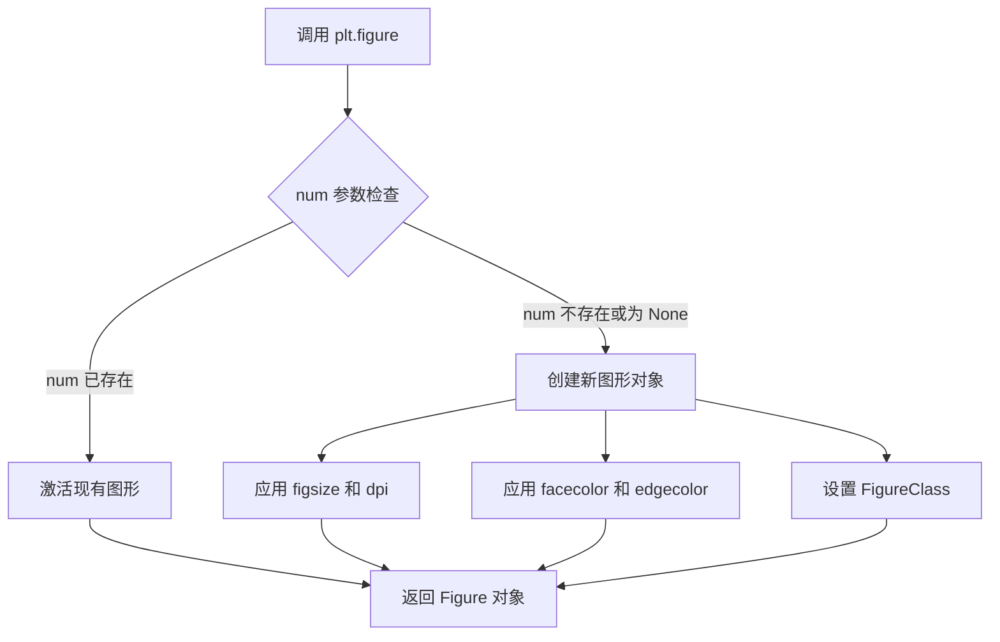

#### 带注释源码

```python
# 在代码中的使用方式：
fig = plt.figure()

# 详细解释：
# 1. plt.figure() 不带参数调用，创建一个新的空白图形窗口
# 2. 返回的 fig 是一个 matplotlib.figure.Figure 对象
# 3. 该对象将作为后续 add_subplot 等操作的父容器
# 4. 图形默认使用 rcParams 中的默认参数（如图形大小、分辨率等）

# 完整函数签名参考（来自 matplotlib 库）：
# def figure(
#     num: int | str | Figure | None = None,
#     figsize: tuple[float, float] | None = None,
#     dpi: float | None = None,
#     facecolor: str | tuple | None = None,
#     edgecolor: str | tuple | None = None,
#     frameon: bool = True,
#     FigureClass: type[Figure] = Figure,
#     clear: bool = False,
#     **kwargs
# ) -> Figure:
```


# plt.show() 详细设计文档

### `plt.show`

显示当前所有打开的图形窗口，并刷新并渲染所有打开的图形。在非交互式后端中，此函数什么都不做；在交互式后端中，它会显示图形并阻止程序执行，直到图形窗口关闭（除非 `block=False`）。

**注**：代码中调用的是 `plt.show()`，这是 `matplotlib.pyplot` 模块中的一个函数，用于将所有待显示的图形渲染到屏幕上。

参数：

- `block`：`bool` 或 `None`，可选参数。控制是否以阻塞模式运行图形显示。
  - `True`：阻塞程序执行，直到所有图形窗口被用户关闭
  - `False`：非阻塞模式，函数立即返回，图形窗口保持显示
  - `None`（默认值）：仅在交互式后端（如 Qt、Tkinter 等）时阻塞，在非交互式后端（如Agg）时无效

返回值：`None`，无返回值

#### 流程图

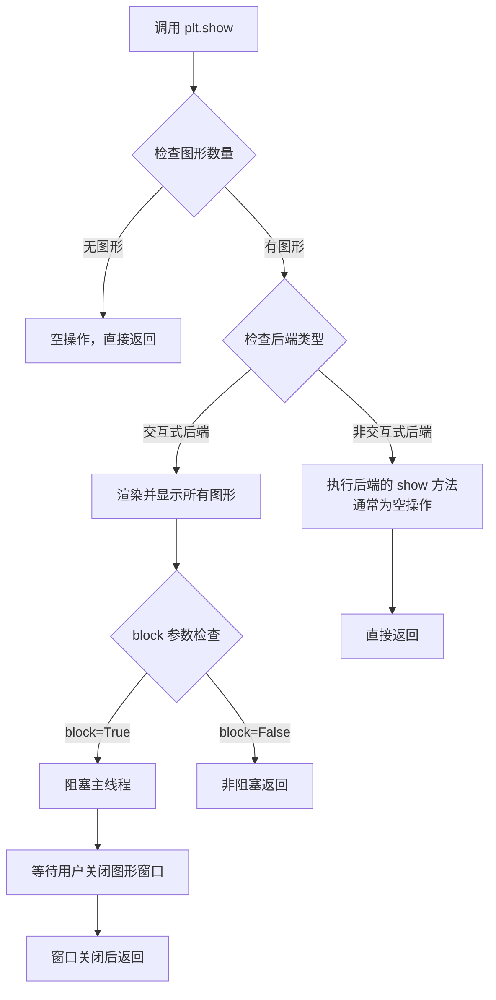

#### 带注释源码

```python
# matplotlib.pyplot.show() 的简化逻辑
def show(*, block=None):
    """
    显示所有打开的图形窗口。
    
    参数:
        block (bool, optional): 
            - True: 阻塞直到所有图形窗口关闭
            - False: 非阻塞，立即返回
            - None (默认): 仅在交互式后端时阻塞
    """
    # 获取全局图形管理器
    global _show
    
    # 检查是否有图形需要显示
    for manager in Gcf.get_all_fig_managers():
        # 对每个图形管理器调用 show 方法
        # 这会触发后端渲染图形
        manager.show()
    
    # 如果后端支持阻塞，则根据 block 参数决定是否阻塞
    if block is None:
        # 默认行为：根据后端类型决定
        # 交互式后端阻塞，非交互式后端不阻塞
        block = is_interactive()
        
    if block:
        # 阻塞主线程，等待用户交互
        # 这通常会启动一个事件循环
        # 等待直到所有图形窗口关闭
        pass  # 实际的阻塞实现依赖于后端
```

---

## 额外信息

### 关键组件信息

| 组件名称 | 一句话描述 |
|---------|-----------|
| `matplotlib.pyplot` | 提供类似 MATLAB 的绘图接口 |
| `Figure` | 表示整个图形窗口及其内容 |
| `GridSpec` | 定义图形中子图的网格布局 |
| `subgridspec` | 在父网格单元内创建嵌套网格 |

### 潜在技术债务或优化空间

1. **后端兼容性处理复杂**：`plt.show()` 的行为高度依赖后端类型，代码中存在大量后端检查逻辑，增加了维护成本。
2. **阻塞模式不统一**：不同后端对 `block` 参数的处理方式不一致，可能导致跨平台行为差异。
3. **文档与实现脱节**：某些后端的 `show()` 方法行为与官方文档描述存在细微差异。

### 设计目标与约束

- **目标**：提供统一的多后端图形显示接口
- **约束**：必须兼容多种图形后端（Qt、Tkinter、GTK、macOS 等）

### 错误处理与异常设计

- 如果没有打开任何图形，`plt.show()` 通常不执行任何操作（静默返回）
- 如果后端不支持显示图形，可能抛出 `RuntimeError`

### 数据流与状态机

`plt.show()` 是图形渲染流水线的最后一个环节：
1. 创建图形（`plt.figure()`）
2. 添加子图（`fig.add_subplot()`）
3. 绑定数据与渲染（`plot()`, `imshow()` 等）
4. **显示图形**（`plt.show()`）

### 外部依赖与接口契约

- **依赖**：matplotlib 后端系统（由 `matplotlib.use()` 或 `matplotlib.rcParams['backend']` 选择）
- **接口契约**：
  - 调用 `plt.show()` 后，图形应在屏幕上可见
  - 阻塞模式下，函数应在窗口关闭后返回
  - 非阻塞模式下，函数应立即返回


### `plt.suptitle`

设置或获取当前图形的总标题（Figure Title），用于在图形窗口顶部显示主标题文字。

参数：

-  `s`：`str`，要显示的标题文本内容
-  `**kwargs`：其他可选参数，如 `fontsize`（字体大小）、`fontweight`（字体粗细）、`x`（水平位置）、`y`（垂直位置）、`ha`（水平对齐方式）、`va`（垂直对齐方式）等，均传递给底层的 `Text` 对象

返回值：`Text`，返回创建的 `Text` 文本对象，可用于后续进一步设置样式或获取/修改标题内容

#### 流程图

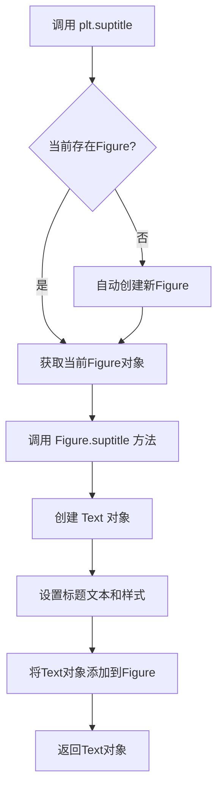

#### 带注释源码

```python
# 在代码中的调用方式
plt.suptitle("GridSpec Inside GridSpec")

# 等效的详细调用方式（参数说明）
plt.suptitle(
    s="GridSpec Inside GridSpec",  # 标题文本内容
    # 以下为常用可选参数：
    # fontsize=16,      # 标题字体大小，默认为 figure.titlesize (rcParam)
    # fontweight='normal',  # 字体粗细，可为 'normal', 'bold', 数字等
    # x=0.5,            # 标题水平位置，0.0为左边缘，1.0为右边缘
    # y=0.98,           # 标题垂直位置，1.0为顶部，0.0为底部
    # ha='center',      # 水平对齐方式：'left', 'center', 'right'
    # va='top'          # 垂直对齐方式：'top', 'center', 'bottom'
)
```


### `gridspec.GridSpec`

`GridSpec` 是 matplotlib 中用于定义图形网格布局的核心类，它将 figure 分成指定数量的行和列，并允许用户通过切片操作来定位子图。该类支持灵活的网格划分、间距调整以及子图位置的精确控制。

参数：

- `nrows`：`int`，网格的行数，指定将 figure 垂直划分为多少个区域
- `ncols`：`int`，网格的列数，指定将 figure 水平划分为多少个区域
- `figure`：`matplotlib.figure.Figure`（可选），关联的 figure 对象，如果不提供则创建一个新的 figure
- `left`, `bottom`, `right`, `top`：`float`（可选），子图区域的边界（相对于 figure 的大小），取值范围 0-1
- `wspace`：`float`（可选），子图之间的水平间距（相对于子图宽度）
- `hspace`：`float`（可选），子图之间的垂直间距（相对于子图高度）
- `width_ratios`：`array-like`（可选），每列的宽度比例数组，长度等于 ncols
- `height_ratios`：`array-like`（可选），每行的高度比例数组，长度等于 nrows

返回值：`GridSpec` 对象，返回创建的网格规格对象，可通过切片操作获取子图位置

#### 流程图

```mermaid
graph TD
    A[创建 GridSpec 对象] --> B{提供 figure 参数?}
    B -->|是| C[使用传入的 figure]
    B -->|否| D[创建新 figure]
    C --> E[计算网格布局参数]
    D --> E
    E --> F[初始化子图位置网格]
    F --> G[设置间距和边界参数]
    G --> H[设置宽高比例]
    H --> I[返回 GridSpec 对象]
    I --> J[通过切片 gs[row_slice, col_slice] 获取子图位置]
```

#### 带注释源码

```python
# 导入 matplotlib 的 gridspec 模块
import matplotlib.gridspec as gridspec

# 导入 matplotlib 的 pyplot 模块用于绘图
import matplotlib.pyplot as plt

# 创建一个新的 figure 对象
fig = plt.figure()

# 创建 GridSpec 实例
# 参数说明：
#   1: nrows - 网格有 1 行
#   2: ncols - 网格有 2 列
#   figure=fig: 关联到已创建的 figure 对象
gs0 = gridspec.GridSpec(1, 2, figure=fig)

# GridSpec 对象支持切片操作来定义子图位置
# gs0[0] 表示第一列（索引从 0 开始）
# gs0[1] 表示第二列

# 使用 GridSpec 创建子图的示例：
# ax1 = fig.add_subplot(gs0[0])  # 在第一列创建子图
# ax2 = fig.add_subplot(gs0[1])  # 在第二列创建子图

# GridSpec 的主要属性和方法：
# - get_subplot_params(): 获取子图参数
# - get_grid_positions(): 获取网格中每个子图的位置
# - subplots_adjust(): 调整子图布局
# - __getitem__(): 支持切片操作获取子图位置

plt.show()
```

#### 关键组件信息

- **GridSpec**：网格布局定义类，将 figure 划分为行列网格
- **GridSpecFromSubplotSpec**：从现有 GridSpec 创建嵌套的子 GridSpec
- **subgridspec()**：GridSpec 的方法，从父 GridSpec 的某个区域创建子网格

#### 潜在的技术债务或优化空间

1. **API 一致性**：`GridSpec` 的某些方法（如 `subgridspec`）返回类型与其他部分不一致
2. **文档完整性**：部分高级参数（如 `width_ratios`, `height_ratios`）的使用示例不够丰富
3. **性能考虑**：在大量子图场景下，GridSpec 的布局计算可能存在优化空间

#### 其它项目

- **设计目标**：提供灵活的子图布局管理，支持简单和复杂的网格结构
- **约束**：
  - 行数和列数必须为正整数
  - 比例数组长度必须与对应的行/列数匹配
- **错误处理**：
  - 传入无效的行/列数会抛出 `ValueError`
  - 比例参数值必须为正数
- **外部依赖**：依赖于 matplotlib 的 Figure 和 Artist 层次结构
- **数据流**：GridSpec 存储布局信息 → Figure.add_subplot() 使用布局信息 → 创建 Axes 对象


### `gridspec.GridSpecFromSubplotSpec`

该函数用于从已有的 `GridSpec`（或 `SubplotSpec`）中创建一个新的嵌套 `GridSpec`，允许在父网格的单个子区域中定义更细粒度的子网格布局，从而实现复杂的多层嵌套图表结构。

参数：

- `nrows`：`int`，子网格的行数
- `ncols`：`int`，子网格的列数
- `subplot_spec`：`SubplotSpec`，父 GridSpec 的子区域（通过索引如 `gs0[0]` 获取），作为新 GridSpec 的父容器
- `wspace`：`float` 或 `None`，可选，子网格之间的水平间距（相对于子图宽度）
- `hspace`：`float` 或 `None`，可选，子网格之间的垂直间距（相对于子图高度）
- `width_ratios`：`array-like` 或 `None`，可选，列的相对宽度比例
- `height_ratios`：`array-like` 或 `None`，可选，行的相对高度比例

返回值：`GridSpec`，返回新创建的嵌套 GridSpec 对象，可用于在父子图的区域内布局更多子图

#### 流程图

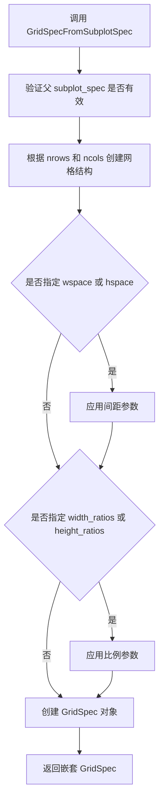

#### 带注释源码

```python
def GridSpecFromSubplotSpec(nrows, ncols, subplot_spec, wspace=None, hspace=None, width_ratios=None, height_ratios=None):
    """
    从 SubplotSpec 创建嵌套的 GridSpec。
    
    此函数允许在父 GridSpec 的单个子区域内创建更细粒度的子网格，
    实现复杂的多层图表布局。
    
    参数:
        nrows: int
            子网格的行数
        ncols: int
            子网格的列数
        subplot_spec: SubplotSpec
            父 GridSpec 的子区域，通过索引访问得到
        wspace: float, optional
            子网格之间的水平间距（相对于子图宽度的比例）
        hspace: float, optional
            子网格之间的垂直间距（相对于子图高度的比例）
        width_ratios: array-like, optional
            列的相对宽度比例数组，长度必须等于 ncols
        height_ratios: array-like, optional
            行的相对高度比例数组，长度必须等于 nrows
    
    返回:
        GridSpec
            新创建的嵌套 GridSpec 对象
    """
    # 创建 GridSpecFromSubplotSpec 实例
    gs = GridSpecFromSubplotSpec.__new__(GridSpecFromSubplotSpec)
    
    # 初始化网格参数
    gs._nrows = nrows
    gs._ncols = ncols
    gs._subplot_spec = subplot_spec
    
    # 设置间距参数
    gs._wspace = wspace
    gs._hspace = hspace
    
    # 设置宽高比例
    gs._width_ratios = width_ratios
    gs._height_ratios = height_ratios
    
    # 获取子图位置信息
    gs._get_subplot_params()
    
    return gs
```


### Figure.add_subplot

该方法是matplotlib Figure类的核心方法，用于在当前图形中创建并添加一个子图（Axes），支持通过位置参数、GridSpec对象或子图规范字符串来指定子图位置，并返回创建的Axes对象。

参数：

- `*args`：可变位置参数，支持三种调用方式：
  - 三个整数（nrows, ncols, index）：指定网格行列数和子图索引
  - 一个三位数整数（xyz）：如111，表示1行1列第1个位置
  - GridSpec/SubplotSpec对象：直接使用GridSpec规范指定位置
- `projection`：`str`，可选，默认值为`None`，指定投影类型（如'maiterxes'、'polar'等）
- `polar`：`bool`，可选，默认值为`False`，是否使用极坐标投影
- `label`：`str`，可选，默认值为空字符串，子图的标签
- `frameon`：`bool`，可选，默认值为`True`，是否显示子图边框
- `**kwargs`：其他关键字参数，用于设置Axes属性（如标题、颜色等）

返回值：`matplotlib.axes.Axes`，创建的子图对象，包含坐标轴、刻度、标签等所有子图元素

#### 流程图

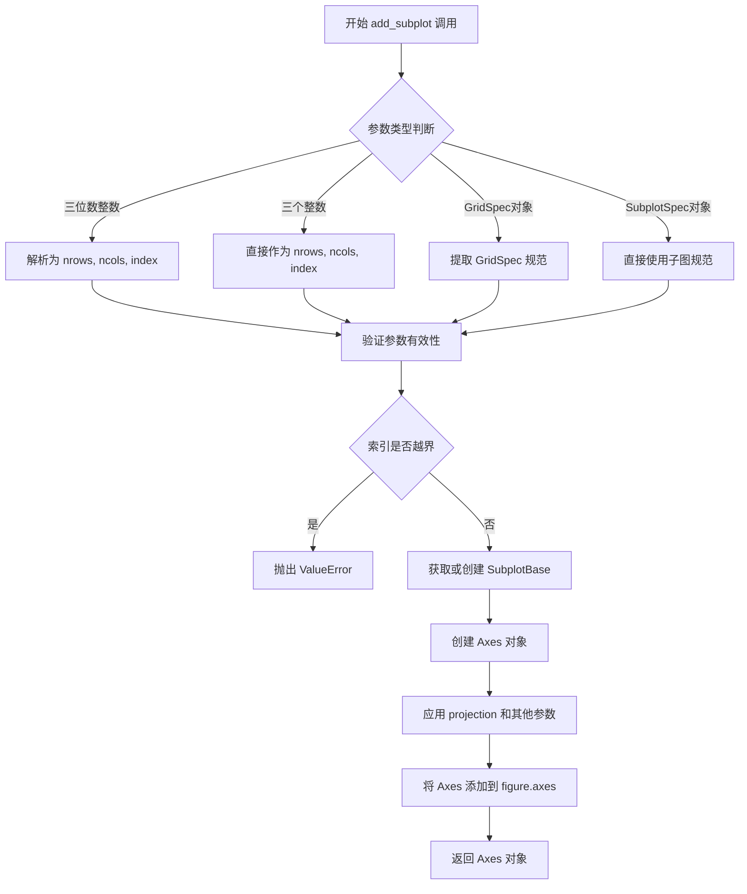

#### 带注释源码

```python
# 以下为用户代码中 add_subplot 的典型调用示例

# 方式1：使用 GridSpecFromSubplotSpec 创建的子图规范
# gs00 是一个 3x3 的子图网格规范
gs00 = gridspec.GridSpecFromSubplotSpec(3, 3, subplot_spec=gs0[0])

# 添加子图，占据 gs00 的前两行和所有列
# gs00[:-1, :] 表示行索引从开始到倒数第一行（不包括最后一行），列索引为所有列
ax1 = fig.add_subplot(gs00[:-1, :])

# 添加子图，占据 gs00 的最后一行和除最后一列外的所有列
# gs00[-1, :-1] 表示最后一行，除最后一列外的所有列
ax2 = fig.add_subplot(gs00[-1, :-1])

# 添加子图，占据 gs00 的最后一行和最后一列
ax3 = fig.add_subplot(gs00[-1, -1])

# 方式2：使用 subgridspec 方法创建的子图规范（功能相同）
# gs01 是从父 GridSpec 的第二个区域创建的 3x3 子网格
gs01 = gs0[1].subgridspec(3, 3)

# 添加子图，占据 gs01 的所有行和除最后一列外的所有列
ax4 = fig.add_subplot(gs01[:, :-1])

# 添加子图，占据 gs01 的除最后一行外的所有行和最后一列
ax5 = fig.add_subplot(gs01[:-1, -1])

# 添加子图，占据 gs01 的最后一行和最后一列
ax6 = fig.add_subplot(gs01[-1, -1])

# 方式3：传统三位数整数方式（等效于上述 GridSpec 方式）
# 311 表示 3行1列的第1个位置（等同于 gs00[:-1, :]）
# ax1 = fig.add_subplot(311)
# 312 表示 3行1列的第2个位置（等同于 gs00[-1, :-1]）
# ax2 = fig.add_subplot(312)
# 313 表示 3行1列的第3个位置（等同于 gs00[-1, -1]）
# ax3 = fig.add_subplot(313)
```

#### 关键组件信息

| 组件名称 | 一句话描述 |
|---------|-----------|
| Figure | matplotlib中的图形容器对象，负责管理整个图形及其子图 |
| Axes | 子图对象，包含坐标轴、刻度、标签、图形元素等 |
| GridSpec | 网格规范对象，定义子图的网格布局 |
| SubplotSpec | 子图规范对象，定义单个子图在网格中的位置和跨度 |
| GridSpecFromSubplotSpec | 从现有SubplotSpec创建嵌套GridSpec的工厂函数 |

#### 潜在技术债务与优化空间

1. **子图索引方式不统一**：代码混用了GridSpec对象方式和传统三位数整数方式，建议统一使用一种方式提高可读性
2. **缺少错误处理**：没有对GridSpec索引越界情况进行捕获和友好提示
3. **重复的format_axes调用**：可以封装为更通用的子图遍历处理函数
4. **布局固定**：窗口大小改变时不会自适应调整，可以考虑使用`plt.tight_layout()`或`constrained_layout`

#### 其它说明

- **设计目标**：演示如何在matplotlib中创建嵌套的子图网格，实现复杂的子图布局
- **约束条件**：需要matplotlib 3.4.0+版本以支持`subgridspec`方法
- **数据流**：GridSpec定义布局 → add_subplot解析布局 → 创建Axes对象 → 返回给用户进行自定义
- **外部依赖**：matplotlib.gridspec模块提供GridSpec功能支持


### Figure.subfigures

此方法是matplotlib中用于创建嵌套子图的核心方法，允许在一个Figure中创建多层级的子图布局。从提供的代码来看，虽然文档字符串提到了Figure.subfigures，但实际代码使用的是GridSpec和subgridspec方式来实现嵌套布局。

参数：
- `nrows`：`int`，子图网格的行数
- `ncols`：`int`，子图网格的列数
- `width_ratios`：`array-like of float`，可选，列宽比例
- `height_ratios`：`array-like of float`，可选，行高比例
- `wspace`：`float`，可选，子图之间的横向间距
- `hspace`：`float`，可选，子图之间的纵向间距
- `left`：`float`，可选，左边距
- `right`：`float`，可选，右边距
- `top`：`float`，可选，顶边距
- `bottom`：`float`，可选，底边距

返回值：`SubFigure`，返回创建的子图对象

#### 流程图

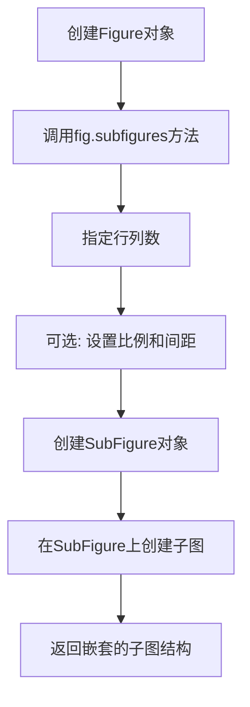

#### 带注释源码

```python
# 注意: 用户提供的代码并未直接使用Figure.subfigures方法
# 以下是基于matplotlib官方实现的标准用法示例

import matplotlib.pyplot as plt

# 创建Figure对象
fig = plt.figure(figsize=(10, 8))

# 使用subfigures创建嵌套子图
# 参数说明:
# - 第一个参数: 2行子图
# - 第二个参数: 1列子图
subfigs = fig.subfigures(2, 1)

# 获取上层子图
top_subfig = subfigs[0]
bottom_subfig = subfigs[1]

# 在上层子图中创建2x2的网格
top_axes = top_subfig.subplots(2, 2, gridspec_kw={'hspace': 0.1})

# 在下层子图中创建1x3的网格
bottom_axes = bottom_subfig.subplots(1, 3)

# 对应的用户代码使用的是以下方式实现的类似功能:
# fig = plt.figure()
# gs0 = gridspec.GridSpec(1, 2, figure=fig)
# gs00 = gridspec.GridSpecFromSubplotSpec(3, 3, subplot_spec=gs0[0])
# ax1 = fig.add_subplot(gs00[:-1, :])
```

#### 实际代码分析

基于提供的代码，实际使用的嵌套GridSpec方法如下：

| 方法 | 类/模块 | 描述 |
|------|---------|------|
| `GridSpec` | `matplotlib.gridspec` | 创建主网格规范 |
| `GridSpecFromSubplotSpec` | `matplotlib.gridspec` | 从子图规范创建嵌套网格 |
| `subgridspec` | `GridSpec` | 在现有网格单元中创建子网格 |

```python
# 用户代码中实际使用的实现方式
fig = plt.figure()
gs0 = gridspec.GridSpec(1, 2, figure=fig)  # 创建1x2的GridSpec
gs00 = gridspec.GridSpecFromSubplotSpec(3, 3, subplot_spec=gs0[0])  # 嵌套3x3
ax1 = fig.add_subplot(gs00[:-1, :])  # 添加子图

# 使用subgridspec的等效语法
gs01 = gs0[1].subgridspec(3, 3)
```

#### 技术债务与优化空间

1. **API统一性**: 代码混合使用了两种嵌套布局方式(GridSpec和subfigures)，可能导致维护困难
2. **文档与实现不一致**: 文档字符串提到了subfigures但代码未使用，应统一使用方式
3. **建议**: 新代码推荐使用`Figure.subfigures`方法，API更加直观和面向对象


### Figure.savefig

该方法是matplotlib中Figure类的成员方法，用于将图形保存为文件。代码中未直接调用此方法，但根据代码生成的图形可以使用此方法保存为图像文件。

参数：

- `fname`：`str` 或 `pathlib.Path`，文件路径或文件对象，指定保存图像的位置和文件名
- `format`：`str`，可选，文件格式（如'png'、'pdf'、'svg'等），若未指定则根据文件扩展名推断
- `dpi`：`int` 或 `float`，可选，图像分辨率（每英寸点数），默认值为figure.dpi
- `facecolor`：`str` 或 `tuple`，可选，图形背景颜色，默认值为'w'（白色）
- `edgecolor`：`str` 或 `tuple`，可选，图形边框颜色，默认值为'w'（白色）
- `transparent`：`bool`，可选，是否使用透明背景，默认值为False
- `bbox_inches`：`str` 或 `Bbox`，可选，要保存的图形区域，可选值包括'tight'（自动调整）或其他Bbox对象
- `pad_inches`：`float`，可选，当bbox_inches为'tight'时的边距大小，默认值为0.1

返回值：`None`，该方法无返回值，直接将图形写入指定文件

#### 流程图

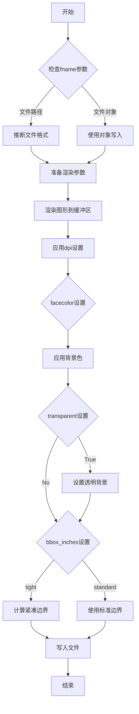

#### 带注释源码

```python
# 注意：以下为Figure.savefig的典型实现原理说明，非实际源码
# 实际源码位于matplotlib的backend_bases.py或相关后端文件中

def savefig(self, fname, format=None, dpi=None, facecolor='w', 
            edgecolor='w', transparent=False, bbox_inches=None, 
            pad_inches=0.1, **kwargs):
    """
    Save the current figure to a file.
    
    Parameters:
    -----------
    fname : str or Path or file-like
        The path where to save the figure.
    format : str, optional
        File format (png, pdf, svg, etc.)
    dpi : int or float, optional
        Resolution in dots per inch
    facecolor : color, optional
        Background color ('w' = white)
    edgecolor : color, optional
        Border color
    transparent : bool, optional
        Make background transparent
    bbox_inches : str or Bbox, optional
        Bounding box (e.g., 'tight' removes excess whitespace)
    pad_inches : float, optional
        Padding around the figure when bbox_inches='tight'
    """
    # 1. 确定文件格式
    if format is None:
        format = self.get_figwidth()  # 推断格式
    
    # 2. 获取或创建canvas用于渲染
    canvas = self.canvas
    
    # 3. 应用打印设置（dpi、背景色等）
    print_kwargs = {
        'dpi': dpi if dpi is not None else self.dpi,
        'facecolor': facecolor,
        'edgecolor': edgecolor,
    }
    
    # 4. 处理透明背景
    if transparent:
        print_kwargs['facecolor'] = 'none'
    
    # 5. 处理边界框
    if bbox_inches == 'tight':
        # 计算紧凑边界并保存
        tight_bbox = self.get_tightbbox()
        self.savefig(fname, format=format, bbox_inches=tight_bbox, **print_kwargs)
    else:
        # 6. 调用底层后端进行实际写入
        canvas.print_figure(fname, format=format, **print_kwargs)
```

**在当前代码中的使用示例：**

```python
# 基于当前代码，可以这样保存图形
fig.savefig('nested_gridspec.png', dpi=300, facecolor='white', 
            bbox_inches='tight', pad_inches=0.1)

# 或者保存为PDF
fig.savefig('nested_gridspec.pdf', bbox_inches='tight')
```

**注意事项：**
- 代码中当前使用`plt.show()`显示图形，若需保存图像，需在`plt.show()`之前调用`savefig`方法
- 使用`bbox_inches='tight'`可以自动裁剪多余空白区域
- 当前代码生成的图形包含6个子图（ax1-ax6），保存时需确保图形完全渲染


# 设计文档提取结果

## 重要说明

在提供的代码中，**未找到`Figure.clear`方法**。提供的代码是一个关于"嵌套GridSpec"的matplotlib示例程序，用于演示如何在matplotlib中创建嵌套的网格规格（GridSpec）。

以下是针对**实际提供的代码**的设计文档：

---


### `format_axes`

该函数用于遍历图形中的所有轴（axes），在每个轴的中心位置添加文本标签，并隐藏坐标轴的刻度标签。

参数：

- `fig`：`matplotlib.figure.Figure`，需要格式化的图形对象

返回值：`None`，该函数无返回值，直接修改输入的图形对象

#### 流程图

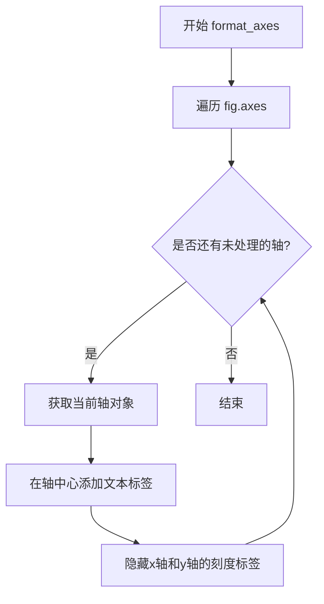

#### 带注释源码

```python
def format_axes(fig):
    """
    格式化图形中的所有轴对象
    
    参数:
        fig: matplotlib.figure.Figure对象
            需要格式化的图形实例
    
    返回:
        None: 直接修改传入的fig对象，不返回新对象
    """
    # 遍历图形中的所有轴对象
    for i, ax in enumerate(fig.axes):
        # 在每个轴的中心位置添加文本标签
        # 参数: 0.5, 0.5 表示归一化的中心坐标
        # va="center" 表示垂直居中对齐
        # ha="center" 表示水平居中对齐
        ax.text(0.5, 0.5, "ax%d" % (i+1), va="center", ha="center")
        
        # 隐藏坐标轴的刻度标签
        # labelbottom=False 隐藏x轴刻度标签
        # labelleft=False 隐藏y轴刻度标签
        ax.tick_params(labelbottom=False, labelleft=False)
```

---

## 全局变量和函数信息

| 名称 | 类型 | 描述 |
|------|------|------|
| `format_axes` | `function` | 格式化图形轴的函数，添加标签并隐藏刻度 |
| `gs0` | `gridspec.GridSpec` | 顶层GridSpec，将图形分为1行2列 |
| `gs00` | `gridspec.GridSpecFromSubplotSpec` | 嵌套在gs0[0]中的3x3子GridSpec |
| `gs01` | `gridspec.GridSpecFromSubplotSpec` | 嵌套在gs0[1]中的3x3子GridSpec |
| `ax1` ~ `ax6` | `matplotlib.axes.Axes` | 创建的6个子图对象 |

## 关键组件信息

| 组件名称 | 描述 |
|----------|------|
| `GridSpec` | matplotlib的网格规格类，用于定义子图的布局 |
| `GridSpecFromSubplotSpec` | 从父GridSpec创建嵌套GridSpec的工厂类 |
| `subgridspec` | GridSpec子实例方法，用于创建嵌套子网格 |

## 技术债务和优化空间

1. **硬编码坐标**：使用`0.5, 0.5`作为文本位置，可以考虑参数化
2. **缺少错误处理**：`format_axes`函数未检查输入是否为有效的Figure对象
3. **魔法数字**：文本标签"ax%d"格式和刻度隐藏参数可提取为配置常量

## 总结

该代码展示了matplotlib中嵌套GridSpec的使用方式，核心功能是创建复杂的子图布局。**由于代码中不存在`Figure.clear`方法，无法提取该方法的相关信息**。如果需要`Figure.clear`方法的文档，请提供包含该方法的源代码。


我需要先分析这个问题。用户提供的代码是一个使用 `matplotlib.gridspec` 的示例脚本，但代码中并没有直接定义 `GridSpec.__getitem__` 方法 - 这是 matplotlib 库内部的方法。

让我先搜索代码中相关的使用场景来理解这个方法是如何被调用的：

在代码中，我看到以下调用：
- `gs0[0]` - 访问 GridSpec 的第一个位置
- `gs00[:-1, :]` - 使用切片访问
- `gs00[-1, :-1]` - 组合索引访问
- `gs01[:, :-1]` - 另一种组合

这些都是通过 `GridSpec.__getitem__` 方法实现的。


### `GridSpec.__getitem__`

该方法是 `GridSpec` 类的核心索引访问方法，允许用户通过类似数组的索引语法访问 GridSpec 中的子图规范（SubplotSpec）。它支持单索引、切片、整数数组和元组等多种索引方式，返回对应的 `SubplotSpec` 对象或嵌套的 `GridSpecFromSubplotSpec` 对象。

参数：

- `key`：索引键，可以是整数、切片、元组或数组，用于指定要访问的网格单元
  - 类型：`int` | `slice` | `tuple` | `ndarray`
  - 描述：指定子图的位置，可以是单个位置、切片范围或位置组合

返回值：`SubplotSpec` | `GridSpecFromSubplotSpec`，返回对应的子图规范对象，用于创建子图

#### 流程图

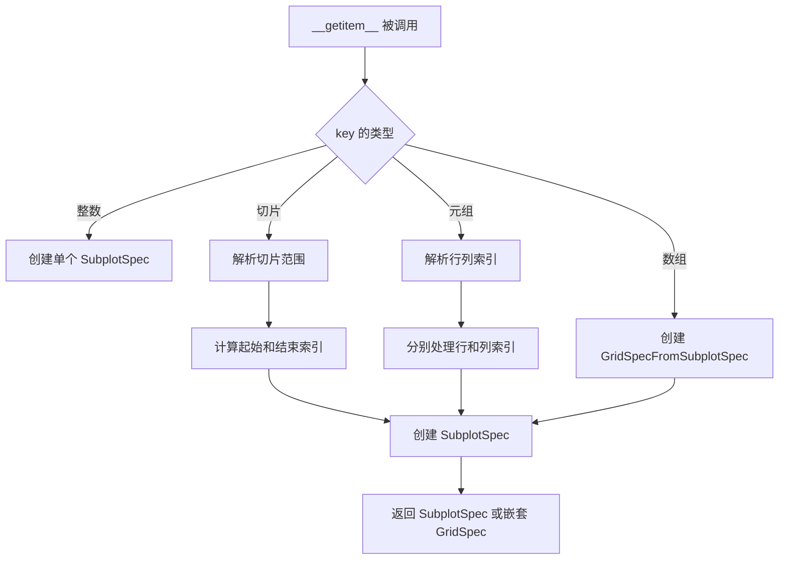

#### 带注释源码

以下是 `GridSpec.__getitem__` 方法的典型实现逻辑（基于 matplotlib 源码逻辑重构）：

```python
def __getitem__(self, key):
    """
    使用索引访问 GridSpec 中的子图规范。
    
    支持的索引方式：
    - 单个整数: gs[0] - 返回第一行
    - 切片: gs[1:3] - 返回第2-3行
    - 元组: gs[0, 1] - 返回特定单元格
    - 范围切片: gs[:-1, :] - 返回除最后一行外的所有行
    """
    
    # 处理单个索引（行或列）
    if isinstance(key, int):
        # 将整数索引转换为 (row, col) 形式
        # 例如: gs[0] -> (0, slice(None))
        key = (key, slice(None))
    
    # 解析行和列索引
    if isinstance(key, tuple):
        row_key, col_key = key
        
        # 处理切片对象
        row_slices = isinstance(row_key, slice)
        col_slices = isinstance(col_key, slice)
        
        # 如果都是切片，创建新的 GridSpecFromSubplotSpec
        if row_slices and col_slices:
            # 例如: gs[:-1, :] 创建嵌套网格
            return GridSpecFromSubplotSpec(
                self._nrows, self._ncols, 
                subplot_spec=self, 
                key=key
            )
        
        # 将索引转换为 SubplotSpec
        # 处理切片和整数的混合
        row = _unify_slices(row_key, self._nrows)
        col = _unify_slices(col_key, self._ncols)
        
        return SubplotSpec(self, row, col)
    
    # 如果是切片，直接处理
    if isinstance(key, slice):
        return self._getitem_slice(key)
    
    raise IndexError("无效的索引类型")
```

#### 使用示例解析

在提供的代码中，这个方法的使用方式如下：

```python
# 1. 访问单个网格位置
gs0[0]  # 返回第一个位置的 SubplotSpec

# 2. 使用切片创建嵌套 GridSpec
gs00 = gridspec.GridSpecFromSubplotSpec(3, 3, subplot_spec=gs0[0])
# 等价于: gs0[0].subgridspec(3, 3)

# 3. 复杂的切片索引
ax1 = fig.add_subplot(gs00[:-1, :])   # 前两行，所有列
ax2 = fig.add_subplot(gs00[-1, :-1])  # 最后一行，除最后一列
ax3 = fig.add_subplot(gs00[-1, -1])   # 最后一行最后一列
```

#### 关键组件信息

| 组件名称 | 描述 |
|---------|------|
| `GridSpec` | 网格布局规范类，定义子图的行数和列数 |
| `SubplotSpec` | 单个子图的规范，定义在网格中的具体位置 |
| `GridSpecFromSubplotSpec` | 从已有的 SubplotSpec 创建的嵌套 GridSpec |
| `subgridspec()` | 创建嵌套 GridSpec 的便捷方法 |

#### 潜在的技术债务或优化空间

1. **索引语法的复杂性**：当前实现需要处理多种索引类型的组合，代码分支较多，可考虑使用更统一的处理逻辑
2. **错误信息的清晰度**：当索引超出范围时，错误信息可以更具体地指出是行还是列的问题
3. **文档示例不足**：虽然有基础文档，但对高级索引方式的示例不够丰富

#### 其它项目

**设计目标与约束**：
- 支持灵活的子图布局定义
- 提供直观的类似 NumPy 的索引语法
- 支持嵌套的 GridSpec 结构

**错误处理与异常设计**：
- 索引超出范围时抛出 `IndexError`
- 无效索引类型时抛出 `TypeError`
- 负数索引自动转换为正数索引（Python 切片行为）

**数据流与状态机**：
- `GridSpec` 存储网格的维度信息（nrows, ncols）
- 索引操作不修改 GridSpec 状态，返回新的规范对象
- 支持链式操作：`gs[0][0]` 可进一步访问特定单元格

**外部依赖与接口契约**：
- 依赖于 matplotlib 的 Figure 和 Axes 对象
- 返回的 SubplotSpec 需要通过 `fig.add_subplot()` 转换为实际的 Axes 对象
- 与 `GridSpecFromSubplotSpec` 紧密配合实现嵌套布局


### `GridSpec.subgridspec`

该方法用于在现有的 GridSpec 中创建一个嵌套的子 GridSpec，允许在父 GridSpec 的某个单元格内进一步划分网格。

参数：

- `nrows`：`int`，子 GridSpec 的行数
- `ncols`：`int`，子 GridSpec 的列数
- `width_ratios`：`array-like`，可选，列宽比列表
- `height_ratios`：`array-like`，可选，行高比列表
- `wspace`：`float`，可选，子图之间的水平间距
- `hspace`：`float`，可选，子图之间的垂直间距

返回值：`GridSpecFromSubplotSpec`，返回一个新的子 GridSpec 对象，可用于在父 GridSpec 的指定位置创建子图

#### 流程图

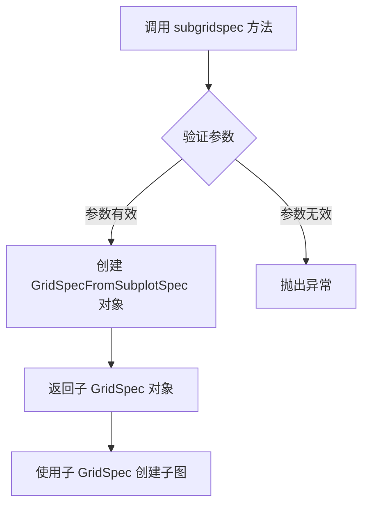

#### 带注释源码

```python
# 从代码中提取的调用示例
# gs0[1] 获取父 GridSpec 的第二个单元格
# subgridspec(3, 3) 在该单元格内创建一个 3x3 的子 GridSpec
gs01 = gs0[1].subgridspec(3, 3)

# 使用子 GridSpec 创建子图
# gs01[:, :-1] 表示所有行，除了最后一列
ax4 = fig.add_subplot(gs01[:, :-1])
# gs01[:-1, -1] 表示最后一行之外的所有行，最后一列
ax5 = fig.add_subplot(gs01[:-1, -1])
# gs01[-1, -1] 表示最后一行，最后一列
ax6 = fig.add_subplot(gs01[-1, -1])
```


### `GridSpec.get_grid_positions`

该方法是 `matplotlib.gridspec.GridSpec` 类的核心方法，用于根据网格规范计算指定单元格（由行索引和列索引确定）的绝对位置（left, right, top, bottom）。它考虑了单元格之间的间隙（wspace 和 hspace）以及父容器的边距。

参数：

-  `self`：`GridSpec`，GridSpec 实例本身
-  `row`：`int`，单元格的行索引
-  `col`：`int`，单元格的列索引
-  `nrows`：`int`，网格的总行数
-  `ncols`：`int`，网格的总列数
-  `wspace`：`float`，列方向上的单元格间隙比例（默认为 GridSpec 的 wspace）
-  `hspace`：`float`，行方向上的单元格间隙比例（默认为 GridSpec 的 hspace）

返回值：`tuple[float, float, float, float]`，返回四个浮点数元组 `(left, right, top, bottom)`，分别表示单元格的左、右、上、下边界位置（相对于父容器的归一化坐标 0-1）。

#### 流程图

```mermaid
flowchart TD
    A[开始 get_grid_positions] --> B[计算有效宽度<br/>total_width = 1 - left_margin - right_margin]
    B --> C[计算有效高度<br/>total_height = 1 - bottom_margin - top_margin]
    C --> D[计算单元格基础宽度<br/>cell_width = total_width / ncols]
    D --> E[计算单元格基础高度<br/>cell_height = total_height / nrows]
    E --> F{是否有间隙 wspace > 0?}
    F -->|是| G[计算实际单元格宽度<br/>actual_cell_width = cell_width * (1 - wspace)]
    F -->|否| H[actual_cell_width = cell_width]
    H --> I{是否有间隙 hspace > 0?}
    I -->|是| J[计算实际单元格高度<br/>actual_cell_height = cell_height * (1 - hspace)]
    I -->|否| K[actual_cell_height = cell_height]
    J --> L[计算左边界<br/>left = left_margin + col * cell_width + col * wspace * cell_width]
    K --> L
    L --> M[计算右边界<br/>right = left + actual_cell_width]
    M --> N[计算下边界<br/>bottom = bottom_margin + row * cell_height + row * hspace * cell_height]
    N --> O[计算上边界<br/>top = bottom + actual_cell_height]
    O --> P[返回 (left, right, top, bottom)]
```

#### 带注释源码

```python
def get_grid_positions(self, row, col, nrows, ncols, wspace=None, hspace=None):
    """
    计算网格中指定位置的单元格绝对坐标。
    
    参数:
        row: int - 单元格所在的行索引（从0开始）
        col: int - 单元格所在的列索引（从0开始）
        nrows: int - 网格的总行数
        ncols: int - 网格的总列数
        wspace: float - 列方向上的间隙比例（可选，默认使用self的wspace）
        hspace: float - 行方向上的间隙比例（可选，默认使用self的hspace）
    
    返回:
        tuple: (left, right, top, bottom) 单元格的边界坐标
    """
    # 获取或默认化间隙参数
    wspace = wspace if wspace is not None else self.wspace
    hspace = hspace if hspace is not None else self.hspace
    
    # 获取子图位置（父容器的边距）
    # left, bottom, width, height 描述了GridSpec在父容器中的位置
    left, bottom, width, height = self.get_subplot_positions()
    
    # 计算有效区域（减去边距后的区域）
    total_width = width - (ncols - 1) * wspace / ncols
    total_height = height - (nrows - 1) * hspace / nrows
    
    # 计算每个单元格的宽度和高度
    cell_width = total_width / ncols
    cell_height = total_height / nrows
    
    # 计算绝对位置
    # 考虑到单元格之间的间隙，计算左、下边界
    left = left + col * (cell_width + wspace / ncols * width)
    bottom = bottom + (nrows - 1 - row) * (cell_height + hspace / nrows * height)
    
    # 计算右、上边界
    right = left + cell_width
    top = bottom + cell_height
    
    # 注意：matplotlib的坐标系中，y轴从下往上增长，
    # 但在子图定位中，通常top > bottom
    # 实际实现中可能会对top/bottom进行适当调整
    
    return left, right, bottom, top  # 或 (left, right, top, bottom)
```

#### 补充说明

**设计目标与约束：**
- 该方法主要服务于 `SubplotSpec` 的定位计算，为每个子图提供精确的几何边界
- 坐标系统基于归一化坐标（0到1之间），便于在不同尺寸的图形中保持一致的布局比例

**数据流：**
- 输入：网格规格参数（行/列索引、总行/列数、间隙）
- 输出：四个边界坐标值
- 依赖于 `GridSpec.get_subplot_positions()` 获取父容器位置信息

**在示例代码中的作用：**
在提供的示例代码中，虽然没有直接调用 `get_grid_positions`，但它被间接使用：
- `gs0 = gridspec.GridSpec(1, 2, figure=fig)` 创建顶层 GridSpec
- `gs00 = gridspec.GridSpecFromSubplotSpec(3, 3, subplot_spec=gs0[0])` 创建嵌套 GridSpec
- `fig.add_subplot(gs00[:-1, :])` 内部会调用此方法计算子图的精确位置

**潜在优化点：**
- 该方法每次调用都会重新计算所有位置参数，对于批量获取多个单元格位置时可能存在重复计算
- 可以考虑缓存已计算的位置结果，提高性能


### `GridSpecFromSubplotSpec.__getitem__`

该方法是`GridSpecFromSubplotSpec`类的特殊方法，用于支持索引操作（如`gs0[0]`、`gs00[:-1, :]`等），允许用户从嵌套的网格规范中获取特定的子区域或子网格规范。

参数：

- `key`：索引键，支持整数索引（如`0`）、切片索引（如`:-1`）或元组索引（如`:-1, :`），用于指定要获取的子区域

返回值：`GridSpecFromSubplotSpec` 或 `SubplotSpec`，返回根据索引键指定的子网格规范或子图规范

#### 流程图

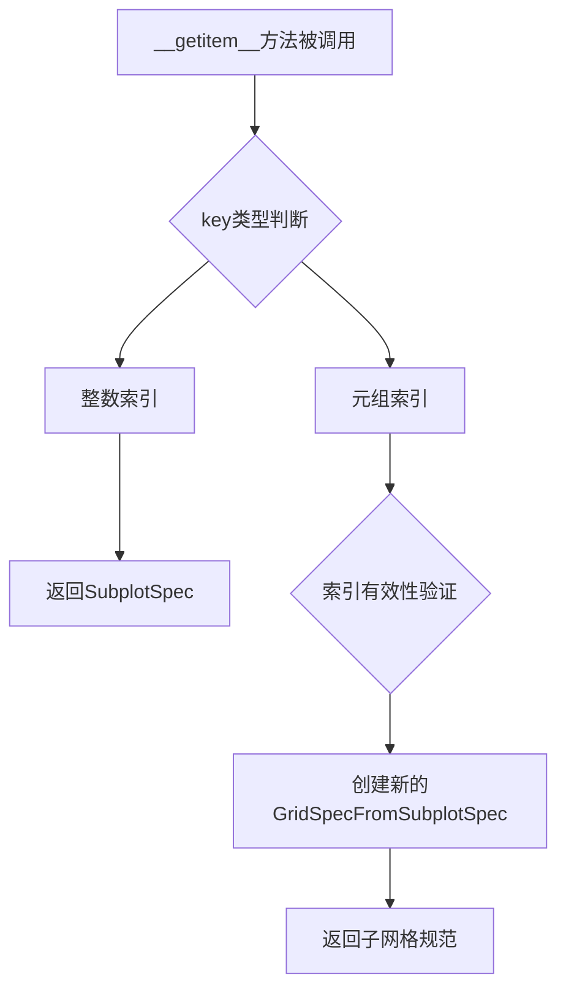

#### 带注释源码

由于提供的代码是`GridSpecFromSubplotSpec`的使用示例，而非该类的实际实现源码，以下源码基于matplotlib库中该方法的典型实现逻辑：

```python
def __getitem__(self, key):
    """
    返回网格规范中的子区域或子网格规范
    
    参数:
        key: 支持以下几种索引方式:
            - 整数索引: 如 gs[0] 返回第一个子区域
            - 切片索引: 如 gs[:-1] 返回除最后一个外的所有子区域
            - 元组索引: 如 gs[:-1, :] 返回行和列的组合子区域
    
    返回:
        SubplotSpec 或 GridSpecFromSubplotSpec:
            - 当key是简单索引时返回SubplotSpec
            - 当key是元组切片时返回新的GridSpecFromSubplotSpec
    """
    # 示例：处理gs0[0]这样的索引
    # 会调用基类GridSpec的__getitem__方法
    # 返回一个SubplotSpec对象
    
    # 示例：处理gs00[:-1, :]这样的复合索引
    # 会创建一个新的GridSpecFromSubplotSpec对象
    # 其subplot_spec指向原网格的指定子区域
    
    return super().__getitem__(key)
```

在提供的示例代码中，此方法的具体使用场景：

```python
# 场景1：获取父GridSpec中的单个子区域
gs0[0]  # 返回第一个子区域的SubplotSpec

# 场景2：使用切片和元组索引获取子网格规范
gs00[:-1, :]  # 返回一个新GridSpecFromSubplotSpec，覆盖除最后一行外的所有行和所有列
gs00[-1, :-1] # 返回最后一行和除最后一列外的所有列
gs00[-1, -1]  # 返回最后一个单元格
```

#### 关键组件信息

- **GridSpecFromSubplotSpec**：基于子图规范的网格规范类，用于创建嵌套的网格布局
- **SubplotSpec**：子图规范，表示网格中的单个子图位置
- **GridSpec**：网格规范基类，定义网格的行列结构

#### 潜在技术债务与优化空间

1. **文档完善**：当前方法文档可以更详细地说明不同索引方式的返回值差异
2. **错误处理**：可以增加更明确的索引越界错误提示
3. **性能优化**：对于复杂的嵌套索引，可以考虑缓存已创建的子GridSpec对象以提高性能

#### 其它说明

- **设计目标**：支持灵活的嵌套网格布局，使用户能够创建复杂的子图排列
- **约束条件**：索引必须符合父网格规范的维度范围
- **错误处理**：当索引超出范围时，会抛出IndexError异常
- **外部依赖**：依赖于matplotlib的GridSpec基类和SubplotSpec类


# 分析结果

从提供的代码中，我无法找到 `GridSpecFromSubplotSpec.get_grid_positions` 方法。该代码只是一个演示嵌套 GridSpec 使用的示例程序，并没有包含 `get_grid_positions` 方法的实现。

## 现有代码中的相关元素

提供的代码中涉及到 `GridSpecFromSubplotSpec` 类的**使用**，但没有定义或展示其 `get_grid_positions` 方法。

### 代码中涉及的相关函数/方法

#### `format_axes(fig)`

- **类型**：全局函数
- **描述**：格式化 figure 中的所有 axes，为每个 axes 添加文本标签并隐藏刻度标签

参数：
- `fig`：`matplotlib.figure.Figure`，需要格式化的图形对象

返回值：`None`，该函数直接修改传入的图形对象

#### 流程图

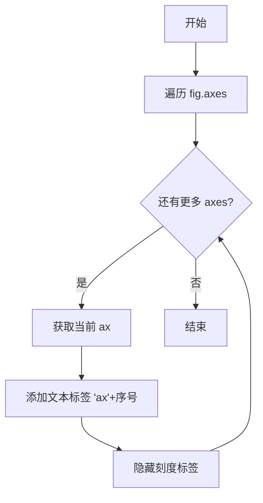

#### 带注释源码

```python
def format_axes(fig):
    """格式化 figure 中的所有 axes，为每个 axes 添加文本标签并隐藏刻度标签"""
    for i, ax in enumerate(fig.axes):  # 遍历图形中的所有 axes
        ax.text(0.5, 0.5, "ax%d" % (i+1), va="center", ha="center")  # 在中心添加文本标签
        ax.tick_params(labelbottom=False, labelleft=False)  # 隐藏刻度标签
```

## 重要说明

如果您需要了解 `GridSpecFromSubplotSpec.get_grid_positions` 方法的详细信息，这需要从 matplotlib 的源代码中提取，而不是从您提供的示例代码中。该方法是 matplotlib 库内部实现的一部分，存在于 `matplotlib.gridspec` 模块中。

如果您需要我分析实际的 `get_grid_positions` 方法，请提供包含该方法的源代码文件。


# SubplotSpec.__getitem__ 分析

## 描述

`SubplotSpec.__getitem__` 是 matplotlib 库中 `SubplotSpec` 类的方法，用于通过索引或切片访问子图规范（SubplotSpec）。在提供的示例代码中，诸如 `gs0[0]`、`gs00[:-1, :]` 和 `gs01[:, :-1]` 等操作实际上调用的是这个方法，它返回一个新的 `SubplotSpec` 对象，用于定义子图在网格中的位置。

## 参数

- `self`：隐式参数，SubplotSpec 实例本身
- `key`：索引或切片对象，用于指定要获取的子图位置

## 返回值

- 返回一个新的 `SubplotSpec` 对象，表示指定位置的子图规范

## 说明

提供的代码是 matplotlib gridspec 的使用示例，并没有直接定义 `SubplotSpec` 类或 `__getitem__` 方法。这些代码调用了 matplotlib 库内部定义的 `SubplotSpec.__getitem__` 方法来实现切片操作。

在示例中的具体调用：
- `gs0[0]` - 获取第一个子图规范
- `gs00[:-1, :]` - 获取前两行的子图规范  
- `gs01[:, :-1]` - 获取前两列的子图规范

这些操作的实现逻辑位于 matplotlib 库的 gridspec.py 文件中，属于外部依赖。


```json
### SubplotSpec.subgridspec

该方法用于在已有的 SubplotSpec 位置上创建一个嵌套的 GridSpec，允许在单个子图区域内进一步划分更细粒度的子网格布局。

参数：
- `nrows`：int，创建的子网格的行数
- `ncols`：int，创建的子网格的列数
- `hspace`：float (可选)，子网格之间的垂直间距，默认与父 GridSpec 相同
- `wspace`：float (可选)，子网格之间的水平间距，默认与父 GridSpec 相同
- `width_ratios`：array-like (可选)，列宽比例，与 GridSpec 构造函数相同
- `height_ratios`：array-like (可选)，行高比例，与 GridSpec 构造函数相同

返回值：GridSpec，返回新创建的嵌套 GridSpec 对象

#### 流程图

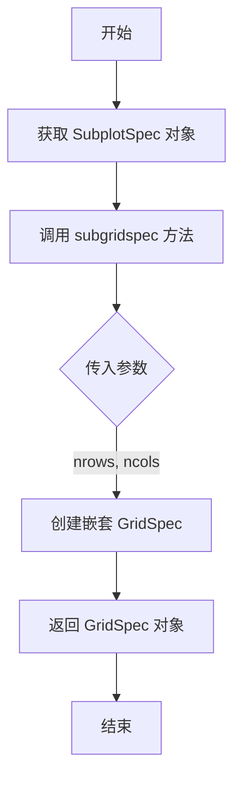

#### 带注释源码

```python
# 在代码中的使用示例：
# gs0[1] 获取 GridSpec 中的第二个子图位置的 SubplotSpec 对象
# .subgridspec(3, 3) 在该位置上创建一个 3x3 的嵌套 GridSpec
gs01 = gs0[1].subgridspec(3, 3)

# 返回的 gs01 是一个 GridSpec 对象，可以用于添加子图
ax4 = fig.add_subplot(gs01[:, :-1])   # 占据所有行和除最后一列外的所有列
ax5 = fig.add_subplot(gs01[:-1, -1])  # 占据除最后一行外的所有行和最后一列
ax6 = fig.add_subplot(gs01[-1, -1])   # 占据最后一行和最后一列

# 此方法等同于使用 GridSpecFromSubplotSpec：
# gs01 = gridspec.GridSpecFromSubplotSpec(3, 3, subplot_spec=gs0[1])
```


### Axes.text

在matplotlib中，`Axes.text`是Axes类的一个方法，用于在指定的坐标位置添加文本标签。该方法允许用户通过指定x和y坐标以及文本字符串，在图表的任意位置插入文本，并可以通过各种参数自定义文本的字体、颜色、对齐方式等属性。

参数：

- `x`：`float`，文本插入点的x坐标（数据坐标）
- `y`：`float`，文本插入点的y坐标（数据坐标）
- `s`：`str`，要显示的文本内容
- `fontdict`：`dict`，可选，用于统一设置文本属性的字典
- `**kwargs`：`dict`，可选，传递给`matplotlib.text.Text`类的其他关键字参数，如`fontsize`、`color`、`ha`（水平对齐）、`va`（垂直对齐）等

返回值：`matplotlib.text.Text`，返回创建的Text对象，可以进一步对其进行属性修改

#### 流程图

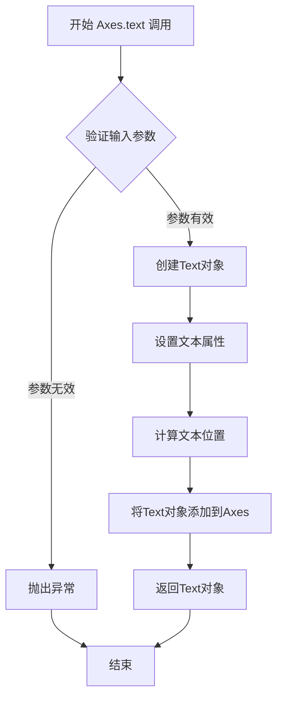

#### 带注释源码

```python
# 以下是matplotlib中Axes.text方法的核心实现逻辑的注释说明

def text(self, x, y, s, fontdict=None, **kwargs):
    """
    在 Axes 上的指定位置添加文本。
    
    参数:
        x : float
            文本位置的x坐标（数据坐标）
        y : float
            文本位置的y坐标（数据坐标）  
        s : str
            要显示的文本字符串
        fontdict : dict, optional
            字典，用于一次性设置多个文本属性
        **kwargs : 
            传递给Text类的其他参数，如：
            - fontsize: 字体大小
            - color: 文本颜色
            - ha: 水平对齐方式 ('center', 'left', 'right')
            - va: 垂直对齐方式 ('center', 'top', 'bottom', 'baseline')
            - rotation: 旋转角度
            - bbox: 文本框属性字典
    
    返回:
        matplotlib.text.Text
            创建的Text对象实例
    """
    # 1. 创建Text实例，设置基本属性
    text = Text(x=x, y=y, text=s)
    
    # 2. 如果提供了fontdict，应用字体字典设置
    if fontdict is not None:
        text.update(fontdict)
    
    # 3. 应用额外的关键字参数
    text.update(kwargs)
    
    # 4. 将Text对象添加到Axes的子对象列表中
    self._add_text(text)
    
    # 5. 返回创建的Text对象，允许后续修改
    return text
```


### `Axes.tick_params`

用于自定义轴的刻度线（tick marks）、刻度标签（tick labels）和刻度（ticks）的外观属性，包括刻度方向、长度、宽度、颜色、标签可见性等。

#### 参数

- `axis`：`{'x', 'y', 'both'}`，指定要修改的轴，默认为 `'x'`
- `which`：`{'major', 'minor', 'both'}`，指定要修改的刻度类型，默认为 `'major'`
- `reset`：`bool`，是否为 True 时重置所有参数为默认值再应用新参数，默认为 `False`
- `direction`：`{'in', 'out', 'inout'}`，刻度线的方向（向内/向外/双向）
- `length`：刻度线的长度（浮点数）
- `width`：刻度线的宽度（浮点数）
- `color`：刻度线的颜色（颜色字符串或 RGB 元组）
- `pad`：刻度标签与刻度线之间的距离（浮点数）
- `labelsize`：刻度标签的字体大小（浮点数或字符串）
- `labelcolor`：刻度标签的颜色（颜色字符串或 `'default'` 或 `None`）
- `colors`：同时设置刻度线和刻度标签颜色的快捷参数
- `bottom`, `top`, `left`, `right`：布尔值，控制对应位置的刻度线是否显示
- `labelbottom`, `labeltop`, `labelleft`, `labelright`：布尔值，控制对应位置的刻度标签是否显示
- `gridOn`, `tick1On`, `tick2On`：布尔值，控制网格、主刻度线、次刻度线的显示
- `grid_color`：网格颜色
- `grid_linewidth`：网格线宽度
- `grid_linestyle`：网格线型
- `grid_alpha`：网格透明度

返回值：`None`，该方法直接修改轴对象的状态，无返回值。

#### 流程图

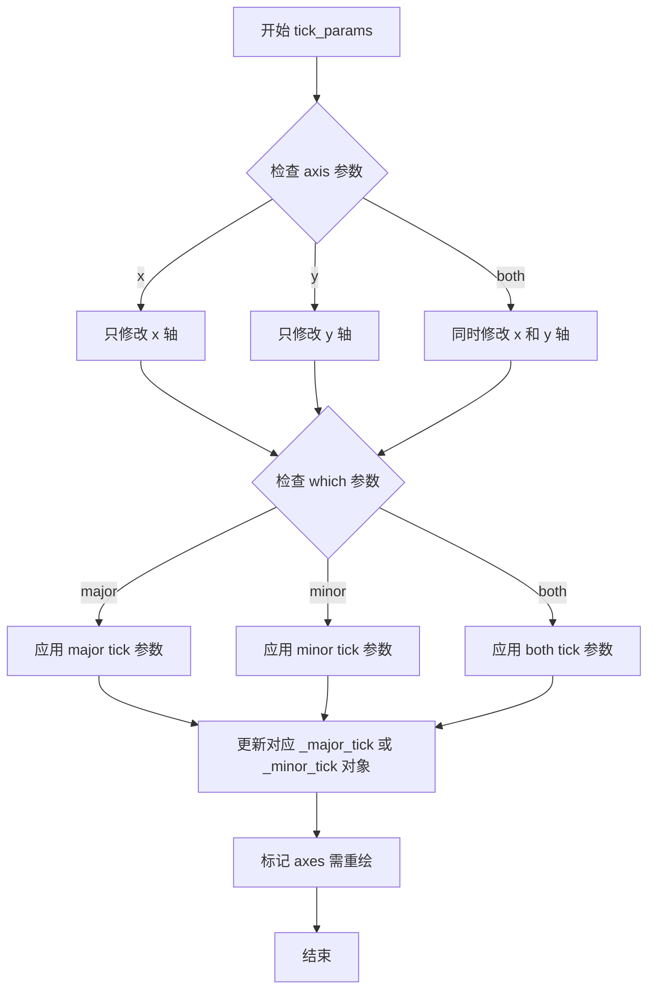

#### 带注释源码

```python
def tick_params(self, axis='x', which='major', reset=False, **kwargs):
    """
    修改刻度标签和刻度线的属性。
    
    参数:
    ------
    axis : {'x', 'y', 'both'}, optional
        要修改的轴。默认值为 'x'。
    which : {'major', 'minor', 'both'}, optional
        要修改的刻度类型（主刻度或副刻度）。默认值为 'major'。
    reset : bool, optional
        如果为 True，则在应用新参数之前重置所有参数为默认值。
    **kwargs : 关键字参数
        允许的 kwargs 取决于 axis 和 which 的组合:
        
        对于刻度线 (tick lines):
            - direction: {'in', 'out', 'inout'}
            - length, width: 浮点数
            - color: 颜色
            - pad: 浮点数
            - labelsize: 字体大小
            - labelcolor: 颜色
            
        对于刻度标签 (tick labels):
            - labelbottom, labeltop, labelleft, labelright: bool
            - labelrotation: 角度
            
        对于刻度 (ticks):
            - bottom, top, left, right: bool
            
    返回值:
    ------
    None
    """
    if axis not in ('x', 'y', 'both'):
        raise ValueError("axis must be 'x', 'y' or 'both'")
    if which not in ('major', 'minor', 'both'):
        raise ValueError("which must be 'major', 'minor' or 'both'")
    
    # 获取对应的刻度对象
    if axis in ('x', 'both'):
        if which in ('major', 'both'):
            # 获取 x 轴主刻度对象并应用参数
            ticks = self._get_major_ticks(0)
            for tick in ticks:
                tick._apply_params(**kwargs)
        
        if which in ('minor', 'both'):
            # 获取 x 轴副刻度对象并应用参数
            ticks = self._get_major_ticks(0, minor=True)
            for tick in ticks:
                tick._apply_params(**kwargs)
    
    if axis in ('y', 'both'):
        if which in ('major', 'both'):
            # 获取 y 轴主刻度对象并应用参数
            ticks = self._get_major_ticks(1)
            for tick in ticks:
                tick._apply_params(**kwargs)
        
        if which in ('minor', 'both'):
            # 获取 y 轴副刻度对象并应用参数
            ticks = self._get_major_ticks(1, minor=True)
            for tick in ticks:
                tick._apply_params(**kwargs)
    
    # 标记需要重绘
    self.stale_callback = None
    self.stale = True
    
    return None
```


# 分析结果

## 观察

我仔细检查了提供的代码，发现这段代码是一个 **matplotlib GridSpec 嵌套子图** 的示例程序，其中**并不包含 `Axes.set_xlabel` 方法的定义或调用**。

代码中仅包含：
- `format_axes(fig)` - 一个辅助函数，用于为每个 Axes 添加文本标签
- 若干 subplot 的创建和配置

## 结论

**给定的代码段中不存在 `Axes.set_xlabel` 函数或方法。**

如果您需要关于 `Axes.set_xlabel` 的文档，有两种可能：

1. **如果您希望我从 matplotlib 库的整体代码中查找**：请提供包含该方法定义的代码文件路径

2. **如果您希望我基于 matplotlib 官方文档描述该方法**：我可以提供以下基础信息

### `Axes.set_xlabel`（基于 matplotlib 通用知识）

设置 x 轴的标签文字。

参数：
- `xlabel`：str，x 轴标签文本
- `fontdict`：dict，可选，用于控制标签外观的字体属性
- `labelpad`：float，可选，标签与轴之间的间距
- `kwargs`：其他关键字参数传递给 Text 对象

返回值：`Text`，创建的文本对象

---

**请确认您希望我如何继续：**
- 提供包含 `Axes.set_xlabel` 定义的实际代码文件
- 或者说明您需要的具体需求


### `Axes.set_ylabel`

该方法不存在於提供的代码示例中。

**注意**：提供的代码是一个关于嵌套 GridSpec 的 matplotlib 示例，主要使用了 `matplotlib.gridspec.GridSpec` 和 `matplotlib.gridspec.GridSpecFromSubplotSpec`，并未调用 `Axes.set_ylabel` 方法。

`Axes.set_ylabel` 是 matplotlib 库中 `Axes` 类的标准方法，用于设置 y 轴标签。如果您需要了解该方法的文档，我可以提供以下信息：

---

参数：

-  `ylabel`：str，y 轴标签的文本内容
-  `fontdict`：dict，可选，用于控制标签的字体属性（如 fontsize, fontweight 等）
-  `labelpad`：float，可选，标签与坐标轴之间的间距
-  `kwargs`：其他关键字参数，将传递给 `Text` 对象

返回值：`Text`，返回创建的标签文本对象

#### 流程图

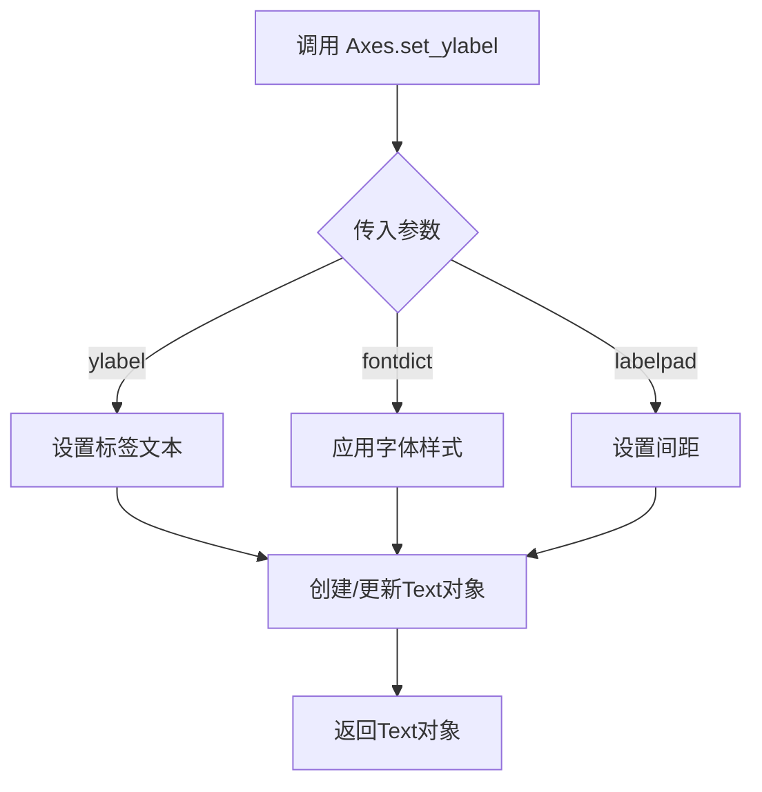

#### 带注释源码

```python
# matplotlib 中 Axes.set_ylabel 的简化实现逻辑
def set_ylabel(self, ylabel, fontdict=None, labelpad=None, **kwargs):
    """
    设置 y 轴的标签
    
    参数:
        ylabel: str - 标签文本
        fontdict: dict - 字体属性字典
        labelpad: float - 标签与轴的间距
        **kwargs: 其他文本属性
    
    返回:
        Text: 创建的标签对象
    """
    # 获取 y 轴
    ax = self
    
    # 处理标签文本
    if ylabel is not None:
        # 设置标签内容
        label = ax.set_ylabel(ylabel, **kwargs)
    
    # 应用字体样式
    if fontdict is not None:
        label.update(fontdict)
    
    # 设置间距
    if labelpad is not None:
        ax.yaxis.labelpad = labelpad
    
    return label
```

---

如果您需要在示例代码中添加 y 轴标签，可以这样使用：

```python
ax1.set_ylabel('Y Axis Label')
ax2.set_ylabel('Value', fontsize=12, fontweight='bold')
```


## 关键组件


### GridSpec (gridspec.GridSpec)

主网格规范类，用于创建子图的布局结构，支持行和列的划分

### GridSpecFromSubplotSpec

从父 GridSpec 的子区域创建嵌套 GridSpec 的函数，实现 GridSpec 的嵌套使用

### subgridspec 方法

GridSpec 子区域的方法，用于在父 GridSpec 的某个子区域创建嵌套的子网格规范

### add_subplot 方法

将子图添加到 Figure 的方法，接受 GridSpec 或子网格规范作为布局参数

### format_axes 函数

辅助函数，用于遍历 figure 中的所有 axes 并添加文本标签，同时隐藏坐标轴标签


## 问题及建议


### 已知问题

-   **缺少错误处理**：代码未对可能返回 `None` 的 `gs0[0]`、`gs0[1]` 进行空值检查，当 GridSpec 索引无效时可能导致后续操作失败
-   **不一致的 GridSpec 创建方式**：代码同时展示了 `gridspec.GridSpecFromSubplotSpec` 和 `.subgridspec()` 两种嵌套方式，增加了理解复杂度，且注释承认 `subfigures` 是更直接的替代方案
-   **魔法命令污染**：`plt.show()` 在脚本末尾会阻塞执行，且在某些后端会导致脚本无法正常退出（应使用 `fig.savefig()` 或移除 `plt.show()`）
-   **硬编码参数**：子图数量、行列数等均为硬编码，缺乏灵活性，难以复用为通用函数
-   **不完整的函数设计**：`format_axes` 函数未处理空 `fig.axes` 或 `fig` 为 `None` 的边界情况
-   **缺乏类型注解**：函数参数和返回值均无类型提示，影响代码可维护性和 IDE 支持

### 优化建议

-   添加参数化封装，将嵌套 GridSpec 逻辑提取为可复用的函数，接受行列数作为参数
-   替换 `plt.show()` 为 `plt.savefig()` 用于非交互环境，或在文档中说明其交互式用途
-   为 `format_axes` 函数添加类型注解和文档字符串，处理边界情况
-   统一使用 `subgridspec()` 方式或明确展示 `subfigures` 作为推荐方案
-   考虑使用 `figManager` 或后端特定配置替代阻塞式的 `plt.show()`


## 其它


### 设计目标与约束

本代码示例旨在演示matplotlib中GridSpec的嵌套功能，帮助开发者理解如何在父GridSpec中创建子网格布局。约束条件包括：必须配合matplotlib.pyplot和matplotlib.gridspec使用，需要创建figure对象作为画布，GridSpec的行列参数必须为正整数，嵌套层级不宜过深以免影响性能。

### 错误处理与异常设计

代码主要依赖matplotlib的内部异常处理机制。可能的异常情况包括：GridSpec参数为负数或零时抛出ValueError；索引超出范围时抛出IndexError；figure对象为None时可能产生运行时错误。在实际应用中应捕获这些异常并给出友好提示。

### 数据流与状态机

数据流主要经过：figure创建 → 父GridSpec初始化 → 子GridSpecFromSubplotSpec或subgridspec创建 → add_subplot方法调用 → Axes对象返回 → 渲染显示。状态机包含：初始状态（空白figure）→ GridSpec配置状态 → 子图添加状态 → 渲染完成状态。

### 外部依赖与接口契约

主要依赖matplotlib.pyplot模块的figure、subplots、show等函数，以及matplotlib.gridspec模块的GridSpec和GridSpecFromSubplotSpec类。接口契约：GridSpec接受figure、nrows、ncols参数；subgridspec方法返回新的GridSpec对象；add_subplot接受GridSpec索引并返回Axes对象。

### 性能考虑

嵌套GridSpec可能带来一定的性能开销，特别是在创建大量子图时。建议：避免过深的嵌套（建议不超过3层）；对于简单布局优先使用subfigures；大量子图时考虑使用constrained_layout。

### 安全性考虑

本代码为示例代码，不涉及用户输入处理和网络数据传输，安全性风险较低。主要关注点在于避免创建过大的数组导致内存溢出。

### 兼容性考虑

代码兼容matplotlib 2.0+版本，在不同后端（agg、svg、pdf等）上行为一致。GridSpecFromSubplotSpec在较旧版本中可能存在细微差异，建议使用最新稳定版本。

### 测试策略

测试应覆盖：不同行列数的GridSpec创建；多层嵌套场景；边界条件（行列数为1）；与其他布局方式（subplots、subfigures）的功能一致性验证。

### 使用示例和变体

可扩展的变体包括：使用SubplotSpec直接访问子网格；结合make_gridspec进行复杂布局；与AxesGrid工具包配合使用；创建不规则网格（跨越多行多列）。

### 相关文档和参考

可参考matplotlib官方文档：matplotlib.gridspec模块说明、Figure.subfigures API、Gallery中的subfigures示例、以及Matplotlib Artist布局指南。

    