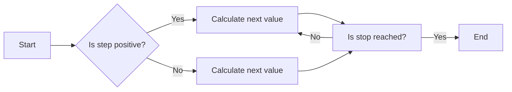
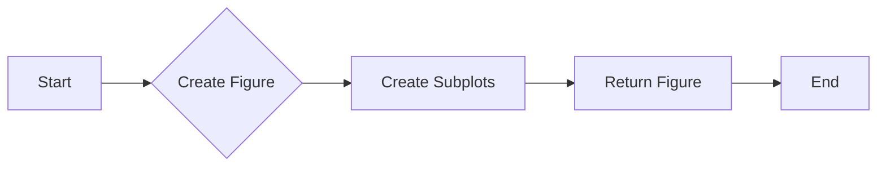
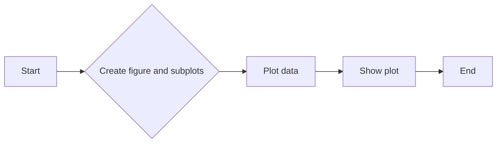
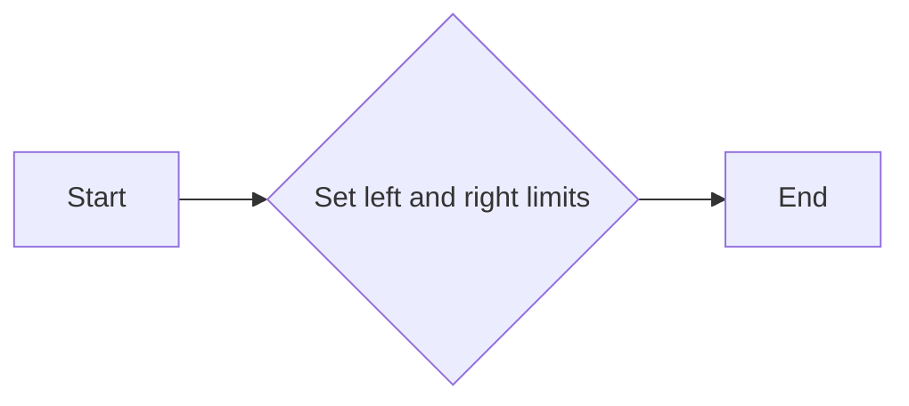
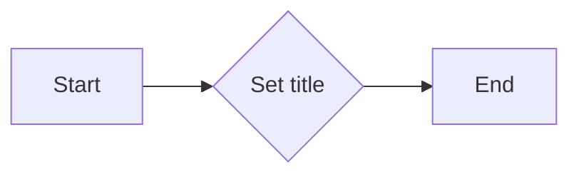
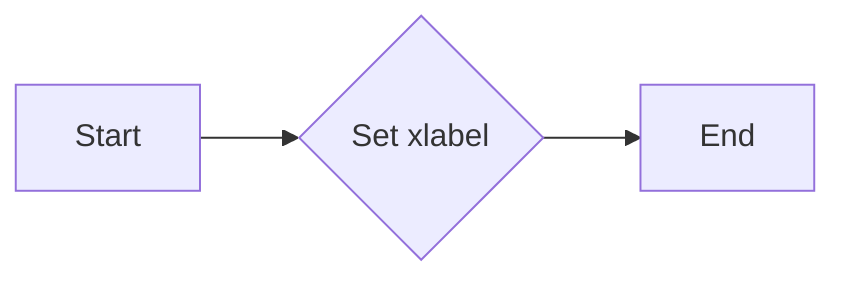
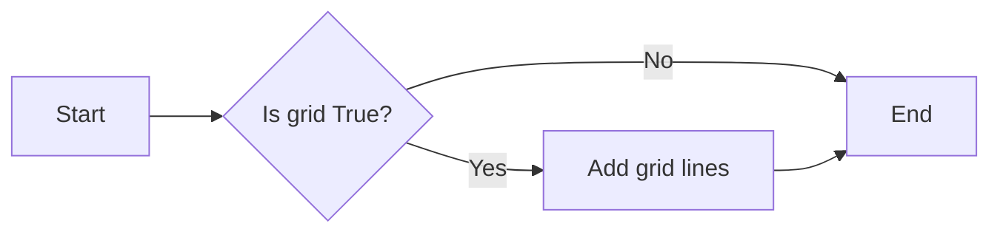

# `matplotlib\galleries\examples\subplots_axes_and_figures\invert_axes.py` 详细设计文档

This code demonstrates two methods to invert the direction of an axis in a matplotlib plot: setting explicit axis limits and using the set_inverted method for autoscaling.

## 整体流程

```mermaid
graph TD
    A[Start] --> B[Create plot with two subplots]
    B --> C[Plot function y = exp(-x) on both subplots]
    C --> D[Set inverted limits on ax1 using set_xlim(4, 0)]
    D --> E[Set ax1 title and xlabel]
    E --> F[Set grid on ax1]
    F --> G[Set ax2 x-axis to inverted using set_inverted(True)]
    G --> H[Set ax2 title and xlabel]
    H --> I[Set grid on ax2]
    I --> J[Show plot]
    J --> K[End]
```

## 类结构

```
matplotlib.pyplot (matplotlib module)
├── fig, (ax1, ax2) = plt.subplots(1, 2, figsize=(6.4, 4), layout='constrained')
│   ├── fig
│   ├── ax1
│   └── ax2
├── x = np.arange(0.01, 4.0, 0.01)
├── y = np.exp(-x)
├── ax1.plot(x, y)
├── ax1.set_xlim(4, 0)
├── ax1.set_title('fixed limits: set_xlim(4, 0)')
├── ax1.set_xlabel('decreasing x ⟶')
├── ax1.grid(True)
├── ax2.plot(x, y)
├── ax2.xaxis.set_inverted(True)
├── ax2.set_title('autoscaling: set_inverted(True)')
├── ax2.set_xlabel('decreasing x ⟶')
├── ax2.grid(True)
└── plt.show()
```

## 全局变量及字段


### `x`
    
Array of x values for the plot.

类型：`numpy.ndarray`
    


### `y`
    
Array of y values for the plot.

类型：`numpy.ndarray`
    


### `fig`
    
The main figure object containing all the axes.

类型：`matplotlib.figure.Figure`
    


### `ax1`
    
The first subplot where the plot with inverted limits is drawn.

类型：`matplotlib.axes._subplots.AxesSubplot`
    


### `ax2`
    
The second subplot where the plot with inverted axis is drawn.

类型：`matplotlib.axes._subplots.AxesSubplot`
    


### `{'name': 'matplotlib.pyplot', 'fields': ['fig', 'ax1', 'ax2'], 'methods': ['subplots', 'plot', 'set_xlim', 'set_title', 'set_xlabel', 'grid', 'show']}{'name': 'matplotlib.pyplot', 'fields': ['fig', 'ax1', 'ax2'], 'methods': ['subplots', 'plot', 'set_xlim', 'set_title', 'set_xlabel', 'grid', 'show']}.fig`
    
The main figure object containing all the axes.

类型：`matplotlib.figure.Figure`
    


### `{'name': 'matplotlib.pyplot', 'fields': ['fig', 'ax1', 'ax2'], 'methods': ['subplots', 'plot', 'set_xlim', 'set_title', 'set_xlabel', 'grid', 'show']}{'name': 'matplotlib.pyplot', 'fields': ['fig', 'ax1', 'ax2'], 'methods': ['subplots', 'plot', 'set_xlim', 'set_title', 'set_xlabel', 'grid', 'show']}.ax1`
    
The first subplot where the plot with inverted limits is drawn.

类型：`matplotlib.axes._subplots.AxesSubplot`
    


### `{'name': 'matplotlib.pyplot', 'fields': ['fig', 'ax1', 'ax2'], 'methods': ['subplots', 'plot', 'set_xlim', 'set_title', 'set_xlabel', 'grid', 'show']}{'name': 'matplotlib.pyplot', 'fields': ['fig', 'ax1', 'ax2'], 'methods': ['subplots', 'plot', 'set_xlim', 'set_title', 'set_xlabel', 'grid', 'show']}.ax2`
    
The second subplot where the plot with inverted axis is drawn.

类型：`matplotlib.axes._subplots.AxesSubplot`
    


### `numpy.ndarray.x`
    
Array of x values for the plot.

类型：`numpy.ndarray`
    


### `numpy.ndarray.y`
    
Array of y values for the plot.

类型：`numpy.ndarray`
    


### `matplotlib.figure.Figure.fig`
    
The main figure object containing all the axes.

类型：`matplotlib.figure.Figure`
    


### `matplotlib.axes._subplots.AxesSubplot.ax1`
    
The first subplot where the plot with inverted limits is drawn.

类型：`matplotlib.axes._subplots.AxesSubplot`
    


### `matplotlib.axes._subplots.AxesSubplot.ax2`
    
The second subplot where the plot with inverted axis is drawn.

类型：`matplotlib.axes._subplots.AxesSubplot`
    


### `matplotlib.pyplot.fig`
    
The main figure object containing all the axes.

类型：`matplotlib.figure.Figure`
    


### `matplotlib.pyplot.ax1`
    
The first subplot where the plot with inverted limits is drawn.

类型：`matplotlib.axes._subplots.AxesSubplot`
    


### `matplotlib.pyplot.ax2`
    
The second subplot where the plot with inverted axis is drawn.

类型：`matplotlib.axes._subplots.AxesSubplot`
    
    

## 全局函数及方法


### np.arange

`np.arange` 是 NumPy 库中的一个函数，用于生成一个沿指定间隔的数字序列。

参数：

- `start`：`int`，序列的起始值。
- `stop`：`int`，序列的结束值（不包括此值）。
- `step`：`int`，序列中相邻元素之间的间隔，默认为 1。

返回值：`numpy.ndarray`，一个沿指定间隔的数字序列。

#### 流程图



#### 带注释源码

```python
import numpy as np

# 生成一个从 0.01 到 4.0，间隔为 0.01 的数字序列
x = np.arange(0.01, 4.0, 0.01)
```


### np.exp

计算自然指数函数的值。

参数：

- `x`：`float` 或 `array_like`，输入值或数组。如果输入是数组，则返回数组中每个元素的指数。

返回值：`float` 或 `ndarray`，自然指数函数的值。

#### 流程图

```mermaid
graph LR
A[Start] --> B{Is x a number?}
B -- Yes --> C[Calculate exp(x)]
B -- No --> D[Error: x must be a number]
C --> E[End]
D --> E
```

#### 带注释源码

```python
import numpy as np

def np_exp(x):
    """
    Calculate the exponential of x.
    
    Parameters:
    - x: float or array_like, the input value or array.
    
    Returns:
    - float or ndarray, the value of the exponential function.
    """
    return np.exp(x)
```


### plt.subplots

`plt.subplots` 是 Matplotlib 库中用于创建子图（subplot）的函数。

参数：

- `nrows`：`int`，子图行数。
- `ncols`：`int`，子图列数。
- `sharex`：`bool`，是否共享X轴。
- `sharey`：`bool`，是否共享Y轴。
- `figsize`：`tuple`，图像大小。
- `dpi`：`int`，图像分辨率。
- `gridspec_kw`：`dict`，GridSpec关键字参数。
- `constrained_layout`：`bool`，是否启用约束布局。

返回值：`Figure`，包含子图的Figure对象。

#### 流程图



#### 带注释源码

```python
import matplotlib.pyplot as plt

fig, (ax1, ax2) = plt.subplots(1, 2, figsize=(6.4, 4), layout="constrained")
fig.suptitle('Inverted axis with ...')

# ... (rest of the code)
```


### plt.show()

显示所有活跃的图形。

参数：

- 无

返回值：无

#### 流程图

```mermaid
graph LR
A[Start] --> B[Call plt.show()]
B --> C[End]
```

#### 带注释源码

```python
plt.show()
```


### plt.subplots

`subplots` 是 `matplotlib.pyplot` 模块中的一个函数，用于创建一个图形和多个轴（子图）。

参数：

- `nrows`：`int`，指定子图的行数。
- `ncols`：`int`，指定子图的列数。
- `sharex`：`bool`，如果为 `True`，则所有子图共享 x 轴。
- `sharey`：`bool`，如果为 `True`，则所有子图共享 y 轴。
- `figsize`：`tuple`，指定图形的大小（宽度和高度）。
- `dpi`：`int`，指定图形的分辨率（每英寸点数）。
- `gridspec_kw`：`dict`，用于指定 `GridSpec` 的关键字参数。
- `constrained_layout`：`bool`，如果为 `True`，则使用 `constrainedlayout` 自动布局。
- ` subplot_kw`：`dict`，用于指定子图的关键字参数。

返回值：`fig`，`axes`，`fig` 是图形对象，`axes` 是轴（子图）的数组。

#### 流程图



#### 带注释源码

```python
import matplotlib.pyplot as plt
import numpy as np

x = np.arange(0.01, 4.0, 0.01)
y = np.exp(-x)

fig, (ax1, ax2) = plt.subplots(1, 2, figsize=(6.4, 4), layout="constrained")
fig.suptitle('Inverted axis with ...')

ax1.plot(x, y)
ax1.set_xlim(4, 0)   # inverted fixed limits
ax1.set_title('fixed limits: set_xlim(4, 0)')
ax1.set_xlabel('decreasing x ⟶')
ax1.grid(True)

ax2.plot(x, y)
ax2.xaxis.set_inverted(True)  # inverted axis with autoscaling
ax2.set_title('autoscaling: set_inverted(True)')
ax2.set_xlabel('decreasing x ⟶')
ax2.grid(True)

plt.show()
```


### matplotlib.pyplot.plot

matplotlib.pyplot.plot 是一个用于绘制二维线图的函数。

参数：

- `x`：`array_like`，x轴的数据点。
- `y`：`array_like`，y轴的数据点。
- ...

返回值：`Line2D`，表示绘制的线。

#### 流程图


#### 带注释源码

```python
import matplotlib.pyplot as plt
import numpy as np

x = np.arange(0.01, 4.0, 0.01)
y = np.exp(-x)

fig, (ax1, ax2) = plt.subplots(1, 2, figsize=(6.4,  4), layout="constrained")
fig.suptitle('Inverted axis with ...')

# Plotting the line
line = ax1.plot(x, y)[0]  # Store the Line2D object for further manipulation
```


### `set_xlim`

`matplotlib.pyplot.set_xlim` 方法用于设置轴的显示范围。

参数：

- `left`：`float`，表示轴的左侧显示范围。
- `right`：`float`，表示轴的右侧显示范围。

返回值：`None`，该方法不返回任何值。

#### 流程图



#### 带注释源码

```python
def set_xlim(self, left, right):
    """
    Set the x-axis limits.

    Parameters
    ----------
    left : float
        The left limit of the x-axis.
    right : float
        The right limit of the x-axis.

    Returns
    -------
    None
    """
    self._set_xbound(left, right)
```


### matplotlib.pyplot.set_title

设置当前轴的标题。

参数：

- `title`：`str`，标题文本
- `loc`：`str`，标题位置，默认为'center'，可选值包括'left', 'right', 'center', 'upper left', 'upper right', 'lower left', 'lower right'
- `pad`：`float`，标题与轴边缘的距离，默认为3.0
- `fontsize`：`float`，标题字体大小，默认为10.0
- `color`：`str`，标题颜色，默认为'black'
- `fontweight`：`str`，标题字体粗细，默认为'normal'
- `fontstyle`：`str`，标题字体样式，默认为'normal'
- `verticalalignment`：`str`，垂直对齐方式，默认为'bottom'
- `horizontalalignment`：`str`，水平对齐方式，默认为'center'

返回值：`None`

#### 流程图



#### 带注释源码

```python
def set_title(self, title, loc='center', pad=3.0, fontsize=10.0, color='black', fontweight='normal', fontstyle='normal', verticalalignment='bottom', horizontalalignment='center'):
    """
    Set the title of the current axis.

    Parameters
    ----------
    title : str
        Title text.
    loc : str, optional
        Title position, default 'center'. Possible values include 'left', 'right', 'center', 'upper left', 'upper right', 'lower left', 'lower right'.
    pad : float, optional
        Padding between the title and the axis edge, default 3.0.
    fontsize : float, optional
        Font size of the title, default 10.0.
    color : str, optional
        Color of the title, default 'black'.
    fontweight : str, optional
        Font weight of the title, default 'normal'.
    fontstyle : str, optional
        Font style of the title, default 'normal'.
    verticalalignment : str, optional
        Vertical alignment of the title, default 'bottom'.
    horizontalalignment : str, optional
        Horizontal alignment of the title, default 'center'.

    Returns
    -------
    None
    """
    # Implementation of the set_title method
    pass
```


### matplotlib.pyplot.set_xlabel

设置x轴标签。

参数：

- `xlabel`：`str`，x轴标签的文本内容。

返回值：`None`，没有返回值。

#### 流程图



#### 带注释源码

```python
# 假设 ax 是一个AxesSubplot对象
ax.set_xlabel('decreasing x ⟶')
```

在这个例子中，`set_xlabel` 方法被用来设置x轴的标签为 `'decreasing x ⟶'`。这个方法没有返回值，它直接在AxesSubplot对象上操作，改变其x轴的标签文本。

```python
import matplotlib.pyplot as plt
import numpy as np

x = np.arange(0.01, 4.0, 0.01)
y = np.exp(-x)

fig, (ax1, ax2) = plt.subplots(1, 2, figsize=(6.4,  4), layout="constrained")
fig.suptitle('Inverted axis with ...')

ax1.plot(x, y)
ax1.set_xlim(4, 0)   # inverted fixed limits
ax1.set_title('fixed limits: set_xlim(4, 0)')
ax1.set_xlabel('decreasing x ⟶')  # 设置x轴标签
ax1.grid(True)

ax2.plot(x, y)
ax2.xaxis.set_inverted(True)  # inverted axis with autoscaling
ax2.set_title('autoscaling: set_inverted(True)')
ax2.set_xlabel('decreasing x ⟶')  # 设置x轴标签
ax2.grid(True)

plt.show()
```


### matplotlib.pyplot.grid

matplotlib.pyplot.grid 是一个用于在图表上添加网格线的函数。

参数：

- `grid`：`bool`，默认为 `False`。如果为 `True`，则在图表上添加网格线。

返回值：`None`，该函数不返回任何值。

#### 流程图



#### 带注释源码

```python
import matplotlib.pyplot as plt

# 创建图表
fig, ax = plt.subplots()

# 添加数据
ax.plot([1, 2, 3], [1, 4, 9])

# 添加网格线
ax.grid(True)

# 显示图表
plt.show()
```


### plt.show()

显示当前图形的窗口。

参数：

- 无

返回值：无

#### 流程图

```mermaid
graph LR
A[Start] --> B[Call plt.show()]
B --> C[End]
```

#### 带注释源码

```python
# 导入matplotlib.pyplot模块
import matplotlib.pyplot as plt

# ... (前面的代码，如创建图形、添加数据等)

# 显示当前图形的窗口
plt.show()
``` 


## 关键组件


### 张量索引

张量索引是用于访问和操作多维数组（张量）中特定元素的方法。

### 惰性加载

惰性加载是一种延迟计算或加载资源的方法，直到实际需要时才进行，以提高性能和效率。

### 反量化支持

反量化支持是指系统或库能够处理和解释非整数索引或切片，以访问数据结构中的元素。

### 量化策略

量化策略是指将浮点数数据转换为固定点数表示的方法，以减少内存使用和提高计算效率。


## 问题及建议


### 已知问题

-   **代码重复性**：`ax1.plot(x, y)` 和 `ax2.plot(x, y)` 在两个子图中重复，可以考虑将绘图逻辑提取到一个单独的函数中，以减少代码重复。
-   **全局变量**：`x` 和 `y` 作为全局变量使用，这可能会在更复杂的代码中引起命名冲突或难以追踪。
-   **文档注释**：代码中的文档注释较为简单，可能需要更详细的描述来帮助理解代码的目的和功能。

### 优化建议

-   **提取绘图逻辑**：创建一个函数来处理绘图逻辑，减少代码重复，并使代码更易于维护。
-   **使用局部变量**：将 `x` 和 `y` 定义为局部变量，以避免全局命名冲突。
-   **增强文档注释**：为代码添加更详细的文档注释，包括每个函数和关键代码块的目的和功能。
-   **异常处理**：考虑添加异常处理来捕获可能发生的错误，例如在绘图过程中出现的错误。
-   **代码风格**：根据项目或组织标准，调整代码风格，以提高代码的可读性和一致性。
-   **性能优化**：如果绘图操作是性能瓶颈，可以考虑使用更高效的绘图库或优化绘图算法。

## 其它


### 设计目标与约束

- 设计目标：实现轴方向反转的功能，支持显式轴限制和自动缩放行为。
- 约束条件：代码应简洁易读，易于维护，并兼容Matplotlib库。

### 错误处理与异常设计

- 错误处理：代码中应包含异常处理机制，以捕获并处理可能出现的错误，如Matplotlib库版本不兼容等。
- 异常设计：定义明确的异常类型，如`MatplotlibError`，以区分不同类型的错误。

### 数据流与状态机

- 数据流：数据从`np.arange`生成，经过绘图函数`plot`处理，最终显示在图形界面中。
- 状态机：代码中没有明显的状态转换，但轴反转操作可以视为状态变化。

### 外部依赖与接口契约

- 外部依赖：代码依赖于Matplotlib和NumPy库。
- 接口契约：Matplotlib库的`Axes`类提供了`set_xlim`和`set_inverted`方法，用于设置轴限制和反转轴方向。


    