# `matplotlib\galleries\examples\subplots_axes_and_figures\multiple_figs_demo.py` 详细设计文档

This code manages multiple figures in the matplotlib library by creating and manipulating figures and their subplots explicitly, avoiding the use of the implicit interface for better control and clarity.

## 整体流程

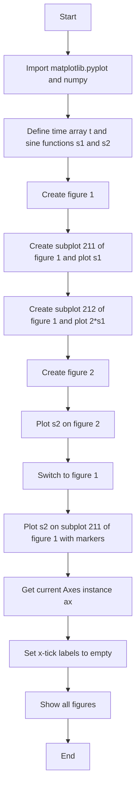

## 类结构

```
FigureManager (主类)
├── matplotlib.pyplot (全局变量)
└── numpy (全局变量)
```

## 全局变量及字段


### `plt`
    
The matplotlib.pyplot module for plotting.

类型：`module`
    


### `np`
    
The numpy module for numerical operations.

类型：`module`
    


### `t`
    
A numpy array representing the time values for plotting.

类型：`numpy.ndarray`
    


### `s1`
    
A numpy array representing the sine values for the first plot.

类型：`numpy.ndarray`
    


### `s2`
    
A numpy array representing the sine values for the second plot.

类型：`numpy.ndarray`
    


### `FigureManager.plt`
    
The matplotlib.pyplot module for plotting.

类型：`module`
    


### `FigureManager.np`
    
The numpy module for numerical operations.

类型：`module`
    


### `FigureManager.t`
    
A numpy array representing the time values for plotting.

类型：`numpy.ndarray`
    


### `FigureManager.s1`
    
A numpy array representing the sine values for the first plot.

类型：`numpy.ndarray`
    


### `FigureManager.s2`
    
A numpy array representing the sine values for the second plot.

类型：`numpy.ndarray`
    
    

## 全局函数及方法


### plt.figure()

`plt.figure()` 是 `matplotlib.pyplot` 模块中的一个函数，用于创建一个新的图形窗口或获取当前图形窗口。

参数：

- `num`：`int`，可选参数，指定图形的编号。如果指定编号的图形不存在，则创建一个新的图形。如果不指定，则返回当前图形。

返回值：`matplotlib.figure.Figure`，返回当前图形的实例。

#### 流程图

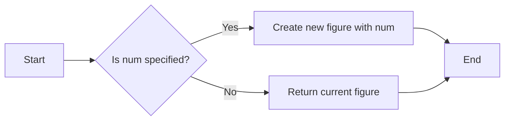

#### 带注释源码

```python
import matplotlib.pyplot as plt

def figure(num=None):
    """
    Create a new figure or return the current figure.

    Parameters
    ----------
    num : int, optional
        The figure number. If specified, a new figure is created. If not specified,
        the current figure is returned.

    Returns
    -------
    Figure
        The current figure.
    """
    if num is not None:
        plt.figure(num)
    else:
        return plt.gcf()
```


### plt.figure

创建一个新的图形窗口或切换到现有的图形窗口。

描述：

该函数用于创建一个新的图形窗口或切换到现有的图形窗口。如果指定的图形编号不存在，则创建一个新的图形窗口。

参数：

- `num`：`int`，图形的编号。如果该编号的图形不存在，则创建一个新的图形窗口。

返回值：`matplotlib.figure.Figure`，当前图形的实例。

#### 流程图

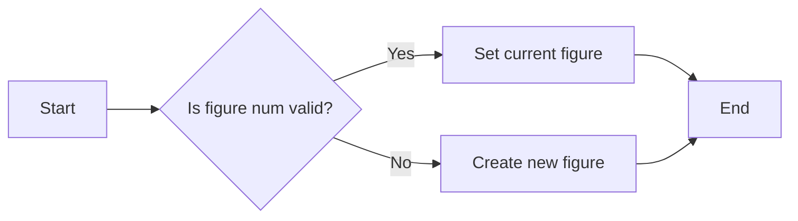

#### 带注释源码

```python
def figure(num=None):
    """
    Create a new figure or switch to an existing figure.

    Parameters
    ----------
    num : int, optional
        The figure number. If the figure with the given number does not exist,
        a new one is created.

    Returns
    -------
    matplotlib.figure.Figure
        The instance of the current figure.
    """
    # ... (source code implementation)
```

### plt.subplot

创建一个子图。

描述：

该函数用于创建一个子图。子图是图形窗口中的一个区域，可以包含多个子图。

参数：

- `nrows`：`int`，子图的行数。
- `ncols`：`int`，子图的列数。
- `index`：`int`，子图的索引，从1开始。

返回值：`matplotlib.axes.Axes`，子图的实例。

#### 流程图

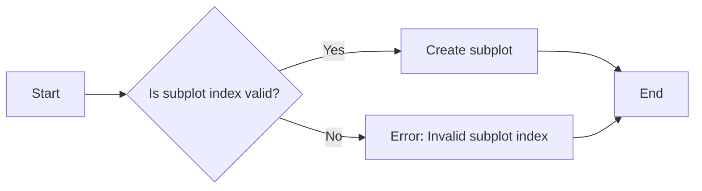

#### 带注释源码

```python
def subplot(nrows, ncols, index):
    """
    Create a subplot.

    Parameters
    ----------
    nrows : int
        The number of rows of subplots.
    ncols : int
        The number of columns of subplots.
    index : int
        The index of the subplot, starting from 1.

    Returns
    -------
    matplotlib.axes.Axes
        The instance of the subplot.
    """
    # ... (source code implementation)
```

### plt.plot

绘制二维数据。

描述：

该函数用于绘制二维数据。可以绘制线图、散点图等。

参数：

- `x`：`array_like`，x轴的数据。
- `y`：`array_like`，y轴的数据。
- `fmt`：`str`，用于指定线型、标记和颜色。

返回值：`matplotlib.lines.Line2D`，绘制的线。

#### 流程图

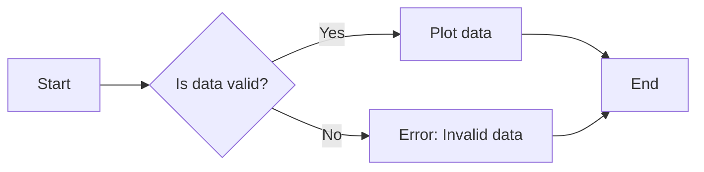

#### 带注释源码

```python
def plot(x, y, fmt=None):
    """
    Plot two-dimensional data.

    Parameters
    ----------
    x : array_like
        The data for the x-axis.
    y : array_like
        The data for the y-axis.
    fmt : str, optional
        The format string for the line type, marker, and color.

    Returns
    -------
    matplotlib.lines.Line2D
        The line plot.
    """
    # ... (source code implementation)
```

### plt.gca

获取当前轴。

描述：

该函数用于获取当前轴的实例。

返回值：`matplotlib.axes.Axes`，当前轴的实例。

#### 流程图

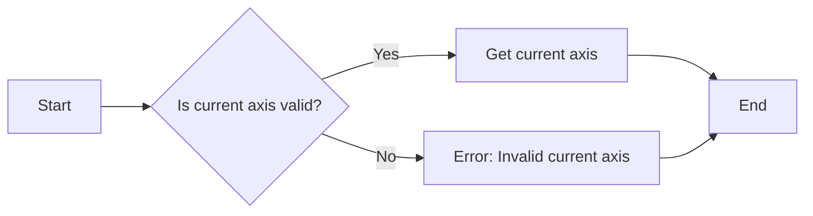

#### 带注释源码

```python
def gca():
    """
    Get the current axis.

    Returns
    -------
    matplotlib.axes.Axes
        The instance of the current axis.
    """
    # ... (source code implementation)
```

### plt.show

显示图形。

描述：

该函数用于显示图形。如果图形已经显示，则刷新图形。

#### 流程图

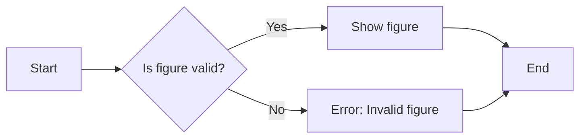

#### 带注释源码

```python
def show():
    """
    Show the figure.

    If the figure is already displayed, refresh the figure.
    """
    # ... (source code implementation)
```


### plt.figure

创建一个新的图形或获取当前图形。

描述：

该函数用于创建一个新的图形或获取当前图形。如果指定了图形编号，则返回该编号的图形；如果没有指定编号，则返回当前图形。如果指定的图形编号不存在，则创建一个新的图形。

参数：

- `num`：`int`，可选。图形的编号。如果未指定，则返回当前图形。

返回值：`matplotlib.figure.Figure`，当前或新创建的图形对象。

#### 流程图

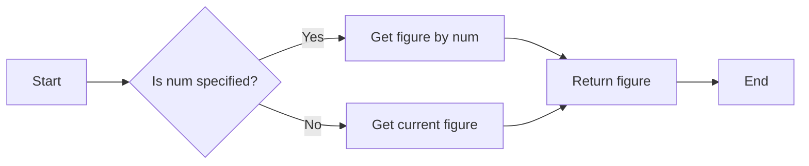

#### 带注释源码

```python
def figure(num=None):
    """
    Create a new figure or get the current figure.

    Parameters
    ----------
    num : int, optional
        The figure number. If not specified, return the current figure.

    Returns
    -------
    matplotlib.figure.Figure
        The current or newly created figure.
    """
    # ... (source code implementation)
```

### plt.subplot

创建一个子图。

描述：

该函数用于创建一个子图。子图是图形的一部分，可以包含多个子图。

参数：

- `nrows`：`int`，可选。子图的行数。
- `ncols`：`int`，可选。子图的列数。
- `sharex`：`bool`，可选。是否共享x轴。
- `sharey`：`bool`，可选。是否共享y轴。
- `row`：`int`，可选。子图的行索引。
- `col`：`int`，可选。子图的列索引。

返回值：`matplotlib.axes.Axes`，子图对象。

#### 流程图

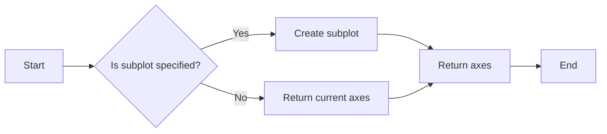

#### 带注释源码

```python
def subplot(nrows=1, ncols=1, sharex=False, sharey=False, row=1, col=1):
    """
    Create a subplot.

    Parameters
    ----------
    nrows : int, optional
        The number of rows of subplots.
    ncols : int, optional
        The number of columns of subplots.
    sharex : bool, optional
        Whether to share the x-axis.
    sharey : bool, optional
        Whether to share the y-axis.
    row : int, optional
        The row index of the subplot.
    col : int, optional
        The column index of the subplot.

    Returns
    -------
    matplotlib.axes.Axes
        The subplot object.
    """
    # ... (source code implementation)
```

### plt.plot

绘制二维数据。

描述：

该函数用于绘制二维数据。可以绘制线图、散点图等。

参数：

- `x`：`array_like`，可选。x轴数据。
- `y`：`array_like`，可选。y轴数据。
- `label`：`str`，可选。图例标签。
- `color`：`color`，可选。线条颜色。
- `linestyle`：`str`，可选。线条样式。
- `linewidth`：`float`，可选。线条宽度。

返回值：`matplotlib.lines.Line2D`，线条对象。

#### 流程图

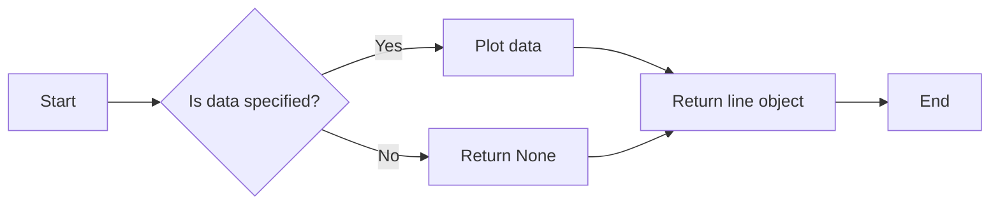

#### 带注释源码

```python
def plot(x=None, y=None, label=None, color=None, linestyle=None, linewidth=None):
    """
    Plot two-dimensional data.

    Parameters
    ----------
    x : array_like, optional
        The x-axis data.
    y : array_like, optional
        The y-axis data.
    label : str, optional
        The legend label.
    color : color, optional
        The line color.
    linestyle : str, optional
        The line style.
    linewidth : float, optional
        The line width.

    Returns
    -------
    matplotlib.lines.Line2D
        The line object.
    """
    # ... (source code implementation)
```

### plt.gca

获取当前轴。

描述：

该函数用于获取当前轴。当前轴是当前图形中的活动轴。

返回值：`matplotlib.axes.Axes`，当前轴对象。

#### 流程图

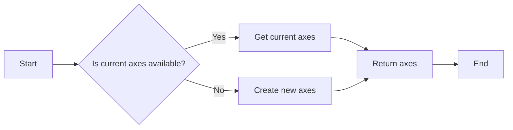

#### 带注释源码

```python
def gca():
    """
    Get the current axes.

    Returns
    -------
    matplotlib.axes.Axes
        The current axes object.
    """
    # ... (source code implementation)
```

### plt.show

显示图形。

描述：

该函数用于显示图形。如果图形已经显示，则刷新图形。

#### 流程图

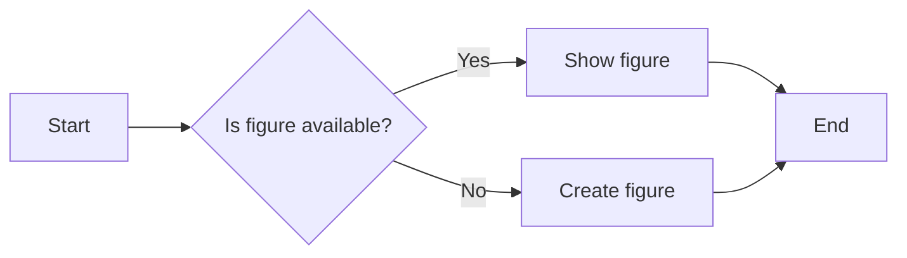

#### 带注释源码

```python
def show():
    """
    Show the figure.

    If the figure is already displayed, refresh the figure.
    """
    # ... (source code implementation)
```

### matplotlib.pyplot

matplotlib.pyplot模块提供了用于创建图形的函数。

描述：

matplotlib.pyplot模块是matplotlib的核心模块，提供了创建图形的函数。它使用当前图形和当前轴的概念。

#### 流程图

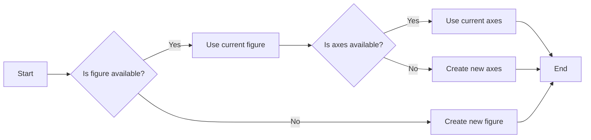

#### 带注释源码

```python
def pyplot():
    """
    The matplotlib.pyplot module provides functions for creating plots.

    It uses the concept of a current figure and current axes.
    """
    # ... (source code implementation)
```

### numpy.arange

生成沿指定间隔的数字序列。

描述：

numpy.arange函数用于生成沿指定间隔的数字序列。

参数：

- `start`：`int`，可选。序列的起始值。
- `stop`：`int`，可选。序列的结束值。
- `step`：`int`，可选。序列的间隔。

返回值：`numpy.ndarray`，数字序列。

#### 流程图

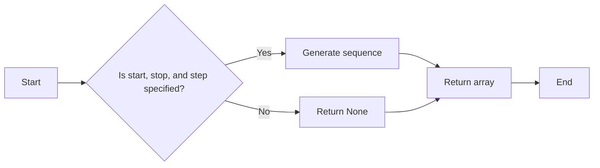

#### 带注释源码

```python
def arange(start=0, stop=50, step=1):
    """
    Generate a sequence of numbers along a specified interval.

    Parameters
    ----------
    start : int, optional
        The start value of the sequence.
    stop : int, optional
        The end value of the sequence.
    step : int, optional
        The interval between numbers.

    Returns
    -------
    numpy.ndarray
        The sequence of numbers.
    """
    # ... (source code implementation)
```

### numpy.sin

计算正弦值。

描述：

numpy.sin函数用于计算正弦值。

参数：

- `x`：`array_like`，输入值。

返回值：`array_like`，正弦值。

#### 流程图

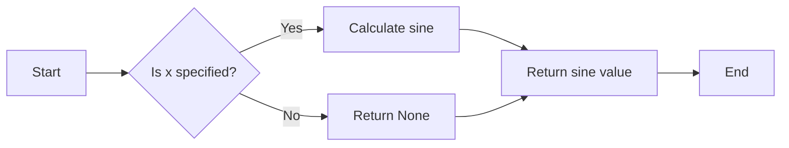

#### 带注释源码

```python
def sin(x):
    """
    Calculate the sine value.

    Parameters
    ----------
    x : array_like
        The input value.

    Returns
    -------
    array_like
        The sine value.
    """
    # ... (source code implementation)
```

### numpy.pi

π的值。

描述：

numpy.pi函数返回π的值。

返回值：`float`，π的值。

#### 流程图

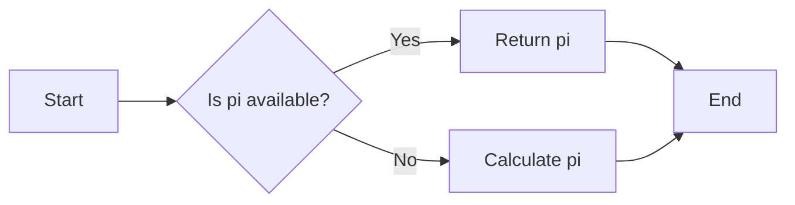

#### 带注释源码

```python
def pi():
    """
    Return the value of pi.

    Returns
    -------
    float
        The value of pi.
    """
    # ... (source code implementation)
```

### matplotlib.lines.Line2D

表示二维线条。

描述：

matplotlib.lines.Line2D类表示二维线条。

#### 流程图

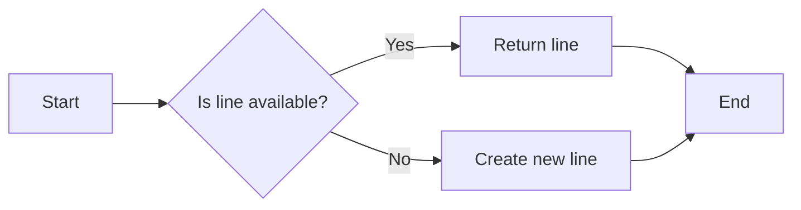

#### 带注释源码

```python
class Line2D:
    """
    Represents a two-dimensional line.
    """
    # ... (source code implementation)
```

### matplotlib.axes.Axes

表示轴。

描述：

matplotlib.axes.Axes类表示轴。

#### 流程图

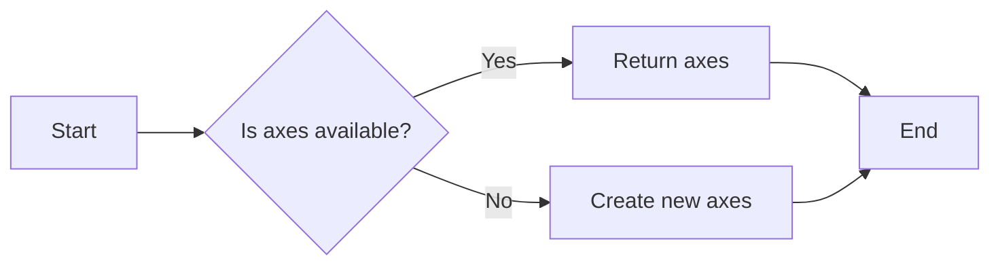

#### 带注释源码

```python
class Axes:
    """
    Represents an axis.
    """
    # ... (source code implementation)
```

### matplotlib.figure.Figure

表示图形。

描述：

matplotlib.figure.Figure类表示图形。

#### 流程图

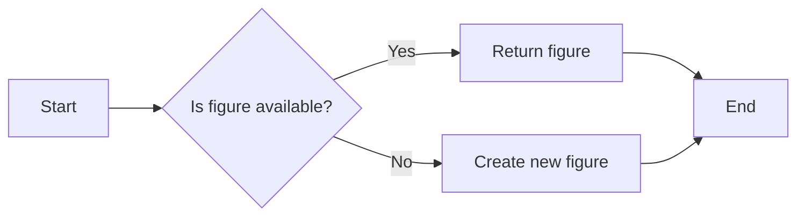

#### 带注释源码

```python
class Figure:
    """
    Represents a figure.
    """
    # ... (source code implementation)
```


### plt.figure()

该函数用于创建一个新的图形窗口，或者切换到已经存在的图形窗口。

参数：

- `num`：`int`，图形窗口的编号。如果编号对应的图形窗口不存在，则创建一个新的图形窗口。

返回值：`None`

#### 流程图


#### 带注释源码

```python
def figure(num=None):
    """
    Create a new figure or switch to an existing figure.

    Parameters
    ----------
    num : int, optional
        The figure number. If the figure with the given number does not exist,
        a new one is created.

    Returns
    -------
    None
    """
    # Check if the figure number is valid
    if num is not None:
        # Set the current figure
        plt._pylab_helpers.Gcf.from_gcf(num)
    else:
        # Create a new figure
        plt._pylab_helpers.Gcf.get_default()
```

### plt.subplot()

该函数用于在当前图形窗口中创建一个子图。

参数：

- `nrows`：`int`，子图行数。
- `ncols`：`int`，子图列数。
- `index`：`int`，子图索引。

返回值：`AxesSubplot`

#### 流程图

```mermaid
graph LR
A[Start] --> B{Is subplot index valid?}
B -- Yes --> C[Create subplot]
B -- No --> D[Error: Invalid subplot index]
C --> E[End]
D --> E
```

#### 带注释源码

```python
def subplot(nrows, ncols, index):
    """
    Create a subplot.

    Parameters
    ----------
    nrows : int
        The number of rows of subplots.
    ncols : int
        The number of columns of subplots.
    index : int
        The index of the subplot.

    Returns
    -------
    AxesSubplot
        The created subplot.
    """
    # Check if the subplot index is valid
    if index < 1 or index > nrows * ncols:
        raise ValueError("Invalid subplot index")
    # Create the subplot
    return plt._pylab_helpers.Gcf.from_gcf().gca(nrows=nrows, ncols=ncols, sharex=True, sharey=True)[index - 1]
```

### plt.plot()

该函数用于绘制二维曲线。

参数：

- `x`：`array_like`，x轴数据。
- `y`：`array_like`，y轴数据。
- `fmt`：`str`，线型、标记和颜色。

返回值：`Line2D`

#### 流程图

```mermaid
graph LR
A[Start] --> B{Is data valid?}
B -- Yes --> C[Plot data]
B -- No --> D[Error: Invalid data]
C --> E[End]
D --> E
```

#### 带注释源码

```python
def plot(x, y, fmt=None):
    """
    Plot data.

    Parameters
    ----------
    x : array_like
        The x-axis data.
    y : array_like
        The y-axis data.
    fmt : str, optional
        The line type, marker, and color.

    Returns
    -------
    Line2D
        The plotted line.
    """
    # Check if the data is valid
    if not isinstance(x, (list, np.ndarray)) or not isinstance(y, (list, np.ndarray)):
        raise ValueError("Invalid data")
    # Plot the data
    line = plt.plot(x, y, fmt)
    return line
```

### plt.gca()

该函数用于获取当前图形窗口的当前轴。

返回值：`AxesSubplot`

#### 流程图

```mermaid
graph LR
A[Start] --> B{Is current figure valid?}
B -- Yes --> C[Get current axis]
B -- No --> D[Error: Invalid current figure]
C --> E[End]
D --> E
```

#### 带注释源码

```python
def gca():
    """
    Get the current axis.

    Returns
    -------
    AxesSubplot
        The current axis.
    """
    # Check if the current figure is valid
    if not plt._pylab_helpers.Gcf.from_gcf():
        raise ValueError("Invalid current figure")
    # Get the current axis
    return plt._pylab_helpers.Gcf.from_gcf().gca()
```

### plt.show()

该函数用于显示图形窗口。

返回值：`None`

#### 流程图

```mermaid
graph LR
A[Start] --> B{Is figure valid?}
B -- Yes --> C[Show figure]
B -- No --> D[Error: Invalid figure]
C --> E[End]
D --> E
```

#### 带注释源码

```python
def show():
    """
    Show the figure.

    Returns
    -------
    None
    """
    # Check if the figure is valid
    if not plt._pylab_helpers.Gcf.from_gcf():
        raise ValueError("Invalid figure")
    # Show the figure
    plt._pylab_helpers.Gcf.from_gcf().canvas.draw()
```


### ax.set_xticklabels([])

设置当前Axes对象的x轴刻度标签为空。

参数：

- `[]`：`list`，一个空列表，用于移除所有的x轴刻度标签。

返回值：`None`，没有返回值，该方法直接修改Axes对象的属性。

#### 流程图

```mermaid
graph LR
A[Start] --> B{Call ax.set_xticklabels([])}
B --> C[End]
```

#### 带注释源码

```python
ax = plt.gca()  # 获取当前Axes对象
ax.set_xticklabels([])  # 设置x轴刻度标签为空
```


### plt.show()

显示当前图形的窗口。

参数：

- 无

返回值：`None`，无返回值，但会显示图形窗口。

#### 流程图

```mermaid
graph LR
A[开始] --> B{调用plt.show()}
B --> C[结束]
```

#### 带注释源码

```python
# 显示当前图形的窗口
plt.show()
```


### plt.figure

创建一个新的图形或获取当前图形。

描述：

该函数用于创建一个新的图形或获取当前图形。如果指定了图形编号，则返回该编号的图形；如果没有指定编号，则返回当前图形。如果指定的图形编号不存在，则创建一个新的图形。

参数：

- `num`：`int`，可选。图形的编号。如果未指定，则返回当前图形。

返回值：`Figure`，返回创建或获取的图形对象。

#### 流程图

```mermaid
graph LR
A[Start] --> B{Is num specified?}
B -- Yes --> C[Create new figure with num]
B -- No --> D[Get current figure]
C --> E[Return Figure]
D --> E
E --> F[End]
```

#### 带注释源码

```python
import matplotlib.pyplot as plt

def create_figure(num=None):
    """
    Create a new figure or get the current figure.

    Parameters:
    - num: int, optional. The figure number. If not specified, return the current figure.

    Returns:
    - Figure: The created or retrieved figure object.
    """
    return plt.figure(num)
```


### plt.figure

创建一个新的图形窗口或切换到现有的图形窗口。

描述：

该函数用于创建一个新的图形窗口，或者如果指定的图形窗口已经存在，则切换到该图形窗口。图形窗口是matplotlib中用于绘制图形的容器。

参数：

- `num`：`int`，图形窗口的编号。如果该编号的图形窗口不存在，则创建一个新的图形窗口；如果存在，则切换到该图形窗口。

返回值：`None`

#### 流程图

```mermaid
graph LR
A[Start] --> B{Is figure num exists?}
B -- Yes --> C[Switch to figure]
B -- No --> D[Create new figure]
D --> E[End]
C --> E
```

#### 带注释源码

```python
import matplotlib.pyplot as plt

def create_subplot(num):
    """
    Create a new figure or switch to an existing figure.

    Parameters:
    - num: int, the number of the figure to create or switch to.

    Returns:
    - None
    """
    plt.figure(num)
```


### plt.figure

`plt.figure` is a function from the `matplotlib.pyplot` module that manages figures in the plotting process.

参数：

- `num`：`int`，指定要操作的图编号。如果指定的编号不存在，则创建一个新的图。
- `figclass`：`matplotlib.figure.Figure`，指定要创建的图类的实例。默认为 `matplotlib.figure.Figure`。
- `dpi`：`int`，指定图像的分辨率（每英寸点数）。默认为 100。
- `facecolor`：`color`，指定图像的背景颜色。默认为 `'w'`（白色）。
- `edgecolor`：`color`，指定图像的边缘颜色。默认为 `'none'`。
- `frameon`：`bool`，指定是否显示图像的边框。默认为 `True`。
- `figsize`：`tuple`，指定图像的大小（宽度和高度）。默认为 `(6, 4)`。

返回值：`matplotlib.figure.Figure`，返回当前操作的图实例。

#### 流程图

```mermaid
graph LR
A[Start] --> B{Is figure number valid?}
B -- Yes --> C[Create figure]
B -- No --> D[Error: Invalid figure number]
C --> E[Set current figure]
E --> F[End]
D --> G[End]
```

#### 带注释源码

```python
import matplotlib.pyplot as plt

def plot_figure(num=None, figclass=None, dpi=None, facecolor=None, edgecolor=None, frameon=None, figsize=None):
    """
    Create a new figure or select an existing figure.

    Parameters:
    - num: int, the figure number to be selected or created.
    - figclass: matplotlib.figure.Figure, the class of the figure to be created.
    - dpi: int, the resolution of the figure (points per inch).
    - facecolor: color, the background color of the figure.
    - edgecolor: color, the edge color of the figure.
    - frameon: bool, whether to display the frame of the figure.
    - figsize: tuple, the size of the figure (width, height).

    Returns:
    - matplotlib.figure.Figure, the instance of the selected or created figure.
    """
    if num is None:
        num = plt.gcf().number + 1
    if figclass is None:
        figclass = plt.Figure
    if dpi is None:
        dpi = plt.rcParams['figure.dpi']
    if facecolor is None:
        facecolor = plt.rcParams['figure.facecolor']
    if edgecolor is None:
        edgecolor = plt.rcParams['figure.edgecolor']
    if frameon is None:
        frameon = plt.rcParams['figure.frameon']
    if figsize is None:
        figsize = plt.rcParams['figure.figsize']

    fig = figclass(dpi=dpi, facecolor=facecolor, edgecolor=edgecolor, frameon=frameon, figsize=figsize)
    plt.gcf().canvas.set_window_title(f'Figure {num}')
    plt.gcf().canvas.set_size_inches(figsize[0], figsize[1])
    plt.gcf().canvas.draw_idle()

    return fig
```


### plt.figure

`plt.figure` is a function from the `matplotlib.pyplot` module that manages figures in the plotting process.

参数：

- `num`：`int`，指定要操作的图编号。如果指定的编号不存在，则创建一个新的图。
- `figclass`：`matplotlib.figure.Figure`，指定要创建的图类的实例。默认为 `matplotlib.figure.Figure`。
- `dpi`：`int`，指定图像的分辨率（每英寸点数）。默认为 `100`。
- `facecolor`：`color`，指定图像的背景颜色。默认为 `'white'`。
- `edgecolor`：`color`，指定图像的边缘颜色。默认为 `'none'`。
- `frameon`：`bool`，指定是否显示图像的边框。默认为 `True`。
- `figsize`：`tuple`，指定图像的大小（宽度和高度）。默认为 `(6.4, 4.8)`。

返回值：`matplotlib.figure.Figure`，返回当前操作的图实例。

#### 流程图

```mermaid
graph LR
A[Start] --> B{Is figure number valid?}
B -- Yes --> C[Create or get figure]
B -- No --> D[Error: Invalid figure number]
C --> E[Set current figure]
E --> F[End]
D --> G[End]
```

#### 带注释源码

```python
import matplotlib.pyplot as plt

def figure(num=None, figclass=None, dpi=None, facecolor=None, edgecolor=None, frameon=None, figsize=None):
    """
    Create a new figure or select an existing figure.

    Parameters
    ----------
    num : int, optional
        The figure number to use. If no figure with the given number exists, a new one is created.
    figclass : matplotlib.figure.Figure, optional
        The class of the figure to create. Defaults to matplotlib.figure.Figure.
    dpi : int, optional
        The resolution of the figure in dots per inch. Defaults to 100.
    facecolor : color, optional
        The background color of the figure. Defaults to 'white'.
    edgecolor : color, optional
        The edge color of the figure. Defaults to 'none'.
    frameon : bool, optional
        Whether to display the frame of the figure. Defaults to True.
    figsize : tuple, optional
        The size of the figure in inches. Defaults to (6.4, 4.8).

    Returns
    -------
    matplotlib.figure.Figure
        The figure instance.
    """
    # ... (Implementation details)
```


## 关键组件


### 张量索引

张量索引用于访问和操作多维数组中的元素。

### 惰性加载

惰性加载是一种延迟计算或初始化数据的方法，直到实际需要时才进行。

### 反量化支持

反量化支持允许在量化过程中对某些操作进行非量化处理，以保持精度。

### 量化策略

量化策略定义了如何将浮点数转换为固定点数表示，以减少计算资源消耗。


## 问题及建议


### 已知问题

-   {问题1}：代码中使用了 `plt.figure()` 来创建和管理多个图形，这种方式依赖于隐式接口，容易导致当前图形的管理混乱和错误。
-   {问题2}：代码中直接在 `plt.subplot()` 后面调用 `plt.plot()`，这种方式没有创建 `Axes` 实例，可能导致代码的可读性和可维护性降低。
-   {问题3}：代码中使用了 `plt.gca()` 来获取当前轴（Axes），这种方式依赖于隐式接口，不如显式创建 `Axes` 实例清晰。

### 优化建议

-   {建议1}：建议使用显式接口来管理图形和轴，例如通过创建 `Figure` 和 `Axes` 实例来代替 `plt.figure()` 和 `plt.subplot()`。
-   {建议2}：建议在调用绘图函数之前创建 `Axes` 实例，这样可以提高代码的可读性和可维护性。
-   {建议3}：建议在代码中显式创建 `Axes` 实例，而不是使用 `plt.gca()`，这样可以更好地控制轴的属性和行为。
-   {建议4}：建议在代码中添加注释，说明每个步骤的目的和实现方式，以提高代码的可读性。
-   {建议5}：建议在代码中添加错误处理机制，以处理可能出现的异常情况，例如图形创建失败或轴属性设置错误。


## 其它


### 设计目标与约束

- 设计目标：提供一种更直观和易于管理的方式来处理多个matplotlib图形。
- 约束：必须兼容matplotlib的现有API，不改变其核心功能。

### 错误处理与异常设计

- 异常处理：确保在创建图形或处理图形时，任何异常都能被捕获并给出清晰的错误信息。
- 错误代码：定义一组错误代码，用于标识不同类型的错误。

### 数据流与状态机

- 数据流：数据从numpy数组到matplotlib图形的转换过程。
- 状态机：图形的状态管理，包括创建、修改和显示图形。

### 外部依赖与接口契约

- 外部依赖：依赖于matplotlib和numpy库。
- 接口契约：定义了与matplotlib和numpy交互的接口规范。


    