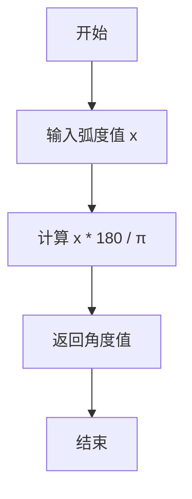
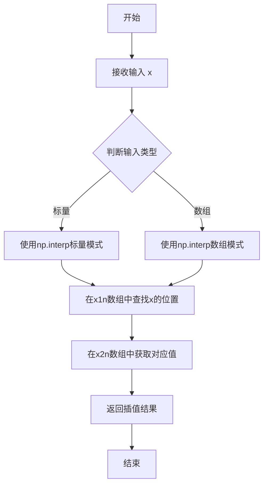
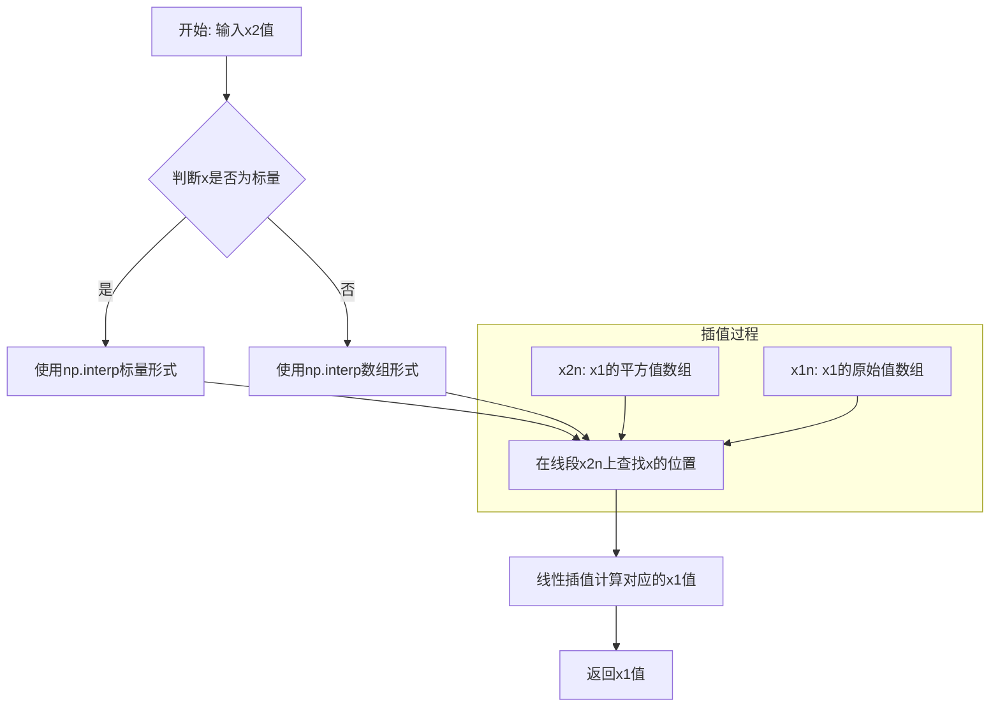
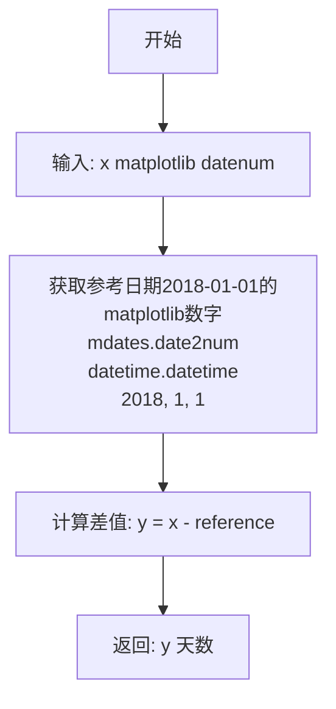
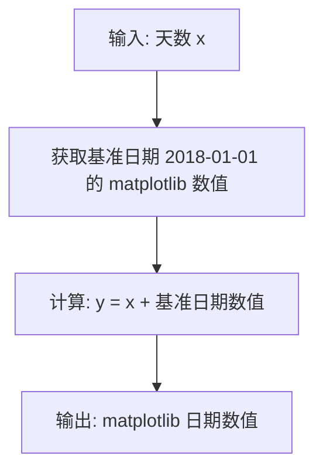
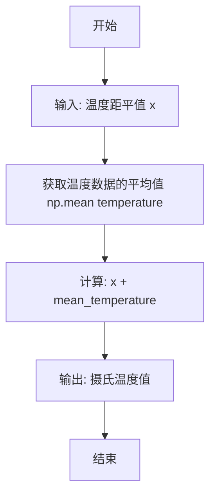

# `matplotlib\galleries\examples\subplots_axes_and_figures\secondary_axis.py` 详细设计文档

这是一个Matplotlib示例脚本，演示如何使用Axes.secondary_xaxis和secondary_yaxis在图表上创建次坐标轴，实现不同刻度单位之间的转换（如角度↔弧度、华氏度↔摄氏度、时间↔天数等），以及自定义坐标变换函数的用法。

## 整体流程

```mermaid
graph TD
    A[导入必要的库] --> B[创建Figure和Axes]
    B --> C[绘制主数据曲线]
    C --> D[定义转换函数对]
    D --> E[调用secondary_xaxis或secondary_yaxis]
    E --> F[设置次坐标轴标签]
    F --> G[调用plt.show()显示图表]
    G --> H[重复B-G流程创建其他示例]
    H --> I[结束]
```

## 类结构

```
Python脚本文件（非面向对象结构）
└── 全局函数集合
    ├── 转换函数组（角度/弧度）
    ├── 转换函数组（1/x 倒数）
    ├── 插值转换函数组（forward/inverse）
    ├── 日期转换函数组
    └── 温度转换函数组
```

## 全局变量及字段


### `fig`
    
图表容器，整个图表的顶层容器对象

类型：`matplotlib.figure.Figure`
    


### `ax`
    
主坐标轴对象，用于绑制主数据

类型：`matplotlib.axes.Axes`
    


### `x`
    
主坐标轴X数据，包含角度或数值类型的数据

类型：`numpy.ndarray`
    


### `y`
    
主坐标轴Y数据，包含正弦值或随机数值

类型：`numpy.ndarray`
    


### `secax`
    
次坐标轴对象，通过secondary_xaxis返回的通用次轴

类型：`matplotlib.axes._secondary.SecondaryAxis`
    


### `secax_x`
    
X轴次坐标轴对象，用于日期到年日的转换

类型：`matplotlib.axes._secondary.SecondaryAxis`
    


### `secax_y`
    
Y轴次坐标轴对象，用于摄氏度到华氏度的转换

类型：`matplotlib.axes._secondary.SecondaryAxis`
    


### `secax_y2`
    
第二个Y轴次坐标轴对象，用于显示温度异常值

类型：`matplotlib.axes._secondary.SecondaryAxis`
    


### `dates`
    
日期时间列表，包含从2018年1月1日开始的240个时间点

类型：`list`
    


### `temperature`
    
温度数据数组，包含随机生成的温度值

类型：`numpy.ndarray`
    


### `x1_vals`
    
第一个自变量数组，范围从2到10

类型：`numpy.ndarray`
    


### `x2_vals`
    
第二个自变量数组，为x1_vals的平方

类型：`numpy.ndarray`
    


### `x1n`
    
用于插值的扩展数组，从0到20的线性空间

类型：`numpy.ndarray`
    


### `x2n`
    
x1n的平方数组，用于非线性转换的插值

类型：`numpy.ndarray`
    


### `ydata`
    
Y轴数据，包含带有随机噪声的数值

类型：`numpy.ndarray`
    


    

## 全局函数及方法


### deg2rad

该函数是一个简单的数学转换函数，用于将角度（degrees）转换为弧度（radians），常作为 Matplotlib 副轴的转换函数之一。

参数：

- `x`：`float` 或 `array-like`，要转换的角度值，单位为度

返回值：`float` 或 `array-like`，转换后的弧度值

#### 流程图


#### 带注释源码

```python
def deg2rad(x):
    """
    将角度转换为弧度。

    参数:
        x: 角度值，单位为度。可以是标量或数组。

    返回:
        转换后的弧度值。
    """
    return x * np.pi / 180  # 将角度乘以 π/180 得到弧度
```


### `rad2deg`

该函数是一个简单的数学转换函数，用于将角度的弧度制转换为角度制，是 `deg2rad` 的逆函数。

参数：

- `x`：float 或 array_like，输入的弧度值

返回值：float 或 array_like，转换后的角度值

#### 流程图



#### 带注释源码

```python
def rad2deg(x):
    """
    将弧度转换为角度
    
    参数:
        x: 数值或数值数组，表示弧度值
    
    返回:
        转换后的角度值
    """
    return x * 180 / np.pi  # 将弧度乘以180除以π得到角度
```


### `one_over`

向量化求倒数函数，处理输入中的零值，将其替换为无穷大（inf）以避免除零错误，同时保持对数组和标量的向量化处理能力。

参数：

- `x`：`任意可以转换为 numpy 数组的类型（numpy.ndarray, list, scalar 等）`，输入值，可以是单个数值或数组

返回值：`numpy.ndarray (float)`，返回输入值的倒数，其中零值被替换为无穷大（np.inf）

#### 流程图

```mermaid
flowchart TD
    A[开始: 输入 x] --> B[将 x 转换为 numpy 数组<br/>x = np.array(x, float)]
    B --> C[检测接近零的元素<br/>near_zero = np.isclose(x, 0)]
    C --> D[将接近零的元素设置为无穷大<br/>x[near_zero] = np.inf]
    D --> E[计算非零元素的倒数<br/>x[~near_zero] = 1 / x[~near_zero]]
    E --> F[返回结果数组]
```

#### 带注释源码

```python
def one_over(x):
    """Vectorized 1/x, treating x==0 manually"""
    # 将输入转换为 numpy 数组，确保向量化操作
    # 支持标量、列表或其他可迭代对象输入
    x = np.array(x, float)
    
    # 检测输入中接近零的元素
    # np.isclose 用于处理浮点数近似比较，避免直接使用 == 0
    near_zero = np.isclose(x, 0)
    
    # 将接近零的元素设置为无穷大
    # 这样可以避免除零错误，同时保持数组形状
    x[near_zero] = np.inf
    
    # 对非零元素计算倒数
    # 使用布尔索引只处理非零元素，提高效率
    x[~near_zero] = 1 / x[~near_zero]
    
    # 返回处理后的数组
    return x
```


### `forward`

线性插值正向转换函数，用于将第一组自变量 x1 的值通过线性插值映射到第二组自变量 x2 的值（基于 x1² 关系）。

参数：

- `x`：numpy.ndarray 或 float，输入的 x1 值（第一组自变量），可以是标量或数组

返回值：numpy.ndarray 或 float，经过线性插值转换后的 x2 值

#### 流程图



#### 带注释源码

```python
def forward(x):
    """
    将x1值通过线性插值转换为x2值
    
    该函数利用numpy的interp函数，在预计算好的x1n和x2n数组之间
    进行线性插值。x1n和x2n之间的关系为 x2 = x1²
    
    参数:
        x: 输入的x1值，可以是单个数值或numpy数组
        
    返回:
        对应的x2值，与输入x类型相同
    """
    return np.interp(x, x1n, x2n)
```


### `inverse`

该函数是线性插值逆向转换函数，用于将secondary axis的x2值（非线性变换后的值）通过线性插值转换回原始的x1值。在示例中，x2是x1的平方（x2 = x1²），inverse函数实现从x2到x1的逆向映射，供matplotlib的secondary_xaxis使用。

参数：

-  `x`：`numpy.ndarray` 或 `float`，需要转换的x2值（即x1的平方值）

返回值：`numpy.ndarray` 或 `float`，通过线性插值计算得到的x1原始值

#### 流程图



#### 带注释源码

```python
def inverse(x):
    """
    线性插值逆向转换函数（x2 -> x1）
    
    该函数是forward函数的逆函数，用于secondary axis的逆向转换。
    在本例中，x2 = x1^2，因此该函数通过线性插值实现从x2到x1的映射。
    
    参数:
        x: array_like
            需要转换的x2值，可以是单个数值或numpy数组
        
    返回:
        numpy.ndarray 或 float
            通过线性插值计算得到的x1值
    """
    # np.interp是numpy的线性插值函数
    # 参数说明:
    #   x: 需要插值的点（本例中是x2值）
    #   x2n: 已知的x2数组（作为插值的x坐标）
    #   x1n: 已知的x1数组（作为插值的y坐标）
    # 
    # 这里实现了从x2到x1的逆向查找:
    #   给定一个x2值，在x2n数组中查找其位置，
    #   然后对应的x1n值就是转换结果
    return np.interp(x, x2n, x1n)
```


### date2yday

将 matplotlib 日期数字转换为自 2018-01-01 以来的天数。

参数：

- `x`：`float` 或 `numpy.ndarray`，matplotlib datenum（matplotlib 日期数字格式）

返回值：`float` 或 `numpy.ndarray`，自 2018-01-01 以来的天数

#### 流程图



#### 带注释源码

```python
def date2yday(x):
    """Convert matplotlib datenum to days since 2018-01-01."""
    # 将参考日期2018-01-01转换为matplotlib日期数字
    # mdates.date2num返回自0001-01-01以来的天数（浮点数）
    reference = mdates.date2num(datetime.datetime(2018, 1, 1))
    
    # 计算输入日期与参考日期的差值，得到天数
    y = x - reference
    
    # 返回转换后的天数
    return y
```


### `yday2date`

将天数偏移量转换为对应的 matplotlib 日期数值。

参数：

-  `x`：`float` 或 `array_like`，距离 2018-01-01 的天数偏移量

返回值：`float` 或 `ndarray`，对应的 matplotlib 日期数值

#### 流程图



#### 带注释源码

```python
def yday2date(x):
    """Return a matplotlib datenum for *x* days after 2018-01-01."""
    # 将天数偏移量加上 2018-01-01 对应的 matplotlib 日期数值
    y = x + mdates.date2num(datetime.datetime(2018, 1, 1))
    return y
```


### `celsius_to_fahrenheit`

该函数是一个用于温度单位转换的数学工具函数，主要应用于数据可视化场景（如 Matplotlib 绘图），实现将主坐标轴的摄氏温度数值映射到次坐标轴的华氏温度数值。

参数：

-  `x`：`float` 或 `numpy.ndarray`，输入的摄氏温度值。

返回值：`float` 或 `numpy.ndarray`，转换后的华氏温度值。

#### 流程图


#### 带注释源码

```python
def celsius_to_fahrenheit(x):
    """
    将摄氏度转换为华氏度。

    转换公式: F = C * 1.8 + 32
    """
    return x * 1.8 + 32
```


### `fahrenheit_to_celsius`

将华氏温度值转换为摄氏度。该函数是Matplotlib图表中secondary_yaxis的转换函数之一，用于在Y轴上显示华氏度和摄氏度之间的转换。

参数：

- `x`：`float` 或 `int`，华氏温度值

返回值：`float`，对应的摄氏度温度值

#### 流程图

```mermaid
flowchart TD
    A[开始] --> B[输入华氏度 x]
    B --> C{检查输入是否为数值类型}
    C -->|是| D[计算摄氏度: (x - 32) / 1.8]
    C -->|否| E[返回TypeError或NaN]
    D --> F[返回摄氏度结果]
    E --> F
```

#### 带注释源码

```python
def fahrenheit_to_celsius(x):
    """
    将华氏度转换为摄氏度
    
    参数:
        x: float 或 int - 华氏温度值
        
    返回:
        float - 摄氏温度值
        
    公式: °C = (°F - 32) / 1.8
    """
    return (x - 32) / 1.8
```


### celsius_to_anomaly

该函数用于将摄氏温度转换为温度距平（即温度值与平均温度的差值），常用于气象数据分析中以消除季节性变化的影响。

参数：

- `x`：`float` 或 `array-like`，输入的摄氏温度值

返回值：`float` 或 `array-like`，返回温度距平值（输入温度减去平均温度的差值）

#### 流程图

```mermaid
flowchart TD
    A[输入摄氏温度 x] --> B[计算全局变量 temperature 的平均值]
    B --> C[计算差值: x - np.mean(temperature)]
    C --> D[输出温度距平值]
```

#### 带注释源码

```python
def celsius_to_anomaly(x):
    """
    将摄氏温度转换为温度距平（与平均温度的偏差）
    
    参数:
        x: 摄氏温度值，可以是单个数值或数组
    
    返回:
        温度距平值（输入值减去平均温度）
    """
    return (x - np.mean(temperature))  # 计算输入温度与平均温度的差值
```


### `anomaly_to_celsius`

将温度距平值转换为实际摄氏温度值的函数。该函数接收一个温度距平（与平均温度的差值）作为输入，通过加上预先计算的平均温度值来恢复原始的摄氏温度表示。

参数：

- `x`：数值型（numpy array 或 float），温度距平值，即与平均温度的差值

返回值：`数值型`（numpy array 或 float），转换后的实际摄氏温度值

#### 流程图



#### 带注释源码

```python
def anomaly_to_celsius(x):
    """将温度距平转换为摄氏温度。
    
    参数:
        x: 温度距平值（与平均温度的差值）
        
    返回:
        实际的摄氏温度值
    """
    # 获取温度数据的平均值（使用预先存在的全局变量temperature）
    mean_temp = np.mean(temperature)
    
    # 将距平值加上平均温度，得到实际的摄氏温度值
    # 公式: 摄氏温度 = 距平值 + 平均温度
    return (x + mean_temp)
```

## 关键组件


### secondary_xaxis

matplotlib Axes对象的次X轴方法，用于在图表顶部或底部创建第二个X轴，实现不同单位或尺度的数据显示

### secondary_yaxis

matplotlib Axes对象的次Y轴方法，用于在图表右侧或左侧创建第二个Y轴，支持双Y轴显示不同单位的数据

### functions参数

次坐标轴的转换函数元组，接收(forward, inverse)两个函数，用于在主坐标轴和次坐标轴之间进行数据转换

### 坐标变换函数组

包括deg2rad/rad2deg（角度转弧度）、one_over/inverse（倒数变换）、date2yday/yday2date（日期转年日）、celsius_to_fahrenheit/fahrenheit_to_celsius（摄氏华氏转换）、celsius_to_anomaly/anomaly_to_celsius（温度距平转换）等，用于实现各种单位换算

### transform参数

用于指定次坐标轴位置的坐标空间变换，如ax.transData将轴放置在数据坐标系中的指定位置

### 线性插值函数

使用np.interp实现的forward和inverse函数，通过线性插值在两组独立变量之间进行映射，适用于非线性关系的坐标转换

### 双log坐标轴

在log-log尺度图表中使用次坐标轴进行频率与周期的转换展示


## 问题及建议


### 已知问题

-   **代码冗余**：多个示例中重复出现 `fig, ax = plt.subplots(layout='constrained')` 和相同的绘图设置步骤，导致代码重复度高。
-   **缺乏输入验证**：转换函数（如 `deg2rad`、`rad2deg`、`celsius_to_fahrenheit` 等）未对输入进行类型检查或有效性验证，可能在处理异常输入时导致运行时错误。
-   **硬编码值**：随机种子（`np.random.seed(19680801)`）、刻度位置（如 `secax.set_xticks([10, 20, 40, 60, 80, 100])`）等被硬编码，降低了代码的灵活性和可维护性。
-   **文档不完整**：部分函数（如 `forward`、`inverse`）的文档字符串过于简单，仅包含简单描述，缺少参数类型、返回值和异常处理的说明。
-   **全局命名空间污染**：多个转换函数（如 `deg2rad`、`rad2deg`、`date2yday` 等）定义在全局作用域中，可能与其他模块冲突，且不利于代码组织。

### 优化建议

-   **重构代码结构**：将重复的图形创建和设置逻辑封装为函数或类，例如定义 `create_figure()` 和 `setup_axis()` 函数，以减少冗余。
-   **添加输入验证**：在转换函数中加入参数检查，例如使用 `isinstance()` 验证类型，或使用 `np.isfinite()` 检查数值有效性，并提供清晰的错误信息。
-   **参数化配置**：将硬编码值提取到配置文件或脚本顶部的常量定义中，例如使用 `RANDOM_SEED = 19680801` 和 `XTICKS = [10, 20, 40, 60, 80, 100]`，提高代码可配置性。
-   **完善文档**：为所有函数添加详细的文档字符串，包括参数类型、返回值说明、示例和异常处理，例如使用 NumPy 风格的文档。
-   **模块化设计**：将转换函数组织到单独的模块或类中，例如创建 `Transforms` 类或 `transforms.py` 模块，以避免全局污染并提高可测试性。
-   **考虑性能优化**：对于大规模数据处理，可以评估是否需要优化转换函数，例如使用向量化操作或缓存机制。


## 其它


### 设计目标与约束

该代码展示了matplotlib中secondary axis（次坐标轴）的功能，主要设计目标包括：1）允许在同一图表上显示两个不同尺度的坐标轴；2）支持任意数学转换函数（线性、非线性、日期转换等）；3）支持自定义变换（transform）来定位坐标轴；4）支持x轴和y轴的次坐标轴。约束条件包括：转换函数必须是可调用的且支持向量化操作；当父坐标轴为对数尺度时，子坐标轴也会自动变为对数尺度；为了正确处理数据边界，映射函数需要在可见范围之外定义。

### 错误处理与异常设计

代码中的潜在错误及处理方式：1）转换函数输入验证：如果转换函数返回NaN或Inf，可能导致绘图异常；2）空数据处理：当输入数组为空时，np.interp等函数会报错；3）转换函数不互逆：如果forward和inverse函数不是严格的数学逆函数，会导致数据映射错误；4）位置参数越界：secondary_yaxis的位置参数超过合理范围时可能导致坐标轴不可见；5）日期转换边界：datetime64转换时需要确保输入是有效的matplotlib日期数字。

### 数据流与状态机

主数据流：1）用户创建主Axes对象；2）定义forward和inverse转换函数；3）调用secondary_xaxis或secondary_yaxis创建次坐标轴；4）内部创建新的Axes对象作为子坐标轴；5）通过_functions属性存储转换函数；6）绘图时自动应用转换。状态转换包括：创建状态（初始化Axes）、配置状态（设置转换函数和位置）、绑定状态（将子坐标轴关联到父坐标轴）、渲染状态（应用转换并绘制）。

### 外部依赖与接口契约

主要依赖：1）matplotlib.pyplot - 绘图框架；2）matplotlib.axes.Axes - 坐标轴类，提供secondary_xaxis和secondary_yaxis方法；3）matplotlib.transforms - 变换系统；4）numpy - 数值计算；5）datetime - 日期处理；6）matplotlib.dates - 日期转换工具。接口契约：secondary_xaxis(location, functions=(forward, inverse), transform=None) - location支持位置参数或'top'/'bottom'，functions为转换函数元组，transform可选；secondary_yaxis类似但支持'left'/'right'或浮点数位置。

### 性能考虑

潜在性能问题：1）转换函数在每次重绘时被调用，对于大数据集可能影响性能；2）使用np.interp进行线性插值时，插值节点数量影响精度和性能；3）多坐标轴场景下，重复计算可能显著增加渲染时间；4）对数尺度变换在大数据量时计算开销较大。优化建议：对于实时交互场景，考虑缓存转换结果；使用向量化操作避免Python循环；预先计算插值表。

### 安全性考虑

代码本身不涉及用户输入或网络通信，安全性风险较低。但需要注意：1）转换函数中的除法操作需处理除零情况（如one_over函数中的near_zero处理）；2）自定义变换函数应避免执行恶意代码；3）当转换函数产生极端值时可能影响图形渲染稳定性。

### 兼容性考虑

该功能在matplotlib 3.1+版本中可用。兼容性注意事项：1）transform参数在某些旧版本中可能行为不同；2）layout='constrained'参数需要matplotlib 3.0+；3）np.datetime64的支持依赖于底层matplotlib版本；4）日志变换要求父坐标轴和子坐标轴都是对数尺度。

### 测试策略

应包含的测试用例：1）基本功能测试：验证secondary axis正确创建和显示；2）转换函数测试：测试deg2rad/rad2deg、celsius_to_fahrenheit等标准转换；3）边界条件测试：测试空数组、单元素数组、极端值；4）位置参数测试：测试各种位置参数（'top', 'bottom', 0, 1.2等）；5）变换类型测试：测试线性、对数、线性插值、日期转换；6）反向映射测试：验证inverse函数的正确性；7）多坐标轴测试：测试同时使用多个secondary axis；8）渲染测试：验证保存为图像文件时的正确性。

### 使用示例和最佳实践

最佳实践：1）始终提供成对的forward和inverse函数以确保数据可逆；2）对于使用插值的场景，确保映射函数在数据范围外也有定义；3）使用np.isclose处理浮点数比较以避免精度问题；4）当需要多个y轴转换时，使用位置参数（如1.2）而非'right'来避免重叠；5）在复杂转换场景下，先验证转换函数的数学正确性再应用于图表。

    