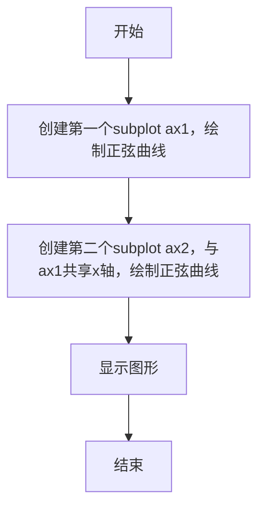
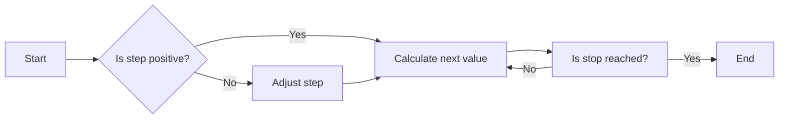
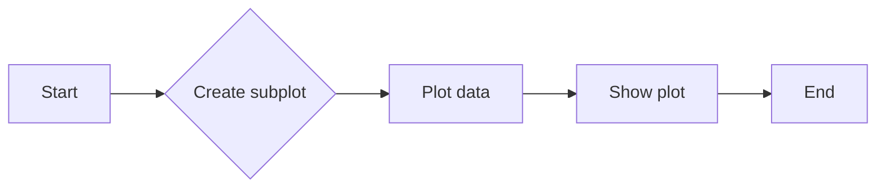
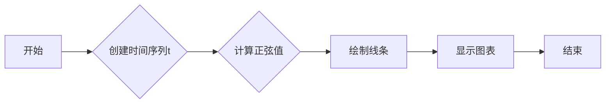

# `matplotlib\galleries\examples\subplots_axes_and_figures\share_axis_lims_views.py` 详细设计文档

This code demonstrates how to share axis limits and views between multiple subplots in Matplotlib.

## 整体流程



## 类结构

```
matplotlib.pyplot (主模块)
├── ax1 (第一个subplot)
│   ├── plot(t, np.sin(2*np.pi*t))
├── ax2 (第二个subplot)
│   ├── sharex=ax1
│   └── plot(t, np.sin(4*np.pi*t))
```

## 全局变量及字段


### `t`
    
An array of time values ranging from 0 to 10 with a step of 0.01.

类型：`numpy.ndarray`
    


### `matplotlib.pyplot`
    
The matplotlib.pyplot module provides a MATLAB-like interface to the matplotlib library.

类型：`module`
    


### `ax1`
    
The first subplot object created with shared x-axis.

类型：`matplotlib.axes._subplots.AxesSubplot`
    


### `ax2`
    
The second subplot object created with shared x-axis and y-axis with ax1.

类型：`matplotlib.axes._subplots.AxesSubplot`
    


### `matplotlib.pyplot.ax1`
    
The first subplot object with shared x-axis.

类型：`matplotlib.axes._subplots.AxesSubplot`
    


### `matplotlib.pyplot.ax2`
    
The second subplot object with shared x-axis and y-axis with ax1.

类型：`matplotlib.axes._subplots.AxesSubplot`
    
    

## 全局函数及方法


### np.arange

`np.arange` 是 NumPy 库中的一个函数，用于生成一个沿指定间隔的数字序列。

参数：

- `start`：`int`，序列的起始值。
- `stop`：`int`，序列的结束值（不包括此值）。
- `step`：`int`，序列中相邻元素之间的间隔，默认为 1。

返回值：`numpy.ndarray`，一个沿指定间隔的数字序列。

#### 流程图



#### 带注释源码

```python
import numpy as np

# 生成一个从 0 到 10（不包括 10），间隔为 0.01 的数字序列
t = np.arange(0, 10, 0.01)
```


### np.sin

计算输入数值的正弦值。

参数：

- `x`：`numpy.ndarray`，输入的数值数组，可以是单个数值或数组。

返回值：`numpy.ndarray`，与输入数组相同形状的正弦值数组。

#### 流程图

```mermaid
graph LR
A[Start] --> B{Is x a numpy.ndarray?}
B -- Yes --> C[Calculate sin(x)]
B -- No --> D[Error: Invalid input type]
C --> E[End]
D --> E
```

#### 带注释源码

```python
import numpy as np

def np_sin(x):
    """
    Calculate the sine of the input value(s).

    Parameters:
    - x: numpy.ndarray, the input value(s) for which to calculate the sine.

    Returns:
    - numpy.ndarray, the sine of the input value(s).
    """
    return np.sin(x)
```


### `matplotlib.pyplot.subplot`

`matplotlib.pyplot.subplot` 是一个用于创建子图的方法，它允许用户在同一个图形窗口中创建多个子图，并且可以共享坐标轴。

参数：

- `nrows`：`int`，子图的总行数。
- `ncols`：`int`，子图的总列数。
- `sharex`：`bool` 或 `Axes` 对象，如果为 `True`，则所有子图共享 x 轴；如果为 `Axes` 对象，则与指定的 `Axes` 对象共享 x 轴。
- `sharey`：`bool` 或 `Axes` 对象，如果为 `True`，则所有子图共享 y 轴；如果为 `Axes` 对象，则与指定的 `Axes` 对象共享 y 轴。
- `subplot_kw`：`dict`，传递给 `Axes` 的关键字参数。
- ` gridspec_kw`：`dict`，传递给 `GridSpec` 的关键字参数。

返回值：`Axes` 对象，表示创建的子图。

#### 流程图



#### 带注释源码

```python
import matplotlib.pyplot as plt
import numpy as np

# 创建时间序列
t = np.arange(0, 10, 0.01)

# 创建第一个子图
ax1 = plt.subplot(211)
# 在第一个子图上绘制正弦曲线
ax1.plot(t, np.sin(2*np.pi*t))

# 创建第二个子图，与第一个子图共享 x 轴
ax2 = plt.subplot(212, sharex=ax1)
# 在第二个子图上绘制正弦曲线
ax2.plot(t, np.sin(4*np.pi*t))

# 显示图形
plt.show()
```


### `matplotlib.pyplot.plot`

`matplotlib.pyplot.plot` 是一个用于绘制二维线条图的函数，它可以将数据点连接起来，形成一条线。

参数：

- `t`：`numpy.ndarray`，时间序列数据，用于定义x轴的值。
- `np.sin(2*np.pi*t)`：`numpy.ndarray`，正弦函数计算结果，用于定义y轴的值。

返回值：`matplotlib.lines.Line2D`，表示绘制的线条对象。

#### 流程图



#### 带注释源码

```python
import matplotlib.pyplot as plt
import numpy as np

# 创建时间序列t
t = np.arange(0, 10, 0.01)

# 计算正弦值
y = np.sin(2*np.pi*t)

# 绘制线条
plt.plot(t, y)

# 显示图表
plt.show()
```


### plt.show()

显示当前图形的窗口。

参数：

- 无

返回值：无

#### 流程图

```mermaid
graph LR
A[开始] --> B{调用plt.show()}
B --> C[结束]
```

#### 带注释源码

```
plt.show()
```

该函数调用matplotlib的底层功能来显示当前图形的窗口。它不接收任何参数，也没有返回值。当调用此函数时，matplotlib会根据当前图形的内容和设置，打开一个窗口并显示图形。在这个例子中，它将显示由`plt.subplot`和`plt.plot`创建的两个子图。

## 关键组件


### 张量索引

张量索引是用于访问和操作多维数组（张量）中特定元素的方法。

### 惰性加载

惰性加载是一种编程技术，它延迟对象的初始化直到实际需要时才进行，从而提高性能和资源利用率。

### 反量化支持

反量化支持是指系统或库能够处理和解释量化操作的反向过程，即从量化后的数据恢复到原始数据。

### 量化策略

量化策略是指将浮点数数据转换为固定点数表示的方法，通常用于优化计算效率和存储空间。


## 问题及建议


### 已知问题

-   {问题1}：代码示例中使用了硬编码的数值，如`np.arange(0, 10, 0.01)`和`np.sin(2*np.pi*t)`，这可能导致代码的可复用性降低，特别是在需要调整时间范围或频率时。
-   {问题2}：代码示例没有包含任何错误处理机制，如果matplotlib库不可用或发生其他异常，程序可能会崩溃。
-   {问题3}：代码示例没有使用任何日志记录或调试信息，这可能会在调试复杂问题时变得困难。

### 优化建议

-   {建议1}：引入参数化输入，允许用户指定时间范围、频率和函数类型，以提高代码的可复用性和灵活性。
-   {建议2}：添加异常处理和日志记录，以便在出现问题时提供更多的上下文信息，并确保程序在遇到错误时能够优雅地处理。
-   {建议3}：考虑使用配置文件或环境变量来管理参数，这样可以在不修改代码的情况下调整设置。
-   {建议4}：如果代码将用于生产环境，应考虑添加单元测试来验证代码的正确性和稳定性。
-   {建议5}：如果代码是库的一部分，应确保文档齐全，包括如何安装、配置和使用代码的说明。


## 其它


### 设计目标与约束

- 设计目标：实现共享坐标轴的绘图功能，允许用户在多个子图中共享x轴或y轴。
- 约束条件：必须使用matplotlib库进行绘图，且代码应简洁易读。

### 错误处理与异常设计

- 错误处理：确保在创建子图时，如果传入的参数不正确，能够抛出相应的异常。
- 异常设计：定义自定义异常类，用于处理特定的错误情况，如无效的共享轴参数。

### 数据流与状态机

- 数据流：数据从numpy的arange函数生成，然后通过matplotlib的plot函数绘制到图表中。
- 状态机：程序从初始化开始，通过创建子图和绘图操作，最终到达显示图表的状态。

### 外部依赖与接口契约

- 外部依赖：依赖于matplotlib和numpy库。
- 接口契约：matplotlib的Axes对象支持sharex和sharey属性，用于实现坐标轴共享。


    