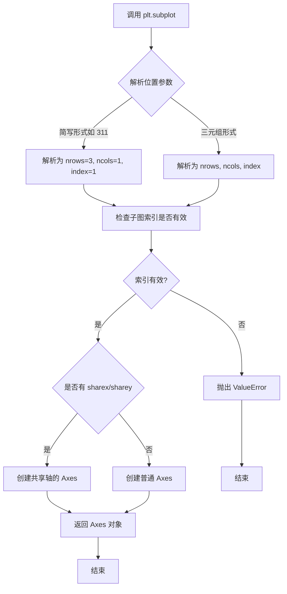
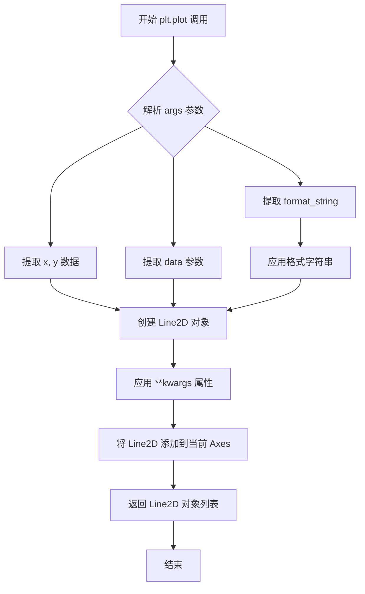
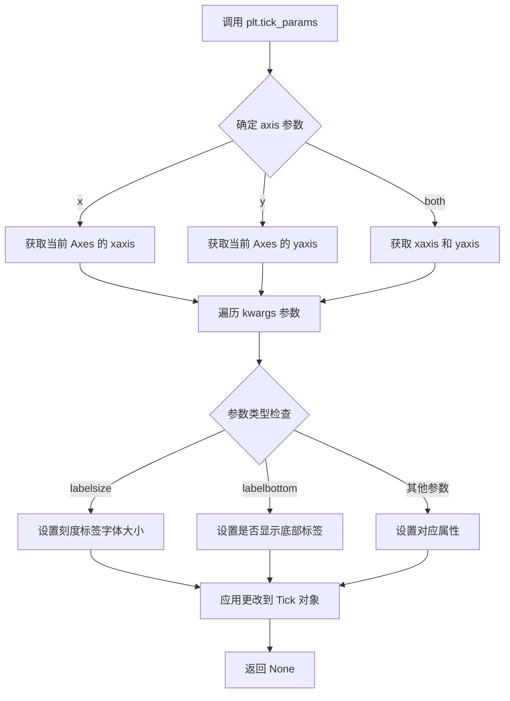
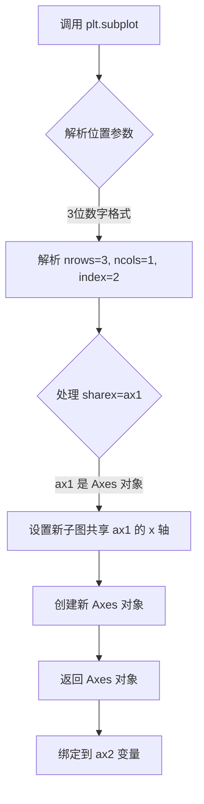
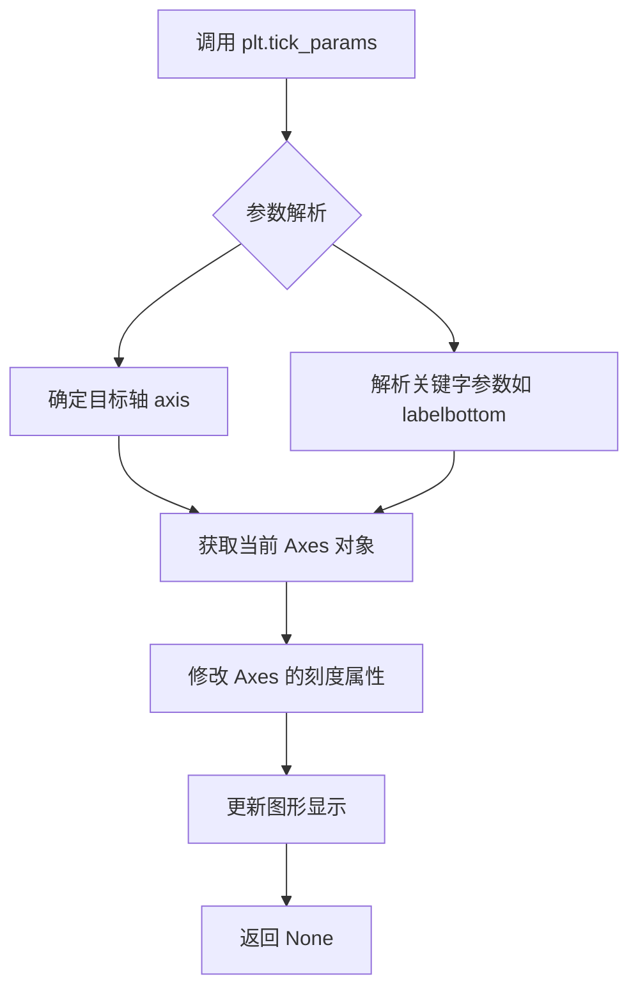
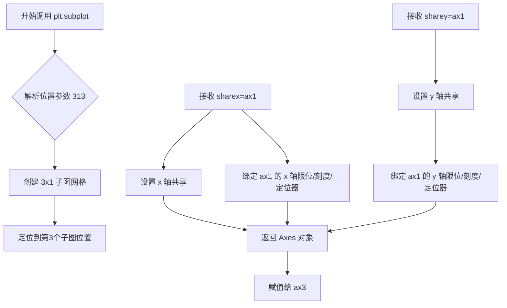
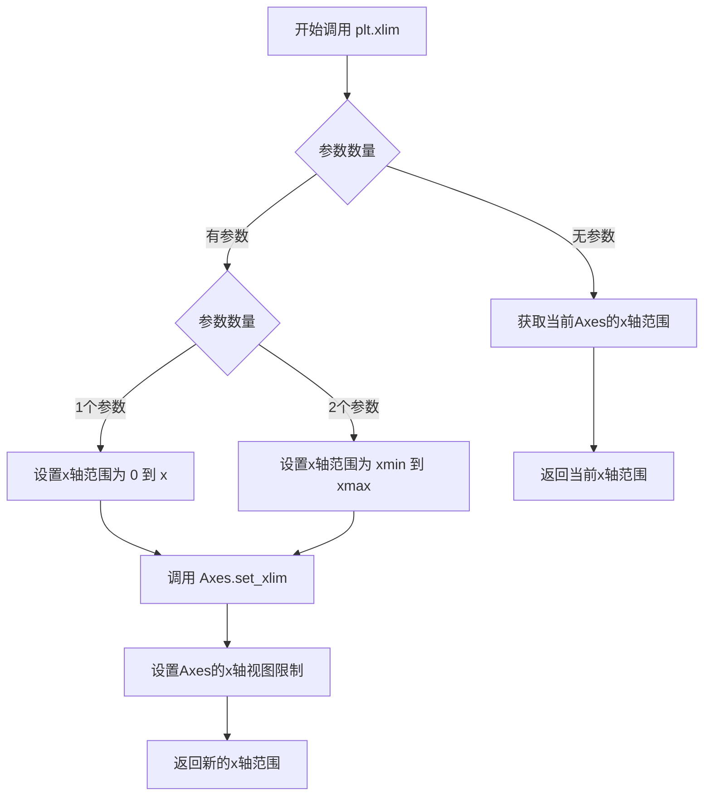
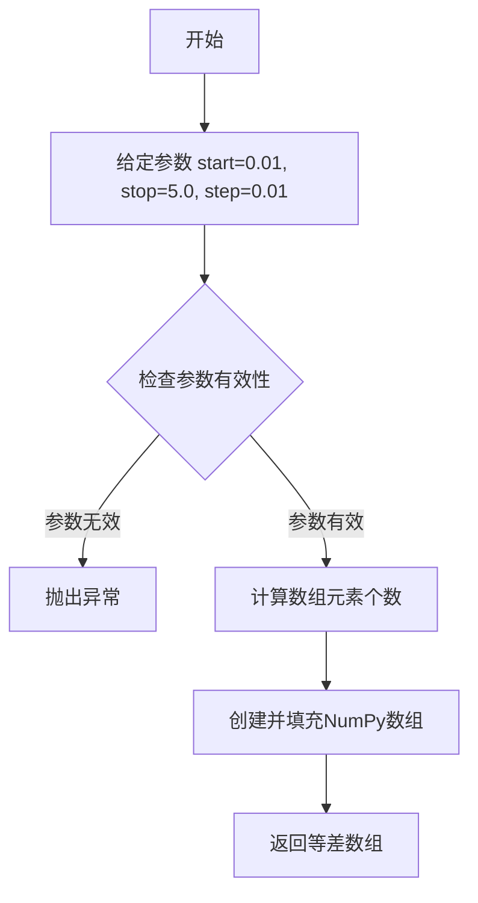
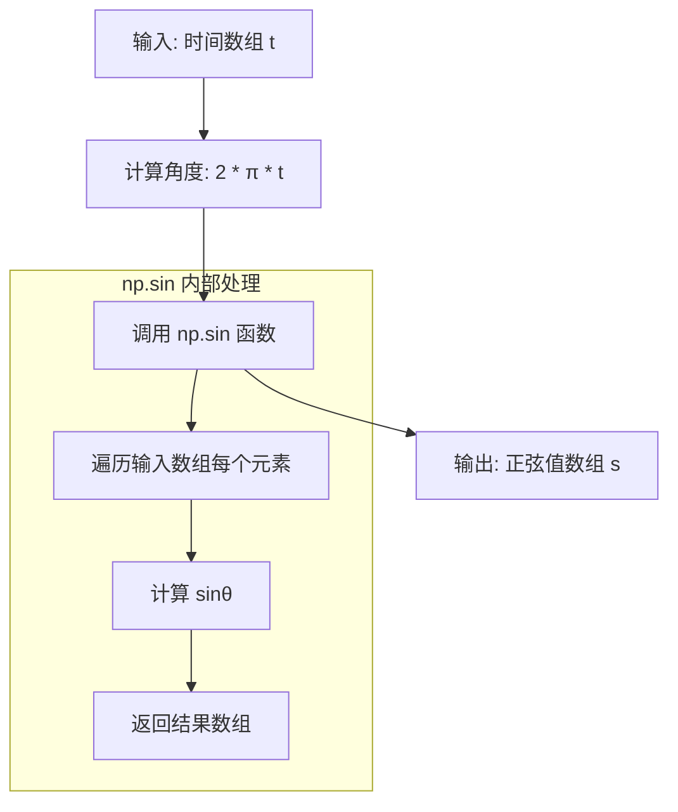
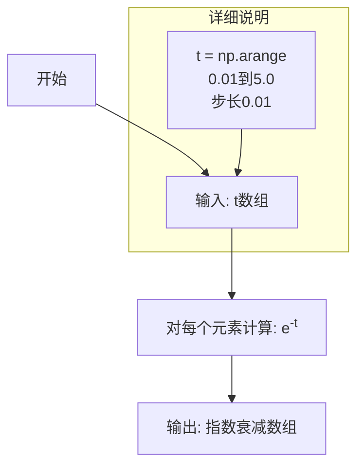

# `matplotlib\galleries\examples\subplots_axes_and_figures\shared_axis_demo.py` 详细设计文档

该代码展示了 matplotlib 中如何通过 sharex 和 sharey 参数创建共享轴的子图，实现多个子图之间 axis limits、tick locators、tick formatters 的同步，以及如何在特定子图上自定义 tick labels 的显示。

## 整体流程

```mermaid
graph TD
    A[开始] --> B[导入 matplotlib.pyplot 和 numpy]
    B --> C[生成数据: t, s1, s2, s3]
    C --> D[创建第一个子图 ax1]
    D --> E[绘制 s1 曲线]
    E --> F[设置 x 轴 tick labels 字体大小为 6]
    F --> G[创建第二个子图 ax2, sharex=ax1]
    G --> H[绘制 s2 曲线]
    H --> I[隐藏 x 轴 tick labels]
    I --> J[创建第三个子图 ax3, sharex=ax1, sharey=ax1]
    J --> K[绘制 s3 曲线]
    K --> L[设置 x 轴范围 0.01-5.0]
    L --> M[调用 plt.show() 显示图像]
```

## 类结构

```
matplotlib.pyplot (模块)
├── Figure (画布)
│   └── Axes (坐标轴)
│       ├── ax1 (子图1: 无共享)
│       ├── ax2 (子图2: 共享x轴)
│       └── ax3 (子图3: 共享x和y轴)
numpy (模块)
└── ndarray (数组)
```

## 全局变量及字段


### `t`
    
时间数组，从 0.01 到 5.0，步长 0.01

类型：`numpy.ndarray`
    


### `s1`
    
正弦波信号，频率 2π

类型：`numpy.ndarray`
    


### `s2`
    
指数衰减信号 exp(-t)

类型：`numpy.ndarray`
    


### `s3`
    
正弦波信号，频率 4π

类型：`numpy.ndarray`
    


### `ax1`
    
第一个子图对象

类型：`matplotlib.axes.Axes`
    


### `ax2`
    
第二个子图对象，共享 x 轴

类型：`matplotlib.axes.Axes`
    


### `ax3`
    
第三个子图对象，共享 x 和 y 轴

类型：`matplotlib.axes.Axes`
    


    

## 全局函数及方法


### `plt.subplot`

创建子图网格中的单个子图，返回 `Axes` 对象。该函数是 matplotlib 中用于创建子图的核心方法，支持通过数字编码（如 311 表示 3 行 1 列的第 1 个子图）或三元组参数指定子图位置，并可选择共享 x 轴或 y 轴。

#### 参数

- `*args`：位置参数或关键字参数
  - 位置参数形式：
    - `311`：简写形式，等效于 `(3, 1, 1)`，表示 3 行 1 列的第 1 个子图
    - `(nrows, ncols, index)`：完整形式，分别指定行数、列数和子图索引（从 1 开始）
  - 关键字参数形式：
    - `projection`：字符串，可选，投影类型（如 `'3d'`）
    - `polar`：布尔值，可选，是否使用极坐标投影
    - `sharex`：Axes 对象，可选，与指定 Axes 共享 x 轴
    - `sharey`：Axes 对象，可选，与指定 Axes 共享 y 轴
    - `label`：字符串，可选，子图的标签
    - `facecolor`：颜色值，可选，子图背景色
    - `frameon`：布尔值，可选，是否显示框架
    - `**kwargs`：其他关键字参数传递给 `Axes` 创建

#### 返回值

- `axes`：`matplotlib.axes.Axes` 对象
  - 返回创建的子图对应的 Axes 对象，可用于后续的绘图操作（如 `plot()`, `set_xlabel()` 等）

#### 流程图



#### 带注释源码

```python
# 代码示例
ax1 = plt.subplot(311)  # 创建 3 行 1 列的第一个子图，返回 Axes 对象
plt.plot(t, s1)          # 在第一个子图上绘制数据

ax2 = plt.subplot(312, sharex=ax1)  # 创建第二个子图，共享 ax1 的 x 轴
plt.plot(t, s2)

ax3 = plt.subplot(313, sharex=ax1, sharey=ax1)  # 创建第三个子图，共享 ax1 的 x 和 y 轴
plt.plot(t, s3)
plt.xlim(0.01, 5.0)  # 设置 x 轴范围，会自动同步到其他共享轴的子图
plt.show()
```


### `plt.plot`

`plt.plot` 是 matplotlib 库中用于在当前 Axes 上绘制线条和标记的核心函数，支持多种调用格式，可接受 x 和 y 数据以及可选的格式字符串，并返回 Line2D 对象列表。

参数：

- `*args`：可变位置参数，支持多种调用方式：
  - `y`：单独的 y 值数组
  - `x, y`：x 和 y 值数组
  - `x, y, format_string`：x、y 值和格式字符串（如 `'ro'` 表示红色圆圈）
  - `data`：带标签的数据对象（当提供 `data` 参数时）
- `scalex`：`bool`，默认为 `True`，是否缩放 x 轴限制
- `scaley`：`bool`，默认为 `True`，是否缩放 y 轴限制
- `**kwargs`：其他关键字参数，用于设置 Line2D 属性（如 `color`、`linewidth`、`linestyle` 等）

返回值：`list of matplotlib.lines.Line2D`，返回创建的 Line2D 对象列表

#### 流程图



#### 带注释源码

```python
# 源码：matplotlib.pyplot.plot 函数核心逻辑（简化版）

def plot(*args, scalex=True, scaley=True, data=None, **kwargs):
    """
    绘制 y 与 x 的关系曲线，或根据格式字符串绘制。
    
    参数:
        *args: 
            - plot(y) 
            - plot(x, y) 
            - plot(x, y, format_string)
            - plot(x, y, fmt, data=data)
        scalex: bool, 是否自动缩放 x 轴
        scaley: bool, 是否自动缩放 y 轴
        data: 可选的数据对象（如 DataFrame）
        **kwargs: Line2D 属性关键字参数
    """
    # 1. 获取当前的 Axes 对象
    ax = plt.gca()
    
    # 2. 解析输入参数，提取 x, y, format_string
    # 根据参数数量和类型确定绘图数据
    if len(args) == 1:
        # 只有 y 数据，x 默认为 0, 1, 2, ...
        y = np.asarray(args[0])
        x = np.arange(len(y))
    elif len(args) == 2:
        # x 和 y 数据
        x = np.asarray(args[0])
        y = np.asarray(args[1])
    else:
        # x, y, format_string
        x = np.asarray(args[0])
        y = np.asarray(args[1])
        fmt = args[2]
    
    # 3. 创建 Line2D 对象
    line = Line2D(x, y, **kwargs)
    
    # 4. 将线条添加到 Axes
    ax.add_line(line)
    
    # 5. 自动缩放轴限制
    if scalex:
        ax.relim()
        ax.autoscale_view()
    if scaley:
        ax.relim()
        ax.autoscale_view()
    
    # 6. 返回 Line2D 对象
    return [line]
```


### `plt.tick_params`

设置刻度参数，用于调整坐标轴刻度标签和刻度线的外观。

参数：

- `axis`：`str`，可选，默认值为 `'both'`，指定要设置参数的轴，可选值为 `'x'`、`'y'` 或 `'both'`
- `**kwargs`：关键字参数，用于设置刻度的各种属性
  - `labelsize`：`int`，刻度标签的字体大小
  - `labelbottom`：`bool`，是否显示底部/左侧刻度标签
  - `labeltop`：`bool`，是否显示顶部/右侧刻度标签
  - `labelleft`：`bool`，是否显示左侧刻度标签
  - `labelright`：`bool`，是否显示右侧刻度标签
  - `colors`：`str` 或 `tuple`，刻度颜色
  - `direction`：`str`，刻度方向 ('in', 'out', 'inout')
  - `length`：`float`，刻度长度
  - `width`：`float`，刻度宽度
  - 等等其他参数

返回值：`None`，该方法无返回值，直接修改Axes对象的显示属性

#### 流程图



#### 带注释源码

```python
# 代码中的实际调用
plt.tick_params('x', labelsize=6)

# 相当于底层的实现逻辑（简化版）:
# 1. 获取当前活动的 Axes 对象
ax = plt.gca()

# 2. 根据 axis 参数获取对应的 axis 对象
# 'x' -> xaxis, 'y' -> yaxis, 'both' -> 两者
axis = ax.xaxis

# 3. 遍历 kwargs 中的参数并设置
# labelsize=6 表示设置刻度标签的字体大小为 6
for tick in axis.get_major_ticks():
    tick.label1.set_fontsize(6)

# 4. 返回 None
# 注意：tick_params 是直接修改 Axes 对象的状态，不返回任何值
```


### `plt.subplot`

创建子图（Axes），并可通过 `sharex` 和 `sharey` 参数与其他子图共享坐标轴。

参数：

- `*args`：位置参数，支持多种格式：
  - `311`：3位数字格式（nrows=3, ncols=1, index=1）
  - `(nrows, ncols, index)`：元组格式
  - 其他变体如 (nrows, ncols, index, gridspec_kw)
- `sharex`：布尔值或 `Axes` 对象，可选，指定是否共享x轴。若传入 `Axes` 对象，则新子图共享该对象的x轴
- `sharey`：布尔值或 `Axes` 对象，可选，指定是否共享y轴
- `**kwargs`：其他关键字参数，将传递给 `Axes` 创建

返回值：`matplotlib.axes.Axes`，返回创建的子图对象

#### 流程图



#### 带注释源码

```python
# 代码示例：创建第二个子图并共享 ax1 的 x 轴
# 312 表示: 3行(row) 1列(column) 第2个位置(index)
ax2 = plt.subplot(312, sharex=ax1)

# 内部原理（简化）：
# 1. plt.subplot(312) 内部调用 GridSpec 确定子图位置
# 2. 检测到 sharex=ax1 参数，其中 ax1 是已存在的 Axes 对象
# 3. matplotlib 设置新 Axes 的共享关系：
#    - 共享 viewLim（坐标范围）
#    - 共享 tick locator（刻度定位器）
#    - 共享 tick formatter（刻度格式化器）
#    - 共享 scale（比例，如 log/linear）
# 4. 返回新的 Axes 对象并赋值给 ax2
# 5. 后续 plt.plot(t, s2) 将在 ax2 上绑定数据

# 关键特性：
# - 当操作 ax1 的 x 轴时，ax2 会自动跟随
# - 但 tick labels 可以独立控制（如代码中设置 labelbottom=False）
```


### `plt.tick_params`

设置坐标轴刻度标签和刻度线的属性，用于控制刻度标签的显示与隐藏、字体大小、旋转角度等外观样式。

参数：

- `axis`：`str`，可选参数，指定要修改的轴，取值为 `'x'`、`'y'` 或 `'both'`，默认为 `'both'`。在调用 `plt.tick_params('x', labelbottom=False)` 中，第一个位置参数 `'x'` 即为 axis 参数。
- `labelbottom`：`bool` 或 `str`，可选参数，控制底部（x轴）刻度标签的显示。取值为 `True`（显示）、`False`（隐藏）或 `'off'`（关闭）。设置为 `False` 时隐藏 x 轴的刻度标签。

返回值：`None`，该函数无返回值，直接作用于当前 Axes 对象。

#### 流程图



#### 带注释源码

```python
# 调用 matplotlib 的 tick_params 函数
# 参数 'x': 指定要操作 x 轴的刻度
# labelbottom=False: 隐藏 x 轴底部的刻度标签
plt.tick_params('x', labelbottom=False)

# 完整函数签名参考（matplotlib.axes.Axes.tick_params）:
# Axes.tick_params(self, axis='both', **kwargs)
#
# 常用参数说明:
# - axis: 'x', 'y', 'both'  # 要修改的轴
# - labelbottom: bool or str  # 底部标签显示控制
# - labeltop: bool or str     # 顶部标签显示控制
# - labelleft: bool or str   # 左侧标签显示控制
# - labelright: bool or str  # 右侧标签显示控制
# - labelsize: int           # 标签字体大小
# - labelrotation: float     # 标签旋转角度
# - gridOn: bool             # 是否显示网格
```


### `plt.subplot`

创建第三个子图并共享 ax1 的 x 和 y 轴，实现三个子图在 x 轴和 y 轴上的联动显示。

参数：

- `313`：`int`，子图位置参数，表示 3 行 1 列布局中的第 3 个子图（从上到下编号）
- `sharex`：`Axes` 或 `bool`，共享 x 轴的 Axes 对象，传入 `ax1` 表示与第一个子图共享 x 轴的限位和刻度
- `sharey`：`Axes` 或 `bool`，共享 y 轴的 Axes 对象，传入 `ax1` 表示与第一个子图共享 y 轴的限位和刻度

返回值：`matplotlib.axes.Axes`，返回创建的子图 Axes 对象，用于后续绑定数据、设置属性等操作

#### 流程图



#### 带注释源码

```python
# 创建第三个子图，位置编码 313 表示：
# - 第一个数字 3：总行数（3行）
# - 第二个数字 1：总列数（1列）
# - 第三个数字 3：当前子图位置（第3个，从上到下、从左到右编号）
ax3 = plt.subplot(313, sharex=ax1, sharey=ax1)

# 参数说明：
# - sharex=ax1: 将新子图的 x 轴与 ax1 共享
#   · 共享内容：x 轴视图限位(xlim)、x 轴刻度定位器、x 轴刻度格式化器、变换（如 log/linear）
#   · 不共享内容：x 轴刻度标签（可独立设置）
# - sharey=ax1: 将新子图的 y 轴与 ax1 共享
#   · 共享内容：y 轴视图限位(ylim)、y 轴刻度定位器、y 轴刻度格式化器、变换
#   · 不共享内容：y 轴刻度标签

plt.plot(t, s3)              # 在 ax3 上绑定数据 s3
plt.xlim(0.01, 5.0)          # 设置 x 轴范围（此操作会同步反映到 ax1 和 ax2）
plt.show()                   # 显示图形
```


### `plt.xlim`

设置当前 Axes 对象的 x 轴显示范围（最小值和最大值）。

参数：

- `xmin`：`float`，x 轴最小值
- `xmax`：`float`，x 轴最大值

返回值：`tuple[float, float]`，返回设置后的 x 轴范围 (xmin, xmax)

#### 流程图



#### 带注释源码

```python
# 代码中的调用示例
plt.xlim(0.01, 5.0)

# 实际调用流程：
# 1. plt.xlim 是 matplotlib.pyplot 模块的函数
# 2. 内部会获取当前的 gca() (当前Axes对象)
# 3. 调用 Axes.set_xlim 方法设置 x 轴范围
# 
# 参数说明：
# 第一个参数 0.01: x 轴最小值 (xmin)
# 第二个参数 5.0:  x 轴最大值 (xmax)
#
# 返回值：
# 返回设置后的 x 轴范围元组 (0.01, 5.0)

# 在 ax3 上设置 x 轴范围为 0.01 到 5.0
# 这会影响 ax3 的显示，同时因为 ax3 共享了 ax1 的 x 轴
# 也会影响其他共享 x 轴的 Axes
```


### `plt.show()`

显示所有创建的图形窗口。在调用此函数之前，图形不会显示在屏幕上。该函数会阻塞程序执行，直到用户关闭所有图形窗口（除非 `block=False`）。

参数：

-  `block`：`bool`，可选参数。默认为 `True`。如果设置为 `True`，则阻塞程序执行直到所有图形窗口关闭；如果设置为 `False`，则立即返回（仅适用于某些后端）。

返回值：`None`，无返回值。

#### 流程图

```mermaid
flowchart TD
    A[调用 plt.show()] --> B{block 参数值?}
    B -->|True| C[阻塞主线程]
    B -->|False| D[非阻塞模式返回]
    C --> E[等待用户关闭图形窗口]
    E --> F[用户关闭所有窗口]
    F --> G[函数返回]
    D --> G
```

#### 带注释源码

```python
def show(*, block=None):
    """
    显示所有打开的图形窗口。
    
    此函数会刷新待显示的图形，并启动事件循环。
    在交互式模式下通常不需要调用此函数。
    
    参数:
        block (bool, optional): 
            如果为 True（默认），阻塞并等待直到用户关闭所有图形窗口。
            如果为 False，立即返回（仅某些后端支持）。
    
    返回值:
        None
    
    示例:
        >>> import matplotlib.pyplot as plt
        >>> plt.plot([1, 2, 3], [1, 4, 9])
        >>> plt.show()  # 显示图形并阻塞
    """
    # 获取当前图形管理器
    global _showregistry
    # 导入并获取后端
    backend = matplotlib.get_backend()
    
    # 检查是否有注册的显示函数
    for manager in get_all_fig_managers():
        # 逐个显示图形
        if hasattr(manager, 'show'):
            manager.show()
    
    # 处理 block 参数
    if block:
        # 阻塞等待用户交互
        # 启动 GUI 事件循环
        import io
        sys.stdout.flush()
        # 等待所有窗口关闭
        while len(get_all_fig_managers()) > 0:
            # 处理事件
            pass
    
    return None
```


### `np.arange`

生成一个等差数组，返回值为从起始值（包含）到结束值（不包含）以给定步长递增的 NumPy 数组。

参数：

- `start`：`float`，起始值，默认为 0.01
- `stop`：`float`，结束值，默认为 5.0
- `step`：`float`，步长，默认为 0.01

返回值：`numpy.ndarray`，包含等差数列的一维数组

#### 流程图



#### 带注释源码

```python
# 使用 NumPy 的 arange 函数生成等差数组
# 参数说明：
#   start=0.01: 起始值为 0.01（包含）
#   stop=5.0:   结束值为 5.0（不包含）
#   step=0.01:  步长为 0.01，即每个元素之间的差值
t = np.arange(0.01, 5.0, 0.01)
```


### `np.sin`

计算输入角度（弧度）的正弦值，返回对应的正弦值。支持标量和数组输入，是NumPy数学库中的基础三角函数。

参数：

- `x`：`numpy.ndarray` 或 `scalar`，输入角度（弧度制），这里为表达式 `2 * np.pi * t` 的计算结果，其中 `t` 是时间数组

返回值：`numpy.ndarray`，输入角度对应的正弦值数组，范围在 [-1, 1] 之间

#### 流程图



#### 带注释源码

```python
# 时间数组：从 0.01 到 5.0，步长 0.01
t = np.arange(0.01, 5.0, 0.01)

# 计算正弦波：2 * π * t 表示频率为 1 Hz 的正弦波
# np.pi 是圆周率常量（约等于 3.14159...）
# 2 * np.pi * t 将时间转换为弧度
s1 = np.sin(2 * np.pi * t)

# 详细分解：
# 1. t: numpy.ndarray，时间点数组，形状为 (499,)
# 2. 2 * np.pi * t: 角度数组（弧度制），每个元素乘以 2π
# 3. np.sin(...): 对角度数组中的每个元素计算正弦值
# 4. 结果 s1: numpy.ndarray，正弦波数据，范围 [-1, 1]

# s1 可用于后续绘图：
# plt.plot(t, s1)  # 在 ax1 上绘制正弦波
```

#### 附加信息

| 属性 | 值 |
|------|-----|
| 函数来源 | NumPy 库 (`numpy.sin`) |
| 数学公式 | sin(θ) = sin(2πt)，其中 t 为时间 |
| 波形类型 | 周期性正弦波，周期 T = 1 秒 |
| 应用场景 | 信号处理、波形生成、物理模拟 |


### `np.exp`

计算指数函数 e 的 -t 次方，生成指数衰减曲线。

参数：

- `t`：`numpy.ndarray`，时间值数组，由 `np.arange(0.01, 5.0, 0.01)` 生成，表示从 0.01 到 5.0 的时间点

返回值：`numpy.ndarray`，返回与输入数组 t 形状相同的数组，包含对应时间点的指数衰减值 e^(-t)

#### 流程图



#### 带注释源码

```python
# t: 时间数组，从 0.01 到 5.0，步长 0.01
# 共 499 个数据点
t = np.arange(0.01, 5.0, 0.01)

# np.exp(-t): 计算指数函数 e 的 -t 次方
# 输入: t 数组 (时间值)
# 输出: s2 数组 (指数衰减曲线)
# 例如: t=0.01 时, exp(-0.01) ≈ 0.99005
#      t=1.0 时,  exp(-1.0)  ≈ 0.36788
#      t=5.0 时,  exp(-5.0)  ≈ 0.00674
s2 = np.exp(-t)

# s2 将用于绘图，展示随时间呈指数衰减的曲线
ax2 = plt.subplot(312, sharex=ax1)
plt.plot(t, s2)
```

#### 数学说明

| 时间 t | exp(-t) 值 | 物理含义 |
|--------|-----------|----------|
| 0.01   | ≈ 0.990   | 初始衰减起点 |
| 1.0    | ≈ 0.368   | 衰减至约 36.8% |
| 2.0    | ≈ 0.135   | 衰减至约 13.5% |
| 5.0    | ≈ 0.007   | 接近于零 |

**设计意图**：此函数用于生成指数衰减数据，演示 matplotlib 中共享 x 轴的特性。


## 关键组件


### 共享轴机制 (Shared Axis Mechanism)

通过在plt.subplot()中传递sharex或sharey参数，让多个子图共享x轴或y轴的显示范围、刻度定位器和变换方式。当一个子图改变视图范围时，其他共享轴的子图会自动同步更新。

### 子图布局管理 (Subplot Layout Management)

使用plt.subplot(311)、plt.subplot(312)、plt.subplot(313)创建垂直排列的三个子图，分别占311、312、313位置，实现1×3的网格布局。

### 轴限制控制 (Axis Limits Control)

通过plt.xlim(0.01, 5.0)显式设置共享轴的显示范围，该设置会同步反映到所有共享该轴的子图上。

### 刻度参数定制 (Tick Parameters Customization)

使用plt.tick_params()方法控制刻度标签的显示和样式，第一个子图设置labelsize=6缩小字体，第二个子图通过labelbottom=False隐藏刻度标签。

### 数据可视化流程 (Data Visualization Flow)

定义时间向量t=np.arange(0.01, 5.0, 0.01)，生成三个不同的函数s1、s2、s3，分别使用plt.plot()绘制正弦、指数衰减和四倍频正弦曲线。


## 问题及建议


### 已知问题

-   使用了"魔法数字"（311, 312, 313）来表示子图布局，这种基于三位数的方式可读性差，难以直观理解布局逻辑
-   完全使用 pyplot 状态机式 API 而非面向对象的 Axes API，不利于代码复用和复杂场景处理
-   `plt.tick_params('x', labelbottom=False)` 使用字符串形式的参数在新版本 matplotlib 中可能存在兼容性风险
-   代码缺乏输入数据验证，没有对 t、s1、s2、s3 的有效性进行检查
-   `plt.xlim(0.01, 5.0)` 设置在 plot 之后且靠近 show()，对于共享轴的场景，轴限制的设置时机不够明确

### 优化建议

-   使用 `plt.subplots(3, 1, sharex=True)` 或 `GridSpec` 替代 `plt.subplot()` 的三位数布局方式，提升可读性和可维护性
-   优先采用面向对象的 API，如 `fig, axes = plt.subplots(...)` 和 `ax1.plot(...)`，便于后续扩展和事件处理
-   将 `plt.xlim()` 调用提前到 plot 操作之前，或在创建子图后立即设置，确保共享轴行为一致
-   添加数据验证逻辑，检查 t、s1、s2、s3 的形状匹配性和有效值范围
-   考虑使用 `ax.tick_params(axis='x', labelbottom=False)` 替代字符串形式的全局调用，提高代码清晰度
-   将数据生成逻辑封装为函数，便于参数化调整和单元测试


## 其它


### 设计目标与约束

该代码展示了matplotlib中共享轴的功能实现。设计目标是允许用户通过sharex和sharey参数让多个子图共享x轴或y轴的刻度、限制和变换，同时保持各自的刻度标签独立性。约束条件包括：共享轴必须属于同一figure的不同子图，共享关系在子图创建时确定，且共享的是轴的属性而非标签样式。

### 错误处理与异常设计

代码中未显式处理错误情况。在实际使用中，可能的异常包括：sharex/sharey参数传入非Axes对象时抛出TypeError；当共享轴的子图被删除时可能导致引用错误；共享不兼容类型的轴（如线性轴与对数轴）时可能产生意外行为。

### 数据流与状态机

数据流从numpy生成的时间序列数据开始，流经matplotlib的axes创建和plot方法，最终渲染到显示设备。状态机表现为：子图创建状态（subplot创建）→ 共享关系绑定状态 → 绘图状态 → 显示状态。状态转换由plt.subplot()、plt.plot()、plt.show()等函数驱动。

### 外部依赖与接口契约

主要依赖包括matplotlib库（版本需支持sharex/sharey参数）和numpy库。接口契约方面：plt.subplot()接受sharex/sharey关键字参数，参数类型为Axes对象；plt.tick_params()用于控制刻度标签可见性；plt.xlim()设置轴的限制范围。所有接口均为matplotlib public API。

### 性能考虑

共享轴的实现避免了重复计算轴的属性，但对于大量子图共享轴的场景，可能存在内存开销。plot操作的时间复杂度为O(n)，其中n为数据点数量。优化建议：对于大数据集，考虑降采样后再绘图。

### 安全性考虑

该代码为纯前端可视化代码，不涉及用户输入、网络请求或文件操作，无明显安全风险。

### 可测试性

代码可通过单元测试验证：创建多个共享轴的子图，验证轴限制是否同步变化，验证刻度标签的独立配置是否生效。测试用例应覆盖sharex、sharey、sharex+sharey三种共享模式。

### 版本兼容性

代码使用matplotlib 3.x风格的子图创建语法（plt.subplot(311)）。旧版本可能不支持某些参数组合。numpy的arange和sin/exp函数需确保版本兼容性。

### 配置管理

代码中的配置参数包括子图布局（311/312/313布局）、刻度标签字体大小（6）、轴限制（0.01-5.0）。这些可通过变量提取实现配置化，便于调整。


    