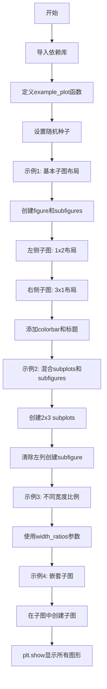
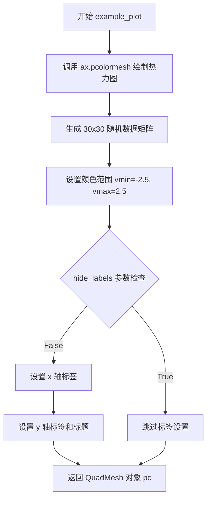

# `matplotlib\galleries\examples\subplots_axes_and_figures\subfigures.py` 详细设计文档

这是一个Matplotlib示例脚本，展示了如何使用subfigures（子图）功能创建复杂的图形布局，包括基本的左右子图布局、混合使用subplots和subfigures、不同宽高度比例的子图以及嵌套子图等多种场景。

## 整体流程



## 类结构

```
无类定义
└── 模块级函数
    └── example_plot (用户自定义绘图函数)
```

## 全局变量及字段


### `np`
    
numpy库别名，用于数值计算和随机数生成

类型：`numpy module`
    


### `plt`
    
matplotlib.pyplot库别名，用于创建和管理图形

类型：`matplotlib.pyplot module`
    


### `example_plot`
    
创建示例pcolormesh绘图的函数，返回QuadMesh对象

类型：`function`
    


### `fig`
    
Figure对象，主图形容器，整个图形的根容器

类型：`matplotlib.figure.Figure`
    


### `subfigs`
    
SubFigure对象数组，子图容器，用于容纳子图形区域

类型：`matplotlib.figure.SubFigure array`
    


### `axsLeft`
    
左侧子图的Axes数组，包含共享y轴的两个子图

类型：`matplotlib.axes.Axes array`
    


### `axsRight`
    
右侧子图的Axes数组，包含共享x轴的三个子图

类型：`matplotlib.axes.Axes array`
    


### `pc`
    
pcolormesh返回的QuadMesh对象，用于颜色映射渲染

类型：`matplotlib.collections.QuadMesh`
    


### `gridspec`
    
GridSpec对象，子图规格，定义子图的网格布局

类型：`matplotlib.gridspec.GridSpec`
    


### `subfig`
    
单个SubFigure对象，在空网格位置创建的子图容器

类型：`matplotlib.figure.SubFigure`
    


### `subfigsnest`
    
嵌套的SubFigure数组，在子图中再次划分的子图容器

类型：`matplotlib.figure.SubFigure array`
    


### `axsnest0`
    
嵌套左侧Axes数组，嵌套子图中的子图

类型：`matplotlib.axes.Axes array`
    


### `axsnest1`
    
嵌套右侧Axes数组，嵌套子图中的子图

类型：`matplotlib.axes.Axes array`
    


    

## 全局函数及方法


### `example_plot`

在指定的 Axes 上绘制一个 30x30 的随机数据 pcolormesh 热力图，可根据参数选择是否隐藏坐标轴标签，并返回生成的 QuadMesh 对象。

参数：

- `ax`：`matplotlib.axes.Axes`，要绘制热力图的坐标轴对象
- `fontsize`：`int`，标签的字体大小，默认为 12
- `hide_labels`：`bool`，是否隐藏 x 轴标签、y 轴标签和标题，默认为 False

返回值：`matplotlib.collections.QuadMesh`，pcolormesh 创建的网格集合对象，用于后续添加颜色条等操作

#### 流程图



#### 带注释源码

```python
def example_plot(ax, fontsize=12, hide_labels=False):
    """
    在指定 Axes 上绘制随机数据的 pcolormesh 热力图
    
    Parameters
    ----------
    ax : matplotlib.axes.Axes
        要绘制热力图的坐标轴对象
    fontsize : int, optional
        标签的字体大小，默认为 12
    hide_labels : bool, optional
        是否隐藏坐标轴标签，默认为 False
    
    Returns
    -------
    matplotlib.collections.QuadMesh
        pcolormesh 创建的网格集合对象
    """
    # 使用随机数据生成 30x30 矩阵，创建 pcolormesh 热力图
    # 设置颜色映射范围 vmin=-2.5 到 vmax=2.5
    pc = ax.pcolormesh(np.random.randn(30, 30), vmin=-2.5, vmax=2.5)
    
    # 根据 hide_labels 参数决定是否显示坐标轴标签
    if not hide_labels:
        # 设置 x 轴标签，内容为 'x-label'
        ax.set_xlabel('x-label', fontsize=fontsize)
        # 设置 y 轴标签，内容为 'y-label'
        ax.set_ylabel('y-label', fontsize=fontsize)
        # 设置图表标题，内容为 'Title'
        ax.set_title('Title', fontsize=fontsize)
    
    # 返回创建的 QuadMesh 对象，供外部添加颜色条使用
    return pc
```

## 关键组件


### Figure（图形对象）

matplotlib中的顶级图形容器，通过`plt.figure()`创建，支持constrained布局管理器，用于组织整个图形的布局和渲染。

### Subfigures（子图）

通过`Figure.subfigures()`方法创建的子图形容器，可以嵌套子图，支持独立的坐标系统、颜色条和标题，实现复杂的多区域布局。

### Gridspec（网格规范）

定义图形布局的网格系统，控制子图和子图的空间分布、宽高比（width_ratios、height_ratios），通过`get_subplotspec().get_gridspec()`获取。

### Axes（坐标轴）

通过`subplots()`方法创建的绘图区域，用于承载数据可视化内容（pcolormesh、plot等），支持共享坐标轴（sharex、sharey）。

### pcolormesh（热力图）

使用随机数据（30x30矩阵）创建的热力图可视化，通过`ax.pcolormesh()`生成，支持vmin/vmax参数控制颜色范围。

### Colorbar（颜色条）

通过`fig.colorbar()`或子图对象的`colorbar()`方法创建，为热力图提供颜色映射图例，支持shrink参数调整大小。

### Nested Subfigures（嵌套子图）

子图内部再创建子图的功能，通过在子图上调用`subfigures()`实现多层级的复杂布局结构。

### Constrained Layout（约束布局）

通过`layout='constrained'`参数启用的自动布局引擎，解决子图间的标签、标题、颜色条等元素的spacing问题。


## 问题及建议


### 已知问题

-   **Magic Numbers 缺乏解释**：代码中大量使用硬编码数值（如 `shrink=0.6`、`wspace=0.07`、`0.75`、`0.85`、各种 `fontsize` 参数），这些值缺乏注释说明其设计意图。
-   **随机数据生成不一致**：第一个示例使用了 `np.random.seed(19680808)` 设置随机种子确保可复现，但后续示例中 `np.random.randn(30, 30)` 调用未设置种子，导致结果不可预测且不可复现。
-   **重复代码模式**：每个示例都包含重复的 `figure` 创建、`subfigures` 配置、轴创建和 `colorbar` 设置逻辑，违反 DRY 原则。
-   **变量复用风险**：`pc` 变量在循环中被反复赋值用于 colorbar，在某些分支中可能引用到意外的值（如嵌套示例中 `subfigsnest[1]` 未向 `axsnest1` 添加任何数据，但后续代码仍使用其 `pc`）。
-   **嵌套子图数据缺失**：在嵌套子图示例中，`subfigsnest[1]` 创建了 `axsnest1` 但未向其中添加任何数据或进行任何操作，导致该子图内容为空。
-   **轴移除操作的后续影响**：使用 `a.remove()` 清除左列轴后，后续代码直接使用 `gridspec[:, 0]`，但未验证该 gridspec 区域是否已完全释放或存在状态残留。

### 优化建议

-   **提取配置常量**：将所有 magic numbers 提取为模块级常量或配置文件，并添加类型注解和解释性注释。
-   **统一随机种子管理**：在每个使用随机数据的示例开始处设置随机种子，或创建一个数据生成函数确保可复现性。
-   **抽象重复逻辑**：创建辅助函数如 `create_subfigures_with_axes()`、`add_colorbar()`、`setup_example_axes()` 等，减少代码重复。
-   **显式变量作用域**：避免跨作用域复用 `pc` 变量，每个 colorbar 创建时明确传递正确的 axes 对象。
-   **完善空图处理**：对 `subfigsnest[1]` 添加实际的数据绘图逻辑，或添加注释说明其为占位符设计。
-   **增强错误检查**：在调用 `remove()` 后验证 gridspec 区域状态，确保子图添加操作不会与已移除的轴产生冲突。
-   **代码模块化**：将四个独立的示例拆分为独立的函数，示例函数接收配置参数，提高可测试性和可维护性。


## 其它


### 设计目标与约束

本代码的设计目标是展示Matplotlib中subfigures（子图）功能的多种用法，包括：1）创建包含不同布局的图形；2）支持嵌套的子图结构；3）允许子图具有不同的宽度和高度比例；4）支持子图与普通子图的混合使用。约束条件包括：需要使用Matplotlib 3.4+版本；受限于Figure的size和layout='constrained'布局管理器；子图嵌套层数过多可能导致布局复杂化。

### 错误处理与异常设计

代码主要依赖Matplotlib的内部错误处理机制。可能的异常情况包括：1）当gridspec索引超出范围时抛出IndexError；2）当layout='constrained'不支持的图形参数时抛出ValueError；3）当子图数量与gridspec不匹配时产生布局异常。用户应确保提供的行列参数与子图数量一致，并正确设置位置参数。

### 外部依赖与接口契约

主要依赖包括：1）matplotlib.pyplot库，用于创建Figure和subfigures；2）numpy库，用于生成随机数据（np.random.randn）和设置随机种子。核心API契约：fig.subfigures(nrows, ncols, **kwargs)返回SubFigure对象数组；subfig.subplots()返回Axes对象数组；gridspec.get_gridspec()获取子图所在的GridSpec对象供add_subfigure使用。

### 性能考虑

代码中使用了np.random.randn生成30x30的随机矩阵用于pcolormesh演示。在实际应用中，大型矩阵可能导致渲染性能下降。优化建议：1）对于静态图像，可考虑降低分辨率；2）使用interpolation='nearest'可提升渲染速度；3）避免频繁调用plt.show()，可在单次调用中完成所有图形渲染。

### 配置说明

关键配置参数：1）layout='constrained'：启用约束布局，确保子图不重叠；2）wspace、width_ratios、height_ratios：控制子图间距和尺寸比例；3）sharex、sharey：控制坐标轴共享；4）shrink：调整colorbar大小；5）location：指定colorbar位置（bottom、right等）。

    