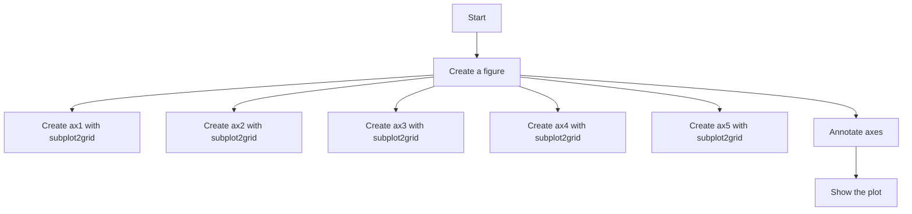
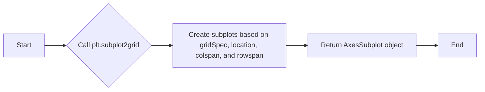
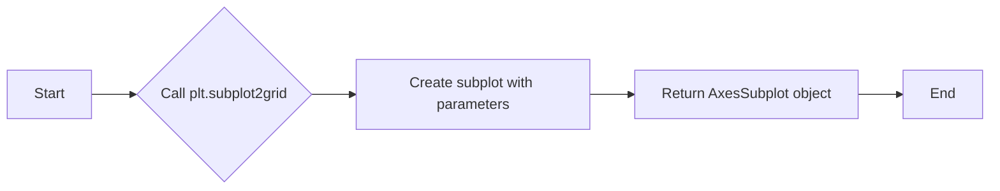
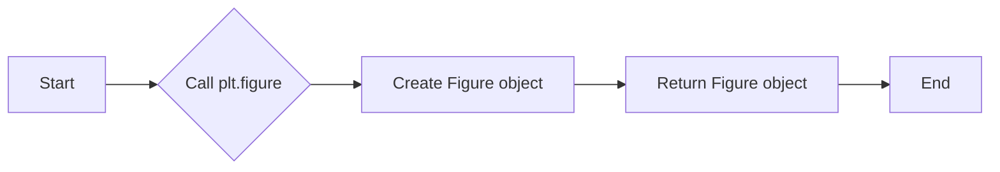
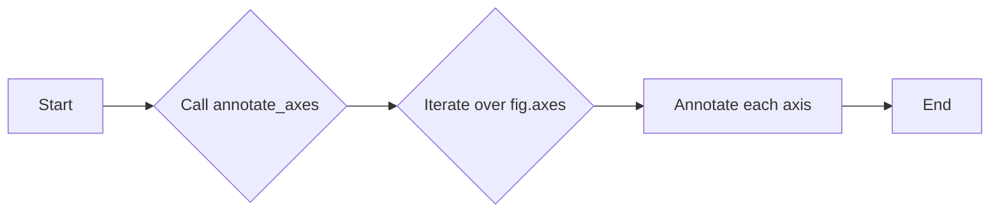
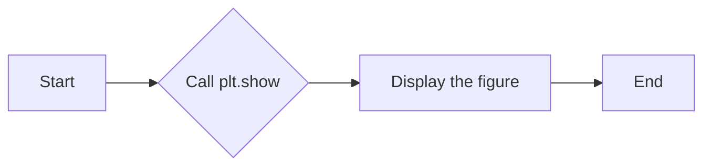
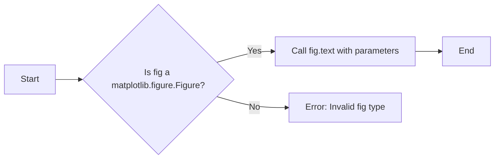

# `matplotlib\galleries\examples\subplots_axes_and_figures\subplot2grid.py` 详细设计文档

This code generates a grid of subplots using matplotlib's subplot2grid function, demonstrating its usage for creating complex layouts.

## 整体流程



## 类结构

```
matplotlib.pyplot (module)
├── fig (Figure object)
│   ├── ax1 (Axes object)
│   ├── ax2 (Axes object)
│   ├── ax3 (Axes object)
│   ├── ax4 (Axes object)
│   └── ax5 (Axes object)
```

## 全局变量及字段


### `fig`
    
The main figure object where all subplots are created.

类型：`matplotlib.figure.Figure`
    


### `ax1`
    
The first subplot in the grid.

类型：`matplotlib.axes.Axes`
    


### `ax2`
    
The second subplot in the grid.

类型：`matplotlib.axes.Axes`
    


### `ax3`
    
The third subplot in the grid, spanning two rows.

类型：`matplotlib.axes.Axes`
    


### `ax4`
    
The fourth subplot in the grid.

类型：`matplotlib.axes.Axes`
    


### `ax5`
    
The fifth subplot in the grid.

类型：`matplotlib.axes.Axes`
    


### `Figure.fig`
    
The main figure object where all subplots are created.

类型：`matplotlib.figure.Figure`
    


### `Figure.ax1`
    
The first subplot in the grid.

类型：`matplotlib.axes.Axes`
    


### `Figure.ax2`
    
The second subplot in the grid.

类型：`matplotlib.axes.Axes`
    


### `Figure.ax3`
    
The third subplot in the grid, spanning two rows.

类型：`matplotlib.axes.Axes`
    


### `Figure.ax4`
    
The fourth subplot in the grid.

类型：`matplotlib.axes.Axes`
    


### `Figure.ax5`
    
The fifth subplot in the grid.

类型：`matplotlib.axes.Axes`
    
    

## 全局函数及方法


### annotate_axes(fig)

该函数用于在matplotlib图形的每个子图(ax)上添加一个文本标签，并禁用其底部和左侧的刻度标签。

参数：

- `fig`：`matplotlib.figure.Figure`，表示当前图形对象，包含所有子图(ax)。

返回值：无

#### 流程图

```mermaid
graph LR
A[Start] --> B{Is fig a matplotlib.figure.Figure?}
B -- Yes --> C[Iterate over fig.axes]
B -- No --> D[Error: Invalid input]
C --> E[For each ax in fig.axes]
E --> F[Add text label "ax%d" to ax]
E --> G[Disable bottom and left tick labels of ax]
F --> H[End of iteration]
G --> H
H --> I[End]
```

#### 带注释源码

```python
def annotate_axes(fig):
    # Check if the input is a matplotlib.figure.Figure
    if not isinstance(fig, plt.figure.Figure):
        raise ValueError("Invalid input: 'fig' must be a matplotlib.figure.Figure")

    # Iterate over all axes in the figure
    for i, ax in enumerate(fig.axes):
        # Add a text label to the axis
        ax.text(0.5, 0.5, "ax%d" % (i+1), va="center", ha="center")
        # Disable bottom and left tick labels
        ax.tick_params(labelbottom=False, labelleft=False)
``` 


### plt.subplot2grid

`plt.subplot2grid` 是一个用于创建子图的函数，它允许用户在网格中指定子图的位置和大小。

参数：

- `gridSpec`：`tuple`，表示网格的行数和列数。
- `location`：`tuple`，表示子图在网格中的起始位置（行索引，列索引）。
- `colspan`：`int`，表示子图在水平方向上跨越的列数。
- `rowspan`：`int`，表示子图在垂直方向上跨越的行数。

返回值：`AxesSubplot`，表示创建的子图对象。

#### 流程图



#### 带注释源码

```python
import matplotlib.pyplot as plt

def plt_subplot2grid(gridSpec, location, colspan, rowspan):
    """
    Create a subplot within a grid.

    :param gridSpec: tuple, the number of rows and columns in the grid.
    :param location: tuple, the starting position of the subplot in the grid (row index, column index).
    :param colspan: int, the number of columns the subplot spans.
    :param rowspan: int, the number of rows the subplot spans.
    :return: AxesSubplot, the created subplot object.
    """
    ax = plt.subplot2grid(gridSpec, location, colspan=colspan, rowspan=rowspan)
    return ax
```


### plt.subplot2grid

`plt.subplot2grid` 是一个用于创建子图的函数，它允许用户在网格中指定子图的位置和大小。

参数：

- `(3, 3)`：`tuple`，指定网格的行数和列数。
- `(0, 0)`：`tuple`，指定子图在网格中的起始位置（行索引，列索引）。
- `colspan=3`：`int`，指定子图在水平方向上跨越的列数。
- `rowspan=2`：`int`，指定子图在垂直方向上跨越的行数。

返回值：`AxesSubplot`，返回创建的子图对象。

#### 流程图



#### 带注释源码

```python
import matplotlib.pyplot as plt

def plt_subplot2grid(rows, cols, *args, **kwargs):
    """
    Create a subplot in a grid layout.

    Parameters:
    - rows: int, number of rows in the grid.
    - cols: int, number of columns in the grid.

    Returns:
    - AxesSubplot: the created subplot object.
    """
    return plt.subplot2grid(rows, cols, *args, **kwargs)
```


### plt.figure

`plt.figure` 是一个用于创建图形对象的函数。

参数：

- 无

返回值：`Figure`，返回创建的图形对象。

#### 流程图



#### 带注释源码

```python
import matplotlib.pyplot as plt

def plt_figure():
    """
    Create a new figure.

    Returns:
    - Figure: the created figure object.
    """
    return plt.figure()
```


### annotate_axes

`annotate_axes` 是一个用于在图形对象上添加注释的函数。

参数：

- `fig`：`Figure`，图形对象。

返回值：无

#### 流程图



#### 带注释源码

```python
import matplotlib.pyplot as plt

def annotate_axes(fig):
    """
    Annotate the axes of the given figure.

    Parameters:
    - fig: Figure, the figure object to annotate.
    """
    for i, ax in enumerate(fig.axes):
        ax.text(0.5, 0.5, "ax%d" % (i+1), va="center", ha="center")
        ax.tick_params(labelbottom=False, labelleft=False)
```


### plt.show

`plt.show` 是一个用于显示图形的函数。

参数：

- 无

返回值：无

#### 流程图



#### 带注释源码

```python
import matplotlib.pyplot as plt

def plt_show():
    """
    Display the current figure.
    """
    plt.show()
```


### plt.show()

显示当前图形。

参数：

- 无

返回值：无

#### 流程图

```mermaid
graph LR
A[Start] --> B[Call plt.show()]
B --> C[End]
```

#### 带注释源码

```python
plt.show()
```


### matplotlib.pyplot

matplotlib.pyplot 是一个用于创建静态、交互式和动画可视化图表的库。

#### 类字段

- `fig`：`Figure`，当前图形的实例。
- `ax1`：`AxesSubplot`，第一个子图的实例。
- `ax2`：`AxesSubplot`，第二个子图的实例。
- `ax3`：`AxesSubplot`，第三个子图的实例。
- `ax4`：`AxesSubplot`，第四个子图的实例。
- `ax5`：`AxesSubplot`，第五个子图的实例。

#### 类方法

- `annotate_axes(fig)`：在图形的每个轴上添加文本注释。

#### 全局变量

- `plt`：`pyplot`，matplotlib.pyplot 的别名。

#### 全局函数

- `plt.subplot2grid((3, 3), (0, 0), colspan=3)`：创建一个子图，位于图形的左上角，跨越三列。
- `plt.subplot2grid((3, 3), (1, 0), colspan=2)`：创建一个子图，位于图形的中间，跨越两列。
- `plt.subplot2grid((3, 3), (1, 2), rowspan=2)`：创建一个子图，位于图形的中间，跨越两行。
- `plt.subplot2grid((3, 3), (2, 0))`：创建一个子图，位于图形的底部，位于第一列。
- `plt.subplot2grid((3, 3), (2, 1))`：创建一个子图，位于图形的底部，位于第二列。

#### 关键组件信息

- `Figure`：matplotlib 的图形对象。
- `AxesSubplot`：matplotlib 的子图对象。

#### 潜在的技术债务或优化空间

- 代码中使用了硬编码的子图位置和大小，这可能会限制代码的灵活性。
- 可以考虑使用 `GridSpec` 来创建更灵活的子图布局。

#### 设计目标与约束

- 设计目标是创建一个简单的子图布局示例。
- 约束是使用 `subplot2grid` 来创建子图。

#### 错误处理与异常设计

- 代码中没有显式的错误处理或异常设计。

#### 数据流与状态机

- 数据流是从创建图形和子图到显示图形的过程。
- 状态机没有在代码中体现。

#### 外部依赖与接口契约

- 代码依赖于 matplotlib 库。
- 接口契约是通过调用 matplotlib 的函数来创建和显示图形。


### Figure.text

Figure.text 是一个用于在 Matplotlib 图形中添加文本的方法。

参数：

- `fig`：`matplotlib.figure.Figure`，表示当前图形对象。
- `x`：`float`，文本的 x 坐标。
- `y`：`float`，文本的 y 坐标。
- `s`：`str`，要添加的文本内容。
- `va`：`str`，垂直对齐方式，默认为 "center"。
- `ha`：`str`，水平对齐方式，默认为 "center"。

返回值：无

#### 流程图



#### 带注释源码

```python
def annotate_axes(fig):
    for i, ax in enumerate(fig.axes):
        ax.text(0.5, 0.5, "ax%d" % (i+1), va="center", ha="center")
        ax.tick_params(labelbottom=False, labelleft=False)
```

在这段代码中，`annotate_axes` 函数遍历图形对象 `fig` 的所有轴（axes），并对每个轴调用 `text` 方法来添加文本。文本内容是 "ax%d"，其中 `% (i+1)" 用于格式化轴的索引。`va` 和 `ha` 参数分别设置文本的垂直和水平对齐方式为居中。`tick_params` 方法用于禁用轴的底部和左侧标签。


### annotate_axes(fig)

该函数用于在matplotlib图形的每个轴上添加文本注释。

参数：

- `fig`：`matplotlib.figure.Figure`，表示当前图形对象。

返回值：无

#### 流程图

```mermaid
graph LR
A[Start] --> B{Pass fig}
B --> C[Iterate over fig.axes]
C -->|i=0| D[Check if i < len(fig.axes)]
D -->|Yes| E[Access fig.axes[i]]
E --> F[Add text annotation to ax]
F --> G[Increment i]
G --> D
D -->|No| H[End]
```

#### 带注释源码

```python
def annotate_axes(fig):
    # Iterate over all axes in the figure
    for i, ax in enumerate(fig.axes):
        # Add text annotation to the axis
        ax.text(0.5, 0.5, "ax%d" % (i+1), va="center", ha="center")
        # Update tick parameters
        ax.tick_params(labelbottom=False, labelleft=False)
``` 


### plt.show()

显示matplotlib图形。

参数：

- 无

返回值：无

#### 流程图


#### 带注释源码

```python
import matplotlib.pyplot as plt

def annotate_axes(fig):
    for i, ax in enumerate(fig.axes):
        ax.text(0.5, 0.5, "ax%d" % (i+1), va="center", ha="center")
        ax.tick_params(labelbottom=False, labelleft=False)

fig = plt.figure()
ax1 = plt.subplot2grid((3, 3), (0, 0), colspan=3)
ax2 = plt.subplot2grid((3, 3), (1, 0), colspan=2)
ax3 = plt.subplot2grid((3, 3), (1, 2), rowspan=2)
ax4 = plt.subplot2grid((3, 3), (2, 0))
ax5 = plt.subplot2grid((3, 3), (2, 1))

annotate_axes(fig)

plt.show()
```


## 关键组件


### 张量索引与惰性加载

张量索引与惰性加载是用于在计算过程中延迟计算，直到实际需要时才进行计算，从而提高效率。

### 反量化支持

反量化支持是指代码能够处理和操作未量化或部分量化的数据，以便在后续的量化过程中进行优化。

### 量化策略

量化策略是指对模型中的权重和激活函数进行量化，以减少模型的内存占用和计算量，提高模型的效率。


## 问题及建议


### 已知问题

-   **依赖性**: 代码依赖于 `matplotlib` 库，这可能导致代码的可移植性降低，因为并非所有环境都预装了该库。
-   **代码复用性**: `annotate_axes` 函数仅在当前脚本中使用，如果在其他脚本或项目中需要类似功能，则该函数的复用性较低。
-   **异常处理**: 代码中没有异常处理机制，如果 `matplotlib` 库或其函数调用失败，可能会导致脚本崩溃。

### 优化建议

-   **模块化**: 将 `annotate_axes` 函数封装到一个模块中，以便在其他脚本或项目中复用。
-   **异常处理**: 在调用 `matplotlib` 库的函数时添加异常处理，以避免因库或函数调用失败而导致的脚本崩溃。
-   **使用 `GridSpec`**: 考虑使用 `GridSpec` 来代替 `subplot2grid`，因为 `GridSpec` 提供了更灵活的布局选项，并且是 `matplotlib` 的推荐方法。
-   **代码注释**: 在代码中添加注释，解释函数和代码块的目的，以提高代码的可读性和可维护性。
-   **测试**: 编写单元测试来验证代码的功能，确保在未来的修改中代码仍然按预期工作。


## 其它


### 设计目标与约束

- 设计目标：实现一个能够根据指定参数创建子图的函数，并对其进行标注。
- 约束条件：使用matplotlib库进行绘图，遵循matplotlib的API规范。

### 错误处理与异常设计

- 错误处理：在函数中捕获可能发生的异常，如matplotlib绘图相关的异常，并给出相应的错误信息。
- 异常设计：定义自定义异常类，用于处理特定的错误情况。

### 数据流与状态机

- 数据流：输入参数包括子图的位置和大小，输出为绘制的子图。
- 状态机：无状态机设计，函数直接执行绘图操作。

### 外部依赖与接口契约

- 外部依赖：matplotlib库。
- 接口契约：函数的输入参数和返回值类型定义了接口契约。


    