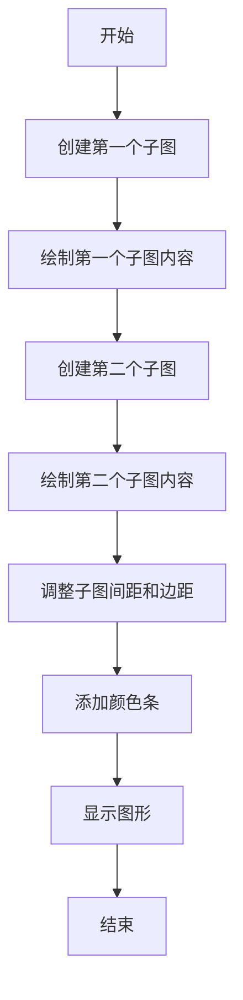
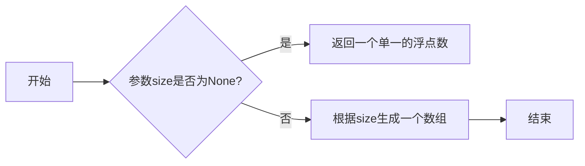
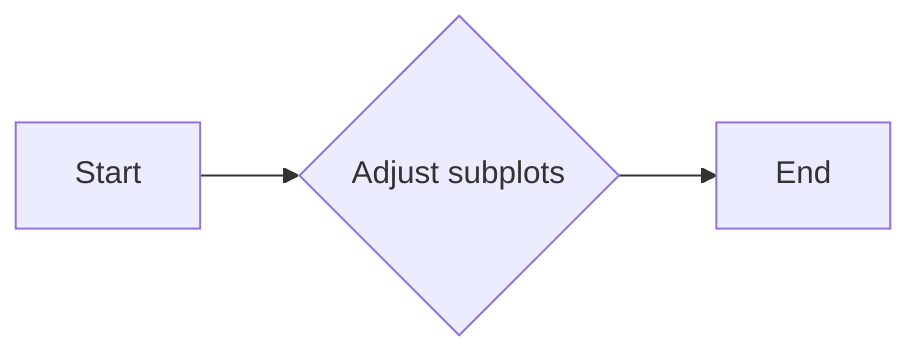
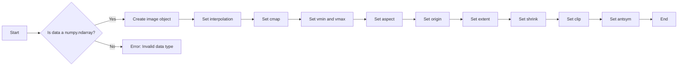
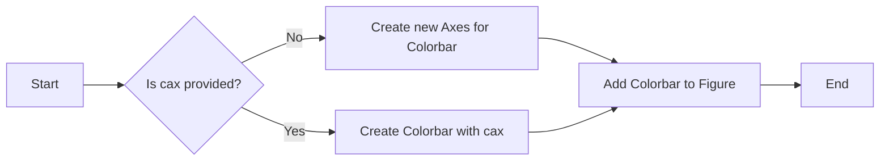
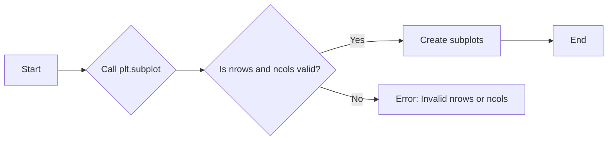

# `matplotlib\galleries\examples\subplots_axes_and_figures\subplots_adjust.py` 详细设计文档

This code generates a figure with two subplots and adjusts the spacing of margins and subplots using matplotlib's `subplots_adjust` function.

## 整体流程



## 类结构

```
matplotlib.pyplot (主模块)
```

## 全局变量及字段


### `np.random.seed`
    
Sets the seed for the numpy random number generator to ensure reproducibility.

类型：`function`
    


### `plt`
    
The matplotlib.pyplot module provides a collection of functions that make matplotlib work like MATLAB.

类型：`module`
    


### `matplotlib.pyplot.subplots_adjust`
    
Adjusts the spacing of margins and subplots.

类型：`function`
    


### `matplotlib.pyplot.imshow`
    
Displays an image.

类型：`function`
    


### `matplotlib.pyplot.colorbar`
    
Displays a colorbar for a plot.

类型：`function`
    


### `matplotlib.pyplot.show`
    
Displays all the figures.

类型：`function`
    


### `matplotlib.pyplot.subplot`
    
Creates a subplot in the current figure.

类型：`function`
    
    

## 全局函数及方法


### np.random.random

生成一个或多个在[0, 1)区间内的伪随机浮点数。

参数：

-  `size=None`：`int` 或 `tuple`，指定输出的形状。如果没有指定，则返回一个单一的浮点数。
-  ...

返回值：`float` 或 `numpy.ndarray`，一个在[0, 1)区间内的浮点数或数组。

#### 流程图



#### 带注释源码

```python
import numpy as np

def random(size=None):
    """
    Generate a random float in the range [0, 1) or an array of random floats.

    Parameters:
    - size: int or tuple, the shape of the output. If None, return a single float.

    Returns:
    - float or numpy.ndarray, a float in the range [0, 1) or an array of floats.
    """
    if size is None:
        return np.random.random()
    else:
        return np.random.random(size)
```


### `subplots_adjust`

`subplots_adjust` 是 `matplotlib.pyplot` 模块中的一个函数，用于调整子图之间的间距和边距。

参数：

- `bottom`：`float`，子图底部与窗口底部的距离，范围从 0 到 1。
- `right`：`float`，子图右侧与窗口右侧的距离，范围从 0 到 1。
- `top`：`float`，子图顶部与窗口顶部的距离，范围从 0 到 1。
- `left`：`float`（可选），子图左侧与窗口左侧的距离，范围从 0 到 1。

返回值：无，该函数不返回任何值。

#### 流程图



#### 带注释源码

```python
plt.subplots_adjust(bottom=0.1, right=0.8, top=0.9)
```

在这段代码中，`subplots_adjust` 函数被调用来调整子图的间距和边距。`bottom` 参数设置为 0.1，表示子图底部距离窗口底部的距离为窗口高度的 10%。`right` 参数设置为 0.8，表示子图右侧距离窗口右侧的距离为窗口宽度的 80%。`top` 参数设置为 0.9，表示子图顶部距离窗口顶部的距离为窗口高度的 90%。这些参数共同作用，使得子图之间的间距和边距得到调整。


### imshow

`imshow` 是一个用于显示图像的函数，通常用于可视化二维数组。

参数：

- `data`：`numpy.ndarray`，图像数据，通常是二维数组。
- `interpolation`：`str`，插值方法，用于在显示图像时对像素进行插值。
- `cmap`：`str` 或 `Colormap`，颜色映射，用于将图像数据映射到颜色。
- `vmin` 和 `vmax`：`float`，图像数据的显示范围的最小值和最大值。
- `aspect`：`str`，图像的纵横比。
- `origin`：`str`，图像的起始位置。
- `extent`：`tuple`，图像的显示范围。
- `shrink`：`float`，图像的缩放比例。
- `clip`：`bool`，是否裁剪图像以适应轴。
- `antsym`：`bool`，是否反转颜色映射。

返回值：`AxesImage`，图像对象。

#### 流程图



#### 带注释源码

```python
import numpy as np
import matplotlib.pyplot as plt

# 创建图像数据
data = np.random.random((100, 100))

# 显示图像
plt.imshow(data)
```


### plt.colorbar

`plt.colorbar` 是一个用于在 Matplotlib 图中添加颜色条的全局函数。

参数：

- `cax`：`Axes`，颜色条所在的轴对象。默认情况下，颜色条会创建一个新的轴，但可以通过指定现有的轴来放置颜色条。

返回值：`Colorbar`，颜色条对象。

#### 流程图



#### 带注释源码

```python
import matplotlib.pyplot as plt
import numpy as np

# Fixing random state for reproducibility
np.random.seed(19680801)

plt.subplot(211)
plt.imshow(np.random.random((100, 100)))
plt.subplot(212)
plt.imshow(np.random.random((100, 100)))

plt.subplots_adjust(bottom=0.1, right=0.8, top=0.9)
cax = plt.axes((0.85, 0.1, 0.075, 0.8))
plt.colorbar(cax=cax)

plt.show()
```


### plt.show()

`plt.show()` 是一个用于显示当前图形的函数。

参数：

- 无

返回值：无

#### 流程图

```mermaid
graph LR
A[Start] --> B[Call plt.show()]
B --> C[Display the figure]
C --> D[End]
```

#### 带注释源码

```python
# 导入matplotlib.pyplot模块
import matplotlib.pyplot as plt

# ... (前面的代码，如创建子图、调整间距等)

# 显示当前图形
plt.show()
``` 


### `plt.subplot`

`plt.subplot` 是一个用于创建子图的函数，它允许用户在同一个图形窗口中绘制多个子图。

参数：

- `nrows`：`int`，子图的总行数。
- `ncols`：`int`，子图的总列数。
- `sharex`：`bool`，是否共享x轴。
- `sharey`：`bool`，是否共享y轴。
- `fig`：`matplotlib.figure.Figure`，可选，指定要创建子图的图形对象。
- `gridspec_kw`：`dict`，可选，用于指定子图网格的参数。

返回值：`matplotlib.axes.Axes`，子图对象。

#### 流程图



#### 带注释源码

```python
import matplotlib.pyplot as plt

# 创建一个图形对象
fig = plt.figure()

# 创建一个子图，位于第一行第一列
ax1 = plt.subplot(2, 1, 1)
ax1.imshow(np.random.random((100, 100)))

# 创建另一个子图，位于第二行第一列
ax2 = plt.subplot(2, 1, 2)
ax2.imshow(np.random.random((100, 100)))

# 显示图形
plt.show()
```


## 关键组件


### 张量索引

张量索引用于访问和操作多维数组（张量）中的特定元素。

### 惰性加载

惰性加载是一种延迟计算或初始化数据的方法，直到实际需要时才进行，以提高性能和资源利用率。

### 反量化支持

反量化支持允许在量化过程中对某些操作进行非量化处理，以保持精度和性能。

### 量化策略

量化策略定义了如何将浮点数转换为固定点数表示，以减少计算资源消耗并提高效率。


## 问题及建议


### 已知问题

-   {问题1}：代码中使用了随机数生成器，但没有提供任何关于随机数分布或种子设置的详细信息，这可能导致在不同运行之间结果不一致。
-   {问题2}：代码中使用了`plt.subplot(211)`和`plt.subplot(212)`来创建子图，但没有提供任何关于子图布局或子图内容的描述，这可能导致代码的可读性和可维护性降低。
-   {问题3}：代码中使用了`plt.colorbar()`来添加颜色条，但没有提供关于颜色条位置或样式的详细信息，这可能导致颜色条与图表布局不协调。

### 优化建议

-   {建议1}：在代码中添加注释，说明随机数生成器的分布和种子设置，以确保结果的可重现性。
-   {建议2}：提供更详细的子图布局描述，例如使用`plt.subplots()`函数并指定子图布局参数，以提高代码的可读性和可维护性。
-   {建议3}：在添加颜色条时，指定颜色条的位置和样式，以确保颜色条与图表布局协调一致。
-   {建议4}：考虑使用`plt.tight_layout()`来自动调整子图参数，以确保子图之间的间距和图表的边缘看起来合适。
-   {建议5}：如果代码是用于演示或教学，考虑添加一个标题和图例，以提供更多的上下文信息。


## 其它


### 设计目标与约束

- 设计目标：实现一个能够调整子图间距和边距的函数，以便于在matplotlib中更好地展示数据。
- 约束条件：必须使用matplotlib库，且不能修改matplotlib的源代码。

### 错误处理与异常设计

- 错误处理：在函数执行过程中，如果遇到无法处理的异常，应抛出相应的异常，并在调用端进行捕获和处理。
- 异常设计：定义自定义异常类，用于处理特定的错误情况。

### 数据流与状态机

- 数据流：输入数据为matplotlib的子图对象，输出为调整后的子图对象。
- 状态机：无状态机设计，函数直接执行调整操作。

### 外部依赖与接口契约

- 外部依赖：matplotlib库。
- 接口契约：函数接口应遵循matplotlib的API规范，确保与其他matplotlib函数的兼容性。


    