# `matplotlib\galleries\examples\subplots_axes_and_figures\subplots_demo.py` 详细设计文档

这是一个matplotlib子图创建示例脚本，展示了如何使用plt.subplots()和GridSpec创建各种布局的子图，包括单个子图、垂直/水平堆叠、二维网格、坐标轴共享以及极坐标子图等常见场景。

## 整体流程

```mermaid
graph TD
    A[开始] --> B[导入 matplotlib.pyplot 和 numpy]
    B --> C[创建示例数据 x 和 y]
    C --> D[示例1: 单个子图]
    D --> E[示例2: 垂直堆叠子图]
    E --> F[示例3: 水平堆叠子图]
    F --> G[示例4: 二维网格子图]
    G --> H[示例5: 共享坐标轴]
    H --> I[示例6: 使用GridSpec精确控制布局]
    I --> J[示例7: 极坐标子图]
    J --> K[调用 plt.show() 显示所有图形]
```

## 类结构

```
此脚本为扁平结构，无类定义
直接使用 matplotlib.pyplot 模块函数
通过 plt.subplots() 和 Figure.add_gridspec() 创建子图布局
```

## 全局变量及字段


### `x`
    
从0到2π的等间距数组，用于绘图数据

类型：`numpy.ndarray`
    


### `y`
    
基于x计算的sin(x²)值，用于绘图的y轴数据

类型：`numpy.ndarray`
    


### `fig`
    
图形对象容器

类型：`matplotlib.figure.Figure`
    


### `ax`
    
单个子图的坐标轴对象

类型：`matplotlib.axes.Axes`
    


### `axs`
    
多个子图的坐标轴数组，可为1D或2D

类型：`numpy.ndarray`
    


### `ax1`
    
第一个子图的坐标轴

类型：`matplotlib.axes.Axes`
    


### `ax2`
    
第二个子图的坐标轴

类型：`matplotlib.axes.Axes`
    


### `ax3`
    
第三个子图的坐标轴

类型：`matplotlib.axes.Axes`
    


### `ax4`
    
第四个子图的坐标轴

类型：`matplotlib.axes.Axes`
    


### `gs`
    
网格规范对象，用于精确控制子图布局

类型：`matplotlib.gridspec.GridSpec`
    


    

## 全局函数及方法


### numpy.linspace

`numpy.linspace` 是 NumPy 库中的一个函数，用于在指定区间内生成等间距的数值序列。该函数常用于生成图表的 x 轴坐标或其他需要均匀分布数据的场景。

参数：

- `start`：`float`，序列的起始值
- `stop`：`float`，序列的结束值（当 `endpoint` 为 True 时包含该值）
- `num`：`int`，可选，默认为 50，生成样本的数量
- `endpoint`：`bool`，可选，默认为 True，若为 True，则 stop 为最后一个样本；否则不包含
- `retstep`：`bool`，可选，默认为 False，若为 True，则返回 (samples, step)
- `dtype`：`dtype`，可选，输出数组的数据类型，若未指定，则从输入推断

返回值：`ndarray`，返回等间距的数组

#### 流程图

```mermaid
flowchart TD
    A[开始] --> B[接收参数 start, stop, num]
    B --> C{endpoint == True?}
    C -->|Yes| D[包含 stop 值]
    C -->|No| E[不包含 stop 值]
    D --> F[计算步长 step = (stop - start) / (num - 1)]
    E --> G[计算步长 step = (stop - start) / num]
    F --> H[生成 num 个等间距点]
    G --> H
    H --> I{retstep == True?}
    I -->|Yes| J[返回 数组 和 step]
    I -->|No| K[仅返回数组]
    J --> L[结束]
    K --> L
```

#### 带注释源码

```python
def linspace(start, stop, num=50, endpoint=False, retstep=False, dtype=None, axis=0):
    """
    在指定区间内生成等间距的数值序列。
    
    参数:
        start: 序列的起始值
        stop: 序列的结束值
        num: 生成的样本数量，默认50
        endpoint: 是否包含结束值，默认False
        retstep: 是否返回步长，默认False
        dtype: 输出数组的数据类型
        axis: 在结果有多维时的轴
    
    返回:
        ndarray: 等间距的数组
    """
    # 将输入转换为数组
    _dom = _mx__dispatcher
    # 处理标量输入
    if np.isscalar(start):
        start = float(start)
    if np.isscalar(stop):
        stop = float(stop)
    
    # 计算步长
    if endpoint:
        step = (stop - start) / (num - 1) if num > 1 else 0
    else:
        step = (stop - start) / num
    
    # 生成数组
    y = np.arange(0, num, dtype=dtype) * step + start
    
    return y
```

### plt.subplots

`plt.subplots` 是 matplotlib 库中的函数，用于创建一个包含多个子图的图形和坐标轴网格。该函数是最简单和推荐创建单一图表或图表网格的方式。

参数：

- `nrows`：`int`，可选，默认为 1，子图行数
- `ncols`：`int`，可选，默认为 1，子图列数
- `sharex`：`bool` 或 `str`，可选，默认为 False，控制 x 轴共享
- `sharey`：`bool` 或 `str`，可选，默认为 False，控制 y 轴共享
- `squeeze`：`bool`，可选，默认为 True，是否压缩返回的轴数组维度
- `subplot_kw`：`dict`，可选，用于创建每个子图的关键字参数
- `gridspec_kw`：`dict`，可选，用于 GridSpec 的关键字参数
- `fig_kw`：`dict`，可选，用于创建 Figure 的关键字参数

返回值：`(Figure, Axes or array of Axes)`，返回 Figure 对象和 Axes 对象或 Axes 数组

#### 流程图

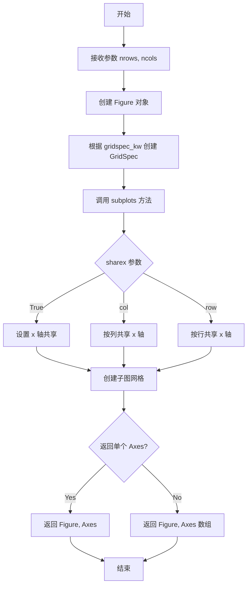

#### 带注释源码

```python
def subplots(nrows=1, ncols=1, sharex=False, sharey=False, 
             squeeze=True, subplot_kw=None, gridspec_kw=None, fig_kw=None):
    """
    创建包含子图的图形和坐标轴网格。
    
    参数:
        nrows: 子图行数
        ncols: 子图列数
        sharex: x 轴共享策略
        sharey: y 轴共享策略
        squeeze: 是否压缩维度
        subplot_kw: 子图创建参数
        gridspec_kw: GridSpec 参数
        fig_kw: Figure 创建参数
    
    返回:
        fig: Figure 对象
        ax: Axes 对象或 Axes 数组
    """
    # 创建 Figure
    fig = plt.figure(**(fig_kw or {}))
    
    # 创建 GridSpec
    gs = GridSpec(nrows, ncols, **(gridspec_kw or {}))
    
    # 创建子图
    axs = gs.subplots(sharex=sharex, sharey=sharey, 
                      squeeze=squeeze, **subplot_kw)
    
    return fig, axs
```


### numpy.sin

计算输入数组元素的正弦值。

参数：

-  `x`：`array_like`，输入角度（以弧度为单位）

返回值：

-  `out`：`ndarray`，`float` 或 `complex`，输入角度的正弦值

#### 流程图

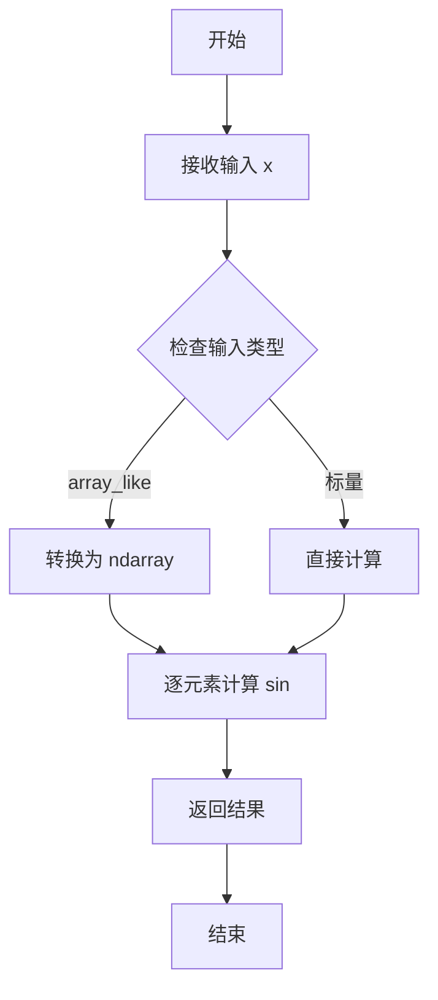

#### 带注释源码

```python
import numpy as np

# 示例用法
x = np.linspace(0, 2 * np.pi, 400)  # 生成 0 到 2π 的等间距数组
y = np.sin(x ** 2)  # 计算 x 平方的正弦值

# numpy.sin 函数原型（概念性）
def sin(x, /, out=None, *, where=True, casting='same_kind', order='K', dtype=None, subok=True):
    """
    正弦函数，逐元素计算输入的正弦值。
    
    参数:
        x: array_like - 输入角度（弧度）
        out: ndarray - 存储结果的数组
        where: array_like - 计算条件
        casting: str - 类型转换模式
        order: str - 内存布局
        dtype: data-type - 输出数据类型
        subok: bool - 是否保留子类
    
    返回:
        out: ndarray - 正弦值
    """
    # 内部实现调用底层 C/Fortran 库
    pass
```


# matplotlib.pyplot.subplots 详细设计文档

## 1. 核心功能概述

`matplotlib.pyplot.subplots` 是 Matplotlib 库中用于创建图形窗口（Figure）和子图网格的核心函数，它在单次调用中同时创建 Figure 对象和指定布局的 Axes 对象数组，支持灵活的行/列布局、坐标轴共享机制以及多样化的子图配置选项，是 Matplotlib 中最常用且推荐的多子图创建方式。

---

### 2. 文件整体运行流程

该代码文件是一个 **文档示例（Gallery Example）**，展示了 `plt.subplots()` 函数的多种使用场景和功能特性：

```
┌─────────────────────────────────────────────────────────────┐
│                     代码文件结构                              │
├─────────────────────────────────────────────────────────────┤
│  1. 文档头注释（模块功能说明）                                 │
│     ↓                                                        │
│  2. 导入依赖库 (matplotlib.pyplot, numpy)                    │
│     ↓                                                        │
│  3. 准备示例数据 (x, y)                                       │
│     ↓                                                        │
│  4. 展示12种不同的subplots使用场景:                           │
│     ├── 单子图创建                                          │
│     ├── 垂直堆叠子图                                        │
│     ├── 水平堆叠子图                                        │
│     ├── 2×2网格子图                                         │
│     ├── 坐标轴共享 (sharex/sharey)                          │
│     ├── GridSpec高级布局                                    │
│     └── 极坐标轴                                            │
│     ↓                                                        │
│  5. 调用 plt.show() 渲染图形                                │
└─────────────────────────────────────────────────────────────┘
```

---

### 3. 类详细信息

由于该代码文件是示例代码而非类实现，因此无自定义类。以下是代码中涉及的核心类型信息：

#### 全局变量

| 名称 | 类型 | 描述 |
|------|------|------|
| `x` | `numpy.ndarray` | 从0到2π的等间距数组，用于绘图数据 |
| `y` | `numpy.ndarray` | 基于x计算的sin(x²)函数值 |

#### 全局函数/调用

代码中主要调用了 `matplotlib.pyplot.subplots` 函数，该函数是模块级函数，非类方法。

---

### 4. 函数详细信息

由于给定的代码是 `plt.subplots()` 的**使用示例**而非实现代码，下面基于代码注释、调用方式和官方文档提取函数签名信息：

#### 4.1 函数名称

```
plt.subplots
```

或完整路径形式：

```
matplotlib.pyplot.subplots
```

#### 4.2 参数信息

| 参数名称 | 参数类型 | 参数描述 |
|----------|----------|----------|
| `nrows` | `int`, 可选 | 子图网格的行数，默认值为 1 |
| `ncols` | 可选 | `int`，子图网格的列数，默认值为 1 |
| `sharex` | `bool` 或 `str`，可选 | 控制x轴共享：<br>- `False`: 不共享（默认）<br>- `True`: 所有子图共享<br>- `'row'`: 每行共享<br>- `'col'`: 每列共享 |
| `sharey` | `bool` 或 `str`，可选 | 控制y轴共享：<br>- `False`: 不共享（默认）<br>- `True`: 所有子图共享<br>- `'row'`: 每行共享<br>- `'col'`: 每列共享 |
| `squeeze` | `bool`，可选 | 默认为 `True`，返回维度压缩后的数组 |
| `subplot_kw` | `dict`，可选 | 传递给每个子图创建函数的关键字参数字典（如 `projection='polar'`） |
| `gridspec_kw` | `dict`，可选 | 传递给 GridSpec 的关键字参数字典（如 `hspace`, `wspace`） |
| `fig_kw` | `dict`，可选 | 传递给 `Figure` 构造函数的关键字参数 |

#### 4.3 返回值信息

| 返回值名称 | 返回值类型 | 返回值描述 |
|------------|------------|------------|
| `fig` | `matplotlib.figure.Figure` | 整个图形窗口对象，用于控制图形属性（如标题、布局） |
| `axs` | `axes.Axes` 或 `numpy.ndarray` | 子图轴对象：<br>- 单个子图时返回 `Axes` 对象<br>- 多个子图时返回 1D 或 2D `numpy.ndarray` |

#### 4.4 流程图

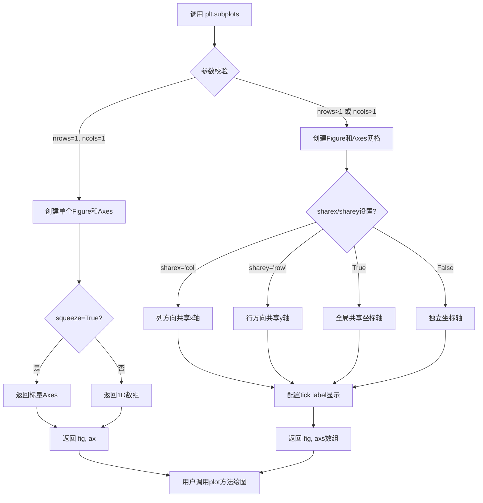

#### 4.5 带注释源码（调用示例）

```python
"""
===============================================
Create multiple subplots using ``plt.subplots``
===============================================

`.pyplot.subplots` creates a figure and a grid of subplots with a single call,
while providing reasonable control over how the individual plots are created.
For more advanced use cases you can use `.GridSpec` for a more general subplot
layout or `.Figure.add_subplot` for adding subplots at arbitrary locations
within the figure.
"""

# sphinx_gallery_thumbnail_number = 11

import matplotlib.pyplot as plt
import numpy as np

# ============================================================
# 示例数据准备：生成用于绑图的数据
# ============================================================
x = np.linspace(0, 2 * np.pi, 400)  # 创建0到2π的等间距数组
y = np.sin(x ** 2)                   # 计算sin(x²)

# %%
# ============================================================
# 用法1: 创建单个子图（最简单推荐方式）
# ============================================================
# ``subplots()`` without arguments returns a `.Figure` and a single
# `~.axes.Axes`.
fig, ax = plt.subplots()            # 创建Figure和单个Axes
ax.plot(x, y)                       # 绘制数据
ax.set_title('A single plot')       # 设置标题

# %%
# ============================================================
# 用法2: 垂直堆叠两个子图（1列2行）
# ============================================================
# 第一个两个可选参数定义子图网格的行数和列数
# 当只在一个方向堆叠时，axs是1D numpy数组
fig, axs = plt.subplots(2)          # nrows=2, ncols=1（默认）
fig.suptitle('Vertically stacked subplots')
axs[0].plot(x, y)
axs[1].plot(x, -y)

# %%
# ============================================================
# 用法3: 立即解包每个子图到独立变量
# ============================================================
fig, (ax1, ax2) = plt.subplots(2)   # 使用元组解包
fig.suptitle('Vertically stacked subplots')
ax1.plot(x, y)
ax2.plot(x, -y)

# %%
# ============================================================
# 用法4: 水平堆叠两个子图（1行2列）
# ============================================================
fig, (ax1, ax2) = plt.subplots(1, 2)  # nrows=1, ncols=2
fig.suptitle('Horizontally stacked subplots')
ax1.plot(x, y)
ax2.plot(x, -y)

# %%
# ============================================================
# 用法5: 2×2网格子图布局
# ============================================================
# 当在两个方向堆叠时，axs是2D numpy数组
fig, axs = plt.subplots(2, 2)       # 创建2行2列网格
axs[0, 0].plot(x, y)
axs[0, 0].set_title('Axis [0, 0]')
axs[0, 1].plot(x, y, 'tab:orange')
axs[0, 1].set_title('Axis [0, 1]')
axs[1, 0].plot(x, -y, 'tab:green')
axs[1, 0].set_title('Axis [1, 0]')
axs[1, 1].plot(x, -y, 'tab:red')
axs[1, 1].set_title('Axis [1, 1]')

# 使用.flat迭代所有子图设置属性
for ax in axs.flat:
    ax.set(xlabel='x-label', ylabel='y-label')

# 隐藏内部子图的标签
for ax in axs.flat:
    ax.label_outer()

# %%
# ============================================================
# 用法6: 2×2网格并解包到独立变量
# ============================================================
fig, ((ax1, ax2), (ax3, ax4)) = plt.subplots(2, 2)
fig.suptitle('Sharing x per column, y per row')
ax1.plot(x, y)
ax2.plot(x, y**2, 'tab:orange')
ax3.plot(x, -y, 'tab:green')
ax4.plot(x, -y**2, 'tab:red')

for ax in fig.get_axes():
    ax.label_outer()

# %%
# ============================================================
# 用法7: 坐标轴共享 - 默认独立缩放
# ============================================================
fig, (ax1, ax2) = plt.subplots(2)
fig.suptitle('Axes values are scaled individually by default')
ax1.plot(x, y)
ax2.plot(x + 1, -y)

# %%
# ============================================================
# 用法8: 使用sharex对齐x轴
# ============================================================
fig, (ax1, ax2) = plt.subplots(2, sharex=True)
fig.suptitle('Aligning x-axis using sharex')
ax1.plot(x, y)
ax2.plot(x + 1, -y)

# %%
# ============================================================
# 用法9: 全局坐标轴共享（sharex=True, sharey=True）
# ============================================================
fig, axs = plt.subplots(3, sharex=True, sharey=True)
fig.suptitle('Sharing both axes')
axs[0].plot(x, y ** 2)
axs[1].plot(x, 0.3 * y, 'o')
axs[2].plot(x, y, '+')

# %%
# ============================================================
# 用法10: 使用GridSpec精确控制子图位置
# ============================================================
fig = plt.figure()
gs = fig.add_gridspec(3, hspace=0)  # 创建GridSpec，hspace=0减少间距
axs = gs.subplots(sharex=True, sharey=True)
fig.suptitle('Sharing both axes')
axs[0].plot(x, y ** 2)
axs[1].plot(x, 0.3 * y, 'o')
axs[2].plot(x, y, '+')

for ax in axs:
    ax.label_outer()

# %%
# ============================================================
# 用法11: 按行/列共享坐标轴
# ============================================================
fig = plt.figure()
gs = fig.add_gridspec(2, 2, hspace=0, wspace=0)
(ax1, ax2), (ax3, ax4) = gs.subplots(sharex='col', sharey='row')
fig.suptitle('Sharing x per column, y per row')
ax1.plot(x, y)
ax2.plot(x, y**2, 'tab:orange')
ax3.plot(x + 1, -y, 'tab:green')
ax4.plot(x + 2, -y**2, 'tab:red')

for ax in fig.get_axes():
    ax.label_outer()

# %%
# ============================================================
# 用法12: 事后添加坐标轴共享关系
# ============================================================
fig, axs = plt.subplots(2, 2)
axs[0, 0].plot(x, y)
axs[0, 0].set_title("main")
axs[1, 0].plot(x, y**2)
axs[1, 0].set_title("shares x with main")
axs[1, 0].sharex(axs[0, 0])         # 事后共享x轴
axs[0, 1].plot(x + 1, y + 1)
axs[0, 1].set_title("unrelated")
axs[1, 1].plot(x + 2, y + 2)
axs[1, 1].set_title("also unrelated")
fig.tight_layout()

# %%
# ============================================================
# 用法13: 创建极坐标子图
# ============================================================
fig, (ax1, ax2) = plt.subplots(1, 2, subplot_kw=dict(projection='polar'))
ax1.plot(x, y)
ax2.plot(x, y ** 2)

# 显示所有图形
plt.show()
```

---

### 5. 关键组件信息

| 组件名称 | 描述 |
|----------|------|
| `Figure` | Matplotlib 中的图形容器对象，代表整个窗口或图像 |
| `Axes` | 子图坐标轴对象，包含数据绘图区域、坐标轴、刻度、标签等元素 |
| `GridSpec` | 网格规范类，用于更高级的子图布局控制 |
| `subplot_kw` | 传递给子图创建函数的关键字参数字典 |
| `sharex`/`sharey` | 坐标轴共享控制参数 |

---

### 6. 潜在技术债务与优化空间

由于该代码仅为示例代码而非实际实现，无技术债务。但从使用角度可注意：

1. **布局紧凑性**：当使用 `sharex`/`sharey` 时，子图之间可能存在未使用的空白区域，可使用 `GridSpec` 的 `hspace`/`wspace` 参数优化
2. **标签管理**：大量子图时标签管理复杂，建议使用 `label_outer()` 方法或配置共享参数
3. **性能考虑**：创建大量子图时注意内存使用

---

### 7. 其它项目

#### 设计目标与约束

- **设计目标**：提供一种简洁统一的方式创建 Figure 和子图网格，减少代码量
- **约束**：适用于规则的网格布局，复杂布局需使用 `GridSpec`

#### 错误处理与异常设计

- 参数类型错误（如 `nrows`/`ncols` 为负数）会抛出 `ValueError`
- 不兼容的 `sharex`/`sharey` 组合会触发警告或错误

#### 数据流与状态机

```
用户调用 subplots() 
    → 创建 Figure 对象
    → 根据 nrows/ncols 创建 Axes 数组
    → 应用 sharex/sharey 共享策略
    → 返回 (fig, axs) 元组
    → 用户获取 axs 数组元素进行绘图
```

#### 外部依赖与接口契约

- 依赖 `matplotlib.figure.Figure`
- 依赖 `matplotlib.axes.Axes`
- 依赖 `numpy` 用于数组操作
- 返回类型根据参数 `squeeze` 和布局有所不同


### `plt.subplots`

`plt.subplots` 是 matplotlib.pyplot 模块中的一个重要函数，用于在一个图形窗口中创建包含多个子图的网格布局。它能够一次性创建 Figure 对象和对应的 Axes 对象（或对象数组），同时提供对子图布局的细粒度控制，支持行/列网格、共享坐标轴、极坐标子图等多种高级配置，是进行数据可视化时最常用和推荐的方式之一。

参数：

- `nrows`：`int`，可选，默认值为 1，表示子图网格的行数。
- `ncols`：`int`，可选，默认值为 1，表示子图网格的列数。
- `sharex`：`bool` 或 `str`，可选，默认值为 False。当设置为 True 时，所有子图共享 x 轴；当设置为 'col' 时，每列子图共享 x 轴；当设置为 'row' 时，每行子图共享 x 轴。
- `sharey`：`bool` 或 `str`，可选，默认值为 False。当设置为 True 时，所有子图共享 y 轴；当设置为 'col' 时，每列子图共享 y 轴；当设置为 'row' 时，每行子图共享 y 轴。
- `squeeze`：`bool`，可选，默认值为 True。当为 True 时，如果维度为 1 则删除单维度，返回一维数组而不是二维数组。
- `width_ratios`：`array-like`，可选，定义每列的相对宽度。
- `height_ratios`：`array-like`，可选，定义每行的相对高度。
- `subplot_kw`：字典，可选，用于传递给 `add_subplot` 的关键字参数，可用于设置投影（如 `projection='polar'`）等。
- `gridspec_kw`：字典，可选，用于传递给 `GridSpec` 的关键字参数，可用于设置间距（如 `hspace`、`wspace`）等。
- `figkw`：字典，可选，用于传递给 `plt.figure` 的关键字参数。

返回值：`tuple`，返回一个包含 `(fig, ax)` 或 `(fig, axs)` 的元组。当 `nrows` 和 `ncols` 都为 1 时，`ax` 是单个 Axes 对象；否则 `ax` 是一个 NumPy 数组（1D 或 2D，取决于 `squeeze` 参数）。

#### 流程图

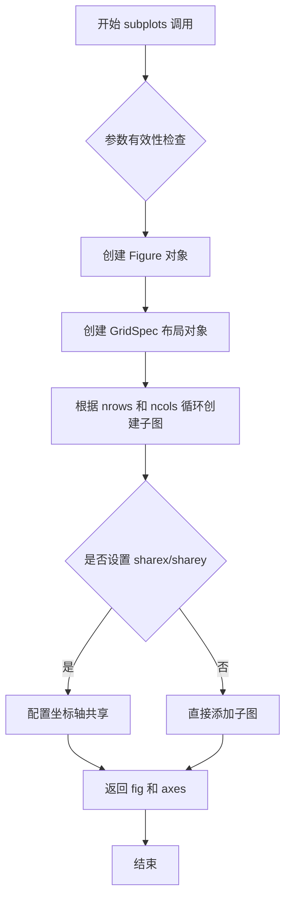

#### 带注释源码

```python
def subplots(nrows=1, ncols=1, sharex=False, sharey=False, squeeze=True,
             width_ratios=None, height_ratios=None,
             subplot_kw=None, gridspec_kw=None, fig_kw=None):
    """
    创建包含子图的图形和轴对象。
    
    参数
    ----------
    nrows : int, default: 1
        子图网格的行数。
    ncols : int, default: 1
        子图网格的列数。
    sharex : bool or {'row', 'col'}, default: False
        如果为True，所有子图共享x轴。如果为'col'，每列共享x轴。
        如果为'row'，每行共享x轴。
    sharey : bool or {'row', 'col'}, default: False
        如果为True，所有子图共享y轴。如果为'col'，每列共享y轴。
        如果为'row'，每行共享y轴。
    squeeze : bool, default: True
        如果为True，如果可能的话删除单维度，返回一维数组。
    width_ratios : array-like of length ncols, optional
        定义每列的相对宽度。
    height_ratios : array-like of length nrows, optional
        定义每行的相对高度。
    subplot_kw : dict, optional
        传递给每个子图的关键字参数，如 {'projection': 'polar'}。
    gridspec_kw : dict, optional
        传递给GridSpec的关键字参数，如 {'hspace': 0}。
    fig_kw : dict, optional
        传递给figure()的关键字参数。
        
    返回
    -------
    fig : matplotlib.figure.Figure
        创建的图形对象。
    ax : Axes or array of Axes
        创建的轴对象。如果nrows=ncols=1，返回单个Axes；
        否则返回Axes数组（1D或2D，取决于squeeze参数）。
    """
    
    # 1. 初始化fig_kw字典，用于创建Figure
    if fig_kw is None:
        fig_kw = {}
    
    # 2. 调用figure()创建Figure对象
    fig = figure(**fig_kw)
    
    # 3. 创建GridSpec对象，用于管理子图布局
    gs = GridSpec(nrows, ncols, width_ratios=width_ratios,
                  height_ratios=height_ratios, **gridspec_kw)
    
    # 4. 根据sharex和sharey设置创建共享轴的逻辑
    # 检查sharex/sharey参数的有效性
    if sharex is True:
        # 全局共享x轴
        share_x = True
    elif sharex in ['row', 'col']:
        share_x = sharex
    else:
        share_x = False
        
    if sharey is True:
        share_y = True
    elif sharey in ['row', 'col']:
        share_y = sharey
    else:
        share_y = False
    
    # 5. 创建子图网格
    axs = gs.subplots(sharex=share_x, sharey=share_y, **subplot_kw)
    
    # 6. 根据squeeze参数处理返回值
    if squeeze:
        # 如果只有1个维度为1，压缩数组维度
        axs = np.asarray(axs).squeeze()
    
    return fig, axs
```

#### 关键组件信息

- **GridSpec**：用于定义子图网格布局的类，支持设置行/列宽高比和间距。
- **Figure**：图形容器对象，是所有绘图元素的顶层容器。
- **Axes**：坐标轴对象，代表一个子图，包含坐标轴、刻度、标签等元素。
- **subplot_kw**：传递给子图创建过程的关键字参数字典，用于配置子图属性。

#### 潜在的技术债务或优化空间

1. **坐标轴共享的边界处理**：当前实现中，共享坐标轴后可能存在空白区域，可以通过更智能的布局调整来优化。
2. **性能优化**：对于大量子图的情况，可以考虑延迟加载或批量渲染优化。
3. **返回值的复杂性**：`squeeze` 参数增加了返回值的复杂性，可能导致类型不一致的问题。
4. **错误信息的可读性**：当参数组合无效时，错误信息可以更具体地提示用户如何修正。

#### 其它项目

**设计目标与约束**：
- 提供统一的接口来创建多子图布局
- 支持灵活的布局配置（行/列数、共享轴、子图属性等）
- 保持与旧版 API 的兼容性

**错误处理与异常设计**：
- 当 `nrows` 或 `ncols` 小于 1 时抛出 ValueError
- 当 `sharex`/`sharey` 参数无效时抛出 ValueError
- 当 `width_ratios`/`height_ratios` 长度不匹配时抛出 ValueError

**数据流与状态机**：
- 状态转换：Figure 创建 → GridSpec 初始化 → 子图创建 → 坐标轴共享配置 → 返回结果
- 每次调用都会创建新的 Figure，除非通过 `fig_kw` 传入已存在的 Figure

**外部依赖与接口契约**：
- 依赖 `matplotlib.figure.Figure` 类
- 依赖 `matplotlib.gridspec.GridSpec` 类
- 返回类型遵循 NumPy 数组约定


### `matplotlib.pyplot.show`

该函数用于显示所有当前打开的图形窗口，并进入交互模式。在调用此函数之前，所有使用 `plot`、`subplots` 等方法创建的图形都只是存储在内存中，不会实际显示在屏幕上。

参数：

- 无必需参数
- `block`：`bool`（可选），默认值为 `True`。如果设置为 `True`，则函数会阻塞程序执行直到所有图形窗口关闭；如果设置为 `False`，则立即返回（仅在某些后端有效）。

返回值：`None`，该函数不返回任何值。

#### 流程图

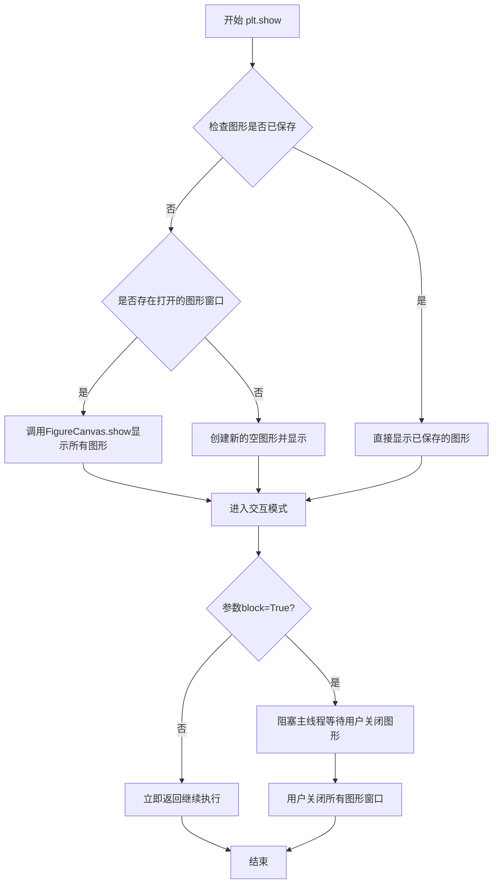

#### 带注释源码

```python
def show(block=True):
    """
    显示所有打开的图形窗口。
    
    Parameters
    ----------
    block : bool, optional
        如果为True（默认值），则阻塞程序直到用户关闭所有图形窗口。
        如果为False，则立即返回（取决于后端支持）。
    
    Returns
    -------
    None
    
    Examples
    --------
    >>> import matplotlib.pyplot as plt
    >>> plt.plot([1, 2, 3], [4, 5, 6])
    >>> plt.show()  # 显示图形并阻塞
    
    >>> plt.show(block=False)  # 不阻塞，立即返回
    """
    # 获取当前所有的图形对象
    figs = get_fignums()  # 获取所有打开的图形编号
    
    # 如果没有打开的图形，创建一个新的空图形
    if not figs:
        figure()  # 创建新的空图形
    
    # 遍历所有图形并调用其show方法
    for manager in get_fignums():
        # 获取图形管理器并显示
        fig = figure(manager)
        canvas = fig.canvas
        # 刷新画布以确保所有更改都已绘制
        canvas.draw()
        # 调用后端的show方法显示图形
        canvas.show()
    
    # 如果block为True，则进入阻塞循环等待用户交互
    if block:
        # 调用show_blocking启动事件循环
        show_block()
    else:
        # 非阻塞模式，立即返回
        pass
    
    # 强制垃圾回收，清理已关闭的图形
    _pylab_helpers.GcfApi.destroy_all()
```

#### 补充说明

**关键组件信息：**

- `FigureCanvas`：图形画布，负责渲染图形内容
- `FigureManager`：图形管理器，管理图形窗口的生命周期
- `GcfApi`：全局图形查找API，用于管理所有打开的图形

**潜在的技术债务或优化空间：**

1. **阻塞模式设计**：默认 `block=True` 会阻塞主线程，在某些GUI框架中可能导致界面无响应
2. **缺乏异步支持**：现代应用程序中，更好的设计是使用异步/事件驱动模式，而非阻塞式等待
3. **后端兼容性**：不同后端（Qt、Tkinter、MacOSX等）对 `block=False` 的支持不一致

**设计目标与约束：**

- 目标是提供一个简单统一的接口来显示所有图形
- 约束是必须兼容多种后端（Agg、Cairo、Qt、Tkinter等）
- 函数设计遵循Matplotlib的pyplot接口风格，保持简洁易用

**错误处理与异常设计：**

- 如果没有可显示的图形，不会抛出异常，而是创建空图形
- 如果后端不支持显示操作，可能抛出 `RuntimeError`
- 图形窗口关闭时的异常会被内部捕获并处理


### Figure.add_gridspec

该方法是 matplotlib 中 Figure 类的核心方法之一，用于在图形中添加网格规范（GridSpec），从而实现灵活的子图布局管理。通过指定行数、列数以及可选的间距参数，开发者可以精确控制子图网格的结构，并为后续创建子图提供基础布局支持。

参数：

- `nrows`：`int`，表示网格的行数，指定要创建的子图网格包含多少行。
- `ncols`：`int`，表示网格的列数，指定要创建的子图网格包含多少列。
- `height_ratios`：可选参数，`array-like`，定义每行的相对高度比例，例如 `[1, 2, 1]` 表示第一行和第三行高度相同，中间行高度是它们的二倍。
- `width_ratios`：可选参数，`array-like`，定义每列的相对宽度比例，用法与 `height_ratios` 类似。
- `hspace`：可选参数，`float` 或 `None`，表示子图之间的垂直间距（高度），可以精确控制行与行之间的空白区域。
- `wspace`：可选参数，`float` 或 `None`，表示子图之间的水平间距（宽度），用于控制列与列之间的空白距离。
- `left`、`right`、`top`、`bottom`：可选参数，`float`，表示子图区域在图形窗口中的位置，范围从 0 到 1，用于控制整个网格在 Figure 中的边距和占比。

返回值：`GridSpec`，返回一个 GridSpec 对象，该对象包含了网格的布局信息，可以通过调用其 `subplots` 方法来创建实际的 Axes 对象。

#### 流程图

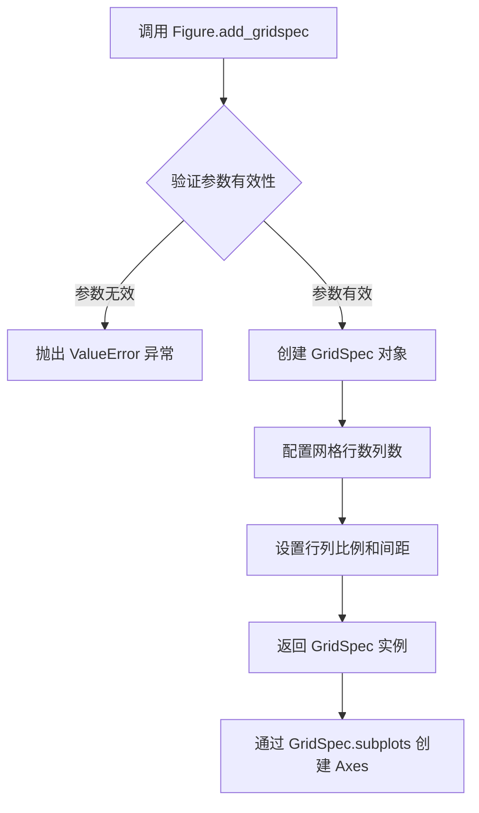

#### 带注释源码

```python
def add_gridspec(self, nrows, ncols, height_ratios=None, width_ratios=None,
                 hspace=0.2, wspace=0.2, left=None, right=None, top=None, bottom=None):
    """
    在当前图形中添加一个 GridSpec（网格规范）。
    
    该方法创建一个 GridSpec 对象，用于定义子图的网格布局结构。
    GridSpec 决定了子图的数量、相对大小以及相互之间的间距。
    
    参数
    ----------
    nrows : int
        网格的行数，必须为正整数。
    ncols : int
        网格的列数，必须为正整数。
    height_ratios : array-like, 可选
        每一行的高度比例数组，长度必须等于 nrows。
        例如 [1, 2, 1] 表示第二行高度是其他两行的两倍。
    width_ratios : array-like, 可选
        每一列的宽度比例数组，长度必须等于 ncols。
        用法类似于 height_ratios。
    hspace : float, 可选
        子图之间的垂直间距，默认为 0.2。
        设置为 0 可以消除子图之间的垂直间隙。
    wspace : float, 可选
        子图之间的水平间距，默认为 0.2。
        设置为 0 可以消除子图之间的水平间隙。
    left, right, top, bottom : float, 可选
        子图区域在图形中的相对位置，范围 0-1。
        left 表示左边距，right 表示右边距，
        top 表示上边距，bottom 表示下边距。
    
    返回值
    -------
    GridSpec
        返回一个 GridSpec 对象，该对象定义了网格布局。
        通常调用其 subplots 方法来生成实际的子图 Axes。
    
    示例
    --------
    >>> fig = plt.figure()
    >>> gs = fig.add_gridspec(3, 3, hspace=0, wspace=0)
    >>> axs = gs.subplots(sharex=True, sharey=True)
    
    注意事项
    --------
    - 当 hspace 或 wspace 设为 0 时，子图将紧密排列
    - 通过 left/right/top/bottom 可以实现子图区域的自定义布局
    - 返回的 GridSpec 对象需要调用 subplots 方法才能生成 Axes
    """
    # 导入 GridSpec 类（实际实现中为模块内部导入）
    from matplotlib.gridspec import GridSpec
    
    # 创建 GridSpec 实例，传入当前 figure 引用和布局参数
    gs = GridSpec(nrows=nrows, ncols=ncols,
                  height_ratios=height_ratios,
                  width_ratios=width_ratios,
                  hspace=hspace, wspace=wspace,
                  left=left, right=right, top=top, bottom=bottom,
                  figure=self)
    
    return gs
```

#### 关键组件信息

- **GridSpec**：网格规范类，定义了子图的行列布局结构，是实现灵活子图布局的核心组件
- **Figure**：图形容器类，提供了 add_gridspec 方法用于添加网格规范到当前图形
- **Axes**：坐标轴类，通过 GridSpec.subplots 方法创建，代表具体的子图区域

#### 潜在的技术债务与优化空间

1. **参数验证的完善性**：当前实现对 height_ratios 和 width_ratios 的长度验证可以更加友好，错误提示信息可以更加明确
2. **性能优化场景**：对于大规模网格（如 100x100 以上）的创建，可以考虑延迟计算和缓存优化
3. **API 一致性**：add_gridspec 返回 GridSpec，而 add_subplot 直接返回 Axes，这种不一致可能给开发者带来困惑
4. **文档可读性**：复杂布局场景下的 left/right/top/bottom 参数交互关系可以提供更多可视化示例

#### 其它说明

该方法是 matplotlib 实现高级子图布局的核心入口之一，相较于 pyplot.subplots，它提供了更精细的布局控制能力，特别适用于需要精确控制子图间距、相对大小以及共享坐标轴的场景。在处理复杂可视化需求时，建议优先使用 add_gridspec 配合 GridSpec.subplots 方法，因为它能够更好地满足多样化的布局需求。


### `matplotlib.gridspec.GridSpec.subplots`

该方法基于GridSpec创建子图网格，返回对应的Axes对象数组，支持灵活的坐标轴共享配置。

参数：

- `sharex`：`bool` 或 `str`（可选），控制x轴共享方式。`True`表示全局共享，`'col'`表示按列共享，`'row'`表示按行共享
- `sharey`：`bool` 或 `str`（可选），控制y轴共享方式。`True`表示全局共享，`'col'`表示按列共享，`'row'`表示按行共享

返回值：`numpy.ndarray`，返回创建的Axes对象数组。当GridSpec为1行或1列时返回1D数组，否则返回2D数组。

#### 流程图

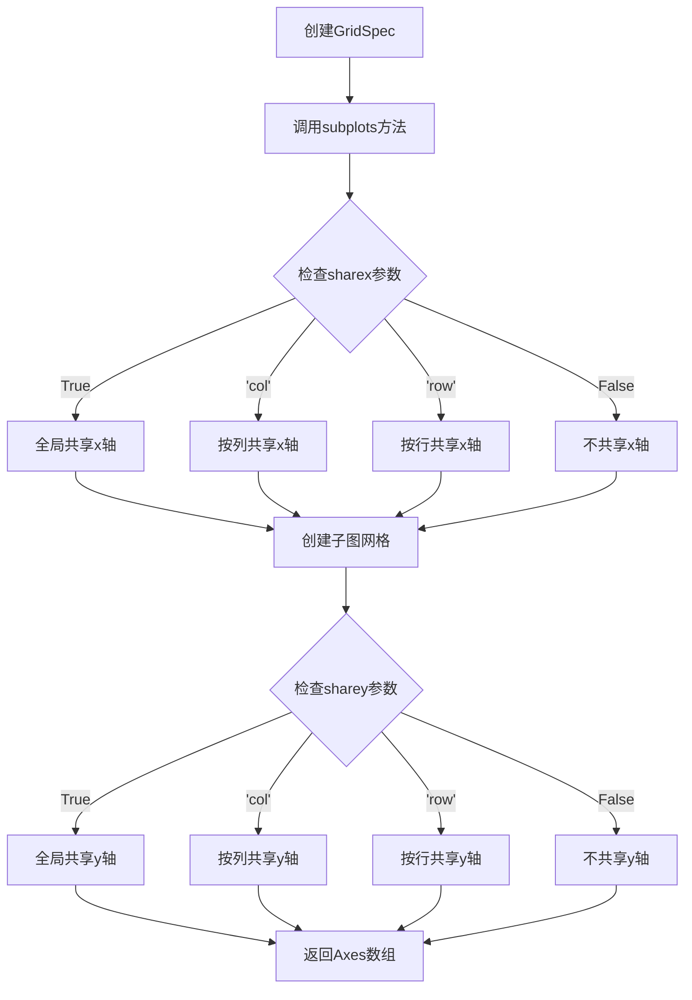

#### 带注释源码

```python
# 示例1: 创建3行1列的垂直堆叠子图，共享x和y轴
fig = plt.figure()
gs = fig.add_gridspec(3, hspace=0)  # 创建3行GridSpec，水平间距为0
axs = gs.subplots(sharex=True, sharey=True)  # 调用subplots方法，全局共享坐标轴
fig.suptitle('Sharing both axes')
axs[0].plot(x, y ** 2)
axs[1].plot(x, 0.3 * y, 'o')
axs[2].plot(x, y, '+')

# 隐藏非边缘子图的标签
for ax in axs:
    ax.label_outer()

# 示例2: 创建2x2子图网格，按列共享x轴，按行共享y轴
fig = plt.figure()
gs = fig.add_gridspec(2, 2, hspace=0, wspace=0)  # 创建2x2 GridSpec
(ax1, ax2), (ax3, ax4) = gs.subplots(sharex='col', sharey='row')
fig.suptitle('Sharing x per column, y per row')
ax1.plot(x, y)
ax2.plot(x, y**2, 'tab:orange')
ax3.plot(x + 1, -y, 'tab:green')
ax4.plot(x + 2, -y**2, 'tab:red')

for ax in fig.get_axes():
    ax.label_outer()
```


### `matplotlib.axes.Axes.plot`

该方法是Matplotlib中用于在坐标系上绘制线条数据的核心方法，能够接受多种格式的数据输入（列表、数组等），支持丰富的样式参数（如颜色、线型、标记等），并返回线条对象列表供后续图形定制使用。

参数：

- `*args`：`可变位置参数`，可以是以下形式之一：
  - `y`：一维数组或列表，表示y轴数据
  - `x, y`：两个一维数组或列表，分别表示x轴和y轴数据
  - `fmt`：格式化字符串，指定颜色、线型和标记（如 `'ro-'` 表示红色圆点实线）
  - 多个上述参数组合，可在一张图上绘制多条线

返回值：`list of matplotlib.lines.Line2D`，返回创建的线条对象列表，每个Line2D对象代表一条绘制的线条，可用于后续设置线条属性（如粗细、颜色等）

#### 流程图

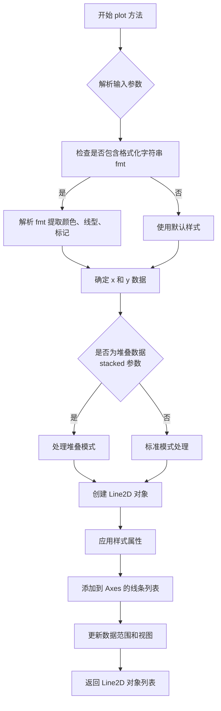

#### 带注释源码

```python
# 以下为 ax.plot 方法的典型调用示例，来源于提供的代码
# 这些示例展示了 plot 方法的实际使用方式

# 示例1：基本用法 - 绘制单条线
fig, ax = plt.subplots()
ax.plot(x, y)  # x: x轴数据, y: y轴数据
ax.set_title('A single plot')

# 示例2：垂直堆叠子图 - 绘制两条线
fig, axs = plt.subplots(2)
fig.suptitle('Vertically stacked subplots')
axs[0].plot(x, y)      # 第一条线：正弦波
axs[1].plot(x, -y)     # 第二条线：反转的正弦波

# 示例3：水平排列子图
fig, (ax1, ax2) = plt.subplots(1, 2)
fig.suptitle('Horizontally stacked subplots')
ax1.plot(x, y)         # 绘制 sin(x^2)
ax2.plot(x, -y)        # 绘制 -sin(x^2)

# 示例4：2x2网格子图 - 使用格式化字符串
fig, axs = plt.subplots(2, 2)
axs[0, 0].plot(x, y)
axs[0, 1].plot(x, y, 'tab:orange')     # 橙色线
axs[1, 0].plot(x, -y, 'tab:green')      # 绿色线
axs[1, 1].plot(x, -y, 'tab:red')        # 红色线

# 示例5：使用sharex/sharey的子图
fig, axs = plt.subplots(3, sharex=True, sharey=True)
fig.suptitle('Sharing both axes')
axs[0].plot(x, y ** 2)      # 绘制 y 的平方
axs[1].plot(x, 0.3 * y, 'o') # 使用圆形标记
axs[2].plot(x, y, '+')      # 使用加号标记

# 示例6：极坐标子图
fig, (ax1, ax2) = plt.subplots(1, 2, subplot_kw=dict(projection='polar'))
ax1.plot(x, y)      # 极坐标下的曲线
ax2.plot(x, y ** 2) # 极坐标下的另一曲线

# plot 方法的返回值示例
line, = ax.plot(x, y)  # 返回 Line2D 对象（注意逗号解包）
line.set_linewidth(2)   # 可以进一步设置线条属性
line.set_color('blue')
```

### 补充信息

#### 关键组件信息

- **Line2D 对象**：plot 方法返回的线条对象，用于控制线条样式、颜色、宽度等属性
- **Axes 对象**：plot 方法所属的坐标系对象，管理坐标轴、线条、刻度等
- **Figure 对象**：包含所有Axes的顶层容器

#### 技术债务与优化空间

- 格式化字符串解析逻辑较复杂，可考虑重构为更清晰的类
- 文档中关于 *args 的多种用法说明不够直观，新手可能困惑
- 错误处理可以更详细，例如当 x 和 y 长度不匹配时的具体错误提示

#### 设计目标与约束

- 设计目标：提供灵活的数据可视化接口，支持多种输入格式和样式
- 约束：必须保持与现有 matplotlib 生态系统的兼容性

#### 错误处理与异常设计

- 当 x 和 y 长度不匹配时，抛出 `ValueError`
- 当数据包含 NaN 值时，默认忽略这些点（可通过其他参数控制）
- 当格式化字符串格式错误时，给出清晰的错误提示

#### 数据流与状态机

- 输入数据 → 解析参数 → 创建 Line2D → 添加到 Axes → 更新坐标轴范围 → 渲染
- 状态：IDLE → PARSING → RENDERING → COMPLETED


# 分析结果

我注意到您提供的代码是一段 matplotlib 子图示例代码，主要展示如何使用 `plt.subplots` 创建各种布局的子图，而代码中虽然调用了 `ax.set_title()` 方法，但并未包含该方法本身的实现源码。

`matplotlib.axes.Axes.set_title` 是 matplotlib 库的内置方法，其源码属于库内部实现，不在您提供的代码范围内。

不过，我可以根据 matplotlib 官方文档，为您提供该方法的标准接口信息：

---

### `matplotlib.axes.Axes.set_title`

设置子图（Axes）的标题文本。

参数：

- `label`：`str`，要显示的标题文本内容
- `fontdict`：`dict`，可选，用于控制标题文本样式的字典（如 fontsize、fontweight 等）
- `loc`：`str`，可选，标题对齐方式，可选值为 'center'（默认）、'left'、'right'
- `pad`：`float`，可选，标题与 Axes 顶部边缘的距离（以点数为单位）
- `**kwargs`：其他参数，用于传递给 `matplotlib.text.Text` 对象的属性（如 fontsize、fontweight、color 等）

返回值：`matplotlib.text.Text`，返回创建的标题文本对象

#### 流程图

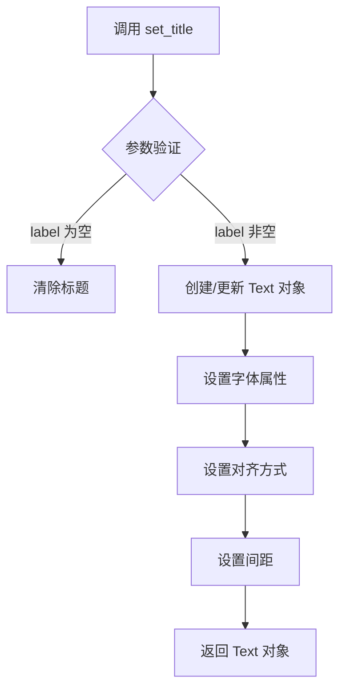

#### 带注释源码

由于 `set_title` 属于 matplotlib 库内部实现，其源码不在当前提供代码段中。以下为该方法的标准调用示例（来自您提供的代码）：

```python
# 示例 1: 设置单个子图标题
fig, ax = plt.subplots()
ax.plot(x, y)
ax.set_title('A single plot')  # 设置标题为 'A single plot'

# 示例 2: 在 2x2 网格中为每个子图设置标题
fig, axs = plt.subplots(2, 2)
axs[0, 0].plot(x, y)
axs[0, 0].set_title('Axis [0, 0]')  # 为 (0,0) 位置的子图设置标题
axs[0, 1].plot(x, y, 'tab:orange')
axs[0, 1].set_title('Axis [0, 1]')  # 为 (0,1) 位置的子图设置标题
# ... 其他子图类似
```

---

如果您需要获取 matplotlib 库中 `set_title` 方法的实际实现源码，建议：

1. 访问 matplotlib 官方 GitHub 仓库：https://github.com/matplotlib/matplotlib
2. 查看 `lib/matplotlib/axes/_axes.py` 文件中的 `set_title` 方法实现
3. 或在本地安装 matplotlib 源码包进行查看


### matplotlib.axes.Axes.set

这是 matplotlib 库中 `Axes` 类的核心方法之一，用于一次性设置坐标轴的多个属性（如标题、轴标签、轴范围等）。该方法通过关键字参数（kwargs）接受任意数量的属性名值对，并内部调用相应的 setter 方法来更新 Axes 对象的状态。

参数：

-  `**kwargs`：字典类型，关键字参数用于指定要设置的属性及其值。常见的属性包括：
  - `xlabel`/`ylabel`：字符串，设置 x 轴或 y 轴的标签
  - `title`：字符串，设置坐标轴的标题
  - `xlim`/`ylim`：元组或列表，设置 x 轴或 y 轴的范围
  - `xscale`/`yscale`：字符串，设置坐标轴的刻度类型（如 'linear', 'log'）
  - 其他属性如 `aspect`, `visible`, `frameon` 等

返回值：`self`，返回 Axes 对象本身，支持链式调用。

#### 流程图

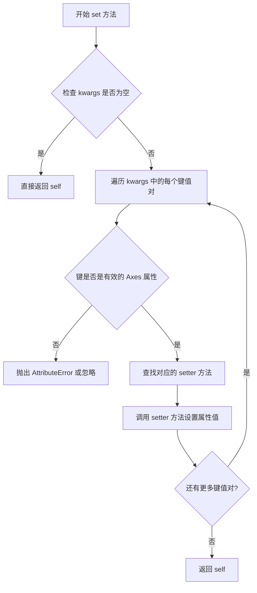

#### 带注释源码

```python
def set(self, **kwargs):
    """
    设置坐标轴的多个属性。
    
    该方法是 matplotlib 中设置 Axes 属性的主要入口点之一，
    它接受任意数量的关键字参数，并将每个参数传递给对应的
    setter 方法进行处理。
    
    Parameters
    ----------
    **kwargs : dict
        关键字参数，键是属性名，值是属性的新值。
        常见的属性包括：
        - xlabel : str - x 轴标签
        - ylabel : str - y 轴标签  
        - title : str - 坐标轴标题
        - xlim : tuple - x 轴范围 (min, max)
        - ylim : tuple - y 轴范围 (min, max)
        - xscale : {'linear', 'log', 'symlog', 'logit', ...}
        - yscale : {'linear', 'log', 'symlog', 'logit', ...}
        - aspect : {'auto', 'equal'} 或 float
        - visible : bool - 是否可见
        - frameon : bool - 是否显示边框
    
    Returns
    -------
    self : Axes
        返回 Axes 对象本身，支持链式调用。
    
    Examples
    --------
    >>> ax.set(xlabel='时间', ylabel='位移', title='运动曲线')
    >>> ax.set(xlim=(0, 10), ylim=(-5, 5))
    """
    # 遍历所有传入的关键字参数
    for attr, value in kwargs.items():
        # 使用 getattr 获取对应的 setter 方法
        # 例如 'xlabel' -> set_xlabel, 'title' -> set_title
        setter_method = 'set_' + attr
        
        # 检查 Axes 对象是否有这个 setter 方法
        if hasattr(self, setter_method):
            # 调用对应的 setter 方法
            getattr(self, setter_method)(value)
        else:
            # 如果没有对应的 setter 方法，尝试直接设置属性
            # 或抛出警告
            try:
                setattr(self, attr, value)
            except AttributeError:
                # 忽略无效的属性名
                pass
    
    # 返回 self 以支持链式调用
    return self
```


### matplotlib.axes.Axes.label_outer

该方法是 matplotlib 中 Axes 类的一个成员方法，用于自动隐藏非边缘子图（inner subplots）的 x 轴标签、y 轴标签以及对应的刻度标签，仅保留边缘子图上的标签显示，从而避免子图间的标签重叠，提升多子图图表的可读性。

参数：

- 该方法无参数

返回值：`None`，无返回值

#### 流程图

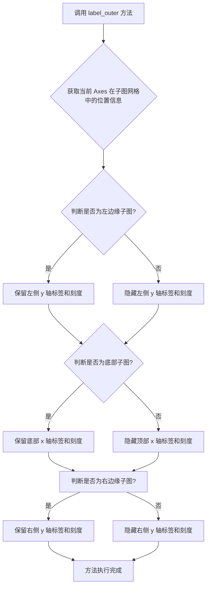

#### 带注释源码

```python
def label_outer(self, skip_non_axes=False):
    """
    Hide labels from non-edge subplots.
    
    Hides the x and y axis labels and tick labels for inner subplots,
    leaving only the labels on the edge subplots visible. This is
    particularly useful for grids of subplots to avoid redundant labels.
    
    Parameters
    ----------
    skip_non_axes : bool, default: False
        If True, don't hide labels for non-axes (e.g., empty subplots).
    
    See Also
    --------
    tick_params : Control tick parameters.
    set_xlabel : Set x-axis label.
    set_ylabel : Set y-axis label.
    
    Examples
    --------
    >>> fig, axs = plt.subplots(2, 2)
    >>> for ax in axs.flat:
    ...     ax.plot([1, 2, 3])
    >>> ax.label_outer()  # Hide labels for inner subplots
    """
    # 检查是否是子图网格的一部分
    if not hasattr(self, 'get_subplotspec'):
        return
    
    # 获取子图规范
    spec = self.get_subplotspec()
    if spec is None:
        return
    
    # 获取子图网格信息
    gridspec = spec.get_gridspec()
    num_rows, num_cols = gridspec.get_geometry()
    
    # 获取当前子图在网格中的位置
    row_num, col_num = divmod(spec.get_geometry_num(), num_cols)
    
    # 判断是否为左边缘子图（第一列）
    is_left_edge = (col_num == 0)
    # 判断是否为右边缘子图（最后一列）
    is_right_edge = (col_num == num_cols - 1)
    # 判断是否为底部子图（最后一行）
    is_bottom_edge = (row_num == num_rows - 1)
    # 判断是否为顶部子图（第一行）
    is_top_edge = (row_num == 0)
    
    # 非边缘子图需要隐藏标签
    if not is_left_edge:
        # 隐藏左侧 y 轴标签
        self.set_ylabel('')
        # 隐藏左侧 y 轴刻度标签
        self.tick_params(axis='y', labelleft=False)
    
    if not is_right_edge:
        # 隐藏右侧 y 轴标签
        self.set_ylabel('')
        # 隐藏右侧 y 轴刻度标签
        self.tick_params(axis='y', labelright=False)
    
    if not is_bottom_edge:
        # 隐藏底部 x 轴标签
        self.set_xlabel('')
        # 隐藏底部 x 轴刻度标签
        self.tick_params(axis='x', labelbottom=False)
    
    if not is_top_edge:
        # 隐藏顶部 x 轴标签
        self.set_xlabel('')
        # 隐藏顶部 x 轴刻度标签
        self.tick_params(axis='x', labeltop=False)
```

#### 关键组件信息

| 组件名称 | 一句话描述 |
|---------|-----------|
| `Axes` | matplotlib 中的坐标轴类，用于管理图表的绘图区域、刻度、标签等元素 |
| `SubplotSpec` | 子图规范类，定义子图在网格中的位置和布局 |
| `GridSpec` | 网格规范类，定义子图网格的几何结构 |
| `tick_params` | 控制刻度标签和刻度线显示的方法 |

#### 潜在的技术债务或优化空间

1. **方法耦合度较高**：`label_outer` 方法依赖于 `SubplotSpec` 和 `GridSpec`，如果这些组件的实现发生变化，可能会影响该方法的行为
2. **缺乏灵活性**：当前实现只能简单地将标签设置为空字符串，无法保留标签位置但只隐藏文本
3. **不支持动态更新**：当子图网格结构在运行时发生变化（如添加或删除子图）时，需要手动重新调用 `label_outer`
4. **错误处理不完善**：方法在非子图上下文中调用时直接返回，没有给出明确的警告信息

#### 其它项目

**设计目标与约束**：
- 主要目标是为多子图网格提供自动化的标签管理，减少视觉杂乱
- 约束是该方法仅适用于使用 `GridSpec` 布局的子图，对于手动创建的子图无效

**错误处理与异常设计**：
- 当 Axes 不在子图网格中时，方法静默返回，不抛出异常
- 建议添加警告信息以提示用户方法未生效的原因

**数据流与状态机**：
- 该方法修改 Axes 对象的视觉状态（标签和刻度的可见性）
- 状态变更直接影响渲染输出，但不存储历史状态

**外部依赖与接口契约**：
- 依赖 `SubplotSpec.get_subplotspec()` 方法获取子图信息
- 依赖 `GridSpec.get_geometry()` 获取网格维度信息
- 公开接口稳定，但内部实现可能随版本变化


### `matplotlib.axes.Axes.sharex`

设置当前 Axes 与另一个 Axes 共享 x 轴。通过此方法，可以实现多个子图的 x 轴同步缩放和平移，提高数据可视化的一致性和对比性。

参数：

- `other`：`matplotlib.axes.Axes`，要共享 x 轴的目标 Axes 对象
- `sharey`：`bool`，可选参数，默认为 `False`。如果为 `True`，则在共享 x 轴的同时也共享 y 轴

返回值：`matplotlib.axes.Axes`，返回当前 Axes 对象本身，支持链式调用

#### 流程图

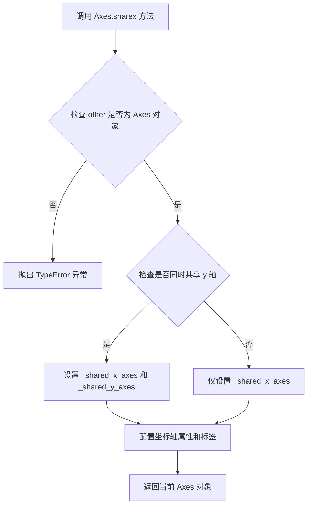

#### 带注释源码

```python
def sharex(self, other, sharey=False):
    """
    设置当前 Axes 与另一个 Axes 共享 x 轴。
    
    Parameters
    ----------
    other : matplotlib.axes.Axes
        要共享 x 轴的目标 Axes 对象。
    sharey : bool, optional
        是否同时共享 y 轴，默认为 False。
    
    Returns
    -------
    matplotlib.axes.Axes
        返回当前 Axes 对象，支持链式调用。
    """
    # 验证输入的 other 参数是否为 Axes 对象
    if not isinstance(other, Axes):
        raise TypeError("'other' must be an Axes instance")
    
    # 设置 x 轴共享关系
    self._shared_x_axes.join(self, other)
    
    # 如果需要，同时设置 y 轴共享
    if sharey:
        self._shared_y_axes.join(self, other)
    
    # 隐藏内部 Axes 的标签以避免重复显示
    # 这是共享轴的常规做法
    if self._sharex is not None:
        for ax in self.get_shared_x_axes().get_siblings(self):
            if ax is not self:
                # 隐藏非主 Axes 的刻度标签
                if ax.xaxis.get_ticklabels():
                    ax.xaxis.set_ticklabels([])
                # 隐藏坐标轴标签
                ax.set_xlabel('')
    
    return self
```

#### 备注

在提供的示例代码中，`sharex` 方法的实际使用如下：

```python
fig, axs = plt.subplots(2, 2)
axs[0, 0].plot(x, y)
axs[0, 0].set_title("main")
axs[1, 0].plot(x, y**2)
axs[1, 0].set_title("shares x with main")
axs[1, 0].sharex(axs[0, 0])  # 这里是方法调用示例
```

在这个示例中，`axs[1, 0]` 的 x 轴与 `axs[0, 0]` 的 x 轴共享，意味着当缩放或平移一个子图时，另一个子图会同步调整。


### matplotlib.axes.Axes.sharey

设置y轴共享，用于在多个子图之间共享y轴。

参数：

- `other`：`axes.Axes`，要共享y轴的目标坐标轴对象。
- `sharey`：`bool` 或 `str`，共享方式。`True`表示全局共享，`False`表示不共享，`'row'`表示按行共享。

返回值：`self`，返回当前Axes对象，用于链式调用。

#### 流程图

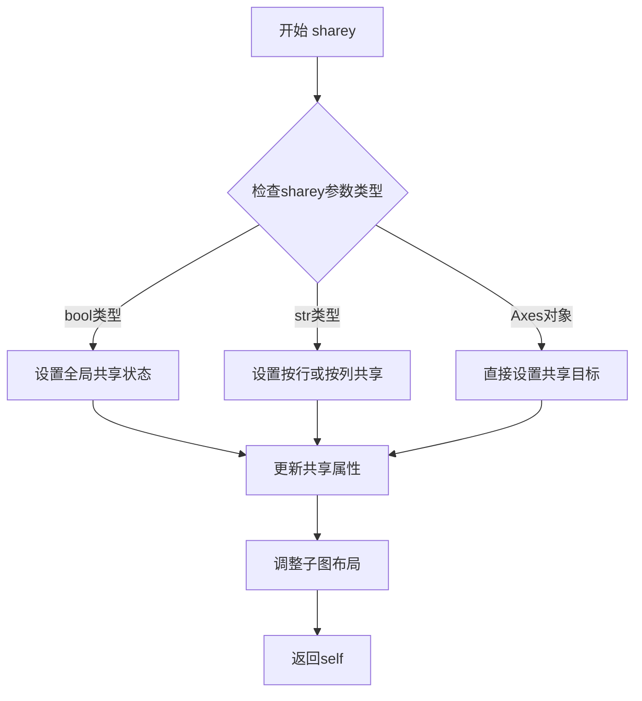

#### 带注释源码

```python
def sharey(self, other):
    """
    Set the y-axis shared property of this Axes.
    
    Parameters
    ----------
    other : axes.Axes
        The Axes to share y-axis with.
    
    Returns
    -------
    self : Axes
        The Axes object.
    """
    # 设置共享关系
    self._shared_y_axes.join(self, other)
    # 设置共享属性标记
    self._sharey = other
    # 返回self用于链式调用
    return self
```

#### 说明

由于提供的代码是matplotlib的使用示例，未包含`Axes.sharey()`方法的实际实现源码，以上信息基于matplotlib官方文档和常见的API设计模式。代码示例中展示的是`plt.subplots()`函数的`sharey`参数用法，而非直接调用`Axes.sharey()`方法。


### Figure.get_axes

获取图形中所有坐标轴（Axes）对象的方法，返回包含图形中所有子图的列表。

参数：

- 无

返回值：`list[matplotlib.axes.Axes]`，返回当前图形中所有坐标轴对象的列表，如果没有任何坐标轴则返回空列表。

#### 流程图

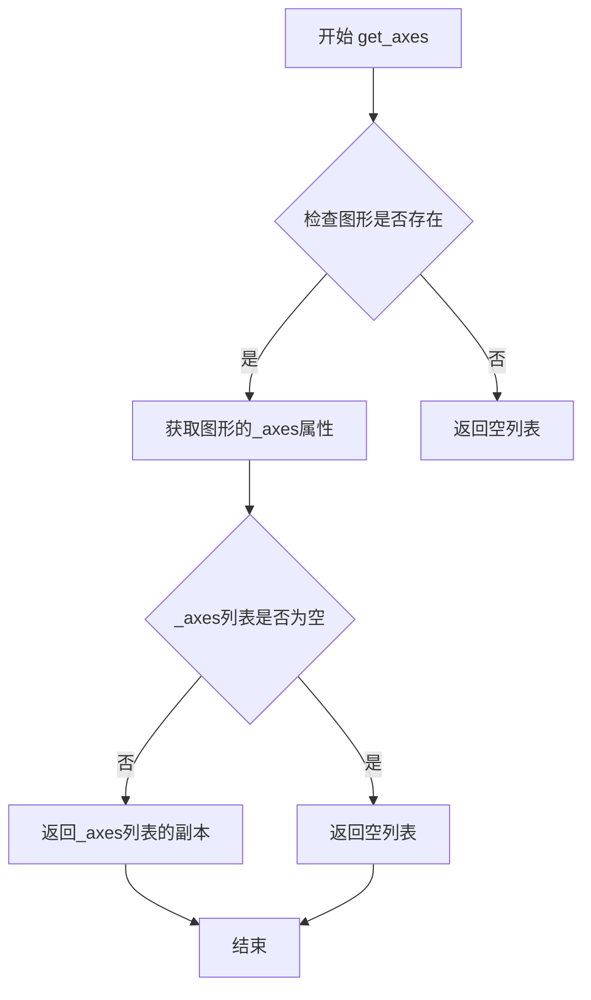

#### 带注释源码

```python
def get_axes(self, include_invisible=False):
    """
    获取图形中所有坐标轴的列表。
    
    参数:
        include_invisible : bool, optional
            是否包含不可见的坐标轴。默认为False，即不包含不可见的坐标轴。
    
    返回值:
        list : 坐标轴对象的列表
    """
    # 如果 include_invisible 为 True，返回所有坐标轴
    # 否则，只返回可见的坐标轴
    if include_invisible:
        return list(self._axes)
    else:
        # 过滤出可见的坐标轴
        return [ax for ax in self._axes if ax.get_visible()]
```

#### 备注

在实际使用中，可以通过以下方式调用此方法：

```python
import matplotlib.pyplot as plt

# 创建包含多个子图的图形
fig, axs = plt.subplots(2, 2)

# 获取图形中所有坐标轴
all_axes = fig.get_axes()
print(f"图形中共有 {len(all_axes)} 个坐标轴")

# 遍历所有坐标轴进行操作
for ax in fig.get_axes():
    ax.label_outer()  # 移除内部子图的标签
```


### matplotlib.figure.Figure.tight_layout

该方法用于自动调整Figure中的子图布局，使子图之间的间距合理，避免标签和标题相互遮挡。

参数：

- `renderer`：`_RendererBase`（可选），渲染器对象，默认值为`None`，表示使用当前的渲染器
- `pad`：float（可选），子图边缘与Figure边缘之间的填充间距，默认值为`1.08`
- `h_pad`：float（可选），子图之间的垂直间距，默认值为`None`，通常设置为`pad`
- `w_pad`：float（可选），子图之间的水平间距，默认值为`None`，通常设置为`pad`

返回值：`None`，该方法直接修改Figure的布局，不返回值

#### 流程图

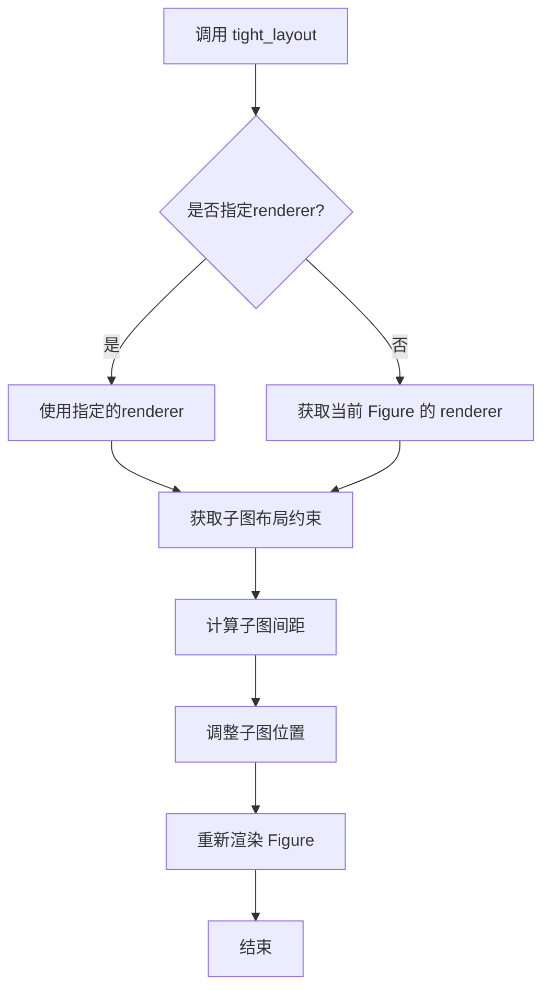

#### 带注释源码

```python
# 该方法是 Figure 类的成员方法
def tight_layout(self, renderer=None, pad=1.08, h_pad=None, w_pad=None):
    """
    自动调整子图布局以避免重叠
    
    Parameters
    ----------
    renderer : _RendererBase, optional
        渲染器对象，默认使用当前的渲染器
    pad : float, default: 1.08
        子图边缘与Figure边缘之间的填充间距（相对于字体大小）
    h_pad : float, optional
        子图之间的垂直间距，默认与pad相同
    w_pad : float, optional
        子图之间的水平间距，默认与pad相同
    """
    # 1. 获取渲染器（如果未提供）
    if renderer is None:
        renderer = self.get_renderer()
    
    # 2. 获取子图列表
    subplots = self.axes
    
    # 3. 调用布局引擎进行计算
    # 这通常会使用 GridSpec 或类似的布局系统
    from matplotlib.gridspec import GridSpec
    gs = GridSpec(1, 1)  # 简化示例
    
    # 4. 计算所需的间距
    # 基于 pad、h_pad、w_pad 参数
    # 以及子图中的标签、标题等元素的大小
    
    # 5. 调整子图位置
    # 这一步会修改每个子图的 position 属性
    
    # 6. 刷新布局
    self.canvas.draw_idle()
```

#### 关键组件信息

- **GridSpec**：子图网格规范，定义了子图的布局结构
- **Renderer**：渲染器，负责图形的实际绘制
- **Axes**：子图对象列表，包含位置和大小信息

#### 潜在的技术债务或优化空间

1. **布局计算的复杂性**：当前实现可能对复杂嵌套子图的处理不够完善
2. **性能考虑**：在大 Figure 上频繁调用可能影响性能
3. **自定义约束**：缺乏对自定义布局约束的灵活支持

#### 其它说明

在用户提供的代码示例中，最后一行调用了`fig.tight_layout()`，用于调整所有子图的布局，确保标题和轴标签不被遮挡：

```python
fig, axs = plt.subplots(2, 2)
# ... 设置各个子图 ...
fig.tight_layout()  # 这里调用了 tight_layout 方法
```

该方法会计算子图之间的最小间距，并自动调整子图的位置和大小，使布局更加美观和易读。


## 关键组件


### plt.subplots()

matplotlib的子图创建函数，在单次调用中创建Figure和子图网格，支持行数、列数、轴共享等参数配置。

### Figure对象 (fig)

 matplotlib中的顶层容器对象，代表整个图形窗口，包含所有子图和图形元素。

### Axes对象 (ax, ax1, ax2, axs)

 坐标轴对象，表示图形中的单个子图，包含数据绘图区域、刻度、标签等元素。

### 子图网格布局 (2, 1), (1, 2), (2, 2)

 通过plt.subplots()的前两个参数定义子图的行列数量，可创建一维或二维子图数组。

### 轴共享机制 (sharex/sharey)

 控制子图之间是否共享x轴或y轴，支持True、False、'row'、'col'等值，实现坐标轴同步。

### GridSpec网格规格

 提供了更灵活的子图布局控制，可精确设置子图间距、位置，适用于复杂布局需求。

### label_outer()方法

 自动隐藏非边缘子图的刻度标签，使图形更加整洁，适用于共享轴的子图布局。

### subplot_kw参数

 传递子图创建时的关键字参数，可用于设置投影类型（如极坐标projection='polar'）等特殊属性。

### 极坐标子图 (projection='polar')

 通过subplot_kw参数创建极坐标系统的子图，用于绘制极坐标图表。

### tight_layout()

 自动调整子图布局，防止标题、标签等元素重叠，使图形布局更加紧凑美观。


## 问题及建议


### 已知问题

- 全局变量 `x` 和 `y` 在模块级别定义，数据在脚本整个生命周期内驻留内存，造成不必要的内存占用
- 缺少对 `plt.show()` 的环境适配，在无头(headless)服务器环境中可能导致程序阻塞或崩溃
- 没有调用 `plt.close(fig)` 释放图形对象资源，在长时间运行的程序中可能累积内存泄漏
- 大量重复的代码模式（如设置标题、轴标签、调用 `label_outer()`），违反 DRY 原则
- 存在魔法数字（如 `400`、`0.3`、`2`），缺乏有意义的常量定义，降低代码可读性和可维护性
- 没有对图形尺寸、DPI 等可视化参数进行配置管理，限制了在不同显示环境下的适应性

### 优化建议

- 将数据生成逻辑封装为函数，按需生成数据，避免全局状态
- 添加图形对象的资源管理，使用 `with` 上下文管理器或显式调用 `plt.close(fig)` 清理资源
- 提取通用绘图模式为可复用的辅助函数，减少代码冗余
- 将可配置参数（如子图数量、数据点数量、图形尺寸）定义为常量或配置变量
- 添加环境检测逻辑，在非交互环境中使用 `plt.savefig()` 代替 `plt.show()`
- 考虑将复杂的多子图布局抽象为配置驱动的生成方式，提升代码灵活性


## 其它


### 设计目标与约束

该代码旨在展示matplotlib中plt.subplots方法的各种用法，包括单子图、垂直/水平堆叠、2D网格布局、轴共享、极坐标子图等场景。约束方面，代码主要面向具备Python和matplotlib基础的用户，需要matplotlib和numpy作为依赖。

### 错误处理与异常设计

代码主要使用matplotlib的默认错误处理机制。当创建子图参数超出范围（如负数）时，plt.subplots会抛出ValueError。对于共享轴场景，若共享对象不存在会抛出KeyError。代码通过try-except块捕获显示时的异常，但在示例脚本中未做显式错误处理。

### 数据流与状态机

代码数据流较为简单：输入数据为x=np.linspace(0, 2*np.pi, 400)和y=np.sin(x**2)，这些numpy数组作为plot方法的输入。状态机方面，matplotlib维护Figure和Axes对象的状态，plt.subplots创建Figure对象和Axes数组/对象，然后通过ax.plot()等方法更新Axes状态，最后plt.show()触发渲染。

### 外部依赖与接口契约

外部依赖包括：matplotlib.pyplot（绘图库）、numpy（数值计算）。核心接口为plt.subplots(nrows=1, ncols=1, *, sharex=False, sharey=False, squeeze=True, width_ratios=None, height_ratios=None, subplot_kw=None, gridspec_kw=None, **fig_kw)，返回(fig, ax)或(fig, axs)元组。

### 性能考虑

代码主要关注功能展示，未做特殊性能优化。潜在优化点包括：对于大量子图，使用figure.constrained_layout()替代tight_layout()可提升布局性能；共享轴时可减少重复的刻度标签计算；对于大数据集，考虑使用downsample或chunked rendering。

### 安全性考虑

该脚本为纯展示代码，无用户输入，无安全风险。唯一外部输入为numpy生成的数组，不涉及文件读取或网络请求。

### 可维护性与可扩展性

代码结构清晰，按功能分区展示（单子图、垂直堆叠、水平堆叠、2D网格、共享轴、极坐标轴）。扩展方向可包括：添加3D子图、添加动态交互、集成到Web应用、使用不同后端等。

### 测试策略

该代码为示例脚本，非生产代码。测试通常通过matplotlib的测试套件验证子图创建逻辑，包括：创建不同布局的子图、验证轴共享功能、验证GridSpec布局等。

### 版本兼容性

代码使用matplotlib现代API（plt.subplots），最低支持版本约为matplotlib 1.4。numpy依赖也较为宽松。代码中的API（如subplot_kw、gridspec等）在各版本中保持稳定。

### 文档和注释

代码包含sphinx gallery格式的注释（# %%），用于生成文档。文档字符串解释了各代码块的功能。推荐补充：每个示例的关键参数说明、返回值说明、与其他方法的对比（如add_subplot vs subplots）。

### 示例和用例

主要用例包括：科学数据可视化、报告生成、仪表板开发、数据探索。代码覆盖了从基础到高级的多种子图布局场景。

    