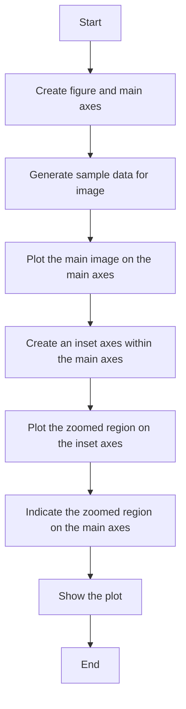
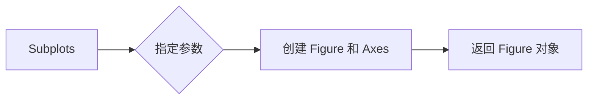
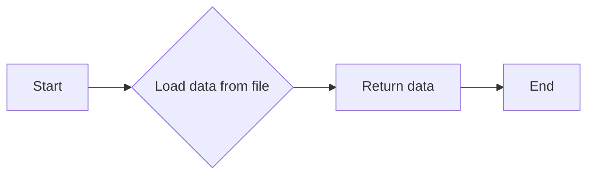
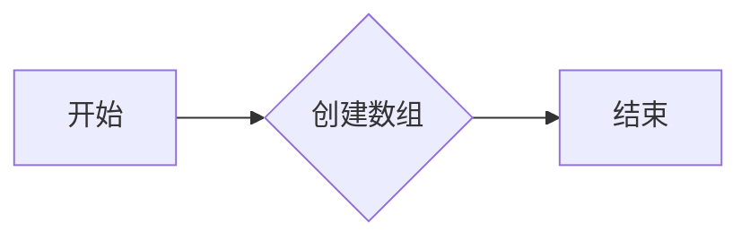
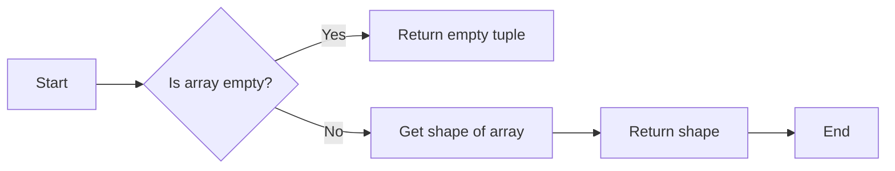
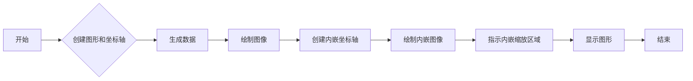
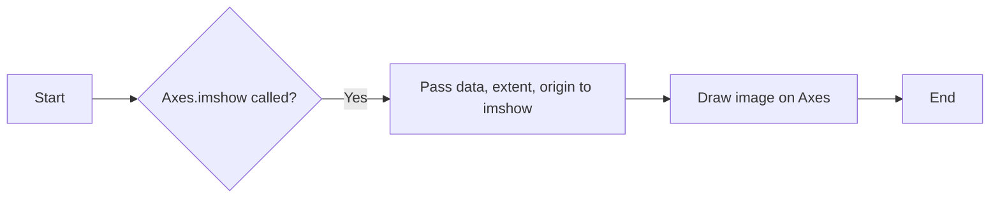
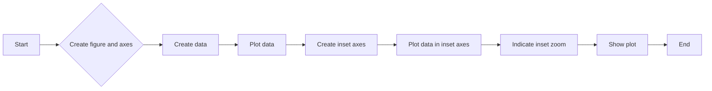
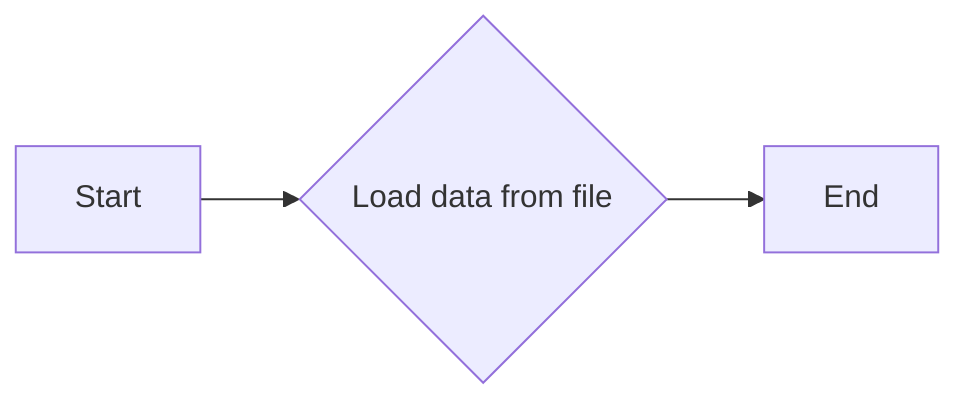

# `matplotlib\galleries\examples\subplots_axes_and_figures\zoom_inset_axes.py` 详细设计文档

This code demonstrates the creation of an inset Axes within a main plot in Matplotlib, showing a zoomed region of an image.

## 整体流程



## 类结构

```
Figure
├── Axes
│   ├── InsetAxes
│   └── Image
└── SampleData
```

## 全局变量及字段


### `fig`
    
The main figure object containing the axes and the inset axes.

类型：`matplotlib.figure.Figure`
    


### `ax`
    
The main axes object where the image is displayed.

类型：`matplotlib.axes.Axes`
    


### `axins`
    
The inset axes object where the zoomed region of the image is displayed.

类型：`matplotlib.axes.Axes`
    


### `Z`
    
The original sample data array.

类型：`numpy.ndarray`
    


### `Z2`
    
The expanded sample data array for display.

类型：`numpy.ndarray`
    


### `extent`
    
The extent of the data array in the form (xmin, xmax, ymin, ymax).

类型：`tuple`
    


### `x1`
    
The x-coordinate of the lower left corner of the inset axes.

类型：`float`
    


### `x2`
    
The x-coordinate of the upper right corner of the inset axes.

类型：`float`
    


### `y1`
    
The y-coordinate of the lower left corner of the inset axes.

类型：`float`
    


### `y2`
    
The y-coordinate of the upper right corner of the inset axes.

类型：`float`
    


### `Figure.fig`
    
The main figure object containing the axes and the inset axes.

类型：`matplotlib.figure.Figure`
    


### `Axes.ax`
    
The main axes object where the image is displayed.

类型：`matplotlib.axes.Axes`
    


### `Figure.inset_ax`
    
The inset axes object where the zoomed region of the image is displayed.

类型：`matplotlib.axes.Axes`
    


### `Figure.image`
    
The image object representing the displayed image.

类型：`matplotlib.image.Image`
    


### `Axes.ax`
    
The main axes object where the image is displayed.

类型：`matplotlib.axes.Axes`
    


### `InsetAxes.inset_ax`
    
The inset axes object where the zoomed region of the image is displayed.

类型：`matplotlib.axes.Axes`
    


### `Image.image`
    
The image object representing the displayed image.

类型：`matplotlib.image.Image`
    


### `SampleData.Z`
    
The original sample data array.

类型：`numpy.ndarray`
    


### `SampleData.Z2`
    
The expanded sample data array for display.

类型：`numpy.ndarray`
    


### `SampleData.extent`
    
The extent of the data array in the form (xmin, xmax, ymin, ymax).

类型：`tuple`
    
    

## 全局函数及方法


### plt.subplots

`plt.subplots` 是一个用于创建子图和轴对象的函数。

参数：

- `figsize`：`tuple`，指定图形的大小（宽度和高度），默认为 (6, 4)。
- `dpi`：`int`，指定图形的分辨率，默认为 100。
- `facecolor`：`color`，指定图形的背景颜色，默认为 'white'。
- `edgecolor`：`color`，指定图形的边缘颜色，默认为 'none'。
- `frameon`：`bool`，指定是否显示图形的边框，默认为 True。
- `num`：`int`，指定要创建的轴对象的数量，默认为 1。
- `gridspec_kw`：`dict`，指定 `GridSpec` 的关键字参数。
- `constrained_layout`：`bool`，指定是否启用约束布局，默认为 False。

返回值：`Figure` 对象，包含一个轴对象。

#### 流程图



#### 带注释源码

```python
fig, ax = plt.subplots()
```

在这个例子中，`plt.subplots` 被用来创建一个图形和一个轴对象，然后这些对象被赋值给 `fig` 和 `ax` 变量。这个函数没有返回值，但是返回的 `Figure` 对象被用于后续的绘图操作。


### cbook.get_sample_data

获取示例数据，用于matplotlib的示例和测试。

参数：

- `filename`：`str`，示例数据的文件名。

返回值：`numpy.ndarray`，示例数据的numpy数组。

#### 流程图



#### 带注释源码

```python
def get_sample_data(filename):
    """
    Load sample data from a file.

    Parameters
    ----------
    filename : str
        The name of the file containing the sample data.

    Returns
    -------
    data : numpy.ndarray
        The sample data loaded from the file.
    """
    # Load data from file
    data = np.load(filename)
    return data
```


### np.zeros

创建一个指定形状和类型的新数组，其中所有元素都初始化为零。

参数：

- `shape`：`int`或`tuple`，指定新数组的形状。
- `dtype`：`dtype`，可选，指定新数组的类型，默认为`float`。

返回值：`numpy.ndarray`，一个新数组，其中所有元素都初始化为零。

#### 流程图



#### 带注释源码

```python
import numpy as np

# 创建一个形状为(150, 150)的数组，所有元素初始化为零
Z2 = np.zeros((150, 150))
```


### np.shape

`np.shape` 是 NumPy 库中的一个函数，用于获取数组的形状。

参数：

- `array`：`numpy.ndarray`，需要获取形状的数组。

返回值：`tuple`，包含数组形状的元组。

#### 流程图



#### 带注释源码

```python
import numpy as np

def np_shape(array):
    """
    Get the shape of a numpy array.

    Parameters:
    - array: numpy.ndarray, the array to get the shape of.

    Returns:
    - tuple, the shape of the array.
    """
    return array.shape
```


### plt.show()

显示当前图形。

参数：

- 无

返回值：无

#### 流程图

```mermaid
graph LR
A[开始] --> B{调用plt.show()}
B --> C[结束]
```

#### 带注释源码

```python
plt.show()
```


### Figure.show

展示一个包含内嵌Axes和矩形显示缩放位置的示例。

参数：

- `fig`：`matplotlib.figure.Figure`，matplotlib图形对象，用于绘制图像。
- `ax`：`matplotlib.axes.Axes`，matplotlib坐标轴对象，用于绘制图像。

返回值：无

#### 流程图



#### 带注释源码

```python
fig, ax = plt.subplots()  # 创建图形和坐标轴
# ... (省略数据生成和图像绘制代码)
ax.indicate_inset_zoom(axins, edgecolor="black")  # 指示内嵌缩放区域
plt.show()  # 显示图形
```


### Axes.imshow

`Axes.imshow` 是一个用于在 Matplotlib 的 Axes 对象上绘制图像的方法。

参数：

- `data`：`numpy.ndarray`，图像数据，通常是二维数组。
- `extent`：`tuple`，图像的显示范围，格式为 `(xmin, xmax, ymin, ymax)`。
- `origin`：`str`，图像的起始位置，可以是 'upper' 或 'lower'。

返回值：`matplotlib.image.AxesImage`，图像对象。

#### 流程图



#### 带注释源码

```python
import numpy as np
from matplotlib import pyplot as plt

fig, ax = plt.subplots()

# make data
Z = cbook.get_sample_data("axes_grid/bivariate_normal.npy")  # 15x15 array
Z2 = np.zeros((150, 150))
ny, nx = Z.shape
Z2[30:30+ny, 30:30+nx] = Z
extent = (-3, 4, -4, 3)

# Draw image on Axes
ax.imshow(Z2, extent=extent, origin="lower")
```


### `Axes.indicate_inset_zoom`

`Axes.indicate_inset_zoom` 方法用于在主轴（Axes）上指示内嵌轴（inset Axes）的缩放区域。

参数：

- `inset_axes`：`Axes`，表示内嵌轴对象。
- `edgecolor`：`str`，指示缩放区域的边框颜色。

返回值：`None`，该方法不返回任何值。

#### 流程图

```mermaid
graph LR
A[Start] --> B{Pass 'inset_axes' and 'edgecolor' to indicate_inset_zoom()}
B --> C[End]
```

#### 带注释源码

```python
ax.indicate_inset_zoom(axins, edgecolor="black")
```

在这段代码中，`indicate_inset_zoom` 方法被调用来在主轴 `ax` 上指示内嵌轴 `axins` 的缩放区域，边框颜色设置为黑色。


### imshow

`imshow` 方法用于在 Matplotlib 图形中显示图像。

参数：

- `Z2`：`numpy.ndarray`，图像数据，通常是二维数组。
- `extent`：`tuple`，图像显示的范围，格式为 `(xmin, xmax, ymin, ymax)`。
- `origin`：`str`，图像的起始点，可以是 "lower" 或 "upper"。

返回值：`matplotlib.image.AxesImage`，图像对象。

#### 流程图


#### 带注释源码

```python
ax.imshow(Z2, extent=extent, origin="lower")
```

在这行代码中，`imshow` 方法被调用来在 `ax`（一个 Matplotlib 图形轴）上显示 `Z2` 图像。`extent` 参数定义了图像显示的范围，而 `origin` 参数指定了图像的起始点。


### Image.plot

该函数用于在matplotlib中创建一个图像，并在其中添加一个内嵌的轴（inset Axes），显示原始图像的一个子区域。

参数：

- `fig`：`matplotlib.figure.Figure`，当前图像的Figure对象。
- `ax`：`matplotlib.axes.Axes`，当前图像的Axes对象。
- `Z2`：`numpy.ndarray`，图像数据。
- `extent`：`tuple`，图像的显示范围。
- `x1, x2, y1, y2`：`float`，内嵌轴的显示范围。
- `axins`：`matplotlib.axes.Axes`，内嵌轴对象。

返回值：无

#### 流程图



#### 带注释源码

```python
import numpy as np
from matplotlib import cbook
from matplotlib import pyplot as plt

fig, ax = plt.subplots()

# make data
Z = cbook.get_sample_data("axes_grid/bivariate_normal.npy")  # 15x15 array
Z2 = np.zeros((150, 150))
ny, nx = Z.shape
Z2[30:30+ny, 30:30+nx] = Z
extent = (-3, 4, -4, 3)

ax.imshow(Z2, extent=extent, origin="lower")

# inset Axes....
x1, x2, y1, y2 = -1.5, -0.9, -2.5, -1.9  # subregion of the original image
axins = ax.inset_axes(
    [0.5, 0.5, 0.47, 0.47],
    xlim=(x1, x2), ylim=(y1, y2), xticklabels=[], yticklabels=[])
axins.imshow(Z2, extent=extent, origin="lower")

ax.indicate_inset_zoom(axins, edgecolor="black")

plt.show()
```


### SampleData.get

获取样本数据。

参数：

- `filename`：`str`，样本数据的文件名。

返回值：`numpy.ndarray`，样本数据。

#### 流程图



#### 带注释源码

```python
def get(filename):
    """
    Load sample data from a file.

    Parameters
    ----------
    filename : str
        The name of the file containing the sample data.

    Returns
    -------
    numpy.ndarray
        The sample data loaded from the file.
    """
    # Load sample data from file
    data = cbook.get_sample_data(filename)
    return data
```


## 关键组件


### 张量索引

张量索引用于在多维数组（张量）中定位和访问特定元素。

### 惰性加载

惰性加载是一种延迟计算或初始化数据的技术，直到实际需要时才进行，以提高性能和资源利用率。

### 反量化支持

反量化支持是指系统或算法能够处理和解释量化后的数据，以便进行进一步的处理或分析。

### 量化策略

量化策略是指将浮点数数据转换为固定点数表示的方法，以减少计算资源消耗和提高处理速度。


## 问题及建议


### 已知问题

-   **代码复用性低**：代码中使用了硬编码的坐标和尺寸，这限制了代码的复用性，如果需要调整缩放区域或图像尺寸，需要手动修改多个地方。
-   **缺乏异常处理**：代码中没有包含异常处理机制，如果发生错误（例如，数据文件不可用），程序可能会崩溃。
-   **全局变量使用**：在代码中使用了全局变量 `fig` 和 `ax`，这可能导致代码难以维护和理解，特别是在大型项目中。

### 优化建议

-   **增加参数化**：将坐标、尺寸和图像路径作为参数传递给函数，以提高代码的灵活性和可复用性。
-   **添加异常处理**：在代码中添加异常处理，确保在发生错误时程序能够优雅地处理异常，并提供有用的错误信息。
-   **避免全局变量**：将 `fig` 和 `ax` 作为函数的参数传递，以避免全局变量的使用，并提高代码的可读性和可维护性。
-   **文档化**：为代码添加详细的文档注释，说明每个函数和参数的作用，以便其他开发者能够更容易地理解和使用代码。
-   **单元测试**：编写单元测试来验证代码的功能，确保代码在修改后仍然能够正常工作。

## 其它


### 设计目标与约束

- 设计目标：实现一个能够展示图像局部放大区域的matplotlib子图。
- 约束条件：使用matplotlib库中的Axes和inset_axes功能，不使用额外的库。

### 错误处理与异常设计

- 错误处理：代码中未包含显式的错误处理机制。
- 异常设计：如果matplotlib库或相关函数出现异常，程序将抛出异常并终止。

### 数据流与状态机

- 数据流：数据从numpy库加载，经过处理和显示。
- 状态机：程序从加载数据开始，经过绘图、添加子图、显示图像，最后结束。

### 外部依赖与接口契约

- 外部依赖：matplotlib库，numpy库。
- 接口契约：使用matplotlib的Axes和inset_axes方法创建子图，使用imshow方法显示图像。


    