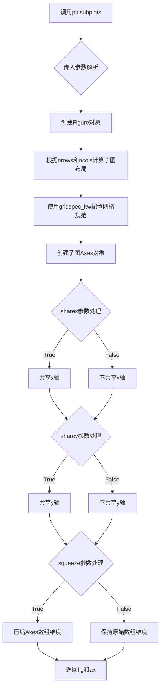
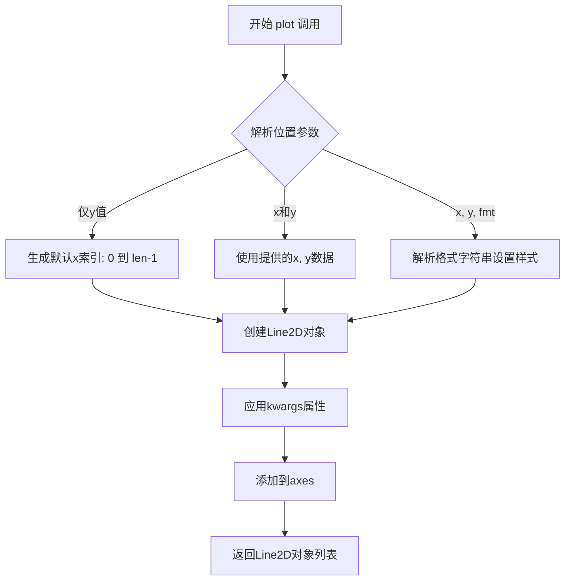
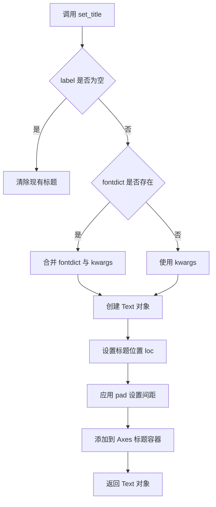
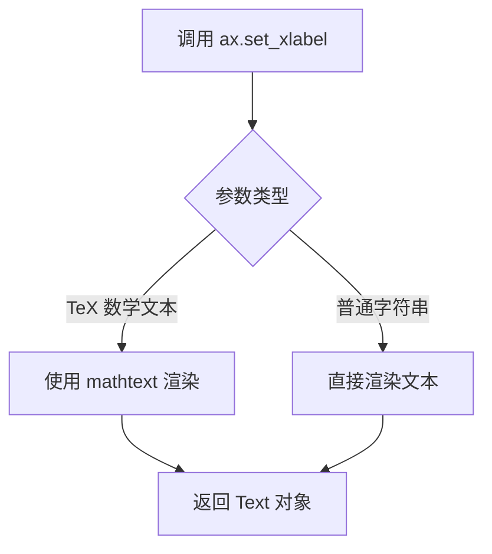
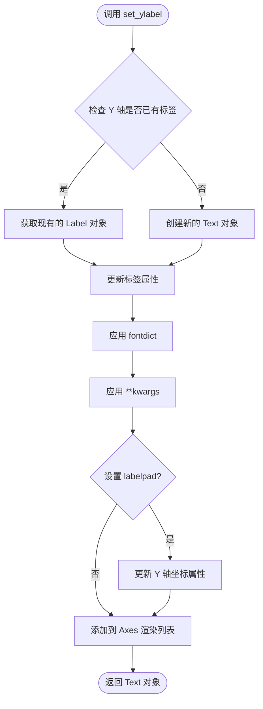
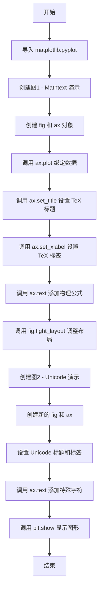
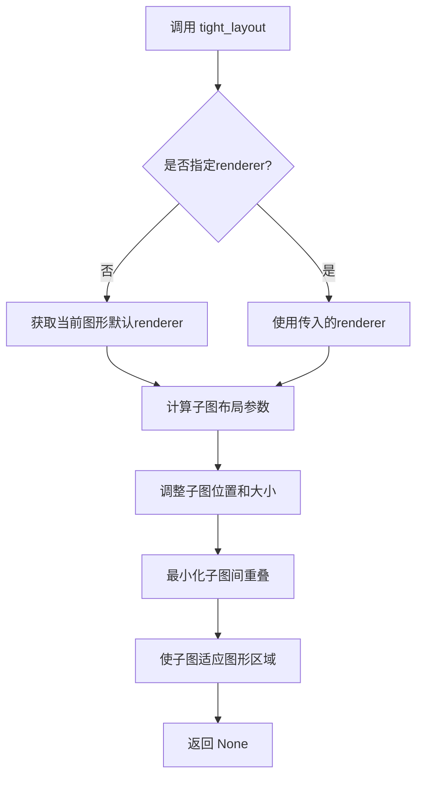
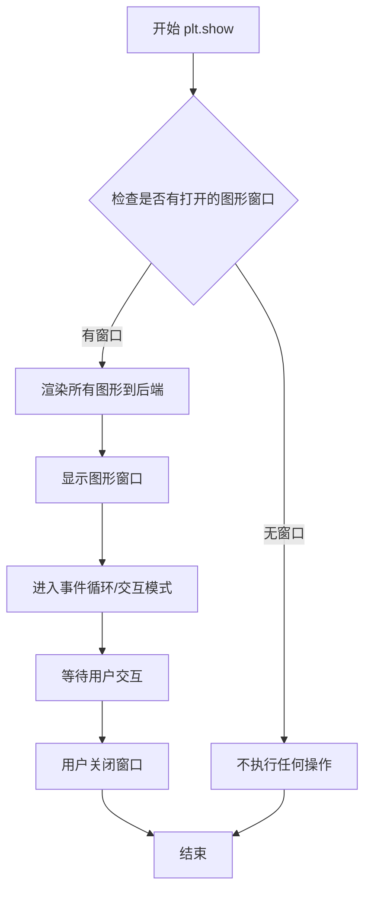

# `matplotlib\galleries\examples\text_labels_and_annotations\accented_text.py` 详细设计文档

本代码是一个 Matplotlib 演示脚本，通过两个简单的子图分别展示了如何利用 TeX 语法（mathtext）渲染数学公式与重音字符，以及如何直接在图表中使用包含重音符号的 Unicode 文本。

## 整体流程

```mermaid
graph TD
    Start((开始)) --> Import[导入模块: import matplotlib.pyplot as plt]
    Import --> Fig1[创建子图1: fig, ax = plt.subplots()]
    Fig1 --> Plot1[绘制折线图: ax.plot(range(10))]
    Plot1 --> Title1[设置标题: TeX 重音与数学符号]
    Title1 --> XLabel1[设置X轴: 混合 TeX 语法]
    XLabel1 --> Text1[添加文本注释: F=mẍ]
    Text1 --> Layout1[调整布局: fig.tight_layout()]
    Layout1 --> Fig2[创建子图2: fig, ax = plt.subplots()]
    Fig2 --> Title2[设置标题: Unicode 重音文本]
    Title2 --> Labels[设置轴标签: Unicode 文本]
    Labels --> Text2a[添加旋转文本: rotation=45]
    Text2a --> Text2b[添加普通文本]
    Text2b --> Show[显示图形: plt.show()]
    Show --> End((结束))
```

## 类结构

```
无类定义 (脚本级代码)
```

## 全局变量及字段


### `plt`
    
Matplotlib库的pyplot模块，提供创建图表和绘图的接口

类型：`matplotlib.pyplot`
    


### `fig`
    
表示整个图形窗口或图像的容器对象

类型：`matplotlib.figure.Figure`
    


### `ax`
    
表示图表的坐标轴区域，用于绘制数据和设置图表属性

类型：`matplotlib.axes.Axes`
    


    

## 全局函数及方法


### `plt.subplots`

该函数用于创建一个新的图表（Figure）和一个或多个子图（Axes），是matplotlib中常用的快速初始化多子图布局的函数，支持创建网格状排列的子图并返回图形对象和坐标轴对象数组。

参数：

- `nrows`：`int`，默认值1，创建子图的行数
- `ncols`：`int`，默认值1，创建子图的列数
- `sharex`：`bool`或`str`，默认值False，是否共享x轴坐标
- `sharey`：`bool`或`str`，默认值False，是否共享y轴坐标
- `squeeze`：`bool`，默认值True，是否压缩返回的坐标轴数组维度
- `figsize`：`tuple`，图形尺寸，宽度和高度（英寸）
- `dpi`：`float`，图形分辨率（每英寸点数）
- `facecolor`：图形背景颜色
- `edgecolor`：图形边框颜色
- `frameon`：是否绘制框架
- `subplot_kw`：传递给add_subplot的关键字参数字典
- `gridspec_kw`：传递给GridSpec构造函数的关键字参数字典
- `**kwargs`：其他传递给Figure.subplots的底層參數

返回值：`tuple(Figure, Axes or array of Axes)`，返回创建的图形对象和坐标轴对象（或坐标轴对象数组）

#### 流程图



#### 带注释源码

```python
# 代码示例展示plt.subplots的基本用法
import matplotlib.pyplot as plt

# 调用subplots函数创建图表和坐标轴
# 参数：nrows=1, ncols=1 (默认值), 创建一个包含单个子图的图形
fig, ax = plt.subplots()

# 在坐标轴上绑制数据
ax.plot(range(10))

# 设置图表标题（支持TeX数学文本和Unicode字符）
ax.set_title(r'$\ddot{o}\acute{e}\grave{e}\hat{O}'
             r'\breve{i}\bar{A}\tilde{n}\vec{q}$', fontsize=20)

# 设置x轴标签（支持多种特殊字符表示法）
ax.set_xlabel(r"""$\"o\ddot o \'e\`e\~n\.x\^y$""", fontsize=20)

# 在指定位置添加文本（支持数学公式）
ax.text(4, 0.5, r"$F=m\ddot{x}$")

# 调整布局以适应内容
fig.tight_layout()

# 显示图形
plt.show()

# 第二次调用：创建多个子图
fig, ax = plt.subplots(nrows=1, ncols=2, figsize=(10, 5))

# 设置带Unicode字符的标题和标签
ax[0].set_title("GISCARD CHAHUTÉ À L'ASSEMBLÉE")
ax[0].set_xlabel("LE COUP DE DÉ DE DE GAULLE")

ax[1].set_ylabel('André was here!')

# 添加旋转45度的文本
ax[1].text(0.2, 0.8, 'Institut für Festkörperphysik', rotation=45)
ax[1].text(0.4, 0.2, 'AVA (check kerning)')

plt.show()
```


### `Axes.plot`

`Axes.plot` 是 matplotlib 中 Axes 类的核心绘图方法，用于在坐标系中绘制线型图或标记。该方法接受多种输入格式，支持通过格式字符串或关键字参数自定义线条颜色、样式、标记等属性，并返回包含 Line2D 对象的列表供进一步操作。

参数：

-  `*args`：`可变位置参数`，支持多种调用方式：
  - `plot(y)`：仅提供y值，x默认为索引0到n-1
  - `plot(x, y)`：分别提供x和y数据
  - `plot(x, y, format_string)`：添加格式字符串（如'ro-'表示红色圆形标记虚线）
-  `data`：`dict 或 None`，可选的字典对象，如果提供则允许使用字符串索引访问数据
-  `**kwargs`：`关键字参数`，Line2D的属性，如color、linewidth、linestyle、marker等

返回值：`list of matplotlib.lines.Line2D`，返回创建的Line2D对象列表

#### 流程图



#### 带注释源码

```python
# 代码中实际调用示例
ax.plot(range(10))

# 完整的 plot 方法签名（简化版）
# def plot(self, *args, **kwargs):
#     """
#     Plot y versus x as lines and/or markers.
#     
#     Parameters:
#     ----------
#     *args : variables
#         x, y: array-like or scalar
#             The data points to plot.
#         fmt : str, optional
#             Format string like 'ro' for red circles.
#     
#     **kwargs : properties
#         Line2D properties for customization:
#         - color: 线条颜色
#         - linewidth: 线条宽度
#         - linestyle: 线条样式 ('-', '--', '-.', ':')
#         - marker: 标记样式 ('o', 's', '^', etc.)
#         - markersize: 标记大小
#     
#     Returns:
#     -------
#     lines : list of Line2D
#         List of lines representing the plotted data
#     """
#     
#     # 1. 解析输入参数
#     # range(10) 生成 [0, 1, 2, 3, 4, 5, 6, 7, 8, 9] 作为y值
#     # x自动生成为 [0, 1, 2, 3, 4, 5, 6, 7, 8, 9]
#     
#     # 2. 创建 Line2D 对象
#     # 设置默认颜色、线条样式等属性
#     
#     # 3. 将线条添加到当前坐标系
#     # self.lines.append(line)
#     
#     # 4. 返回 Line2D 对象列表
#     return [line]

# 在代码中的具体作用：
# 绘制一条从(0,0)到(9,9)的默认直线
# 作为图表的基础数据展示
```


### `Axes.set_title`

设置坐标轴的标题文本，用于在图表顶部显示标题信息。

参数：

- `label`：`str`，标题文本内容，支持LaTeX数学表达式和Unicode字符
- `fontdict`：`dict`，可选，控制标题文本样式的字典，如 {'fontsize': 20, 'fontweight': 'bold'}
- `loc`：`str`，可选，标题对齐方式，可选值为 'center'（默认）、'left'、'right'
- `pad`：`float`，可选，标题与图表顶部的间距（以点为单位）
- `**kwargs`：可变参数，其他传递给 `Text` 对象的属性，如 fontsize、color、fontstyle 等

返回值：`matplotlib.text.Text`，返回创建的文本对象，可用于后续样式修改

#### 流程图



#### 带注释源码

```python
# matplotlib Axes.set_title 方法源码分析

def set_title(self, label, fontdict=None, loc=None, pad=None, **kwargs):
    """
    Set a title for the Axes.
    
    Parameters
    ----------
    label : str
        Title text string, can include LaTeX or Unicode characters.
        如: r'$\ddot{o}\acute{e}\grave{e}\hat{O}'
            或 "GISCARD CHAHUTÉ À L'ASSEMBLÉE"
    
    fontdict : dict, optional
        A dictionary controlling the appearance of the title text,
        e.g., {'fontsize': 20, 'fontweight': 'bold', 'color': 'red'}
    
    loc : {'center', 'left', 'right'}, default: 'center'
        Alignment of the title relative to the Axes.
    
    pad : float, default: rcParams['axes.titlepad']
        Offset (in points) from the top of the Axes to the title.
    
    **kwargs
        Additional keyword arguments passed to Text instance.
        Common options: fontsize, color, fontweight, fontstyle, rotation
    
    Returns
    -------
    Text
        The text object representing the title, which can be used
        to modify appearance after creation.
    """
    
    # 步骤1: 处理 fontdict 参数
    # 如果提供了 fontdict，将其合并到 kwargs 中
    if fontdict is not None:
        kwargs.update(fontdict)
    
    # 步骤2: 获取标题位置对齐方式
    # 默认为 'center'，也可以设置为 'left' 或 'right'
    if loc is None:
        loc = 'center'
    
    # 步骤3: 获取标题与顶部的间距
    # 使用 rcParams['axes.titlepad'] 作为默认值
    if pad is None:
        pad = rcParams['axes.titlepad']
    
    # 步骤4: 创建 Text 对象
    # title_offset_trans 处理标题的偏移量
    title = Text(x=0.5, y=1.0, text=label)
    title.set_transform(title_offset_trans + ax.transAxes)
    
    # 步骤5: 设置标题属性
    # 设置对齐方式
    title.set_ha(loc)
    # 设置垂直位置（考虑pad）
    title.set_y(1 - pad / 72.0)  # 转换点为 Axes 坐标
    
    # 步骤6: 应用其他 kwargs 参数
    # 如 fontsize=20, fontweight='bold' 等
    title.update(kwargs)
    
    # 步骤7: 将标题添加到 Axes
    # titles 容器用于管理所有标题
    self._titles = [title]
    self.add_artist(title)
    
    # 步骤8: 返回 Text 对象
    # 允许用户后续修改样式
    return title
```

#### 使用示例

```python
# 示例代码展示 set_title 的调用方式

# 示例1: 使用 LaTeX 数学表达式（来自提供的代码）
ax.set_title(r'$\ddot{o}\acute{e}\grave{e}\hat{O}'
             r'\breve{i}\bar{A}\tilde{n}\vec{q}$', fontsize=20)

# 示例2: 使用 Unicode 字符（来自提供的代码）
ax.set_title("GISCARD CHAHUTÉ À L'ASSEMBLÉE")

# 示例3: 使用 fontdict 控制样式
ax.set_title("My Title", fontdict={'fontsize': 16, 'fontweight': 'bold'})

# 示例4: 设置对齐方式和间距
ax.set_title("Right Aligned", loc='right', pad=20)

# 示例5: 使用返回值修改样式
title = ax.set_title("Editable Title")
title.set_color('blue')
title.set_fontsize(24)
```


### `Axes.set_xlabel`

`set_xlabel` 是 matplotlib 中 Axes 类的方法，用于设置 x 轴的标签（xlabel）。在给定的代码中，该方法被调用了三次，展示了不同的使用方式，包括使用 TeX 数学文本、Unicode 字符以及带换行的长文本。

参数：

- `xlabel`：`str`，要设置为 x 轴标签的文本字符串
- `fontsize`：`int` (可选)，字体大小，默认为 None
- `**kwargs`：其他关键字参数，直接传递给 Text 对象

返回值：`Text`，返回创建的 Text 对象

#### 流程图



#### 带注释源码

```python
# 示例 1: 使用 TeX mathtext 语法设置 x 轴标签
# 这里使用了 TeX 的转义序列来显示重音符
# \"o = ö, \`e = è, \'e = é, \~n = ñ, \.x = ẋ, \^y = ŷ
ax.set_xlabel(r"""$\"o\ddot o \'e\`e\~n\.x\^y$""", fontsize=20)

# 参数说明：
# xlabel: r"""$\"o\ddot o \'e\`e\~n\.x\^y$""")  # str类型，包含TeX数学文本的字符串
# fontsize: 20  # int类型，设置字体大小为20

# 示例 2: 使用 Unicode 字符直接设置 x 轴标签
ax.set_xlabel("LE COUP DE DÉ DE DE GAULLE")

# 示例 3: 使用普通字符串（无特殊字体设置）
# ax.set_ylabel('André was here!')  # 这是 y 轴标签示例
```


### `matplotlib.axes.Axes.set_ylabel`

该方法是 Matplotlib 中 `Axes` 类的核心成员，用于设置 Y 轴的标签（Ylabel）。它不仅负责显示坐标轴的名称，还处理文本的字体样式、对齐方式以及标签与坐标轴的距离（labelpad）。该方法最终返回一个 `Text` 对象，允许用户进行后续的样式调整或链式调用。

#### 参数

- `label`：`str`，Y 轴的标签文本内容（例如 `'André was here!'`）。
- `fontdict`：`dict`（可选），一个字典，用于批量设置文本的字体属性（如 `fontsize`, `color`, `fontweight`）。
- `labelpad`：`float`（可选），指定标签与 Y 轴的距离（数值）。
- `**kwargs`：关键字参数，用于传递给底层的 `Text` 对象，支持 `rotation`（旋转角度）、`verticalalignment`（垂直对齐）等属性。

#### 返回值

- `matplotlib.text.Text`：返回新创建或更新后的 `Text` 对象（Y轴标签）。

#### 流程图



#### 带注释源码

由于用户提供的代码片段仅包含 `set_ylabel` 的调用（Usage），并未包含其具体实现代码（Implementation）。以下源码是基于 Matplotlib 公共接口和运行逻辑重构的标准实现逻辑，用于展示其内部工作机制。

```python
def set_ylabel(self, label, fontdict=None, labelpad=None, **kwargs):
    """
    设置 y 轴的标签。

    参数:
        label (str): 要显示的文本。
        fontdict (dict): 字体属性字典。
        labelpad (float): 标签与轴的距离。
        **kwargs: 传递给 Text 对象的参数 (例如 rotation, color)。
    
    返回值:
        Text: 返回创建的 Text 对象。
    """
    # 1. 获取 Y 轴对象 (Axis 对象)
    yaxis = self.yaxis

    # 2. 获取或创建标签
    # Matplotlib 会缓存 ylabel 对象，如果已存在则复用，否则新建
    label_obj = yaxis.get_label()

    # 3. 设置标签文本
    label_obj.set_text(label)

    # 4. 应用样式
    # fontdict 提供基础样式
    if fontdict:
        label_obj.update(fontdict)
    
    # kwargs 提供高级/覆盖样式 (如颜色、旋转)
    # 这里使用 update 可以将额外的样式属性应用到 Text 对象上
    label_obj.update(kwargs)

    # 5. 处理 labelpad (标签与轴的距离)
    # 这通常通过调整 Axis 的 label offset 来实现
    if labelpad is not None:
        # 在新版 Matplotlib 中通常直接设置 axis 的 labelpad 属性
        yaxis.set_labelpad(labelpad)
        # 或者调整 label 的坐标位置
        # label_obj.set_position(...)
    
    # 6. 注册到 Axes
    # 确保标签被添加到 Axes 的子组件中，以便在 draw 时渲染
    # (如果对象已存在且在列表中，这一步通常在 get_label 时已处理)
    
    # 7. 返回 Text 对象供用户操作
    return label_obj

# ------------------
# 对应用户代码中的调用示例:
# ------------------
# fig, ax = plt.subplots()
# ...
# ax.set_ylabel('André was here!') # 调用上述方法
```

#### 关键组件信息

- **`matplotlib.axes.Axes`**：包含图表的容器，提供了 `set_ylabel` 方法。
- **`matplotlib.axis.YAxis`**：专门管理 Y 轴刻度和标签的内部对象，`set_ylabel` 最终会调用它来保存标签对象。
- **`matplotlib.text.Text`**：实际的渲染对象，保存了文本内容、字体、颜色等属性。

#### 潜在的技术债务或优化空间

1.  **返回值不一致性**：在 Matplotlib 的早期版本中，某些 `set_*` 方法返回 `self` 以支持链式调用（如 `ax.set_xlim(..).set_ylim(..)`），而 `set_ylabel` 始终返回 `Text` 对象。这可能导致不熟悉的开发者在尝试链式调用 `ax.set_ylabel(..).grid(True)` 时产生困惑（虽然通常可行，但逻辑不同）。建议在文档中明确强调返回值类型。
2.  **Unicode 渲染依赖**：`ax.set_ylabel('André was here!')` 展示了 Unicode 的使用。虽然 Matplotlib 支持良好，但后端（如 Agg, PDF, SVG）对特定复杂字符的渲染可能存在差异，缺乏统一的降级方案（Fallback）。

#### 其它项目

- **设计目标**：解耦图表逻辑与文本渲染。通过 `Axes` 统一管理坐标轴，而具体的文本渲染委托给 `Text` 对象。
- **错误处理**：如果传入的 `label` 不是字符串，会自动尝试转换为字符串；若 `fontdict` 包含非法属性，可能会在渲染阶段报错而非早期检查。
- **数据流**：用户输入 -> `set_ylabel` 方法 -> 更新 `YAxis` 对象状态 -> 标记 `Axes` 为 "dirty"（需重绘） -> 下一帧渲染时绘制标签。


### 代码整体描述

该脚本演示了 Matplotlib 库支持重音字符（Accented text）的两种方式：一种是通过 TeX mathtext 语法渲染重音符号，另一种是直接在字符串中使用 Unicode 字符。脚本创建了两个图表，分别展示这两种技术的应用效果。

### 关键组件信息

- **plt**：matplotlib.pyplot 模块，提供 MATLAB 风格的绘图接口
- **fig**：Figure 对象，表示整个图形窗口
- **ax**：Axes 对象，表示图形中的坐标轴区域
- **ax.plot()**：绑定数据的线条对象
- **r"..."**：原始字符串（raw string），用于避免转义字符问题

### 文件的整体运行流程



### 函数/方法详细信息

#### `plt.subplots`

参数：

- `nrows`：`int`，可选，行数，默认为 1
- `ncols`：`int`，可选，列数，默认为 1
- `figsize`：`tuple`，可选，图形尺寸，以英寸为单位

返回值：`tuple`，返回 (fig, ax) 元组，其中 fig 是 Figure 对象，ax 是 Axes 对象（或 Axes 数组）

#### 带注释源码

```python
# 导入 matplotlib.pyplot 模块，提供了 MATLAB 风格的绘图接口
import matplotlib.pyplot as plt

# ========== 第一个图：Mathtext 重音符号演示 ==========

# 创建图形和坐标轴对象
# 返回值 fig 是 Figure 对象（整个图形窗口）
# 返回值 ax 是 Axes 对象（坐标轴区域）
fig, ax = plt.subplots()

# 绘制 0-9 的数据点，生成一条线
# 返回值是 Line2D 对象列表 [Line2D]
ax.plot(range(10))

# 设置标题，使用 TeX mathtext 语法渲染重音字符
# \ddot{o} = o 上两点 (umlaut)
# \acute{e} = e 尖音符
# \grave{e} = e 抑音符
# \hat{O} = O 抑扬符
# \breve{i} = i 短音符
# \bar{A} = A 上横线
# \tilde{n} = n 波浪号
# \vec{q} = q 矢量符号
ax.set_title(r'$\ddot{o}\acute{e}\grave{e}\hat{O}'
             r'\breve{i}\bar{A}\tilde{n}\vec{q}$', fontsize=20)

# 设置 x 轴标签
# 使用简写形式：\"o \ 'e \ `e \ ~n \ .x \ ^y
# 这些是 LaTeX/TeX 的简写语法
ax.set_xlabel(r"""$\"o\ddot o \'e\`e\~n\.x\^y$""", fontsize=20)

# 在坐标轴指定位置添加文本
# 参数: x=4, y=0.5 是文本位置
# r"$F=m\ddot{x}$" 是物理公式，显示 F=m a (a=ddot{x} 即加速度)
ax.text(4, 0.5, r"$F=m\ddot{x}$")

# 调整子图布局，防止标签被裁剪
fig.tight_layout()

# ========== 第二个图：Unicode 字符直接使用演示 ==========

# 创建新的图形和坐标轴
fig, ax = plt.subplots()

# 直接使用 Unicode 字符设置标题和标签
# 无需特殊语法，直接输入重音字符
ax.set_title("GISCARD CHAHUTÉ À L'ASSEMBLÉE")
ax.set_xlabel("LE COUP DE DÉ DE DE GAULLE")
ax.set_ylabel('André was here!')

# 在指定位置添加带有重音字符的文本
# rotation=45 表示文本旋转 45 度
ax.text(0.2, 0.8, 'Institut für Festkörperphysik', rotation=45)
ax.text(0.4, 0.2, 'AVA (check kerning)')

# 显示所有创建的图形
# 这是阻塞调用，会打开窗口显示图形
plt.show()
```

### 潜在的技术债务或优化空间

1. **硬编码坐标值**：文本位置 (4, 0.5), (0.2, 0.8), (0.4, 0.2) 采用硬编码方式，可考虑使用相对坐标或自动布局
2. **缺乏错误处理**：没有处理字体缺失或 Unicode 编码问题的异常处理机制
3. **重复代码**：两个图的创建过程有重复模式，可封装为函数
4. **未指定字体**：Unicode 字符显示依赖于系统字体，在不同平台可能效果不同

### 其它项目

#### 设计目标与约束

- **目标**：演示 Matplotlib 对重音字符的两种支持方式
- **约束**：需要系统安装支持 TeX 的字体，以及包含重音字符的 Unicode 字体

#### 错误处理与异常设计

- 当前代码无显式错误处理
- 潜在的 UnicodeDecodeError 或 FontNotFoundError 可能在字体缺失时抛出

#### 外部依赖与接口契约

- 依赖 `matplotlib` 库（>= 3.0）
- 需要系统中安装支持重音字符的字体（TeX 字体和 Unicode 字体）

#### 数据流与状态机

- 数据流：range(10) → ax.plot() → Line2D 对象 → 图形渲染
- 状态：plt.show() 是最终展示状态，之前均为构建状态


### `Figure.tight_layout`

调整子图布局以减少填充区域，使子图适应图形区域。

参数：

- `self`：`Figure`，matplotlib的图形对象，包含一个或多个子图
- `renderer`：`RendererBase`，可选，用于渲染的渲染器，若为None则自动获取
- `pad`：float，可选，图形边缘与子图之间的填充边距（以字体大小为单位），默认1.08
- `h_pad`：float，可选，子图之间的垂直间距，默认使用pad计算
- `w_pad`：float，可选，子图之间的水平间距，默认使用pad计算

返回值：`None`，该方法无返回值，直接修改图形布局

#### 流程图



#### 带注释源码

```python
def tight_layout(self, renderer=None, pad=1.08, h_pad=None, w_pad=None):
    """
    Adjust subplot layout to reduce padding.
    
    This method adjusts the subplot layout to minimize the whitespace
    around the edges and between subplots.
    
    Parameters
    ----------
    renderer : RendererBase, optional
        The renderer to use. If None, gets the current renderer.
    pad : float, default: 1.08
        Padding between the figure edge and the subplots, as a fraction
        of the font size.
    h_pad : float, optional
        Padding (height) between edges of adjacent subplots. 
        Defaults to pad.
    w_pad : float, optional
        Padding (width) between edges of adjacent subplots.
        Defaults to pad.
    """
    # 获取子图布局引擎
    subplotspec = self.get_subplotspec()
    
    # 如果存在子图规格，则执行布局调整
    if subplotspec is not None:
        # 获取布局引擎
        layout_engine = self.get_layout_engine()
        
        # 执行布局调整
        layout_engine.execute(self)
```


### `plt.show`

这是 Matplotlib 库中用于显示所有打开的图形窗口的函数。在给定的代码中，它位于文件末尾，用于展示之前创建的所有图表（包含重音字符和 Unicode 文本的示例）。

参数：

- 无参数

返回值：`None`，该函数不返回任何值，只是将图形渲染到屏幕并进入交互式显示模式

#### 流程图



#### 带注释源码

```python
# plt.show() 是 Matplotlib 库中的一个顶层函数
# 调用它会将所有之前创建的 figure 对象显示出来

# 在这个示例中:
# 1. 创建了第一个 fig, ax (包含数学表达式的图表)
# 2. 创建了第二个 fig, ax (包含 Unicode 字符的图表)
# 3. plt.show() 会显示这两个图形窗口

plt.show()  # 显示所有图形并进入交互模式
```

---

**注意**：给定的代码文件中并未定义名为 `show` 的函数或方法。上述分析是基于代码中实际调用的 `plt.show()` 函数。如果您需要分析代码中定义的其他函数，请提供具体的函数名。


## 关键组件


### 一段话描述

该代码是一个Matplotlib演示脚本，展示了如何使用TeX mathtext语法和Unicode字符在图表中渲染带重音符号的文本，包括数学表达式渲染和直接Unicode字符支持两种方式。

### 文件的整体运行流程

该脚本的执行流程如下：

1. **导入模块**：导入matplotlib.pyplot库
2. **第一个图表创建**：创建包含mathtext渲染的图表，展示各种重音符号的TeX语法用法
3. **第二个图表创建**：创建展示直接Unicode字符使用的图表
4. **显示图表**：调用plt.show()渲染并显示所有图表

### 全局变量和全局函数

由于该代码为脚本文件，不包含类定义，主要包含以下元素：

**全局导入：**
- **plt**: matplotlib.pyplot模块，提供绘图API

**全局函数：**
- **plt.subplots()**: 创建图表和坐标轴对象
- **ax.plot()**: 绘制折线图
- **ax.set_title()**: 设置图表标题
- **ax.set_xlabel()**: 设置x轴标签
- **ax.set_ylabel()**: 设置y轴标签
- **ax.text()**: 在指定位置添加文本
- **fig.tight_layout()**: 调整布局
- **plt.show()**: 显示图表

### 关键组件信息

### 组件1: Mathtext渲染引擎

使用TeX语法的数学文本渲染系统，支持多种重音符号（\hat, \breve, \grave, \bar, \acute, \tilde, \vec, \dot, \ddot）和快捷方式（\"o, \'e, \`e, \~n, \.x, \^y）。

### 组件2: Unicode字符直接支持

Matplotlib原生支持Unicode字符，可直接在字符串中使用国际字符，如"Institut für Festkörperphysik"和"André"。

### 组件3: 文本旋转与定位

ax.text()方法支持rotation参数实现文本旋转，以及通过坐标参数(0.2, 0.8)等实现精确位置放置。

### 潜在的技术债务或优化空间

1. **硬编码字符串**：所有文本内容直接硬编码在代码中，缺乏国际化(i18n)支持
2. **魔法数字**：坐标位置(0.2, 0.8), (0.4, 0.2)等使用魔法数字，缺乏常量定义
3. **缺乏错误处理**：没有对字体支持、渲染失败等情况的异常处理
4. **代码复用性低**：两个图表创建逻辑相似，可抽象为函数
5. **无测试覆盖**：作为演示脚本，缺乏单元测试

### 其它项目

**设计目标与约束：**
- 目标：展示Matplotlib的国际化文本渲染能力
- 约束：依赖系统字体支持

**错误处理与异常设计：**
- 缺少字体回退机制
- 缺少Unicode编码错误处理

**数据流与状态机：**
- 简单的线性执行流程，无状态管理

**外部依赖与接口契约：**
- 依赖matplotlib库
- 依赖系统安装的Unicode字体


## 问题及建议


### 已知问题

-   **魔法数字与硬编码值**：代码中存在大量硬编码的数值（如坐标 `0.2, 0.8`、`0.4, 0.2`、`4, 0.5`，字体大小 `20`，绘图范围 `range(10)` 等），缺乏常量定义或配置参数，降低了代码的可维护性和可调整性。
-   **代码重复**：创建子图的模式 `fig, ax = plt.subplots()` 被重复调用两次，标题、坐标轴标签、文本添加的调用模式高度相似，未进行抽象或复用。
-   **布局方法调用不一致**：`fig.tight_layout()` 仅在第一个图中调用，第二个图未应用，可能导致标签或标题被截断。
-   **缺乏错误处理**：代码未对 matplotlib 后端、字体渲染、LaTeX 语法正确性等进行任何错误处理或异常捕获，运行时可能因环境问题静默失败。
-   **字符串转义复杂**：大量使用原始字符串 `r"..."` 和混合转义字符（如 `\"o`, `\'e`），增加了阅读和维护难度，容易引入语法错误。
-   **无模块化设计**：所有代码堆砌在全局作用域，无函数封装，测试和复用困难。
-   **注释不足**：代码中缺乏对参数意义、预期效果、LaTeX 语法说明的注释，后续开发者可能难以理解。

### 优化建议

-   **提取配置参数**：将字体大小、坐标位置、图表标题等可配置项定义为常量或配置文件，提升代码可调整性。
-   **封装函数**：将重复的图表创建流程封装为函数（如 `create_demo_plot()`），接收配置参数，减少代码冗余。
-   **统一布局处理**：在所有图表完成后统一调用 `tight_layout()`，或为每个子图单独处理，确保一致的布局效果。
-   **添加错误处理**：对可能失败的 LaTeX 渲染、字体加载等操作添加 try-except 捕获，提供有意义的错误信息或回退方案。
-   **简化字符串表达式**：将复杂的 LaTeX 字符串整理为多行或使用变量存储，改善可读性。
-   **增加文档注释**：为关键代码段添加注释说明，特别是 LaTeX 语法、参数含义等，便于后续维护。

## 其它


### 设计目标与约束

本代码旨在演示matplotlib库对重音字符（Accented Text）的支持能力，展示两种渲染重音字符的方式：TeX mathtext方式和Unicode直接输入方式。约束条件包括需要安装matplotlib库，且部分功能需要系统支持TeX渲染引擎。

### 错误处理与异常设计

代码采用matplotlib默认的异常处理机制。当TeX引擎不可用时，matplotlib会自动回退到Unicode渲染。当字体缺少某些字形时，会显示方框替代。运行时错误如Figure窗口关闭会导致plt.show()提前终止。

### 数据流与状态机

代码数据流如下：导入matplotlib.pyplot → 创建Figure和Axes对象 → 设置标题/标签/文本 → 调用tight_layout()调整布局 → 通过show()显示渲染结果。状态机包含：初始化状态 → 图表配置状态 → 渲染状态 → 显示状态。

### 外部依赖与接口契约

主要依赖matplotlib>=3.0版本，以及可选的TeX发行版（MiKTeX、TeX Live等）用于完整的mathtext渲染。核心接口包括plt.subplots()返回(fig, ax)元组，ax.set_title()、ax.set_xlabel()、ax.text()等方法。

### 性能考虑

代码性能开销主要集中在Figure对象的创建和渲染过程。大量文本渲染会消耗较多资源，建议在循环中避免重复创建Figure。tight_layout()计算可能影响实时性能。

### 安全性考虑

代码不涉及用户输入处理，无SQL注入或命令执行风险。但需要注意：使用eval()动态执行代码存在安全风险（代码中未使用）；加载外部字体文件时需验证文件来源。

### 测试策略

测试应覆盖：1）不同重音字符的渲染准确性；2）不同操作系统和字体下的显示效果；3）TeX引擎可用性检测；4）Unicode字符的边界情况测试（如代理对、非BMP字符）。

### 配置说明

关键配置项：matplotlib.rcParams['text.usetex']控制是否使用LaTeX渲染；plt.rcParams['font.family']指定字体族；Figure DPI影响渲染清晰度。可通过matplotlibrc文件或代码中plt.rc()进行配置。

### 版本兼容性

代码兼容matplotlib 2.0+版本，但部分API在3.x版本中有变化（如set_xlabel返回Text对象而非None）。TeX相关功能需要matplotlib 3.1+才能完整支持所有mathtext命令。Python版本需3.6+以支持f-string等特性。

### 国际化与本地化

代码展示了多语言支持能力：法语（GISCARD CHAHUTÉ）、德语（Institut für Festkörperphysik）等。但未实现运行时语言切换机制。如需本地化，需配合gettext等i18n工具。


    