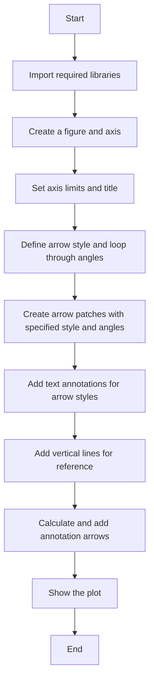
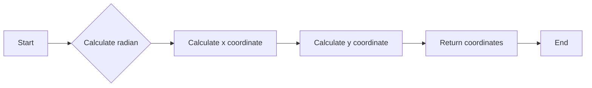
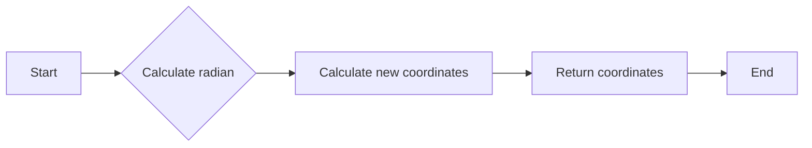

# `matplotlib\galleries\examples\text_labels_and_annotations\angles_on_bracket_arrows.py` 详细设计文档

This code generates a plot demonstrating how to add angle annotations to bracket arrows in matplotlib using FancyArrowPatch.

## 整体流程



## 类结构

```
FancyArrowPatch (matplotlib.patches)
├── get_point_of_rotated_vertical (function)
│   ├── origin (tuple)
│   ├── line_length (float)
│   ├── degrees (float)
│   └── Returns xy coordinates of the rotated vertical line end
└── main (function)
```

## 全局变量及字段


### `fig`
    
The main figure object for the plot.

类型：`matplotlib.figure.Figure`
    


### `ax`
    
The axes object where the plot is drawn.

类型：`matplotlib.axes._subplots.AxesSubplot`
    


### `style`
    
The style of the bracket arrow to be used.

类型：`str`
    


### `i`
    
The loop index used to iterate over angles.

类型：`int`
    


### `angle`
    
The angle to be used for the bracket arrow style.

类型：`int`
    


### `y`
    
The y-coordinate for the vertical line and the arrow centers.

类型：`float`
    


### `arrow_centers`
    
The center points of the bracket arrows.

类型：`tuple`
    


### `vlines`
    
The vertical line coordinates for annotation purposes.

类型：`tuple`
    


### `anglesAB`
    
The angles A and B for the bracket arrow style.

类型：`tuple`
    


### `bracketstyle`
    
The style string for the bracket arrow.

类型：`str`
    


### `bracket`
    
The bracket arrow patch object.

类型：`matplotlib.patches.FancyArrowPatch`
    


### `patch_tops`
    
The top coordinates of the patches at A and B.

类型：`list`
    


### `connection_dirs`
    
The connection directions for the annotation arrows.

类型：`tuple`
    


### `arrowstyle`
    
The style string for the annotation arrows.

类型：`str`
    


### `kw`
    
The keyword arguments for the arrow patches.

类型：`dict`
    


### `vline`
    
The vertical line coordinates for the annotation arrows.

类型：`tuple`
    


### `dir`
    
The direction of the connection for the annotation arrows.

类型：`int`
    


### `patch_top`
    
The top coordinates of the patch for the annotation arrows.

类型：`tuple`
    


### `angle`
    
The angle for the annotation text.

类型：`int`
    


### `kw`
    
The keyword arguments for the text annotations.

类型：`dict`
    


### `ax`
    
The axes object where the text annotations are drawn.

类型：`matplotlib.axes._subplots.AxesSubplot`
    


### `text`
    
The text annotation object for the angle degrees.

类型：`matplotlib.text.Text`
    


### `vline`
    
The vertical line coordinates for the text annotations.

类型：`tuple`
    


### `dir`
    
The direction of the connection for the text annotations.

类型：`int`
    


### `patch_top`
    
The top coordinates of the patch for the text annotations.

类型：`tuple`
    


### `angle`
    
The angle for the text annotation text.

类型：`int`
    


### `kw`
    
The keyword arguments for the text annotations.

类型：`dict`
    


### `matplotlib.patches.FancyArrowPatch.FancyArrowPatch`
    
A patch that draws an arrow with a given style.

类型：`matplotlib.patches.FancyArrowPatch`
    


### `matplotlib.patches.ArrowStyle.ArrowStyle`
    
A class that represents the style of an arrow.

类型：`matplotlib.patches.ArrowStyle`
    
    

## 全局函数及方法


### get_point_of_rotated_vertical

Return xy coordinates of the vertical line end rotated by degrees.

参数：

- `origin`：`list`，The original (x, y) coordinates of the vertical line.
- `line_length`：`float`，The length of the vertical line.
- `degrees`：`float`，The degrees to rotate the line.

返回值：`list`，The xy coordinates of the rotated vertical line end.

#### 流程图



#### 带注释源码

```python
def get_point_of_rotated_vertical(origin, line_length, degrees):
    """Return xy coordinates of the vertical line end rotated by degrees."""
    rad = np.deg2rad(-degrees)
    return [origin[0] + line_length * np.sin(rad),
            origin[1] + line_length * np.cos(rad)]
```


### get_point_of_rotated_vertical

Return xy coordinates of the vertical line end rotated by degrees.

参数：

- `origin`：`list`，The original coordinates of the vertical line start.
- `line_length`：`float`，The length of the vertical line.
- `degrees`：`float`，The degrees to rotate the line.

返回值：`list`，The xy coordinates of the rotated vertical line end.

#### 流程图

```mermaid
graph LR
A[Start] --> B{Calculate radian}
B --> C{Add sin(rad) to origin[0]}
B --> D{Add cos(rad) to origin[1]}
C --> E[Return coordinates]
D --> E
```

#### 带注释源码

```python
def get_point_of_rotated_vertical(origin, line_length, degrees):
    """Return xy coordinates of the vertical line end rotated by degrees."""
    rad = np.deg2rad(-degrees)
    return [origin[0] + line_length * np.sin(rad),
            origin[1] + line_length * np.cos(rad)]
```


### get_point_of_rotated_vertical

Return xy coordinates of the vertical line end rotated by degrees.

参数：

- `origin`：`list`，The original (x, y) coordinates of the vertical line.
- `line_length`：`float`，The length of the vertical line.
- `degrees`：`float`，The degrees to rotate the line.

返回值：`list`，The new (x, y) coordinates of the vertical line end after rotation.

#### 流程图



#### 带注释源码

```python
def get_point_of_rotated_vertical(origin, line_length, degrees):
    """Return xy coordinates of the vertical line end rotated by degrees."""
    rad = np.deg2rad(-degrees)
    return [origin[0] + line_length * np.sin(rad),
            origin[1] + line_length * np.cos(rad)]
```


### get_point_of_rotated_vertical

Return xy coordinates of the vertical line end rotated by degrees.

参数：

- `origin`：`list`，The original (x, y) coordinates of the vertical line.
- `line_length`：`float`，The length of the vertical line.
- `degrees`：`float`，The degrees to rotate the line.

返回值：`list`，The new (x, y) coordinates of the vertical line end after rotation.

#### 流程图


#### 带注释源码

```python
def get_point_of_rotated_vertical(origin, line_length, degrees):
    """Return xy coordinates of the vertical line end rotated by degrees."""
    rad = np.deg2rad(-degrees)
    return [origin[0] + line_length * np.sin(rad),
            origin[1] + line_length * np.cos(rad)]
```


## 关键组件


### 张量索引与惰性加载

张量索引与惰性加载是用于在计算过程中延迟计算，直到实际需要结果时才进行计算，从而提高效率。

### 反量化支持

反量化支持是指代码能够处理和操作非精确数值，如浮点数，以适应不同的数值精度需求。

### 量化策略

量化策略是指将高精度数值转换为低精度数值的过程，以减少计算资源消耗和提高计算速度。


## 问题及建议


### 已知问题

-   **代码重复性**：`get_point_of_rotated_vertical` 函数被重复调用，可以考虑将其封装为类方法或全局函数以减少代码重复。
-   **注释不足**：代码中存在一些注释，但整体注释不够详细，难以理解代码的每个部分的功能和目的。
-   **全局变量**：`fig` 和 `ax` 是全局变量，这可能导致代码的可重用性和可测试性降低。

### 优化建议

-   **封装函数**：将 `get_point_of_rotated_vertical` 函数封装为类方法或全局函数，并在需要的地方调用它。
-   **增加注释**：在代码中增加详细的注释，解释每个函数、方法和代码块的目的和功能。
-   **使用类**：将绘图逻辑封装在一个类中，这样可以提高代码的可重用性和可测试性。
-   **异常处理**：添加异常处理来确保代码在遇到错误时能够优雅地处理。
-   **代码风格**：遵循PEP 8代码风格指南，以提高代码的可读性和一致性。


## 其它


### 设计目标与约束

- 设计目标：实现一个能够添加角度注释到括号箭头样式的工具，以便于在图表中清晰地展示箭头的方向和角度。
- 约束条件：使用matplotlib库中的FancyArrowPatch类来创建箭头，并利用numpy库进行数学计算。

### 错误处理与异常设计

- 错误处理：在代码中未发现明显的错误处理机制。建议在函数中添加异常处理，以确保在输入参数不合法时能够给出明确的错误信息。
- 异常设计：对于可能出现的异常，如numpy函数计算错误或matplotlib绘图错误，应设计相应的异常处理机制。

### 数据流与状态机

- 数据流：代码中的数据流主要涉及matplotlib的绘图操作和numpy的数学计算。
- 状态机：代码中没有明显的状态机设计，主要是一个线性执行流程。

### 外部依赖与接口契约

- 外部依赖：代码依赖于matplotlib和numpy库。
- 接口契约：matplotlib和numpy库提供了相应的接口，用于创建箭头和进行数学计算。


    