# `matplotlib\galleries\examples\text_labels_and_annotations\annotation_basic.py` 详细设计文档

This code generates a plot and annotates it with an arrow pointing to a specific coordinate on the plot.

## 整体流程

```mermaid
graph TD
    A[Start] --> B[Import matplotlib.pyplot and numpy]
    B --> C[Create a figure and an axes object]
    C --> D[Define the time array t and the corresponding sine function s]
    D --> E[Plot the function s on the axes object]
    E --> F[Annotate the plot with an arrow pointing to the coordinate (2, 1)]
    F --> G[Set the y-axis limits of the plot]
    G --> H[Display the plot]
    H --> I[End]
```

## 类结构

```
matplotlib.pyplot (全局模块)
├── fig (全局变量)
│   ├── ax (全局变量)
│   └── ...
└── np (全局模块)
    └── arange (全局函数)
```

## 全局变量及字段


### `fig`
    
The main figure object containing all the plot elements.

类型：`matplotlib.figure.Figure`
    


### `ax`
    
The axes object where the plot is drawn.

类型：`matplotlib.axes._subplots.AxesSubplot`
    


### `t`
    
The time values for the plot.

类型：`numpy.ndarray`
    


### `s`
    
The sine values corresponding to the time values.

类型：`numpy.ndarray`
    


### `line`
    
The line object representing the plot of the sine function.

类型：`matplotlib.lines.Line2D`
    


### `matplotlib.pyplot`
    
The matplotlib.pyplot module containing functions for plotting.

类型：`module`
    


### `numpy`
    
The numpy module containing functions for numerical operations.

类型：`module`
    


### `matplotlib.pyplot.fig`
    
The main figure object containing all the plot elements.

类型：`matplotlib.figure.Figure`
    


### `matplotlib.pyplot.ax`
    
The axes object where the plot is drawn.

类型：`matplotlib.axes._subplots.AxesSubplot`
    


### `numpy.arange`
    
A function to create an array of evenly spaced values.

类型：`numpy.ndarray`
    


### `numpy.cos`
    
A function to compute the cosine of each value in the input array.

类型：`numpy.ndarray`
    
    

## 全局函数及方法


### subplots

`subplots` 是一个全局函数，用于创建一个图形和一个轴（Axes）对象。

参数：

- `figsize`：`tuple`，图形的大小（宽度和高度），默认为 `(6, 6)`。
- `dpi`：`int`，图形的分辨率，默认为 `100`。
- `facecolor`：`color`，图形的背景颜色，默认为 `'white'`。
- `num`：`int`，轴的数量，默认为 `1`。
- `gridspec_kw`：`dict`，用于定义网格规格的字典。
- `constrained_layout`：`bool`，是否启用约束布局，默认为 `False`。

返回值：`fig`，图形对象；`ax`，轴对象。

#### 流程图

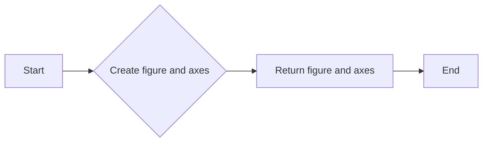

#### 带注释源码

```python
import matplotlib.pyplot as plt

fig, ax = plt.subplots()
```


### plot

该函数展示了如何使用matplotlib库在图表上添加一个箭头，该箭头指向提供的坐标。它修改了箭头的默认样式，使其看起来更“瘦”。

参数：

- `xy`：`tuple`，指定箭头指向的坐标点。
- `xytext`：`tuple`，指定文本的坐标点。
- `arrowprops`：`dict`，包含箭头属性的字典。

返回值：`None`，该函数不返回任何值。

#### 流程图

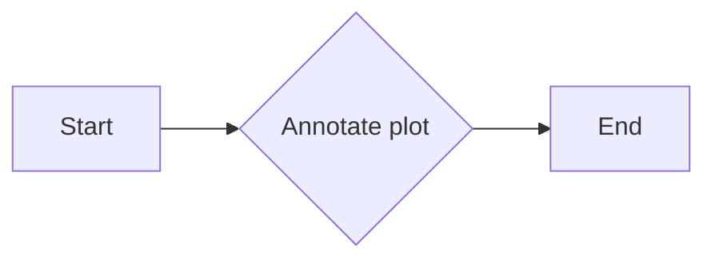

#### 带注释源码

```python
import matplotlib.pyplot as plt
import numpy as np

fig, ax = plt.subplots()

t = np.arange(0.0, 5.0, 0.01)
s = np.cos(2*np.pi*t)
line, = ax.plot(t, s, lw=2)

# Annotate the plot with an arrow pointing to the coordinates (2, 1)
# and text at (3, 1.5)
ax.annotate('local max', xy=(2, 1), xytext=(3, 1.5),
            arrowprops=dict(facecolor='black', shrink=0.05),
            )

# Set the y-axis limits
ax.set_ylim(-2, 2)

# Display the plot
plt.show()
```


### matplotlib.pyplot.annotate

matplotlib.pyplot.annotate 是一个用于在图表上添加注释的函数。

参数：

- `xy`：`tuple`，指定注释的坐标点。
- `xytext`：`tuple`，指定注释文本的坐标点。
- `arrowprops`：`dict`，定义箭头的属性，如颜色、宽度等。

返回值：`Annotation` 对象，表示添加的注释。

#### 流程图

```mermaid
graph LR
A[Start] --> B{Call matplotlib.pyplot.annotate()}
B --> C[End]
```

#### 带注释源码

```python
import matplotlib.pyplot as plt
import numpy as np

fig, ax = plt.subplots()

t = np.arange(0.0, 5.0, 0.01)
s = np.cos(2*np.pi*t)
line, = ax.plot(t, s, lw=2)

# 添加注释
ax.annotate('local max', xy=(2, 1), xytext=(3, 1.5),
            arrowprops=dict(facecolor='black', shrink=0.05),
            )

ax.set_ylim(-2, 2)
plt.show()
```


### ax.set_ylim

`ax.set_ylim` 是一个方法，用于设置轴的 y 轴限制。

参数：

- `ymin`：`float`，y 轴的最小值。
- `ymax`：`float`，y 轴的最大值。

参数描述：

- `ymin` 和 `ymax` 是 y 轴的上下限，用于限制 y 轴的显示范围。

返回值：`None`，该方法不返回任何值。

#### 流程图

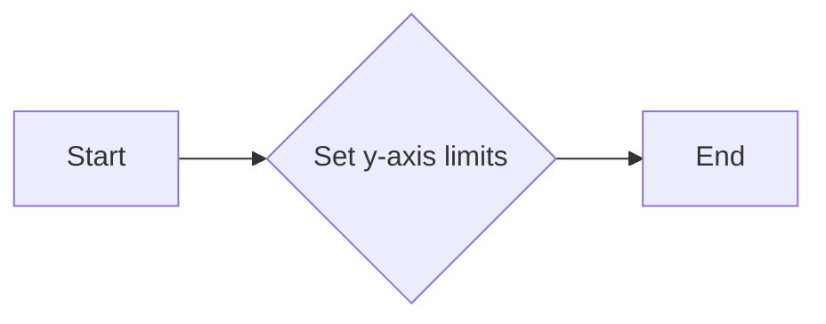

#### 带注释源码

```
ax.set_ylim(-2, 2)
```

在这行代码中，`ax` 是一个 `Axes` 对象，它代表了一个绘图轴。`set_ylim` 方法被调用，并传入两个参数 `-2` 和 `2`，这表示将 y 轴的显示范围设置为从 `-2` 到 `2`。


### plt.show()

展示绘制的图形。

参数：

- 无

返回值：`None`，无返回值，但会显示绘制的图形。

#### 流程图

```mermaid
graph LR
A[开始] --> B{调用plt.show()}
B --> C[结束]
```

#### 带注释源码

```
plt.show()
```


### ax.annotate()

在图形上添加注释。

参数：

- `xy`：`tuple`，指定注释的坐标点。
- `xytext`：`tuple`，指定注释文本的坐标点。
- `arrowprops`：`dict`，指定箭头的属性，如颜色和缩放比例。
- ...

返回值：`Annotation`对象，表示添加的注释。

#### 流程图

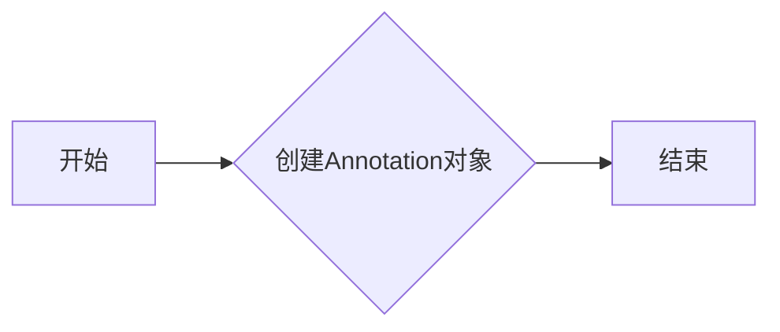

#### 带注释源码

```
ax.annotate('local max', xy=(2, 1), xytext=(3, 1.5),
            arrowprops=dict(facecolor='black', shrink=0.05),
            )
```


### ax.plot()

在图形上绘制线条。

参数：

- `t`：`numpy.ndarray`，x轴的数据点。
- `s`：`numpy.ndarray`，y轴的数据点。
- `lw`：`int`，线条的宽度。

返回值：`Line2D`对象，表示绘制的线条。

#### 流程图

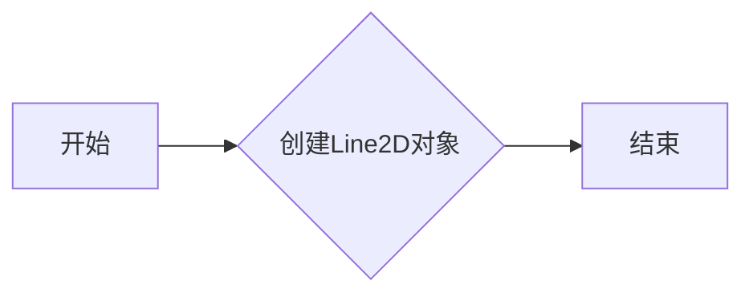

#### 带注释源码

```
line, = ax.plot(t, s, lw=2)
```


### plt.subplots()

创建一个新的图形和一个轴。

参数：

- 无

返回值：`Figure`对象和`AxesSubplot`对象。

#### 流程图

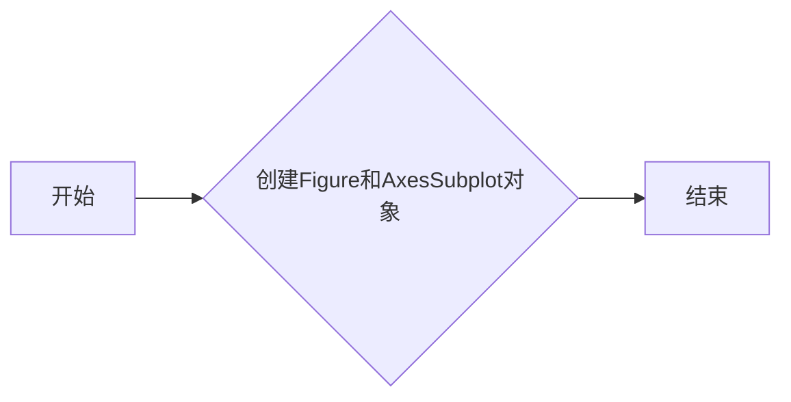

#### 带注释源码

```
fig, ax = plt.subplots()
```


### np.arange()

生成一个指定范围的数组。

参数：

- `start`：`float`，数组的起始值。
- `stop`：`float`，数组的结束值。
- `step`：`float`，数组的步长。

返回值：`numpy.ndarray`，生成的数组。

#### 流程图

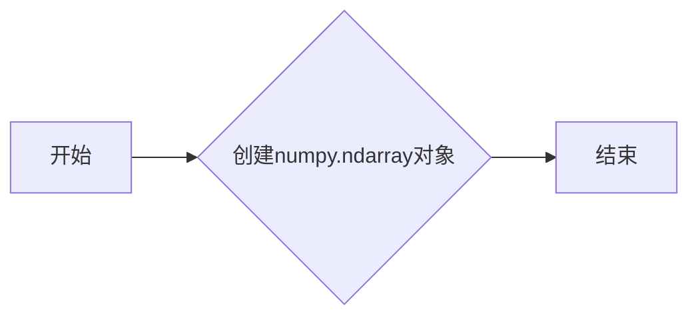

#### 带注释源码

```
t = np.arange(0.0, 5.0, 0.01)
```


### np.cos()

计算余弦值。

参数：

- `x`：`float`或`numpy.ndarray`，输入值。

返回值：`float`或`numpy.ndarray`，余弦值。

#### 流程图

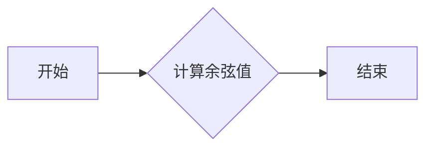

#### 带注释源码

```
s = np.cos(2*np.pi*t)
```


### ax.set_ylim()

设置轴的y轴限制。

参数：

- `vmin`：`float`，y轴的最小值。
- `vmax`：`float`，y轴的最大值。

返回值：`Axes`对象，表示当前轴。

#### 流程图

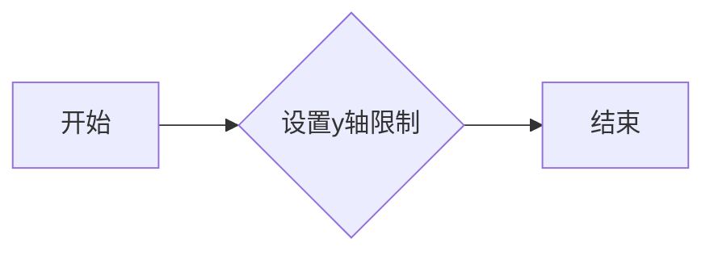

#### 带注释源码

```
ax.set_ylim(-2, 2)
```


### matplotlib.pyplot

matplotlib.pyplot是matplotlib的核心模块，用于创建和展示图形。

#### 关键组件信息

- `subplots`：创建一个新的图形和一个轴。
- `plot`：在图形上绘制线条。
- `annotate`：在图形上添加注释。
- `show`：展示绘制的图形。
- `arange`：生成一个指定范围的数组。
- `cos`：计算余弦值。
- `set_ylim`：设置轴的y轴限制。

#### 潜在的技术债务或优化空间

- 代码中使用了硬编码的值，如坐标点和y轴限制，可以考虑使用配置文件或参数化方式来提高灵活性。
- 代码中没有使用异常处理，可以考虑添加异常处理来提高代码的健壮性。
- 代码中没有使用注释来解释代码的功能和目的，可以考虑添加更多注释来提高代码的可读性。

#### 设计目标与约束

- 设计目标：创建一个简单的图形展示示例。
- 约束：使用matplotlib库进行绘图。

#### 错误处理与异常设计

- 代码中没有使用异常处理，可以考虑添加异常处理来提高代码的健壮性。

#### 数据流与状态机

- 数据流：从np.arange生成t数组，从np.cos生成s数组，然后使用ax.plot绘制线条，使用ax.annotate添加注释，最后使用plt.show展示图形。
- 状态机：代码中没有使用状态机。

#### 外部依赖与接口契约

- 外部依赖：matplotlib库。
- 接口契约：matplotlib库提供的绘图函数和方法的接口契约。
```


### matplotlib.pyplot.annotate

matplotlib.pyplot.annotate 是一个用于在图表上添加注释的函数。

参数：

- `xy`：`tuple`，指定注释的坐标点。
- `xytext`：`tuple`，指定注释文本的坐标点。
- `arrowprops`：`dict`，定义箭头的属性，如颜色、宽度等。

返回值：`Annotation` 对象，表示添加的注释。

#### 流程图

```mermaid
graph LR
A[Start] --> B{Call matplotlib.pyplot.annotate()}
B --> C[End]
```

#### 带注释源码

```python
import matplotlib.pyplot as plt
import numpy as np

fig, ax = plt.subplots()

t = np.arange(0.0, 5.0, 0.01)
s = np.cos(2*np.pi*t)
line, = ax.plot(t, s, lw=2)

# 添加注释
ax.annotate('local max', xy=(2, 1), xytext=(3, 1.5),
            arrowprops=dict(facecolor='black', shrink=0.05),
            )

ax.set_ylim(-2, 2)
plt.show()
```


### matplotlib.pyplot.subplots

matplotlib.pyplot.subplots 是一个用于创建子图对象的函数。

参数：

- `figsize`：`tuple`，指定子图的大小（宽度和高度），默认为 (6, 4)。
- `dpi`：`int`，指定图像的分辨率，默认为 100。
- `facecolor`：`color`，指定子图背景颜色，默认为 'white'。
- `edgecolor`：`color`，指定子图边缘颜色，默认为 'none'。
- `frameon`：`bool`，指定是否显示子图边框，默认为 True。
- `num`：`int`，指定要创建的子图数量，默认为 1。
- `gridspec_kw`：`dict`，指定 GridSpec 的关键字参数，用于更复杂的布局。
- `constrained_layout`：`bool`，指定是否启用约束布局，默认为 False。

返回值：`Figure`，包含子图和坐标轴的 Figure 对象。

#### 流程图

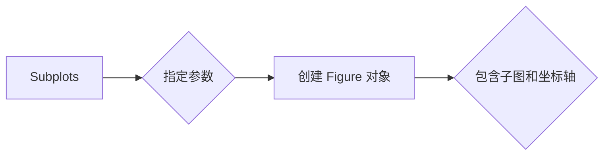

#### 带注释源码

```python
import matplotlib.pyplot as plt

fig, ax = plt.subplots()
```


### matplotlib.pyplot.show

matplotlib.pyplot.show 是一个用于显示图形的函数。

参数：

- `block`：`bool`，指定是否阻塞当前线程直到图形显示，默认为 True。

返回值：无。

#### 流程图

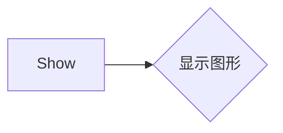

#### 带注释源码

```python
plt.show()
```


### matplotlib.axes.Axes.plot

matplotlib.axes.Axes.plot 是一个用于绘制线条的函数。

参数：

- `x`：`array_like`，x 坐标数据。
- `y`：`array_like`，y 坐标数据。
- `color`：`color`，线条颜色，默认为 'b'。
- `linewidth`：`float`，线条宽度，默认为 1.0。
- ...

返回值：`Line2D`，线条对象。

#### 流程图

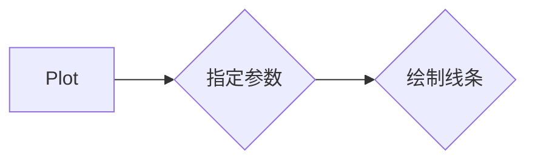

#### 带注释源码

```python
line, = ax.plot(t, s, lw=2)
```


### matplotlib.axes.Axes.annotate

matplotlib.axes.Axes.annotate 是一个用于在图形上添加注释的函数。

参数：

- `xy`：`tuple`，指定注释的坐标。
- `xytext`：`tuple`，指定注释文本的坐标。
- `arrowprops`：`dict`，指定箭头属性，如颜色、宽度等。
- ...

返回值：`Annotation`，注释对象。

#### 流程图

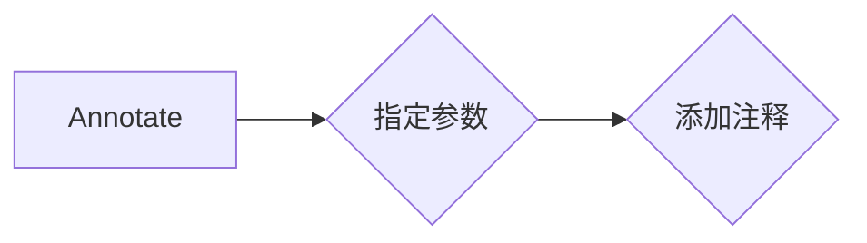

#### 带注释源码

```python
ax.annotate('local max', xy=(2, 1), xytext=(3, 1.5),
            arrowprops=dict(facecolor='black', shrink=0.05),
            )
```


### matplotlib.pyplot.ylim

matplotlib.pyplot.ylim 是一个用于设置坐标轴 y 轴的显示范围的函数。

参数：

- `ymin`：`float`，y 轴的最小值。
- `ymax`：`float`，y 轴的最大值。

返回值：无。

#### 流程图

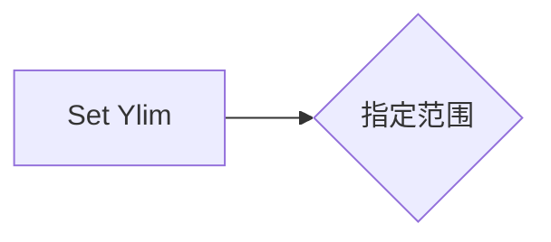

#### 带注释源码

```python
ax.set_ylim(-2, 2)
```


### matplotlib.pyplot

matplotlib.pyplot 是一个用于创建图形和图表的模块。

#### 流程图

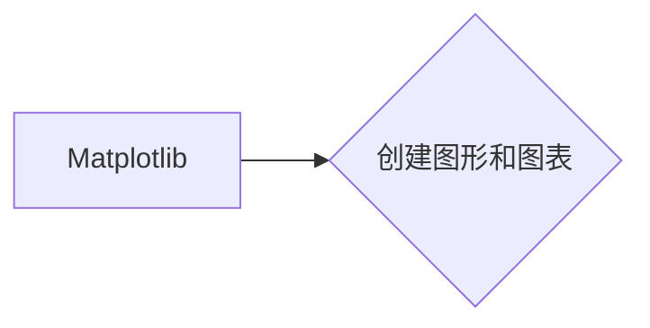

#### 带注释源码

```python
import matplotlib.pyplot as plt
```


### numpy

numpy 是一个用于科学计算的 Python 库。

#### 流程图

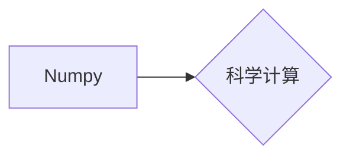

#### 带注释源码

```python
import numpy as np
```


### 关键组件信息

- matplotlib.pyplot：用于创建图形和图表。
- numpy：用于科学计算。

#### 潜在的技术债务或优化空间

- 代码中使用了硬编码的参数值，如子图大小和线条宽度，可以考虑使用配置文件或参数化输入来提高灵活性。
- 代码中没有使用异常处理，可以考虑添加异常处理来提高代码的健壮性。
- 代码中没有使用注释来解释代码逻辑，可以考虑添加更多注释来提高代码的可读性。


### 设计目标与约束

- 设计目标：创建一个简单的图形，展示如何使用 matplotlib 和 numpy。
- 约束：代码应简洁易懂，易于维护。


### 错误处理与异常设计

- 代码中没有使用异常处理，可以考虑添加异常处理来提高代码的健壮性。


### 数据流与状态机

- 数据流：从 numpy 生成数据，通过 matplotlib 绘制图形。
- 状态机：没有使用状态机。


### 外部依赖与接口契约

- 外部依赖：matplotlib 和 numpy。
- 接口契约：matplotlib 和 numpy 的 API 文档。
```


### matplotlib.pyplot.plot

matplotlib.pyplot.plot 是一个用于绘制二维线条图的函数。

参数：

- `t`：`numpy.ndarray`，时间序列或数据点。
- `s`：`numpy.ndarray`，与时间序列对应的值。
- `lw`：`int`，线条宽度。

返回值：`Line2D`，线条对象。

#### 流程图

```mermaid
graph LR
A[Start] --> B[Import matplotlib.pyplot as plt]
B --> C[Create figure and axis]
C --> D[Define time series t]
D --> E[Define data series s]
E --> F[Plot t and s]
F --> G[Annotate plot]
G --> H[Set y-axis limit]
H --> I[Show plot]
I --> J[End]
```

#### 带注释源码

```python
import matplotlib.pyplot as plt
import numpy as np

fig, ax = plt.subplots()

t = np.arange(0.0, 5.0, 0.01)
s = np.cos(2*np.pi*t)
line, = ax.plot(t, s, lw=2)

ax.annotate('local max', xy=(2, 1), xytext=(3, 1.5),
            arrowprops=dict(facecolor='black', shrink=0.05),
            )
ax.set_ylim(-2, 2)
plt.show()
```


### matplotlib.pyplot.annotate

matplotlib.pyplot.annotate 是一个用于在 matplotlib 图形上添加注释的函数。

参数：

- xy：`tuple`，指定注释的坐标点。
- xytext：`tuple`，指定注释文本的坐标点。
- arrowprops：`dict`，指定箭头属性，如颜色、宽度等。
- ...

返回值：`Annotation`，返回一个注释对象。

#### 流程图

```mermaid
graph LR
A[Start] --> B{Call matplotlib.pyplot.annotate()}
B --> C[End]
```

#### 带注释源码

```python
import matplotlib.pyplot as plt
import numpy as np

fig, ax = plt.subplots()

t = np.arange(0.0, 5.0, 0.01)
s = np.cos(2*np.pi*t)
line, = ax.plot(t, s, lw=2)

# 添加注释
ax.annotate('local max', xy=(2, 1), xytext=(3, 1.5),
            arrowprops=dict(facecolor='black', shrink=0.05),
            )

ax.set_ylim(-2, 2)
plt.show()
``` 


### matplotlib.pyplot.set_ylim

matplotlib.pyplot.set_ylim 是一个用于设置当前轴的 y 轴限制的全局函数。

参数：

- `ymin`：`float`，y 轴的下限。
- `ymax`：`float`，y 轴的上限。

返回值：`None`，该函数没有返回值。

#### 流程图

```mermaid
graph LR
A[Start] --> B{Set Y-axis Limits?}
B -- Yes --> C[Set ymin and ymax]
C --> D[End]
B -- No --> D
```

#### 带注释源码

```python
import matplotlib.pyplot as plt

fig, ax = plt.subplots()

t = np.arange(0.0, 5.0, 0.01)
s = np.cos(2*np.pi*t)
line, = ax.plot(t, s, lw=2)

ax.annotate('local max', xy=(2, 1), xytext=(3, 1.5),
            arrowprops=dict(facecolor='black', shrink=0.05),
            )
# Set the y-axis limits
ax.set_ylim(-2, 2)
plt.show()
```


### matplotlib.pyplot.show

matplotlib.pyplot.show 是一个全局函数，用于显示当前图形。

参数：

- 无

返回值：无

#### 流程图

```mermaid
graph LR
A[Start] --> B[Import matplotlib.pyplot]
B --> C[Create figure and axes]
C --> D[Plot data]
D --> E[Annotate plot]
E --> F[Set y-axis limit]
F --> G[Show plot]
G --> H[End]
```

#### 带注释源码

```
import matplotlib.pyplot as plt
import numpy as np

fig, ax = plt.subplots()

t = np.arange(0.0, 5.0, 0.01)
s = np.cos(2*np.pi*t)
line, = ax.plot(t, s, lw=2)

ax.annotate('local max', xy=(2, 1), xytext=(3, 1.5),
            arrowprops=dict(facecolor='black', shrink=0.05),
            )
ax.set_ylim(-2, 2)
plt.show()
``` 


### matplotlib.pyplot.annotate

matplotlib.pyplot.annotate 是一个用于在 matplotlib 图形上添加注释的函数。

参数：

- `xy`：`tuple`，指定注释的坐标点。
- `xytext`：`tuple`，指定注释文本的坐标点。
- `arrowprops`：`dict`，包含箭头属性的字典，例如箭头颜色和缩放比例。

返回值：`Annotation` 对象，表示添加到图形上的注释。

#### 流程图

```mermaid
graph LR
A[Start] --> B{Call matplotlib.pyplot.annotate()}
B --> C[Pass xy, xytext, arrowprops]
C --> D[Return Annotation object]
D --> E[End]
```

#### 带注释源码

```python
import matplotlib.pyplot as plt
import numpy as np

fig, ax = plt.subplots()

t = np.arange(0.0, 5.0, 0.01)
s = np.cos(2*np.pi*t)
line, = ax.plot(t, s, lw=2)

# Add annotation with arrow
ax.annotate('local max', xy=(2, 1), xytext=(3, 1.5),
            arrowprops=dict(facecolor='black', shrink=0.05),
            )

ax.set_ylim(-2, 2)
plt.show()
```


### numpy.arange

`numpy.arange` 是一个 NumPy 函数，用于生成一个沿指定间隔的数字序列。

参数：

- `start`：`int`，序列的起始值。
- `stop`：`int`，序列的结束值（不包括此值）。
- `step`：`int`，序列中相邻元素之间的间隔，默认为 1。
- `dtype`：`dtype`，可选，输出数组的类型。

返回值：`ndarray`，一个沿指定间隔的数字序列。

#### 流程图

```mermaid
graph LR
A[Start] --> B{Provide start, stop, step, dtype}
B --> C[Generate sequence]
C --> D[Return sequence]
D --> E[End]
```

#### 带注释源码

```python
import numpy as np

def generate_sequence(start, stop, step=1, dtype=None):
    """
    Generate a sequence of numbers from start to stop with a specified step.

    :param start: The starting value of the sequence.
    :param stop: The ending value of the sequence (exclusive).
    :param step: The step between each element in the sequence.
    :param dtype: The data type of the output array.
    :return: A NumPy array containing the sequence.
    """
    return np.arange(start, stop, step, dtype=dtype)
```


### matplotlib.pyplot.annotate

matplotlib.pyplot.annotate 是一个用于在图表上添加注释的函数。

参数：

- `xy`：`tuple`，指定注释的坐标点。
- `xytext`：`tuple`，指定注释文本的坐标点。
- `arrowprops`：`dict`，定义箭头的属性，如颜色、宽度等。

返回值：`Annotation` 对象，表示添加的注释。

#### 流程图

```mermaid
graph LR
A[Start] --> B{Call matplotlib.pyplot.annotate()}
B --> C[End]
```

#### 带注释源码

```python
ax.annotate('local max', xy=(2, 1), xytext=(3, 1.5),
            arrowprops=dict(facecolor='black', shrink=0.05),
            )
```


### numpy.arange

numpy.arange 是一个用于生成等差数列的函数。

参数：

- `start`：`int` 或 `float`，数列的起始值。
- `stop`：`int` 或 `float`，数列的结束值。
- `step`：`int` 或 `float`，数列的步长，默认为 1。

返回值：`ndarray`，包含等差数列的数组。

#### 流程图

```mermaid
graph LR
A[Start] --> B{Call numpy.arange()}
B --> C[End]
```

#### 带注释源码

```python
t = np.arange(0.0, 5.0, 0.01)
```


### numpy.cos

numpy.cos 是一个用于计算余弦值的函数。

参数：

- `x`：`int` 或 `float`，输入值。

返回值：`int` 或 `float`，余弦值。

#### 流程图

```mermaid
graph LR
A[Start] --> B{Call numpy.cos()}
B --> C[End]
```

#### 带注释源码

```python
s = np.cos(2*np.pi*t)
```

## 关键组件


### 张量索引

张量索引用于在多维数组中定位和访问特定元素。

### 惰性加载

惰性加载是一种延迟计算或初始化数据的技术，直到实际需要时才进行。

### 反量化支持

反量化支持允许在量化过程中对某些操作进行非量化处理，以保持精度。

### 量化策略

量化策略定义了如何将浮点数转换为固定点数表示，以减少计算资源消耗。


## 问题及建议


### 核心功能描述
该代码的核心功能是使用matplotlib库在图表上添加一个箭头，该箭头指向指定的坐标点，并使用自定义的箭头样式。

### 文件整体运行流程
1. 导入matplotlib.pyplot和numpy库。
2. 创建一个matplotlib图表和坐标轴。
3. 生成一个时间序列t和对应的sine值。
4. 在坐标轴上绘制时间序列和sine值。
5. 在图表上添加一个箭头，指向坐标(2, 1)并指向(3, 1.5)。
6. 设置坐标轴的y轴范围。
7. 显示图表。

### 类的详细信息
- 无类定义，代码中仅使用全局函数和matplotlib库中的类和方法。

### 全局变量和全局函数的详细信息
- 全局变量：
  - 无全局变量。

- 全局函数：
  - `np.arange(start, stop, step)`: 生成一个从start开始，以step为步长，到stop结束的数组。
  - `np.cos(x)`: 计算x的余弦值。
  - `plt.subplots()`: 创建一个新的图表和一个坐标轴。
  - `ax.plot(t, s, lw=2)`: 在坐标轴上绘制时间序列t和sine值。
  - `ax.annotate(text, xy, xytext, arrowprops, **kwargs)`: 在图表上添加一个文本注释和箭头。
  - `ax.set_ylim(ymin, ymax)`: 设置坐标轴的y轴范围。
  - `plt.show()`: 显示图表。

### 关键组件信息
- `matplotlib.pyplot`: 用于创建和显示图表。
- `matplotlib.axes.Axes`: 用于操作图表中的坐标轴。

### 潜在的技术债务或优化空间
### 已知问题
- {问题1}：代码中使用了硬编码的坐标值和箭头样式，这可能导致代码的可重用性和可维护性降低。
- {问题2}：代码没有进行错误处理，如果matplotlib库或numpy库无法正常工作，可能会导致程序崩溃。

### 优化建议
- {建议1}：将坐标值和箭头样式作为参数传递给函数，以提高代码的可重用性和可维护性。
- {建议2}：添加错误处理，以处理matplotlib库或numpy库可能抛出的异常。
- {建议3}：考虑使用面向对象的方法来封装图表和坐标轴的操作，以提高代码的模块化和可测试性。


## 其它


### 设计目标与约束

- 设计目标：实现一个简单的绘图标注功能，允许用户在图表上添加箭头指向特定坐标。
- 约束条件：使用matplotlib库进行绘图，箭头样式可自定义。

### 错误处理与异常设计

- 错误处理：确保在绘图过程中捕获并处理可能的异常，如matplotlib库未正确安装或使用。
- 异常设计：定义异常类，如`PlottingError`，用于处理绘图相关的错误。

### 数据流与状态机

- 数据流：输入为时间序列数据`t`和相应的函数`s`，输出为绘制的图表。
- 状态机：无状态机，程序流程线性，从数据准备到绘图展示。

### 外部依赖与接口契约

- 外部依赖：matplotlib库和numpy库。
- 接口契约：matplotlib的`Axes`和`plot`方法，numpy的数组操作。


    