# `matplotlib\galleries\examples\text_labels_and_annotations\annotation_demo.py` 详细设计文档

这是Matplotlib官方文档的示例代码，演示如何在图表中添加各种注释（annotation），包括指定文本位置和注释点、使用多种坐标系（figure/axes data/pixels/fraction等）、自定义箭头样式（直线、弧形、角度等）、创建气泡注释、以及实现可拖拽的注释等功能。

## 整体流程

```mermaid
graph TD
    A[开始] --> B[导入 matplotlib.pyplot, numpy, Ellipse, OffsetFrom]
    B --> C[创建第一个图: fig, ax = plt.subplots]
    C --> D[生成数据: t, s = np.arange(...), np.cos(...)]
D --> E[绘制线条: ax.plot(t, s)]
E --> F[添加基础注释: figure pixels/points/fraction]
F --> G[添加带箭头注释: 使用 xy, xytext, arrowprops]
G --> H[设置坐标轴范围: ax.set(xlim, ylim)]
H --> I[创建第二个图: 极坐标投影]
I --> J[添加极坐标注释]
J --> K[创建第三个图: 添加椭圆并注释]
K --> L[创建第四个图: 演示各种箭头样式]
L --> M[添加不同箭头样式的注释: straight, arc3, arc, angle, fancy, simple, wedge等]
M --> N[创建第五个图: 气泡和轮廓注释]
N --> O[创建第六个图: 坐标系统演示]
O --> P[添加可拖拽注释: an1.draggable(), an2.draggable()]
P --> Q[调用 plt.show() 显示所有图表]
Q --> R[结束]
```

## 类结构

```
该脚本为单文件示例代码，无自定义类层次结构
所有功能通过Matplotlib库的API调用实现
代码按注释块（# %%）分为多个独立的示例部分
```

## 全局变量及字段


### `fig`
    
matplotlib Figure 对象，用于显示图表的顶层容器

类型：`matplotlib.figure.Figure`
    


### `ax`
    
matplotlib Axes 对象，表示图表中的坐标轴区域

类型：`matplotlib.axes.Axes`
    


### `t`
    
numpy array，时间/横坐标数据

类型：`numpy.ndarray`
    


### `s`
    
numpy array，余弦函数值/纵坐标数据

类型：`numpy.ndarray`
    


### `line`
    
matplotlib Line2D 对象，图表中的线条

类型：`matplotlib.lines.Line2D`
    


### `ind`
    
int，索引值，用于选择数组中的特定点

类型：`int`
    


### `thisr`
    
float，极坐标的半径

类型：`float`
    


### `thistheta`
    
float，极坐标的角度

类型：`float`
    


### `r`
    
numpy array，极坐标半径数据

类型：`numpy.ndarray`
    


### `theta`
    
numpy array，极坐标角度数据

类型：`numpy.ndarray`
    


### `el`
    
Ellipse 对象，椭圆形状

类型：`matplotlib.patches.Ellipse`
    


### `an1`
    
Annotation 对象，可拖拽的注释

类型：`matplotlib.text.Annotation`
    


### `an2`
    
Annotation 对象，可拖拽的注释

类型：`matplotlib.text.Annotation`
    


### `an3`
    
Annotation 对象，可拖拽的注释

类型：`matplotlib.text.Annotation`
    


### `text`
    
Annotation 对象，注释文本对象

类型：`matplotlib.text.Annotation`
    


### `bbox_args`
    
dict，注释框的样式参数

类型：`dict`
    


### `arrow_args`
    
dict，箭头的样式参数

类型：`dict`
    


    

## 全局函数及方法


### `plt.subplots`

`plt.subplots` 是 Matplotlib 库中用于创建图形窗口及其子坐标轴的函数。该函数创建一个新的图形（Figure）和一个或多个子图（Axes），返回一个元组包含图形对象和坐标轴对象（或对象数组），是 Matplotlib 中最常用的绘图初始化方式。

参数：

- `nrows`：`int`，可选，默认值为 1，表示子图网格的行数
- `ncols`：`int`，可选，默认值为 1，表示子图网格的列数
- `figsize`：`tuple[float, float]`，可选，指定图形的宽度和高度（英寸）
- `sharex`、`sharey`：`bool` 或 `str`，可选，控制子图之间是否共享 x 轴或 y 轴
- `squeeze`：`bool`，可选，默认值为 True，当为 True 时，返回的坐标轴对象维度会被优化
- `subplot_kw`：`dict`，可选，用于创建子图的关键字参数（如 projection='polar'）
- `gridspec_kw`：`dict`，可选，用于控制网格布局的关键字参数
- `**fig_kw`：可选，用于创建图形（Figure）的额外关键字参数

返回值：`tuple[Figure, Axes or array of Axes]`，返回一个元组，第一个元素是图形对象（Figure），第二个元素是坐标轴对象（Axes），当 nrows > 1 或 ncols > 1 时返回 Axes 数组

#### 流程图

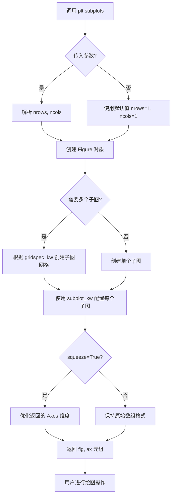

#### 带注释源码

```python
# plt.subplots 函数使用示例 - 来自 annotation_demo.py

# 示例1: 创建基础图形和坐标轴，指定图形大小
fig, ax = plt.subplots(figsize=(4, 4))
# 返回: fig = Figure对象, ax = Axes对象

# 示例2: 创建极坐标投影的子图
fig, ax = plt.subplots(subplot_kw=dict(projection='polar'), figsize=(3, 3))
# subplot_kw 用于传递创建子图时的关键字参数
# projection='polar' 指定使用极坐标投影

# 示例3: 创建等宽高比的子图
fig, ax = plt.subplots(subplot_kw=dict(aspect='equal'))

# 示例4: 创建更大的图形
fig, ax = plt.subplots(figsize=(8, 5))

# 示例5: 创建默认参数的子图
fig, ax = plt.subplots()

# 示例6: 创建1行2列的子图布局
fig, (ax1, ax2) = plt.subplots(1, 2)
# nrows=1, ncols=2 返回两个 Axes 对象
# 可以通过元组解包获取每个子图

# 实际底层调用逻辑（简化说明）:
# 1. plt.subplots() 内部会创建 Figure 对象
# 2. 根据 nrows, ncols 确定子图布局
# 3. 使用 Figure.add_subplot() 或 GridSpec 创建子图
# 4. 返回 (figure, axes) 元组供用户使用
```


### `np.arange`

生成指定范围的等差数组（数值序列），返回 NumPy ndarray 对象。该函数是 NumPy 库中用于创建数值序列的核心函数，常用于生成图表的 x 轴数据、循环索引等场景。

参数：

- `start`：`float` 或 `int`，起始值，默认为 0。当只提供一个参数时，该参数作为 stop 值使用
- `stop`：`float` 或 `int`，结束值（不包含），必填参数
- `step`：`float` 或 `int`，步长，默认为 1，可为负数
- `dtype`：`dtype`，输出数组的数据类型，可选，若未指定则根据 start、stop、step 自动推断

返回值：`numpy.ndarray`，由等差数值组成的 NumPy 数组

#### 流程图

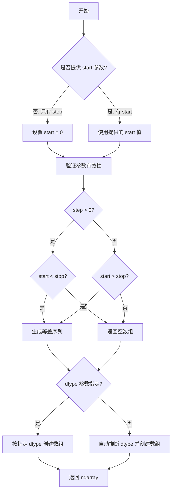

#### 带注释源码

```python
# np.arange 是 NumPy 库中的函数，用于生成等差数组
# 函数签名: numpy.arange([start, ]stop, [step, ]dtype=None)

# 在本代码中的典型用法:

# 用法1: 生成从 0.0 到 5.0，步长 0.01 的序列
# 等价于 np.arange(0, 5, 0.01) 或 np.arange(stop=5.0, step=0.01)
t = np.arange(0.0, 5.0, 0.01)

# 用法2: 生成从 0 到 1，步长 0.001 的序列
# 常用于极坐标图表中的角度参数
r = np.arange(0, 1, 0.001)

# np.arange 的工作原理:
# 1. 根据公式: result = start + i * step (其中 i = 0, 1, 2, ...)
# 2. 当 step > 0 时，生成满足 start + i*step < stop 的序列
# 3. 当 step < 0 时，生成满足 start + i*step > stop 的序列
# 4. 结果不包含 stop 值（与 Python 的 range() 行为一致）

# 示例说明:
# np.arange(0.0, 5.0, 0.01) 生成:
# [0.00, 0.01, 0.02, 0.03, ..., 4.98, 4.99]
# 共 500 个元素

# np.arange(0, 1, 0.001) 生成:
# [0.000, 0.001, 0.002, ..., 0.999]
# 共 1000 个元素
```


### `np.cos`

这是 NumPy 库提供的余弦函数，用于计算输入数组或标量的三角余弦值。该函数接受弧度制的角度输入，并返回对应余弦值，结果范围在 [-1, 1] 之间。

参数：

-  `x`：`float` 或 `numpy.ndarray`，输入的角度值，单位为弧度

返回值：`float` 或 `numpy.ndarray`，输入角度的余弦值

#### 流程图

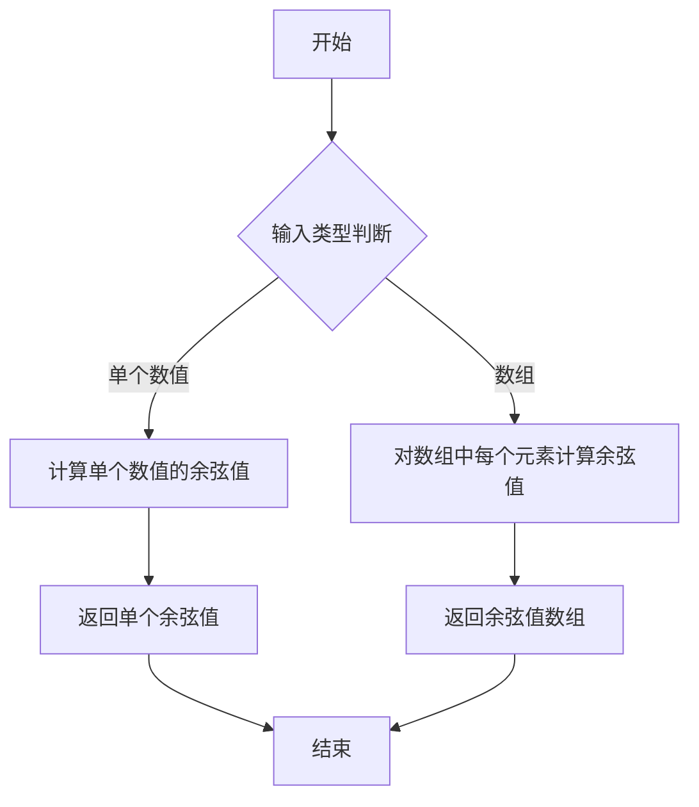

#### 带注释源码

```python
# np.cos 是 NumPy 库中的余弦函数
# 在本代码中的使用方式：
s = np.cos(2*np.pi*t)

# 参数说明：
# t: 时间数组，范围 0.0 到 5.0，步长 0.01
# 2*np.pi*t: 将时间转换为弧度（完整周期为 2*pi）
# 
# 返回值：
# s: 对应时间点的余弦值数组
# 
# 示例：
# 当 t = 0 时，2*pi*0 = 0，cos(0) = 1
# 当 t = 0.5 时，2*pi*0.5 = pi，cos(pi) = -1
# 当 t = 1.0 时，2*pi*1 = 2*pi，cos(2*pi) = 1
# 
# 这个函数生成了一个完整的余弦波形，用于演示 Matplotlib 的注释功能
```


### `ax.plot`

在 Matplotlib 中，`ax.plot` 是 `Axes` 类的核心绘图方法，用于在坐标轴上绘制线条、曲线或数据点。该方法接受可变数量的参数，支持多种数据输入格式，并返回包含所有线条（Line2D）对象的列表。通过格式字符串或关键字参数，可以灵活地自定义线条的颜色、样式、宽度、标记等属性。

参数：

- `*args`：可变位置参数，支持多种格式：
  - `plot(y)`：仅提供y轴数据，自动生成x轴索引
  - `plot(x, y)`：分别提供x轴和y轴数据
  - `plot(x, y, format_string)`：数据加上格式字符串（如 'r--', 'bo-' 等）
  - 也支持多组数据 `plot(x1, y1, x2, y2, ...)`
- `scalex`：布尔值，默认为 True，是否缩放x轴
- `scaley`：布尔值，默认为 True，是否缩放y轴
- `data`：可选的数据对象，用于通过标签访问数据（如果提供了 data 参数，可以使用字符串作为 x 和 y）
- `**kwargs`：关键字参数，用于指定线条属性，如：
  - `color` 或 `c`：线条颜色
  - `linewidth` 或 `lw`：线条宽度
  - `linestyle` 或 `ls`：线条样式（'solid', 'dashed', 'dashdot', 'dotted'）
  - `marker`：标记样式
  - `label`：图例标签
  - 等等大量 Line2D 属性

返回值：`list of matplotlib.lines.Line2D`，返回创建的线条对象列表。通常使用 `line, = ax.plot(...)` 解包获取单个 Line2D 对象。

#### 流程图

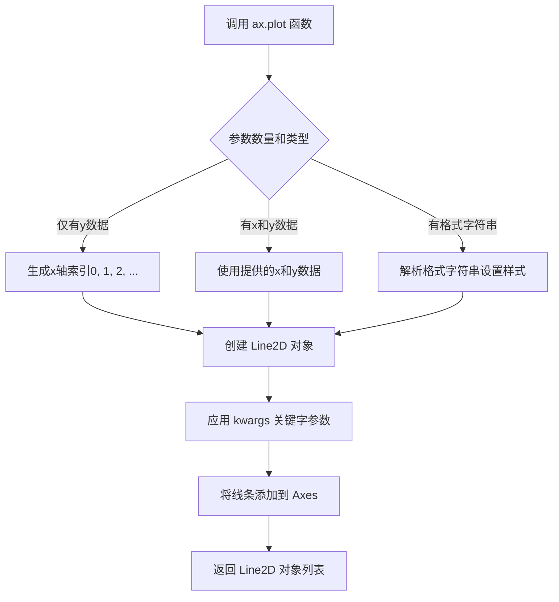

#### 带注释源码

```python
# 代码中 ax.plot 的典型使用示例

# 示例1：绘制基本余弦曲线
line, = ax.plot(t, s)
# 参数说明：
# t: numpy数组，x轴数据（时间从0到5，步长0.01）
# s: numpy数组，y轴数据（cos(2πt)）
# 返回值：line 是 Line2D 对象，逗号解包获取单个对象

# 示例2：绘制极坐标点（带标记）
ax.plot([thistheta], [thisr], 'o')
# 参数说明：
# thistheta: 角度数据
# thisr: 半径数据  
# 'o': 格式字符串，表示使用圆圈标记（不连线的散点）

# 示例3：带完整属性的绘图
line, = ax.plot(t, s, lw=3)
# 参数说明：
# t, s: x和y数据
# lw=3: keyword argument，linewidth=3，设置线条宽度为3

# 示例4：绘制多条线
line, = ax.plot(theta, r)
# theta: 角度数组（2*2*π*r）
# r: 半径数组（0到1，步长0.001）
# 绘制极坐标系中的曲线
```


### `ax.annotate`

在Matplotlib的Axes对象上添加注释文本和指向性箭头，可指定注释点和文本位置的坐标系统，支持丰富的箭头样式和文本框定制。

参数：

- `s` / `str`：`str`，注释文本内容
- `xy`：`(float, float)`，要注释的目标点坐标（如数据点坐标）
- `xytext`：`(float, float) | None`，注释文本的位置坐标，默认为`None`（与`xy`相同）
- `xycoords`：`str | Artist | Transform | tuple`，坐标系统类型，可选值包括`'data'`、`'figure pixels'`、`'figure points'`、`'figure fraction'`、`'axes pixels'`、`'axes fraction'`、`'offset points'`、`'offset pixels'`或Artist对象，默认为`'data'`
- `textcoords`：`str | Artist | Transform | tuple | None`，文本位置的坐标系统，默认为`None`（与`xycoords`相同）
- `arrowprops`：`dict | None`，箭头属性字典，用于定义箭头的样式、颜色、连接方式等
- `annotation_clip`：`bool | None`，当注释点超出轴范围时是否隐藏注释，默认为`None`
- `fontsize`：`int | str`，字体大小
- `color`：`str`，文本颜色
- `horizontalalignment` / `ha`：`str`，水平对齐方式，可选`'left'`、`'center'`、`'right'`
- `verticalalignment` / `va`：`str`，垂直对齐方式，可选`'top'`、`'center'`、`'bottom'`
- `bbox`：`dict | None`，文本框样式属性字典
- `clip_on`：`bool`，是否剪切到轴边界

返回值：`~matplotlib.text.Annotation`，返回创建的Annotation对象

#### 流程图

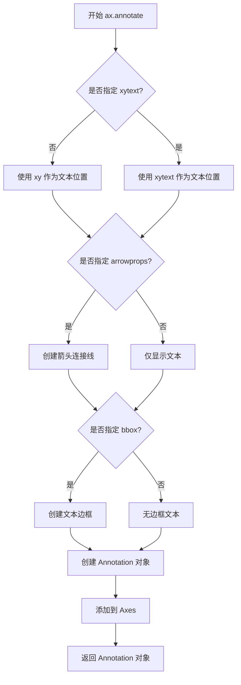

#### 带注释源码

```python
# 基本用法示例
ax.annotate('figure pixels',              # s: 注释文本
            xy=(10, 10),                  # xy: 注释目标点坐标
            xycoords='figure pixels')    # xycoords: 坐标系统为figure像素

# 带箭头和偏移的示例
ax.annotate('point offset from data',
            xy=(3, 1),                    # 目标点在数据坐标系中
            xycoords='data',
            xytext=(-10, 90),             # 文本在偏移坐标系中，距目标点-10点，90点
            textcoords='offset points',
            arrowprops=dict(              # 箭头属性
                facecolor='black',        # 箭头颜色
                shrink=0.05               # 箭头两端收缩5%
            ),
            horizontalalignment='center',  # 水平居中
            verticalalignment='bottom')     # 底部对齐

# 极坐标注释示例
ax.annotate('a polar annotation',
            xy=(thistheta, thisr),        # theta, radius 极坐标
            xytext=(0.05, 0.05),          # 文本在figure fraction中
            textcoords='figure fraction',
            arrowprops=dict(
                facecolor='black',
                shrink=0.05
            ))

# 复杂箭头样式示例
ax.annotate('arc3,\nrad 0.2',
            xy=(0.5, -1),
            xycoords='data',
            xytext=(-80, -60),
            textcoords='offset points',
            arrowprops=dict(
                arrowstyle="->",                    # 箭头样式
                connectionstyle="arc3,rad=.2"      # 连接线样式：弧形，半径0.2
            ))

# 带文本框的注释示例
ax.annotate('angle,\nround',
            xy=(3., 1),
            xytext=(-60, 30),
            textcoords='offset points',
            bbox=dict(boxstyle="round", fc="0.8"),   # 圆角文本框
            arrowprops=dict(
                arrowstyle="->",
                connectionstyle="angle,angleA=0,angleB=90,rad=10"
            ))

# 拖拽注释示例
an1 = ax.annotate('Drag me 1',
                  xy=(.5, .7),
                  xycoords='data',
                  ha="center",
                  va="center",
                  bbox=bbox_args)
an1.draggable()  # 使注释可拖拽

# 双向引用注释
an2 = ax.annotate('Drag me 2',
                  xy=(.5, .5),
                  xycoords=an1,           # 使用另一个artist的坐标系统
                  xytext=(.5, .3),
                  textcoords='axes fraction',
                  arrowprops=dict(
                      patchB=an1.get_bbox_patch(),
                      connectionstyle="arc3,rad=0.2",
                      **arrow_args))
```


### `ax.set`

`ax.set` 是 matplotlib 中 Axes 类的核心方法，用于通过关键字参数一次性设置坐标轴的多个属性（如坐标轴范围、标签、标题等），支持链式调用并返回 Axes 对象本身。

参数：

- `**kwargs`：`关键字参数`，接受多种坐标轴属性参数，常见参数包括：
  - `xlim` / `ylim`：`(float, float)` 或 `[float, float]`，设置 x/y 轴的范围（上下限）
  - `xlabel` / `ylabel`：`str`，设置 x/y 轴的标签文字
  - `title`：`str`，设置子图的标题
  - `xscale` / `yscale`：`str`，设置坐标轴刻度比例（如 'linear', 'log'）
  - `aspect`：`str` 或 `float`，设置坐标轴的纵横比
  - 其他艺术家（Artist）属性

返回值：`axes.Axes` 或 `self`，返回 Axes 对象本身，支持链式调用。

#### 流程图

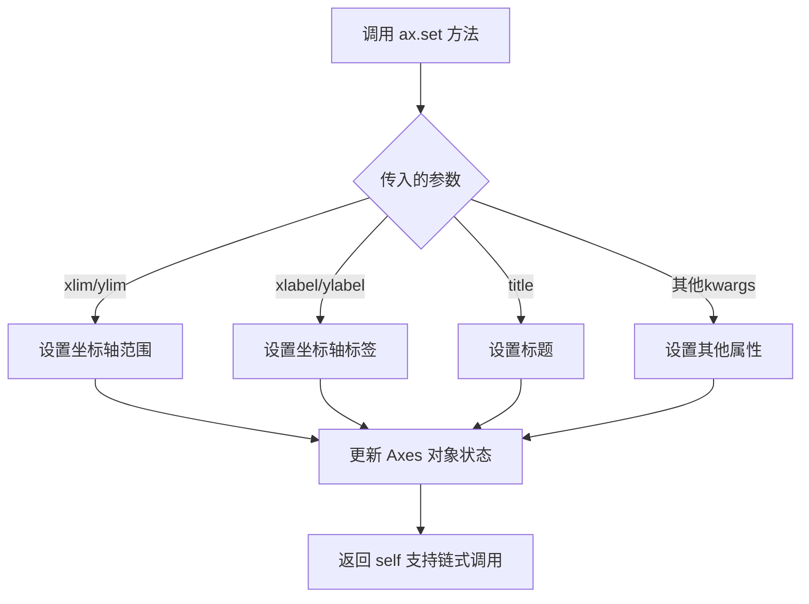

#### 带注释源码

```python
# 在代码中的实际调用示例：

# 示例1：设置坐标轴的 x 和 y 范围
ax.set(xlim=(-1, 5), ylim=(-3, 5))

# 示例2：设置另一个视图的范围
ax.set(xlim=(-1, 5), ylim=(-4, 3))

# 示例3：设置极坐标图的坐标轴范围
ax.set(xlim=(-1, 5), ylim=(-5, 3))

# 示例4：设置等比例坐标轴的范围
ax.set(xlim=[-20, 20], ylim=[-20, 20])

# 示例5：设置最后一张图的坐标范围
ax.set(xlim=[-2, 2], ylim=[-2, 2])

# ax.set 方法内部实现的伪代码：
# def set(self, **kwargs):
#     """
#     设置坐标轴的多种属性
#     
#     参数:
#         **kwargs: 关键字参数，可包含:
#             - xlim/ylim: 坐标轴范围 (float, float)
#             - xlabel/ylabel: 坐标轴标签 str
#             - title: 标题 str
#             - xscale/yscale: 刻度比例 str
#             - aspect: 纵横比 str 或 float
#             - 等等...
#     
#     返回:
#         self: 返回 Axes 对象本身，支持链式调用
#     """
#     for key, value in kwargs.items():
#         if key in ['xlim', 'ylim']:
#             # 设置坐标轴范围
#             self.set_ylim(value) if key == 'ylim' else self.set_xlim(value)
#         elif key in ['xlabel', 'ylabel']:
#             # 设置坐标轴标签
#             self.set_xlabel(value) if key == 'xlabel' else self.set_ylabel(value)
#         elif key == 'title':
#             self.set_title(value)
#         # ... 处理其他参数
#     
#     return self  # 支持链式调用
```


### `Axes.add_artist`

将艺术家（Artist）对象添加到 Axes 容器中。该方法是 matplotlib 中 Axes 类的核心方法之一，用于将各种图形元素（如线条、文本、形状等）添加到坐标轴上进行渲染。

参数：

- `artist`：`matplotlib.artist.Artist`，要添加到坐标轴的艺术家对象（如 Ellipse、Line2D、Text 等）
- `clip`：`bool`，可选参数，是否将艺术家剪切到 Axes 的边界框内，默认为 `False`

返回值：`matplotlib.artist.Artist`，返回添加的艺术家对象本身，便于链式调用或后续操作

#### 流程图

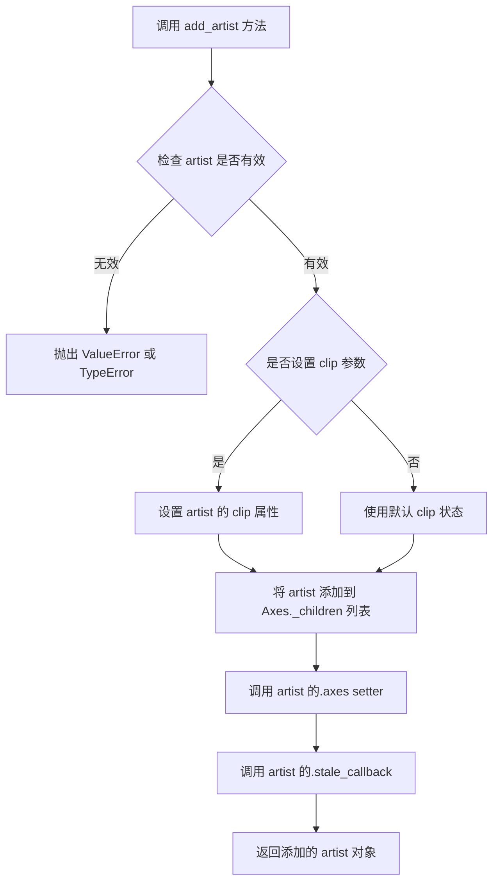

#### 带注释源码

```python
def add_artist(self, artist, clip=False):
    """
    将艺术家对象添加到 Axes 中。
    
    参数:
        artist: Artist 实例
            要添加的艺术家对象，如 Ellipse, Line2D, Text, Patch 等。
        clip: bool
            是否将艺术家剪切到 Axes 的边界框。
    
    返回:
        Artist: 添加的艺术家对象本身。
    """
    # 步骤1: 确认 artist 是有效的 Artist 实例
    if not isinstance(artist, Artist):
        raise TypeError("artist must be an instance of matplotlib.artist.Artist")
    
    # 步骤2: 如果指定了 clip 参数，设置艺术家的 clip 状态
    artist.set_clip_box(self.bbox)
    artist.set_clip_path(self.patch)
    # 注意：用户传入的 clip 参数会覆盖默认行为
    
    # 步骤3: 将 artist 添加到 Axes 的子元素列表中
    self._children.append(artist)
    
    # 步骤4: 设置 artist 的 axes 属性，关联到当前 Axes
    artist.axes = self
    
    # 步骤5: 如果 artist 支持 stale 回调，标记需要重绘
    # 这确保了添加 artist 后，图表会正确更新
    artist.stale_callback = self._stale_figure_callback
    
    # 步骤6: 返回添加的 artist，便于链式调用
    return artist
```

#### 使用示例（来自代码）

```python
# 代码中的实际调用示例
el = Ellipse((0, 0), 10, 20, facecolor='r', alpha=0.5)
fig, ax = plt.subplots(subplot_kw=dict(aspect='equal'))
ax.add_artist(el)  # 添加椭圆到坐标轴
el.set_clip_box(ax.bbox)
```


### Axes.add_patch

`add_patch` 是 Matplotlib 中 `Axes` 类的方法，用于将一个 Patch 对象（如椭圆、矩形、多边形等）添加到坐标轴中，并返回添加的 Patch 对象。

参数：

- `p`：`matplotlib.patches.Patch`，要添加到坐标轴的 Patch 对象（如 Ellipse、Rectangle、Polygon 等）

返回值：`matplotlib.patches.Patch`，返回添加的 Patch 对象（与输入相同），方便链式调用或后续操作

#### 流程图

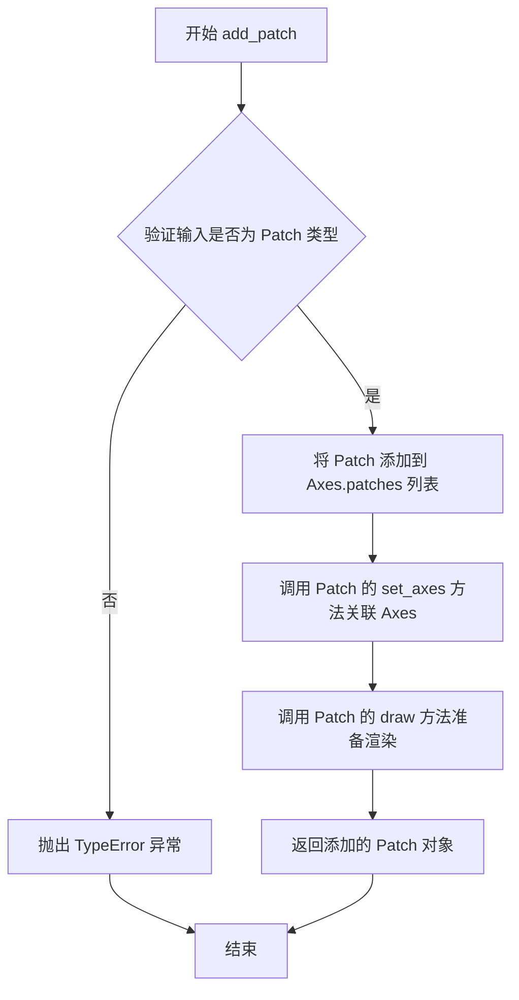

#### 带注释源码

```python
def add_patch(self, p):
    """
    将一个 Patch 添加到 Axes 的 patch 列表中。

    Parameters
    ----------
    p : `.patches.Patch`
        要添加的 Patch 对象。

    Returns
    -------
    `.patches.Patch`
        添加到 Axes 的 Patch 对象。

    Examples
    --------
    添加一个椭圆到当前坐标轴：

    >>> import matplotlib.pyplot as plt
    >>> from matplotlib.patches import Ellipse
    >>> fig, ax = plt.subplots()
    >>> el = Ellipse((0, 0), 10, 20, facecolor='r', alpha=0.5)
    >>> patch = ax.add_patch(el)  # 返回添加的 ellipse 对象
    """
    # 验证输入对象是否为 Patch 类型
    if not isinstance(p, patches.Patch):
        raise TypeError('Expected a Patch instance, got %s' % type(p))

    # 1. 将 Patch 添加到 Axes 的 patches 列表中
    #    这些 patches 会在绘制时被渲染
    self.patches.append(p)

    # 2. 设置 Patch 关联的 Axes
    #    让 Patch 知道它属于哪个坐标轴，以便正确处理坐标变换
    p.set_axes(self)

    # 3. 返回添加的 Patch 对象，方便链式调用
    return p
```

**使用示例（来自代码）：**

```python
# 创建椭圆对象
el = Ellipse((2, -1), 0.5, 0.5)

# 将椭圆添加到坐标轴
ax.add_patch(el)

# 或者直接获取返回值进行后续操作
patch = ax.add_patch(el)
patch.set_alpha(0.5)  # 设置透明度
```


### `Ellipse.set_clip_box`

该方法用于设置 `Ellipse`（椭圆）对象的裁剪框（clip box），指定一个边界框来限制椭圆的绘制区域。

参数：

- `bbox`：`matplotlib.transforms.Bbox`，要设置的裁剪框边界对象，用于定义椭圆的可见区域。如果为 `None`，则使用父对象的边界框。

返回值：`None`，该方法不返回任何值。

#### 流程图

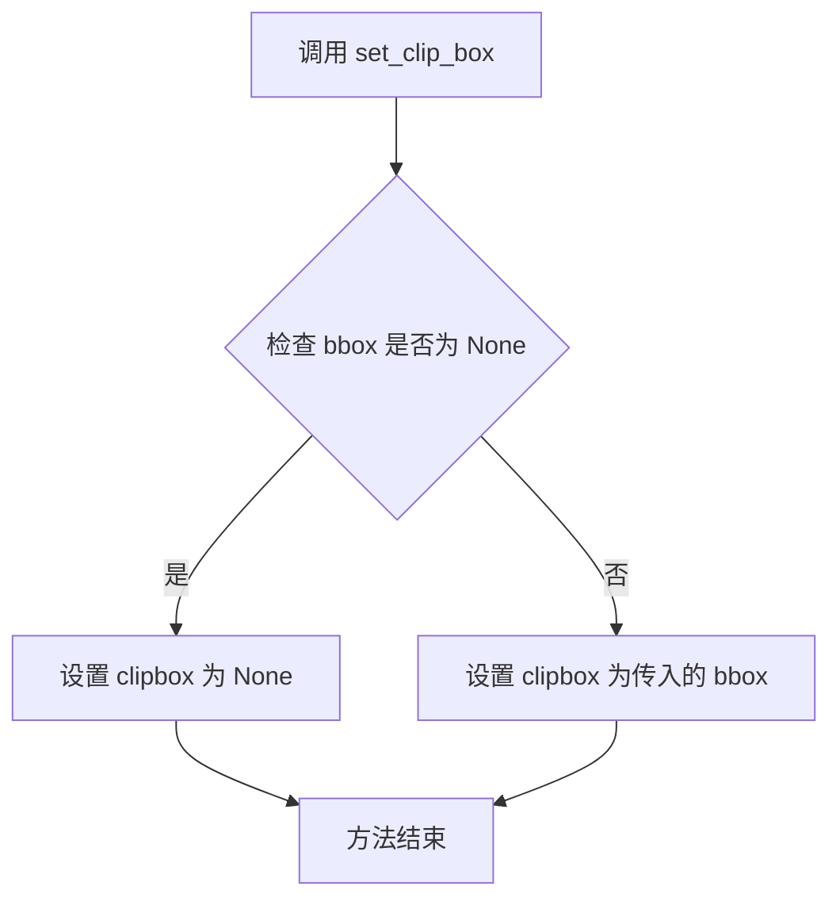

#### 带注释源码

```python
# 假设这是 matplotlib 中 Artist.set_clip_box 方法的实现
def set_clip_box(self, bbox):
    """
    Set the artist's clip box.

    Parameters
    ----------
    bbox : Bbox or None
        The clip box. If None, then the clip box will be set to
        the parent's bbox.
    """
    # 如果传入了 bbox 对象
    if bbox is not None:
        # 确保传入的是 Bbox 类型
        if not isinstance(bbox, transforms.Bbox):
            raise TypeError("bbox must be a Bbox instance")
    
    # 将 clipbox 属性设置为传入的 bbox（可以是 None）
    self.clipbox = bbox
```


### `Annotation.draggable`

使注释对象变为可拖拽状态，允许用户通过鼠标交互移动注释文本或锚点。

参数：

- `state`：布尔值或字符串，可选，默认值为 `True`，表示拖拽功能的初始状态（`True`/`'on'` 启用，`False`/`'off'` 禁用）
- `use_blit`：布尔值，可选，默认值为 `True`，是否使用 blit 技术优化重绘性能（减少闪烁和提高响应速度）

返回值：`DraggableAnnotation`，返回可拖拽注释的控制器对象，用于管理拖拽行为和状态

#### 流程图

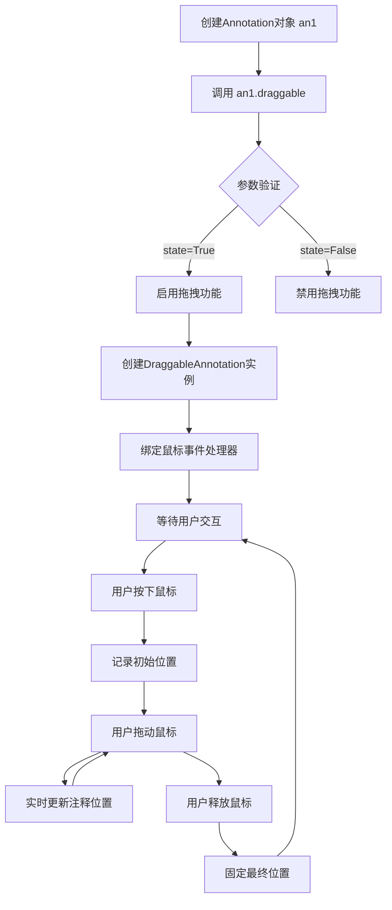

#### 带注释源码

```python
# 在代码中的使用方式
an1 = ax1.annotate('Drag me 1', xy=(.5, .7), xycoords='data',
                   ha="center", va="center",
                   bbox=bbox_args)

# 调用 draggable 方法使注释可拖拽
# 参数默认为空，使用默认行为：启用拖拽，使用blit优化
an1.draggable()

# 也可以传递参数控制行为
# an1.draggable(state=True, use_blit=True)
# an1.draggable(state='on', use_blit=False)

# 获取返回值可以进行进一步控制
# draggable_controller = an1.draggable()
# draggable_controller.disconnect()  # 禁用拖拽
```

```python
# 源码实现逻辑（基于Matplotlib Annotation类）
def draggable(self, state=True, use_blit=True):
    """
    使注释可拖拽
    
    参数:
        state: 布尔值或字符串 'on'/'off'，控制是否启用拖拽
        use_blit: 布尔值，是否使用blit优化提升性能
    
    返回:
        DraggableAnnotation: 拖拽控制器对象
    """
    from matplotlib.offsetbox import DraggableAnnotation
    return DraggableAnnotation(self, use_blit=use_blit)
```

```python
# DraggableAnnotation 类的核心逻辑
class DraggableAnnotation:
    def __init__(self, annotation, use_blit=True):
        self.annotation = annotation
        self.use_blit = use_blit
        self.mouse_down = False
        self.annotation_center = None
        # 连接鼠标事件
        self.cidpress = annotation.figure.canvas.mpl_connect(
            'button_press_event', self.on_press)
        self.cidrelease = annotation.figure.canvas.mpl_connect(
            'button_release_event', self.on_release)
        self.cidmotion = annotation.figure.canvas.mpl_connect(
            'motion_notify_event', self.on_motion)
    
    def on_press(self, event):
        """鼠标按下事件处理器"""
        # 检查点击是否在注释文本范围内
        if self.annotation.contains(event)[0]:
            self.mouse_down = True
            # 记录注释当前位置
            self.annotation_center = self.annotation.get_window_extent()
    
    def on_motion(self, event):
        """鼠标移动事件处理器"""
        if self.mouse_down:
            # 根据鼠标移动更新注释位置
            # 重新计算 xy 坐标
            self.annotation.xy = (new_x, new_y)
            self.annotation.figure.canvas.draw()
    
    def on_release(self, event):
        """鼠标释放事件处理器"""
        self.mouse_down = False
```


### `plt.show`

`plt.show` 是 Matplotlib 库中的全局函数，用于显示所有当前打开的 Figure（图形）窗口，并将图形渲染到屏幕。该函数会调用底层图形后端（如 TkAgg、Qt5Agg 等）来展示图形，通常会阻塞程序执行直到用户关闭所有图形窗口（在非交互式后端下行为可能不同）。

参数：

- `block`：`bool`，可选参数，默认值为 `True`（在大多数后端中）。当设置为 `True` 时，函数会阻塞程序执行，直到用户关闭所有图形窗口；当设置为 `False` 时，函数会立即返回，图形窗口保持打开但不阻塞主线程。

返回值：`None`，该函数不返回任何值，仅用于显示图形。

#### 流程图

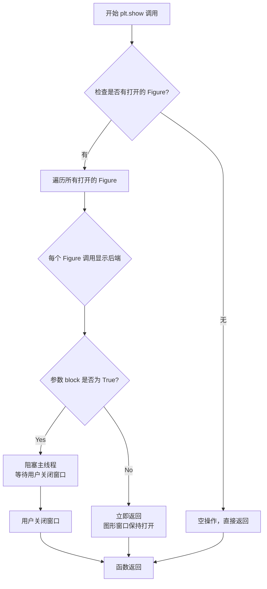

#### 带注释源码

```python
# plt.show 函数的典型实现逻辑（简化版）
def show(block=None):
    """
    显示所有打开的 Figure 图形窗口。
    
    Parameters
    ----------
    block : bool, optional
        是否阻塞程序执行以等待图形窗口关闭。
        默认为 True，在交互式后端下会阻塞主线程。
    """
    # 获取全局的 Figure 管理器字典
    # _pylab_helpers.Gcf 是存储所有活动 Figure 的字典
    allnums = get_fignums()  # 获取所有打开的 Figure 编号
    
    for num in allnums:
        # 遍历每个 Figure，获取其管理器并调用 show 方法
        figManager = Gcf.get_fig_manager(num)
        if figManager is not None:
            # 调用底层后端的显示方法
            figManager.show()
    
    # 如果 block 为 True 或未指定（默认行为）
    if block is None:
        # 根据当前后端和交互模式决定是否阻塞
        # 在 IPython 等交互环境中可能默认为 False
        block = is_interactive() and get_backend() != 'WebAgg'
    
    if block:
        # 进入事件循环阻塞，等待用户交互
        # 实际上是调用 mainloop() 或类似机制
        import matplotlib
        matplotlib.pyplot.switch_backend('qt5agg')  # 示例后端
        # 在此阻塞，等待窗口关闭信号
        # ...
    
    return None
```

#### 补充说明

- **设计目标**：`plt.show` 是 Matplotlib 面向用户的核心展示接口，屏蔽了不同图形后端的差异，提供统一的图形显示入口。
- **外部依赖**：依赖具体的后端实现（如 Qt、Tk、GTK 等），不同后端的显示机制和阻塞行为可能略有差异。
- **错误处理**：如果没有打开的 Figure，该函数通常空操作返回，不会抛出异常；在某些后端下，如果显示失败可能弹出错误对话框。
- **交互模式**：在 Jupyter Notebook 等交互环境中使用时，通常配合 `%matplotlib inline` 或 `%matplotlib widget` 魔术命令，此时 `block` 参数的行为可能不同。


## 关键组件


### 注释坐标系统 (Annotation Coordinate Systems)

支持多种坐标系统来指定注释点和文本位置，包括'figure pixels'、'figure points'、'figure fraction'、'axes pixels'、'axes points'、'axes fraction'、'offset points'、'offset pixels'和'data'，允许灵活定位注释。

### 箭头属性 (Arrow Properties)

通过arrowprops字典配置箭头样式，支持arrowstyle（"->"、"fancy"、"simple"、"wedge"等）、connectionstyle（arc3、arc、angle、bar等）、shrink、width、frac等参数，实现多样化的箭头效果。

### 框样式/气泡样式 (Box/Bubble Styles)

通过bbox参数的boxstyle（"round"、"round4"等）创建文本框，支持fc（填充色）和ec（边框色）自定义，可实现气泡注释效果。

### 极坐标注释 (Polar Annotation)

在极坐标Axes（projection='polar'）中使用(theta, radius)格式指定注释点，也可以在笛卡尔坐标系统中使用'polar'坐标类型。

### 可拖动注释 (Draggable Annotation)

使用draggable()方法使注释可交互拖动，通过xycoords指定为另一个artist来实现注释之间的相对定位。

### 混合坐标系统 (Mixed Coordinate Systems)

允许xycoords和textcoords使用不同的坐标系统元组，如("data", "axes fraction")，实现灵活的注释定位。

### OffsetFrom定位

使用matplotlib.text.OffsetFrom从特定对象（如axes bbox）的指定位置以points为单位进行偏移定位。


## 问题及建议


### 已知问题

- **重复代码过多**：`fig, ax = plt.subplots()` 和 `ax.annotate()` 调用在不同位置重复出现，导致代码冗余，可维护性差。
- **硬编码值泛滥**：坐标、字体大小、偏移量、颜色等参数大量硬编码（如 `xy=(10, 10)`、`fontsize=12`、`shrink=0.05`），缺乏配置灵活性。
- **魔法数字缺乏解释**：如 `ind = 800`、`np.pi/2`、`0.01` 等数值未定义常量，代码可读性差。
- **未使用变量**：`line, = ax.plot(...)` 多次赋值但从未使用返回值。
- **部分导入未充分利用**：`OffsetFrom` 仅在最后部分使用一次，可考虑局部导入。
- **缺乏错误处理**：索引访问 `r[ind]`、`theta[ind]` 无边界检查，`ind=800` 若数组长度不足会导致越界异常。
- **无资源管理**：频繁创建 `fig` 但未显式关闭，在资源受限环境下可能导致内存泄漏风险。
- **文档不完整**：代码块分割 `# %%` 仅适用于 Jupyter Notebook，且缺乏对各功能模块的独立文档说明。

### 优化建议

- **提取通用函数**：将重复的注释创建逻辑封装为函数（如 `create_annotation()`），接受配置字典参数。
- **配置数据分离**：使用配置文件或字典存储硬编码参数，实现配置与逻辑分离。
- **定义常量**：将魔法数字提取为命名常量（如 `ANNOTATION_INDEX = 800`、`DEFAULT_FONT_SIZE = 12`）。
- **清理未使用变量**：删除未使用的 `line` 变量赋值，或使用 `_` 替代。
- **添加边界检查**：在访问数组元素前检查索引有效性，防止越界。
- **使用上下文管理器**：利用 `with plt.subplots() as fig:` 或显式调用 `plt.close(fig)` 管理图形生命周期。
- **增强文档**：为每个功能模块添加独立文档字符串，说明坐标系统、箭头样式等参数的含义。

## 其它


### 设计目标与约束

本代码演示了Matplotlib中annotate()函数的各种用法，目标是展示如何在图表中高亮特定兴趣点、使用各种视觉工具将注意力吸引到指定点。约束包括：必须指定annotation point (xy)，可选指定text point (xytext)，坐标系统必须为支持的类型之一（figure points、figure pixels、figure fraction、axes points、axes pixels、axes fraction、data、offset points、offset pixels、polar）。

### 错误处理与异常设计

本代码演示部分未包含显式的错误处理代码。在实际annotation API中，当传入无效的xycoords或textcoords时，会抛出ValueError；当坐标值类型不匹配时，会抛出TypeError；arrowprops字典中的无效键会被忽略或产生警告。设计建议：应验证坐标系统字符串的有效性，对数值参数进行范围检查。

### 数据流与状态机

数据流：用户定义xy(注释点)、xytext(文本位置)、xycoords(坐标系统)、textcoords(文本坐标系统)、arrowprops(箭头属性) → matplotlib创建Annotation对象 → 坐标转换(transform) → 渲染管线绘制箭头和文本框。状态机包含：初始状态 → 参数解析 → 坐标变换 → 渲染准备 → 渲染完成。

### 外部依赖与接口契约

主要依赖：matplotlib.pyplot (绘图框架)、numpy (数值计算)、matplotlib.patches.Ellipse (椭圆形状)、matplotlib.text.OffsetFrom (文本偏移计算)。接口契约：annotate()方法接受关键字参数包括xy、xytext、xycoords、textcoords、arrowprops、bbox、clip_on等，返回Annotation对象。

### 性能考虑

本演示代码未针对大数据量进行优化。潜在性能问题：大量annotation时会创建多个Annotation对象；复杂箭头样式(connectionstyle)会增加渲染时间；频繁的坐标转换有性能开销。优化建议：对于大量注释使用AnnotationClip，合理设置bbox避免不必要的重绘。

### 可访问性

Matplotlib annotation目前主要面向视觉展示，对屏幕阅读器的支持有限。可访问性考虑：annotation文本应提供有意义的描述性文本；高对比度的箭头和边框颜色；考虑为重要注释提供替代文本描述。

### 国际化/本地化

代码中的annotation文本为英文硬编码。国际化需求：文本应支持gettext翻译机制；字体选择应考虑多语言字符集；文本方向(从左到右/从右到左)需要正确处理。

### 测试策略

建议测试用例：不同坐标系统组合的有效性测试；arrowprops各种参数组合的渲染测试；极坐标与笛卡尔坐标混合使用测试；draggable注释的交互测试；边界情况(坐标为负值、坐标超出范围)的处理测试。

### 版本兼容性

本代码使用Matplotlib 3.x版本API。部分特性说明：subplot_kw参数在较旧版本中可能名称不同；polar projection的语法在不同版本间保持稳定；部分arrowstyle名称在不同版本可能有变化。建议在文档中注明支持的最低Matplotlib版本。

### 关键API参考

ax.annotate() - 主要注释方法；ax.plot() - 数据绑定；ax.set() - 坐标轴设置；add_patch() - 添加形状；get_bbox_patch() - 获取注释框对象。完整的API文档应参考Matplotlib官方annotation教程。

    