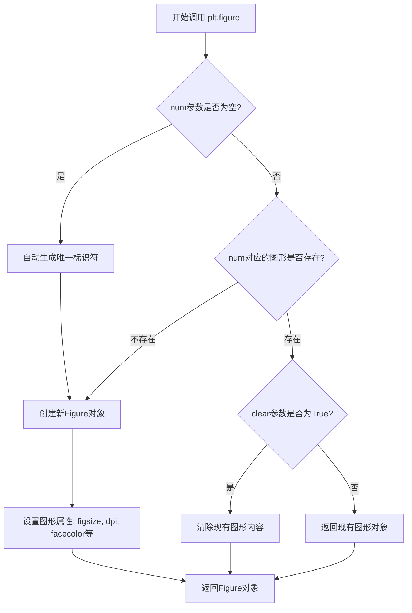
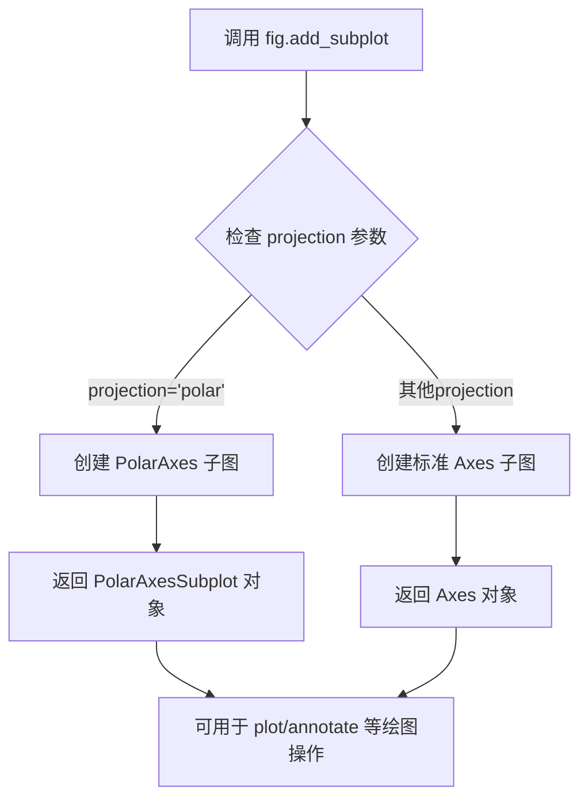
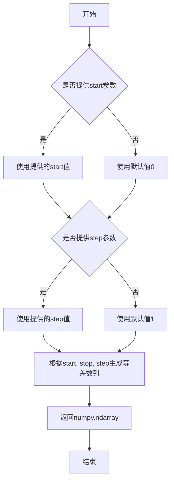
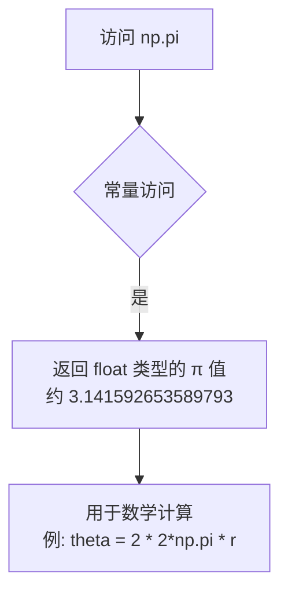
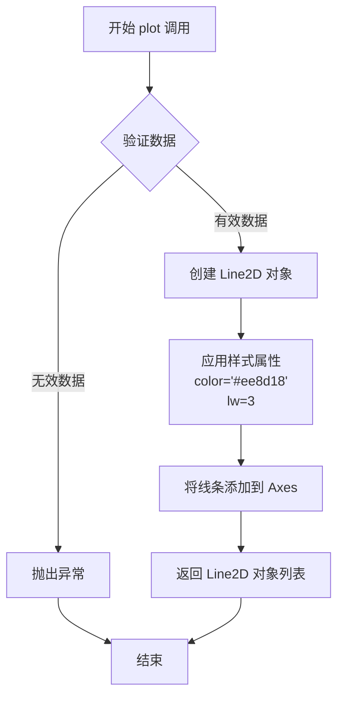
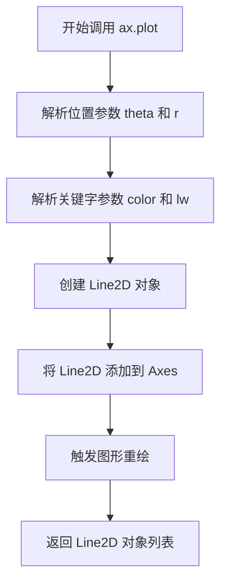
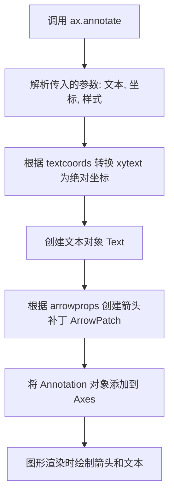
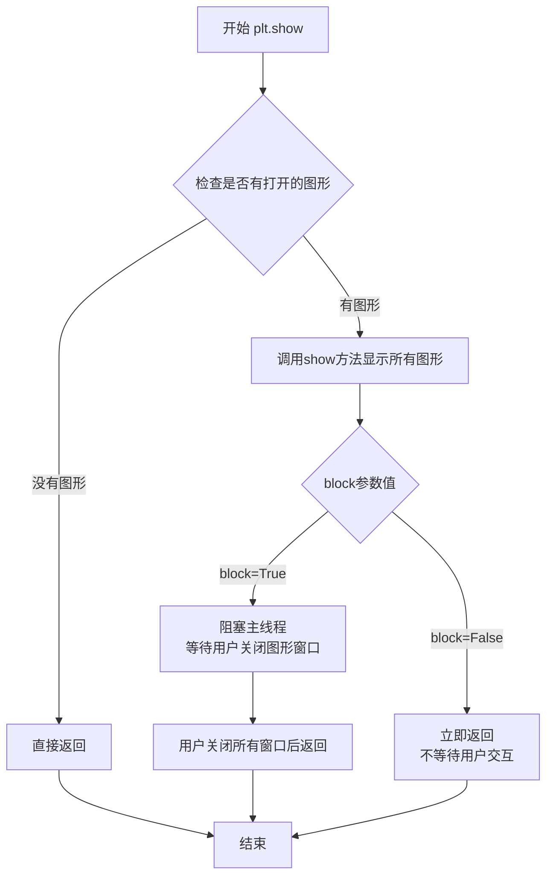

# `matplotlib\galleries\examples\text_labels_and_annotations\annotation_polar.py` 详细设计文档

该脚本演示了如何在matplotlib极坐标图上创建注释/标注，通过绘制一条螺旋线并在特定点添加箭頭注释来展示极坐标注释的功能。

## 整体流程

```mermaid
graph TD
    A[开始] --> B[创建图形窗口 fig]
    B --> C[添加极坐标子图 ax]
    C --> D[生成半径数组 r]
    D --> E[计算角度数组 theta]
    E --> F[绘制极坐标曲线]
    F --> G[选择注释点索引 ind=800]
    G --> H[获取注释点的r和theta值]
    H --> I[在注释点绘制标记圆点]
    I --> J[添加注释文本和箭头]
    J --> K[显示图形 plt.show()]
```

## 类结构

```
无类定义 (脚本级别代码)
仅使用 matplotlib.pyplot 和 numpy 模块
```

## 全局变量及字段


### `fig`
    
图形窗口对象，通过plt.figure()创建

类型：`matplotlib.figure.Figure`
    


### `ax`
    
极坐标子图对象，通过add_subplot添加的极坐标投影

类型：`matplotlib.projections.polar.PolarAxes`
    


### `r`
    
半径数组，从0到1，步长0.001，用于极坐标绘图

类型：`numpy.ndarray`
    


### `theta`
    
角度数组，基于r计算得出，用于极坐标绘图的极角

类型：`numpy.ndarray`
    


### `line`
    
绘制的曲线对象，由ax.plot返回的2D线条

类型：`matplotlib.lines.Line2D`
    


### `ind`
    
注释点的索引值(800)，用于定位需要标注的数据点

类型：`int`
    


### `thisr`
    
注释点的半径值，通过r[ind]获取

类型：`float`
    


### `thistheta`
    
注释点的角度值，通过theta[ind]获取

类型：`float`
    


    

## 全局函数及方法


### `plt.figure`

创建并返回一个新的图形窗口（Figure对象）。该函数是matplotlib中创建图形的核心函数，用于初始化一个空白的画布，后续可以在此画布上添加子图、绘制各种图表。

参数：

- `num`：`int` 或 `str` 或 `Figure`，可选，默认值为`None`。图形的唯一标识符。如果传入已存在的num，则会返回该图形而不是创建新图形；如果传入`None`，则自动生成一个递增的数字标识符。
- `figsize`：`tuple of (float, float)`，可选，默认值为`None`。图形的宽和高，单位为英寸，格式为`(宽度, 高度)`。
- `dpi`：`float`，可选，默认值为`None`。图形的分辨率（每英寸点数）。
- `facecolor`：`color`，可选，默认值为`None`。图形背景颜色，可以是颜色名称如`'white'`或十六进制颜色如`'#ffffff'`。
- `edgecolor`：`color`，可选，默认值为`None`。图形边框颜色。
- `frameon`：`bool`，可选，默认值为`True`。是否绘制图形边框。
- `FigureClass`：`class`，可选，默认值为`matplotlib.figure.Figure`。用于创建图形的自定义Figure类。
- `clear`：`bool`，可选，默认值为`False`。如果为`True`且图形已存在，则清除现有内容。
- `**kwargs`：任意关键字参数，其他参数将传递给Figure构造函数。

返回值：`matplotlib.figure.Figure`，新创建的图形窗口对象，后续可在该对象上添加子图（subplot）或其他图形元素。

#### 流程图



#### 带注释源码

```python
# plt.figure 函数源码分析（位于 matplotlib/pyplot.py 中）

def figure(
    # 图形的唯一标识符，可以是整数、字符串或已存在的Figure对象
    num: int | str | Figure | None = None,
    # 图形尺寸，宽度和高度，单位英寸
    figsize: tuple[float, float] | None = None,
    # 分辨率，每英寸像素点数
    dpi: float | None = None,
    # 背景颜色
    facecolor: str | tuple | None = None,
    # 边框颜色
    edgecolor: str | tuple | None = None,
    # 是否显示边框
    frameon: bool = True,
    # 自定义Figure类
    FigureClass: type[Figure] = Figure,
    # 是否清除已存在的图形
    clear: bool = False,
    # 其他关键字参数
    **kwargs
) -> Figure:
    """
    创建一个新的图形窗口
    
    参数:
        num: 图形的标识符，如果为None则自动生成
        figsize: 图形尺寸 (宽度, 高度) 单位英寸
        dpi: 分辨率
        facecolor: 背景颜色
        edgecolor: 边框颜色
        frameon: 是否绘制边框
        FigureClass: 用于创建图形的类
        clear: 是否清除已存在图形的内容
        **kwargs: 传递给Figure的其他参数
    
    返回:
        Figure: 新创建的图形对象
    """
    
    # 获取全局的图形管理器
    manager = _get_backend_mod().FigureManager
    if manager is None:
        # 如果没有可用的后端，抛出异常
        raise RuntimeError('No suitable backend available.')
    
    # 检查是否需要返回已存在的图形
    if num is not None and num in Gcf figs:
        # 如果图形已存在且clear为False，直接返回
        if not clear:
            return Gcf.figs[num]
        # 如果clear为True，获取现有图形并清除
        fig = Gcf.figs[num]
        if clear:
            fig.clear()
    else:
        # 创建新图形
        # 调用FigureClass创建Figure实例
        fig = FigureClass(
            figsize=figsize,
            dpi=dpi,
            facecolor=facecolor,
            edgecolor=edgecolor,
            frameon=frameon,
            **kwargs
        )
        # 将新图形注册到全局图形字典中
        Gcf.figs[num] = fig
    
    # 返回创建/获取的Figure对象
    return fig
```


### `Figure.add_subplot`

在 matplotlib 中，`Figure.add_subplot()` 方法用于向图形添加一个子图（Axes）。当传入 `projection='polar'` 参数时，该方法会创建一个极坐标投影的子图，用于绘制极坐标图（polar plot）。

参数：

- `*args`：可变位置参数，支持多种调用方式（如 `add_subplot(111)` 或 `add_subplot(1,1,1)`），用于指定子图位置
- `projection`：字符串类型，指定子图的投影类型。此处传入 `'polar'` 表示创建极坐标子图
- `polar`：布尔类型（可选），是否使用极坐标，默认 False
- `**kwargs`：关键字参数传递给底层 Axes 创建器

返回值：`matplotlib.axes.Axes`（具体为 `matplotlib.projections.polar.PolarAxesSubplot`），返回创建的子图对象

#### 流程图



#### 带注释源码

```python
# 创建图形对象
fig = plt.figure()

# 调用 Figure.add_subplot 方法添加极坐标子图
# 参数 projection='polar' 指定使用极坐标投影
# 这会创建一个 PolarAxesSubplot 对象而非普通的 Axes 对象
ax = fig.add_subplot(projection='polar')

# 返回的 ax 是一个极坐标子图对象
# 后续可以调用极坐标特有的方法，如：
# - ax.plot(theta, r) 绘制极坐标曲线
# - ax.annotate() 添加注释（坐标为 theta, r）

# 示例数据
r = np.arange(0, 1, 0.001)
theta = 2 * 2*np.pi * r

# 在极坐标子图上绘制线条
line, = ax.plot(theta, r, color='#ee8d18', lw=3)

# 获取特定点的极坐标
ind = 800
thisr, thistheta = r[ind], theta[ind]

# 标记该点
ax.plot([thistheta], [thisr], 'o')

# 添加极坐标注释
# xy 参数接受 (theta, r) 极坐标值
ax.annotate('a polar annotation',
            xy=(thistheta, thisr),  # theta, radius 极坐标
            xytext=(0.05, 0.05),    # figure fraction 文本位置
            textcoords='figure fraction',
            arrowprops=dict(facecolor='black', shrink=0.05),
            horizontalalignment='left',
            verticalalignment='bottom')

# 显示图形
plt.show()
```


### `numpy.arange`

创建等差数组（等间距的数值序列），返回NumPy的ndarray对象。

参数：

- `start`：`float` 或 `int`，起始值，默认为0
- `stop`：`float` 或 `int`，结束值（不包含）
- `step`：`float` 或 `int`，步长，默认为1

返回值：`numpy.ndarray`，包含等差数列的NumPy数组

#### 流程图



#### 带注释源码

```python
import numpy as np

# 使用np.arange创建等差数组
# 参数说明：
#   start=0: 起始值
#   stop=1:  结束值（不包含）
#   step=0.001: 步长（间隔）
r = np.arange(0, 1, 0.001)

# 生成的r是一个包含1000个元素的数组
# 值为 [0, 0.001, 0.002, 0.003, ..., 0.999]
# 数组类型为 float64
# 数组形状为 (1000,)

# 该数组可用于：
# - 极坐标计算：theta = 2 * 2 * np.pi * r
# - 绑定绘图：ax.plot(theta, r, ...)
# - 索引访问：r[ind] 获取特定位置的数值
```

#### 关键组件信息

- `numpy.arange`：NumPy库的核心函数，用于生成等差数列
- `numpy.ndarray`：NumPy数组对象，支持向量化操作

#### 潜在技术债务与优化空间

1. **浮点数精度问题**：当使用浮点数参数时，由于精度问题，数组长度可能与预期不完全一致
2. **内存效率**：对于大数据量，考虑使用`numpy.linspace`替代以获得更精确的数组长度控制
3. **类型统一**：可考虑显式指定dtype参数以控制数组类型，如`np.arange(0, 1, 0.001, dtype=np.float32)`

#### 设计与约束

- **设计目标**：提供简洁的等差数列生成功能
- **约束条件**：
  - step不能为0
  - 当start > stop且step > 0时，返回空数组
  - 数组不包含stop值（半开区间）


### `np.pi`

描述：`np.pi` 是 NumPy 库中的π常量，代表圆周率（约等于 3.141592653589793），在数学计算中用于表示圆的周长与直径的比值。该常量是一个浮点数类型的只读值，广泛应用于三角函数、极坐标转换等数学运算场景。

参数：此为常量，无参数

返回值：`float`，返回圆周率π的近似值（约 3.141592653589793）

#### 流程图



#### 带注释源码

```python
# 导入 numpy 库，通常以别名 'np' 引入
import numpy as np

# 在代码中使用 np.pi 常量
# 计算 theta 值：theta = 2 * 2 * π * r
# 这里的 np.pi 提供了圆周率常量，用于将半径 r 转换为极坐标角度 theta
r = np.arange(0, 1, 0.001)  # 生成从 0 到 1（不含）的数组，步长 0.001
theta = 2 * 2*np.pi * r     # 使用 np.pi 计算角度：4πr

# np.pi 的实际值约为 3.141592653589793
# 它是一个只读的浮点数常量，属于 numpy 模块的全局属性
# 源码位置：numpy/__init__.py 中定义，本质上是 math.pi 的别名
```


### `matplotlib.axes.Axes.plot`

在极坐标 axes 上绘制theta与r数据构成的曲线，并返回线条对象列表。

参数：

- `theta`：`array-like`，角度数据（弧度制），对应极坐标中的角度坐标
- `r`：`array-like`，半径数据，对应极坐标中的径向距离
- `color`：`str` 或 `tuple`，可选，线条颜色，代码中传入 `'#ee8d18'` 表示橙色
- `lw`：`float`，可选，线条宽度，代码中传入 `3` 表示3磅

返回值：`list`，返回包含 `Line2D` 对象的列表，代码中使用 `line, = ax.plot(...)` 解包获取线条对象

#### 流程图



#### 带注释源码

```python
# fig.add_subplot(projection='polar') 创建极坐标 axes
fig = plt.figure()
ax = fig.add_subplot(projection='polar')

# 生成半径数据：0到1，步长0.001
r = np.arange(0, 1, 0.001)

# 计算角度：2 * 2π * r
theta = 2 * 2*np.pi * r

# 调用 plot 方法绘制极坐标曲线
# 参数1: theta - 角度数组（弧度）
# 参数2: r - 半径数组
# 关键字参数: color 设定线条颜色为橙色
# 关键字参数: lw (line width) 设定线宽为3
line, = ax.plot(theta, r, color='#ee8d18', lw=3)
```

#### 补充说明

在代码示例中，`ax.plot()` 的核心作用是将参数方程 `theta = 4πr` 和 `r ∈ [0, 1]` 确定的极坐标曲线绘制出来。由于 `theta = 4πr`，当 `r` 从0增加到1时，`theta` 从0增加到 `4π`（即两周），因此会看到两条螺旋线（因为 `4π = 2 * 2π`）。这是Matplotlib在极坐标投影下绘制曲线的标准用法。


### `Axes.plot`

在极坐标 axes 上绘制数据点序列，生成折线图并返回 Line2D 对象列表。

参数：

- `theta`：array-like，对应的参数类型是 `numpy.ndarray` 或列表，表示角度数据（x 轴）
- `r`：array-like，对应的参数类型是 `numpy.ndarray` 或列表，表示半径数据（y 轴）
- `color`：str，对应的参数类型是 `str`（颜色代码），表示线条颜色
- `lw`：int，对应的参数类型是 `int`，表示线宽

返回值：`list of matplotlib.lines.Line2D`，返回一个包含 Line2D 对象的列表，每个对象代表一条绘制的线条。

#### 流程图



#### 带注释源码

```python
# 在极坐标轴上绘制数据
# 参数 theta: 角度数组（x 轴数据）
# 参数 r: 半径数组（y 轴数据）
# 参数 color: 线条颜色，使用十六进制颜色代码
# 参数 lw: 线宽，值为 3
line, = ax.plot(theta, r, color='#ee8d18', lw=3)
```


### `matplotlib.axes.Axes.annotate`

在极坐标轴上添加一个带有箭头的文本注释，用于高亮显示特定的数据点（此处为极坐标点），并指定文本在图形中的相对位置。

参数：

- `s`（位置参数 1）：`str`，要显示的注释文本内容，此处为 `'a polar annotation'`。
- `xy`（位置参数 2）：`tuple`，箭头指向的坐标点。在极坐标投影下，此处为 `(thistheta, thisr)`，即 (角度, 半径)。
- `xytext`：`tuple`，注释文本左上角的位置坐标，此处为 `(0.05, 0.05)`。
- `textcoords`：`str`，指定 `xytext` 参数的坐标系，此处为 `'figure fraction'`（表示坐标基于图形宽度的比例，范围 0-1）。
- `arrowprops`：`dict`，定义箭头的外观属性。此处使用 `dict` 配置了箭头颜色为黑色 (`'black'`) 和收缩系数 (`shrink=0.05`)，以避免箭头尖端插入数据点内部。
- `horizontalalignment`：`str`，文本相对于 `xytext` 点的水平对齐方式，此处为 `'left'`（左对齐）。
- `verticalalignment`：`str`，文本相对于 `xytext` 点的垂直对齐方式，此处为 `'bottom'`（底部对齐）。

返回值：`matplotlib.text.Annotation`，返回创建的注释对象实例。

#### 流程图



#### 带注释源码

```python
# 调用 matplotlib 的注释方法在 Axes 上添加标注
ax.annotate('a polar annotation',            # 参数1 s: 要显示的文本内容
            xy=(thistheta, thisr),            # 参数2 xy: 箭头指向的数据点坐标 (theta, radius)
            xytext=(0.05, 0.05),              # 参数3 xytext: 文本标签的起始位置 (图形宽高的百分比)
            textcoords='figure fraction',     # 参数4 textcoords: 声明 xytext 的坐标系统为 'figure fraction'
            arrowprops=dict(facecolor='black', # 参数5 arrowprops: 字典类型，定义箭头属性
                            shrink=0.05),    # shrink: 箭头两端收缩留白，避免遮挡
            horizontalalignment='left',       # 参数6: 文本在 xytext 处左对齐
            verticalalignment='bottom')        # 参数7: 文本在 xytext 处底部对齐
```


### `plt.show`

显示所有当前打开的图形窗口，调用该函数会阻塞程序执行直到用户关闭图形窗口（除非设置 `block=False`）。

参数：

- `block`：`bool`，可选参数。指定是否阻塞程序执行以等待用户交互。默认为 `True`，即阻塞直到图形窗口关闭；如果设为 `False`，则立即返回继续执行。

返回值：`None`，该函数不返回任何值。

#### 流程图



#### 带注释源码

```python
def show(*, block=None):
    """
    显示所有打开的图形窗口。
    
    参数:
        block: bool, optional
            如果为True（默认），阻塞程序直到所有图形窗口关闭。
            如果为False，立即返回。
            默认为None，此时行为取决于后端。
    """
    # 获取当前的后端模块
    global _show BLOCK_CACHE
    
    # 如果没有传入block参数，从后端获取默认行为
    if block is None:
        block = get_backend().show._block_default
    
    # 遍历所有打开的图形，调用其show方法
    for figure in get_pyplot().texts:
        # 获取FigureCanvasBase对象并调用show
        canvas = figure.canvas
        if canvas is not None:
            canvas.show()
    
    # 如果block为True，则阻塞等待
    if block:
        # 调用后端的show_and_block方法
        # 这会启动事件循环并等待用户交互
        return get_backend().show()
    
    # 如果block为False，立即返回
    return None
```


## 关键组件


### matplotlib.pyplot

Matplotlib的pyplot模块提供了类似于MATLAB的绘图接口，用于创建图形、轴和绘图元素。

### numpy

NumPy是Python的科学计算库，在这里用于生成极坐标图案的数据数组（r和theta）。

### 极坐标投影 (projection='polar')

Matplotlib的极坐标投影系统，将笛卡尔坐标系转换为极坐标系统，用于绘制极坐标图。

### 线条绘制 (ax.plot)

在极坐标轴上绘制螺旋线图案，接受角度(theta)和半径(r)作为参数。

### 注释功能 (ax.annotate)

在指定位置添加注释文本和箭头指向，支持多种坐标引用方式（figure fraction、data coordinates等）。

### 图形坐标变换

坐标系统包括data坐标、axes坐标和figure坐标，通过textcoords参数指定坐标参考系。

### 箭头属性配置 (arrowprops)

注释箭头的样式配置，控制箭头的颜色、收缩因子等视觉效果。


## 问题及建议


### 已知问题

- **硬编码的魔法数字和字符串**：颜色 `'#ee8d18'`、线宽 `3`、索引值 `ind = 800`、注释文本 `'a polar annotation'` 等均为硬编码，缺乏可配置性
- **缺乏参数化设计**：代码未封装为函数，无法通过参数自定义半径范围、采样密度、注释位置等，重复使用困难
- **索引越界风险**：固定使用 `ind = 800` 访问数组，若调整采样密度导致数组长度变化，将引发 `IndexError`
- **注释定位不灵活**：`xytext=(0.05, 0.05)` 使用固定的 figure fraction，在不同尺寸的图形上显示效果可能不一致
- **缺少输入验证**：未对数组长度、索引有效性进行校验
- **导入顺序不规范**：第三方库导入应在标准库之后
- **plt.show() 阻塞风险**：在某些后端或环境可能阻塞交互式使用

### 优化建议

- 将绘制逻辑封装为函数，接受颜色、线宽、注释文本、采样密度等参数
- 使用 `len(r) - 1` 或相对索引（如 `int(len(r) * 0.8)`）替代固定索引，避免越界
- 将魔法数字提取为具名常量或配置参数，提高可维护性
- 调整导入顺序为先标准库后第三方库
- 添加基本的错误处理和边界检查
- 考虑使用 `fig.savefig()` 替代或补充 `plt.show()` 以适应不同使用场景


## 其它


### 设计目标与约束

本示例代码的设计目标是演示如何在极坐标投影的图表上添加注释（annotation），帮助用户理解极坐标注释的功能和使用方法。约束条件包括：需要使用matplotlib库，需要创建极坐标投影，需要生成螺旋线数据，需要使用特定的注释属性如箭头props、坐标转换方式等。

### 错误处理与异常设计

代码主要依赖matplotlib和numpy库，运行时可能出现的异常包括：数据索引越界（ind=800时如果r数组长度不足会导致IndexError）、图形创建失败、注释坐标超出可视范围等。当前代码未显式处理异常，属于演示性质代码，生产环境应添加数据验证和异常捕获机制。

### 数据流与状态机

数据流：numpy生成0到1的等差数组r → 计算theta = 2 * 2π * r生成螺旋线角度 → matplotlib创建figure和polar axes → plot方法绘制螺旋线 → 提取特定点(ind=800)的数据 → annotate方法添加注释箭头 → show显示最终图形。状态机流程：初始化状态(创建figure) → 极坐标轴添加状态 → 数据绑定状态 → 注释绑定状态 → 渲染显示状态。

### 外部依赖与接口契约

主要依赖：matplotlib.pyplot（图形创建和显示）、matplotlib.figure（Figure对象）、matplotlib.axes（Axes对象含polar投影）、numpy（数值计算）。接口契约：plt.figure()返回Figure对象，fig.add_subplot(projection='polar')返回Axes对象，ax.plot()返回Line2D对象列表，ax.annotate()返回Annotation对象。

### 性能考虑

当前代码数据量较小（约1000个点），性能无明显问题。若数据量增大，可考虑：使用更少的采样点、使用set_data而非重新plot、注释渲染时可考虑延迟加载。极坐标转换计算量可忽略不计。

### 安全性考虑

代码不涉及用户输入、不包含敏感数据处理、不执行网络请求，安全性风险较低。生产环境中需注意matplotlib的savefig可能存在的路径遍历风险。

### 兼容性考虑

代码兼容matplotlib 3.x版本，极坐标投影功能在较老版本中可能存在细微差异。numpy兼容性良好。需要确保安装了matplotlib和numpy两个依赖包。

### 测试考虑

建议添加的测试项：验证figure和axes创建成功、验证螺旋线数据生成正确、验证注释对象成功创建且包含正确文本、验证指定索引位置的数据点存在、验证注释箭头属性设置正确。可使用pytest-mock或unittest模拟测试渲染输出。

    