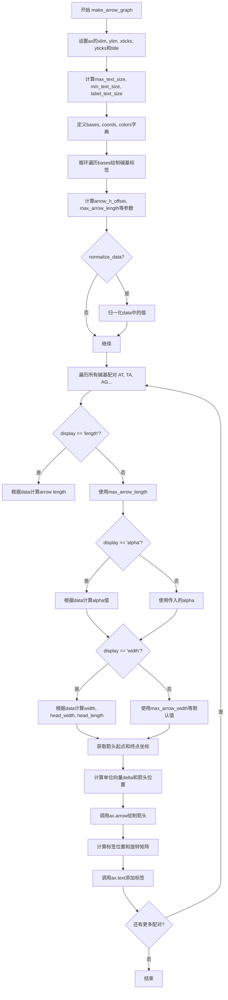

# `matplotlib\galleries\examples\text_labels_and_annotations\arrow_demo.py` 详细设计文档

该代码是一个matplotlib演示程序，用于绘制箭头图来可视化DNA碱基（A、T、G、C）之间的转移概率，支持通过箭头长度、宽度或透明度三种方式编码概率强度。

## 整体流程

```mermaid
graph TD
    A[开始] --> B[设置图表坐标轴范围和标题]
B --> C[初始化文本大小参数]
C --> D[定义碱基坐标和颜色字典]
D --> E{normalize_data?}
E -- 是 --> F[归一化数据]
E -- 否 --> G[跳过归一化]
F --> G
G --> H[遍历所有碱基对组合]
H --> I{确定箭头长度]
I --> J{确定箭头透明度}
J --> K{确定箭头宽度]
K --> L[计算箭头起点和方向]
L --> M[绘制箭头]
M --> N[计算标签位置]
N --> O[绘制标签]
O --> P{是否还有更多碱基对?}
P -- 是 --> H
P -- 否 --> Q[结束]
```

## 类结构

```
模块级
└── make_arrow_graph (函数)
```

## 全局变量及字段


### `bases`
    
DNA碱基字符集 'ATGC'

类型：`str`
    


### `coords`
    
碱基坐标映射 {'A': [0,1], 'T': [1,1], ...}

类型：`dict`
    


### `colors`
    
碱基颜色映射 {'A': 'r', 'T': 'k', ...}

类型：`dict`
    


### `arrow_h_offset`
    
箭头水平偏移量

类型：`float`
    


### `max_arrow_length`
    
最大箭头长度

类型：`float`
    


### `max_head_width`
    
最大箭头头部宽度

类型：`float`
    


### `max_head_length`
    
最大箭头头部长度

类型：`float`
    


### `sf`
    
箭头缩放因子

类型：`float`
    


### `max_val`
    
归一化前的最大概率值

类型：`float`
    


### `length`
    
当前箭头长度

类型：`float`
    


### `width`
    
当前箭头宽度

类型：`float`
    


### `head_width`
    
当前箭头头部宽度

类型：`float`
    


### `head_length`
    
当前箭头头部长度

类型：`float`
    


### `alpha`
    
当前箭头透明度

类型：`float`
    


### `cos`
    
箭头方向余弦值

类型：`float`
    


### `sin`
    
箭头方向正弦值

类型：`float`
    


### `x_pos`
    
箭头起点x坐标

类型：`float`
    


### `y_pos`
    
箭头起点y坐标

类型：`float`
    


### `orig_positions`
    
标签相对于箭头的位置

类型：`dict`
    


### `where`
    
标签位置类型 ('base' 或 'center')

类型：`str`
    


### `M`
    
旋转矩阵

类型：`ndarray`
    


### `data`
    
输入的概率数据

类型：`dict`
    


### `global function.make_arrow_graph`
    
绘制箭头图的函数，根据display参数用长度、宽度或透明度编码概率值

类型：`function`
    


### `make_arrow_graph.ax`
    
绘制图形的目标坐标轴对象

类型：`Axes`
    


### `make_arrow_graph.data`
    
包含碱基和转换概率的字典数据

类型：`dict`
    


### `make_arrow_graph.size`
    
图形尺寸（英寸）

类型：`float`
    


### `make_arrow_graph.display`
    
箭头属性编码方式 ('length', 'width', 'alpha')

类型：`str`
    


### `make_arrow_graph.shape`
    
箭头形状 ('full', 'left', 'right')

类型：`str`
    


### `make_arrow_graph.max_arrow_width`
    
箭头最大宽度（数据坐标）

类型：`float`
    


### `make_arrow_graph.arrow_sep`
    
箭头对之间的间距（数据坐标）

类型：`float`
    


### `make_arrow_graph.alpha`
    
箭头最大不透明度

类型：`float`
    


### `make_arrow_graph.normalize_data`
    
是否归一化数据

类型：`bool`
    


### `make_arrow_graph.ec`
    
箭头边缘颜色

类型：`str or None`
    


### `make_arrow_graph.labelcolor`
    
标签文字颜色

类型：`str or None`
    


### `make_arrow_graph.kwargs`
    
FancyArrow的额外属性参数

类型：`dict`
    
    

## 全局函数及方法


### `make_arrow_graph`

该函数用于在给定的matplotlib Axes上绘制一个箭头图，通过箭头长度、宽度或不透明度来编码数据值（如马尔可夫模型中的转移概率）。函数支持归一化数据、多种箭头形状以及自定义箭头样式。

参数：

- `ax`：`matplotlib.axes.Axes`，绘制图形的目标坐标轴对象
- `data`：`dict`，包含碱基和配对转换概率的字典，如{'A': 0.4, 'AT': 0.4, ...}
- `size`：`int` 或 `float`，图形尺寸，默认为4英寸
- `display`：`str`，指定使用箭头的哪个属性来显示数据，可选值包括'length'（长度）、'width'（宽度）、'alpha'（透明度），默认为'length'
- `shape`：`str`，箭头形状，可选'full'（完整箭头）、'left'（左半箭头）、'right'（右半箭头），默认为'right'
- `max_arrow_width`：`float`，箭头最大宽度，以数据坐标为单位，默认为0.03
- `arrow_sep`：`float`，箭头对之间的分离距离，以数据坐标为单位，默认为0.02
- `alpha`：`float`，箭头最大不透明度，默认为0.5
- `normalize_data`：`bool`，是否对数据进行归一化处理，默认为False
- `ec`：`str` 或 `None`，箭头的边缘颜色，默认为None（与填充色相同）
- `labelcolor`：`str` 或 `None`，标签文本的颜色，默认为None（与箭头颜色相同）
- `**kwargs`：其他关键字参数，会传递给`.FancyArrow`对象，如linewidth、edgecolor等

返回值：`None`，该函数直接在传入的ax对象上绘制图形，不返回任何值

#### 流程图



#### 带注释源码

```python
def make_arrow_graph(ax, data, size=4, display='length', shape='right',
                     max_arrow_width=0.03, arrow_sep=0.02, alpha=0.5,
                     normalize_data=False, ec=None, labelcolor=None,
                     **kwargs):
    """
    Makes an arrow plot.

    Parameters
    ----------
    ax
        The Axes where the graph is drawn.
    data
        Dict with probabilities for the bases and pair transitions.
    size
        Size of the plot, in inches.
    display : {'length', 'width', 'alpha'}
        The arrow property to change.
    shape : {'full', 'left', 'right'}
        For full or half arrows.
    max_arrow_width : float
        Maximum width of an arrow, in data coordinates.
    arrow_sep : float
        Separation between arrows in a pair, in data coordinates.
    alpha : float
        Maximum opacity of arrows.
    **kwargs
        `.FancyArrow` properties, e.g. *linewidth* or *edgecolor*.
    """

    # 设置坐标轴范围、刻度和标题
    ax.set(xlim=(-0.25, 1.25), ylim=(-0.25, 1.25), xticks=[], yticks=[],
           title=f'flux encoded as arrow {display}')
    
    # 根据size计算文本大小参数
    max_text_size = size * 12
    min_text_size = size
    label_text_size = size * 4

    # 定义碱基字符集
    bases = 'ATGC'
    # 定义每个碱基在图上的坐标位置
    coords = {
        'A': np.array([0, 1]),
        'T': np.array([1, 1]),
        'G': np.array([0, 0]),
        'C': np.array([1, 0]),
    }
    # 定义每个碱基对应的颜色
    colors = {'A': 'r', 'T': 'k', 'G': 'g', 'C': 'b'}

    # 循环遍历每个碱基，绘制碱基标签
    for base in bases:
        # 根据data中该碱基的值计算字体大小，使用平方根使差异更明显
        fontsize = np.clip(max_text_size * data[base]**(1/2),
                           min_text_size, max_text_size)
        # 在对应坐标位置绘制碱基标签
        ax.text(*coords[base], f'${base}_3$',
                color=colors[base], size=fontsize,
                horizontalalignment='center', verticalalignment='center',
                weight='bold')

    # 箭头水平偏移量，通过经验确定
    arrow_h_offset = 0.25  # data coordinates, empirically determined
    # 计算最大箭头长度
    max_arrow_length = 1 - 2 * arrow_h_offset
    # 计算箭头头部尺寸
    max_head_width = 2.5 * max_arrow_width
    max_head_length = 2 * max_arrow_width
    # 缩放因子，箭头最大代表这个数据坐标值
    sf = 0.6  # max arrow size represents this in data coords

    # 如果需要归一化数据
    if normalize_data:
        # 找到转换概率的最大值（键长度为2的项）
        max_val = max((v for k, v in data.items() if len(k) == 2), default=0)
        # 用最大值归一化，并乘以缩放因子
        for k, v in data.items():
            data[k] = v / max_val * sf

    # 遍历所有碱基对的组合（AT, TA, AG, GA, AC, CA, GT, TG, GC, CG）
    for pair in map(''.join, itertools.permutations(bases, 2)):
        # 根据display参数设置箭头长度
        if display == 'length':
            # 长度 = 头部 + (数据值/缩放因子) * (总长度 - 头部)
            length = (max_head_length
                      + data[pair] / sf * (max_arrow_length - max_head_length))
        else:
            # 不使用长度显示时，使用最大长度
            length = max_arrow_length
        
        # 根据display参数设置透明度
        if display == 'alpha':
            # 透明度 = min(数据值/缩放因子, 传入的alpha值)
            alpha = min(data[pair] / sf, alpha)
        
        # 根据display参数设置箭头宽度
        if display == 'width':
            scale = data[pair] / sf
            width = max_arrow_width * scale
            head_width = max_head_width * scale
            head_length = max_head_length * scale
        else:
            # 不使用宽度显示时，使用默认值
            width = max_arrow_width
            head_width = max_head_width
            head_length = max_head_length

        # 获取箭头颜色（使用pair的第一个字符对应的颜色）
        fc = colors[pair[0]]

        # 获取起点和终点坐标
        cp0 = coords[pair[0]]
        cp1 = coords[pair[1]]
        
        # 计算箭头方向的单位向量
        delta = cos, sin = (cp1 - cp0) / np.hypot(*(cp1 - cp0))
        
        # 计算箭头绘制位置（起点到终点的中点，减去长度的一半，再加上偏移）
        x_pos, y_pos = (
            (cp0 + cp1) / 2  # 中点
            - delta * length / 2  # 减去一半箭头长度
            + np.array([-sin, cos]) * arrow_sep  # 按arrow_sep向外偏移
        )
        
        # 调用ax.arrow绘制箭头
        ax.arrow(
            x_pos, y_pos, cos * length, sin * length,
            fc=fc, ec=ec or fc, alpha=alpha, width=width,
            head_width=head_width, head_length=head_length, shape=shape,
            length_includes_head=True,
            **kwargs
        )

        # 定义标签相对于箭头的位置
        orig_positions = {
            'base': [3 * max_arrow_width, 3 * max_arrow_width],
            'center': [length / 2, 3 * max_arrow_width],
            'tip': [length - 3 * max_arrow_width, 3 * max_arrow_width],
        }
        
        # 对角线箭头标签放底部，水平/垂直箭头标签放中间
        where = 'base' if (cp0 != cp1).all() else 'center'
        
        # 根据箭头方向计算旋转矩阵
        M = [[cos, -sin], [sin, cos]]
        
        # 计算最终标签位置
        x, y = np.dot(M, orig_positions[where]) + [x_pos, y_pos]
        
        # 格式化标签文本
        label = r'$r_{_{\mathrm{%s}}}$' % (pair,)
        
        # 在计算的位置绘制标签
        ax.text(x, y, label, size=label_text_size, ha='center', va='center',
                color=labelcolor or fc)
```

## 关键组件


### 箭头图绘制引擎 (make_arrow_graph 函数)

该函数是核心组件，负责在 Axes 上绘制箭头图，支持三种可视化方式（长度、宽度、透明度）来编码转移概率数据。

### 数据模型 (data 字典)

存储碱基('A', 'T', 'G', 'C')的单体概率和配对转换概率(如 'AT', 'TA' 等)，用于驱动箭头属性的计算。

### 坐标与颜色系统

定义了四个碱基的二维坐标位置('A': [0,1], 'T': [1,1], 'G': [0,0], 'C': [1,0])和对应的颜色映射('A':'r', 'T':'k', 'G':'g', 'C':'b')，构成箭头图的视觉基础。

### 三种显示模式 (display 参数)

支持 'length'、'width'、'alpha' 三种模式，分别通过箭头长度、宽度和透明度来可视化数据强度，提供了灵活的信息编码方式。

### 数据归一化模块 (normalize_data)

当启用时，计算所有配对转换概率的最大值并将所有数据缩放到 [0, sf] 范围内，确保不同量级的数据可在同一尺度上比较。

### 箭头几何计算组件

包含箭头位置计算、方向向量计算(head_width, head_length, width 等)、单位向量旋转矩阵等，用于精确定位和渲染每条箭头。

### 标签定位系统

根据箭头方向(对角线/水平/垂直)自动计算标签位置('base'/'center')，并通过旋转矩阵调整标签方向，确保标签始终与箭头对齐。

### 主程序入口 (if __name__ == '__main__')

创建测试数据并使用 subplot_mosaic 布局同时展示三种显示模式，是整个演示程序的入口点。


## 问题及建议


### 已知问题

- **硬编码的生物学参数**：碱基 `'ATGC'`、颜色映射 `{'A': 'r', 'T': 'k', 'G': 'g', 'C': 'b'}` 和坐标字典在函数内部硬编码，扩展性差，增加新碱基需修改多处代码
- **大量魔法数字**：`arrow_h_offset = 0.25`、`sf = 0.6`、`3 * max_arrow_width` 等数值缺乏注释或提取为具名常量，降低代码可读性和可维护性
- **缺少类型注解**：函数参数和返回值均无类型提示，影响静态分析和IDE自动补全
- **缺乏输入验证**：未检查 `data` 字典是否包含必需的键，若数据不完整会导致运行时 `KeyError`
- **职责过于集中**：`make_arrow_graph` 函数承担了数据处理、坐标计算、图形渲染等多重职责，违反单一职责原则
- **文档不完整**：docstring 中部分参数类型未明确标注（如 `ax`、`data`、`**kwargs`），返回值描述缺失
- **代码重复**：在 `display == 'width'` 分支中重复计算 `head_width` 和 `head_length` 的缩放版本
- **坐标计算复杂且难以测试**：箭头位置和文本位置的计算逻辑嵌套较深，包含矩阵运算和条件判断，难以独立单元测试

### 优化建议

- 将 `bases`、`colors`、`coords` 等配置提取为模块级常量或配置类，支持参数化传入
- 添加类型注解（`typing` 模块），为参数和返回值声明类型
- 在函数入口添加数据验证逻辑，检查必要键的存在性并给出友好错误提示
- 重构代码，将坐标计算、箭头绘制、文本绘制拆分为独立私有方法或函数
- 为所有魔法数字添加具名常量或配置文件，并补充必要注释
- 完善 docstring，明确参数类型、返回值含义及可能的异常
- 使用 dataclass 或 namedtuple 封装箭头配置对象，消除重复计算逻辑
- 考虑将 normalize_data 逻辑外部化，由调用方预处理数据，提高函数纯度

## 其它


### 设计目标与约束

该代码的设计目标是在二维坐标平面中可视化DNA碱基之间的转移概率，通过箭头的视觉属性（长度、宽度或透明度）来编码数值大小。设计约束包括：仅支持4种碱基（A、T、G、C）的两两组合显示，箭头必须从源碱基指向目标碱基，且必须使用matplotlib作为绘图引擎。图形坐标范围固定在(-0.25, 1.25)的正方形区域内，文本标签大小根据数据值动态调整。

### 错误处理与异常设计

代码中的错误处理主要体现在以下几个方面：normalize_data参数为True时，使用default=0来处理空数据情况，防止max()函数在空迭代器上报错。np.clip函数用于限制字体大小在min_text_size和max_text_size之间，避免字体过小或过大。kwargs参数允许传递额外的FancyArrow属性，但未对非法参数进行预校验。数据字典访问采用直接下标方式，若缺少必需的键（如'A'或'AT'）将抛出KeyError。

### 数据流与状态机

数据流从外部传入的data字典开始，经过可选的normalize_data处理后，进入箭头绘制循环。对于每对碱基组合，程序根据display参数选择三种渲染模式之一：length模式调整箭头长度，width模式调整箭头宽度和头部尺寸，alpha模式调整透明度。坐标计算流程为：计算单位向量→确定箭头中点→根据arrow_sep进行径向偏移→应用旋转矩阵定位文本标签。状态转换由display参数控制，三个状态相互独立。

### 外部依赖与接口契约

主要依赖包括：numpy提供数组操作和数学计算，matplotlib.pyplot用于图形创建和渲染，itertools提供排列组合生成。公开接口make_arrow_graph函数的契约如下：ax参数必须为matplotlib.axes.Axes对象，data参数必须为字典且包含4个单字符键和12个两字符键，display参数仅接受'length'、'width'、'alpha'三个字符串，shape参数仅接受'full'、'left'、'right'三个字符串。函数修改ax的属性但不返回任何值。

### 性能考虑与优化空间

当前实现对每对碱基组合都重新计算坐标和创建箭头对象，在数据量较大时可能存在性能瓶颈。优化方向包括：预计算所有碱基坐标和颜色映射表避免重复计算；将静态配置的max_text_size等常量在函数外部定义；考虑使用matplotlib.collections.LineCollection或PathCollection批量渲染替代循环创建箭头。箭头数量固定为12对（A、T、G、C的排列），性能问题当前不明显。

### 可测试性设计

函数设计为纯绘图函数，缺乏业务逻辑分离，导致单元测试困难。建议将坐标计算逻辑、数据归一化逻辑、箭头参数计算逻辑抽取为独立的纯函数模块。测试用例应覆盖：normalize_data为True/False的边界情况、display为length/width/alpha三种模式、shape为full/left/right三种形状、特殊角度（45度对角线）情况下的坐标计算准确性。

### 安全性考虑

代码未涉及用户输入处理或网络交互，安全性风险较低。但存在潜在的代码注入风险：labelcolor参数若被恶意控制，可能导致非预期属性注入到matplotlib的text对象中。建议对传入的kwargs参数进行类型和值校验，限制可设置的属性范围。

### 可维护性与扩展性

当前代码的扩展性受限：仅支持4个固定碱基、固定的坐标映射。若需扩展到更多节点（如氨基酸或密码子），需要大量修改coords字典和bases字符串。箭头标签格式r'$r_{_{\mathrm{%s}}}$' % (pair,)硬编码在函数内部，难以自定义。颜色方案也固定在colors字典中。建议将这些配置抽取为模块级常量或函数参数，提高灵活性。

### 配置管理与版本兼容性

代码依赖的numpy和matplotlib版本未在文档中声明。np.hypot函数在旧版numpy中可能行为不同，subplot_mosaic是matplotlib 3.3+新增功能。数据归一化使用sf = 0.6作为缩放因子，该magic number缺乏文档说明其物理意义。建议添加版本检查和依赖声明，或使用替代实现保证向后兼容。

### 关键组件信息

make_arrow_graph函数是核心组件，负责整个箭头图的生成逻辑。bases变量定义碱基集合，coords字典定义碱基的二维坐标映射，colors字典定义碱基和箭头的颜色方案。arrow_h_offset、max_arrow_width、arrow_sep等常量控制箭头的几何参数。itertools.permutations用于生成所有碱基对组合。

    