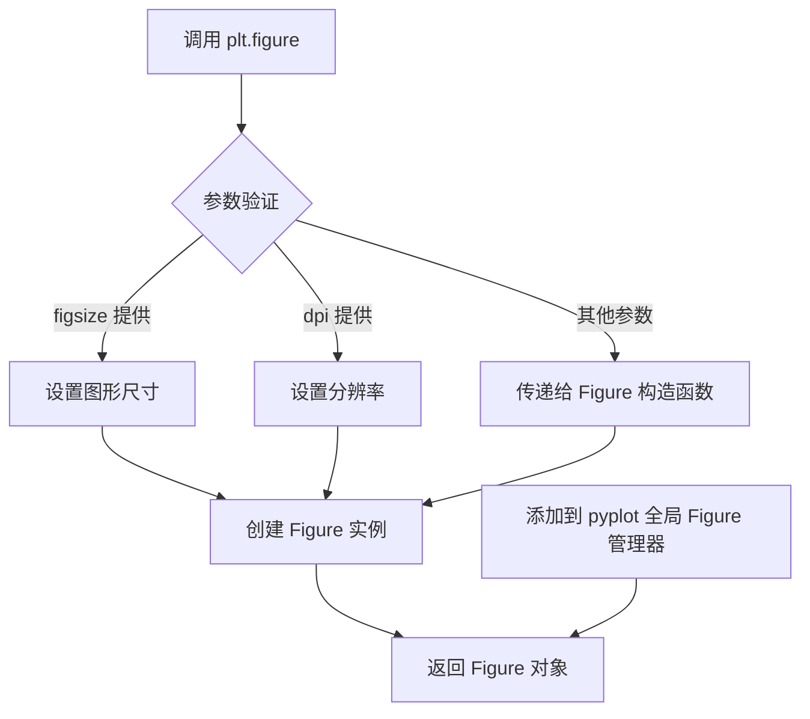
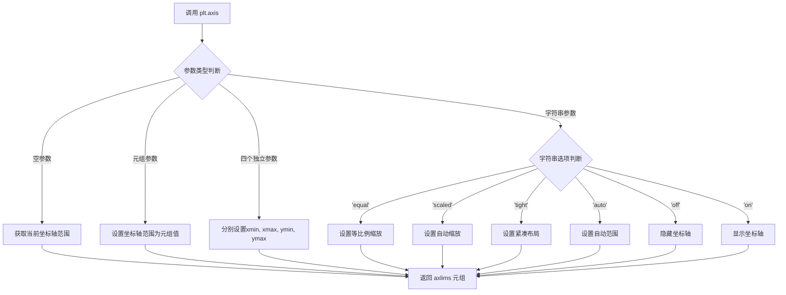
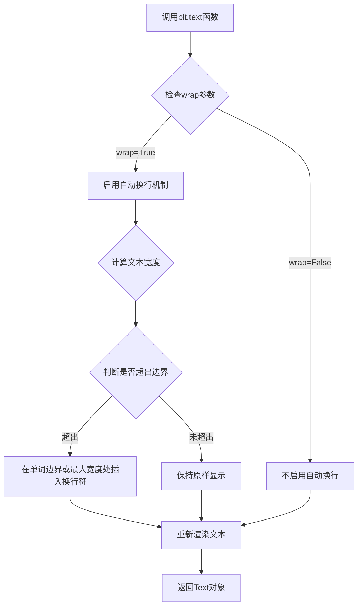
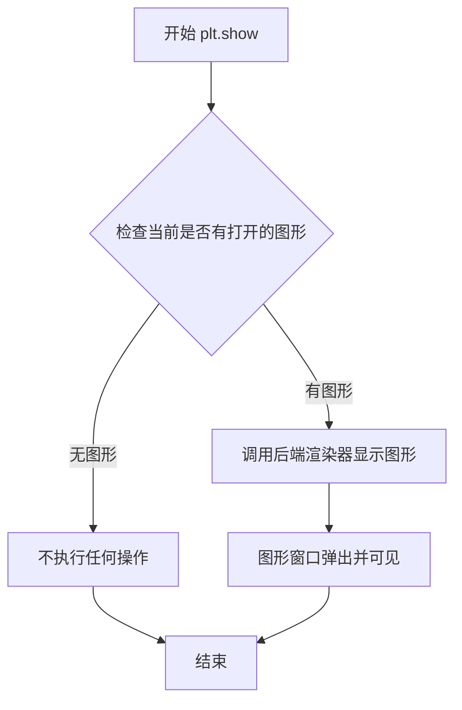

# `matplotlib\galleries\examples\text_labels_and_annotations\autowrap.py` 详细设计文档

该脚本是 Matplotlib 的一个使用示例，演示了如何利用 plt.text() 函数的 wrap=True 参数在图形中自动换行显示长文本，并配置了多种对齐方式、旋转角度和字体样式以展示不同的视觉效果。

## 整体流程

```mermaid
graph TD
    Start((开始)) --> A[plt.figure: 创建图形对象]
    A --> B[plt.axis: 设置坐标轴范围 (0, 10, 0, 10)]
    B --> C[定义变量 t: 长文本字符串]
    C --> D1[plt.text: 在 (4,1) 处绘制文本 (左对齐, 旋转15度)]
    C --> D2[plt.text: 在 (6,5) 处绘制文本 (左对齐, 旋转15度)]
    C --> D3[plt.text: 在 (5,5) 处绘制文本 (右对齐, 旋转-15度)]
    C --> D4[plt.text: 在 (5,10) 处绘制文本 (居中, 斜体, 大字号)]
    C --> D5[plt.text: 在 (3,4) 处绘制文本 (右对齐, 衬线体)]
    C --> D6[plt.text: 在 (-1,0) 处绘制文本 (左对齐, 旋转-15度)]
    D1 --> E[plt.show: 显示图形]
    D2 --> E
    D3 --> E
    D4 --> E
    D5 --> E
    D6 --> E
    E --> End((结束))
```

## 类结构

```
无用户自定义类 (仅作为脚本执行)
```

## 全局变量及字段


### `fig`
    
Matplotlib图形对象实例

类型：`matplotlib.figure.Figure`
    


### `t`
    
包含长文本内容的字符串变量

类型：`str`
    


    

## 全局函数及方法


### `plt.figure`

创建并返回一个新的 Figure 对象，作为 matplotlib 图形的基础容器，用于放置 Axes 和其他图形元素。

参数：

- `figsize`：`tuple of (float, float)`，可选，图形尺寸，格式为 (宽度, 高度)，单位为英寸
- `dpi`：`int`，可选，每英寸的点数（分辨率），默认值为 100
- `facecolor`：`str or tuple`，可选，图形背景颜色，可以是颜色名称如 'white' 或 RGB 元组如 (1, 1, 1)
- `edgecolor`：`str or tuple`，可选，图形边框颜色
- `linewidth`：`float`，可选，边框线宽
- `frameon`：`bool`，可选，是否显示边框，默认为 True
- `FigureClass`：`class`，可选，自定义 Figure 类，默认为 matplotlib.figure.Figure
- `clear`：`bool`，可选，如果为 True，则在创建前清除现有图形，默认为 False
- `**kwargs`：其他关键字参数，将传递给 Figure 构造函数

返回值：`matplotlib.figure.Figure`，返回新创建的 Figure 对象实例

#### 流程图



#### 带注释源码

```python
def figure(figsize=None, dpi=None, facecolor=None, edgecolor=None,
           linewidth=0, frameon=None, FigureClass=Figure, clear=False,
           **kwargs):
    """
    创建并返回新的 Figure 对象。
    
    参数:
        figsize: 图形尺寸 (宽, 高)，单位英寸
        dpi: 每英寸点数（分辨率）
        facecolor: 背景颜色
        edgecolor: 边框颜色
        linewidth: 边框线宽
        frameon: 是否显示边框
        FigureClass: Figure 类，默认使用 matplotlib.figure.Figure
        clear: 是否清除现有图形
        **kwargs: 传递给 Figure 构造函数的其他参数
    
    返回:
        Figure: 新创建的 Figure 对象
    """
    
    # 获取全局的 pyplot .figure 管理器
    # 如果不存在则创建新的
    global _figureManager
    
    # 如果设置了 clear=True，先清空当前图形
    if clear:
        # 清空现有内容
        pass
    
    # 创建 Figure 实例
    # 传入所有参数到 Figure 构造函数
    fig = FigureClass(
        figsize=figsize,
        dpi=dpi,
        facecolor=facecolor,
        edgecolor=edgecolor,
        linewidth=linewidth,
        frameon=frameon,
        **kwargs
    )
    
    # 将新创建的 Figure 注册到全局管理器
    _figureManager = FigureCanvasBase(fig)
    
    # 返回创建的 Figure 对象
    return fig
```


### `plt.axis`

设置坐标轴的视图范围和比例。该函数用于获取或设置坐标轴的范围和比例，可以接受多种参数形式来控制x轴和y轴的最小/最大值，或使用预设的字符串参数来自动调整坐标轴。

参数：

- `xmin`：`float`，x轴最小值（当作为四个独立参数传递时）
- `xmax`：`float`，x轴最大值（当作为四个独立参数传递时）
- `ymin`：`float`，y轴最小值（当作为四个独立参数传递时）
- `ymax`：`float`，y轴最大值（当作为四个独立参数传递时）
- `limits`：`tuple`，元组形式 `(xmin, xmax, ymin, ymax`
- `option`：`str`，字符串选项，包括 `'on'`/`'off'`（显示/隐藏坐标轴）、`'equal'`（等比例缩放）、`'scaled'`（自动缩放）、`'tight'`（紧凑布局）、`'auto'`（自动范围）、`'image'`（使用图像数据范围）、`'square'`（正方形区域）

返回值：`tuple`，返回 `(xmin, xmax, ymin, ymax)` 元组，表示当前坐标轴的视图范围

#### 流程图



#### 带注释源码

```python
import matplotlib.pyplot as plt

# 创建图形对象
fig = plt.figure()

# 设置坐标轴的视图范围
# 参数为元组形式 (xmin, xmax, ymin, ymax)
# x轴范围: 0 到 10
# y轴范围: 0 到 10
plt.axis((0, 10, 0, 10))

# 定义一个很长的文本字符串，用于演示自动换行功能
t = ("This is a really long string that I'd rather have wrapped so that it "
     "doesn't go outside of the figure, but if it's long enough it will go "
     "off the top or bottom!")

# 在不同位置添加文本，使用 wrap=True 启用自动换行
plt.text(4, 1, t, ha='left', rotation=15, wrap=True)
plt.text(6, 5, t, ha='left', rotation=15, wrap=True)
plt.text(5, 5, t, ha='right', rotation=-15, wrap=True)
plt.text(5, 10, t, fontsize=18, style='oblique', ha='center',
         va='top', wrap=True)
plt.text(3, 4, t, family='serif', style='italic', ha='right', wrap=True)
plt.text(-1, 0, t, ha='left', rotation=-15, wrap=True)

# 显示图形
plt.show()
```


### `plt.text`

在指定坐标位置添加文本内容，支持自动换行功能（wrap=True），允许用户自定义文本的字体、样式、对齐方式和旋转角度等属性。

#### 参数

-  `x`：`float`，文本插入的X轴坐标位置
-  `y`：`float`，文本插入的Y轴坐标位置
-  `s`：`str`，要显示的文本内容，可以是包含换行符的字符串
-  `fontdict`：`dict`（可选），字体属性字典，用于统一设置字体大小、颜色、样式等
-  `withdash`：`bool`（可选），是否使用破折号效果，默认为False
-  `**kwargs`：其他可选参数，包括：
  - `ha`/`horizontalalignment`：`str`，水平对齐方式（'left'、'center'、'right'）
  - `va`/`verticalalignment`：`str`，垂直对齐方式（'top'、'center'、'bottom'、'baseline'）
  - `rotation`：`float`，文本旋转角度（度）
  - `fontsize`/`size`：`int`，字体大小
  - `style`：`str`，字体样式（'normal'、'italic'、'oblique'）
  - `family`：`str`，字体族（'serif'、'sans-serif'、'monospace'等）
  - `wrap`：`bool`，是否启用自动换行，默认为False

#### 返回值

`matplotlib.text.Text`，返回创建的Text对象，可用于后续对文本进行进一步操作（如修改样式、获取位置等）

#### 流程图



#### 带注释源码

```python
import matplotlib.pyplot as plt

# 创建一个新的图形窗口
fig = plt.figure()

# 设置坐标轴范围：x轴0-10，y轴0-10
plt.axis((0, 10, 0, 10))

# 定义一个较长的文本字符串，用于演示换行功能
t = ("This is a really long string that I'd rather have wrapped so that it "
     "doesn't go outside of the figure, but if it's long enough it will go "
     "off the top or bottom!")

# 示例1：在坐标(4,1)处添加左对齐、旋转15度的可换行文本
plt.text(4, 1, t, ha='left', rotation=15, wrap=True)

# 示例2：在坐标(6,5)处添加左对齐、旋转15度的可换行文本
plt.text(6, 5, t, ha='left', rotation=15, wrap=True)

# 示例3：在坐标(5,5)处添加右对齐、逆时针旋转15度的可换行文本
plt.text(5, 5, t, ha='right', rotation=-15, wrap=True)

# 示例4：在坐标(5,10)处添加18号字体、斜体、居中对齐、顶部对齐的可换行文本
plt.text(5, 10, t, fontsize=18, style='oblique', ha='center',
         va='top', wrap=True)

# 示例5：在坐标(3,4)处添加serif字体、斜体、右对齐的可换行文本
plt.text(3, 4, t, family='serif', style='italic', ha='right', wrap=True)

# 示例6：在坐标(-1,0)处添加左对齐、逆时针旋转15度的可换行文本
plt.text(-1, 0, t, ha='left', rotation=-15, wrap=True)

# 显示图形
plt.show()
```

#### 关键组件信息

| 组件名称 | 一句话描述 |
|---------|-----------|
| `plt.figure()` | 创建并返回一个新的图形窗口/画布 |
| `plt.axis()` | 设置坐标轴的显示范围 |
| `plt.text()` | 在指定坐标位置添加支持自动换行的文本 |
| `plt.show()` | 显示所有创建的图形 |

#### 潜在的技术债务或优化空间

1. **硬编码文本字符串**：长文本字符串直接嵌入代码中，建议提取为常量或配置文件
2. **重复代码模式**：多次调用`plt.text()`存在重复参数，可通过封装函数减少代码冗余
3. **缺乏错误处理**：未对坐标超出范围、字体不支持等情况进行异常处理
4. **测试覆盖缺失**：没有单元测试验证文本换行的边界情况

#### 其它项目

**设计目标与约束**：
- 目标：演示matplotlib的`plt.text()`函数如何实现文本自动换行
- 约束：使用`bbox_inches='tight'`保存图片时，自动换行功能会失效

**错误处理与异常设计**：
- 当`wrap=True`但文本过短无法换行时，文本保持原样显示
- 坐标超出图表范围时，文本可能显示在可见区域外

**数据流与状态机**：
- 输入：坐标(x,y)、文本内容s、样式参数kwargs、wrap标志
- 处理：计算文本渲染宽度，与可用宽度比较，决定是否需要换行
- 输出：Text对象实例，包含位置、样式、内容等属性

**外部依赖与接口契约**：
- 依赖：matplotlib库
- 接口：matplotlib.pyplot模块的text函数，遵循标准的可选参数模式


### `plt.show`

`plt.show()` 是 Matplotlib 库中的一个函数，用于显式显示所有当前打开的图形窗口。在创建完图形并添加完所有内容后，调用此函数会将图形渲染并展示给用户。

参数：此函数无任何参数。

返回值：`None`，该函数不返回任何值，仅用于显示图形。

#### 流程图



#### 带注释源码

```python
# 导入 matplotlib.pyplot 模块，简写为 plt
import matplotlib.pyplot as plt

# 创建一个新的图形对象
fig = plt.figure()

# 设置坐标轴范围：(x_min, x_max, y_min, y_max)
plt.axis((0, 10, 0, 10))

# 定义一个很长的文本字符串，用于演示自动换行功能
t = ("This is a really long string that I'd rather have wrapped so that it "
     "doesn't go outside of the figure, but if it's long enough it will go "
     "off the top or bottom!")

# 在图形中添加多个文本对象，每个都有不同的样式和换行设置
plt.text(4, 1, t, ha='left', rotation=15, wrap=True)      # 左对齐，旋转15度
plt.text(6, 5, t, ha='left', rotation=15, wrap=True)      # 左对齐，旋转15度
plt.text(5, 5, t, ha='right', rotation=-15, wrap=True)    # 右对齐，旋转-15度
plt.text(5, 10, t, fontsize=18, style='oblique', ha='center',
         va='top', wrap=True)                             # 斜体，字号18，顶部居中
plt.text(3, 4, t, family='serif', style='italic', ha='right', wrap=True)  # 衬线字体，斜体
plt.text(-1, 0, t, ha='left', rotation=-15, wrap=True)    # 旋转-15度

# 关键函数：显示所有当前打开的图形窗口
# 此函数会调用底层后端（如 Qt、Tkinter、MacOSX 等）来创建图形窗口
# 并将之前创建的所有图形内容渲染到窗口中
plt.show()
```


## 关键组件


### Figure创建

使用matplotlib的figure()函数创建一个新的图形窗口，作为所有绘图元素的容器。

### 坐标轴设置

通过plt.axis()设置坐标轴的显示范围，定义x轴从0到10，y轴从0到10的二维平面区域。

### 文本渲染

使用plt.text()函数在指定位置渲染文本，支持多种参数配置如对齐方式(ha)、旋转角度(rotation)、字体样式(style)、字体族(family)等，是核心的文本显示组件。

### 文本自动换行功能

通过wrap=True参数启用文本自动换行功能，当文本超出图形边界时自动进行换行处理，避免文本显示超出坐标轴范围。

### 长字符串文本对象

定义了一个需要显示的长字符串变量t，包含多个句子，用于测试文本换行效果和边界处理能力。

### 图形显示

调用plt.show()函数将创建的图形渲染并显示到屏幕，是整个流程的最终输出环节。


## 问题及建议


### 已知问题

- **魔法数字与硬编码坐标**：文本位置坐标（4,1）、(6,5)、(5,5)等均为硬编码数值，缺乏配置化和可维护性
- **重复代码块**：长字符串变量`t`被重复定义6次，每次调用`plt.text()`时传入大量相似参数，导致代码冗余
- **变量命名不清晰**：`t`作为长文本变量名缺乏描述性，应使用如`long_text`等更具语义的名称
- **缺乏错误处理**：代码未包含任何异常捕获机制，无法处理潜在的图形渲染异常
- **缺少图形配置**：未设置图形尺寸（`figsize`），可能导致在不同环境下文本换行效果不一致
- **可访问性不足**：未显式设置文本颜色，可能在某些背景色下可读性差
- **紧密度与换行冲突**：代码注释中已提及`bbox_inches='tight'`与`wrap=True`不兼容的已知限制，但未提供解决方案或替代实现
- **紧耦合设计**：所有配置紧密耦合在单个代码块中，难以复用或单元测试
- **缺少布局自适应**：固定坐标在窗口大小变化时可能导致文本重叠或溢出

### 优化建议

- 将长文本字符串提取为模块级常量，坐标参数配置化为字典或配置类
- 使用面向对象方式封装文本渲染逻辑，创建`TextBox`或类似辅助类管理样式配置
- 为关键代码块添加`try-except`异常处理，提升健壮性
- 显式设置`figsize`和文本颜色参数，确保跨平台一致性
- 考虑使用`textwrap`模块预处理长文本，或封装为独立函数以增强灵活性
- 添加类型注解提升代码可读性和IDE支持

## 其它


### 设计目标与约束

本代码示例旨在展示matplotlib库中的文本自动换行（wrap）功能，帮助开发者理解如何在图表中正确使用长文本。主要约束包括：1）Auto-wrapping不与savefig的bbox_inches='tight'参数兼容；2）文本在某些情况下可能仍会略微超出坐标轴边界；3）该功能主要适用于静态图像展示场景。

### 错误处理与异常设计

代码本身未包含显式的错误处理逻辑。在实际应用中，应注意：1）当文本内容为空或长度为零时，wrap参数仍然有效但无实际效果；2）如果文本长度超过图形区域，可能仍会出现显示问题；3）plt.show()在某些后端（如TkAgg、Agg）可能抛出显示相关异常，需做好异常捕获。

### 外部依赖与接口契约

本代码依赖matplotlib>=1.5.0版本（wrap参数支持）。主要接口为plt.text()函数，其关键参数包括：x、y（文本位置）、s（文本内容）、wrap（布尔值，启用自动换行）、ha（水平对齐）、va（垂直对齐）、rotation（旋转角度）等。返回值是Text对象，可进一步用于样式修改。

### 数据流与状态机

代码执行流程为：创建Figure对象 → 设置坐标轴范围 → 调用plt.text()多次添加带wrap属性的文本对象 → 调用plt.show()渲染显示。状态转换：初始状态（空图形）→ 文本添加状态（多个Text对象）→ 显示状态（渲染完成）。无复杂状态机设计。

### 性能考虑与优化空间

当前代码性能可接受，但优化空间包括：1）如果需要显示大量带换行的文本，建议预先计算文本换行位置而非依赖自动换行；2）对于复杂场景，可使用Text对象的set_wrap()方法动态控制换行；3）plt.text()每次调用都会创建新对象，大量调用时应考虑缓存复用。

### 安全性与边界条件

安全性方面无特殊风险。边界条件包括：1）wrap=True在文本极短时无明显效果；2）当图形尺寸过小（如宽度小于单个字符宽度）时，换行可能失效；3）不同字体和字体大小会影响换行计算结果。

### 可测试性设计

由于这是示例代码，缺乏单元测试。实际项目中应测试：1）不同文本长度下的换行行为；2）不同图形尺寸下的显示效果；3）savefig与wrap参数的兼容性；4）不同后端（AGG、PDF、SVG）下的渲染一致性。

### 配置与扩展性

当前代码硬编码了所有参数。扩展建议：1）可将文本内容、位置、样式提取为配置参数；2）可封装为函数，接受文本列表和样式配置；3）可结合matplotlib rcParams全局设置默认换行参数；4）可扩展支持基于字符数或像素宽度的自定义换行逻辑。

### 平台与兼容性

代码兼容支持matplotlib的所有平台（Windows、Linux、macOS）。与IPython/Jupyter集成时需注意inline后端默认使用bbox_inches='tight'，会影响换行效果。Python版本要求为Python 3.6+。

### 文档与注释

代码包含模块级文档字符串，解释了auto-wrap的限制场景。类和方法级别的文档建议补充：1）每个plt.text()调用应说明为何选择特定位置和样式；2）复杂项目中应使用docstring描述wrap参数的具体行为；3）应添加示例说明wrap参数的工作原理。


    