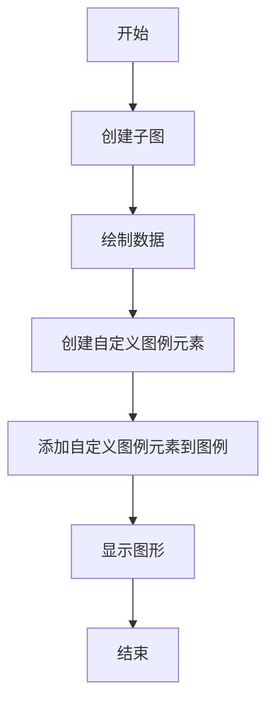
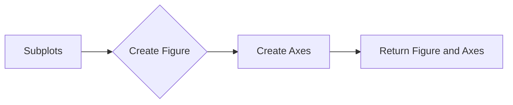
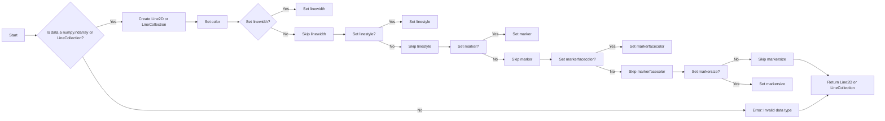

# `matplotlib\galleries\examples\text_labels_and_annotations\custom_legends.py` 详细设计文档

This code generates custom legends for plots in Matplotlib by creating custom legend elements and associating them with plot data.

## 整体流程



## 类结构

```
matplotlib.pyplot (matplotlib模块)
├── plt.subplots()
│   ├── fig
│   └── ax
├── plt.show()
└── matplotlib.lines.Line2D
    └── custom_lines
```

## 全局变量及字段


### `N`
    
Number of data points to generate for plotting.

类型：`int`
    


### `data`
    
2D array containing the data points to be plotted.

类型：`numpy.ndarray`
    


### `cmap`
    
Colormap to be used for plotting.

类型：`matplotlib.colors.Colormap`
    


### `mpl`
    
Matplotlib module.

类型：`matplotlib`
    


### `np`
    
NumPy module.

类型：`numpy`
    


### `fig`
    
Figure object created for plotting.

类型：`matplotlib.figure.Figure`
    


### `ax`
    
Axes object on which the plot is drawn.

类型：`matplotlib.axes._subplots.AxesSubplot`
    


### `lines`
    
List of Line2D objects representing the plotted lines.

类型：`list of matplotlib.lines.Line2D`
    


### `custom_lines`
    
List of Line2D objects used to create a custom legend.

类型：`list of matplotlib.lines.Line2D`
    


### `legend_elements`
    
List of Line2D and Patch objects used to create a custom legend.

类型：`list of matplotlib.lines.Line2D or matplotlib.patches.Patch`
    


### `Line2D.color`
    
Color of the line.

类型：`str`
    


### `Line2D.lw`
    
Line width of the line.

类型：`float`
    


### `Line2D.label`
    
Label for the legend item.

类型：`str`
    


### `Patch.facecolor`
    
Face color of the patch.

类型：`str`
    


### `Patch.edgecolor`
    
Edge color of the patch.

类型：`str`
    
    

## 全局函数及方法


### plt.subplots

`plt.subplots` 是 Matplotlib 库中的一个函数，用于创建一个图形和轴（axes）的实例。

参数：

- `figsize`：`tuple`，图形的大小（宽度和高度），默认为 (6, 4)。
- `dpi`：`int`，图形的分辨率，默认为 100。
- `facecolor`：`color`，图形的背景颜色，默认为白色。
- `edgecolor`：`color`，图形的边缘颜色，默认为 None。
- `frameon`：`bool`，是否显示图形的边框，默认为 True。
- `num`：`int`，轴的数量，默认为 1。
- `gridspec_kw`：`dict`，用于定义网格的参数，默认为 None。
- `constrained_layout`：`bool`，是否启用约束布局，默认为 False。

返回值：`Figure`，图形对象；`Axes`，轴对象。

#### 流程图



#### 带注释源码

```python
import matplotlib.pyplot as plt

fig, ax = plt.subplots()
```


### plt.show()

显示当前图形。

参数：

- 无

返回值：无

#### 流程图

```mermaid
graph LR
A[开始] --> B{调用plt.show()}
B --> C[结束]
```

#### 带注释源码

```python
plt.show()
```

该函数用于显示当前图形。在代码中，它被用于在绘制完图形后显示图形窗口。在上述代码中，`plt.show()` 被调用以显示由 `ax.legend()` 创建的图例和 `ax.plot()` 绘制的线条。函数没有参数，也没有返回值，它只是执行显示图形的操作。


### ax.plot

`ax.plot` 是一个用于在 Matplotlib 图形轴上绘制线条的函数。

参数：

- `data`：`numpy.ndarray` 或 `matplotlib.collections.LineCollection`，表示要绘制的线条数据。
- `color`：`str` 或 `color`，表示线条的颜色。
- `linewidth`：`float`，表示线条的宽度。
- `linestyle`：`str`，表示线条的样式。
- `marker`：`str` 或 `matplotlib.markers.MarkerStyle`，表示线条端点的标记样式。
- `markerfacecolor`：`str` 或 `color`，表示标记的颜色。
- `markersize`：`float`，表示标记的大小。

返回值：`matplotlib.lines.Line2D` 或 `matplotlib.collections.LineCollection`，表示绘制的线条对象。

#### 流程图



#### 带注释源码

```python
import matplotlib.pyplot as plt
import numpy as np

fig, ax = plt.subplots()
lines = ax.plot(data, color='blue', linewidth=2, linestyle='-', marker='o', markerfacecolor='red', markersize=5)
```


### ax.legend()

`ax.legend()` 是一个 Matplotlib 函数，用于在图表中添加图例。

参数：

- `handles`：`list`，包含用于创建图例的 Matplotlib 组件，如 Line2D、Patch 等。
- `labels`：`list`，包含与 `handles` 对应的标签。
- `loc`：`str` 或 `int`，指定图例的位置。

返回值：`Legend` 对象，表示添加到图表中的图例。

#### 流程图

```mermaid
graph LR
A[Start] --> B{Call ax.legend()}
B --> C[End]
```

#### 带注释源码

```python
ax.legend(custom_lines, ['Cold', 'Medium', 'Hot'])
```

在这个例子中，`custom_lines` 是一个包含 Line2D 对象的列表，每个对象代表图例中的一个条目。`['Cold', 'Medium', 'Hot']` 是与 `custom_lines` 对应的标签列表。函数调用 `ax.legend()` 将在图表中添加一个图例，其中包含三个条目，分别对应于 'Cold'、'Medium' 和 'Hot'。


### Line2D.__init__

初始化一个Line2D对象，用于创建图例中的线条。

参数：

- `xdata`：`array_like`，线条的x坐标数据。
- `ydata`：`array_like`，线条的y坐标数据。
- `color`：`color`，线条的颜色。
- `linewidth`：`float`，线条的宽度。
- `linestyle`：`str`，线条的样式，如'-'、'--'、'-.'等。
- `marker`：`str`，线条的标记样式，如'o'、's'等。
- `markerfacecolor`：`color`，标记的颜色。
- `markersize`：`float`，标记的大小。
- `label`：`str`，线条的标签。

返回值：`None`，无返回值。

#### 流程图


#### 带注释源码

```python
from matplotlib.lines import Line2D

def create_legend_line(xdata, ydata, color, linewidth, linestyle, marker, markerfacecolor, markersize, label):
    custom_line = Line2D(xdata, ydata, color=color, linewidth=linewidth, linestyle=linestyle, marker=marker,
                         markerfacecolor=markerfacecolor, markersize=markersize, label=label)
    return custom_line
``` 


## 关键组件


### 张量索引与惰性加载

张量索引与惰性加载允许在处理大型数据集时，只加载和处理需要的数据部分，从而提高效率。

### 反量化支持

反量化支持使得代码能够处理非整数类型的量化数据，增加了代码的通用性和灵活性。

### 量化策略

量化策略定义了如何将浮点数数据转换为固定点数表示，以减少计算资源消耗，提高运行效率。


## 问题及建议


### 已知问题

-   **代码重复**：在创建自定义图例时，代码中多次重复了创建子图和线条对象的步骤。这可以通过将这部分代码封装成函数来减少重复。
-   **全局变量**：代码中使用了全局变量 `mpl` 和 `cycler`，这可能导致代码的可读性和可维护性降低。建议将这些变量作为参数传递给函数。
-   **硬编码**：代码中硬编码了一些值，如颜色映射和线条宽度，这限制了代码的灵活性。建议使用参数化来允许用户自定义这些值。

### 优化建议

-   **封装函数**：将创建子图、线条对象和图例的代码封装成函数，以提高代码的可重用性和可维护性。
-   **参数化**：允许用户通过参数来指定颜色映射、线条宽度、图例元素等，以提高代码的灵活性。
-   **文档化**：为每个函数和参数提供清晰的文档说明，以便其他开发者能够理解和使用代码。
-   **异常处理**：增加异常处理来确保代码在遇到错误输入时能够优雅地处理。
-   **代码风格**：遵循一致的代码风格指南，以提高代码的可读性。


## 其它


### 设计目标与约束

- 设计目标：提供一种灵活的方式来创建自定义图例，不依赖于数据本身。
- 约束条件：必须使用Matplotlib库中的对象来创建图例，且图例应与数据解耦。

### 错误处理与异常设计

- 错误处理：确保在创建图例时，如果传入的Matplotlib对象无效，则抛出异常。
- 异常设计：定义自定义异常类，如`InvalidLegendObjectError`，以提供更清晰的错误信息。

### 数据流与状态机

- 数据流：数据从Matplotlib对象（如Line2D、Patch等）流向图例创建函数。
- 状态机：图例创建函数根据传入的对象类型和属性，决定如何构建图例。

### 外部依赖与接口契约

- 外部依赖：依赖于Matplotlib库和NumPy库。
- 接口契约：定义Matplotlib对象和NumPy数组的接口规范，确保兼容性和互操作性。


    