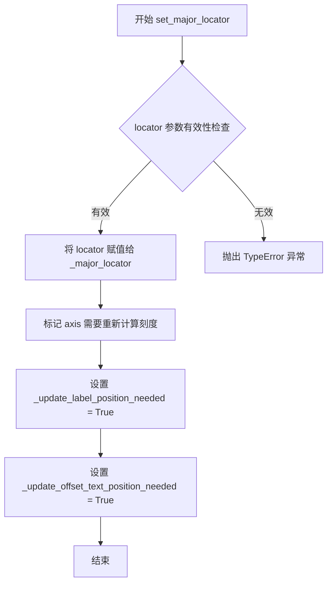
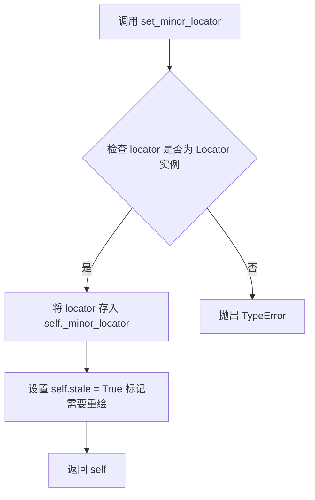
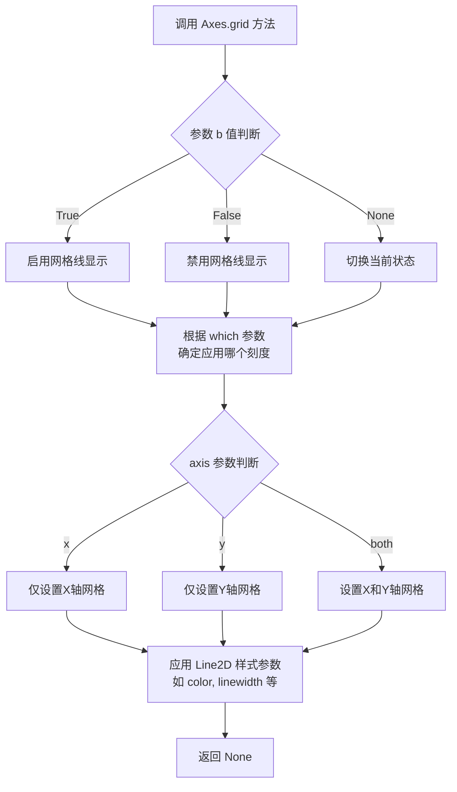
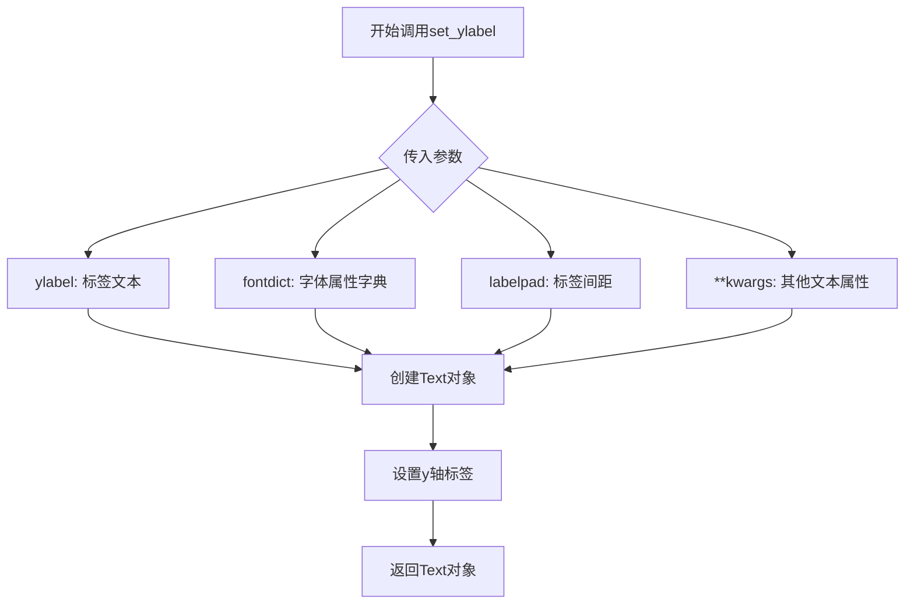
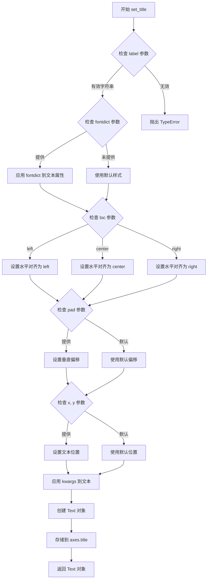
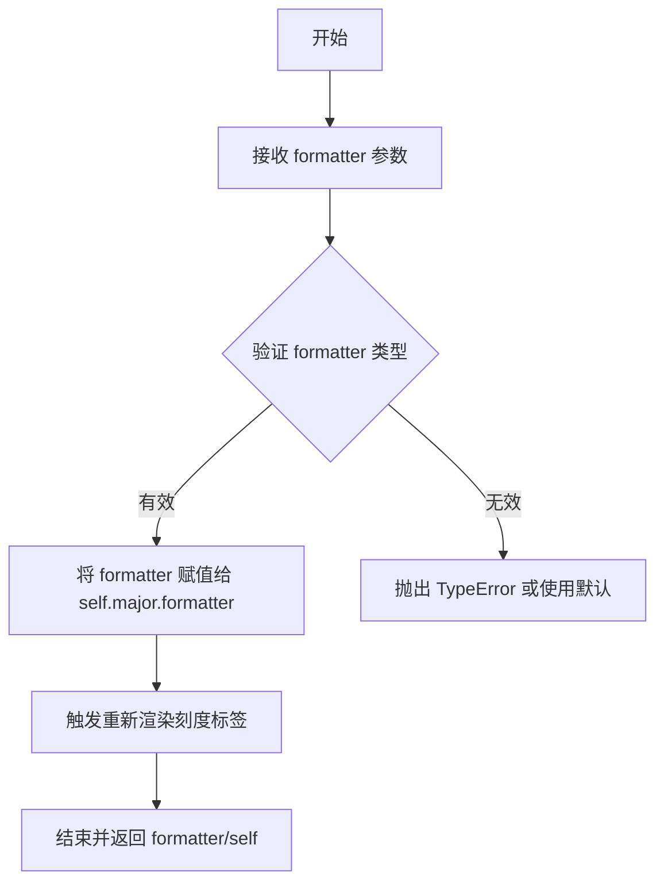
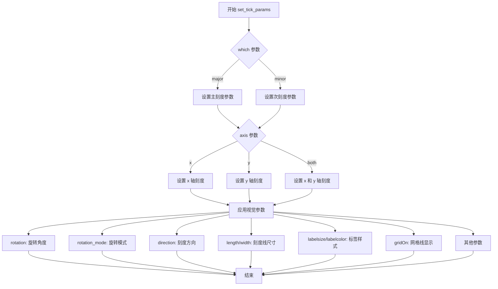

# `matplotlib\galleries\examples\text_labels_and_annotations\date.py` 详细设计文档

该脚本使用matplotlib绘制Google股票价格随时间变化的折线图，并演示了三种不同的日期轴标签格式化方式：默认格式化器、简洁格式化器和手动格式化器，以展示日期刻度标签的多样化呈现。

## 整体流程

```mermaid
graph TD
    A[导入模块: matplotlib.pyplot, matplotlib.cbook, matplotlib.dates] --> B[加载数据: cbook.get_sample_data]
    B --> C[创建子图: plt.subplots(3,1)]
    C --> D[循环遍历每个子图]
    D --> E[绘制数据线: ax.plot]
    E --> F[设置主刻度定位器: mdates.MonthLocator]
    F --> G[设置副刻度定位器: mdates.MonthLocator]
    G --> H[设置网格和Y轴标签]
    H --> I{子图索引?}
    I -- 0 --> J[应用默认格式化器]
    I -- 1 --> K[应用ConciseDateFormatter]
    I -- 2 --> L[应用手动DateFormatter并旋转标签]
    J --> M[显示图表: plt.show]
    K --> M
    L --> M
```

## 类结构

```
无自定义类层次结构
使用的外部类:
├── matplotlib.dates.MonthLocator (刻度定位器)
├── matplotlib.dates.ConciseDateFormatter (格式化器)
├── matplotlib.dates.DateFormatter (格式化器)
└── matplotlib.axes.Axes (坐标轴对象)
```

## 全局变量及字段


### `data`
    
从goog.npz加载的股票价格数据，包含date、open、high、low、close、volume、adj_close等字段的numpy记录数组

类型：`numpy.ndarray (record array)`
    


### `fig`
    
matplotlib创建的整个图形窗口对象，包含所有子图

类型：`matplotlib.figure.Figure`
    


### `axs`
    
包含3个Axes子对象的数组，每个元素对应一个子图

类型：`numpy.ndarray of matplotlib.axes.Axes`
    


### `ax`
    
在循环中迭代当前操作的子图对象，用于设置各个子图的属性

类型：`matplotlib.axes.Axes`
    


    

## 全局函数及方法


### `matplotlib.axes.Axes.plot`

该方法是 `matplotlib.axes.Axes` 类的核心绘图接口，用于将 y（以及可选的 x）数据以线段和/或标记的形式绘制在二维坐标轴上，并返回一个包含 `matplotlib.lines.Line2D` 实例的列表。

参数：

- `*args`：`tuple`，可变位置参数，内部可包含 `x`、`y`、`fmt`、`data`，其中  
  - `x`：`array‑like`，可选，横坐标数据，默认生成 `0 … len(y)-1`。  
  - `y`：`array‑like`，必需，纵坐标数据。  
  - `fmt`：`str`，可选，格式字符串（如 `'ro-'`），用于一次性指定线型、标记和颜色。  
  - `data`：`object`，可选，提供命名数据的容器（如 `pandas.DataFrame`）。
- `**kwargs`：`dict`，可变关键字参数，用于设置 `Line2D` 对象的属性，常用参数包括 `color`、`linewidth`、`linestyle`、`marker`、`markersize`、`markerfacecolor`、`label`、`zorder` 等。

返回值：`list[matplotlib.lines.Line2D]`，返回已添加到 Axes 的线条对象列表，调用者通常使用该列表对线条进行进一步样式或属性修改。

#### 流程图

```mermaid
flowchart TD
    A[调用 plot 方法] --> B[解析位置参数 *args]
    B --> C{是否显式提供 x 参数?}
    C -->|否| D[生成默认 x: 0 … len(y)-1]
    C -->|是| E[使用传入的 x]
    D --> F[解析可选的格式字符串 fmt]
    E --> F
    F --> G[根据 fmt 与 **kwargs 构造 Line2D 对象]
    G --> H[调用 add_line 将 Line2D 加入 Axes]
    H --> I[执行 autoscale_view 更新坐标轴范围]
    I --> J[返回 Line2D 列表]
```

#### 带注释源码

```python
def plot(self, *args, **kwargs):
    """
    Plot y versus x as lines and/or markers.

    Call signature::

        plot([x], y, [fmt], data=None, [**kwargs])

    Parameters
    ----------
    *args : tuple
        可变位置参数，内部解析顺序为 [x]、y、[fmt]、data。
    **kwargs : dict
        关键字参数，用于设置 Line2D 的属性（如 color、linewidth、marker 等）以及
        Axes 的属性（如 label、zorder）。

    Returns
    -------
    list of matplotlib.lines.Line2D
        已添加到当前 Axes 的线条对象列表。
    """
    # 1. 获取内部的“LineBuilder”，负责把 *args、**kwargs 转换为 Line2D 实例
    #    _get_lines() 返回一个可调用对象，它的内部实现会解析参数并生成线条。
    line_builder = self._get_lines()

    # 2. 通过 line_builder 生成一条或多条 Line2D 对象（通常为列表）
    lines = line_builder(*args, **kwargs)

    # 3. 将每条线条显式地加入到 Axes 中，Axes 会维护一个 .lines 列表
    for line in lines:
        self.add_line(line)

    # 4. 自动调整坐标轴的显示范围，使新加入的线条完整可见
    self.autoscale_view()

    # 5. 返回创建的 Line2D 对象，供调用者进一步修改或查询
    return lines
```


### `matplotlib.axes.Axes.xaxis.set_major_locator`

设置X轴的主刻度定位器（Major Tick Locator），用于确定主刻度的位置和间隔。该方法是 matplotlib.axis.Axis 类的方法，通过 `Axes.xaxis` 属性访问，用于控制坐标轴上主刻度的自动定位逻辑。

参数：

- `locator`：`matplotlib.ticker.Locator`，刻度定位器对象，定义了如何计算主刻度的位置。常见的定位器包括 `MaxNLocator`、`AutoLocator`、`MonthLocator`、`YearLocator` 等。

返回值：`None`，无返回值。该方法直接修改 axis 对象的主刻度定位器属性，不返回任何值。

#### 流程图



#### 带注释源码

```python
# matplotlib/axis.py 中的实现（简化版）

def set_major_locator(self, locator):
    """
    Set the locator of the major ticker.

    Parameters
    ----------
    locator : `.ticker.Locator`
        The locator instance used for major ticks.

    Notes
    -----
    This locator is not used if the axes is a child of a `~.polar.PolarAxes`.
    """
    # 导入必要的模块
    from matplotlib.ticker import Locator
    
    # 参数类型检查：确保传入的是 Locator 对象
    if not isinstance(locator, Locator):
        raise TypeError(
            "locator must be a subclass of matplotlib.ticker.Locator")
    
    # 记录：设置主刻度定位器
    # 关键点：将传入的定位器对象赋值给内部属性 _major_locator
    self._major_locator = locator
    
    # 关键点：标记需要重新计算刻度的标志位
    # 这些标志位确保在下次绘制时会重新计算标签位置
    self._update_label_position_needed = True
    self._update_offset_text_position_needed = True
    
    # 关键点：刷新智能刻度定位器（如果已缓存）
    # 这样可以确保旧的缓存数据被清除，下次会自动重新计算
    self.stale_callback = None
    
    # 关键点：通知 axes 对象刻度已更改，需要重新渲染
    # 这是一个回调机制，确保图形能够响应定位器变化
    self.axes._unstale_viewLim()
```

#### 使用示例源码（来自任务代码）

```python
# 任务代码中的实际使用示例
fig, axs = plt.subplots(3, 1, figsize=(6.4, 7), layout='constrained')

# common to all three:
for ax in axs:
    ax.plot('date', 'adj_close', data=data)
    
    # 设置主刻度定位器：每年1月和7月显示主刻度
    # MonthLocator 是专门用于处理月份刻度的定位器
    # bymonth=(1, 7) 表示仅在1月和7月显示主刻度
    ax.xaxis.set_major_locator(mdates.MonthLocator(bymonth=(1, 7)))
    
    # 设置次刻度定位器：每个月都显示次刻度
    ax.xaxis.set_minor_locator(mdates.MonthLocator())
    ax.grid(True)
    ax.set_ylabel(r'Price [\$]')
```


### `matplotlib.axes.Axes.xaxis.set_minor_locator`

此方法属于 `matplotlib.axis.Axis`（`matplotlib.axes.Axes.xaxis` 返回的 XAxis 实例），用于为坐标轴设置次要（minor）刻度定位器，决定次要刻度在轴上的绘制位置。

参数：

- `locator`：`matplotlib.ticker.Locator`，指定次要刻度的定位器对象（例如 `MonthLocator()`、`AutoMinorLocator()` 等）。

返回值：`matplotlib.axis.Axis`（即 `self`），返回轴对象本身，便于链式调用。

#### 流程图



#### 带注释源码

```python
def set_minor_locator(self, locator):
    """
    为坐标轴设置次要刻度定位器。

    Parameters
    ----------
    locator : matplotlib.ticker.Locator
        用于在坐标轴上生成次要刻度位置的定位器对象。

    Returns
    -------
    matplotlib.axis.Axis
        返回 self，以支持链式调用（例如 ``ax.xaxis.set_minor_locator(...).set_major_locator(...)``）。
    """
    # 类型检查：确保传入的 locator 是正确的定位器实例
    if not isinstance(locator, matplotlib.ticker.Locator):
        raise TypeError("locator 必须为 matplotlib.ticker.Locator 的子类实例")

    # 将定位器保存到内部属性 _minor_locator
    self._minor_locator = locator

    # 标记当前轴已“stale”，下次绘制时需要重新计算
    self.stale = True

    # 返回 self，便于链式调用
    return self
```

**说明**：

- `self._minor_locator` 是 `Axis` 用来保存次要刻度定位器的内部属性，随后在绘制时会被 `Axis._update_minor_locator`（或类似方法）使用。
- 设置 `self.stale = True` 会触发 Matplotlib 的重新绘制机制，使轴的刻度在下一帧渲染时更新。
- 此方法在 `matplotlib.axis.Axis`（以及子类 `XAxis`、`YAxis`）中实现，因而可以直接在 `ax.xaxis` 或 `ax.yaxis` 上调用，如示例代码所示。


### `matplotlib.axes.Axes.grid`

该方法用于控制Axes对象上的网格线显示，可配置网格线的显示状态、透明度、线条样式等属性。

参数：

- `b`：可选参数，支持布尔值、None或'visible'/'off'等字符串，控制是否显示网格线
- `which`：字符串参数，可选'major'、'minor'或'both'，指定要应用网格的刻度类型
- `axis`：字符串参数，可选'x'、'y'或'both'，指定网格线的方向
- `**kwargs`：其他关键字参数，用于传递给Line2D的样式参数（如color、linewidth、linestyle等）

返回值：`None`，无返回值（修改Axes的网格线属性）

#### 流程图



#### 带注释源码

注意：以下源码基于matplotlib库的标准实现（从代码中调用的 `ax.grid(True)` 提取），并非在给定代码文件中直接定义：

```python
# 从 matplotlib.axes.Axes 类中提取的 grid 方法核心逻辑
def grid(self, b=None, which='major', axis='both', **kwargs):
    """
    配置网格线显示。
    
    参数:
    b : bool or None, optional
        是否显示网格线。默认为 None（切换当前状态）。
        True 显示网格线，False 隐藏网格线。
    which : {'major', 'minor', 'both'}, optional
        要显示网格线的刻度类型。默认为 'major'。
    axis : {'both', 'x', 'y'}, optional
        要显示网格线的轴。默认为 'both'。
    **kwargs : 
        传递给 matplotlib.lines.Line2D 的关键字参数，
        用于自定义网格线样式，如 color、linewidth、linestyle 等。
    """
    # 获取当前网格线状态
    if b is None:
        # 如果未指定b，则切换网格线显示状态
        b = not self._gridOnMajor
    
    # 更新网格线状态
    if axis in ('both', 'x'):
        self.xaxis._gridOnMajor = (which in ('major', 'both')) and b
    if axis in ('both', 'y'):
        self.yaxis._gridOnMajor = (which in ('major', 'both')) and b
    
    # 设置网格线样式（通过 Line2D）
    # 这会创建或更新网格线对象
    for ax in [self.xaxis, self.yaxis]:
        if axis in ('both', ax.axis_name):
            # 设置网格线属性
            grid_info = ax._gridlinesmajor if which in ('major', 'both') else ax._gridlinesminor
            # 应用用户提供的样式参数
            grid_info.set(**kwargs)
    
    # 触发重绘
    self.stale_callback = None  # 标记需要重绘
    return None
```

#### 补充说明

在给定的代码示例中，`ax.grid(True)` 的调用方式：

- 启用当前Axes对象的网格线显示
- 使用默认的 'major' 刻度和 'both' 轴
- 应用matplotlib默认的网格线样式（通常为浅灰色细线）

此调用位于代码的第35行，用于在金融时间序列图表中增强可读性。


### `matplotlib.axes.Axes.set_ylabel`

设置Axes对象的y轴标签文本和显示属性。

参数：

- `ylabel`：`str`，要设置的y轴标签文本内容
- `fontdict`：`dict`，可选，用于控制标签文本外观的字体属性字典（如字体大小、颜色等）
- `labelpad`：`float`，可选，标签与y轴之间的距离（以点为单位），默认使用rcParams中的axes.labelpad值
- `**kwargs`：可选，其他文本属性关键字参数，如fontsize、color、rotation、fontweight等

返回值：`matplotlib.text.Text`，返回创建的Text实例，表示设置的y轴标签

#### 流程图



#### 带注释源码

```python
# matplotlib.axes.Axes.set_ylabel 方法源码结构

def set_ylabel(self, ylabel, fontdict=None, labelpad=None, **kwargs):
    """
    Set the label for the y-axis.
    
    参数说明：
    - ylabel: str类型，表示y轴的标签文本
    - fontdict: dict类型，可选，用于设置文本属性
    - labelpad: float类型，可选，表示标签与坐标轴的间距
    - **kwargs: 其他文本属性参数
    
    返回值：
    - 返回Text对象，表示创建的标签实例
    """
    # 1. 处理标签文本参数
    # 2. 应用fontdict中的属性
    # 3. 处理labelpad参数设置间距
    # 4. 合并**kwargs中的其他文本属性
    # 5. 创建并返回Text对象
    # 6. 将标签关联到y轴
    return self.yaxis.set_label_text(ylabel, **kwargs)
```

#### 在项目代码中的使用示例

```python
# 用户代码中set_ylabel的调用（在for循环中）
for ax in axs:
    ax.plot('date', 'adj_close', data=data)
    ax.xaxis.set_major_locator(mdates.MonthLocator(bymonth=(1, 7)))
    ax.xaxis.set_minor_locator(mdates.MonthLocator())
    ax.grid(True)
    ax.set_ylabel(r'Price [\$]')  # <-- 这里调用了set_ylabel方法
```

在上述代码中：
- `ax` 是一个 `matplotlib.axes.Axes` 对象
- `set_ylabel(r'Price [\$]')` 被调用，参数 `r'Price [\$]'` 是标签文本
- 该方法设置y轴的标签为"Price [$]"，其中 `$` 被转义以避免与LaTeX语法冲突
- 返回值是一个Text对象，但在代码中未使用


### `matplotlib.axes.Axes.set_title`

设置Axes对象的标题文本、位置和样式。

参数：

- `label`：`str`，标题文本内容
- `fontdict`：`dict`，可选，控制标题外观的字体字典（如字体大小、颜色等）
- `loc`：`str`，可选，标题位置（'center'、'left'、'right'），默认'center'
- `pad`：`float`，可选，标题与坐标轴顶部的偏移量（以点为单位）
- `y`：`float`，可选，标题相对于坐标轴的y轴位置（0-1之间）
- `x`：`float`，可选，标题相对于坐标轴的x轴位置（0-1之间）
- `**kwargs`：关键字参数，可选，用于设置文本属性（如fontsize、fontweight、color等）

返回值：`matplotlib.text.Text`，返回创建的文本对象，可用于后续样式修改

#### 流程图



#### 带注释源码

```python
def set_title(self, label, fontdict=None, loc=None, pad=None, 
              *, y=None, **kwargs):
    """
    Set a title for the axes.
    
    Parameters
    ----------
    label : str
        The title text string.
        
    fontdict : dict, optional
        A dictionary controlling the appearance of the title text,
        e.g., {'fontsize': 'large', 'fontweight': 'bold'}.
        
    loc : {'center', 'left', 'right'}, default: 'center'
        The title horizontal alignment.
        
    pad : float, default: :rc:`axes.titlepad`
        The offset of the title from the top of the axes, in points.
        
    y : float, default: :rc:`axes.titley`
        The y position of the title relative to the axes.
        
    x : float, default: :rc:`axes.titlex`
        The x position of the title relative to the axes.
        
    **kwargs
        Text properties control the appearance of the title.
        
    Returns
    -------
    matplotlib.text.Text
        The text object representing the title.
        
    Examples
    --------
    >>> ax.set_title('My Title')
    >>> ax.set_title('Left Title', loc='left')
    >>> ax.set_title('Custom', fontdict={'fontsize': 20, 'color': 'red'})
    """
    # 获取默认的标题位置参数
    title = _get_title_text(label, fontdict, loc, pad, y, kwargs)
    
    # 设置位置参数
    if 'x' in kwargs:
        title.set_x(kwargs.pop('x'))
    if 'y' in kwargs:
        title.set_y(kwargs.pop('y'))
    
    # 应用额外的文本属性
    title.update(kwargs)
    
    # 返回文本对象
    return title
```


### `matplotlib.axes.Axes.xaxis.set_major_formatter`

设置 X 轴的主刻度格式化器，用于控制主刻度标签的显示格式。

参数：

- `formatter`：`Any`，格式化器对象，用于格式化主刻度标签。可以是 `matplotlib.ticker.Formatter` 的任何子类，如 `DateFormatter`、`ConciseDateFormatter` 等。

返回值：`Any`，通常返回传入的格式化器对象或 `self`（XAxis 实例），允许链式调用。

#### 流程图



#### 带注释源码

```python
# 示例代码中对该方法的三种调用方式：

# 方式1：使用默认格式化器（未显式调用）
for ax in axs:
    ax.xaxis.set_major_locator(mdates.MonthLocator(bymonth=(1, 7)))
    ax.xaxis.set_minor_locator(mdates.MonthLocator())
    # 此处使用默认的 AutoDateFormatter

# 方式2：使用 ConciseDateFormatter（简洁日期格式化器）
ax.xaxis.set_major_formatter(
    mdates.ConciseDateFormatter(ax.xaxis.get_major_locator()))
# 参数：mdates.ConciseDateFormatter 实例
# 返回值：ConciseDateFormatter 对象

# 方式3：使用手动日期格式化器
ax.xaxis.set_major_formatter(mdates.DateFormatter('%Y-%b'))
# 参数：mdates.DateFormatter 实例，格式字符串为 '%Y-%b'（如 2023-Jan）
# 返回值：DateFormatter 对象
```

#### 关键信息

- **所属类**：`matplotlib.axis.XAxis`（通过 `Axes.xaxis` 访问）
- **调用路径**：`matplotlib.axes.Axes` → `xaxis` 属性 → `set_major_formatter` 方法
- **实际作用**：设置坐标轴主刻度的标签显示格式，影响数据点标签的可读性


### `matplotlib.axes.Axes.xaxis.set_tick_params`

该方法用于设置坐标轴刻度参数的属性，例如刻度标签的旋转角度、旋转模式、刻度方向、刻度标签位置等。它是matplotlib中控制坐标轴刻度外观的核心方法。

参数：

- `which`：`str`，可选参数，指定要修改的刻度类型，取值为 `'major'`（主刻度）或 `'minor'`（次刻度），默认为 `'major'`。
- `reset`：`bool`，可选参数，如果为 `True`，则在设置新参数之前重置所有刻度参数为默认值，默认为 `False`。
- `axis`：`str`，可选参数，指定要修改的轴，取值为 `'x'`、`'y'` 或 `'both'`，默认为 `'both'`。
- `scale`：`str`，可选参数，设置刻度标签的字体大小缩放，取值为 `'xx-small'`、`'x-small'`、`'small'`、`'medium'`、`'large'`、`'x-large'` 或 `'xx-large'`。
- `length`：`float`，可选参数，设置刻度线的长度（以点为单位）。
- `width`：`float`，可选参数，设置刻度线的宽度（以点为单位）。
- `color`：`str` 或 `mplcolors`，可选参数，设置刻度线的颜色。
- `pad`：`float`，可选参数，设置刻度标签与刻度线之间的间距（以点为单位）。
- `labelsize`：`float` 或 `str`，可选参数，设置刻度标签的字体大小。
- `labelcolor`：`str` 或 `mplcolors`，可选参数，设置刻度标签的颜色。
- `rotation`：`float`，可选参数，设置刻度标签的旋转角度（以度为单位）。
- `rotation_mode`：`str`，可选参数，设置刻度标签的旋转模式，取值为 `None`、`'default'` 或 `'anchor'`。`'default'` 表示标签围绕其锚点旋转；`'anchor'` 表示标签根据锚点进行旋转和定位。
- `ha`：`str`，可选参数，设置刻度标签的水平对齐方式，取值为 `'left'`、`'center'` 或 `'right'`。
- `va`：`str`，可选参数，设置刻度标签的垂直对齐方式，取值为 `'top'`、`'center'` 或 `'bottom'`。
- `direction`：`str`，可选参数，设置刻度的方向，取值为 `'in'`、`'out'` 或 `'in_out'`。
- `pad1`：`float`，可选参数，第一个填充值（用于刻度与标签之间的额外间距）。
- `pad2`：`float`，可选参数，第二个填充值（用于刻度与轴之间的间距）。
- `label1On`：`bool`，可选参数，是否显示第一个标签。
- `label2On`：`bool`，可选参数，是否显示第二个标签。
- `gridOn`：`bool`，可选参数，是否显示网格线。
- `tick1On`：`bool`，可选参数，是否显示第一个刻度线。
- `tick2On`：`bool`，可选参数，是否显示第二个刻度线。
- `gridOn`：`bool`，可选参数，是否显示网格线。

返回值：`None`，该方法没有返回值，直接修改坐标轴的刻度参数。

#### 流程图



#### 带注释源码

```python
# 调用示例（来自用户提供的代码）
ax.xaxis.set_tick_params(rotation=30, rotation_mode='xtick')

# 源码分析（基于 matplotlib 库）
# matplotlib.axes.Axes.xaxis 是 Axis 对象，set_tick_params 方法定义在 Axis 类中
# 以下为方法的核心逻辑结构：

def set_tick_params(self, which='major', reset=False, **kwargs):
    """
    设置刻度参数的属性。
    
    参数:
        which: str, optional
            要设置的刻度类型，'major' 或 'minor'，默认为 'major'。
        reset: bool, optional
            如果为 True，重置所有参数为默认值。
        **kwargs: dict
            其他关键字参数，如 rotation、rotation_mode、direction 等。
    
    返回值:
        None
    """
    # 1. 如果 reset 为 True，重置所有刻度参数
    if reset:
        self._reset_major_tick_params()  # 重置主刻度参数
        self._reset_minor_tick_params()  # 重置次刻度参数
    
    # 2. 获取当前刻度参数字典
    if which == 'major':
        tick_params = self._major_tick_kw  # 主刻度参数字典
    else:
        tick_params = self._minor_tick_kw  # 次刻度参数字典
    
    # 3. 更新参数
    # - rotation: 刻度标签旋转角度
    # - rotation_mode: 标签旋转模式 ('default' 或 'anchor')
    # - direction: 刻度方向 ('in', 'out', 'in_out')
    # - length/width: 刻度线长度和宽度
    # - labelsize/labelcolor: 标签字体大小和颜色
    # - pad: 标签与刻度线的间距
    # - gridOn: 是否显示网格线
    # - tick1On/tick2On: 是否显示刻度线
    # - label1On/label2On: 是否显示标签
    for key, value in kwargs.items():
        tick_params[key] = value
    
    # 4. 更新刻度线和标签的外观
    self._update_xtick_params()  # 更新 x 轴刻度参数
    self._update_ytick_params()  # 更新 y 轴刻度参数
    
    # 5. 重新绘制刻度（如果需要）
    self.stale_callback()  # 标记需要重新绘制

# 在用户代码中的具体调用：
# ax.xaxis.set_tick_params(rotation=30, rotation_mode='xtick')
# 效果：将 x 轴的刻度标签旋转 30 度，rotation_mode='xtick' 表示标签围绕
# x 轴刻度线的末端点进行旋转，这是 xtick 模式的默认行为。
```


## 关键组件


### 数据加载模块 (cbook.get_sample_data)

从Matplotlib示例数据目录加载goog.npz文件中的价格数据，包含date、open、high、low、close、volume、adj_close等字段。

### 图表创建模块 (plt.subplots)

创建一个3行1列的子图布局，图形大小为6.4x7英寸，使用constrained布局管理器。

### 通用配置模块

对所有三个子图进行统一配置：绘制日期与调整后收盘价的折线图、设置主刻度为每半年一次（1月和7月）、设置次刻度为每月一次、启用网格显示、设置Y轴标签为价格。

### DefaultFormatter组件

使用Matplotlib默认的日期格式化器显示X轴日期刻度，标题置于左上角。

### ConciseDateFormatter组件

使用ConciseDateFormatter作为主刻度格式化器，该格式化器能够自动简化日期显示，通常无需旋转刻度标签，标题置于左上角。

### Manual DateFormatter组件

使用自定义的DateFormatter将日期格式化为'%Y-%b'（如2023-Jan）格式，并设置刻度标签旋转30度，旋转模式为xtick，标题置于左上角。

### MonthLocator定位器

主刻度定位器通过bymonth参数设置为(1, 7)，即每年1月和7月显示主刻度；次刻度定位器不设置参数，默认每月显示次刻度。

### Grid网格组件

使用ax.grid(True)启用网格显示，用于增强图表的可读性。

### 刻度参数配置模块

通过set_tick_params设置刻度标签的旋转角度为30度，旋转模式为'xtick'，使拥挤的标签得到更好的展示。


## 问题及建议


### 已知问题

-   **重复代码**：三个子图共用的配置（plot、set_major_locator、set_minor_locator、grid、set_ylabel）在for循环中重复设置，但对于第三个子图axs[2]后续又单独设置了tick_params(rotation=30)，这种混合方式降低了代码可读性和可维护性
-   **魔法数字**：图形尺寸`figsize=(6.4, 7)`、标题位置参数`y=0.85, x=0.02`、字体大小`fontsize='medium'`、旋转角度`rotation=30`等硬编码值缺乏说明，可考虑提取为常量或配置参数
-   **数据加载缺乏错误处理**：`cbook.get_sample_data('goog.npz')`如果文件不存在会抛出异常，没有try-except包裹
-   **标题设置冗余**：`ax = axs[0]`，`ax = axs[1]`，`ax = axs[2]`的赋值操作没有实际作用，只是为了代码可读性但实际效果有限
-   **资源加载路径依赖**：依赖外部数据文件`goog.npz`，在不同环境部署时可能因文件路径问题导致代码无法运行
-   **日期格式硬编码**：`'%Y-%b'`格式字符串直接写在代码中，如果需要支持多语言或不同地区日期格式，需要大量修改
-   **循环与遍历效率**：对axs遍历时对每个ax都执行相同的操作，但对于某些子图后续需要覆盖或修改这些设置，逻辑上可以更清晰

### 优化建议

-   **提取配置常量**：将图形尺寸、标题位置、字体大小、旋转角度等硬编码值提取为模块级常量或配置文件，提高可维护性
-   **重构重复代码**：将共用的子图配置抽取为独立的配置函数，接受ax参数，避免在循环中重复设置
-   **添加数据加载错误处理**：对`get_sample_data`调用添加异常处理，提供降级方案或友好的错误提示
-   **使用上下文管理器或函数封装**：将子图配置逻辑封装为函数，根据子图索引或类型应用不同的配置
-   **考虑国际化支持**：如果需要支持多语言日期显示，可考虑将日期格式字符串外部化或使用locale配置
-   **优化资源加载方式**：考虑使用相对路径或提供数据文件不存在时的备选数据生成逻辑


## 其它


### 设计目标与约束

本代码示例旨在演示Matplotlib中三种不同的日期刻度标签格式化方式：默认格式化器、简洁日期格式化器和手动日期格式化器。设计目标是帮助开发者理解如何在Matplotlib中自定义x轴日期标签的显示方式，以便在不同场景下选择最合适的格式化方案。约束条件包括：需要matplotlib.dates模块支持，需要numpy和datetime数据类型支持，需要matplotlib.cbook获取示例数据。

### 错误处理与异常设计

代码主要依赖matplotlib库的内置错误处理机制。当数据格式不正确或日期解析失败时，matplotlib.dates模块会抛出ValueError或TypeError。ConciseDateFormatter需要有效的locator对象，否则会引发AttributeError。DateFormatter需要有效的格式字符串，无效格式字符串会触发Python的ValueError。代码未显式包含try-except块，属于演示代码，生产环境需添加适当的异常捕获。

### 数据流与状态机

数据流：cbook.get_sample_data()加载npz文件 → 提取price_data数组 → 传递给ax.plot()绑定到date和adj_close字段 → 通过mdates模块转换日期数据 → 设置xaxis的locator和formatter → 渲染时应用日期格式化。状态机涉及三个axes对象的创建和配置状态的转换，从初始化状态到配置完成再到渲染状态。

### 外部依赖与接口契约

主要依赖包括：matplotlib.pyplot（绘图框架）、matplotlib.cbook（数据加载工具）、matplotlib.dates（日期处理模块）、numpy（数据存储）、datetime（日期类型）。接口契约：mdates.MonthLocator(bymonth=...)返回定位器对象、mdates.ConciseDateFormatter(locator)返回格式化器对象、mdates.DateFormatter(format_string)返回格式化器对象、ax.xaxis.set_major_formatter()接受格式化器对象、ax.xaxis.set_major_locator()接受定位器对象。

### 性能考虑

本示例为静态图表渲染，性能不是主要关注点。对于大规模数据可视化，建议使用numpy向量化操作处理日期数据，避免逐个转换。DateFormatter在处理大量刻度标签时可能存在性能瓶颈，ConciseDateFormatter经过优化更适合大规模数据集。图表渲染性能主要受数据点数量和标签复杂度影响。

### 可维护性与扩展性

代码采用清晰的注释结构，每个axes的配置逻辑分离，便于维护和扩展。要添加新的格式化方式，只需创建新的格式化器对象并调用set_major_formatter()即可。代码遵循Matplotlib的API约定，与其他matplotlib示例保持一致性。扩展性方面，可以轻松添加第四个或更多子图来展示其他格式化方案。

### 测试策略

由于这是示例代码，测试主要关注API调用正确性。单元测试应验证：mdates.MonthLocator创建成功、mdates.ConciseDateFormatter接受有效locator、mdates.DateFormatter接受有效格式字符串、set_major_formatter和set_major_locator方法调用不抛异常、图表渲染生成有效的Figure对象。集成测试应验证最终图表包含预期的三个子图。

### 版本兼容性

代码使用现代matplotlib API（layout='constrained'参数需要matplotlib 3.6+）。ConciseDateFormatter需要matplotlib 3.1+。npz数据加载方式兼容numpy各版本。建议最低版本：matplotlib>=3.6, numpy>=1.20, python>=3.8。旧版本matplotlib可能不支持constrained layout，需要使用tight_layout替代。

### 监控与日志

示例代码不包含生产级监控和日志功能。开发调试时可启用matplotlib的调试模式：matplotlib.set_loglevel('debug')。关键操作点包括：数据加载成功与否、日期转换过程、格式化器应用结果。对于生产环境建议添加性能日志记录渲染时间、数据点数量和格式化器类型。

### 图表配置与渲染细节

图表采用3行1列的子图布局，figsize设置为(6.4, 7)确保足够纵向空间。layout='constrained'自动调整子图间距防止标签重叠。每个子图共享相同的初始数据绑定（date和adj_close），通过set_title()设置独立标题。x轴主定位器配置为每半年（1月和7月）显示主刻度，次定位器为每月显示次刻度。y轴标签显示价格单位为美元。grid(True)启用网格线辅助阅读。

### 关键API调用链

完整调用链：plt.subplots()创建Figure和Axes数组 → 循环设置通用属性（plot、grid、ylabel）→ 针对每个ax设置特定formatter → plt.show()触发渲染。关键方法调用顺序：plot() → set_major_locator() → set_minor_locator() → set_major_formatter() → set_title() → set_tick_params()（仅第三个axes）→ show()触发最终渲染。

### 数据结构说明

data变量类型为numpy.recarray（记录数组），包含字段：date（np.datetime64['D']）、open、high、low、close、volume、adj_close。date字段存储为天数精度datetime64，matplotlib.dates自动将其转换为内部浮点数表示（天数 since epoch）。adj_close字段为调整后收盘价，类型为numpy.ndarray。数据从mpl-data/sample_data目录的goog.npz文件加载。


    