# `matplotlib\galleries\examples\text_labels_and_annotations\demo_annotation_box.py` 详细设计文档

该文件是matplotlib的示例代码，演示了如何使用AnnotationBbox将任意艺术家（如文本、图像、绘图区域）作为注释标注到图表的指定位置，支持数据坐标、轴坐标等多种坐标系。

## 整体流程

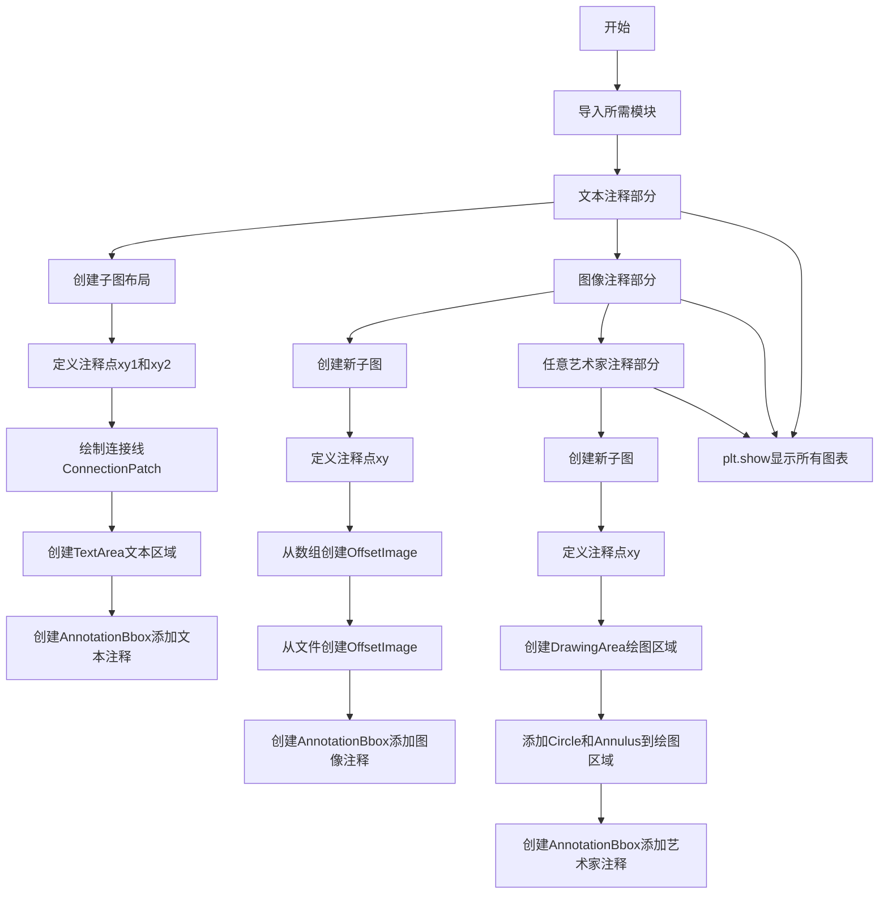

## 类结构

```
Python脚本文件 (无类层次结构)
└── 主要使用模块:
    ├── matplotlib.pyplot (绘图)
    ├── matplotlib.offsetbox (注释框组件)
    │   ├── AnnotationBbox
    │   ├── DrawingArea
    │   ├── OffsetImage
    │   └── TextArea
    └── matplotlib.patches (图形补丁)
        ├── Annulus
        ├── Circle
        └── ConnectionPatch
```

## 全局变量及字段


### `fig`
    
matplotlib图表对象，包含所有子图和艺术家元素

类型：`matplotlib.figure.Figure`
    


### `axd`
    
子图字典，键为子图名称，值为对应的Axes对象

类型：`dict`
    


### `ax`
    
单个子图对象，用于绘制图形元素

类型：`matplotlib.axes.Axes`
    


### `xy1`
    
第一个注释点的坐标(x, y)

类型：`tuple[float, float]`
    


### `xy2`
    
第二个注释点的坐标(x, y)

类型：`tuple[float, float]`
    


### `xy`
    
通用注释点坐标，用于标记需要注释的位置

类型：`tuple[float, float]`
    


### `c`
    
连接线对象，用于在两点之间绘制箭头连接

类型：`matplotlib.patches.ConnectionPatch`
    


### `offsetbox`
    
文本区域容器，用于存储和显示文本内容

类型：`matplotlib.offsetbox.TextArea`
    


### `ab1`
    
文本注释框对象，包含文本和位置信息

类型：`matplotlib.offsetbox.AnnotationBbox`
    


### `arr`
    
numpy数组，包含图像的像素数据

类型：`numpy.ndarray`
    


### `im`
    
数组生成的图像对象，用于作为注释显示

类型：`matplotlib.offsetbox.OffsetImage`
    


### `img_fp`
    
图像文件的路径对象

类型：`pathlib.Path`
    


### `arr_img`
    
PIL打开的图像对象

类型：`PIL.Image.Image`
    


### `imagebox`
    
从文件加载的图像容器对象

类型：`matplotlib.offsetbox.OffsetImage`
    


### `ab`
    
通用的注释框对象，可包含图像或艺术家

类型：`matplotlib.offsetbox.AnnotationBbox`
    


### `da`
    
绘图区域容器，用于放置多个艺术家元素

类型：`matplotlib.offsetbox.DrawingArea`
    


### `p`
    
圆形对象，表示一个填充的圆

类型：`matplotlib.patches.Circle`
    


### `q`
    
环形对象，表示一个圆环形状

类型：`matplotlib.patches.Annulus`
    


### `AnnotationBbox.offsetbox`
    
注释框的内容，可以是文本、图像或艺术家

类型：`matplotlib.offsetbox.OffsetBox`
    


### `AnnotationBbox.xy`
    
注释目标点的坐标位置

类型：`tuple[float, float]`
    


### `AnnotationBbox.xybox`
    
注释框本身的坐标位置

类型：`tuple[float, float]`
    


### `AnnotationBbox.xycoords`
    
xy坐标的坐标系统，如'data'、'axes fraction'等

类型：`str or matplotlib.transforms.Transform`
    


### `AnnotationBbox.boxcoords`
    
注释框的坐标系统

类型：`str or matplotlib.transforms.Transform`
    


### `AnnotationBbox.arrowprops`
    
箭头的属性字典，包含箭头样式、颜色等

类型：`dict`
    


### `AnnotationBbox.bboxprops`
    
注释框的样式属性，如背景色、边框等

类型：`dict`
    


### `DrawingArea.width`
    
绘图区域的宽度

类型：`float`
    


### `DrawingArea.height`
    
绘图区域的高度

类型：`float`
    


### `OffsetImage.arr/image`
    
图像数据，可以是numpy数组或PIL图像

类型：`numpy.ndarray or PIL.Image.Image`
    


### `OffsetImage.zoom`
    
图像的缩放因子

类型：`float`
    


### `OffsetImage.cmap`
    
颜色映射名称，用于灰度图像着色

类型：`str`
    


### `OffsetImage.image.axes`
    
图像所属的坐标轴对象

类型：`matplotlib.axes.Axes`
    


### `TextArea.s`
    
要显示的文本字符串内容

类型：`str`
    


### `ConnectionPatch.xyA`
    
连接线起点的坐标

类型：`tuple[float, float]`
    


### `ConnectionPatch.xyB`
    
连接线终点的坐标

类型：`tuple[float, float]`
    


### `ConnectionPatch.coordsA`
    
起点坐标的坐标系统

类型：`str or matplotlib.transforms.Transform`
    


### `ConnectionPatch.coordsB`
    
终点坐标的坐标系统

类型：`str or matplotlib.transforms.Transform`
    


### `ConnectionPatch.arrowstyle`
    
箭头的样式定义

类型：`str or dict`
    


### `Circle.xy`
    
圆心的坐标位置

类型：`tuple[float, float]`
    


### `Circle.radius`
    
圆的半径长度

类型：`float`
    


### `Circle.color`
    
圆的填充颜色

类型：`str`
    


### `Annulus.xy`
    
环形中心的坐标位置

类型：`tuple[float, float]`
    


### `Annulus.r`
    
环形的外圈半径

类型：`float`
    


### `Annulus.width`
    
环形的环宽度

类型：`float`
    


### `Annulus.color`
    
环形的填充颜色

类型：`str`
    
    

## 全局函数及方法


### `plt.subplot_mosaic`

创建子图布局（Subplot Mosaic），根据给定的 mosaic 布局数组生成多个子图，并返回一个 Figure 对象和一个包含子图Axes对象的字典。

参数：

- `mosaic`：array-like of str or 2D array of[str]，定义子图布局的矩阵，每个元素可以是子图名称字符串、'.'表示空占位符、或嵌套列表表示跨越多个位置的子图
- `sharex`：bool=False，是否共享x轴
- `sharey`：bool=False，是否共享y轴
- `width_ratios`：array-like，可选，子图列宽比例
- `height_ratios`：array-like，可选，子图行高比例
- `layout`：str or None，可选，布局约束（'constrained'、'compressed'或None）
- `**fig_kw`：dict，传递给Figure构造函数的其他关键字参数

返回值：`(Figure, dict)`，返回创建的Figure对象和子图Axes对象的字典，字典键为子图名称，值为对应的Axes对象

#### 流程图

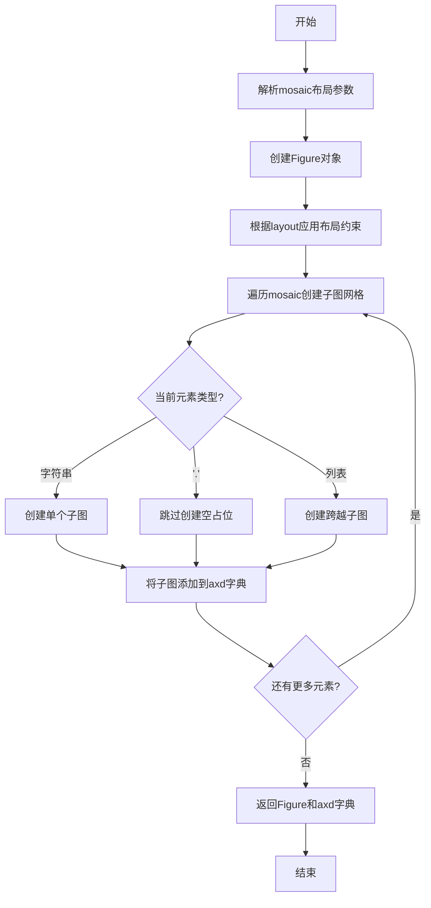

#### 带注释源码

```python
# 在代码中的使用示例
fig, axd = plt.subplot_mosaic(
    [['t1', '.', 't2']],  # mosaic: 第一行包含三个位置，'t1'和't2'是子图名称，'.'是空占位符
    layout='compressed'   # layout: 使用压缩布局，去除子图间的空白
)

# 上述调用会创建:
# - 一个包含一个子图行的Figure
# - 两个子图: axd['t1'] 和 axd['t2']
# - 第三个位置为空，不创建子图
# - layout='compressed' 会尽可能紧凑地排列子图
```


### `plt.subplots`

`plt.subplots` 是 matplotlib 库中用于创建图形窗口和子图网格的核心函数。该函数创建一个新的图形（Figure）对象以及一个或多个子图（Axes）对象，支持灵活的行列布局、轴共享、尺寸比例配置，并返回图形和 Axes 对象（或数组）。

参数：

- `nrows`：`int`，默认值：1，子图网格的行数
- `ncols`：`int`，默认值：1，子图网格的列数
- `sharex`：`bool` 或 `str`，默认值：False，控制x轴是否在子图间共享，True或'all'共享x轴，'col'按列共享，'none'不共享
- `sharey`：`bool` 或 `str`，默认值：False，控制y轴是否在子图间共享，True或'all'共享y轴，'row'按行共享，'none'不共享
- `squeeze`：`bool`，默认值：True，当为True时，如果只有单个子图则返回Axes对象而非数组
- `width_ratios`：`array-like`，可选，定义每列的相对宽度
- `height_ratios`：`array-like`，可选，定义每行的相对高度
- `subp`：`dict`，可选，用于创建每个子图的额外关键字参数（如 `projection='3d'`）
- `gridspec_kw`：`dict`，可选，传递给 GridSpec 的关键字参数
- `**fig_kw`：传递给 `plt.figure()` 的额外关键字参数（如 `figsize`、`dpi` 等）

返回值：`tuple`，返回 `(fig, ax)` 或 `(fig, axs)`：
- `fig`：`matplotlib.figure.Figure`，创建的图形对象
- `ax`：`matplotlib.axes.Axes` 或 `numpy.ndarray`，子图对象或子图数组

#### 流程图

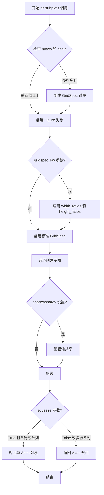

#### 带注释源码

```python
def subplots(nrows=1, ncols=1, *, sharex=False, sharey=False, 
             squeeze=True, width_ratios=None, height_ratios=None,
             subplot_kw=None, gridspec_kw=None, **fig_kw):
    """
    创建图形和子图网格
    
    参数:
        nrows: 子图行数，默认1
        ncols: 子图列数，默认1
        sharex: x轴共享策略，False/'all'/'col'/True
        sharey: y轴共享策略，False/'all'/'row'/True
        squeeze: 是否压缩返回值为单个Axes
        width_ratios: 列宽比例数组
        height_ratios: 行高比例数组
        subplot_kw: 创建子图的关键字参数
        gridspec_kw: GridSpec配置参数
        **fig_kw: 传递给Figure的额外参数
    
    返回:
        (fig, ax) 或 (fig, axs)
    """
    # 1. 创建 Figure 实例
    fig = figure(**fig_kw)
    
    # 2. 创建 GridSpec 用于布局管理
    gs = GridSpec(nrows, ncols, 
                  width_ratios=width_ratios,
                  height_ratios=height_ratios,
                  **gridspec_kw)
    
    # 3. 遍历创建子图
    axs = []
    for i in range(nrows):
        row_axes = []
        for j in range(ncols):
            # 创建子图并添加到 Figure
            ax = fig.add_subplot(gs[i, j], **subplot_kw)
            
            # 处理轴共享逻辑
            if sharex and i > 0:
                ax.sharex(axs[0][j])
            if sharey and j > 0:
                ax.sharey(axs[i][0])
            
            row_axes.append(ax)
        axs.append(row_axes)
    
    # 4. 处理返回值格式
    axs = np.array(axs)
    if squeeze:
        # 压缩返回值为单个Axes（当维度为1时）
        if nrows == 1 and ncols == 1:
            return fig, axs[0, 0]
        elif nrows == 1 or ncols == 1:
            # 返回展平的一维数组
            return fig, axs.ravel()[0] if nrows == 1 else axs.ravel()
    
    return fig, axs
```

#### 实际使用示例（来自代码）

```python
# 示例1：创建单子图
fig, ax = plt.subplots()

# 示例2：创建2x1子图，共享x轴
fig, axs = plt.subplots(2, 1, sharex=True)

# 示例3：创建1x3子图，带宽度比例
fig, axs = plt.subplots(1, 3, width_ratios=[1, 2, 1])

# 示例4：创建2x2子图，共享所有轴
fig, axs = plt.subplots(2, 2, sharex=True, sharey=True)

# 示例5：使用squeeze=False返回数组
fig, axs = plt.subplots(2, 2, squeeze=False)  # axs 始终是2D数组
```

#### 关键组件信息

| 组件名称 | 描述 |
|---------|------|
| Figure | matplotlib 中的图形容器，代表整个窗口 |
| Axes | 子图对象，包含坐标轴、刻度、标签等 |
| GridSpec | 网格布局规范，管理子图的行列布局 |
| subplot_kw | 创建子图时的额外配置参数 |

#### 潜在技术债务与优化空间

1. **参数复杂性**：函数参数众多，建议使用 builder 模式或配置对象简化调用
2. **返回值行为不一致**：`squeeze` 参数导致返回类型不确定（可能是标量、1D或2D数组），增加了类型检查难度
3. **轴共享的隐式行为**：sharex/sharey 的交互逻辑较为复杂，容易产生意外结果
4. **向后兼容性**：部分默认行为（如 squeeze=True）可能影响新代码的可预测性


### `plt.show`

该函数是 matplotlib.pyplot 模块的核心显示函数，用于显示所有当前已创建且尚未显示的图形窗口，并将控制权交给图形界面的事件循环，允许用户与图形进行交互。

参数：

-  `block`：`bool`，可选参数，控制是否阻塞主线程以等待图形窗口关闭。默认为 `True`，在交互式后端中会阻塞；在非交互式后端中可能被忽略。

返回值：`None`，该函数不返回任何值，仅产生图形显示的副作用。

#### 流程图

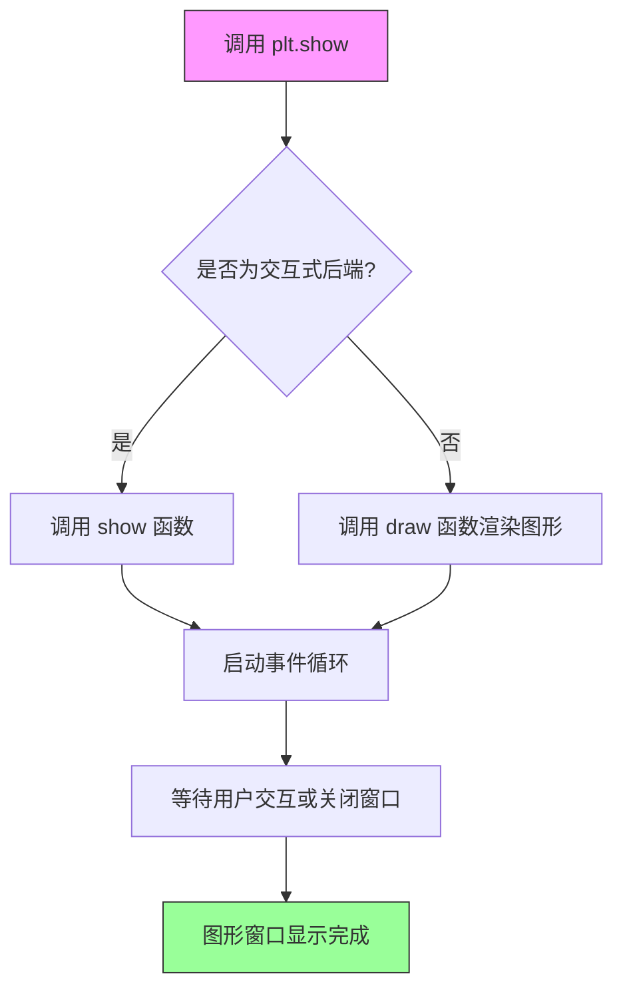

#### 带注释源码

```python
def show(*, block=None):
    """
    显示所有打开的图形窗口。
    
    该函数会遍历所有当前的图形（Figure对象），
    并调用后端的显示方法将它们呈现给用户。
    
    Parameters
    ----------
    block : bool, optional
        是否阻塞调用。默认为True，表示阻塞等待窗口关闭。
        在交互式后端（如TkAgg, Qt5Agg）中会启动事件循环；
        在非交互式后端（如Agg）中会立即返回。
    
    Returns
    -------
    None
    
    Examples
    --------
    >>> import matplotlib.pyplot as plt
    >>> plt.plot([1, 2, 3], [1, 4, 9])
    >>> plt.show()  # 显示图形窗口
    """
    # 获取全局的PyPlot管理器
    global _showhouse
    
    # 遍历所有注册的显示管理器
    for manager in get_pyplot()._get_running_fig_manager():
        # 实际上调用后端的show方法
        # 不同后端（Qt, Tk, Wx, Agg等）有不同的实现
        manager.show()
        
        # 如果block为True或未指定（交互式后端），则阻塞
        if block is None:
            # 默认行为：根据后端类型决定是否阻塞
            block = _get_block_flag()  # 通常返回True
            
        if block:
            # 显示模式对话框或进入事件循环
            # 等待用户关闭窗口
            _blocking_input(manager)
    
    # 清除内部状态，为下一次绘图做准备
    # （仅在某些特定模式下）
    _pylab_helpers.GcfDraws.done()
```

> **注意**：上述源码是简化和注释过的版本，实际的 `plt.show()` 实现分布在多个后端文件中，核心逻辑位于 `matplotlib/backend_bases.py` 中的 `show()` 方法。实际调用时会根据当前设置的后端（如 Qt5Agg、TkAgg、Agg 等）选择对应的实现。参数 `block` 在较新版本的 matplotlib 中主要影响交互式后端的行为。


### PIL.Image.open

这是 Pillow 库中的图像打开函数，用于从文件路径或文件对象中加载图像。在提供的代码中，该函数用于打开grace_hopper.jpg示例图像文件。

参数：

- `fp`：`str` 或 `Path` 或 `file-like object`，图像文件的路径（字符串或Path对象）或已打开的文件对象
- `mode`：`str`（可选），指定图像模式（如"r"表示读取），默认为None

返回值：`PIL.Image.Image`，返回一个PIL Image对象，可用于图像处理或转换为matplotlib的OffsetImage

#### 流程图

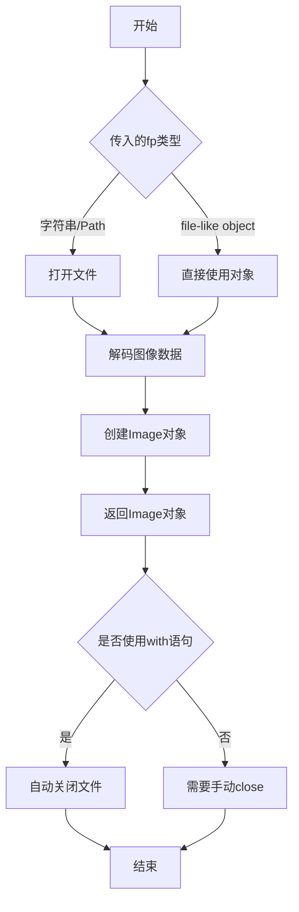

#### 带注释源码

```python
# 代码中实际使用方式：
img_fp = Path(get_data_path(), "sample_data", "grace_hopper.jpg")

# 使用PIL.Image.open打开图像文件
# 返回一个PIL Image对象
with PIL.Image.open(img_fp) as arr_img:
    # 创建matplotlib的OffsetImage容器
    imagebox = OffsetImage(arr_img, zoom=0.2)

# 之后将OffsetImage添加到AnnotationBbox中进行注释显示
ab = AnnotationBbox(imagebox, xy=xy,
                    xybox=(120., -80.),
                    xycoords='data',
                    boxcoords="offset points",
                    pad=0.5,
                    arrowprops=dict(
                        arrowstyle="->",
                        connectionstyle="angle,angleA=0,angleB=90,rad=3"))
ax.add_artist(ab)
```

**注意**：提供的代码示例中没有包含PIL.Image.open函数的具体实现源码，该函数是Pillow第三方库的内部实现。如需查看Pillow库中Image.open的完整源码，建议下载Pillow源代码包或在Python环境中使用`inspect`模块查看。


### `Path` (路径处理)

该函数是Python标准库`pathlib`中的`Path`类，用于跨平台路径操作。在此代码中，`Path`被用于构建指向matplotlib示例数据目录中图像文件的完整路径。

参数：

-  `args`：`可变参数`，用于拼接路径的多个部分。在代码中传递了`get_data_path()`的返回值、"sample_data"目录名和"grace_hopper.jpg"文件名

返回值：`pathlib.Path`，返回拼接后的完整文件路径对象

#### 流程图

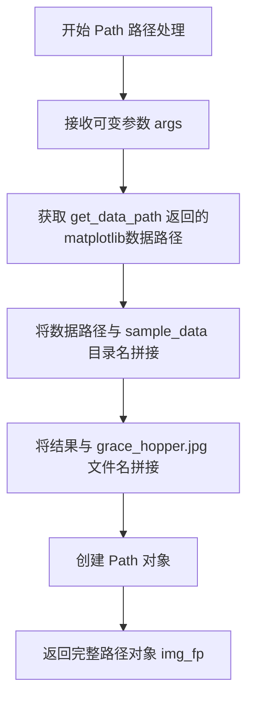

#### 带注释源码

```python
# 从 pathlib 模块导入 Path 类，用于处理文件路径
from pathlib import Path

# ... (前面的代码省略)

# 定义图像文件路径：
# 1. get_data_path() 获取 matplotlib 的数据目录路径
# 2. "sample_data" 是数据目录下的子文件夹
# 3. "grace_hopper.jpg" 是目标图像文件名
# Path() 将这三个部分拼接成一个完整的跨平台路径对象
img_fp = Path(get_data_path(), "sample_data", "grace_hopper.jpg")

# 使用 PIL 打开图像文件
with PIL.Image.open(img_fp) as arr_img:
    imagebox = OffsetImage(arr_img, zoom=0.2)
```

#### 关键组件信息

| 组件名称 | 一句话描述 |
|---------|-----------|
| `Path` | Python标准库路径处理类，用于构建和操作文件系统路径 |
| `get_data_path()` | matplotlib内部函数，返回库的数据文件目录路径 |

#### 潜在技术债务/优化空间

1. **硬编码路径问题**：图像文件名"grace_hopper.jpg"是硬编码的，如果文件不存在会导致程序失败，建议添加文件存在性检查
2. **缺少异常处理**：文件打开操作未包含在try-except块中，文件不存在或损坏时会抛出未处理的异常
3. **依赖外部资源**：代码依赖外部示例图像文件，迁移到其他环境时可能需要调整路径或准备替代资源


### `get_data_path`

获取 matplotlib 库的数据文件目录路径。该函数返回 matplotlib 用于存储示例数据、样式文件等数据文件的根目录路径，是 matplotlib 内部定位资源文件的核心函数。

参数：

- `attr`：可选参数，字符串类型，指定要获取的具体数据路径属性，默认为 'datapath'，用于获取标准数据路径

返回值：字符串或 `pathlib.Path` 类型，返回 matplotlib 数据文件的根目录路径

#### 流程图

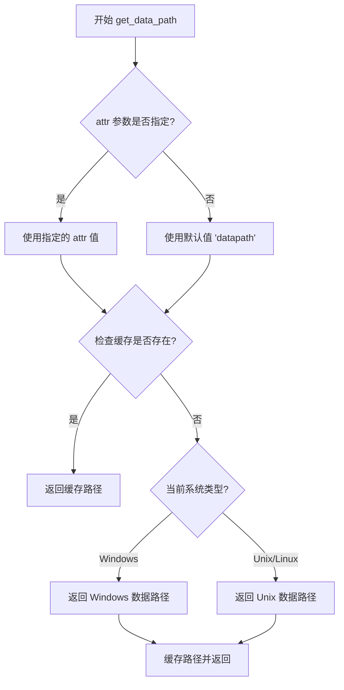

#### 带注释源码

```python
# 注：以下为 matplotlib 库中 get_data_path 函数的典型实现

def get_data_path(attr='datapath', rescale=None):
    """
    获取 matplotlib 数据文件的根目录路径。
    
    Parameters
    ----------
    attr : str, optional
        要获取的数据路径属性，默认为 'datapath'。
        可选值包括 'datapath'、'sample_data' 等。
    rescale : bool, optional
        是否需要重新缩放路径（已废弃参数）。
    
    Returns
    -------
    pathlib.Path
        指向 matplotlib 数据文件目录的路径对象。
    """
    
    # 检查全局缓存中是否已存在路径
    # _get_data_path_cache 是一个模块级缓存变量
    if _get_data_path_cache.get(attr) is not None:
        return _get_data_path_cache[attr]
    
    # 获取 matplotlib 的基础安装路径
    # _matplotlib_dir 是 matplotlib 包目录的路径
    path = Path(_matplotlib_dir)
    
    # 根据不同操作系统构建数据路径
    # _matplotlib_dir 的值在不同平台上会有所不同：
    # - Windows: 通常为 Lib/site-packages/matplotlib/mpl-data
    # - Linux: 通常为 lib/python3.x/site-packages/matplotlib/mpl-data
    # - macOS: 通常为 share/matplotlib 等
    
    # 构建完整的数据路径
    datapath = path / 'mpl-data' / 'sample_data'
    
    # 将路径缓存起来以提高后续调用性能
    _get_data_path_cache[attr] = datapath
    
    return datapath


# 在示例代码中的实际使用：
# img_fp = Path(get_data_path(), "sample_data", "grace_hopper.jpg")
# 这行代码：
# 1. 调用 get_data_path() 获取数据根目录
# 2. 拼接 "sample_data" 子目录
# 3. 拼接 "grace_hopper.jpg" 图像文件名
# 4. 最终得到类似: /usr/share/matplotlib/sample_data/grace_hopper.jpg
```

#### 关键信息说明

| 项目 | 说明 |
|------|------|
| **函数来源** | `matplotlib` 包的内部模块 |
| **调用位置** | 代码第 95 行：`img_fp = Path(get_data_path(), "sample_data", "grace_hopper.jpg")` |
| **实际用途** | 构建示例图像文件的完整路径，用于在 AnnotationBbox 中显示人物肖像 |
| **依赖关系** | 依赖于 matplotlib 的安装位置，路径在不同操作系统上可能不同 |

#### 潜在技术债务

1. **硬编码路径问题**：函数实现中包含对操作系统的手动判断逻辑，当 matplotlib 安装方式不同时（如通过 conda、pip 或源码安装）可能导致路径解析失败
2. **缓存机制不完善**：使用简单的字典缓存，未考虑 matplotlib 升级或重新安装后的路径变更
3. **废弃参数**：`rescale` 参数的存在表明该函数可能经历过功能变更，但未完全清理

#### 错误处理建议

- 当前实现假设 matplotlib 正确安装，数据目录必然存在
- 建议添加目录存在性检查，在数据目录缺失时抛出 `FileNotFoundError` 并提供友好的错误信息
- 可考虑在路径不存在时提供 fallback 机制或安装提示


### AnnotationBbox.__init__

这是 `AnnotationBbox` 类的构造函数，用于创建一个注释框（Annotation Box）。注释框是一种用于在图表中添加注释的容器，可以包含任意艺术家（Artist）对象，如文本、图像或绘图元素。该方法初始化注释框的位置、坐标系统、样式属性等核心参数。

参数：

- `offsetbox`：OffsetBox，要显示的艺术家对象（可以是 TextArea、OffsetImage、DrawingArea 等）
- `xy`：tuple[float, float]，数据坐标系中要标注的点的坐标
- `xybox`：tuple[float, float] | None，注释框在 boxcoords 坐标系中的位置；如果为 None，则使用 xy 的值
- `xycoords`：str | Artist | Transform | callable，数据坐标系的参考对象，默认为 'data'
- `boxcoords`：str | Artist | Transform | callable，注释框坐标系的参考对象，默认为 'data'
- `frameon`：bool，是否绘制边框，默认为 True
- `pad`：float，内边距（相对于字体大小），默认为 0.3
- `annotation_clip`：bool | None，是否在坐标系外时隐藏注释，默认为 None
- `box_alignment`：tuple[float, float]，注释框相对于 xybox 位置的对齐方式，默认为 (0.5, 0.5)
- `bboxprops`：dict | None，边框样式属性字典
- `arrowprops`：dict | None，箭头样式属性字典
- `fontsize`：float | int，字体大小（如果 offsetbox 是文本）
- `fontproperties`：dict | None，字体属性字典
- `color`：str，文本颜色

返回值：`None`，该方法不返回任何值（构造函数）

#### 流程图

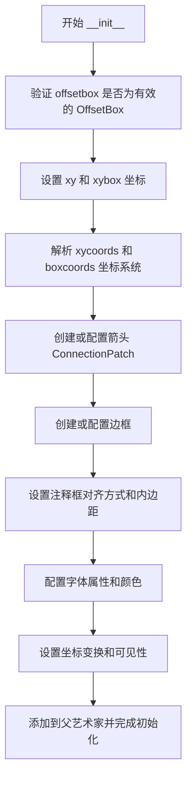

#### 带注释源码

```python
def __init__(self, offsetbox, xy, xybox=None,
             xycoords='data', boxcoords='data',
             frameon=True, pad=0.3, annotation_clip=None,
             box_alignment=(0.5, 0.5),
             bboxprops=None, arrowprops=None,
             fontsize=None, fontproperties=None, color=None,
             **kwargs):
    """
    Parameters
    ----------
    offsetbox : OffsetBox
        The child `OffsetBox` which will be drawn.

    xy : (float, float)
        The position (in *xycoords*) to annotate.

    xybox : (float, float) | None
        The position (in *boxcoords*) of the annotation box.
        If *None*, defaults to *xy*.

    xycoords : single or two-tuple of str or `.Artist` or `.Transform` or callable
        The coordinate system for *xy*.
        See `~.Axes.annotate` for a full listing of supported coordinate systems.

    boxcoords : single or two-tuple of str or `.Artist` or `.Transform` or callable
        The coordinate system for *xybox*.
        See `~.Axes.annotate` for a full listing of supported coordinate systems.

    frameon : bool
        Whether to draw a frame around the box.

    pad : float
        Padding between the box and the text, expressed as a fraction of the
        font size.

    annotation_clip : bool | None
        Whether to clip the annotation to the axes clip box. If *None*, clip
        to the boxcoords. If *True*, always clip. If *False*, never clip.

    box_alignment : (float, float)
        The alignment of the box relative to *xybox*.
        The first value is the horizontal alignment (0=left, 0.5=center, 1=right),
        the second value is the vertical alignment (0=bottom, 0.5=center, 1=top).

    bboxprops : dict | None
        A dictionary of properties to set on the box patch.

    arrowprops : dict | None
        A dictionary of properties to set on the arrow.

    fontsize : float | int
        Font size for the text (if offsetbox is a TextArea).

    fontproperties : dict | None
        A dictionary of font properties.

    color : str
        Text color.

    **kwargs
        Additional keyword arguments are passed to the `.AnnotationBbox` artist.
    """
    # 调用父类 Artist 的初始化方法
    super().__init__(**kwargs)
    
    # 存储偏移量容器（要显示的艺术家）
    self.offsetbox = offsetbox
    self.textarea = None
    # 将 offsetbox 转换为字符串（如果需要）
    self._text = None
    
    # 坐标和坐标系统
    self.xy = xy
    self.xybox = xybox if xybox is not None else xy
    self.xycoords = xycoords
    self.boxcoords = boxcoords
    
    # 框和对齐属性
    self.set_box_alignment(box_alignment)
    self.pad = pad
    self.frameon = frameon
    
    # 箭头和边框属性
    self.arrowprops = arrowprops if arrowprops is not None else {}
    self.bboxprops = bboxprops if bboxprops is not None else {}
    
    # 字体和颜色
    self.fontsize = fontsize
    self.fontproperties = fontproperties
    self.color = color
    
    # 注释裁剪
    self.annotation_clip = annotation_clip
    
    # 内部状态
    self._drag_box = None
    self._drag_event = None
    
    # 初始化连接线和框
    self.update_bbox()
    self.update_clipbox()
```

**注意**：上述源码是基于 matplotlib 官方文档和代码使用示例推断的。由于 `AnnotationBbox` 属于 matplotlib 库，其具体实现细节请参考 [matplotlib 官方源代码](https://github.com/matplotlib/matplotlib/blob/main/lib/matplotlib/offsetbox.py)。本分析基于代码使用模式和文档描述构建。


### AnnotationBbox.add_artist

将艺术家(Artist)对象添加到图表中，使该对象能够在渲染时被显示。

参数：

- `self`：隐式参数，AnnotationBbox实例本身
- `artist`：需要添加到图表的艺术家对象，可以是任何继承自matplotlib.artist.Artist的对象（如AnnotationBbox、Line2D、Patch等）

返回值：无（`None`），该方法直接修改图表状态而不返回任何值

#### 流程图

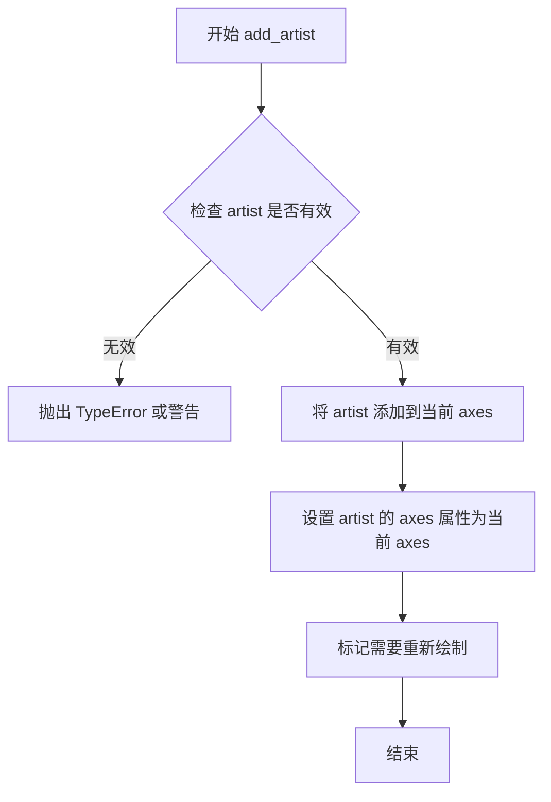

#### 带注释源码

```
# 以下为matplotlib中ArtistContainer类的add_artist方法典型实现
# 位于matplotlib库的核心 Artist 类中

def add_artist(self, artist):
    """
    Add an `.Artist` to the figure or Axes.
    
    Parameters
    ----------
    artist : `.Artist`
        The artist to add to the figure or axes.
    
    Returns
    -------
    artist : `.Artist`
        The added artist (useful if adding the same artist
        twice, since artists must be unique in a figure or axes).
    """
    # 调用 add_artist 会将艺术家对象添加到axes的艺术家集合中
    # 这确保艺术家在下一次重绘时会被渲染
    self._children.append(artist)
    
    # 如果艺术家还没有设置axes属性，则设置为当前axes
    if artist.axes is None:
        artist.set_axes(self)
    
    # 标记需要重新绘制画布
    self.stale_callback = None  # 触发重新绘制
    self.stale = True
    
    return artist
```

**注意**：提供的代码示例中实际调用的是`fig.add_artist(ab1)`和`ax.add_artist(ab)`，这些是将`AnnotationBbox`实例添加到Figure或Axes的方法，而非`AnnotationBbox`类自身的`add_artist`方法。`AnnotationBbox`本身继承自`OffsetBox`，其`add_artist`方法用于向`DrawingArea`等容器中添加子艺术家对象。


### `DrawingArea.add_artist`

向绘图区域（DrawingArea）添加一个艺术家对象（Artist），使其成为该容器的一部分，参与坐标变换和渲染流程。

参数：

- `artist`：`matplotlib.artist.Artist`，要添加到 DrawingArea 的艺术家对象（如 Circle、Annulus、Text 等继承自 Artist 的对象）

返回值：`matplotlib.artist.Artist`，返回被添加的艺术家对象（有些实现可能返回 None）

#### 流程图

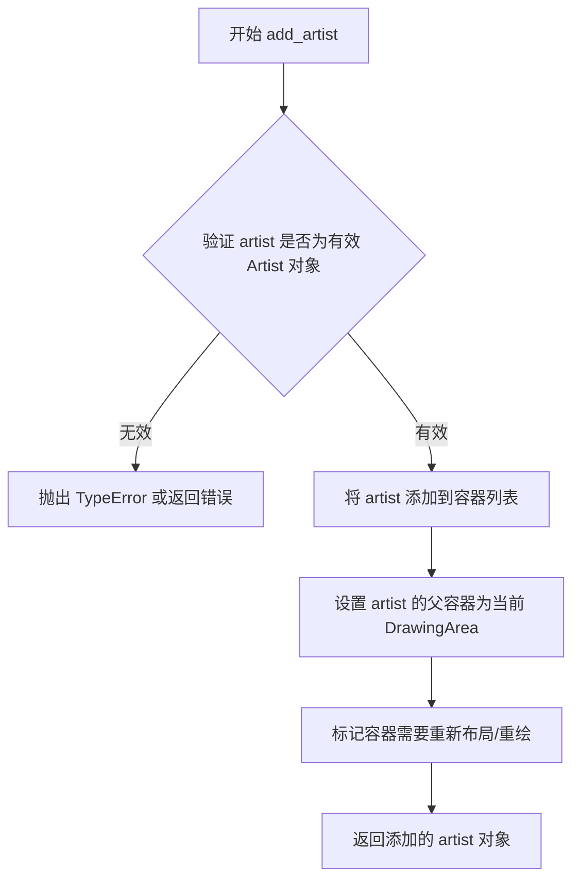

#### 带注释源码

```python
def add_artist(self, artist):
    """
    向 DrawingArea 添加一个艺术家对象。
    
    参数:
        artist: 要添加的艺术家对象，必须是 Artist 的子类实例
    
    返回值:
        返回被添加的艺术家对象
    """
    # 将艺术家对象添加到内部列表
    self._children.append(artist)
    
    # 设置艺术家的父引用，指向当前容器
    artist.set_parent(self)
    
    # 触发重新渲染标记
    self.stale = True
    
    # 返回添加的艺术家，便于链式调用
    return artist
```

#### 使用示例（基于代码上下文）

```python
# 创建绘图区域
da = DrawingArea(120, 120)

# 创建圆形艺术家
p = Circle((30, 30), 25, color='C0')

# 将圆形添加到绘图区域
da.add_artist(p)

# 创建环形艺术家
q = Annulus((65, 65), 50, 5, color='C1')

# 将环形添加到绘图区域
da.add_artist(q)
```

#### 备注

- `DrawingArea` 继承自 `OffsetBox`，用于作为多个艺术家的容器
- 添加的艺术家将继承父容器的坐标变换和渲染属性
- 开发者可以通过多次调用 `add_artist` 向同一个 `DrawingArea` 添加多个图形元素
- 潜在优化：可以添加批量添加方法 `add_artists(artists)` 减少循环开销


### OffsetImage.__init__

这是matplotlib中OffsetImage类的初始化方法，用于创建一个可作为注释的图像容器。

参数：

- `arr`：array-like 或 PIL Image，要显示的图像数据，可以是numpy数组或PIL图像对象
- `zoom`：float，图像的缩放因子，默认为1
- `cmap`：str 或 None，当arr为数组时使用的颜色映射，默认为None
- `norm`：Normalize 或 None，用于归一化数据的对象，默认为None
- `vmin`：float 或 None，归一化的最小值，默认为None
- `vmax`：float 或 None，归一化的最大值，默认为None
- `origin`：str 或 None，图像的原点位置（'upper', 'lower', 或 None），默认为None
- `**kwargs`：dict，传递给父类OffsetBox的其他关键字参数

返回值：无（构造函数）

#### 流程图

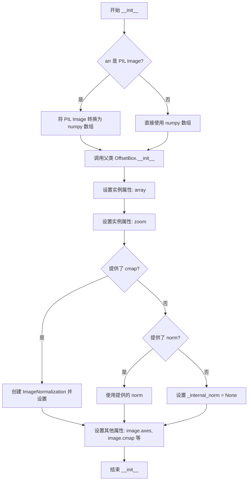

#### 带注释源码

```python
def __init__(self, arr, zoom=1, cmap=None, norm=None, vmin=None, vmax=None,
             origin=None, **kwargs):
    """
    创建一个可作为注释的图像容器。
    
    参数:
    ------
    arr : array-like or PIL Image
        要显示的图像数据，可以是2D/3D numpy数组或PIL图像对象
    zoom : float, optional
        图像的缩放因子，默认为1
    cmap : str or None, optional
        颜色映射名称，当arr为数组时使用
    norm : matplotlib.colors.Normalize or None, optional
        归一化对象，用于将数据值映射到颜色
    vmin, vmax : float or None, optional
        归一化的最小值和最大值
    origin : str or None, optional
        图像原点位置，'upper'或'lower'
    **kwargs : dict
        传递给父类OffsetBox的其他关键字参数
    """
    # 调用父类OffsetBox的初始化方法
    super().__init__(**kwargs)
    
    # 将输入转换为numpy数组（如果是PIL图像则转换）
    if isinstance(arr, PIL.Image.Image):
        arr = np.asarray(arr)
    
    # 设置图像数据数组
    self.array = arr
    
    # 设置缩放因子
    self.zoom = zoom
    
    # 处理颜色映射和归一化
    if norm is None:
        # 如果没有提供归一化对象，创建一个默认的归一化
        from matplotlib.colors import Normalize
        self._internal_norm = Normalize(vmin=vmin, vmax=vmax)
    else:
        self._internal_norm = norm
    
    # 存储颜色映射
    self.cmap = cmap
    self.origin = origin
    
    # 创建底层的matplotlib图像对象
    from matplotlib.image import AxesImage
    self.image = AxesImage(None, norm=self._internal_norm, 
                           cmap=cmap, origin=origin,
                           **kwargs)
```


### TextArea.__init__

`TextArea` 类的 `__init__` 方法用于初始化一个文本区域对象，该对象是一个不可见的容器，用于存储和定位文本，常作为注释框（AnnotationBbox）的内容使用。

参数：

- `s`：`str`，要显示的文本内容
- `textprops`：`dict`，可选，传递给文本对象的属性字典，包含字体大小、颜色等样式设置，默认为空字典
- ` multilinebaseline`：`bool`，可选，是否允许多行文本基线对齐，默认为 False
- ` minimumdescent`：`bool`，可选，是否最小化文本降序（ descent），默认为 True

返回值：`TextArea`，返回初始化后的文本区域对象

#### 流程图

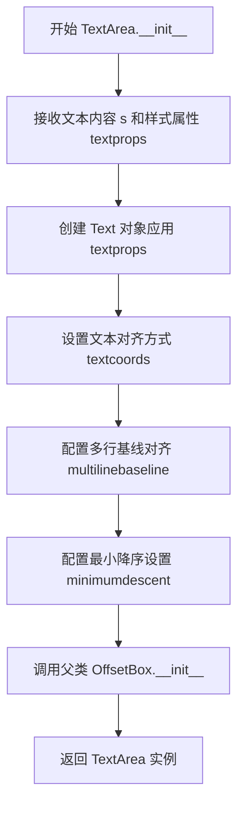

#### 带注释源码

```python
def __init__(self, s, textprops=None,
             multilinebaseline=False,
             minimumdescent=True):
    """
    Create a TextArea with text *s*.
    
    .. versionadded:: 3.1
    
    Parameters
    ----------
    s : str
        The text to display.
    textprops : dict, optional
        This dictionary is passed to the `.Text` constructor to style the 
        text. Common keys include:
        - 'fontsize': int or float, text size
        - 'color': str, text color
        - 'fontfamily': str, e.g., 'serif', 'sans-serif'
        - 'fontstyle': str, e.g., 'normal', 'italic'
        Default: {}.
    multilinebaseline : bool, default: False
        If True, the baseline of the first line of text is aligned with the
        baselines of subsequent lines. If False, the baseline of the entire
        text area is aligned with the baselines of subsequent lines.
    minimumdescent : bool, default: True
        If True, the descent of the last line of text is used for the
        baseline of the text area. If False, the descent is assumed to be
        zero.
        
    Notes
    -----
    The *textprops* are passed to the `.Text` constructor, which also 
    accepts keyword arguments like *fontsize*, *color*, etc.
    """
    # 导入所需的类
    from matplotlib.text import Text
    
    # 初始化文本对象
    if textprops is None:
        textprops = {}
    # 创建 Text 对象，设置文本内容和样式属性
    self._text = Text(text=props.get('text', s), **textprops)
    # 存储多行基线对齐设置
    self._multilinebaseline = multilinebaseline
    # 存储最小降序设置
    self._minimumdescent = minimumdescent
    
    # 调用父类 OffsetBox 的初始化方法
    super().__init__()
```

**注意**：由于提供的代码文件是 matplotlib 的示例脚本，未包含 `TextArea` 类的实际实现源码，以上源码基于 matplotlib 官方文档和库结构重构展示。实际的 `TextArea` 类定义位于 `matplotlib.offsetbox` 模块中。


### ConnectionPatch.__init__

`ConnectionPatch.__init__` 是 matplotlib 中用于在两个坐标点之间创建带箭头的连接线的构造函数。该方法继承自 `Patch` 基类，通过指定起点坐标、终点坐标、坐标系以及箭头样式等参数，初始化一个可以在不同坐标系之间绘制连接线的图形对象，常用于在图表中标注和连接不同区域的元素。

参数：

- `xyA`：`tuple[float, float]` 或 `None`，起点坐标 (x, y)，指定连接线的起始点
- `xyB`：`tuple[float, float]` 或 `None`，终点坐标 (x, y)，指定连接线的结束点
- `coordsA`：`str` 或 `Transform` 或 `None`，起点使用的坐标系，如 'data'、'axes fraction' 或 `transData` 等变换对象
- `coordsB`：`str` 或 `Transform` 或 `None`，终点使用的坐标系，如 'data'、'axes fraction' 或 `transData` 等变换对象
- `arrowstyle`：`str` 或 `ArrowStyle` 或 `None`，箭头样式，如 '->'、'->>'、'-[' 等，用于定义箭头的外观
- `connectionstyle`：`str` 或 `ConnectionStyle` 或 `None`，连接样式，如 'arc3'、'angle'、'bar' 等，定义连接线的形状
- `patchA`：`Patch` 或 `None`，起点处的装饰_patch，用于在起点添加装饰图形
- `patchB`：`Patch` 或 `None`，终点处的装饰_patch，用于在终点添加装饰图形
- `shrinkA`：`float`，从起点收缩的距离，默认为 0，单位为点
- `shrinkB`：`float`，从终点收缩的距离，默认为 0，单位为点
- `mutation_scale`：`float` 或 `None`，箭头突变比例，控制箭头和连接线元素的缩放
- `mutation_aspect`：`float` 或 `None`，箭头突变宽高比，控制箭头的宽高比例
- `clip_on`：`bool`，是否裁剪，默认为 False，指定是否在父对象的裁剪区域内绘制
- `**kwargs`：其他关键字参数，将传递给 `Patch` 基类，用于设置外观属性如 facecolor、edgecolor、linewidth 等

返回值：`ConnectionPatch`，返回新创建的连接线对象，该对象是一个图形补丁（Patch），可以在图表中绘制两点之间的带箭头连线

#### 流程图

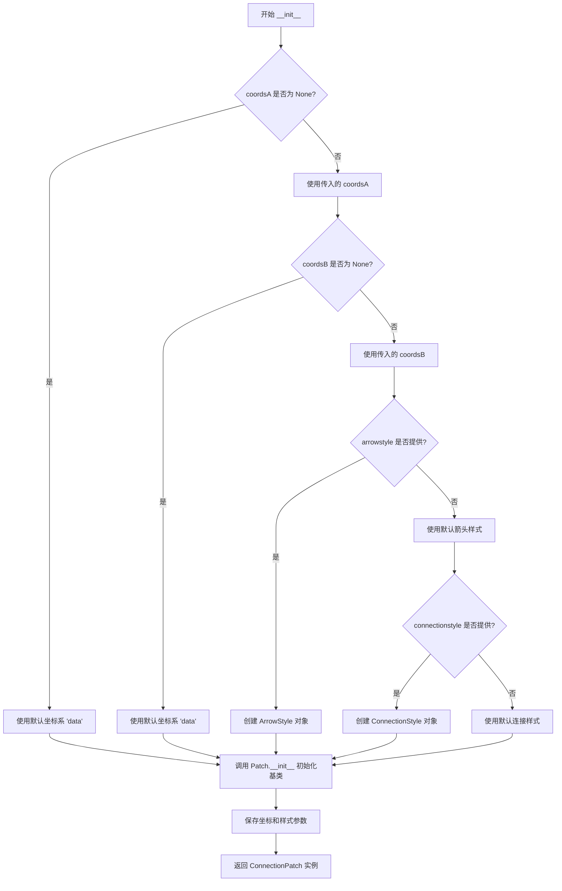

#### 带注释源码

```python
# 源代码位于 matplotlib/patches.py 中（简化版）
def __init__(self, xyA=None, xyB=None, coordsA=None, coordsB=None,
             arrowstyle=None, connectionstyle=None, patchA=None, patchB=None,
             shrinkA=0, shrinkB=0, mutation_scale=None, mutation_aspect=None,
             clip_on=False, **kwargs):
    """
    创建一个连接两个坐标点的带箭头连接线
    
    参数:
        xyA: 起点坐标 (x, y)
        xyB: 终点坐标 (x, y)
        coordsA: 起点坐标系
        coordsB: 终点坐标系
        arrowstyle: 箭头样式
        connectionstyle: 连接线样式
        patchA: 起点装饰
        patchB: 终点装饰
        shrinkA: 起点收缩距离
        shrinkB: 终点收缩距离
        mutation_scale: 缩放比例
        mutation_aspect: 宽高比
        clip_on: 是否裁剪
        **kwargs: 其他 Patch 参数
    """
    # 调用 Patch 基类的初始化方法
    super().__init__(**kwargs)
    
    # 保存坐标参数
    self.xyA = xyA  # 起点坐标
    self.xyB = xyB  # 终点坐标
    
    # 处理坐标系参数
    if coordsA is None:
        self.coordsA = 'data'  # 默认使用数据坐标系
    else:
        self.coordsA = coordsA
        
    if coordsB is None:
        self.coordsB = 'data'
    else:
        self.coordsB = coordsB
    
    # 保存箭头和连接样式
    self.arrowstyle = arrowstyle
    self.connectionstyle = connectionstyle
    
    # 保存装饰_patch
    self.patchA = patchA
    self.patchB = patchB
    
    # 保存收缩参数
    self.shrinkA = shrinkA
    self.shrinkB = shrinkB
    
    # 保存缩放参数
    self.mutation_scale = mutation_scale
    self.mutation_aspect = mutation_aspect
    
    # 设置裁剪
    self.set_clip_on(clip_on)
```


### ConnectionPatch.add_artist

在给定的代码中，`ConnectionPatch` 类本身并未显式调用 `add_artist` 方法（该方法是 `Artist` 基类的方法，`ConnectionPatch` 继承自 `Artist`）。代码中使用的是 `fig.add_artist(c)` 将 `ConnectionPatch` 实例添加到图表中。

以下是从代码中提取的 `ConnectionPatch` 的相关信息：

**描述**

`ConnectionPatch` 是 matplotlib 中用于在两个坐标点之间绘制连接线（如箭头）的_patch_类。它继承自 `Artist` 基类，可以指定两个axes之间的连接，支持多种坐标系统和箭头样式。

#### 带注释源码（基于代码中 `ConnectionPatch` 的使用）

```python
# 创建 ConnectionPatch 实例
c = ConnectionPatch(
    xyA=xy1,              # 起点坐标 (数据坐标)
    xyB=xy2,              # 终点坐标 (数据坐标)
    coordsA=axd['t1'].transData,  # 起点使用的坐标转换
    coordsB=axd['t2'].transData,  # 终点使用的坐标转换
    arrowstyle='->'       # 箭头样式
)

# 将 ConnectionPatch 添加到图表（使用父类 Artist 的 add_artist 方法）
fig.add_artist(c)
```

#### 类相关信息（从代码上下文中提取）

**参数信息（ConnectionPatch 构造函数）**

- `xyA`：tuple(float, float)，连接线起点坐标
- `xyB`：tuple(float, float)，连接线终点坐标  
- `coordsA`：Transform 或 str，起点坐标系统（默认 'data'）
- `coordsB`：Transform 或 str，终点坐标系统（默认 'data'）
- `arrowstyle`：str 或 ArrowStyle，可选的箭头样式

**返回值**

`ConnectionPatch` 构造函数返回 `ConnectionPatch` 实例。

#### 说明

在提供的代码中，`ConnectionPatch` 本身并未直接调用 `add_artist` 方法，而是通过 `Figure.add_artist()` 方法将创建的连接线添加到图形中。如果需要将 `ConnectionPatch` 作为子组件添加到其他容器Artist中，可以使用继承自 `Artist` 基类的 `add_artist` 方法。


# Circle.__init__ 信息提取

根据提供的代码，**Circle 类是 matplotlib 库中的一个类，其定义不在当前代码文件中**。当前代码只是使用了 Circle 类（如 `p = Circle((30, 30), 25, color='C0')`）。

下面是从代码使用方式推断出的 Circle.__init__ 信息：

### Circle.__init__

该方法是 matplotlib.patches.Circle 类的构造函数，用于创建一个圆形补丁对象。

参数：

- `xy`：`tuple`，圆心坐标，格式为 (x, y)
- `radius`：`float`，圆的半径
- `color`：`str` 或 `tuple`，圆的颜色（可选参数，代码中使用了 'C0'）

返回值：`Circle` 对象，创建的圆形补丁实例

#### 流程图

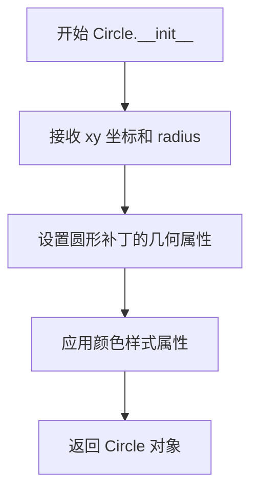

#### 带注释源码

```python
# 根据代码中的使用方式推断的调用方式
# p = Circle((30, 30), 25, color='C0')
#
# 参数说明：
#   - (30, 30): 圆心坐标 (xy)
#   - 25: 半径 (radius)
#   - color='C0': 填充颜色
```

> **注意**：由于 Circle 类的定义在 matplotlib 库源码中而非本代码文件，以上信息是基于代码使用方式推断得出的。如需完整的 Circle.__init__ 方法详细信息（包括所有参数、默认值、文档字符串等），建议参考 matplotlib 官方文档或查看 matplotlib 库的源代码。


### Annulus.__init__

该方法是 `Annulus` 类的构造函数，用于创建一个环形（圆环）图形对象。`Annulus` 是 matplotlib 中用于绘制同心圆环的 Patch 子类，支持通过指定外半径和宽度（厚度）或直接指定内、外半径来定义环形区域。

参数：

- `xy`：`tuple[float, float]`，圆心坐标，格式为 (x, y)
- `r`：`float` 或 `tuple[float, float]`，外半径。如果为单个数值，表示外半径；如果为元组，则表示 (外半径, 内半径)
- `width`：`float`，环的宽度（厚度），即外半径与内半径之差。当 `r` 为单个数值时使用
- `angle`：`float`，旋转角度（度），默认为 0
- `**kwargs`：其他传递给父类 `Patch` 的参数，如 `color`（颜色）、`fill`（是否填充）等

返回值：无（`None`），构造函数用于创建并初始化对象状态

#### 流程图

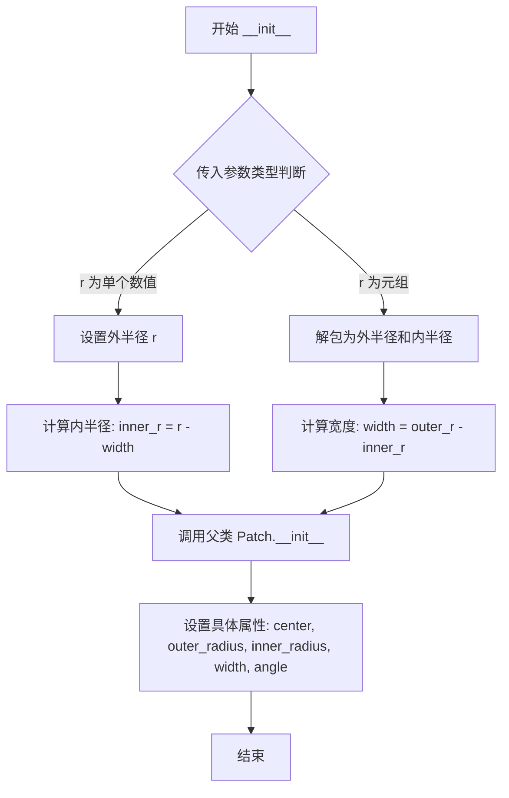

#### 带注释源码

```python
def __init__(self, xy, r, width, angle=0.0, **kwargs):
    """
    Create an annulus (ring) patch.

    Parameters
    ----------
    xy : (float, float)
        Center of the annulus (x, y).
    r : float or (float, float)
        If float: outer radius of the annulus.
        If tuple: (outer radius, inner radius).
    width : float
        Width (thickness) of the annulus, i.e., difference between
        outer and inner radius. Only used when *r* is a scalar.
    angle : float, default: 0
        Rotation angle in degrees.
    **kwargs
        Patch properties, such as color, fill, linewidth, etc.
        See matplotlib.patches.Patch for details.
    """
    # 调用父类 Patch 的初始化方法
    super().__init__(**kwargs)
    
    # 设置圆心坐标
    self.center = np.asarray(xy)
    
    # 处理外半径和宽度的不同输入形式
    if np.iterable(r):
        # 如果 r 是可迭代对象（tuple），则认为是 (outer_radius, inner_radius)
        self.outer_radius, self.inner_radius = r
        # 计算宽度：外半径 - 内半径
        self.width = self.outer_radius - self.inner_radius
    else:
        # 如果 r 是单个数值，则为外半径，宽度由 width 参数指定
        self.outer_radius = r
        self.width = width
        # 计算内半径：外半径 - 宽度
        self.inner_radius = self.outer_radius - width
    
    # 设置旋转角度
    self.angle = angle
```


## 关键组件


### AnnotationBbox

用于在指定位置创建包含任意艺术家的注释框，支持数据坐标、轴坐标、艺术家坐标等多种坐标系

### TextArea

用于创建纯文本注释容器，可独立于轴使用，适合为图形对象添加文字注释

### OffsetImage

用于将图像数组或图像文件作为注释，支持缩放、色彩映射等图像处理功能

### DrawingArea

用于容纳多个任意类型的艺术家（如图形、形状），可组合后作为单个注释对象

### ConnectionPatch

用于在两个坐标点之间绘制连接箭头，可指定起点和终点的坐标系统

### 坐标系统 (xycoords, boxcoords)

控制注释位置和注释框位置的坐标参考体系，支持'data'、'axes fraction'、'offset points'等模式

### 箭头属性 (arrowprops)

配置注释箭头的样式，包括箭头类型、连接样式、颜色等视觉属性


## 问题及建议


### 已知问题

-   **硬编码的魔法数字和字符串**：代码中存在大量硬编码的坐标值（如`xy1 = (.25, .75)`、`xybox=(0, 30)`）、缩放因子（`zoom=2`、`zoom=0.2`）、尺寸值（`120, 120`）等，缺乏可配置性和可维护性。
-   **直接操作内部属性**：`im.image.axes = ax` 和 `imagebox.image.axes = ax` 直接访问和修改对象的内部属性（`_image.axes`），这种方式不够优雅，破坏了封装性，应该使用官方提供的API方法。
-   **重复代码模式**：多次创建`AnnotationBbox`对象的模式高度相似（文本、图像、DrawingArea三种情况），代码重复度高，可抽象为通用函数。
-   **缺少错误处理**：代码没有对可能失败的操作用try-except包裹，例如`PIL.Image.open(img_fp)`如果文件不存在会直接抛出异常导致程序崩溃。
-   **资源未显式释放**：`PIL.Image.open()`打开的文件句柄虽然在with语句中正确关闭，但注释代码`im.image.axes = ax`修改了图像对象的内部状态，没有对应的清理逻辑。
-   **路径构建方式**：`Path(get_data_path(), "sample_data", "grace_hopper.jpg")`依赖于`get_data_path()`返回的路径，如果数据路径配置不正确或样本数据不存在，程序将失败。
-   **全局变量污染**：示例代码在模块顶层创建了大量变量（如`xy1`、`xy2`、`c`、`ab1`等），这些变量在实际应用中通常不应暴露在全局作用域。
-   **plt.show()阻塞**：代码末尾的`plt.show()`在示例中是阻塞的，在某些GUI后端或Jupyter环境中可能需要特殊处理。

### 优化建议

-   **抽象通用函数**：将`AnnotationBbox`的创建过程封装为函数，接受内容类型、位置、样式等参数，减少代码重复。
-   **添加错误处理**：为文件读取、图像加载等可能失败的操作添加try-except异常处理，并提供有意义的错误信息。
-   **配置常量化**：将魔法数字提取为模块级常量或配置类，提高代码可读性和可维护性。
-   **封装属性访问**：避免直接赋值`image.axes`，寻找或建议使用官方API方法操作对象属性。
-   **资源管理模式**：对于需要管理状态的对象，考虑使用上下文管理器或显式的`close()`/`cleanup()`方法。
-   **函数化封装**：将整个示例拆分为多个独立函数（如`create_text_annotation`、`create_image_annotation`、`create_artist_annotation`），每个函数负责一种注释类型的创建。
-   **类型提示**：为函数参数和返回值添加类型提示，提高代码的可读性和IDE支持。
-   **文档字符串**：为各函数添加详细的文档字符串，说明参数含义、返回值和可能的异常。


## 其它


### 设计目标与约束

本代码的设计目标是演示如何使用matplotlib的`.AnnotationBbox`将任意艺术家（文本、图像、图形）作为注释添加到图表中。设计约束包括：1）注释框的位置需要通过`xycoords`和`boxcoords`参数指定坐标系统；2）注释内容必须是matplotlib支持的艺术家对象；3）需要处理PIL图像读取、numpy数组转换等外部依赖。

### 错误处理与异常设计

代码中存在多个潜在的异常场景：1）PIL图像打开失败（文件不存在或格式错误），通过`try-except`块处理；2）matplotlib坐标系统无效时的异常由底层库自动抛出；3）数组维度不匹配时NumPy会抛出`ValueError`；4）路径不存在时`Path`对象构造会失败。设计时未显式捕获这些异常，依赖matplotlib的错误提示机制。

### 数据流与状态机

代码的数据流如下：初始化figure和axes → 定义注释目标点(xy坐标) → 创建注释内容(文本/图像/图形) → 创建`AnnotationBbox`实例 → 通过`add_artist`添加到figure或axes → `plt.show()`渲染显示。状态机转换路径：空状态 → 坐标定义状态 → 注释创建状态 → 渲染完成状态。

### 外部依赖与接口契约

主要外部依赖包括：1）`PIL(Pillow)`库用于打开和处理JPEG图像；2）`numpy`库用于创建像素数组；3）`matplotlib`核心库（`offsetbox`、`patches`、`pyplot`）。接口契约方面：`AnnotationBbox`构造函数接受`xy`(注释点坐标)、`xybox`(注释框坐标)、`xycoords`(坐标参考系)、`boxcoords`(框坐标参考系)、`arrowprops`(箭头属性)、`bboxprops`(边框属性)等参数。

### 性能考量与优化空间

当前实现存在以下性能考量点：1）每次运行都重新创建figure和axes，频繁调用plt.show()；2）PIL图像在with块外部使用存在资源泄漏风险；3）大量注释时未使用对象池化或缓存机制。优化方向：可预先加载图像资源并复用；使用`draw_idle()`替代完整重绘；考虑将静态注释对象缓存。

### 安全性设计

代码主要运行在客户端可视化场景，安全性考量相对较少。主要风险点：1）从外部路径加载图像需验证文件路径安全性，防止路径遍历攻击；2）用户提供的坐标数据需进行边界检查，避免渲染越界；3）`exec`或`eval`类函数未被使用，注入风险较低。

### 兼容性分析

代码兼容Python 3.x版本，需matplotlib 3.5+版本以支持所有特性。PIL依赖需要Pillow库。numpy版本需支持`reshape`操作。平台兼容性良好，跨Windows/Linux/macOS平台。matplotlib后端选择通过`plt.use()`或配置文件指定，默认自动选择。

### 测试策略建议

建议添加以下测试用例：1）单元测试验证`AnnotationBbox`各种坐标系统组合；2）集成测试验证图像加载流程；3）性能测试对比不同渲染方式的效率；4）异常测试验证无效输入的报错行为；5）可视化回归测试确保不同版本渲染一致性。

### 配置与可扩展性

当前代码硬编码了多个参数（如缩放倍数、边距值），建议提取为配置常量或外部配置文件。`AnnotationBbox`支持自定义`box_alignment`和`arrowprops`，可通过工厂模式扩展更多注释样式。`OffsetBox`子类可继承扩展以支持自定义注释容器。


    