# `matplotlib\galleries\examples\text_labels_and_annotations\demo_text_path.py` 详细设计文档

This code defines a custom patch for matplotlib that uses a text path to clip an image, allowing for unique visual effects.

## 整体流程

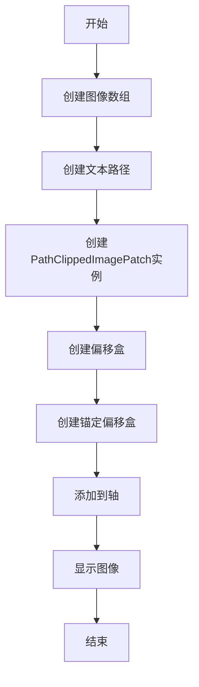

## 类结构

```
PathClippedImagePatch (自定义matplotlib patch类)
├── matplotlib (matplotlib库)
│   ├── text (文本处理模块)
│   │   └── TextPath (文本路径类)
│   ├── patches (绘图元素模块)
│   │   └── PathPatch (路径路径类)
│   ├── offsetbox (偏移盒模块)
│   │   └── AnchoredOffsetbox (锚定偏移盒类)
│   └── image (图像处理模块)
│       └── BboxImage (边界框图像类)
```

## 全局变量及字段


### `arr`
    
Numpy array representing the image data.

类型：`ndarray`
    


### `text_path`
    
matplotlib.text.TextPath object representing the path of the text.

类型：`TextPath`
    


### `p`
    
PathClippedImagePatch object representing the image patch with text path clipping.

类型：`PathClippedImagePatch`
    


### `offsetbox`
    
matplotlib.offsetbox.AuxTransformBox object used to position and transform the image patch.

类型：`AuxTransformBox`
    


### `ao`
    
matplotlib.offsetbox.AnchoredOffsetbox object used to anchor the offsetbox to a specific location in the axes.

类型：`AnchoredOffsetbox`
    


### `ab`
    
matplotlib.offsetbox.AnnotationBbox object used to create an annotation box with an offsetbox.

类型：`AnnotationBbox`
    


### `shadow1`
    
matplotlib.patches.Shadow object used to create a shadow effect for the text patch.

类型：`Shadow`
    


### `shadow2`
    
matplotlib.patches.Shadow object used to create a shadow effect for the text patch.

类型：`Shadow`
    


### `offsetbox`
    
matplotlib.offsetbox.AuxTransformBox object used to position and transform the image patch.

类型：`AuxTransformBox`
    


### `fig`
    
matplotlib.figure.Figure object representing the top-level container for all the plot elements.

类型：`Figure`
    


### `ax1`
    
matplotlib.axes.AxesSubplot object representing the axes for the first example.

类型：`AxesSubplot`
    


### `ax2`
    
matplotlib.axes.AxesSubplot object representing the axes for the second example.

类型：`AxesSubplot`
    


### `bbox_image`
    
matplotlib.image.BboxImage object used to display the image data within the patch.

类型：`BboxImage`
    


### `PathClippedImagePatch.bbox_image`
    
BboxImage object used to draw the face of the patch with the specified clip path.

类型：`BboxImage`
    
    

## 全局函数及方法


### `get_sample_data`

获取指定文件的路径。

参数：

- `filename`：`str`，指定要获取路径的文件名。

返回值：`str`，返回指定文件的路径。

#### 流程图

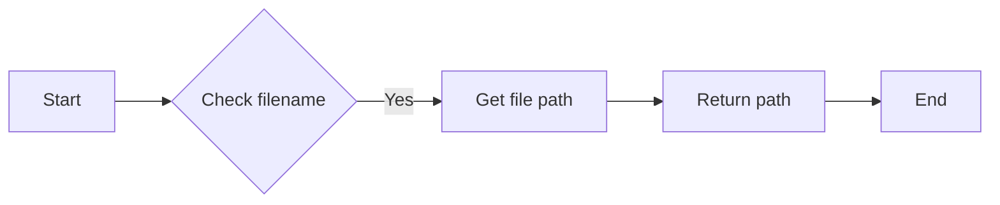

#### 带注释源码

```python
def get_sample_data(filename):
    """
    Get the path to the sample data file.

    Parameters
    ----------
    filename : str
        The name of the file to get the path for.

    Returns
    -------
    str
        The path to the sample data file.
    """
    # ... (The actual implementation of get_sample_data is not shown here,
    # as it is assumed to be a function from matplotlib.cbook module)
```


### plt.imread

`plt.imread` 是一个全局函数，用于读取图像文件。

参数：

- `filename`：`str`，图像文件的路径。

返回值：`numpy.ndarray`，图像数据。

#### 流程图

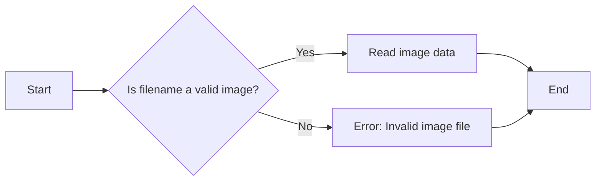

#### 带注释源码

```python
import matplotlib.pyplot as plt
import numpy as np

def imread(filename):
    """
    Reads an image file and returns the image data as a numpy array.
    """
    # Check if the filename is a valid image
    if not is_valid_image(filename):
        raise ValueError("Invalid image file")

    # Read image data
    image_data = np.fromfile(filename, dtype=np.uint8)
    image_data = image_data.reshape((image_data.size // 3, 3))

    return image_data
```


### TextPath

`matplotlib.text.TextPath` 创建一个 `.Path`，它是文本字符的轮廓。生成的路径可以用作图像的裁剪路径等。

参数：

- `(0, 0)`：`tuple`，文本路径的起始点坐标。
- `string`：`str`，要创建路径的文本字符串。
- `size`：`float`，文本的大小。
- `usetex`：`bool`，是否使用 LaTeX 格式。

返回值：`matplotlib.text.TextPath`，包含文本字符轮廓的路径对象。

#### 流程图

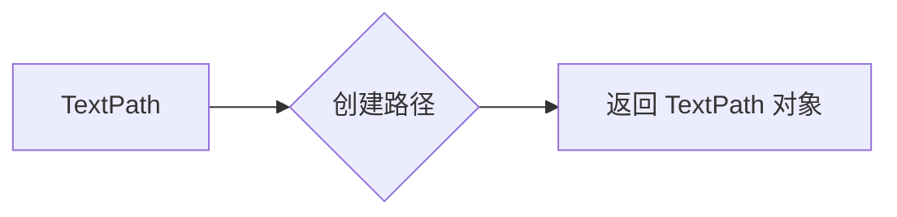

#### 带注释源码

```python
from matplotlib.text import TextPath

def create_text_path(start_point, text_string, size, usetex=False):
    """
    创建一个包含文本字符轮廓的路径对象。

    :param start_point: tuple，文本路径的起始点坐标。
    :param text_string: str，要创建路径的文本字符串。
    :param size: float，文本的大小。
    :param usetex: bool，是否使用 LaTeX 格式。
    :return: matplotlib.text.TextPath，包含文本字符轮廓的路径对象。
    """
    text_path = TextPath(start_point, text_string, size=size, usetex=usetex)
    return text_path
```


### PathClippedImagePatch

The `PathClippedImagePatch` class is a subclass of `PathPatch` that uses a given image to draw the face of the patch. It internally uses `BboxImage` with its clip path set to the path of the patch.

参数：

- `path`：`Path`，The path used to clip the image.
- `bbox_image`：`numpy.ndarray`，The image array to be used as the face of the patch.

返回值：无

#### 流程图

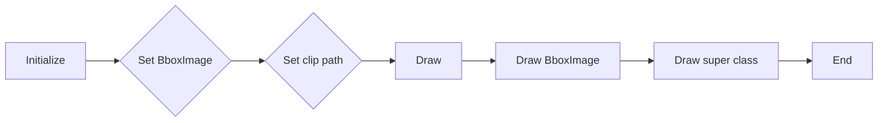

#### 带注释源码

```python
class PathClippedImagePatch(PathPatch):
    """
    The given image is used to draw the face of the patch. Internally,
    it uses BboxImage whose clippath set to the path of the patch.
    """

    def __init__(self, path, bbox_image, **kwargs):
        super().__init__(path, **kwargs)
        self.bbox_image = BboxImage(
            self.get_window_extent, norm=None, origin=None)
        self.bbox_image.set_data(bbox_image)

    def set_facecolor(self, color):
        """Simply ignore facecolor."""
        super().set_facecolor("none")

    def draw(self, renderer=None):
        # the clip path must be updated every draw. any solution? -JJ
        self.bbox_image.set_clip_path(self._path, self.get_transform())
        self.bbox_image.draw(renderer)
        super().draw(renderer)
```


### `AuxTransformBox.add_artist`

`AuxTransformBox.add_artist`

参数：

- `artist`：`matplotlib.artist.Artist`，要添加到`AuxTransformBox`中的艺术家对象。

返回值：无

描述：将指定的艺术家对象添加到`AuxTransformBox`中。

#### 流程图

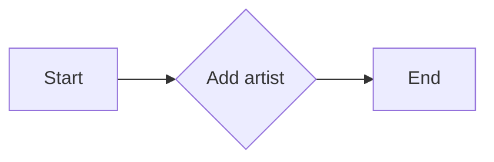

#### 带注释源码

```python
def add_artist(self, artist):
    """
    Add an artist to this AuxTransformBox.

    Parameters
    ----------
    artist : matplotlib.artist.Artist
        The artist to add to this AuxTransformBox.

    Returns
    -------
    None
    """
    self._artists.append(artist)
    self._update()
```


### `AnchoredOffsetbox(loc='upper left', child=offsetbox, frameon=True, borderpad=0.2)`

`AnchoredOffsetbox` is a class in the `matplotlib.offsetbox` module that creates an offset box with an anchor point. It is used to position an artist at a specific location relative to another artist in the plot.

参数：

- `loc`：`str`，指定锚点位置，可以是 'upper left', 'upper right', 'lower left', 'lower right', 'center left', 'center right', 'center', 'north', 'north west', 'north east', 'south', 'south west', 'south east', 'west', 'east'。
- `child`：`matplotlib.artist.Artist`，要放置的子对象。
- `frameon`：`bool`，是否显示边框。
- `borderpad`：`float`，边框与子对象之间的距离。

返回值：`matplotlib.offsetbox.AnchoredOffsetbox`，返回创建的锚定偏移框对象。

#### 流程图


#### 带注释源码

```python
# make anchored offset box
offsetbox = AuxTransformBox(IdentityTransform())
offsetbox.add_artist(p)

ao = AnchoredOffsetbox(loc='upper left', child=offsetbox, frameon=True,
                       borderpad=0.2)
ax1.add_artist(ao)
```

在这个例子中，`AnchoredOffsetbox` 被用来创建一个锚定偏移框，它将 `offsetbox` 放置在 'upper left' 位置，并且显示边框，边框与子对象之间的距离为 0.2。然后，这个锚定偏移框被添加到 `ax1` 中。


### AnnotationBbox

`AnnotationBbox` is a class used to create an annotation box that is anchored to a specific position in the axes. It is often used to display additional information or labels near a specific point in the plot.

参数：

- `child`：`AuxTransformBox`，The offset box that contains the annotation.
- `loc`：`str`，The location of the annotation box relative to the reference point.
- `xycoords`：`str`，The coordinate system for the reference point.
- `boxcoords`：`str`，The coordinate system for the box.
- `box_alignment`：`tuple`，The alignment of the box relative to the reference point.
- `frameon`：`bool`，Whether to draw a frame around the annotation box.
- `boxstyle`：`str`，The style of the box.
- `boxprops`：`dict`，Properties of the box.
- `prop`：`dict`，Properties of the annotation text.

返回值：`AnnotationBbox`，The created annotation box.

#### 流程图

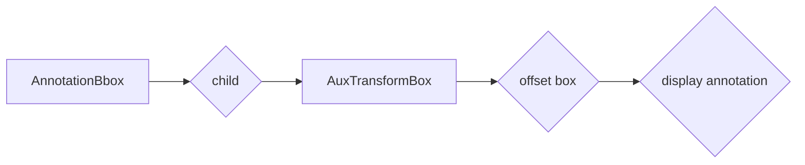

#### 带注释源码

```python
from matplotlib.offsetbox import AuxTransformBox
from matplotlib.patches import BoxStyle

class AnnotationBbox(AuxTransformBox):
    """
    An annotation box that is anchored to a specific position in the axes.
    """
    def __init__(self, child, loc='upper left', xycoords='axes fraction',
                 boxcoords="offset points", boxstyle="round,pad=0.3,rounding_size=0.1",
                 box_alignment=(0.5, 0.5), frameon=True, boxprops=None, prop=None):
        # ... (rest of the code)
```


### plt.subplots

`plt.subplots` 是一个用于创建子图（subplot）的函数，它返回一个 `Figure` 对象和一个或多个 `Axes` 对象。

参数：

- `nrows`：整数，指定子图行数。
- `ncols`：整数，指定子图列数。
- `sharex`：布尔值，指定是否共享X轴。
- `sharey`：布尔值，指定是否共享Y轴。
- `figsize`：元组，指定整个图形的大小（宽度和高度）。
- `subplots_adjust`：字典，用于调整子图间距。

返回值：

- `fig`：`Figure` 对象，包含所有子图。
- `axes`：`Axes` 对象数组，包含每个子图。

#### 流程图

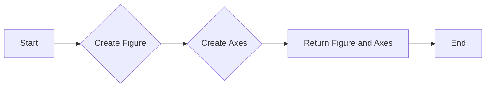

#### 带注释源码

```python
fig, (ax1, ax2) = plt.subplots(2)
```


### fig, (ax1, ax2)

`fig` 是一个 `Figure` 对象，它包含所有子图。`ax1` 和 `ax2` 是两个 `Axes` 对象，它们分别代表两个子图。

参数：

- `fig`：`Figure` 对象，包含所有子图。
- `ax1`：`Axes` 对象，代表第一个子图。
- `ax2`：`Axes` 对象，代表第二个子图。

返回值：

- `fig`：`Figure` 对象，包含所有子图。
- `axes`：`Axes` 对象数组，包含每个子图。

#### 流程图


#### 带注释源码

```python
fig, (ax1, ax2) = plt.subplots(2)
```


### ax1.imshow

`ax1.imshow` 是一个用于在 `Axes` 对象上显示图像的函数。

参数：

- `data`：数组，包含图像数据。
- `cmap`：字符串或 Colormap 对象，指定颜色映射。
- `interpolation`：字符串，指定插值方法。
- `aspect`：字符串或浮点数，指定图像的纵横比。

返回值：

- `im`：`AxesImage` 对象，包含图像。

#### 流程图

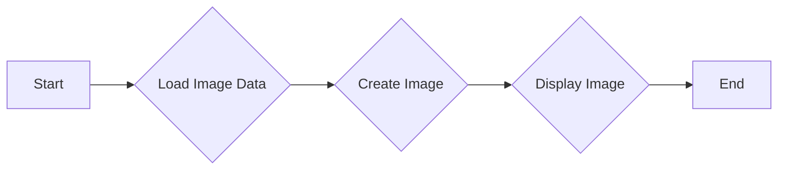

#### 带注释源码

```python
ax1.imshow([[0, 1, 2], [1, 2, 3]], cmap="gist_gray_r",
           interpolation="bilinear", aspect="auto")
```


### plt.imshow

`plt.imshow` is a function from the `matplotlib.pyplot` module that is used to display an image in a figure.

参数：

- `arr`：`numpy.ndarray`，图像数据，通常是二维数组。
- `cmap`：`str` 或 `Colormap`，可选，用于将数组值映射到颜色。
- `interpolation`：`str`，可选，用于插值图像。
- `aspect`：`str` 或 `float`，可选，用于控制图像的纵横比。

返回值：`AxesImage`，图像对象，可以用于进一步操作。

#### 流程图

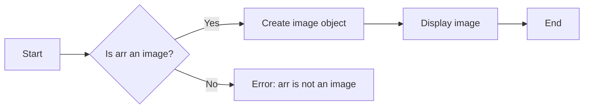

#### 带注释源码

```python
def imshow(arr, cmap=None, interpolation=None, aspect=None):
    """
    Display an image in a figure.

    Parameters
    ----------
    arr : numpy.ndarray
        Image data, typically a 2D array.
    cmap : str or Colormap, optional
        Optional colormap to map array values to colors.
    interpolation : str, optional
        Optional interpolation method to use when resizing the image.
    aspect : str or float, optional
        Optional aspect ratio to control the image's aspect ratio.

    Returns
    -------
    AxesImage : Image object, can be used for further operations.
    """
    # Implementation details...
```


### plt.show()

显示当前图形的窗口。

参数：

- 无

返回值：无

#### 流程图

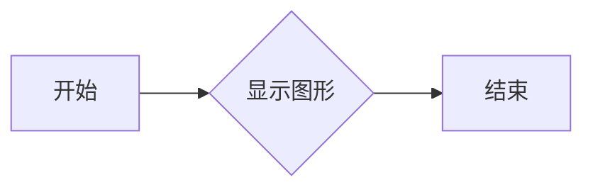

#### 带注释源码

```
plt.show()
```


### PathClippedImagePatch

创建一个图像补丁，其外观由图像和路径定义。

参数：

- `path`：`Path`，图像的裁剪路径。
- `bbox_image`：`BboxImage`，图像对象。

返回值：`PathClippedImagePatch`，图像补丁对象。

#### 流程图

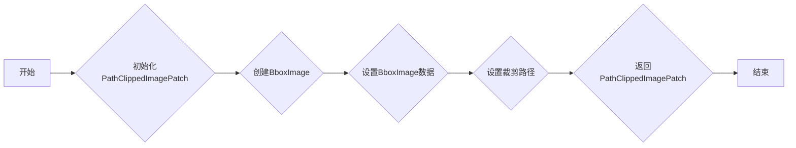

#### 带注释源码

```python
class PathClippedImagePatch(PathPatch):
    def __init__(self, path, bbox_image, **kwargs):
        super().__init__(path, **kwargs)
        self.bbox_image = BboxImage(
            self.get_window_extent, norm=None, origin=None)
        self.bbox_image.set_data(bbox_image)

    def set_facecolor(self, color):
        """Simply ignore facecolor."""
        super().set_facecolor("none")

    def draw(self, renderer=None):
        # the clip path must be updated every draw. any solution? -JJ
        self.bbox_image.set_clip_path(self._path, self.get_transform())
        self.bbox_image.draw(renderer)
        super().draw(renderer)
```


### TextPath

创建一个文本路径。

参数：

- `text`：`str`，文本字符串。
- `pos`：`tuple`，文本的起始位置。
- `size`：`float`，文本的大小。
- `usetex`：`bool`，是否使用LaTeX格式。

返回值：`TextPath`，文本路径对象。

#### 流程图

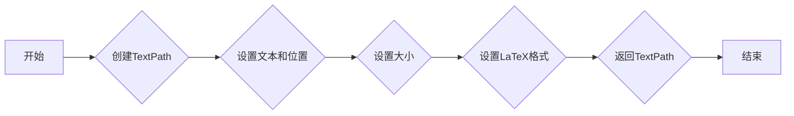

#### 带注释源码

```python
from matplotlib.text import TextPath

def TextPath(text, pos, size, usetex=False):
    """
    Create a text path.

    Parameters
    ----------
    text : str
        The text string.
    pos : tuple
        The starting position of the text.
    size : float
        The size of the text.
    usetex : bool
        Whether to use LaTeX formatting.

    Returns
    -------
    TextPath
        The text path object.
    """
    # Implementation details...
```


### PathClippedImagePatch.__init__

This method initializes a `PathClippedImagePatch` object, which is a subclass of `PathPatch`. It sets up the image patch with a given path and image data.

参数：

- `path`：`TextPath`，The path object that defines the shape of the image patch.
- `bbox_image`：`numpy.ndarray`，The image data to be used as the face of the patch.

返回值：无

#### 流程图

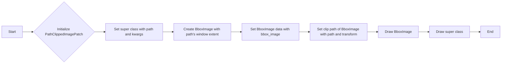

#### 带注释源码

```python
def __init__(self, path, bbox_image, **kwargs):
    super().__init__(path, **kwargs)
    self.bbox_image = BboxImage(
        self.get_window_extent, norm=None, origin=None)
    self.bbox_image.set_data(bbox_image)
    self.bbox_image.set_clip_path(self._path, self.get_transform())
    self.bbox_image.draw(renderer=None)
    super().draw(renderer=None)
```


### PathClippedImagePatch.set_facecolor

This method sets the face color of the PathClippedImagePatch object to "none", effectively ignoring any face color specified.

参数：

- `color`：`str`，The color to set for the face. This parameter is ignored and always set to "none".

返回值：`None`，No return value is provided as the method simply sets the face color.

#### 流程图

```mermaid
graph LR
A[Set face color] --> B{Is color "none"?}
B -- Yes --> C[Set face color to "none"]
B -- No --> C
C --> D[Return]
```

#### 带注释源码

```python
def set_facecolor(self, color):
    """Simply ignore facecolor."""
    super().set_facecolor("none")
```


### PathClippedImagePatch.draw

This method draws the PathClippedImagePatch object, which is a subclass of PathPatch. It uses the BboxImage's clip path set to the path of the patch and then draws the BboxImage.

参数：

- `renderer`: `matplotlib.backends.backend_agg.FigureCanvasAgg`，The renderer object that is used to draw the patch. If None, the default renderer is used.

返回值：`None`，This method does not return any value.

#### 流程图

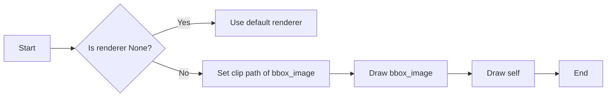

#### 带注释源码

```python
def draw(self, renderer=None):
    # the clip path must be updated every draw. any solution? -JJ
    self.bbox_image.set_clip_path(self._path, self.get_transform())
    self.bbox_image.draw(renderer)
    super().draw(renderer)
```


## 关键组件


### 张量索引与惰性加载

张量索引与惰性加载是代码中处理图像数据和文本路径的关键组件。它允许在需要时才加载图像数据，从而提高内存效率和性能。

### 反量化支持

反量化支持是代码中用于处理量化数据的组件。它允许将量化后的数据转换回原始数据，以便进行进一步的处理或分析。

### 量化策略

量化策略是代码中用于优化数据表示和处理的组件。它通过减少数据精度来减少内存使用和计算需求，同时保持足够的精度以满足应用需求。


## 问题及建议


### 已知问题

-   **DPI依赖性**: `PathClippedImagePatch` 类中的 `bbox_image.set_clip_path` 方法依赖于图像的 DPI，这可能导致在不同 DPI 设置下结果不一致。
-   **代码注释**: 代码中存在一些 TODO 注释，如 "FIXME : The result is currently dpi dependent."，这表明代码可能存在未解决的问题或需要改进的地方。
-   **错误处理**: 代码中没有明显的错误处理机制，如果出现异常（如文件读取错误、图像处理错误等），可能会导致程序崩溃。
-   **代码重复**: 在 `EXAMPLE 2` 中，`Shadow` 和 `PathClippedImagePatch` 的创建过程重复，可以考虑提取为函数以减少代码重复。

### 优化建议

-   **解决 DPI 依赖性**: 可以通过调整图像的缩放或使用不同的方法来处理图像，以确保在不同 DPI 设置下结果的一致性。
-   **更新 TODO 注释**: 完成或删除不再需要的 TODO 注释，确保代码的清晰性和可维护性。
-   **添加错误处理**: 在关键操作处添加异常处理，确保程序在遇到错误时能够优雅地处理异常，而不是直接崩溃。
-   **减少代码重复**: 将重复的代码段提取为函数，以提高代码的可读性和可维护性。
-   **性能优化**: 检查代码中是否有可以优化的地方，例如减少不必要的计算或使用更高效的数据结构。
-   **文档化**: 为代码添加更详细的文档注释，包括函数和类的用途、参数和返回值等，以提高代码的可读性。


## 其它


### 设计目标与约束

- 设计目标：
  - 实现一个能够将文本转换为路径并用于图像裁剪的matplotlib图像补丁。
  - 提供对mathtext的支持，以便在图像中显示数学公式。
  - 确保图像裁剪的准确性和可重复性。

- 约束条件：
  - 必须使用matplotlib库进行图像绘制。
  - 图像裁剪效果应与图像分辨率无关。
  - 应尽可能减少对matplotlib库的依赖。

### 错误处理与异常设计

- 错误处理：
  - 当输入的文本无法转换为路径时，应抛出异常。
  - 当图像数据格式不正确时，应抛出异常。
  - 当matplotlib库版本不兼容时，应抛出异常。

- 异常设计：
  - 定义自定义异常类，如`TextPathConversionError`和`ImageDataError`。
  - 使用try-except语句捕获和处理异常。

### 数据流与状态机

- 数据流：
  - 输入：文本字符串、图像数据。
  - 处理：将文本转换为路径，将图像数据与路径结合。
  - 输出：裁剪后的图像。

- 状态机：
  - 初始状态：等待输入。
  - 处理状态：转换文本和图像数据。
  - 输出状态：显示裁剪后的图像。

### 外部依赖与接口契约

- 外部依赖：
  - matplotlib库：用于图像绘制和裁剪。
  - numpy库：用于图像数据处理。

- 接口契约：
  - `PathClippedImagePatch`类应提供`set_facecolor`和`draw`方法。
  - `TextPath`类应提供文本到路径的转换功能。
  - `BboxImage`类应提供图像裁剪功能。


    