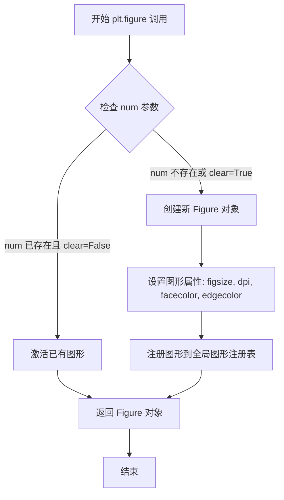
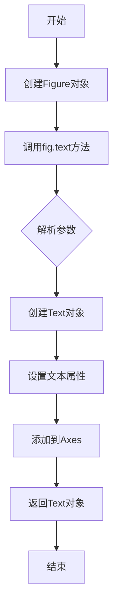
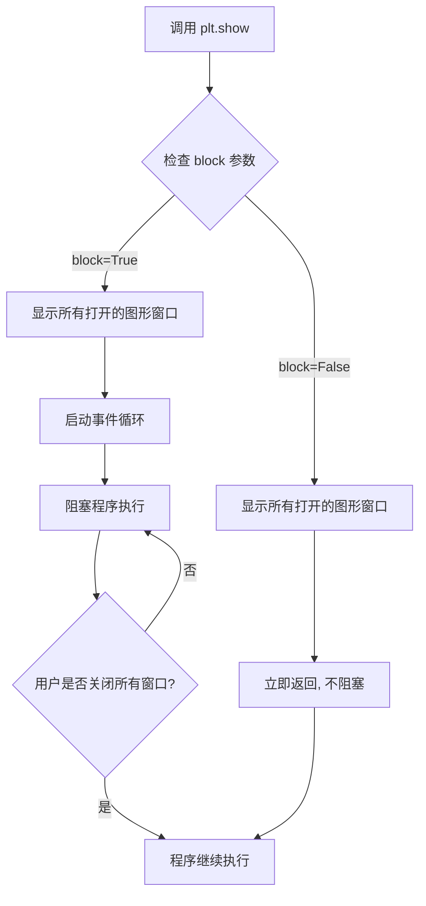

# `matplotlib\galleries\examples\text_labels_and_annotations\dfrac_demo.py` 详细设计文档

这是一个Matplotlib示例脚本，用于展示LaTeX中\dfrac（显示风格分数）和\frac（文本风格分数）宏的区别，通过在图形不同位置渲染两种分数样式来直观比较它们的视觉呈现效果。

## 整体流程

```mermaid
graph TD
    A[开始] --> B[导入matplotlib.pyplot模块]
    B --> C[创建图形窗口 figsize=(5.25, 0.75)]
    C --> D[在位置(0.5, 0.3)添加dfrac文本]
    D --> E[在位置(0.5, 0.7)添加frac文本]
E --> F[调用plt.show()显示图形]
F --> G[结束]
```

## 类结构

```
该脚本为扁平结构，无类层次
仅包含主流程代码模块
```

## 全局变量及字段


### `fig`
    
创建的图形对象实例，用于承载和显示文本图形元素

类型：`matplotlib.figure.Figure`
    


    

## 全局函数及方法


### plt.figure

创建图形窗口并返回Figure对象，用于后续的图形绘制和文本添加操作。

参数：

- `figsize`：`tuple[float, float]`，图形的宽和高（英寸），默认值为 `rcParams["figure.figsize"]`
- `dpi`：`float`，图形每英寸的点数（分辨率），默认值为 `rcParams["figure.dpi"]`
- `facecolor`：`str` 或 `tuple`，图形背景颜色，默认值为 `rcParams["figure.facecolor"]`
- `edgecolor`：`str` 或 `tuple`，图形边框颜色，默认值为 `rcParams["figure.edgecolor"]`
- `frameon`：`bool`，是否显示图形边框，默认值为 `True`
- `num`：`int`、`str` 或 `None`，图形编号或窗口标题，若存在相同num的图形则激活该图形而不是创建新图形
- `FigureClass`：`type`，自定义Figure类，默认值为 `matplotlib.figure.Figure`
- `clear`：`bool`，如果num已存在且为True，则清除现有图形，默认值为 `False`
- `**kwargs`：其他关键字参数，传递给Figure构造函数

返回值：`matplotlib.figure.Figure`，创建的图形对象，用于后续的图形操作（如添加文本、坐标轴等）

#### 流程图



#### 带注释源码

```python
def figure(
    figsize=None,      # 图形尺寸 (宽度, 高度) 单位英寸
    dpi=None,           # 每英寸点数，分辨率
    facecolor=None,     # 背景颜色
    edgecolor=None,     # 边框颜色  
    frameon=True,      # 是否显示边框
    num=None,           # 图形编号或窗口标题，用于标识和重用图形
    FigureClass=<class 'matplotlib.figure.Figure'>,  # 自定义Figure类
    clear=False,        # 是否在图形已存在时清除
    **kwargs            # 其他传递给Figure的参数
):
    """
    创建一个新的图形窗口并返回Figure对象。
    
    参数:
        figsize: 宽高比，格式为 (width, height) 单位英寸
        dpi: 每英寸像素数，决定图形清晰度
        facecolor: 背景色，可接受颜色字符串或RGB元组
        edgecolor: 边框颜色
        frameon: 是否显示图形边框
        num: 图形标识符，相同num会复用已有图形
        FigureClass: 用于实例化的Figure类
        clear: 当num对应图形已存在时是否清除
        **kwargs: 额外参数传递给Figure构造函数
    
    返回:
        Figure对象，可用于添加子图、文本、线条等图形元素
    
    示例:
        fig = plt.figure(figsize=(5.25, 0.75))  # 创建窄长图形
        fig.text(0.5, 0.5, 'Hello')             # 添加文本
    """
    # 内部实现会调用FigureClass创建图形
    # 并将其注册到pyplot的全局图形管理器中
    ...
```


### `Figure.text`

在图形指定位置添加文本的方法，返回一个 `Text` 对象，可用于设置文本样式属性。

参数：

- `x`：`float`，文本的 x 坐标（相对于图形坐标系的水平位置，取值范围 0-1）
- `y`：`float`，文本的 y 坐标（相对于图形坐标系的垂直位置，取值范围 0-1）
- `s`：`str`，要显示的文本内容，支持 LaTeX 格式的数学表达式
- `horizontalalignment`：`str`，水平对齐方式，可选 'center'、'left'、'right'，默认为 'left'
- `verticalalignment`：`str`，垂直对齐方式，可选 'center'、'top'、'bottom'、'baseline'，默认根据 y 位置判断
- `**kwargs`：其他可选参数，包括 fontsize、fontweight、color、fontfamily 等 Text 属性

返回值：`matplotlib.text.Text`，返回创建的文本对象，可用于后续样式修改

#### 流程图



#### 带注释源码

```python
# 创建图形对象，设置图形大小为 5.25 x 0.75 英寸
fig = plt.figure(figsize=(5.25, 0.75))

# ============================================
# 方法: fig.text
# 功能: 在图形的指定位置添加文本
# ============================================

# 第一次调用 fig.text:
# - x=0.5: 文本水平居中 (图形宽度的50%位置)
# - y=0.3: 文本放置在图形高度的30%位置
# - s=r'\dfrac: $\dfrac{a}{b}$': 显示 LaTeX 公式（显示样式分数）
# - horizontalalignment='center': 水平居中对齐
# - verticalalignment='center': 垂直居中对齐
# 返回值: Text 对象，可用于后续样式调整
fig.text(0.5, 0.3, r'\dfrac: $\dfrac{a}{b}$',
         horizontalalignment='center', verticalalignment='center')

# 第二次调用 fig.text:
# - x=0.5: 文本水平居中
# - y=0.7: 文本放置在图形高度的70%位置
# - s=r'\frac: $\frac{a}{b}$': 显示 LaTeX 公式（行内样式分数）
# - horizontalalignment='center': 水平居中对齐
# - verticalalignment='center': 垂直居中对齐
fig.text(0.5, 0.7, r'\frac: $\frac{a}{b}$',
         horizontalalignment='center', verticalalignment='center')

# 显示图形窗口
plt.show()
```


### `plt.show`

显示图形窗口，并阻塞程序执行直到用户关闭所有打开的窗口（在默认阻塞模式下）。这是 matplotlib 中用于将图形呈现给用户的核心函数。

参数：

- `block`：`bool`，可选。控制是否阻塞程序执行。默认为 `True`。如果为 `True`，则显示窗口并阻塞程序，直到用户关闭所有窗口；如果为 `False`，则立即返回，图形仍然会显示。

返回值：`None`，该函数无返回值。

#### 流程图



#### 带注释源码

```python
def show(*, block=None):
    """
    显示所有打开的图形窗口。
    
    此函数会显示由 figure()、subplot() 等创建的所有图形，并根据 block 参数
    决定是否阻塞程序执行。在大多数情况下，需要在脚本最后调用 show() 来
    显示图形。
    
    参数:
        block (bool | None): 控制是否阻塞程序执行。
            - True: 显示窗口并阻塞程序，直到用户关闭所有窗口。
            - False: 立即返回，图形仍然会显示。
            - None (默认): 在交互式后端中行为类似于 False，
                          在非交互式后端中行为类似于 True。
    
    返回值:
        None
    
    示例:
        >>> import matplotlib.pyplot as plt
        >>> plt.plot([1, 2, 3], [4, 5, 6])
        >>> plt.show()  # 显示图形并阻塞
    """
    # 获取全局图形管理器
    global _show_registry
    
    # 检查是否有可用的显示后端
    backend = matplotlib.get_backend()
    
    # 获取当前所有打开的图形编号
    open_figures = get_fignums()  # 返回如 [1, 2, 3] 的列表
    
    if not open_figures:
        # 如果没有打开的图形，直接返回
        return
    
    # 处理 block 参数
    # 如果 block 为 None，根据是否交互式环境决定行为
    if block is None:
        block = not plt.isinteractive()
    
    # 对于每个打开的图形，调用其 show 方法
    for fig_num in open_figures:
        figure(fig_num).show()
    
    if block:
        # 阻塞模式：启动 GUI 事件循环并等待
        # 这通常会锁定在 mainloop 中，直到所有窗口关闭
        _Backend.show(backend)  # 调用后端的 show 方法
        
        # 某些后端可能需要显式清理
        close('all')  # 关闭所有图形
    else:
        # 非阻塞模式：立即返回
        # 图形已显示，但程序继续执行
        pass
    
    return None
```

## 关键组件


### Matplotlib图形环境配置

通过plt.figure()创建图形窗口，设置画布大小为5.25x0.75英寸

### 图形文本渲染

使用fig.text()在图形指定位置(0.5, 0.3和0.5, 0.7)渲染LaTeX格式文本，horizontalalignment和verticalalignment参数控制文本对齐方式

### LaTeX displaystyle分数

使用$\dfrac{a}{b}$渲染display风格的分数，适用于需要大号展示的场景

### LaTeX textstyle分数

使用$\frac{a}{b}$渲染文本风格的分数，适用于行内较小展示的场景

### 图形显示控制

plt.show()调用阻塞模式显示图形，渲染所有创建的图形对象到屏幕


## 问题及建议


### 已知问题

- 图形尺寸硬编码为(5.25, 0.75)，比例过于扁平，在不同显示环境下可能无法良好展示
- 文本位置使用硬编码的坐标(0.5, 0.3)和(0.5, 0.7)，缺乏响应式布局机制
- 缺少图形保存逻辑，仅依赖plt.show()交互式展示，无法自动化处理
- 文档字符串中提到dfrac与LaTeX引擎的兼容性注意事项，但代码中使用的是mathtext引擎，两者的说明存在轻微混淆
- 缺少对图形对象的错误处理，如窗口尺寸异常或渲染失败的情况
- 注释中提到需要导入amsmath包来实现dfrac的LaTeX支持，但未在代码中体现或说明

### 优化建议

- 将图形尺寸、文本位置等硬编码值提取为配置参数或使用相对布局（如GridSpec）
- 添加图形保存功能，支持保存为PNG、PDF等格式以适应不同使用场景
- 明确区分mathtext和LaTeX引擎的文档说明，避免用户困惑
- 添加try-except块处理可能的渲染异常
- 考虑使用plt.subplots()替代figure()以保持与现代Matplotlib API的一致性
- 为关键配置值（如分数类型、文本内容）提供可复用的配置字典


## 其它


### 设计目标与约束

本代码示例旨在演示matplotlib中dfrac和frac TeX宏在渲染分数时的视觉差异，帮助开发者理解显示样式（displaystyle）与文本样式（textstyle）的区别。约束条件包括：需要使用支持Mathtext的matplotlib后端，且在LaTeX引擎下使用dfrac需要额外配置amsmath包。

### 错误处理与异常设计

由于代码为简单的展示示例，未包含复杂的错误处理逻辑。潜在的异常情况包括：图形后端不可用、字体缺失导致无法渲染TeX表达式、窗口关闭异常等。在实际应用中应添加try-except块捕获渲染异常，并提供降级显示方案。

### 数据流与状态机

本代码的数据流较为简单：初始化figure对象 → 设置图形尺寸 → 添加文本对象（含TeX表达式）→ 调用show()渲染显示。状态转换包括：图形创建态 → 文本添加态 → 渲染完成态 → 显示态。

### 外部依赖与接口契约

主要依赖matplotlib库的figure、text函数及pyplot模块。接口契约包括：fig.text()接收x坐标、y坐标、文本内容、水平对齐方式和垂直对齐方式参数；plt.show()触发图形窗口显示。外部依赖版本要求matplotlib 2.1及以上版本。

### 性能考量

代码性能开销主要在于TeX表达式的解析和渲染过程。优化方向包括：对于静态图像可使用savefig直接保存避免交互开销；复杂场景下可考虑预先缓存渲染结果；批量生成时可复用figure对象。

### 可配置项

可通过matplotlib RC参数配置的部分包括：figure.figsize设置图形尺寸、font.family设置字体、text.usetex启用LaTeX渲染、text.latex.preamble配置LaTeX预amble内容等。

### 兼容性说明

本代码兼容matplotlib 2.1及以上版本。在非GUI后端（如Agg）下plt.show()可能无实际效果，需使用savefig保存结果。Windows、Linux、MacOS平台均可正常运行。

### 使用示例与扩展

可扩展方向包括：在同一图形中对比更多数学公式渲染效果、添加交互式滑块动态调整分数参数、结合matplotlib.animation实现动态演示、导出为静态图像用于文档等场景。


    