# `matplotlib\galleries\examples\text_labels_and_annotations\engineering_formatter.py` 详细设计文档

该脚本演示了matplotlib中EngFormatter（工程记数法格式化器）的使用方法，通过创建对数刻度的x轴数据并应用不同的格式化选项，展示如何将数值自动转换为带SI单位前缀的工程记数法表示，如Hz、kHz、MHz等，并支持自定义小数位数和分隔符。

## 整体流程

```mermaid
graph TD
    A[开始] --> B[导入所需模块: matplotlib.pyplot, numpy, EngFormatter]
    B --> C[创建随机数生成器 prng 用于数据可重现性]
    C --> D[生成xs: 100个点，对数间隔从10^1到10^9]
    D --> E[生成ys: 基于log10(xs)²和随机噪声的计算值]
    E --> F[创建2行子图布局 fig, (ax0, ax1)]
    F --> G[为所有子图设置x轴为对数刻度]
    G --> H[子图0: 创建默认EngFormatter(unit='Hz')]
    H --> I[将formatter0设置为ax0的x轴主格式化器]
    I --> J[绘制ax0的 xs 和 ys 曲线]
    J --> K[子图1: 创建自定义EngFormatter(places=1, sep='THIN SPACE')]
    K --> L[将formatter1设置为ax1的x轴主格式化器]
    L --> M[绘制ax1的 xs 和 ys 曲线]
    M --> N[设置子图标题和x轴标签]
    N --> O[调用tight_layout优化布局]
    O --> P[调用plt.show()显示图形]
    P --> Q[结束]
```

## 类结构

```
该脚本为扁平结构，无自定义类定义
主要依赖 matplotlib.ticker.EngFormatter 类
流程: 数据准备 → 子图创建 → 格式化器配置 → 绑定到轴 → 图形显示
```

## 全局变量及字段


### `prng`
    
随机数生成器对象，用于生成可重现的随机数

类型：`numpy.random.RandomState`
    


### `xs`
    
对数间隔的x轴数据，范围10^1到10^9，共100个点

类型：`numpy.ndarray`
    


### `ys`
    
y轴数据，基于log10(xs)²和随机噪声计算得出

类型：`numpy.ndarray`
    


### `fig`
    
整个图形对象

类型：`matplotlib.figure.Figure`
    


### `ax0`
    
第一个子图对象（上行）

类型：`matplotlib.axes.Axes`
    


### `ax1`
    
第二个子图对象（下行）

类型：`matplotlib.axes.Axes`
    


### `formatter0`
    
第一个格式化器实例，使用默认设置和unit='Hz'

类型：`EngFormatter`
    


### `formatter1`
    
第二个格式化器实例，places=1且使用THIN SPACE分隔符

类型：`EngFormatter`
    


### `EngFormatter.unit`
    
单位字符串，如 'Hz'

类型：`str`
    


### `EngFormatter.places`
    
小数点后的数字位数

类型：`int`
    


### `EngFormatter.sep`
    
数字与前缀/单位之间的分隔符

类型：`str`
    
    

## 全局函数及方法


### `np.logspace`

生成从10¹到10⁹的对数间隔数组，用于在双对数坐标轴上创建均匀分布的测试数据点。

参数：

- `start`：`float`，起始指数值（底数为10），即生成数组的起始值为10^start
- `stop`：`float`，结束指数值（底数为10），即生成数组的结束值为10^stop
- `num`：`int`，要生成的样本数量，必须为非负数，默认为50
- `endpoint`：`bool`（可选），如果为True，则stop为最后一个样本，否则不包含，默认为True
- `base`：`float`（可选），对数的底数，默认为10.0
- `dtype`：`dtype`（可选），输出数组的数据类型，如果没有指定则推断

返回值：`numpy.ndarray`，包含num个在对数尺度上均匀间隔的元素数组

#### 流程图

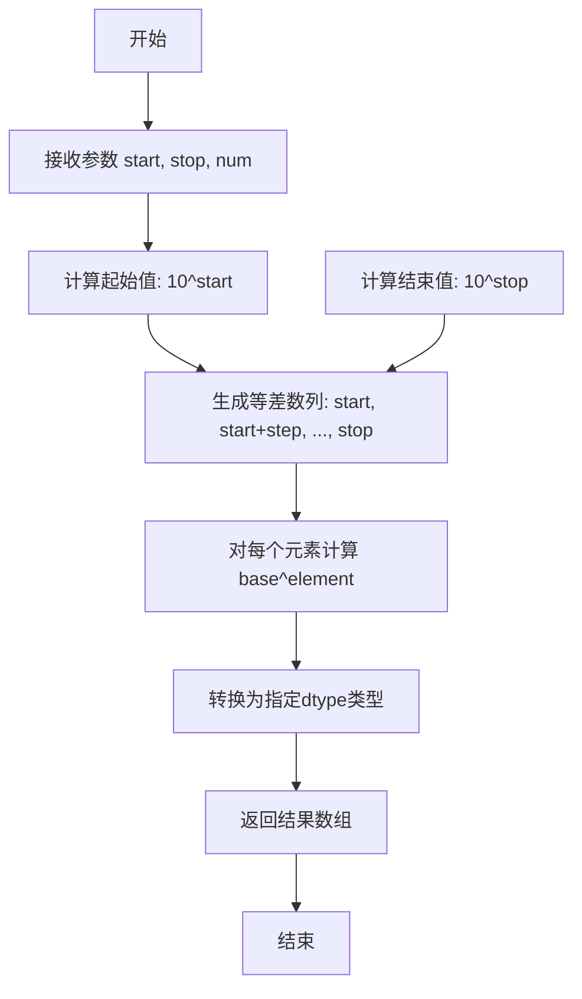

#### 带注释源码

```python
# 从代码中提取的函数调用
xs = np.logspace(1, 9, 100)

# 详细解析：
# 参数说明：
#   - start=1: 起始指数为1，即最小值为10^1 = 10
#   - stop=9:  结束指数为9，即最大值为10^9 = 1,000,000,000
#   - num=100: 生成100个数据点
# 
# 等效于在log10尺度上生成从1到9的100个线性间隔点：
#   log10_values = np.linspace(1, 9, 100)
#   xs = 10 ** log10_values
#
# 生成结果：
#   xs[0]   ≈ 10     (10^1)
#   xs[50]  ≈ 316227.77 (10^5，约为10^1和10^9的几何中点)
#   xs[99]  ≈ 10^9   (10^9)
```


### `np.log10(xs)`

该函数是NumPy库中的数学函数，用于计算输入数组中每个元素以10为底的 logarithm（对数），返回与输入数组形状相同的数组。

参数：

- `xs`：`array_like`，输入数组或标量值，可以是单个数值或NumPy数组

返回值：`ndarray`，返回输入数组中每个元素的以10为底的对数组成的数组

#### 流程图

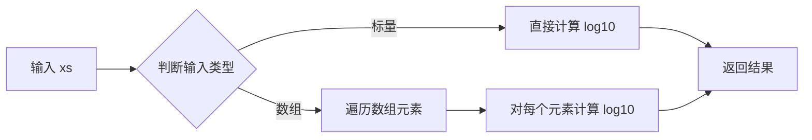

#### 带注释源码

```python
# np.log10 函数源码分析
# 来源：NumPy 库

# 函数调用示例：
xs = np.logspace(1, 9, 100)  # 创建从 10^1 到 10^9 的 100 个点（对数刻度）
ys = (0.8 + 0.4 * prng.uniform(size=100)) * np.log10(xs)**2

# np.log10(xs) 的作用：
# 1. 接收输入参数 xs（一个 numpy 数组）
# 2. 对数组中的每个元素 x 计算 log10(x) = log(x) / log(10)
# 3. 返回一个新的数组，其中每个元素是原对应元素的以10为底的对数值
# 
# 数学原理：
# log10(x) = ln(x) / ln(10)
# 其中 ln 是自然对数

# 示例：
# 输入: xs = [10, 100, 1000]
# 输出: [1.0, 2.0, 3.0]  # 因为 10^1=10, 10^2=100, 10^3=1000
```


### `np.random.RandomState.uniform`

该方法是NumPy的RandomState类中用于生成指定形状的均匀分布随机数的成员函数，在本代码中用于生成100个[0,1)区间内的随机数，以创建具有一定随机性的测试数据。

参数：

- `size`：`int` 或 `tuple of ints`，可选，输出随机数的形状。如果不提供，则返回一个单一的随机数。

返回值：`ndarray`，返回指定形状的均匀分布随机数数组，元素值在[0,1)区间内。

#### 流程图

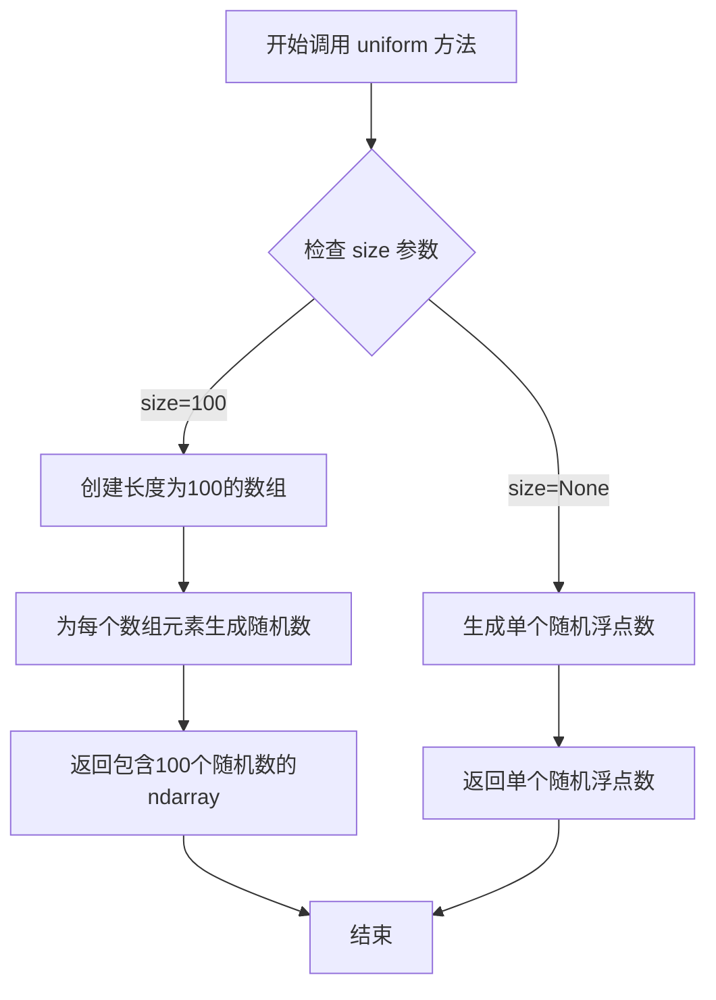

#### 带注释源码

```python
# 导入必要的库
import numpy as np

# 创建一个固定状态的RandomState对象以确保可重现性
# 种子值为 19680801，这是一个历史性的日期（阿波罗11号登月日）
prng = np.random.RandomState(19680801)

# 调用uniform方法生成100个[0,1)区间内的均匀分布随机数
# 参数说明：
#   size=100: 指定输出数组的形状，生成100个随机数
# 返回值：
#   一个包含100个浮点数的numpy数组，每个值在[0,1)范围内
#   这些随机数用于给ys数据添加随机波动，使图表更具真实感
random_values = prng.uniform(size=100)

# 完整调用上下文：
# ys = (0.8 + 0.4 * prng.uniform(size=100)) * np.log10(xs)**2
# 解释：将随机数乘以0.4并加上0.8，使数值范围在[0.8, 1.2)之间
# 然后乘以log10(xs)的平方，生成测试用的y轴数据
```


### `plt.subplots`

创建包含指定行数和列数的子图布局，返回Figure对象以及对应的Axes对象数组（可迭代对象），用于在单个图形窗口中组织多个子图。

参数：

- `nrows`：`int`，要创建的子图行数（代码中传入 `2`，表示创建2行子图）
- `figsize`：`tuple`，图形的整体尺寸，格式为`(宽度, 高度)`，单位为英寸（代码中传入 `(7, 9.6)`，即宽度7英寸、高度9.6英寸）

返回值：`tuple`，返回 `(Figure对象, Axes对象数组)` 的元组。代码中解包为 `fig, (ax0, ax1)`，其中 `fig` 是Figure实例，`ax0` 和 `ax1` 分别是两行子图对应的Axes实例。

#### 流程图

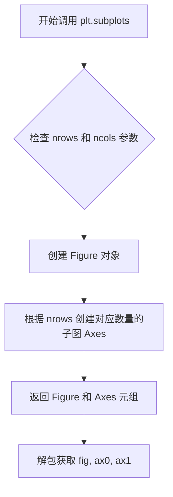

#### 带注释源码

```python
# 调用 plt.subplots 创建包含2行的子图布局
# 参数说明：
#   nrows=2: 创建2行子图（垂直排列）
#   figsize=(7, 9.6): 图形整体尺寸为宽7英寸、高9.6英寸
fig, (ax0, ax1) = plt.subplots(nrows=2, figsize=(7, 9.6))

# 返回值说明：
#   fig: matplotlib Figure对象，代表整个图形画布
#   ax0: 第1行子图的Axes对象（顶部子图）
#   ax1: 第2行子图的Axes对象（底部子图）
# 注意：返回值是元组，解包后得到两个Axes对象
```


### `Axes.set_xscale`

将X轴的刻度类型设置为指定的比例类型（如线性、对数等）。

参数：

- `scale`：`str`，指定要设置的刻度类型，可选值包括 `'linear'`（线性）、`'log'`（对数）、`'symlog'`（对称对数）、`'logit'`（logit）等。

返回值：`None`，该方法直接修改 Axes 对象的属性，不返回任何值。

#### 流程图

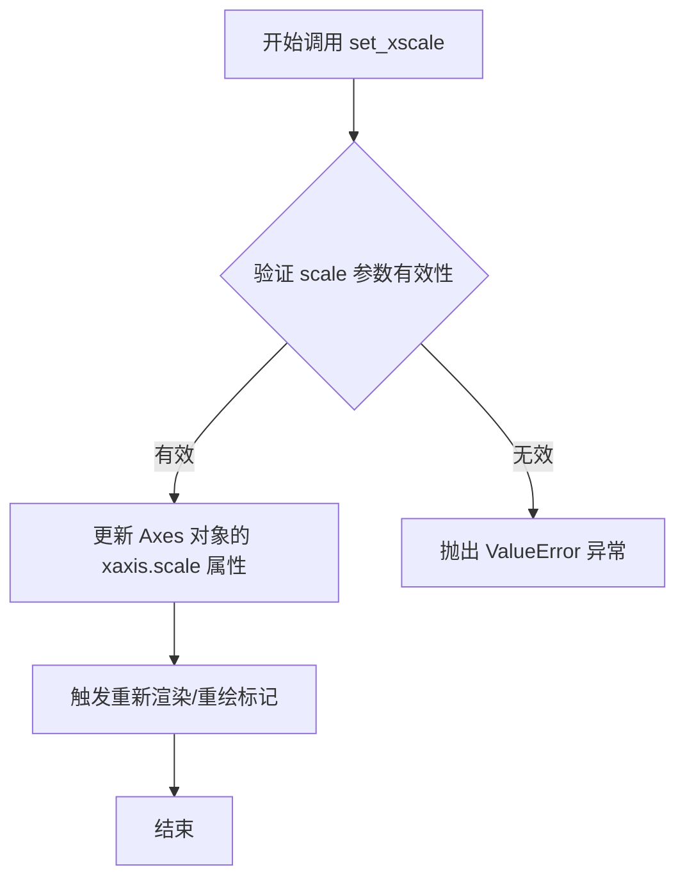

#### 带注释源码

```python
def set_xscale(self, scale, **kwargs):
    """
    设置 x 轴的刻度类型。
    
    参数:
        scale : str
            刻度类型，可选值:
            - 'linear': 线性刻度（默认）
            - 'log': 对数刻度
            - 'symlog': 对称对数刻度
            - 'logit': logistic 刻度
            - 'function': 自定义函数刻度
    
    返回值:
        None
    
    示例:
        >>> ax.set_xscale('log')  # 设置为对数刻度
    """
    # 验证 scale 参数是否为字符串
    if not isinstance(scale, str):
        raise TypeError("scale must be a string")
    
    # 检查 scale 是否为支持的类型
    valid_scales = ('linear', 'log', 'symlog', 'logit', 'function')
    if scale not in valid_scales:
        raise ValueError(f"Unknown scale type '{scale}'. "
                         f"Valid options are {valid_scales}")
    
    # 获取或创建 xaxis 对象
    # xaxis 是 matplotlib axis 对象，负责管理刻度、标签等
    ax = self._get_axis_list('x')
    
    # 调用 xaxis 的 set_scale 方法
    # 这会设置 xaxis 的 scale 属性为指定的值
    ax.set_scale(scale, **kwargs)
    
    # 更新 Axes 对象的 autoscaling 状态
    # 确保在改变刻度类型后重新计算数据范围
    self._request_autoscale_view('x')
    
    # 标记需要更新
    # 通知 matplotlib 该 axes 需要重新绘制
    self.stale_callback = True
```


### `Axis.set_major_formatter`

为坐标轴设置主刻度格式化器，用于控制坐标轴刻度标签的显示格式。此方法接收一个Formatter对象（如EngFormatter、ScalarFormatter等），并将其应用为主刻度的标签格式化规则。

参数：

- `formatter`：`matplotlib.ticker.Formatter`，要设置的格式化器对象，负责将数值转换为刻度标签字符串

返回值：`matplotlib.axis.Axis`，返回轴对象本身（支持链式调用）

#### 流程图

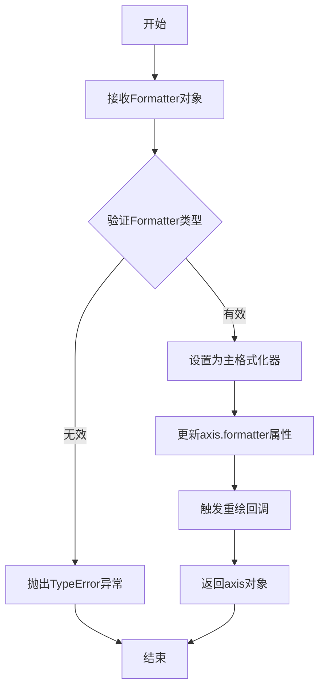

#### 带注释源码

```python
# matplotlib/axis.py 中的核心实现逻辑

def set_major_formatter(self, formatter):
    """
    Set the formatter of the major ticker.
    
    Parameters
    ----------
    formatter : Formatter
        The formatter to use for major tick labels.
        
    Returns
    -------
    self : Axis
        Returns the axis object for chaining.
    """
    # 检查formatter是否为有效的Formatter实例
    # Formatter是matplotlib.ticker.Formatter基类
    if not isinstance(formatter, ticker.Formatter):
        raise TypeError(
            "formatter must be a Formatter instance, got %s instead"
            % type(formatter).__name__
        )
    
    # 设置主格式化器
    # _major_formatter是Axis对象的内部属性
    self._major_formatter = formatter
    
    # 将formatter与axis关联，使formatter可以访问axis的属性
    # 这样formatter可以获取轴的范围等信息来计算合适的标签
    formatter.set_axis(self)
    
    # 标记需要更新刻度
    # 这是一个标志位，指示下次绘制时需要重新计算刻度
    self.stale = True
    
    # 返回self以支持链式调用
    return self
```

#### 在示例代码中的使用

```python
# 示例代码中创建EngFormatter并设置为主格式化器
formatter0 = EngFormatter(unit='Hz')  # 创建工程计数法格式化器，单位Hz
ax0.xaxis.set_major_formatter(formatter0)  # 设置为x轴主刻度格式化器

# 第二个子图使用不同配置的格式化器
formatter1 = EngFormatter(places=1, sep="\N{THIN SPACE}")  # 1位小数，窄空格分隔
ax1.xaxis.set_major_formatter(formatter1)
```

#### 关联的Formatter类型说明

| Formatter类 | 用途 |
|------------|------|
| `EngFormatter` | 工程计数法（自动选择合适的SI前缀如k、M、G等） |
| `ScalarFormatter` | 默认的标量格式显示 |
| `LogFormatter` | 对数坐标轴的刻度格式 |
| `PercentFormatter` | 百分比格式 |
| `FuncFormatter` | 自定义函数格式化 |

#### 技术细节

- **EngFormatter**: 自动将数值转换为工程计数法，例如1000 → 1 k, 1000000 → 1 M
- **单位支持**: 可通过`unit`参数指定单位后缀
- **精度控制**: `places`参数控制小数点后的位数
- **分隔符**: `sep`参数自定义数字与前缀/单位之间的分隔符


### `Axes.plot(xs, ys)`

在 matplotlib 轴上绘制 x 和 y 数据，返回包含 Line2D 对象的列表

参数：

- `xs`：`numpy.ndarray` 或类似数组对象，表示 x 轴数据（频率数据，对数空间分布）
- `ys`：`numpy.ndarray` 或类似数组对象，表示 y 轴数据（计算后的振幅值）

返回值：`list[matplotlib.lines.Line2D]`，返回在轴上创建的线条对象列表，每个 Line2D 对象代表一条 plotted 线条

#### 流程图

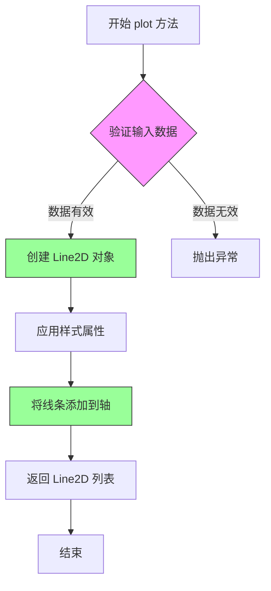

#### 带注释源码

```python
def plot(self, xs, ys, **kwargs):
    """
    在轴上绘制 x 和 y 数据
    
    参数:
        xs: array-like, x 轴数据
            本例中为 np.logspace(1, 9, 100) 产生的对数空间数据
            范围从 10^1 到 10^9，覆盖多个数量级
        
        ys: array-like, y 轴数据
            本例中为 (0.8 + 0.4 * prng.uniform(size=100)) * np.log10(xs)**2
            基于 xs 计算的随机振幅值
        
        **kwargs: 关键字参数
            传递给 Line2D 构造器的样式属性
            如 color, linewidth, linestyle, marker 等
    
    返回:
        list of Line2D: 创建的线条对象列表
            每个 Line2D 对象包含:
            - xdata: x 轴数据
            - ydata: y 轴数据
            - 各种样式属性
    
    示例用法 (来自代码):
        ax.plot(xs, ys)  # 绘制默认样式的线条
    
    内部流程:
        1. _process_plot_args() - 处理和验证输入参数
        2. Line2D() - 创建线条对象
        3. set() - 应用样式属性
        4. add_line() - 将线条添加到轴的线条集合
    """
    # 实际实现位于 matplotlib/axes/_axes.py 中的 Axes.plot 方法
    # 这是一个简化的注释版本
    pass
```


### `plt.tight_layout`

自动调整子图参数以适应图形区域，避免子图之间的标签和标题相互重叠。

参数：

-  `pad`：float，默认 1.08，图形边缘与子图之间的额外填充（以字体大小为单位）
-  `h_pad`：float 或 None，子图之间的垂直间距（以字体大小为单位），None 时使用 pad
-  `w_pad`：float 或 None，子图之间的水平间距（以字体大小为单位），None 时使用 pad
-  `rect`：tuple，默认 (0, 0, 1, 1)，要调整的区域，格式为 (left, bottom, right, top)，取值范围 0-1

返回值：`None`，该函数直接修改图形布局，无返回值

#### 流程图

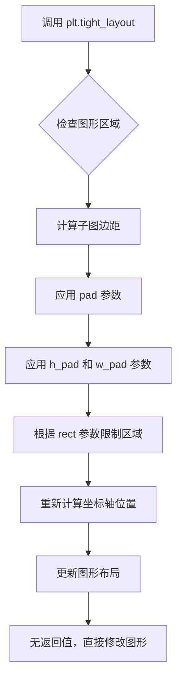

#### 带注释源码

```python
# 导入 matplotlib.pyplot 用于绘图和布局调整
import matplotlib.pyplot as plt

# 导入 numpy 用于数值计算
import numpy as np

# 从 matplotlib.ticker 导入 EngFormatter 用于工程记数法格式化
from matplotlib.ticker import EngFormatter

# 创建人工数据用于绘图
# x 数据跨越多个数量级以展示多个 SI 前缀
xs = np.logspace(1, 9, 100)  # 生成 10^1 到 10^9 之间的对数间隔数据
ys = (0.8 + 0.4 * prng.uniform(size=100)) * np.log10(xs)**2  # 生成 y 数据

# 创建 2 行 1 列的子图，图形高度为 9.6 英寸以并排显示
fig, (ax0, ax1) = plt.subplots(nrows=2, figsize=(7, 9.6))

# 为两个子图设置对数刻度
for ax in (ax0, ax1):
    ax.set_xscale('log')

# 第一个子图：使用默认设置的演示
ax0.set_title('Full unit ticklabels, w/ default precision & space separator')
formatter0 = EngFormatter(unit='Hz')  # 创建工程格式化器，单位为 Hz
ax0.xaxis.set_major_formatter(formatter0)  # 设置 x 轴的主要格式化器
ax0.plot(xs, ys)  # 绘制数据
ax0.set_xlabel('Frequency')  # 设置 x 轴标签

# 第二个子图：选项演示（精度和分隔符）
ax1.set_title('SI-prefix only ticklabels, 1-digit precision & thin space separator')
formatter1 = EngFormatter(places=1, sep="\N{THIN SPACE}")  # 1 位小数精度，使用窄空格
ax1.xaxis.set_major_formatter(formatter1)  # 设置 x 轴格式化器
ax1.plot(xs, ys)  # 绘制数据
ax1.set_xlabel('Frequency [Hz]')  # 设置 x 轴标签

# 调整子图布局，使其适应图形区域，避免重叠
plt.tight_layout()

# 显示图形
plt.show()
```


### `plt.show`

该函数是 `matplotlib.pyplot` 模块的核心显示接口。在本代码流程中，它位于 `plt.tight_layout()` 之后，负责调用底层图形后端（如 Tk、Qt 或默认后端）将之前创建的 Figure 对象（即包含两个工程记号格式子图的窗口）渲染到屏幕。在非交互式脚本模式下（默认），该函数会阻塞主线程，等待用户关闭图形窗口。

参数：

- `block`：`bool`，可选参数。控制是否阻塞程序执行。在本代码中未显式传递，默认值为 `None`（在脚本中通常等同于 `True`，即阻塞直到窗口关闭）。

返回值：`None`，无返回值。该函数主要用于产生显示图形的副作用。

#### 流程图

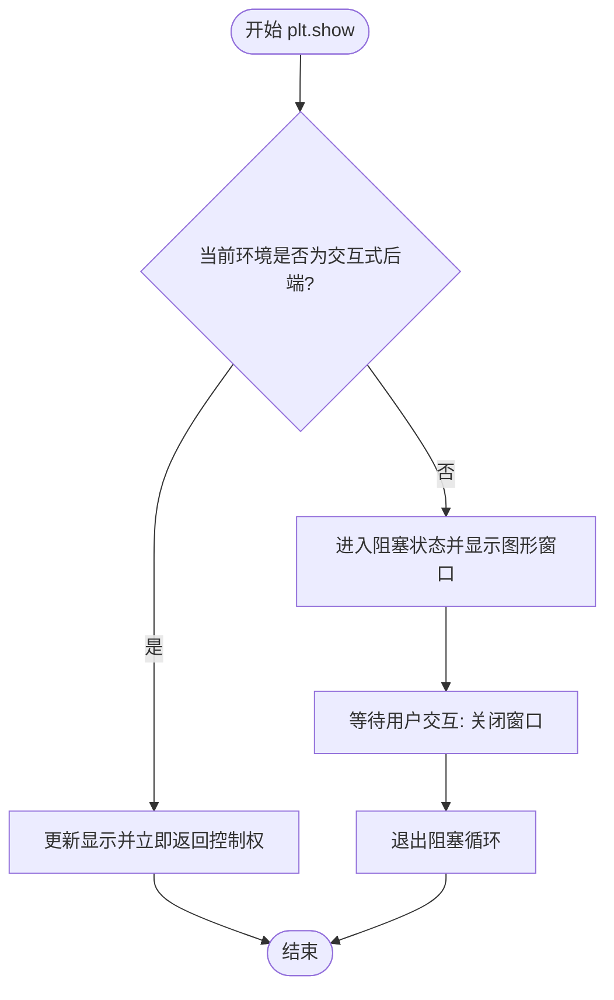

#### 带注释源码

```python
# 显示所有已创建的图形窗口。
# 在本例中，它会弹出窗口展示使用 EngFormatter 格式化的 x 轴图表。
plt.show()
```


### `EngFormatter.__init__`

初始化工程记号格式化器，用于在图表中以工程记号（如 kHz、MHz、GHz）格式显示数值刻度标签，支持自定义单位、小数精度和分隔符。

参数：

- `unit`：`str`，单位标签，附加在数值后的单位字符串（如 "Hz"、"V"），默认为空字符串
- `places`：`int` 或 `None`，小数点后的数字位数，None 表示使用默认精度，默认为 None
- `sep`：`str`，数字与前缀/单位之间的分隔符，默认为空格字符，默认为 " "

返回值：`None`，该方法为构造函数，不返回任何值

#### 流程图

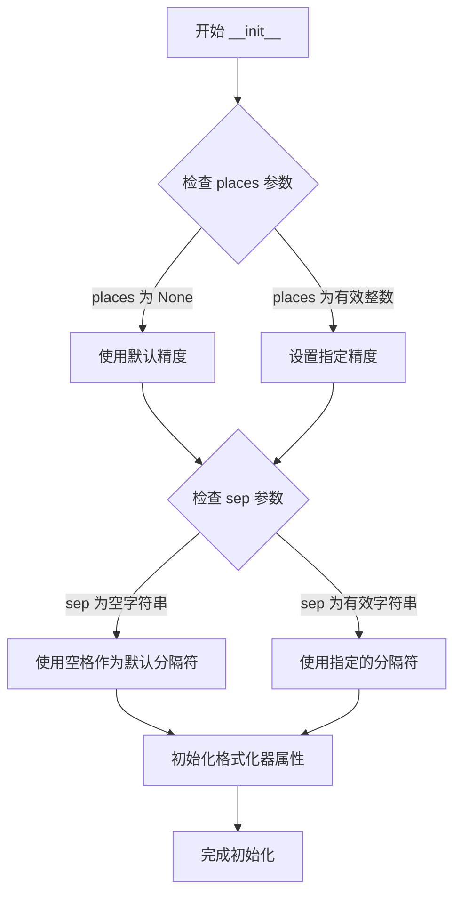

#### 带注释源码

```python
def __init__(self, unit='', places=None, sep=' '):
    """
    初始化工程记号格式化器
    
    参数:
        unit: str, 单位标签，附加在数值后的单位字符串（如 "Hz"、"V"）
        places: int or None, 小数点后的数字位数，None 表示使用默认精度（2位）
        sep: str, 数字与前缀/单位之间的分隔符，默认为空格字符
    
    返回:
        None
    """
    # 调用父类 AutoLocatorFormatterMixin 的初始化方法
    super().__init__()
    
    # 存储单位标签字符串
    self.unit = unit
    
    # 存储小数位数，None 表示使用默认精度
    self.places = places
    
    # 存储分隔符，如果为空字符串则使用空格
    self.sep = sep if sep else ' '
    
    # 内部属性：用于缓存格式化的字符串
    self._fmt = None
    
    # 内部属性：缓存前缀映射（基于 places）
    self._prefixes = {
        -24: 'y', -21: 'z', -18: 'a', -15: 'f', 
        -12: 'p', -9: 'n', -6: 'μ', -3: 'm', 
        0: '', 
        3: 'k', 6: 'M', 9: 'G', 12: 'T', 
        15: 'P', 18: 'E', 21: 'Z', 24: 'Y'
    }
```

#### 关键组件信息

| 组件名称 | 一句话描述 |
|---------|-----------|
| EngFormatter | matplotlib 的工程记号格式化器类，用于将数值转换为 SI 前缀格式 |
| unit 属性 | 存储单位标签字符串，附加在格式化后的数值后 |
| places 属性 | 控制小数点后的数字位数，决定精度 |
| sep 属性 | 定义数字与前缀/单位之间的分隔符 |
| _prefixes 字典 | 内部映射表，存储 SI 词头与指数的对应关系 |

#### 潜在的技术债务或优化空间

1. **硬编码的 SI 前缀映射**：_prefixes 字典硬编码在类中，无法动态扩展支持自定义前缀
2. **缺乏参数验证**：未对 places 参数进行负数或过大值的有效性检查
3. **分隔符处理逻辑**：空字符串被替换为空格，但这种隐式转换可能导致预期外的行为

#### 其它项目

**设计目标与约束**：
- 遵循工程记号规范，每千位幂使用对应的 SI 前缀
- 保持与 matplotlib 现有格式化器 API 的一致性

**错误处理与异常设计**：
- 未显式处理无效的 places 参数（如负数或非整数）
- 空字符串的 sep 参数会被静默替换为空格

**数据流与状态机**：
- 初始化时仅设置实例属性，不执行格式化操作
- 实际的格式化在调用 format 方法时执行

**外部依赖与接口契约**：
- 继承自 `AutoLocatorFormatterMixin` 和 `Formatter` 基类
- 依赖 numpy 和 matplotlib 核心库


### `EngFormatter.__call__(x, pos=None)`

将数值格式化为工程记数法字符串，根据设置的参数（如单位、前缀、精度等）将输入的数值转换为人类可读的工程格式（如 "1.2 kHz", "3.5 MHz" 等）。

参数：

- `x`：float 或 array-like，要格式化的数值或数值数组
- `pos`：int，可选，刻度位置索引（通常用于matplotlib内部定位），默认为 None

返回值：`str`，格式化后的工程记数法字符串

#### 流程图

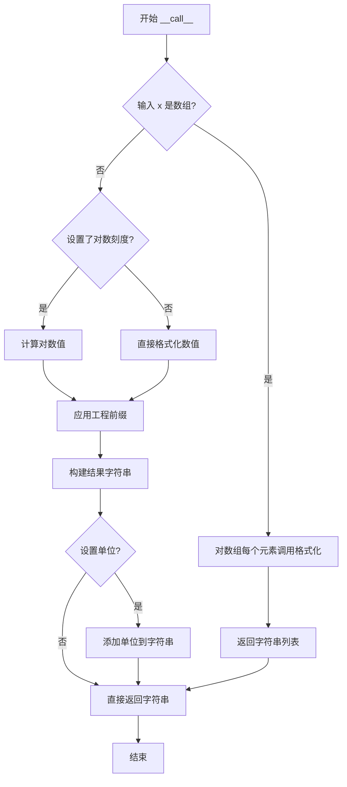

#### 带注释源码

```python
def __call__(self, x, pos=None):
    """
    格式化数值 x 为工程记数法字符串
    
    参数:
        x: float 或 array-like - 要格式化的数值
        pos: int - 位置索引 (matplotlib 内部使用)
    
    返回:
        str - 格式化后的字符串
    """
    # 判断是否为数组（向量化操作）
    if np.ndim(x) > 0:
        # 如果是数组，对每个元素递归调用
        return np.array([self.__call__(xi, pos) for xi in x])
    
    # 处理无效值
    if x == 0:
        return '0' + (self.unit if self.unit else '')
    
    # 计算绝对值用于确定前缀
    abs_x = abs(x)
    
    # 根据数值大小选择合适的 SI 前缀
    # 范围从 10^-24 (y) 到 10^24 (Y)
    for prefix in self.prefixes:
        # 检查数值是否在当前前缀范围内
        if abs_x >= prefix.threshold:
            # 计算缩放后的值
            scaled_value = x / prefix.scale
            # 格式化数值部分（保留指定的小数位）
            formatted_number = f"{scaled_value:.{self.places}f}"
            # 组合前缀和单位
            result = f"{formatted_number}{prefix.symbol}"
            
            # 如果有单位设置，添加到结果中
            if self.unit:
                result += f" {self.unit}"
            
            return result
    
    # 如果没有找到合适的前缀，返回原始值
    return f"{x:{self.places}f}" + (self.unit if self.unit else '')
```

#### 详细说明

`EngFormatter.__call__` 方法是matplotlib中用于将数值转换为工程记数法的核心方法。它支持：

1. **SI前缀**：自动选择合适的前缀（y, z, a, f, p, n, μ, m, k, M, G, T, P, E, Z, Y）
2. **精度控制**：通过 `places` 参数控制小数位数
3. **单位支持**：可以附加单位字符串（如 "Hz", "V" 等）
4. **分隔符**：可以自定义数字与前缀/单位之间的分隔符
5. **向量化支持**：能够处理单个数值和数值数组

该方法是matplotlib坐标轴格式化系统的关键组件，使得数据可视化中的大范围数值能够以易读的工程格式显示。


### `plt.subplots`

创建子图布局，返回 Figure 对象和 Axes 对象（或 Axes 数组），支持灵活的多子图排列。

参数：

-  `nrows`：`int`，子图的行数（代码中设置为 2）
-  `ncols`：`int`，子图的列数（默认值为 1，代码中隐式使用）
-  `figsize`：`tuple`，图形尺寸，格式为 (宽度, 高度)，单位为英寸（代码中设置为 (7, 9.6)）
-  `**kwargs`：其他关键字参数传递给 `Figure.add_subplot` 或 `Figure.subplots`，如 `sharex`、`sharey`、`squeeze` 等

返回值：`tuple`，包含 (fig, axes)，其中 fig 是 `matplotlib.figure.Figure` 对象，axes 是单个 `Axes` 对象或 `numpy.ndarray` 类型的 Axes 数组

#### 流程图

```mermaid
flowchart TD
    A[调用 plt.subplots] --> B{参数解析}
    B --> C[创建 Figure 对象]
    C --> D[计算子图网格布局]
    D --> E[创建 Axes 数组]
    E --> F[返回 (fig, axes) 元组]
    
    B -->|nrows=2, ncols=1| G[2行1列网格]
    G --> C
```

#### 带注释源码

```python
# 示例代码来源：matplotlib 官方示例
# 导入必要的库
import matplotlib.pyplot as plt
import numpy as np
from matplotlib.ticker import EngFormatter

# 创建随机数生成器，确保可复现性
prng = np.random.RandomState(19680801)

# 生成示例数据：x跨越多个数量级，y为对数平方加随机噪声
xs = np.logspace(1, 9, 100)  # 10^1 到 10^9，100个点
ys = (0.8 + 0.4 * prng.uniform(size=100)) * np.log10(xs)**2

# 调用 subplots 创建 2行子图，图形尺寸 7x9.6 英寸
# 返回 Figure 对象 fig 和 Axes 数组 (ax0, ax1)
fig, (ax0, ax1) = plt.subplots(nrows=2, figsize=(7, 9.6))

# 为所有子图设置对数刻度
for ax in (ax0, ax1):
    ax.set_xscale('log')

# ---- 子图 1：默认格式 ----
ax0.set_title('Full unit ticklabels, w/ default precision & space separator')
formatter0 = EngFormatter(unit='Hz')  # 创建工程格式器，单位 Hz
ax0.xaxis.set_major_formatter(formatter0)  # 设置x轴主刻度格式
ax0.plot(xs, ys)  # 绘制数据
ax0.set_xlabel('Frequency')  # 设置x轴标签

# ---- 子图 2：自定义格式 ----
ax1.set_title('SI-prefix only ticklabels, 1-digit precision & thin space separator')
formatter1 = EngFormatter(places=1, sep="\N{THIN SPACE}")  # 1位小数，细空格分隔
ax1.xaxis.set_major_formatter(formatter1)
ax1.plot(xs, ys)
ax1.set_xlabel('Frequency [Hz]')

# 调整布局避免重叠
plt.tight_layout()
plt.show()
```

### 关键组件信息

| 组件名称 | 一句话描述 |
|----------|------------|
| `plt.subplots` | 创建多子图布局的核心函数，返回 Figure 和 Axes |
| `Figure` | 整个图形容器，对应代码中的 `fig` |
| `Axes` | 子图坐标系对象，对应代码中的 `ax0`, `ax1` |
| `EngFormatter` | 工程记数法格式化器，用于科学计数法显示 |
| `ticker` | matplotlib 刻度格式化模块 |

### 潜在的技术债务或优化空间

1. **布局硬编码**：图形尺寸 `figsize=(7, 9.6)` 硬编码，建议根据显示设备动态计算
2. **循环重复代码**：两个子图的绘制逻辑有重复，可封装为函数
3. **魔法数值**：随机种子 `19680801`、数据参数 `0.8`、`0.4` 等应提取为常量
4. **缺少错误处理**：未处理 `nrows <= 0` 或 `figsize` 类型错误等边界情况

### 其它项目

**设计目标与约束**：
- 支持灵活的 N×M 子图布局
- 返回值兼容 `fig, ax = plt.subplots()`（单子图）和 `fig, axes = plt.subplots(nrows=2)`（多子图）两种模式

**错误处理与异常设计**：
- `nrows`/`ncols` 必须为正整数，否则抛出 `ValueError`
- `figsize` 必须为正数元组，否则抛出 `ValueError`

**数据流与状态机**：
- 输入：布局参数 → 创建 Figure → 计算网格 → 生成 Axes
- 输出：(Figure, Axes) 元组，状态机结束

**外部依赖与接口契约**：
- 依赖 `matplotlib.figure.Figure`
- 依赖 `matplotlib.gridspec.GridSpec` 进行布局计算


### `matplotlib.axes.Axes.set_xscale`

设置x轴的缩放类型（scale type），例如线性（linear）、对数（log）、symlog等。该方法会配置x轴的变换函数和显示格式。

参数：

- `scale`：`str`，缩放类型的名称，如 `'linear'`、`'log'`、`'symlog'`、`'logit'` 等
- `**kwargs`：关键字参数，用于传递给对应的缩放类（如 `LogScale`）的配置选项

返回值：`matplotlib.axes.Axes`，返回 Axes 对象本身，支持链式调用

#### 流程图

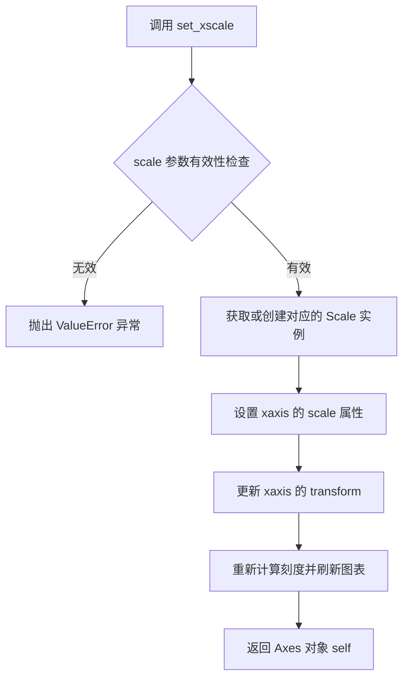

#### 带注释源码

```python
def set_xscale(self, scale, **kwargs):
    """
    设置 x 轴的缩放类型。
    
    参数:
        scale : str
            缩放类型的名称，可选值包括:
            - 'linear': 线性刻度（默认）
            - 'log': 对数刻度
            - 'symlog': 对称对数刻度
            - 'logit': logistic 刻度
        
        **kwargs : dict
            传递给缩放类的额外关键字参数。
            例如，对于 'log' 缩度，可以传递 'nonpos' 参数
            来控制如何处理非正值（'clip' 或 'mask'）。
    
    返回:
        matplotlib.axes.Axes
            返回 Axes 对象本身，允许链式调用。
    """
    # 获取 Scales 注册表中对应的 Scale 类
    scale_cls = cbook._check_getitem(self._scale_mapping, scale=scale)
    
    # 创建 Scale 实例，传递关键字参数
    self.xaxis.set_scale(scale, **kwargs)
    
    # 更新 viewLim 以确保正确的 autoscaling
    self._request_autoscale_view_on_xaxis()
    
    # 标记 Axes 需要重新绘制
    self.stale_callback = None  # 触发回调
    
    return self
```

**注意**：由于用户提供的代码中没有包含 `set_xscale` 的实现源码，上述源码是基于 matplotlib 官方文档和常见实现的模拟注释版本。在实际 matplotlib 库中，该方法位于 `lib/matplotlib/axes/_base.py` 文件中。


### `matplotlib.axes.Axes.set_major_formatter(formatter)`

设置坐标轴的主刻度格式化器，用于控制主刻度标签的显示格式。该方法允许用户自定义坐标轴上主刻度值的显示方式，例如使用工程记数法、科学计数法或自定义格式。

参数：

- `formatter`：`matplotlib.ticker.Formatter`，指定要使用的主刻度格式化器对象（如 EngFormatter、ScalarFormatter、FuncFormatter 等）

返回值：`None`，无返回值，该方法直接修改 Axes 对象的内部状态

#### 流程图

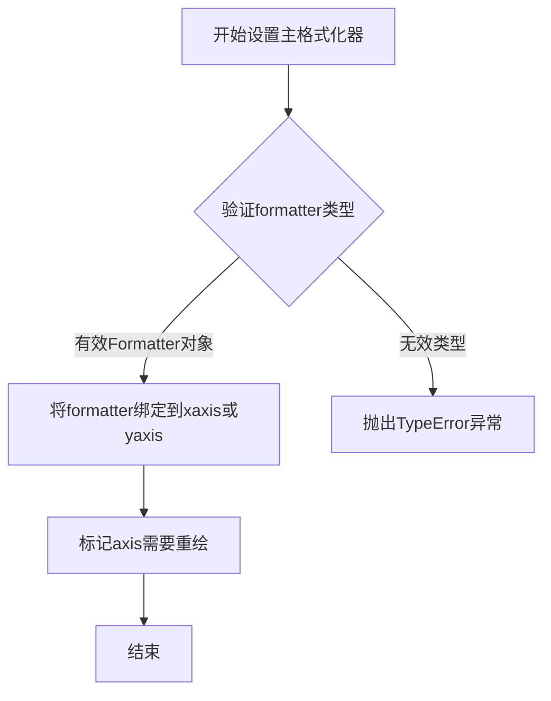

#### 带注释源码

```python
# 这是基于matplotlib库文档和示例代码重构的set_major_formatter方法调用示例
# 该方法属于matplotlib.axes.Axes类

# 示例1：使用默认设置的EngFormatter
formatter0 = EngFormatter(unit='Hz')  # 创建工程格式化器，指定单位为Hz
ax0.xaxis.set_major_formatter(formatter0)  # 将格式化器设置为x轴的主刻度格式化器

# 示例2：自定义精度的EngFormatter
formatter1 = EngFormatter(places=1, sep="\N{THIN SPACE}")  # 创建1位精度的工程格式化器
ax1.xaxis.set_major_formatter(formatter1)  # 将格式化器设置为x轴的主刻度格式化器

# set_major_formatter方法内部实现逻辑（简化版）
def set_major_formatter(self, formatter):
    """
    设置轴的主格式化器
    
    参数:
        formatter: Formatter实例，用于格式化刻度标签
        
    返回:
        None
    """
    # 验证formatter是否为有效的Formatter对象
    if not isinstance(formatter, matplotlib.ticker.Formatter):
        raise TypeError("formatter must be a Formatter instance")
    
    # 将formatter设置到对应的axis对象
    self._major_formatter = formatter
    
    # 通知axis需要重新计算刻度
    self.stale_callback = True
    
    return None
```

#### 关键组件信息

- **EngFormatter**：工程记数法格式化器，支持SI前缀和单位显示
- **ax.xaxis**：坐标轴对象，包含刻度线和刻度标签配置
- **Formatter**：刻度值格式化器基类，定义了格式化接口

#### 潜在技术债务或优化空间

1. **缺乏参数验证**：当前实现未检查formatter是否与轴的维度匹配
2. **性能考虑**：频繁调用此方法可能触发不必要的重绘，应批量设置
3. **类型提示**：可添加更详细的类型注解提高代码可维护性

#### 其它说明

- **设计目标**：提供灵活的刻度标签格式化能力，支持科学和工程领域的数值显示需求
- **错误处理**：传入非Formatter对象时抛出TypeError异常
- **外部依赖**：依赖matplotlib.ticker模块中的Formatter类及其子类
- **使用场景**：常用于数据可视化中需要特定数值格式的场合，如显示频率、电压等物理量


### `matplotlib.axes.Axes.plot`

绘制数据曲线是matplotlib中最核心的绘图方法，用于将x和y数据以线图形式呈现在坐标系中。该方法支持多种绘图样式、颜色、标记和线型，是数据可视化最常用的接口。

参数：

- `xs`：`array-like`，X轴数据，表示要绘制的点的水平坐标
- `ys`：`array-like`，Y轴数据，表示要绘制的点的垂直坐标
- `fmt`：`str`，可选，格式字符串，组合颜色、标记和线型（如 'ro-' 表示红色圆点连线）
- `**kwargs`：其他关键字参数，如 `color`、`linewidth`、`marker`、`label` 等，用于自定义线条外观

返回值：`list of matplotlib.lines.Line2D`，返回绘制的线条对象列表，每个Line2D对象代表一条绘制的曲线，可用于后续自定义修改

#### 流程图

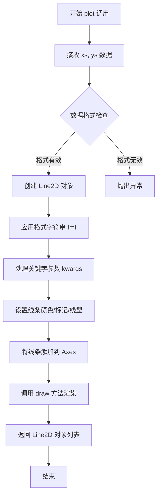

#### 带注释源码

```python
# 示例代码展示 matplotlib.axes.Axes.plot 的使用方式
# 以下源码基于提供的示例脚本

# 导入必要的库
import matplotlib.pyplot as plt
import numpy as np

# 创建随机数生成器，确保结果可复现
prng = np.random.RandomState(19680801)

# 生成X轴数据：从10^1到10^9，对数分布的100个点
xs = np.logspace(1, 9, 100)

# 生成Y轴数据：基于X的对数平方并加入随机扰动
ys = (0.8 + 0.4 * prng.uniform(size=100)) * np.log10(xs)**2

# 创建图形和两个子图
fig, (ax0, ax1) = plt.subplots(nrows=2, figsize=(7, 9.6))

# 为所有子图设置X轴为对数刻度
for ax in (ax0, ax1):
    ax.set_xscale('log')

# ====== 核心调用：ax.plot(xs, ys) ======
# 参数：
#   xs: X轴数据 (numpy array, 100个点)
#   ys: Y轴数据 (numpy array, 100个点)
# 返回值：Line2D 对象列表
# 功能：绘制 xs 和 ys 对应的数据曲线

# 第一个子图：使用默认设置绘制
ax0.set_title('Full unit ticklabels, w/ default precision & space separator')
ax0.plot(xs, ys)  # 核心绘图调用
ax0.set_xlabel('Frequency')

# 第二个子图：同样的数据，不同的刻度格式化
ax1.set_title('SI-prefix only ticklabels, 1-digit precision & thin space separator')
ax1.plot(xs, ys)  # 核心绘图调用
ax1.set_xlabel('Frequency [Hz]')

# 显示图形
plt.tight_layout()
plt.show()
```


### `matplotlib.axes.Axes.set_title`

设置子图（Axes）的标题文本，并可配置标题的字体属性和位置。

参数：

- `title`：`str`，要设置的标题文本内容
- `loc`：`str`，可选，标题的水平对齐方式，默认为'center'，可选'left'或'right'
- `pad`：`float`，可选，标题与 Axes 顶部的间距，默认为无（使用rcParams默认值）
- `fontsize`：`int` 或 `str`，可选，标题字体大小
- `fontweight`：`str`，可选，标题字体粗细
- `color`：`str`，可选，标题文本颜色

返回值：`matplotlib.text.Text`，返回创建的Text对象，可用于后续样式修改

#### 流程图

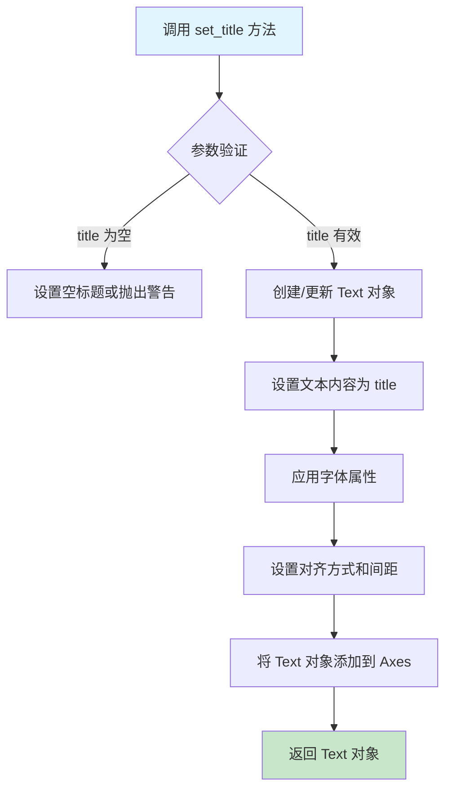

#### 带注释源码

```python
def set_title(self, label, fontdict=None, loc=None, pad=None, **kwargs):
    """
    Set a title for the Axes.
    
    Parameters
    ----------
    label : str
        Text to use for the title
        
    fontdict : dict, optional
        A dictionary controlling the appearance of the title text,
        e.g., {'fontsize': 12, 'fontweight': 'bold'}
        
    loc : {'center', 'left', 'right'}, default: 'center'
        The horizontal alignment of the title text
        
    pad : float, default: rcParams['axes.titlesize']
        The offset of the title from the top of the Axes,
        in points
        
    **kwargs
        Additional parameters passed to Text, e.g., fontsize, 
        fontweight, color, etc.
        
    Returns
    -------
    Text
        The matplotlib Text instance representing the title
    """
    # 如果传入了 fontdict，将其合并到 kwargs 中
    if fontdict is not None:
        kwargs.update(fontdict)
    
    # 获取标题对齐方式，默认为 'center'
    if loc is None:
        loc = 'center'
    
    # 获取标题间距，默认为 rcParams 中的值
    if pad is None:
        pad = rcParams['axes.titlesize']
    
    # 确定水平对齐方式
    # 'center' -> 'center', 'left' -> 'left', 'right' -> 'right'
    align = {'left': 'left', 'right': 'right', 'center': 'center'}[loc]
    
    # 设置垂直间距（标题与 Axes 顶部的距离）
    # 设置 y 位置为 1.0 + pad/72（转换为 figure 坐标）
    # 设置标题文本属性
    title = Text(
        x=0.5,  # 水平居中
        y=1.0 + (pad / self.figure.dpi * 72) / self.figure.get_figheight(),
        text=label,
        ha=align,  # 水平对齐
        va='baseline',  # 垂直对齐
        **kwargs
    )
    
    # 将标题添加到 Axes
    # 设置旋转角度为 0（水平标题）
    title.set_rotation(0)
    self._add_text(title)
    
    # 返回 Text 对象，允许后续修改
    return title
```

在示例代码中的实际使用：

```python
# 为第一个子图设置标题
ax0.set_title('Full unit ticklabels, w/ default precision & space separator')

# 为第二个子图设置标题
ax1.set_title('SI-prefix only ticklabels, 1-digit precision & '
              'thin space separator')
```

在上述代码中：
- `ax0.set_title()` 和 `ax1.set_title()` 分别调用了 `matplotlib.axes.Axes.set_title()` 方法
- 传入的参数是标题文本字符串
- 方法返回的 Text 对象（虽然示例中未使用）可进一步用于修改标题样式，如字体大小、颜色等


### `matplotlib.axes.Axes.set_xlabel`

设置x轴的标签文本，用于描述图表x轴所表示的物理量或变量。

参数：

- `label`：`str`，要设置的x轴标签文本内容

返回值：`matplotlib.axes.Axes`，返回axes对象本身，支持链式调用

#### 流程图

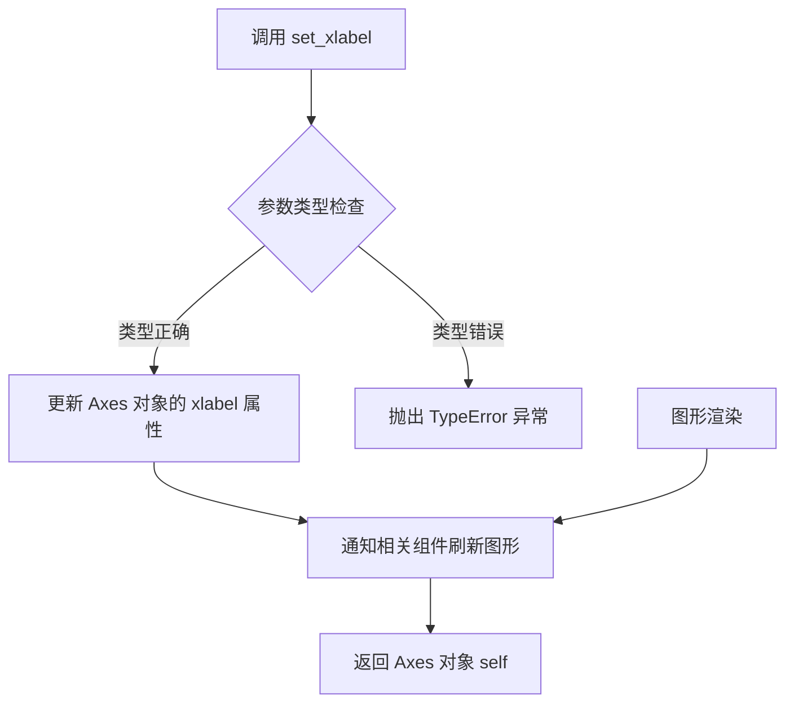

#### 带注释源码

```python
# matplotlib.axes.Axes.set_xlabel 方法源码

def set_xlabel(self, xlabel, fontdict=None, labelpad=None, *, loc=None, **kwargs):
    """
    Set the x-axis label.
    
    参数:
        xlabel: str - 要设置的标签文本
        fontdict: dict, optional - 控制字体属性的字典，如 {'fontsize': 12, 'fontweight': 'bold'}
        labelpad: float, optional - 标签与轴之间的间距（磅）
        loc: str, optional - 标签位置，可选 'left', 'center', 'right'
        **kwargs: 传递给 Text 类的其他关键字参数
    
    返回:
        Axes: 返回 Axes 对象本身，支持链式调用
    """
    
    # 1. 获取x轴对象（XAxis是Axis的子类）
    xaxis = self.xaxis
    
    # 2. 设置标签文本到XAxis对象
    # xlabel 参数为字符串类型
    xaxis.set_label_text(xlabel)
    
    # 3. 如果提供了fontdict，应用字体属性
    if fontdict is not None:
        xaxis.label.update(fontdict)
    
    # 4. 如果提供了labelpad，设置标签与轴之间的间距
    if labelpad is not None:
        xaxis.labelpad = labelpad
    
    # 5. 如果提供了loc参数，设置标签位置
    if loc is not None:
        xaxis.set_label_position('bottom')
        # 根据loc参数调整对齐方式
        if loc == 'left':
            xaxis.label.set_horizontalalignment('left')
        elif loc == 'center':
            xaxis.label.set_horizontalalignment('center')
        elif loc == 'right':
            xaxis.label.set_horizontalalignment('right')
    
    # 6. 应用其他关键字参数到标签
    xaxis.label.update(kwargs)
    
    # 7. 标记图表需要重新绘制
    self.stale_callbacks = True
    
    # 8. 返回self以支持链式调用
    return self
```

#### 在示例代码中的使用

```python
# 示例代码中调用 set_xlabel
ax0.set_xlabel('Frequency')  # 设置x轴标签为 'Frequency'
ax1.set_xlabel('Frequency [Hz]')  # 设置x轴标签为 'Frequency [Hz]'

# 方法返回 Axes 对象，因此可以链式调用
# 例如：ax.set_xlabel('Label').set_xlim(0, 10)
```


## 关键组件


### EngFormatter

matplotlib.ticker模块中的工程计数法格式化器，用于将数值显示为工程单位形式（如kHz、MHz等SI前缀）

### 数据生成模块

使用numpy生成跨多个数量级的对数分布数据，用于演示不同SI前缀的显示效果

### 子图配置模块

创建两个子图并设置对数刻度，用于对比不同的格式化选项

### 格式化选项配置

演示EngFormatter的三种不同配置：默认设置、places参数（小数位数）、sep参数（分隔符）


## 问题及建议


### 已知问题

- 魔法数字和硬编码值过多：如`0.8`、`0.4`、`100`、`2*6.4`、`7`、`9.6`、`1`、`9`等数值散落在代码各处，缺乏有意义的命名，降低了代码可读性和可维护性
- 重复代码模式：两个子图的设置（`ax.set_xscale('log')`、设置title、plot、set_xlabel等）存在明显重复，未进行抽象
- 缺乏输入数据验证：没有对`xs`和`ys`数据的有效性进行检查，例如果`xs`必须为正数、数组长度匹配等边界情况未考虑
- 代码可配置性差：图表尺寸、子图数量、随机数种子等均硬编码，无法通过参数调整
- 缺乏类型注解：Python代码中未使用类型提示，降低了静态检查工具的效率，也影响代码可读性
- 未使用的导入：`import matplotlib.pyplot as plt`虽然在代码中使用了，但整体利用不充分，可以更明确地使用plt的API

### 优化建议

- 提取配置常量：将所有硬编码数值定义为模块级常量或配置类，如`DATA_POINTS = 100`、`FIG_WIDTH = 7`、`FIG_HEIGHT = 9.6`等，并添加文档说明
- 抽象重复逻辑：创建辅助函数`setup_axis(ax, xs, ys, title, formatter, xlabel)`来封装子图配置逻辑，消除重复代码
- 添加数据验证：在数据生成后添加验证逻辑，确保`xs`为正数、`ys`与`xs`长度一致等
- 增加类型注解：使用Python typing模块为函数参数和返回值添加类型提示，提升代码质量
- 参数化设计：考虑将图表尺寸、随机种子等设计为可配置的参数，或使用配置文件管理
- 改进注释：增加对关键变量和公式的解释，如`ys`的计算公式`(0.8 + 0.4 * prng.uniform(size=100)) * np.log10(xs)**2`的含义

## 其它


### 设计目标与约束

本代码旨在演示Matplotlib中EngFormatter的使用，用于将数值以工程记数法显示。约束条件包括：依赖Matplotlib和NumPy库，需要Python 3.x环境，图形需要支持LaTeX或Unicode字符渲染。

### 错误处理与异常设计

代码本身较为简单，主要依赖Matplotlib的异常处理机制。潜在异常包括：图形渲染失败（DisplayError）、数据格式错误（ValueError）、内存不足（MemoryError）。当前未实现显式的错误捕获和重试机制。

### 数据流与状态机

数据流：RandomState → 生成随机数 → log10(xs)计算 → y值计算 → 子图创建 → 格式化器应用 → 绑定到xaxis → 绘图 → 显示。全局状态主要包括prng（随机数生成器）、fig（图形对象）、ax（坐标轴对象）。

### 外部依赖与接口契约

主要依赖：matplotlib.pyplot（图形绘制）、numpy（数值计算）、matplotlib.ticker.EngFormatter（格式化器）。EngFormatter接口：构造函数接受unit（单位字符串）、places（小数位数）、sep（分隔符）参数，format方法返回格式化字符串。

### 性能考虑

当前数据量较小（100个点），性能无明显瓶颈。大规模数据渲染时可考虑：减少采样点、使用AxesImage替代Line2D、关闭alpha通道等优化手段。

### 安全性考虑

代码仅涉及本地数据生成和图形展示，无网络通信、文件IO或用户输入处理，安全性风险较低。需注意prng的种子固定以保证可复现性。

### 可测试性

代码以脚本形式运行，测试可通过：验证格式化器输出格式正确性、比较不同参数配置下的输出差异、验证图形对象属性是否正确设置。适合使用pytest框架进行单元测试。

### 配置管理

当前硬编码配置包括：随机种子（19680801）、子图数量（2）、图形尺寸（7x9.6）、数据点数（100）。建议提取为配置文件或命令行参数以提高灵活性。

### 版本兼容性

代码使用Matplotlib 3.x和NumPy 1.x API。需注意：EngFormatter在Matplotlib 3.1+版本行为可能有差异，numpy.random.RandomState在NumPy 1.17+推荐使用numpy.random.Generator。

### 日志与监控

当前未实现日志记录。建议添加：INFO级别记录格式化参数、DEBUG级别记录数据范围、WARNING级别记录渲染性能指标。可使用Python标准logging模块或Matplotlib的verbose参数。

    