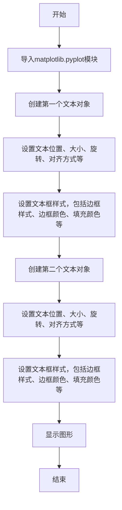
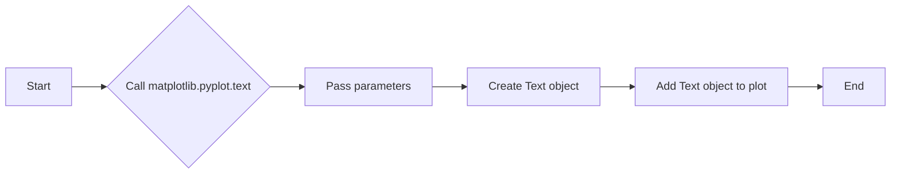
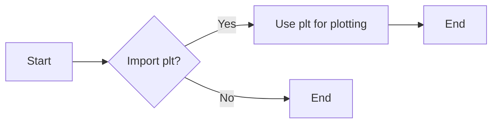

# `matplotlib\galleries\examples\text_labels_and_annotations\fancytextbox_demo.py` 详细设计文档

This code demonstrates how to style text boxes in matplotlib plots using bbox parameters, including box style, edge color, and fill color.

## 整体流程



## 类结构

```
matplotlib.pyplot
```

## 全局变量及字段


### `text`
    
Function to place text at a specified position on the axes.

类型：`function`
    


### `matplotlib.patches.Bbox.bbox`
    
A bounding box for the text.

类型：`matplotlib.patches.Bbox`
    
    

## 全局函数及方法


### matplotlib.pyplot.text

matplotlib.pyplot.text 是一个用于在 matplotlib 图形上添加文本的函数。

参数：

- `x`：`float`，文本的 x 坐标。
- `y`：`float`，文本的 y 坐标。
- `s`：`str`，要显示的文本字符串。
- `size`：`int` 或 `float`，文本的大小。
- `rotation`：`float` 或 `None`，文本的旋转角度。
- `ha`：`str`，水平对齐方式，可以是 'left', 'center', 'right'。
- `va`：`str`，垂直对齐方式，可以是 'top', 'center', 'bottom'。
- `bbox`：`dict`，文本框的边界框参数，可以包含 'boxstyle', 'ec', 'fc' 等键。

返回值：`Text` 对象，表示添加到图形上的文本。

#### 流程图



#### 带注释源码

```python
import matplotlib.pyplot as plt

plt.text(0.6, 0.7, "eggs", size=50, rotation=30.,
         ha="center", va="center",
         bbox=dict(boxstyle="round",
                   ec=(1., 0.5, 0.5),
                   fc=(1., 0.8, 0.8),
                   )
         )

plt.text(0.55, 0.6, "spam", size=50, rotation=-25.,
         ha="right", va="top",
         bbox=dict(boxstyle="square",
                   ec=(1., 0.5, 0.5),
                   fc=(1., 0.8, 0.8),
                   )
         )

plt.show()
```


### plt.show()

`plt.show()` 是一个用于显示matplotlib图形的函数。

参数：

- 无

返回值：`None`，该函数不返回任何值，其作用是显示当前图形。

#### 流程图

```mermaid
graph LR
A[Start] --> B{plt.show() called?}
B -- Yes --> C[Display the plot]
C --> D[End]
B -- No --> E[End]
```

#### 带注释源码

```
plt.show()  # This function is called to display the plot
```


### plt.text()

`plt.text()` 是一个用于在matplotlib图形上添加文本的函数。

参数：

- `x`：`float`，文本的x坐标。
- `y`：`float`，文本的y坐标。
- `s`：`str`，要显示的文本字符串。
- `size`：`int`，文本的大小。
- `rotation`：`float`，文本的旋转角度。
- `ha`：`str`，水平对齐方式，可以是 'left', 'center', 'right'。
- `va`：`str`，垂直对齐方式，可以是 'top', 'center', 'bottom'。
- `bbox`：`dict`，文本框的边界框参数，包括 `boxstyle`、`ec` 和 `fc`。

返回值：`Text` 对象，表示添加到图形上的文本。

#### 流程图

```mermaid
graph LR
A[Start] --> B{plt.text() called?}
B -- Yes --> C[Create Text object]
C --> D[Add Text object to plot]
D --> E[End]
B -- No --> F[End]
```

#### 带注释源码

```
plt.text(0.6, 0.7, "eggs", size=50, rotation=30.,
         ha="center", va="center",
         bbox=dict(boxstyle="round",
                   ec=(1., 0.5, 0.5),
                   fc=(1., 0.8, 0.8),
                   )
         )
# This line adds a text box with specific style at the coordinates (0.6, 0.7)
```


### plt

`plt` 是matplotlib.pyplot模块的别名，它提供了创建和显示图形的接口。

参数：

- 无

返回值：`None`，`plt` 是一个模块，不是函数，因此不返回值。

#### 流程图



#### 带注释源码

```
import matplotlib.pyplot as plt  # Import the matplotlib.pyplot module
# This line imports the matplotlib.pyplot module and assigns it the alias 'plt'
```


### 关键组件信息

- `plt.text()`：用于在图形上添加文本。
- `plt.show()`：用于显示图形。

#### 潜在的技术债务或优化空间

- 代码中没有使用异常处理来处理可能出现的错误，例如图形显示失败。
- 代码中没有使用日志记录来记录操作，这可能会在调试时造成困难。
- 代码中没有使用配置文件来设置图形的属性，这可能会使得代码难以维护。

#### 设计目标与约束

- 设计目标是创建一个简单的图形，用于展示如何使用matplotlib添加文本。
- 约束是使用matplotlib.pyplot模块。

#### 错误处理与异常设计

- 代码中没有使用异常处理，建议添加try-except块来捕获并处理可能出现的异常。

#### 数据流与状态机

- 数据流：代码从导入matplotlib.pyplot模块开始，然后使用其函数创建和显示图形。
- 状态机：代码没有明确的状态机，因为它只是执行一系列的操作来创建和显示图形。

#### 外部依赖与接口契约

- 外部依赖：matplotlib.pyplot模块。
- 接口契约：matplotlib.pyplot模块提供了创建和显示图形的接口。


## 关键组件


### 张量索引

张量索引用于在多维数组（张量）中定位和访问特定元素。

### 惰性加载

惰性加载是一种延迟计算或初始化数据的技术，直到实际需要时才进行，以优化性能和资源使用。

### 反量化支持

反量化支持允许在量化过程中对某些操作进行非量化处理，以保持精度和性能。

### 量化策略

量化策略定义了如何将浮点数转换为固定点数表示，以减少模型大小和提高推理速度。


## 问题及建议


### 已知问题

-   {问题1}：代码仅展示了如何使用matplotlib库中的`text`函数来添加带边框的文本框，但没有提供任何错误处理机制。如果输入的参数类型不正确或超出预期范围，可能会导致程序崩溃。
-   {问题2}：代码没有进行任何输入验证，例如检查`size`、`rotation`、`ha`、`va`等参数是否在有效范围内。这可能导致不预期的视觉效果或程序错误。
-   {问题3}：代码没有提供任何文档说明，使得其他开发者难以理解代码的目的和如何使用它。

### 优化建议

-   {建议1}：添加异常处理机制，确保在输入参数不正确时能够优雅地处理错误，并提供有用的错误信息。
-   {建议2}：对输入参数进行验证，确保它们在有效范围内，并在参数无效时抛出异常或返回错误信息。
-   {建议3}：编写详细的文档，包括代码的目的、如何使用它以及每个参数的含义和预期值。
-   {建议4}：考虑将代码封装成一个类或函数，以便更方便地重用和扩展。
-   {建议5}：如果代码是库的一部分，应该考虑添加单元测试来确保代码的稳定性和可靠性。


## 其它


### 设计目标与约束

- 设计目标：实现使用matplotlib库对文本框进行样式化，包括边框、填充颜色和形状。
- 约束条件：代码应仅使用matplotlib库，不引入其他外部依赖。

### 错误处理与异常设计

- 错误处理：代码中未包含异常处理机制，应考虑添加异常处理来捕获并处理matplotlib可能抛出的异常。
- 异常设计：定义异常处理函数，用于捕获并处理matplotlib异常，如`matplotlib.text.Text`异常。

### 数据流与状态机

- 数据流：代码中数据流简单，从文本字符串到matplotlib的`text`函数，再到绘图显示。
- 状态机：代码中无状态机设计，状态变化仅通过参数传递实现。

### 外部依赖与接口契约

- 外部依赖：代码依赖于matplotlib库，需确保该库已正确安装。
- 接口契约：matplotlib的`text`函数接口契约应遵循matplotlib文档中的描述，确保正确使用参数。

### 测试与验证

- 测试策略：编写单元测试，验证文本框样式化功能是否按预期工作。
- 验证方法：使用不同的文本和样式参数，验证文本框的显示效果是否符合预期。

### 维护与扩展

- 维护策略：定期检查matplotlib库更新，确保代码兼容性。
- 扩展方法：考虑添加更多样式化选项，如阴影、边框宽度等。


    