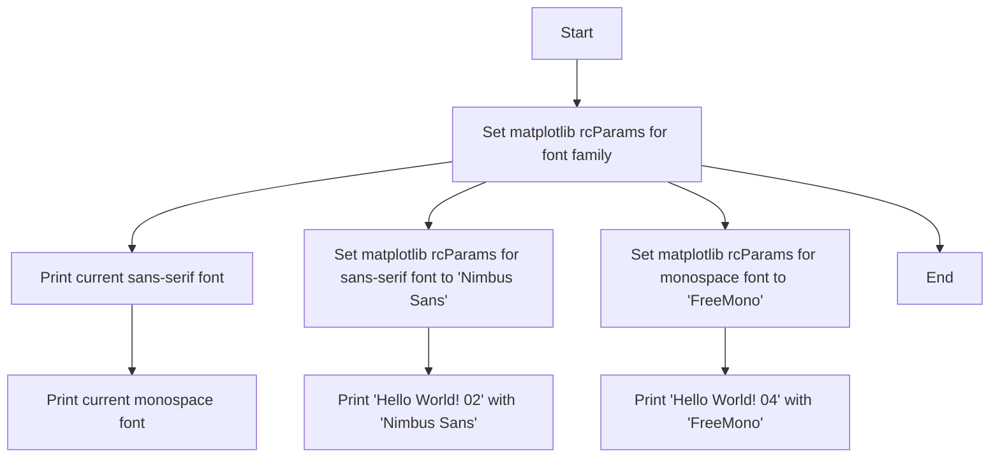
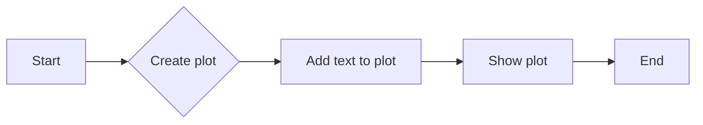
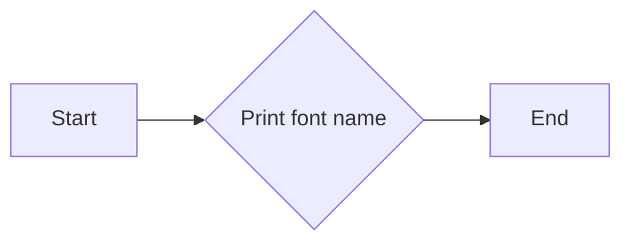
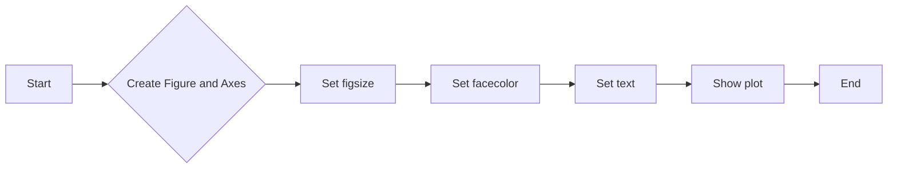
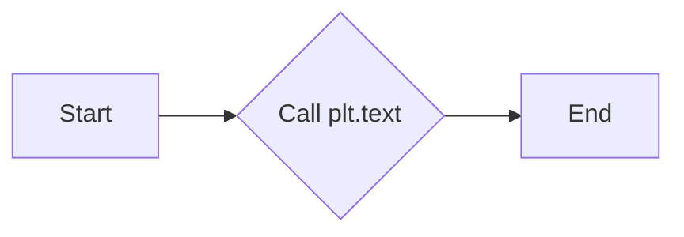
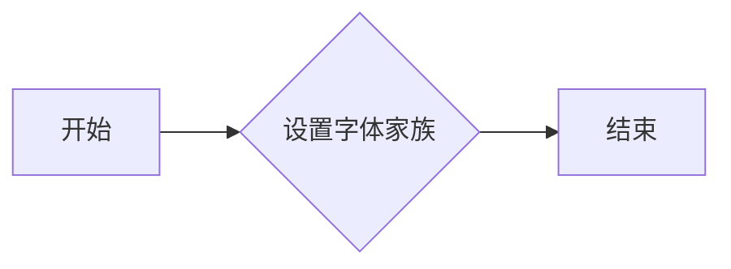
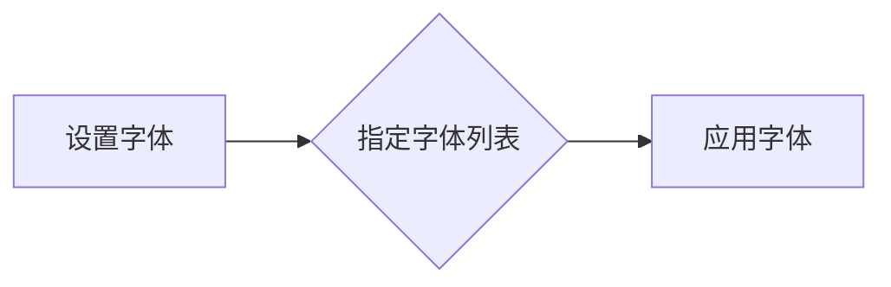

# `matplotlib\galleries\examples\text_labels_and_annotations\font_family_rc.py` 详细设计文档

This code configures and demonstrates the usage of different font families in matplotlib plots.

## 整体流程



## 类结构

```
matplotlib.pyplot (module)
```

## 全局变量及字段


### `plt`
    
The matplotlib.pyplot module provides a MATLAB-like interface to the matplotlib library.

类型：`module`
    


### `rcParams`
    
A dictionary containing rcParams, which are used to configure matplotlib parameters.

类型：`dict`
    


### `fig`
    
The figure object representing the figure to which the plot is added.

类型：`matplotlib.figure.Figure`
    


### `ax`
    
The axes object representing the axes to which the plot is added.

类型：`matplotlib.axes._subplots.AxesSubplot`
    


### `text`
    
The text object representing the text to be added to the axes.

类型：`matplotlib.text.Text`
    


### `plt`
    
The matplotlib.pyplot module provides a MATLAB-like interface to the matplotlib library.

类型：`module`
    


### `matplotlib.pyplot.rcParams`
    
A dictionary containing rcParams, which are used to configure matplotlib parameters.

类型：`dict`
    


### `matplotlib.pyplot.subplots`
    
Create a figure and a set of subplots.

类型：`tuple`
    


### `matplotlib.pyplot.text`
    
Add text to an axes.

类型：`str`
    


### `matplotlib.pyplot.show`
    
Display the figure.

类型：`None`
    


### `matplotlib.pyplot.axis`
    
Set the axis limits and aspect ratio.

类型：`None`
    


### `matplotlib.pyplot.set_font_family`
    
Set the font family for the current figure.

类型：`None`
    


### `matplotlib.pyplot.set_font_monospace`
    
Set the monospace font for the current figure.

类型：`None`
    
    

## 全局函数及方法


### print_text

The `print_text` function is used to display a text message on a matplotlib plot with a specified font and size.

参数：

- `text`：`str`，The text message to be displayed on the plot.

返回值：`None`，The function does not return any value; it only displays the text on the plot.

#### 流程图



#### 带注释源码

```python
def print_text(text):
    # Create a figure and an axis with specified size and facecolor
    fig, ax = plt.subplots(figsize=(6, 1), facecolor="#eefade")
    
    # Add text to the center of the plot with specified horizontal and vertical alignment and size
    ax.text(0.5, 0.5, text, ha='center', va='center', size=40)
    
    # Turn off axis display
    ax.axis("off")
    
    # Show the plot
    plt.show()
``` 


### print(plt.rcParams['font.sans-serif'][0])

该函数打印出当前matplotlib配置中定义的默认sans-serif字体名称。

参数：

- 无

返回值：`str`，返回当前配置的默认sans-serif字体名称。

#### 流程图



#### 带注释源码

```
# 导入matplotlib.pyplot模块
import matplotlib.pyplot as plt

# 打印当前配置的默认sans-serif字体名称
print(plt.rcParams["font.sans-serif"][0])
```


### print(plt.rcParams['font.monospace'][0])

该函数打印出当前matplotlib配置中monospace字体族中第一个字体名称。

参数：

- 无

返回值：`str`，返回当前配置中monospace字体族中第一个字体的名称。

#### 流程图


#### 带注释源码

```
# 导入matplotlib.pyplot模块
import matplotlib.pyplot as plt

# 打印当前matplotlib配置中monospace字体族中第一个字体名称
print(plt.rcParams["font.monospace"][0])
```


### `plt.subplots`

`matplotlib.pyplot.subplots` 是一个用于创建一个或多个子图的函数。

参数：

- `figsize`：`tuple`，指定子图的大小（宽度和高度），单位为英寸。
- `facecolor`：`color`，指定子图背景的颜色。
- `ax`：`Axes` 对象，如果提供，则使用该对象作为子图。

返回值：`Figure` 对象，包含子图和轴对象。

#### 流程图



#### 带注释源码

```python
import matplotlib.pyplot as plt

def print_text(text):
    fig, ax = plt.subplots(figsize=(6, 1), facecolor="#eefade")
    ax.text(0.5, 0.5, text, ha='center', va='center', size=40)
    ax.axis("off")
    plt.show()
```


### `plt.text`

`plt.text` 是一个用于在 matplotlib 图形上添加文本的函数。

参数：

- `x`：`float`，文本的 x 坐标。
- `y`：`float`，文本的 y 坐标。
- `text`：`str`，要显示的文本。
- `ha`：`str`，水平对齐方式，可以是 'left', 'center', 'right'。
- `va`：`str`，垂直对齐方式，可以是 'top', 'center', 'bottom'。
- `size`：`float`，文本的大小。

返回值：`Text` 对象，表示添加到图形上的文本。

#### 流程图



#### 带注释源码

```python
def print_text(text):
    fig, ax = plt.subplots(figsize=(6, 1), facecolor="#eefade")
    ax.text(0.5, 0.5, text, ha='center', va='center', size=40)
    ax.axis("off")
    plt.show()
```


### plt.show()

显示matplotlib图形的窗口。

参数：

- 无

返回值：无

#### 流程图

```mermaid
graph LR
A[开始] --> B{调用plt.show()}
B --> C[结束]
```

#### 带注释源码

```python
# 显示matplotlib图形的窗口
plt.show()
```


### plt.axis()

`plt.axis()` 是一个全局函数，用于配置当前轴的显示范围和可见性。

参数：

- 无

返回值：无

#### 流程图

```mermaid
graph LR
A[Start] --> B{Call plt.axis()}
B --> C[End]
```

#### 带注释源码

```
# Configure the axis of the current plot
plt.axis()
```

该函数没有参数，因此不需要传递任何值。它将配置当前轴的显示范围和可见性，但具体的行为取决于后续的绘图命令和配置参数。

在提供的代码中，`plt.axis()` 被调用，但没有提供任何参数，因此它将使用默认的轴配置。如果之前已经设置了轴的配置，那么调用 `plt.axis()` 将不会改变现有的配置。如果需要改变轴的配置，可以使用 `plt.axis([xmin, xmax, ymin, ymax])` 来设置轴的显示范围，或者使用 `plt.axis('off')` 来关闭轴的显示。

```python
# Configure the axis of the current plot
plt.axis()
```


### plt.rcParams["font.family"]

设置matplotlib的字体家族。

参数：

- `font.family`：`str`，指定要使用的字体家族名称。可以是系统字体名称或通用字体家族名称（如'sans-serif', 'monospace'等）。

返回值：无

#### 流程图



#### 带注释源码

```python
# 设置matplotlib的字体家族为'sans-serif'
plt.rcParams["font.family"] = "sans-serif"
```


### plt.rcParams["font.monospace"]

设置matplotlib中使用的等宽字体。

参数：

- `font.monospace`：`list`，指定等宽字体列表。默认情况下，该列表包含系统上安装的等宽字体。

返回值：无

#### 流程图



#### 带注释源码

```python
plt.rcParams["font.monospace"] = ["FreeMono"]
```

该行代码将matplotlib的当前配置中使用的等宽字体设置为列表中的第一个字体，即"FreeMono"。如果列表中的字体在系统上不可用，matplotlib将尝试列表中的下一个字体，直到找到一个可用的字体为止。如果列表中没有可用的字体，matplotlib将使用默认的等宽字体。

## 关键组件


### 张量索引与惰性加载

张量索引与惰性加载是深度学习框架中用于高效处理大型数据集的关键技术，它允许在需要时才计算数据，从而节省内存和提高计算效率。

### 反量化支持

反量化支持是深度学习模型优化中的一个重要特性，它允许模型在量化过程中保持较高的精度，从而在降低模型大小和计算量的同时，保持模型性能。

### 量化策略

量化策略是深度学习模型优化过程中的一个关键步骤，它决定了如何将浮点数权重转换为低精度整数，以减少模型大小和计算量，同时尽量保持模型性能。常见的量化策略包括全局量化、通道量化、权重共享量化等。


## 问题及建议


### 已知问题

-   {问题1}：代码中直接使用 `print` 函数输出 `rcParams` 的值，这可能导致输出格式不友好，特别是在控制台输出时。
-   {问题2}：代码中多次调用 `print_text` 函数，且每次调用都创建一个新的 `fig` 和 `ax` 对象，这可能导致资源浪费。
-   {问题3}：代码中未对 `plt.rcParams` 的修改进行任何异常处理，如果用户尝试设置不存在的 `rcParam`，可能会导致错误。

### 优化建议

-   {建议1}：使用 `matplotlib.pyplot` 的 `rcParams` 相关方法来格式化输出，例如使用 `matplotlib.pyplot.rcParams` 的 `get` 方法获取值。
-   {建议2}：将 `fig` 和 `ax` 对象作为全局变量或类属性，以便在多次调用 `print_text` 函数时复用。
-   {建议3}：在修改 `plt.rcParams` 之前，添加异常处理逻辑，确保代码的健壮性。
-   {建议4}：考虑将 `print_text` 函数的 `text` 参数改为 `fig, ax`，这样可以直接在现有的 `fig` 和 `ax` 对象上绘制文本，而不是每次都创建新的图形。
-   {建议5}：如果代码被用于生产环境，考虑添加日志记录功能，以便跟踪和调试。


## 其它


### 设计目标与约束

- 设计目标：提供一种灵活的方式来设置和更改matplotlib的字体家族。
- 约束：必须兼容matplotlib的rcParams配置系统，确保与matplotlib的其它配置保持一致。

### 错误处理与异常设计

- 错误处理：当指定的字体不可用时，应提供友好的错误消息。
- 异常设计：捕获并处理matplotlib配置相关的异常，如配置参数错误等。

### 数据流与状态机

- 数据流：用户通过调用`print_text`函数，传入文本内容，函数内部设置字体并显示文本。
- 状态机：matplotlib的rcParams配置作为状态机，通过设置不同的字体家族和字体样式来改变状态。

### 外部依赖与接口契约

- 外部依赖：依赖于matplotlib库。
- 接口契约：通过matplotlib的rcParams接口来设置字体家族和字体样式。

### 测试计划

- 测试计划：编写单元测试来验证不同字体家族和样式的设置是否正确。
- 测试用例：包括设置默认字体、设置特定字体、设置不存在的字体等。

### 维护与扩展性

- 维护：确保代码清晰、易于理解，便于后续维护。
- 扩展性：设计时考虑未来可能添加的新功能，如字体大小、颜色等配置。

### 性能考量

- 性能考量：确保字体设置操作对性能的影响最小，避免不必要的性能开销。

### 安全考量

- 安全考量：确保代码不会因为字体设置导致安全漏洞，如字体文件路径注入等。

### 用户文档

- 用户文档：提供详细的用户指南，说明如何使用该代码来设置字体家族和样式。

### 代码审查

- 代码审查：定期进行代码审查，确保代码质量。

### 依赖管理

- 依赖管理：确保所有依赖项都已正确列出，并使用版本控制。

### 部署与分发

- 部署与分发：提供部署指南，确保代码可以在不同的环境中运行。

### 法律与合规

- 法律与合规：确保代码遵守相关法律法规，如版权、专利等。


    