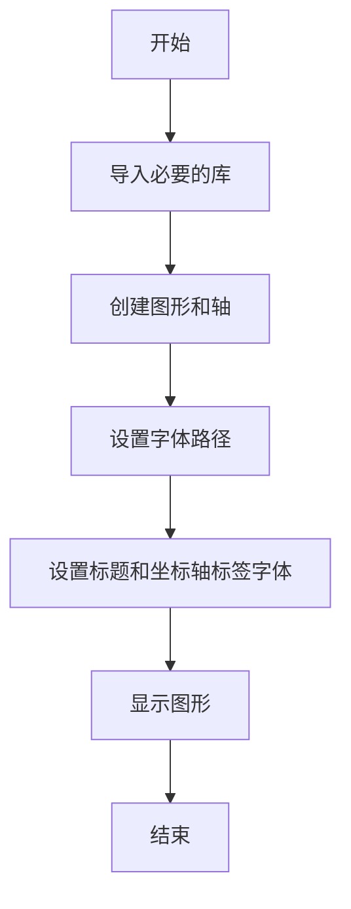
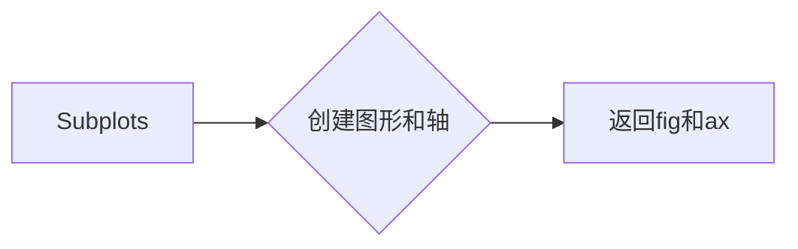
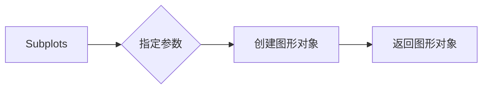

# `matplotlib\galleries\examples\text_labels_and_annotations\font_file.py` 详细设计文档

This code demonstrates how to use a specific TrueType font file in a Matplotlib plot by setting the font path for the plot title.

## 整体流程



## 类结构

```
matplotlib.pyplot (matplotlib 库)
├── fig, ax = plt.subplots()
│   ├── fig
│   └── ax
└── ax.set_title() 和 ax.set_xlabel()
```

## 全局变量及字段


### `fpath`
    
The path to the font file 'cmr10.ttf'.

类型：`pathlib.Path`
    


### `fig`
    
The figure object created by plt.subplots.

类型：`matplotlib.figure.Figure`
    


### `ax`
    
The axes object created by plt.subplots, used for plotting and setting labels and titles.

类型：`matplotlib.axes._subplots.AxesSubplot`
    


### `matplotlib.pyplot.fig`
    
The figure object created by plt.subplots.

类型：`matplotlib.figure.Figure`
    


### `matplotlib.pyplot.ax`
    
The axes object created by plt.subplots, used for plotting and setting labels and titles.

类型：`matplotlib.axes._subplots.AxesSubplot`
    
    

## 全局函数及方法


### `Path(mpl.get_data_path(), "fonts/ttf/cmr10.ttf")`

该函数创建一个 `pathlib.Path` 实例，指向 Matplotlib 数据目录下的 "fonts/ttf/cmr10.ttf" 字体文件。

参数：

- `mpl.get_data_path()`：`str`，Matplotlib 的数据路径
- `"fonts/ttf/cmr10.ttf"`：`str`，字体文件的相对路径

返回值：`pathlib.Path`，指向字体文件的路径对象

#### 流程图


#### 带注释源码

```
from pathlib import Path
import matplotlib.pyplot as plt
import matplotlib as mpl

# 创建 Path 实例
fpath = Path(mpl.get_data_path(), "fonts/ttf/cmr10.ttf")
```


### plt.subplots()

#### 描述

`plt.subplots()` 是 Matplotlib 库中的一个函数，用于创建一个图形和一个轴（Axes）对象。它返回一个包含图形和轴的元组。

参数：

- 无

返回值：`fig, ax`，其中 `fig` 是图形对象，`ax` 是轴对象。

#### 流程图



#### 带注释源码

```
fig, ax = plt.subplots()
```

### ax.set_title()

#### 描述

`ax.set_title()` 是 Matplotlib 库中轴对象（Axes）的一个方法，用于设置轴的标题。

参数：

- `title`：`str`，标题文本
- `font`：`pathlib.Path`，字体文件的路径

返回值：无

#### 流程图


#### 带注释源码

```
ax.set_title(f'This is a special font: {fpath.name}', font=fpath)
```

### plt.show()

#### 描述

`plt.show()` 是 Matplotlib 库中的一个函数，用于显示图形。

参数：

- 无

返回值：无

#### 流程图


#### 带注释源码

```
plt.show()
```


### fpath

#### 描述

`fpath` 是一个 `pathlib.Path` 对象，表示字体文件的路径。

参数：

- 无

返回值：无

#### 流程图


#### 带注释源码

```
fpath = Path(mpl.get_data_path(), "fonts/ttf/cmr10.ttf")
```


### matplotlib.get_data_path()

#### 描述

`mpl.get_data_path()` 是 Matplotlib 库中的一个全局函数，用于获取 Matplotlib 数据文件的路径。

参数：

- 无

返回值：`str`，数据文件的路径

#### 流程图


#### 带注释源码

```
mpl.get_data_path()
```


### matplotlib.pyplot

#### 描述

`matplotlib.pyplot` 是 Matplotlib 库中的一个模块，提供了用于创建图形和可视化数据的函数。

参数：

- 无

返回值：无

#### 流程图


#### 带注释源码

```
import matplotlib.pyplot as plt
```


### pathlib.Path

#### 描述

`pathlib.Path` 是 Python 标准库中的一个类，用于表示文件系统路径。

参数：

- `path`：`str` 或 `bytes`，路径字符串或字节串

返回值：`Path` 对象

#### 流程图


#### 带注释源码

```
from pathlib import Path
```


### mpl.get_data_path()

获取Matplotlib数据目录的路径。

参数：

- 无

返回值：`str`，Matplotlib数据目录的路径。

#### 流程图

```mermaid
graph LR
A[Start] --> B{mpl.get_data_path()}
B --> C[End]
```

#### 带注释源码

```python
import matplotlib as mpl

def get_data_path():
    return mpl.get_data_path()
```


### Path(mpl.get_data_path(), "fonts/ttf/cmr10.ttf")

创建一个`pathlib.Path`对象，指向Matplotlib数据目录下的字体文件。

参数：

- `mpl.get_data_path()`: `str`，Matplotlib数据目录的路径。
- `"fonts/ttf/cmr10.ttf"`: `str`，字体文件的相对路径。

返回值：`pathlib.Path`，指向字体文件的路径。

#### 流程图

```mermaid
graph LR
A[Start] --> B{Path(mpl.get_data_path(), "fonts/ttf/cmr10.ttf")}
B --> C[End]
```

#### 带注释源码

```python
from pathlib import Path

def get_font_path():
    return Path(mpl.get_data_path(), "fonts/ttf/cmr10.ttf")
```


### ax.set_title(f'This is a special font: {fpath.name}', font=fpath)

设置轴的标题，并使用指定的字体文件。

参数：

- `f'This is a special font: {fpath.name}'`: `str`，标题文本。
- `font=fpath`: `pathlib.Path`，字体文件的路径。

返回值：无

#### 流程图

```mermaid
graph LR
A[Start] --> B{ax.set_title(f'This is a special font: {fpath.name}', font=fpath)}
B --> C[End]
```

#### 带注释源码

```python
import matplotlib.pyplot as plt

def set_special_font(ax, fpath):
    ax.set_title(f'This is a special font: {fpath.name}', font=fpath)
```


### plt.show()

显示图形。

参数：无

返回值：无

#### 流程图

```mermaid
graph LR
A[Start] --> B{plt.show()}
B --> C[End]
```

#### 带注释源码

```python
import matplotlib.pyplot as plt

def show_plot():
    plt.show()
```


### 关键组件信息

- `mpl`: Matplotlib模块，用于创建和显示图形。
- `plt`: Matplotlib的pyplot模块，提供了一系列用于创建图形的函数。
- `mpl.get_data_path()`: 获取Matplotlib数据目录的路径。
- `pathlib.Path`: pathlib模块中的Path类，用于处理文件和目录路径。
- `ax.set_title()`: 设置轴的标题。
- `plt.show()`: 显示图形。


### 潜在的技术债务或优化空间

- 代码中使用了字符串格式化来设置标题，可以考虑使用`str.format()`方法或f-string来提高可读性。
- 可以考虑将字体路径作为参数传递给函数，以便更灵活地使用不同的字体文件。
- 代码中没有进行错误处理，例如检查字体文件是否存在。


### 设计目标与约束

- 设计目标是创建一个示例，展示如何使用Matplotlib设置特定的字体。
- 约束是必须使用Matplotlib库，并且字体文件必须位于Matplotlib数据目录下。


### 错误处理与异常设计

- 代码中没有进行错误处理，应该添加异常处理来确保字体文件存在且可访问。


### 数据流与状态机

- 数据流：从Matplotlib获取数据目录路径，创建字体路径，设置标题，最后显示图形。
- 状态机：没有使用状态机，代码是顺序执行的。


### 外部依赖与接口契约

- 外部依赖：Matplotlib库。
- 接口契约：Matplotlib的pyplot模块提供了创建和显示图形的接口。


### plt.subplots

`plt.subplots` 是 Matplotlib 库中用于创建一个或多个子图的函数。

参数：

- `figsize`：`tuple`，指定图形的大小（宽度和高度），默认为 (6, 4)。
- `dpi`：`int`，指定图形的分辨率，默认为 100。
- `facecolor`：`color`，图形的背景颜色，默认为 'white'。
- `edgecolor`：`color`，图形的边缘颜色，默认为 'none'。
- `frameon`：`bool`，是否显示图形的边框，默认为 True。
- `num`：`int`，子图的数量，默认为 1。
- `gridspec_kw`：`dict`，用于定义子图网格的参数。
- `constrained_layout`：`bool`，是否启用约束布局，默认为 False。

返回值：`Figure`，包含子图的图形对象。

#### 流程图



#### 带注释源码

```python
import matplotlib.pyplot as plt

fig, ax = plt.subplots()
```


### ax.set_title

`ax.set_title` 是一个方法，用于设置轴（Axes）对象的标题。

参数：

- `title`：`str`，标题文本。
- `font`：`pathlib.Path`，字体文件的路径。

返回值：无

#### 流程图


#### 带注释源码

```python
# 设置轴的标题
ax.set_title(f'This is a special font: {fpath.name}', font=fpath)
```


### ax.set_xlabel

`ax.set_xlabel` 是一个方法，用于设置轴标签。

参数：

- `xlabel`：`str`，轴标签的文本内容。

返回值：无，该方法不返回任何值。

#### 流程图


#### 带注释源码

```python
# 设置轴标签
ax.set_xlabel('This is the default font')
```


### plt.show()

`plt.show()` 是 Matplotlib 库中的一个全局函数，用于显示当前图形窗口。

参数：

- 无

返回值：无

#### 流程图

```mermaid
graph LR
A[Start] --> B[Call plt.show()]
B --> C[End]
```

#### 带注释源码

```
plt.show()  # 显示当前图形窗口
```


### ax.set_title()

`ax.set_title()` 是 Matplotlib 库中 `Axes` 类的一个方法，用于设置轴的标题。

参数：

- `title`：`str`，标题文本
- `font`：`pathlib.Path` 或 `str`，字体路径或字体名称

返回值：无

#### 流程图

```mermaid
graph LR
A[Start] --> B[Call ax.set_title()]
B --> C[Set title with provided text and font]
C --> D[End]
```

#### 带注释源码

```
ax.set_title(f'This is a special font: {fpath.name}', font=fpath)  # 设置轴的标题，使用特殊字体
```


### fpath

`fpath` 是一个变量，其类型为 `pathlib.Path`。

名称：`fpath`
类型：`pathlib.Path`
描述：存储字体文件的路径

#### 流程图


#### 带注释源码

```
fpath = Path(mpl.get_data_path(), "fonts/ttf/cmr10.ttf")  # 定义 fpath 并赋值为字体文件的路径
```


### plt.subplots

`plt.subplots` 是 Matplotlib 库中用于创建一个或多个子图（axes）的函数。

参数：

- `figsize`：`tuple`，指定图形的大小（宽度和高度），默认为 (6, 4)。
- `dpi`：`int`，指定图形的分辨率（每英寸点数），默认为 100。
- `facecolor`：`color`，图形的背景颜色，默认为白色。
- `edgecolor`：`color`，图形边缘的颜色，默认为 'none'。
- `frameon`：`bool`，是否显示图形的边框，默认为 True。
- `num`：`int`，子图的数量，默认为 1。
- `gridspec_kw`：`dict`，用于定义子图网格的参数。
- `constrained_layout`：`bool`，是否启用约束布局，默认为 False。

返回值：`Figure` 对象和 `Axes` 对象的元组。

#### 流程图


#### 带注释源码

```python
import matplotlib.pyplot as plt

fig, ax = plt.subplots()  # 创建图形和轴对象
ax.set_title('This is a special font: cmr10.ttf', font=fpath)  # 设置标题和字体
ax.set_xlabel('This is the default font')  # 设置 X 轴标签
plt.show()  # 显示图形
```


### matplotlib.pyplot.set_title

matplotlib.pyplot.set_title 是一个用于设置图表标题的函数。

参数：

- `title`：`str`，要设置的标题文本。
- `font`：`matplotlib.font_manager.FontProperties` 或 `pathlib.Path`，指定标题的字体。如果传递 `pathlib.Path` 实例，则使用该路径下的字体文件。
- `loc`：`str`，指定标题的位置，例如 'left', 'right', 'center' 等。
- `pad`：`float`，标题与轴的距离。
- `color`：`str` 或 `color`，标题的颜色。
- `weight`：`str`，标题的字体粗细。
- `size`：`float`，标题的大小。
- `verticalalignment`：`str`，垂直对齐方式。
- `horizontalalignment`：`str`，水平对齐方式。

返回值：`None`

#### 流程图

```mermaid
graph LR
A[Start] --> B{Set title}
B --> C[End]
```

#### 带注释源码

```python
import matplotlib.pyplot as plt

fig, ax = plt.subplots()

fpath = Path(mpl.get_data_path(), "fonts/ttf/cmr10.ttf")
ax.set_title(f'This is a special font: {fpath.name}', font=fpath)
ax.set_xlabel('This is the default font')

plt.show()
```


### matplotlib.pyplot.set_xlabel

matplotlib.pyplot.set_xlabel 是一个用于设置 x 轴标签的函数。

参数：

- `xlabel`：`str`，用于设置 x 轴标签的文本内容。

返回值：无，该函数不返回任何值。

#### 流程图

```mermaid
graph LR
A[Start] --> B{Set xlabel}
B --> C[End]
```

#### 带注释源码

```python
# 设置 x 轴标签
ax.set_xlabel('This is the default font')
```


### plt.show()

`plt.show()` 是 Matplotlib 库中的一个全局函数，用于显示当前图形的窗口。

参数：

- 无

返回值：无

#### 流程图

```mermaid
graph LR
A[Start] --> B[Call plt.show()]
B --> C[End]
```

#### 带注释源码

```
plt.show()  # 显示当前图形的窗口
```


### matplotlib.pyplot.show

`matplotlib.pyplot.show` 是 Matplotlib 库中的一个全局函数，用于显示当前图形的窗口。

参数：

- 无

返回值：无

#### 流程图

```mermaid
graph LR
A[Start] --> B[Call plt.show()]
B --> C[End]
```

#### 带注释源码

```
# 显示当前图形的窗口
plt.show()
```

## 关键组件


### 张量索引与惰性加载

张量索引与惰性加载允许在处理大型数据集时，只加载和处理需要的数据部分，从而提高效率。

### 反量化支持

反量化支持使得模型可以在不同的量化级别上进行训练和推理，以适应不同的硬件和性能需求。

### 量化策略

量化策略定义了如何将浮点数转换为固定点数，以减少模型大小和提高推理速度。


## 问题及建议


### 已知问题

-   **硬编码字体路径**：代码中硬编码了字体文件的路径，这限制了代码的可移植性。如果字体文件的位置发生变化，代码可能需要修改。
-   **不推荐使用特定字体文件**：文档中明确指出不推荐使用特定字体文件，但示例代码中却使用了特定的字体文件，这可能导致与文档不一致。
-   **全局变量使用**：代码中使用了全局变量 `mpl`，这可能导致命名空间污染，尤其是在大型项目中。

### 优化建议

-   **使用相对路径或配置文件**：将字体文件的路径改为相对路径或通过配置文件指定，以提高代码的可移植性和灵活性。
-   **提供字体选择机制**：实现一个机制，允许用户选择不同的字体，而不是硬编码一个特定的字体。
-   **避免全局变量**：将全局变量 `mpl` 替换为局部变量或参数传递，以减少命名空间污染。
-   **增加错误处理**：在设置字体时增加错误处理，以确保在字体文件不存在或无法加载时能够给出明确的错误信息。
-   **文档一致性**：确保代码示例与文档中的建议保持一致，避免误导用户。


## 其它


### 设计目标与约束

- 设计目标：实现一个能够使用特定ttf字体文件的matplotlib图表标题功能。
- 约束：仅支持通过`pathlib.Path`实例传递字体路径，不支持直接传递字符串。

### 错误处理与异常设计

- 错误处理：当提供的字体文件不存在或不可读时，应抛出异常。
- 异常设计：定义自定义异常类，如`FontFileNotFoundError`和`FontFileReadError`。

### 数据流与状态机

- 数据流：用户通过matplotlib的`Axes`对象设置标题，并指定字体路径。
- 状态机：无状态机，流程简单，直接从用户输入到输出。

### 外部依赖与接口契约

- 外部依赖：matplotlib库。
- 接口契约：matplotlib的`Axes`对象的`set_title`方法。


    