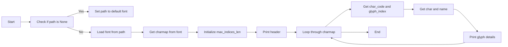

# `matplotlib\galleries\examples\text_labels_and_annotations\font_table.py` 详细设计文档

This script generates a font table showing the glyphs of a specified font file using Matplotlib. It can also print all glyphs in the font to stdout.

## 整体流程


## 类结构

```
FontTableScript (主脚本)
├── ArgumentParser (解析命令行参数)
│   ├── path (str): 字体文件路径
│   └── print_all (bool): 是否打印所有字符
└── matplotlib.pyplot (绘图库)
```

## 全局变量及字段


### `path`
    
The path to the font file. If None, use Matplotlib's default font.

类型：`str or None`
    


### `print_all`
    
Additionally, print all chars to stdout.

类型：`bool`
    


### `FontTableScript.path`
    
The path to the font file. If None, use Matplotlib's default font.

类型：`str or None`
    


### `FontTableScript.print_all`
    
Additionally, print all chars to stdout.

类型：`bool`
    
    

## 全局函数及方法


### print_glyphs

Print the all glyphs in the given font file to stdout.

参数：

- `path`：`str or None`，The path to the font file.  If None, use Matplotlib's default font.

返回值：`None`，No return value, prints to stdout.

#### 流程图



#### 带注释源码

```python
def print_glyphs(path):
    """
    Print the all glyphs in the given font file to stdout.

    Parameters
    ----------
    path : str or None
        The path to the font file.  If None, use Matplotlib's default font.
    """
    if path is None:
        path = fm.findfont(fm.FontProperties())  # The default font.

    font = FT2Font(path)

    charmap = font.get_charmap()
    max_indices_len = len(str(max(charmap.values())))

    print("The font face contains the following glyphs:")
    for char_code, glyph_index in charmap.items():
        char = chr(char_code)
        name = unicodedata.name(
                char,
                f"{char_code:#x} ({font.get_glyph_name(glyph_index)})")
        print(f"{glyph_index:>{max_indices_len}} {char} {name}")
```


### draw_font_table

Draw a font table of the first 255 chars of the given font.

参数：

- `path`：`str or None`，The path to the font file. If None, use Matplotlib's default font.

返回值：`None`，No return value, the function displays the font table.

#### 流程图


#### 带注释源码

```python
def draw_font_table(path):
    """
    Draw a font table of the first 255 chars of the given font.

    Parameters
    ----------
    path : str or None
        The path to the font file.  If None, use Matplotlib's default font.
    """
    if path is None:
        path = fm.findfont(fm.FontProperties())  # The default font.

    font = FT2Font(path)
    codes = font.get_charmap().items()

    labelc = [f"{i:X}" for i in range(16)]
    labelr = [f"{i:02X}" for i in range(0, 16*16, 16)]
    chars = [["" for c in range(16)] for r in range(16)]

    for char_code, glyph_index in codes:
        if char_code >= 256:
            continue
        row, col = divmod(char_code, 16)
        chars[row][col] = chr(char_code)

    fig, ax = plt.subplots(figsize=(8, 4))
    ax.set_title(os.path.basename(path))
    ax.set_axis_off()

    table = ax.table(
        cellText=chars,
        rowLabels=labelr,
        colLabels=labelc,
        rowColours=["palegreen"] * 16,
        colColours=["palegreen"] * 16,
        cellColours=[[".95" for c in range(16)] for r in range(16)],
        cellLoc='center',
        loc='upper left',
    )
    for key, cell in table.get_celld().items():
        row, col = key
        if row > 0 and col > -1:  # Beware of table's idiosyncratic indexing...
            cell.set_text_props(font=Path(path))

    fig.tight_layout()
    plt.show()
```


### FontTableScript.main

The main function of the FontTableScript script, which parses command-line arguments and calls the appropriate functions to display a font table and print all glyphs in the given font.

参数：

- `args.path`：`str`，The path to the font file. If None, use Matplotlib's default font.
- `args.print_all`：`bool`，If True, print all chars to stdout.

返回值：`None`，No return value.

#### 流程图


#### 带注释源码

```python
if __name__ == "__main__":
    from argparse import ArgumentParser

    parser = ArgumentParser(description="Display a font table.")
    parser.add_argument("path", nargs="?", help="Path to the font file.")
    parser.add_argument("--print-all", action="store_true",
                        help="Additionally, print all chars to stdout.")
    args = parser.parse_args()

    if args.print_all:
        print_glyphs(args.path)
    draw_font_table(args.path)
```


## 关键组件


### 张量索引与惰性加载

张量索引与惰性加载是代码中处理字体字符映射的方式，它允许在需要时才加载字符的详细信息，从而提高性能和内存效率。

### 反量化支持

反量化支持是代码中处理Unicode字符编码的方式，它允许将字符编码转换为可显示的字符，并获取字符的名称信息。

### 量化策略

量化策略是代码中处理字体字符映射和字符显示的方式，它通过将字符编码映射到字体中的具体字形，并使用matplotlib进行显示，从而实现字体表的绘制。


## 问题及建议


### 已知问题

-   **性能问题**：代码在绘制字体表格时，使用了`matplotlib`的`table`功能，这可能不是渲染大量字符的最佳方式，尤其是在性能敏感的应用中。
-   **代码重复**：`print_glyphs`和`draw_font_table`函数中都有获取字体路径的逻辑，这部分代码可以提取出来作为一个单独的函数，以减少重复。
-   **错误处理**：代码中没有明确的错误处理机制，例如，如果字体文件不存在或损坏，程序可能会崩溃。
-   **用户界面**：命令行界面相对简单，没有提供图形用户界面（GUI）选项，这可能限制了用户体验。

### 优化建议

-   **性能优化**：考虑使用更高效的字符渲染方法，例如使用`PIL`（Pillow）库来渲染字符，或者使用`matplotlib`的`text`功能而不是`table`。
-   **代码重构**：提取获取字体路径的逻辑到一个单独的函数，以减少代码重复并提高可维护性。
-   **错误处理**：增加异常处理来捕获和处理潜在的错误，例如文件不存在或损坏的字体文件。
-   **用户界面**：开发一个简单的GUI，允许用户通过图形界面选择字体文件，并显示字体表格。
-   **文档和注释**：增加代码注释和文档，以提高代码的可读性和可维护性。
-   **国际化**：考虑添加对多语言的支持，以便用户可以以不同语言查看字符名称。


## 其它


### 设计目标与约束

- 设计目标：
  - 提供一个用户友好的界面来显示指定字体文件的字符表。
  - 支持使用Matplotlib库来绘制字符表。
  - 支持打印所有字符到标准输出。
- 约束：
  - 代码应尽可能简洁，易于理解和维护。
  - 代码应遵循Python编程的最佳实践。
  - 代码应兼容Matplotlib库。

### 错误处理与异常设计

- 错误处理：
  - 当提供的字体文件路径不存在时，应抛出`FileNotFoundError`异常。
  - 当字体文件格式不支持时，应抛出`ValueError`异常。
  - 当Matplotlib库无法正常工作时，应抛出`ImportError`异常。
- 异常设计：
  - 使用try-except块来捕获和处理上述异常。
  - 提供清晰的错误消息，帮助用户理解问题所在。

### 数据流与状态机

- 数据流：
  - 用户输入字体文件路径。
  - 程序读取字体文件并获取字符映射。
  - 程序使用Matplotlib绘制字符表。
  - 程序打印所有字符到标准输出。
- 状态机：
  - 程序从解析命令行参数开始。
  - 根据参数执行相应的操作（打印字符或绘制字符表）。
  - 程序结束。

### 外部依赖与接口契约

- 外部依赖：
  - Matplotlib库：用于绘制字符表。
  - unicodedata库：用于获取字符名称。
  - argparse库：用于解析命令行参数。
- 接口契约：
  - `FT2Font`类：用于加载和操作字体文件。
  - `matplotlib.pyplot`模块：用于创建图形和图表。
  - `matplotlib.font_manager`模块：用于获取默认字体。
  - `argparse`模块：用于解析命令行参数。

    