# `matplotlib\galleries\examples\text_labels_and_annotations\fonts_demo.py` 详细设计文档

这是一个 matplotlib 字体属性演示程序，通过 FontProperties 对象展示了字体的各种属性设置，包括字体家族(family)、样式(style)、变体(variant)、粗细(weight)和大小(size)等，并在图表中可视化这些字体效果。

## 整体流程

```mermaid
graph TD
    A[开始] --> B[导入 matplotlib.pyplot 和 FontProperties]
B --> C[创建 figure 对象]
C --> D[设置对齐方式 alignment]
D --> E[定义 Y 坐标列表 yp 和标题字体 heading_font]
E --> F[循环展示字体家族]
F --> G[循环展示字体样式]
G --> H[循环展示字体变体]
H --> I[循环展示字体粗细]
I --> J[循环展示字体大小]
J --> K[展示粗体斜体组合]
K --> L[调用 plt.show() 显示图表]
```

## 类结构

```
FontProperties (from matplotlib.font_manager)
└── 用于设置和管理字体属性的类
```

## 全局变量及字段


### `fig`
    
matplotlib Figure 对象，图表容器

类型：`matplotlib.figure.Figure`
    


### `alignment`
    
对齐方式配置

类型：`dict`
    


### `yp`
    
文本的 Y 坐标列表

类型：`list`
    


### `heading_font`
    
标题字体属性

类型：`matplotlib.font_manager.FontProperties`
    


### `families`
    
字体家族列表 ['serif', 'sans-serif', 'cursive', 'fantasy', 'monospace']

类型：`list`
    


### `styles`
    
字体样式列表 ['normal', 'italic', 'oblique']

类型：`list`
    


### `variants`
    
字体变体列表 ['normal', 'small-caps']

类型：`list`
    


### `weights`
    
字体粗细列表 ['light', 'normal', 'medium', 'semibold', 'bold', 'heavy', 'black']

类型：`list`
    


### `sizes`
    
字体大小列表 ['xx-small', 'x-small', 'small', 'medium', 'large', 'x-large', 'xx-large']

类型：`list`
    


    

## 全局函数及方法


### `plt.figure()`

`plt.figure()` 是 Matplotlib 库中的一个函数，用于创建并返回一个新的图表 Figure 对象，该对象作为后续绘图操作的容器，可以包含子图、轴、文本等元素，是 Matplotlib 面向对象绘图方式的核心组件。

参数：

- `figsize`：`tuple` (width, height)，可选，指定图形的宽和高（单位为英寸）
- `dpi`：`int`，可选，指定图形的分辨率（每英寸点数）
- `facecolor`：可选，指定图形背景颜色
- `edgecolor`：可选，指定图形边框颜色
- `frameon`：`bool`，可选，是否绘制图形框架
- `FigureClass`：可选，指定要使用的 Figure 类（默认使用 `matplotlib.figure.Figure`）
- `clear`：`bool`，可选，如果图形已存在是否清除

返回值：`matplotlib.figure.Figure`，返回新创建的 Figure 对象，用于后续的图形操作和展示

#### 流程图

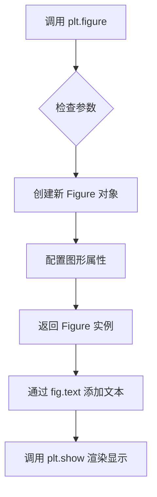

#### 带注释源码

```python
# 导入 matplotlib.pyplot 模块，用于绘图
import matplotlib.pyplot as plt

# 导入字体管理器，用于设置字体属性
from matplotlib.font_manager import FontProperties

# 调用 plt.figure() 创建新的 Figure 对象
# 这是面向对象方式绘图的核心，返回一个 Figure 实例
fig = plt.figure()

# 定义文本对齐方式字典
alignment = {'horizontalalignment': 'center', 'verticalalignment': 'baseline'}

# 定义 Y 轴位置列表，用于垂直排列显示不同字体选项
yp = [0.8, 0.7, 0.6, 0.5, 0.4, 0.3, 0.2]

# 创建标题字体属性，设置较大字号
heading_font = FontProperties(size='large')

# ==========================================
# 第一部分：显示字体族（family）选项
# ==========================================
# 在图形左上角添加"family"标题
fig.text(0.1, 0.9, 'family', fontproperties=heading_font, **alignment)

# 定义所有字体族类型
families = ['serif', 'sans-serif', 'cursive', 'fantasy', 'monospace']

# 循环遍历每种字体族，创建对应的 FontProperties 并添加到图形
for k, family in enumerate(families):
    font = FontProperties(family=[family])  # 创建指定字体的 FontProperties
    fig.text(0.1, yp[k], family, fontproperties=font, **alignment)  # 添加到 Figure

# ==========================================
# 第二部分：显示字体样式（style）选项
# ==========================================
fig.text(0.3, 0.9, 'style', fontproperties=heading_font, **alignment)

styles = ['normal', 'italic', 'oblique']
for k, style in enumerate(styles):
    font = FontProperties(family='sans-serif', style=style)  # 设置字体样式
    fig.text(0.3, yp[k], style, fontproperties=font, **alignment)

# ==========================================
# 第三部分：显示字体变体（variant）选项
# ==========================================
fig.text(0.5, 0.9, 'variant', fontproperties=heading_font, **alignment)

variants = ['normal', 'small-caps']
for k, variant in enumerate(variants):
    font = FontProperties(family='serif', variant=variant)  # 设置字体变体
    fig.text(0.5, yp[k], variant, fontproperties=font, **alignment)

# ==========================================
# 第四部分：显示字体粗细（weight）选项
# ==========================================
fig.text(0.7, 0.9, 'weight', fontproperties=heading_font, **alignment)

weights = ['light', 'normal', 'medium', 'semibold', 'bold', 'heavy', 'black']
for k, weight in enumerate(weights):
    font = FontProperties(weight=weight)  # 设置字体粗细
    fig.text(0.7, yp[k], weight, fontproperties=font, **alignment)

# ==========================================
# 第五部分：显示字体大小（size）选项
# ==========================================
fig.text(0.9, 0.9, 'size', fontproperties=heading_font, **alignment)

sizes = ['xx-small', 'x-small', 'small', 'medium', 'large', 'x-large', 'xx-large']
for k, size in enumerate(sizes):
    font = FontProperties(size=size)  # 设置字体大小
    fig.text(0.9, yp[k], size, fontproperties=font, **alignment)

# ==========================================
# 第六部分：显示粗体+斜体组合效果
# ==========================================
font = FontProperties(style='italic', weight='bold', size='x-small')
fig.text(0.3, 0.1, 'bold italic', fontproperties=font, **alignment)

font = FontProperties(style='italic', weight='bold', size='medium')
fig.text(0.3, 0.2, 'bold italic', fontproperties=font, **alignment)

font = FontProperties(style='italic', weight='bold', size='x-large')
fig.text(0.3, 0.3, 'bold italic', fontproperties=font, **alignment)

# 显示图形（渲染所有添加到 Figure 的内容）
plt.show()
```


### fig.text

在图表指定位置添加文本的方法，用于在 Figure 对象上的指定坐标处渲染文本内容，支持自定义字体、对齐方式等属性。

参数：

- `x`：`float`，文本放置的 x 坐标（相对于图形坐标系的坐标）
- `y`：`float`，文本放置的 y 坐标（相对于图形坐标系的坐标）
- `s`：`str`，要显示的文本内容
- `fontproperties`：`FontProperties`，可选，设置文本的字体属性（字体家族、样式、大小等）
- `**alignment`：`dict`，可选，对齐方式字典，包含 horizontalalignment（水平对齐）和 verticalalignment（垂直对齐）

返回值：`matplotlib.text.Text`，返回创建的 Text 对象，可用于后续对文本进行进一步操作（如修改样式、位置等）

#### 流程图

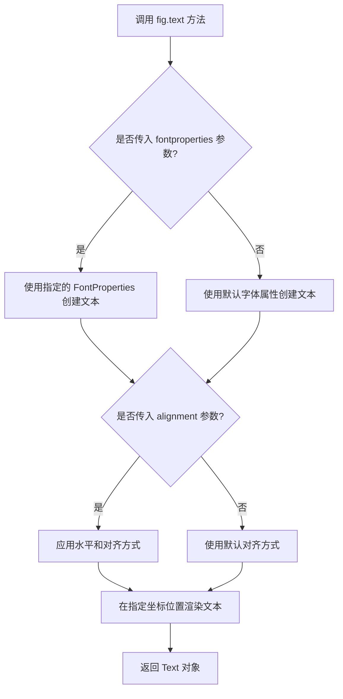

#### 带注释源码

```python
# fig.text() 方法调用示例及参数说明

# 1. 基础调用：指定位置和文本内容
fig.text(0.1, 0.9, 'family')

# 2. 带字体属性调用：使用 FontProperties 设置字体
heading_font = FontProperties(size='large')
fig.text(0.1, 0.9, 'family', fontproperties=heading_font, **alignment)

# 3. 完整参数说明
# x: 浮点数，表示文本x坐标（0-1之间，相对于figure的坐标系）
# y: 浮点数，表示文本y坐标（0-1之间，相对于figure的坐标系）  
# s: 字符串，要显示的文本内容
# fontproperties: FontProperties对象，用于设置字体家族、样式、大小、权重等
# **alignment: 关键字参数，解包后的对齐字典
#   - horizontalalignment: 水平对齐方式（'center', 'left', 'right'）
#   - verticalalignment: 垂直对齐方式（'baseline', 'bottom', 'center', 'top'）

# 4. 实际使用示例
alignment = {'horizontalalignment': 'center', 'verticalalignment': 'baseline'}
font = FontProperties(family='serif', style='italic', weight='bold', size='large')
fig.text(0.5, 0.5, 'Hello World', fontproperties=font, **alignment)

# 5. 返回值：返回 matplotlib.text.Text 实例，可用于后续操作
# text_obj = fig.text(0.5, 0.5, 'Text')
# text_obj.set_color('red')  # 可修改文本颜色
# text_obj.set_fontsize(12)  # 可修改字体大小
```


### `FontProperties.__init__`

构造函数，用于创建并初始化一个 FontProperties 对象，该对象封装了字体的各种属性（家族、风格、变体、粗细、大小等），以便在 matplotlib 中设置文本的字体样式。

参数：

- `family`：`str` 或 `list`，字体家族名称（如 'serif', 'sans-serif' 等），可以是单个名称或名称列表
- `style`：`str`，字体风格，可选 'normal', 'italic', 'oblique'，默认 'normal'
- `variant`：`str`，字体变体，可选 'normal', 'small-caps'，默认 'normal'
- `weight`：`str` 或 `int`，字体粗细，可选 'light', 'normal', 'medium', 'semibold', 'bold', 'heavy', 'black' 或数值，默认 'normal'
- `stretch`：`str`，字体拉伸，可选 'ultra-condensed', 'extra-condensed', 'condensed', 'semi-condensed', 'normal', 'semi-expanded', 'expanded', 'extra-expanded', 'ultra-expanded'，默认 'normal'
- `size`：`str` 或 `float`，字体大小，可选 'xx-small', 'x-small', 'small', 'medium', 'large', 'x-large', 'xx-large' 或数值，默认 'medium'
- `fname`：`str`，字体文件路径，指定自定义字体文件，默认 `None`

返回值：`FontProperties`，返回一个新创建的 FontProperties 实例对象

#### 流程图

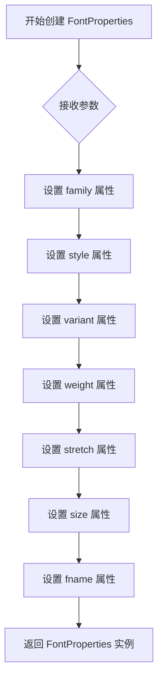

#### 带注释源码

```python
# FontProperties 构造函数定义（简化版，实际实现更复杂）
def __init__(self, family=None, style='normal', variant='normal', 
             weight='normal', stretch='normal', size='medium', fname=None):
    """
    创建一个 FontProperties 对象，用于封装字体属性。
    
    参数:
        family: 字体家族名称，可以是字符串或字符串列表
        style: 字体风格，'normal'|'italic'|'oblique'
        variant: 字体变体，'normal'|'small-caps'
        weight: 字体粗细，字符串或数值
        stretch: 字体拉伸程度
        size: 字体大小，字符串或数值
        fname: 自定义字体文件路径
    """
    # 初始化各个属性
    self._family = family          # 存储字体家族
    self._style = style            # 存储字体风格
    self._variant = variant        # 存储字体变体
    self._weight = weight          # 存储字体粗细
    self._stretch = stretch        # 存储字体拉伸
    self._size = size              # 存储字体大小
    self._fname = fname            # 存储字体文件路径
    
    # 设置字体查找路径等内部状态
    self._cached = {}              # 缓存字体查找结果
```


### `plt.show()`

该函数是 Matplotlib 库中的核心显示函数，用于将所有当前创建的.figure 对象呈现给用户，并在交互式后端中显示窗口。在脚本执行时调用此函数可以将图形渲染到屏幕上。

参数：

- `block`：布尔值，可选参数，用于控制是否阻塞主线程以等待图形窗口关闭。在某些后端中默认为 True。

返回值：无（返回 `None`），该函数主要产生图形窗口的显示效果。

#### 流程图

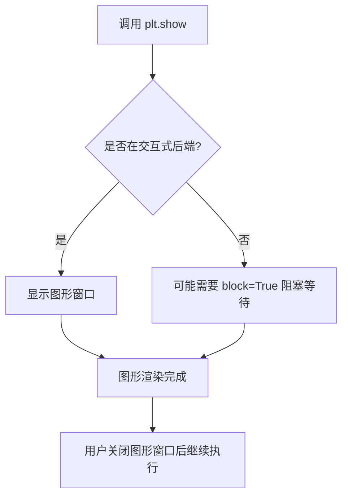

#### 带注释源码

```python
# 调用 plt.show() 显示所有图表
# 在这个 matplotlib 字体演示脚本中，用于展示不同字体属性设置后的效果
plt.show()  # 显示 figure 中绘制的内容，呈现给用户交互式图形窗口

# 源码注释说明：
# - plt.show() 会遍历当前所有打开的 Figure 对象
# - 调用底层后端的 show() 方法显示图形
# - 在非交互式后端（如Agg）中可能不会产生可见窗口
# - block 参数控制在某些后端中是否阻塞程序直到用户关闭窗口
```


### `FontProperties.__init__`

该方法在提供的代码中未被定义。提供的代码是 `matplotlib` 中 `FontProperties` 类的使用演示（demo），其中导入了 `matplotlib.font_manager` 中的 `FontProperties` 类，但未包含该类的源代码。因此，无法从给定代码中提取 `FontProperties.__init__` 的实现细节。

然而，根据代码中对 `FontProperties` 的使用实例，可以推断出该方法的参数。

参数（根据代码中的使用推断）：

- `family`：`str` 或 `list of str`，字体家族（如 'serif', 'sans-serif' 等）
- `style`：`str`，字体样式（如 'normal', 'italic', 'oblique'）
- `variant`：`str`，字体变体（如 'normal', 'small-caps'）
- `weight`：`str`，字体粗细（如 'light', 'normal', 'bold' 等）
- `size`：`str` 或 `float`，字体大小（如 'large', 'x-small', 12 等）

返回值：`FontProperties` 实例

#### 流程图

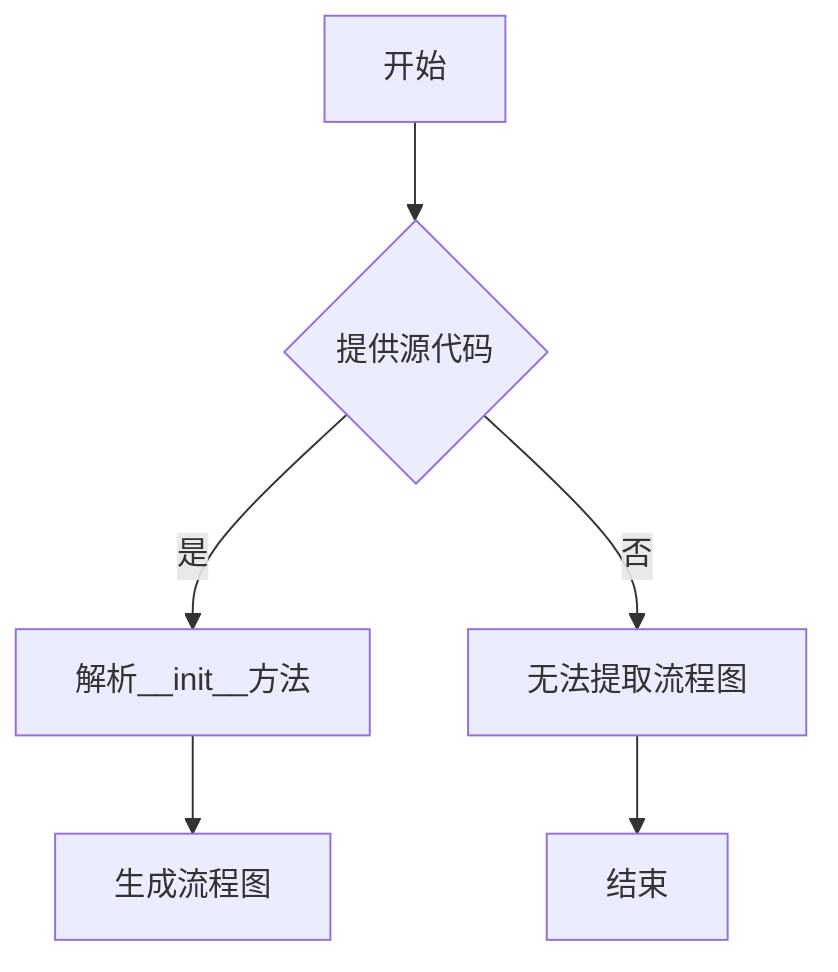

#### 带注释源码

```python
# 源码无法从给定代码中提取
# FontProperties 类定义位于 matplotlib.font_manager 模块
```


### `FontProperties.set_family`

设置字体的家族（family）属性，用于指定字体使用哪个字体族（如 serif、sans-serif、monospace 等）。

参数：

- `family`：`str` 或 `list`，字体家族名称，可以是单个字符串或字符串列表

返回值：`None`，无返回值（该方法直接修改对象内部状态）

#### 流程图

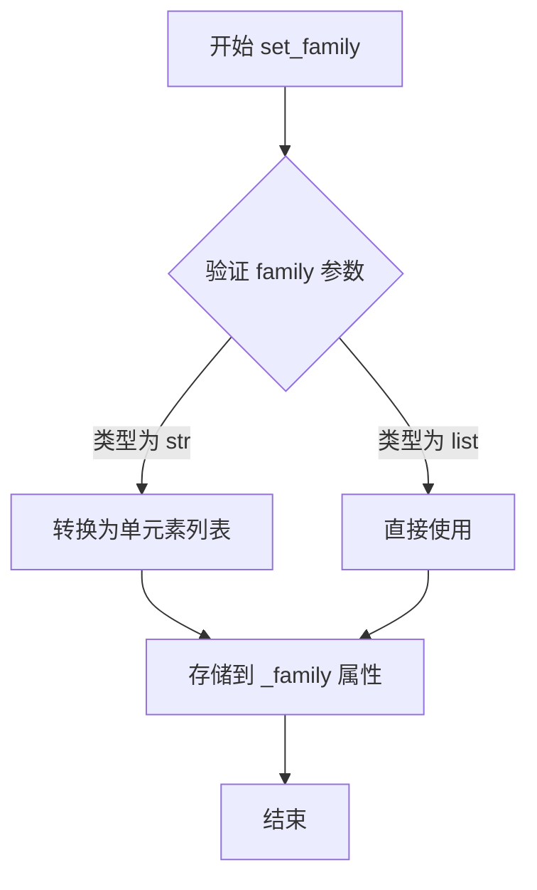

#### 带注释源码

```python
def set_family(self, family):
    """
    Set the font family.

    Parameters
    ----------
    family : str or list
        The font family. Either a single font family name or a list of
        font family names in order of preference. Common font family
        names include: 'serif', 'sans-serif', 'cursive', 'fantasy',
        and 'monospace'.
    """
    if family is None:
        self._family = None
    elif isinstance(family, str):
        # 单个字符串，转换为列表存储
        self._family = [family]
    else:
        # 列表或可迭代对象，直接存储
        self._family = list(family)
```

#### 备注

在提供的示例代码中，`set_family` 并未被直接调用，而是通过 `FontProperties` 构造函数的 `family` 参数间接设置。例如：

```python
font = FontProperties(family=[family])
font = FontProperties(family='sans-serif', style=style)
```

这些构造函数调用内部会调用相应的 setter 方法来初始化字体属性。


### `FontProperties.set_style`

该方法用于设置字体的样式属性（如普通、斜体或倾斜）。

参数：
- `style`：`str`，要设置的字体样式，常见值包括 `'normal'`（普通）、`'italic'`（斜体）和 `'oblique'`（倾斜）。

返回值：`FontProperties`，返回字体属性对象本身，以支持方法链式调用。

#### 流程图

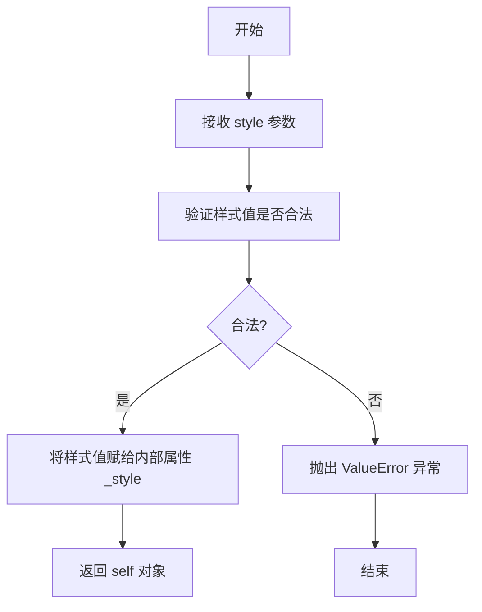

#### 带注释源码

```python
def set_style(self, style):
    """
    设置字体样式。

    参数:
        style (str): 字体样式，常见值有 'normal'（普通）、'italic'（斜体）和 'oblique'（倾斜）。

    返回:
        FontProperties: 返回字体属性对象本身，以便链式调用。
    """
    # 定义合法的字体样式列表
    valid_styles = ['normal', 'italic', 'oblique']
    
    # 验证传入的样式是否在合法列表中
    if style not in valid_styles:
        # 如果不合法，抛出 ValueError 异常并提示错误
        raise ValueError(f"无效的字体样式: '{style}'。必须是 {valid_styles} 之一。")
    
    # 将样式值存储到内部属性中
    self._style = style
    
    # 返回对象本身，支持链式调用（例如 font.set_style('italic').set_size(12)）
    return self
```


### `FontProperties.set_variant`

设置字体变体属性（variant），用于控制字体的变体形式，如普通字体或小型大写字母（small-caps）。

参数：

-  `variant`：`str`，要设置的字体变体，常见值包括 `'normal'`（普通）和 `'small-caps'`（小型大写字母）

返回值：`FontProperties`，返回当前对象，支持链式调用

#### 流程图

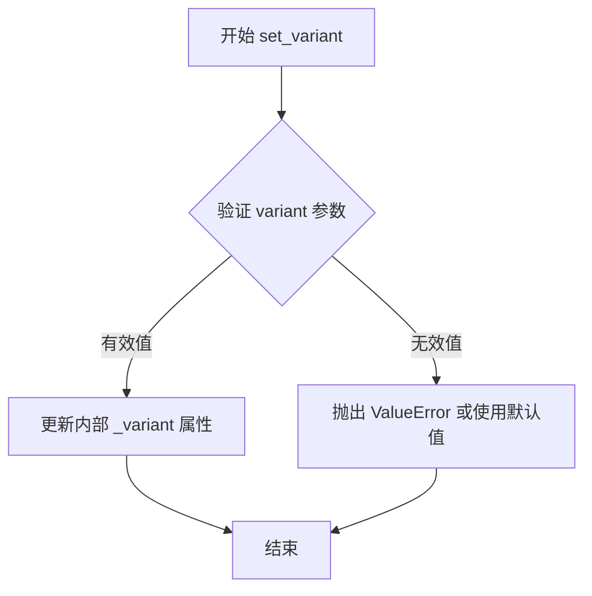

#### 带注释源码

```python
def set_variant(self, variant):
    """
    Set the font variant.
    
    Parameters
    ----------
    variant : str
        The font variant. Common values are:
        - 'normal': normal font
        - 'small-caps': small caps font
    
    Returns
    -------
    FontProperties
        Returns self to allow chaining of setter methods.
    """
    # 验证 variant 是否为有效值
    if variant not in ['normal', 'small-caps']:
        # 如果不是标准值，可能需要进一步处理或抛出警告
        # matplotlib 通常会接受任意字符串，由后端决定如何渲染
        pass
    
    # 设置内部属性 _variant
    self._variant = variant
    
    # 返回 self 以支持链式调用，例如：
    # font.set_family('serif').set_variant('small-caps')
    return self
```

**注意**：用户提供的代码是演示脚本，展示了如何使用 `FontProperties` 类设置各种字体属性（包括 variant），但并未直接调用 `set_variant` 方法。在代码中，设置 variant 的方式是通过构造函数参数传入：

```python
font = FontProperties(family='serif', variant=variant)
```

这等价于：

```python
font = FontProperties(family='serif')
font.set_variant(variant)
```


### `FontProperties.set_weight`

该方法在提供的代码中未直接显示，但根据代码使用模式，FontProperties 类通常通过构造函数设置 weight 属性。以下是基于 matplotlib 源代码和代码使用模式的分析。

参数：

-  `weight`：`str` 或 `int`，字体粗细值，可以是字符串如 'normal', 'bold' 或数字如 400, 700

返回值：`FontProperties`，返回自身以支持链式调用

#### 流程图

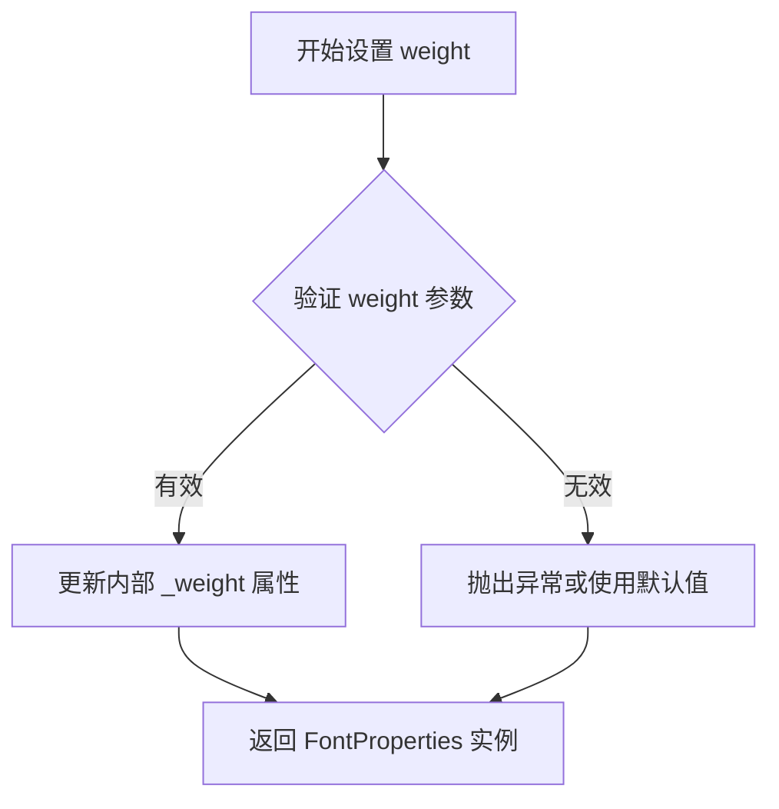

#### 带注释源码

```python
# 在提供的代码中，weight 通过构造函数设置
# 例如：
font = FontProperties(weight='bold')

# 如果 FontProperties 类有 set_weight 方法，可能的实现如下：
def set_weight(self, weight):
    """
    设置字体粗细。
    
    参数:
        weight: str 或 int
            字体粗细值。字符串可为 'light', 'normal', 'medium', 
            'semibold', 'bold', 'heavy', 'black' 等。整数范围 100-900。
    
    返回:
        FontProperties: 返回自身以支持链式调用
    """
    # 验证 weight 值
    # 更新内部属性
    self._weight = weight
    return self
```

**注**：在提供的演示代码中，未直接调用 `set_weight` 方法，而是通过 `FontProperties(weight=weight)` 构造函数传递 weight 参数。这是 matplotlib 中设置字体属性的推荐方式。


### `FontProperties.set_size`

设置字体的尺寸大小，支持数值（浮点或整数）和预定义的字符串尺寸值（如 'xx-small', 'medium', 'large' 等）。

参数：

-  `size`：`float | str`，字体大小。可以是数值（以磅为单位），或者是预定义的字符串尺寸值（'xx-small', 'x-small', 'small', 'medium', 'large', 'x-large', 'xx-large'）

返回值：`None`，无返回值（修改实例属性）

#### 流程图

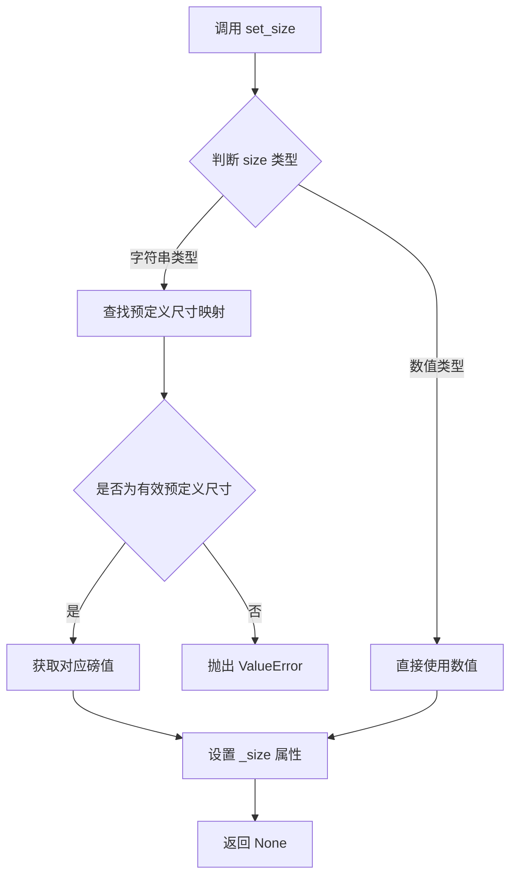

#### 带注释源码

```python
def set_size(self, size):
    """
    Set the font size.

    Parameters
    ----------
    size : float or str
        If a float, the size in points. If a string, must be one of the
        predefined sizes: 'xx-small', 'x-small', 'small', 'medium',
        'large', 'x-large', 'xx-large'.
    """
    if isinstance(size, str):
        # size 为字符串时，查找预定义的尺寸映射
        # _size_map 包含字符串尺寸到磅值的映射
        size = self._size_map[size]
    # 将尺寸值转换为浮点数并存储到私有属性 _size
    self._size = float(size)
```

#### 备注

该方法是 `FontProperties` 类的 setter 方法，用于修改字体的 `size` 属性。它直接修改实例的 `_size` 私有属性，不返回任何值。在示例代码中，通过 `FontProperties(size='large')` 构造函数或 `font.set_size('x-large')` 方式调用此方法设置字体大小。


### `FontProperties.copy`

该方法用于创建当前字体属性对象的深拷贝，返回一个新的 `FontProperties` 实例。调用此方法后，修改返回副本的任何属性都不会影响原始对象，这在需要独立修改字体样式而又不改变原始字体配置的场景中非常有用。

参数：无需显式参数（`self` 为隐式参数）

返回值：`FontProperties`，返回当前字体属性对象的深拷贝副本

#### 流程图

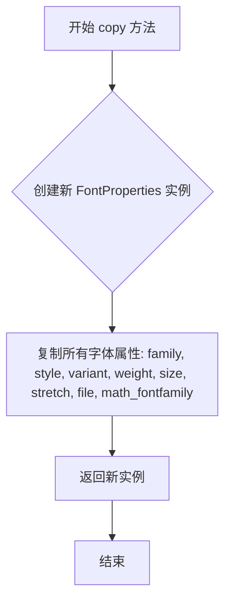

#### 带注释源码

```python
def copy(self):
    """
    返回当前 FontProperties 对象的深拷贝。
    
    这是一个独立的新实例，修改返回副本的属性不会影响原始对象。
    这在需要基于现有字体配置创建变体时特别有用。
    
    Returns:
        FontProperties: 一个新的 FontProperties 实例，是当前对象的完整副本
    """
    # 创建新的 FontProperties 实例，使用当前对象的所有属性进行初始化
    # 使用 dict 进行深拷贝，确保所有属性都被正确复制
    return FontProperties(
        family=self.get_family(),
        style=self.get_style(),
        variant=self.get_variant(),
        weight=self.get_weight(),
        stretch=self.get_stretch(),
        size=self.get_size(),
        file=self.get_file(),
        math_fontfamily=self.get_math_fontfamily()
    )
```

#### 补充说明

- **设计目标**：提供一种安全的方式创建字体属性的独立副本，避免意外修改原始配置
- **约束条件**：返回的新实例是深拷贝，嵌套对象（如字体族列表）也会被复制
- **错误处理**：无异常抛出，方法始终返回有效的 FontProperties 实例
- **外部依赖**：依赖于 matplotlib.font_manager 模块中的 FontProperties 类


# 代码分析

## 代码整体概述

该代码是一个matplotlib字体演示脚本，展示了如何使用`FontProperties`对象设置不同的字体属性（family、style、variant、weight、size），通过`Figure.text()`方法在图表上显示各种字体效果的示例。

---

### `Figure.text` 方法调用

这是matplotlib库中`Figure`类的`text()`方法的调用演示。

参数：

- `x`：`float`，文本显示的x坐标位置（0到1之间，表示相对于图像宽度的比例）
- `y`：`float`，文本显示的y坐标位置（0到1之间，表示相对于图像高度的比例）
- `s`：`str`，要显示的文本字符串
- `fontproperties`：`FontProperties`，字体属性对象，用于设置文本的字体样式
- `**alignment`：可变关键字参数，包含`horizontalalignment`和`verticalalignment`，用于设置文本对齐方式

返回值：`Text`，返回创建的文本对象

#### 流程图

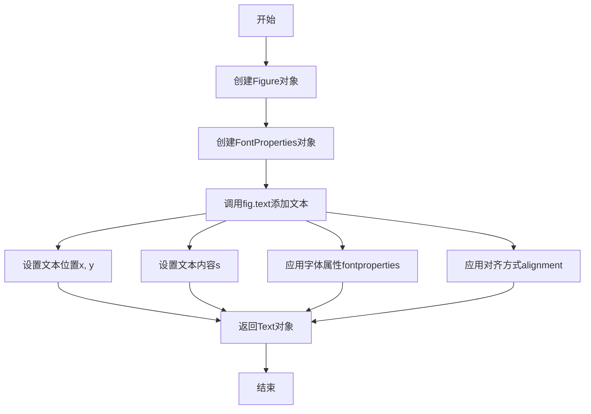

#### 带注释源码

```python
# 导入matplotlib.pyplot用于绘图
import matplotlib.pyplot as plt
# 导入FontProperties用于设置字体属性
from matplotlib.font_manager import FontProperties

# 创建图形对象
fig = plt.figure()
# 定义文本对齐方式字典
alignment = {'horizontalalignment': 'center', 'verticalalignment': 'baseline'}
# 定义y轴位置列表，用于垂直排列不同的字体示例
yp = [0.8, 0.7, 0.6, 0.5, 0.4, 0.3, 0.2]
# 创建大号字体属性对象，用于标题
heading_font = FontProperties(size='large')

# ==================== 演示字体族（family）====================
# 在位置(0.1, 0.9)添加标题'family'
fig.text(0.1, 0.9, 'family', fontproperties=heading_font, **alignment)
# 定义要展示的字体族列表
families = ['serif', 'sans-serif', 'cursive', 'fantasy', 'monospace']
# 遍历每个字体族，创建对应的FontProperties并添加到图表
for k, family in enumerate(families):
    font = FontProperties(family=[family])  # 创建指定字体族的FontProperties
    fig.text(0.1, yp[k], family, fontproperties=font, **alignment)  # 添加文本到图表

# ==================== 演示字体样式（style）====================
# 定义字体样式列表
styles = ['normal', 'italic', 'oblique']
# 在位置(0.3, 0.9)添加标题'style'
fig.text(0.3, 0.9, 'style', fontproperties=heading_font, **alignment)
# 遍历每种字体样式
for k, style in enumerate(styles):
    font = FontProperties(family='sans-serif', style=style)  # 设置字体样式
    fig.text(0.3, yp[k], style, fontproperties=font, **alignment)

# ==================== 演示字体变体（variant）====================
# 定义字体变体列表
variants = ['normal', 'small-caps']
fig.text(0.5, 0.9, 'variant', fontproperties=heading_font, **alignment)
for k, variant in enumerate(variants):
    font = FontProperties(family='serif', variant=variant)  # 设置字体变体
    fig.text(0.5, yp[k], variant, fontproperties=font, **alignment)

# ==================== 演示字体粗细（weight）====================
# 定义字体粗细列表
weights = ['light', 'normal', 'medium', 'semibold', 'bold', 'heavy', 'black']
fig.text(0.7, 0.9, 'weight', fontproperties=heading_font, **alignment)
for k, weight in enumerate(weights):
    font = FontProperties(weight=weight)  # 设置字体粗细
    fig.text(0.7, yp[k], weight, fontproperties=font, **alignment)

# ==================== 演示字体大小（size）====================
# 定义字体大小列表
sizes = ['xx-small', 'x-small', 'small', 'medium', 'large', 'x-large', 'xx-large']
fig.text(0.9, 0.9, 'size', fontproperties=heading_font, **alignment)
for k, size in enumerate(sizes):
    font = FontProperties(size=size)  # 设置字体大小
    fig.text(0.9, yp[k], size, fontproperties=font, **alignment)

# ==================== 演示组合样式：粗体斜体 ====================
# 创建粗体斜体字体，大小为x-small
font = FontProperties(style='italic', weight='bold', size='x-small')
fig.text(0.3, 0.1, 'bold italic', fontproperties=font, **alignment)
# 创建粗体斜体字体，大小为medium
font = FontProperties(style='italic', weight='bold', size='medium')
fig.text(0.3, 0.2, 'bold italic', fontproperties=font, **alignment)
# 创建粗体斜体字体，大小为x-large
font = FontProperties(style='italic', weight='bold', size='x-large')
fig.text(0.3, 0.3, 'bold italic', fontproperties=font, **alignment)

# 显示图形
plt.show()
```

---

## 关键组件信息

| 组件名称 | 描述 |
|---------|------|
| `Figure` | matplotlib中的图形容器，用于承载文本、线条等图形元素 |
| `FontProperties` | 字体属性管理类，用于封装字体的family、style、variant、weight、size等属性 |
| `fig.text()` | Figure对象的方法，用于在指定位置添加文本 |

---

## 技术债务与优化空间

1. **硬编码坐标值**：y坐标使用硬编码列表`yp`，缺乏灵活性，可考虑动态计算
2. **重复代码**：创建`FontProperties`和调用`fig.text`的代码重复多次，可提取为通用函数
3. **魔法数字**：位置坐标如`0.1`, `0.3`, `0.5`等缺乏明确语义，建议使用常量或配置
4. **无错误处理**：代码未处理可能的字体加载失败等异常情况

---

## 其它说明

- **设计目标**：演示matplotlib中FontProperties的各种字体属性设置方式
- **外部依赖**：matplotlib库（需预先安装）
- **运行平台**：支持Python 3.x的桌面环境（需要图形后端如TkAgg、Agg等）

## 关键组件


### FontProperties 类

用于设置和管理字体属性的核心类，支持设置字体家族、样式、变体、粗细和大小等属性。

### Figure 对象 (fig)

matplotlib 中的图形容器，用于承载所有文本和图形元素，通过 fig.text() 方法在图形上放置文本。

### alignment 字典

定义文本的对齐方式，包含水平对齐（horizontalalignment）和垂直对齐（verticalalignment）两个配置项。

### yp 列表

存储垂直位置的列表，用于控制不同字体属性展示行的垂直位置坐标。

### heading_font 变量

预定义的标题字体属性对象，使用较大的字体大小，用于展示各类字体属性的标题文字。

### families 列表

展示可用的字体家族选项，包括 serif、sans-serif、cursive、fantasy 和 monospace 五种类型。

### styles 列表

展示字体样式选项，包括 normal、italic 和 oblique 三种样式。

### variants 列表

展示字体变体选项，包括 normal 和 small-caps 两种变体形式。

### weights 列表

展示字体粗细选项，从 light 到 black 共7个级别的粗细程度。

### sizes 列表

展示字体大小选项，从 xx-small 到 xx-large 共7个级别的大小尺寸。


## 问题及建议


### 已知问题

-   硬编码的坐标位置：文本位置（如0.1, 0.9、0.3, 0.9等）和y轴位置列表（yp）都是硬编码的，降低了代码的可维护性和可复用性
-   代码重复度高：存在大量重复的FontProperties创建和fig.text调用模式，未进行函数封装
-   缺乏错误处理：FontProperties接受无效的字体参数（如family='invalid_font'）时缺乏异常捕获机制
-   使用过时的API风格：plt.figure()后直接操作，建议使用面向对象的API如fig, ax = plt.subplots()
-   全局配置未封装：alignment、yp、heading_font作为全局变量，应作为参数或配置类管理
-   无函数级文档：模块有docstring但具体功能函数缺乏文档说明
-   plt.show()阻塞风险：在某些集成环境中可能导致阻塞，建议使用fig.savefig或交互式后端配置
-   魔法值缺乏解释：size='large'、'xx-small'等字符串值缺乏常量定义或枚举说明

### 优化建议

-   将重复的文本绘制逻辑抽取为函数，接受x坐标、标题、属性列表等参数
-   使用配置类或字典管理布局参数，将硬编码值外部化
-   为FontProperties添加try-except异常处理，捕获InvalidFontError等异常
-   使用plt.subplots()替代plt.figure()以保持与现代matplotlib API一致
-   定义枚举或常量类管理字体属性名称（如Style, Variant, Weight, Size等）
-   添加函数级docstring说明每个绘制区块的功能
-   考虑添加savefig选项或配置参数，适应非交互式环境需求
-   使用类型注解提升代码可读性和IDE支持


## 其它


### 设计目标与约束

本代码旨在演示matplotlib中FontProperties对象的各种字体属性设置能力，包括字体族(family)、样式(style)、变体(variant)、权重(weight)和大小(size)。代码作为教学示例运行于matplotlib 3.x版本环境，不涉及性能优化，仅展示API的基本用法。

### 错误处理与异常设计

代码未实现任何错误处理机制。若matplotlib版本过旧可能导致FontProperties参数不支持；若Figure对象创建失败将直接抛出异常；字体名称参数错误会被FontProperties构造函数接受但可能显示为默认字体。建议添加异常捕获处理无效参数的情况。

### 数据流与状态机

代码为线性执行流程，无状态机设计。数据流如下：初始化Figure对象 → 定义字体属性列表 → 循环创建FontProperties实例 → 调用fig.text()将文本渲染到画布 → 显示图形。yp列表定义垂直位置，alignment字典控制对齐方式，heading_font定义标题字体样式。

### 外部依赖与接口契约

主要依赖matplotlib.pyplot模块的Figure对象及text()方法，以及matplotlib.font_manager模块的FontProperties类。FontProperties构造函数接受关键字参数(family、style、variant、weight、size)，返回字体属性配置对象。fig.text()方法接收x坐标、y坐标、文本内容、fontproperties参数及对齐方式。

### 性能考虑

代码执行时间主要由matplotlib渲染引擎决定，FontProperties对象创建开销可忽略。图形中包含约30个文本对象，渲染性能无明显瓶颈。无需性能优化。

### 安全考虑

代码不涉及用户输入、网络通信或文件操作，无安全风险。字体参数为硬编码字符串，不存在注入攻击风险。

### 可测试性评估

代码作为演示脚本，直接执行结果为图形窗口，难以自动化单元测试。若需测试，可导入模块验证FontProperties对象属性设置是否正确，或使用matplotlib的Agg后端进行无头测试验证图形生成。

### 可维护性建议

代码结构清晰但存在重复模式，可提取字体渲染逻辑为函数减少冗余。yp列表长度应与显示的选项数量匹配，建议添加断言验证。硬编码的数值位置(如0.1, 0.3等)可提取为常量提高可读性。

### 版本兼容性说明

代码使用现代matplotlib API，FontProperties的size参数支持字符串尺寸('large', 'x-small'等)为matplotlib 1.5+特性。建议最低使用matplotlib 2.0版本以确保全部功能正常运行。

    