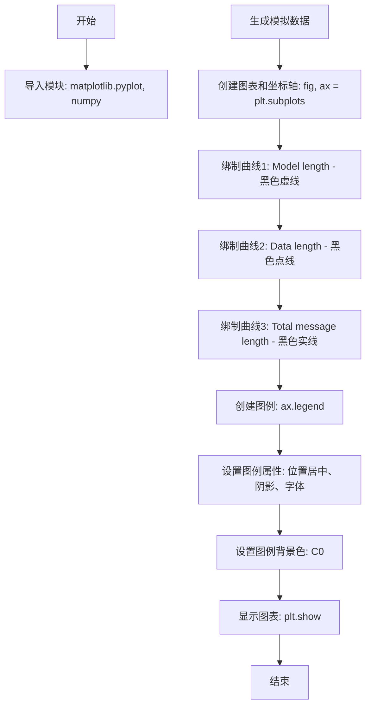

# `matplotlib\galleries\examples\text_labels_and_annotations\legend.py` 详细设计文档

该代码是一个Matplotlib示例脚本，用于演示如何在使用预定义标签创建图表后添加图例（legend），包括设置图例位置、背景颜色等样式定制。

## 整体流程

```mermaid
graph TD
    A[开始] --> B[导入 matplotlib.pyplot 和 numpy]
B --> C[生成模拟数据 a, b, c, d]
C --> D[创建 Figure 和 Axes 对象]
D --> E[绘制三条曲线并设置标签]
E --> F[调用 legend() 创建图例]
F --> G[设置图例背景颜色]
G --> H[调用 plt.show() 显示图表]
H --> I[结束]
```

## 类结构

```
该脚本为过程式代码，无自定义类层次结构
使用的 Matplotlib 库类层次结构（参考）：
matplotlib.figure.Figure
└── matplotlib.axes.Axes
    └── matplotlib.legend.Legend
```

## 全局变量及字段


### `a`
    
横坐标数据 (0到3，步长0.02)

类型：`numpy.ndarray`
    


### `b`
    
与a相同的横坐标数据

类型：`numpy.ndarray`
    


### `c`
    
指数增长数据 (exp(a))

类型：`numpy.ndarray`
    


### `d`
    
c的反向数据 (c[::-1])

类型：`numpy.ndarray`
    


### `fig`
    
图表容器对象

类型：`matplotlib.figure.Figure`
    


### `ax`
    
坐标轴对象

类型：`matplotlib.axes.Axes`
    


### `legend`
    
图例对象

类型：`matplotlib.legend.Legend`
    


    

## 全局函数及方法


### `main` (主程序逻辑)

本代码是一个Matplotlib图例（Legend）示例脚本，核心功能是创建带有预定义标签的图表图例。通过生成模拟数据（指数曲线和反转曲线），绑制三条不同线型的曲线，并使用`ax.legend()`方法添加具有阴影效果和自定义背景色的图例。

参数：无显式函数参数（脚本直接执行）

返回值：无返回值（执行绘图并显示）

#### 流程图



#### 带注释源码

```python
"""
===============================
Legend using pre-defined labels
===============================

Defining legend labels with plots.
"""

# 导入绘图库matplotlib的pyplot模块，用于创建图表和可视化
import matplotlib.pyplot as plt

# 导入数值计算库numpy，用于生成模拟数据
import numpy as np

# 生成模拟数据
# a和b都是0到3（不包括3），步长0.02的等差数组，作为x轴数据
a = b = np.arange(0, 3, .02)

# c是a的指数函数exp(a)，生成上升曲线数据
c = np.exp(a)

# d是c的反转数组[::-1]，生成下降曲线数据
d = c[::-1]

# 创建图表和坐标轴对象
# fig是图表对象，ax是坐标轴对象
fig, ax = plt.subplots()

# 绑制第一条曲线：Model length
# 参数：a为x轴，c为y轴，'k--'为黑色虚线样式，label定义图例标签
ax.plot(a, c, 'k--', label='Model length')

# 绑制第二条曲线：Data length
# 参数：a为x轴，d为y轴，'k:'为黑色点线样式，label定义图例标签
ax.plot(a, d, 'k:', label='Data length')

# 绑制第三条曲线：Total message length
# 参数：a为x轴，c+d为y轴（两条曲线之和），'k'为黑色实线样式，label定义图例标签
ax.plot(a, c + d, 'k', label='Total message length')

# 创建图例对象
# loc='upper center'：图例位于图表上方居中位置
# shadow=True：启用图例阴影效果
# fontsize='x-large'：设置图例字体大小为特大
legend = ax.legend(loc='upper center', shadow=True, fontsize='x-large')

# 获取图例框对象并设置背景色
# get_frame()获取图例的背景框
# set_facecolor('C0')设置背景色为C0（Matplotlib的配色方案索引）
legend.get_frame().set_facecolor('C0')

# 显示图表（阻塞运行，直到用户关闭图表窗口）
plt.show()

# %%
#
# .. admonition:: References
#
#    The use of the following functions, methods, classes and modules is shown
#    in this example:
#
#    - `matplotlib.axes.Axes.plot` / `matplotlib.pyplot.plot`
#    - `matplotlib.axes.Axes.legend` / `matplotlib.pyplot.legend`
#
# .. seealso::
#
#    The :ref:`legend_guide` contains an in depth discussion on the configuration
#    options for legends.
```

---

## 完整设计文档

### 1. 概述

本代码是Matplotlib官方示例，演示如何使用预定义的标签（label参数）在绑制曲线时自动创建图例（Legend）。代码生成三条曲线（模型长度、数据长度、总消息长度），并添加具有阴影效果和自定义背景色的图例。

### 2. 文件运行流程

1. **模块导入阶段**：导入`matplotlib.pyplot`（绘图）和`numpy`（数值计算）
2. **数据准备阶段**：生成x轴数据（a, b）和y轴数据（c, d）
3. **图表创建阶段**：创建Figure和Axes对象
4. **绑制阶段**：绑制三条曲线，每条曲线指定label标签
5. **图例配置阶段**：创建图例并设置位置、阴影、字体、背景色
6. **显示阶段**：调用`plt.show()`显示图表

### 3. 全局变量信息

| 变量名 | 类型 | 描述 |
|--------|------|------|
| `a` / `b` | numpy.ndarray | x轴数据，0到3步长0.02的等差数组 |
| `c` | numpy.ndarray | 指数曲线数据，exp(a) |
| `d` | numpy.ndarray | 反转曲线数据，c的反转数组 |
| `fig` | matplotlib.figure.Figure | 图表容器对象 |
| `ax` | matplotlib.axes.Axes | 坐标轴对象，用于绑制曲线 |
| `legend` | matplotlib.legend.Legend | 图例对象 |

### 4. 关键组件信息

| 组件名称 | 描述 |
|----------|------|
| `plt.subplots()` | 创建图表和坐标轴的工厂函数 |
| `ax.plot()` | 在坐标轴上绑制曲线的核心方法 |
| `ax.legend()` | 创建图例的核心方法 |
| `legend.get_frame()` | 获取图例背景框对象 |
| `plt.show()` | 显示图表的渲染结果 |

### 5. 潜在技术债务与优化空间

1. **硬编码颜色值**：使用`'k'`、`'k--'`、`'k:'`等硬编码样式，可考虑提取为配置常量
2. **魔法数字**：图例位置`'upper center'`、背景色`'C0'`、字体大小`'x-large'`为字符串硬编码
3. **缺乏错误处理**：数据生成和绑制过程无异常捕获机制
4. **未设置中文字体**：若处理中文环境，需额外配置字体
5. **无交互接口**：作为示例脚本，缺乏封装和参数化

### 6. 其它项目

#### 设计目标与约束
- **目标**：演示Matplotlib图例的预定义标签用法
- **约束**：依赖matplotlib和numpy两个第三方库

#### 错误处理与异常设计
- 当前实现无异常处理，属于演示性代码
- 生产环境应添加数据验证和异常捕获

#### 外部依赖与接口契约
- `matplotlib.pyplot`：绘图核心库
- `numpy`：科学计算基础库
- 兼容matplotlib 2.0+版本


## 关键组件


### 数据生成模块

使用NumPy生成模拟数据，包括线性序列a和b、指数曲线c、以及c的反向数组d，用于后续图表绑制。

### 图表绑制模块

使用Matplotlib创建图表，通过ax.plot()方法绑制三条曲线：虚线('k--')、点线('k:')、实线('k')，每条曲线通过label参数预定义图例标签。

### 图例创建与配置模块

通过ax.legend()创建图例，设置loc='upper center'定位、shadow=True阴影效果、fontsize='x-large'字体大小，并使用get_frame().set_facecolor('C0')美化图例背景色。

### 显示模块

调用plt.show()将绑制好的图表渲染并显示到屏幕。


## 问题及建议


### 已知问题

-   **硬编码参数过多**：图中线条样式('k--', 'k:', 'k')、图例位置('upper center')、字体大小('x-large')、颜色('C0')等均以字符串形式硬编码，缺乏可配置性
-   **变量重复赋值**：`a = b = np.arange(0, 3, .02)` 将同一数组赋值给两个变量名，易造成混淆且浪费内存（尽管引用相同，但语义上意图不明确）
-   **缺乏错误处理**：未对matplotlib和numpy操作进行异常捕获，如`plt.show()`在无图形后端环境中可能失败
-   **无类型注解**：变量和函数参数缺乏类型提示，降低了代码可读性和IDE辅助支持
-   **全局作用域代码**：所有逻辑位于模块顶层，未封装为函数或类，难以测试和复用
-   **魔法值问题**：数值步长0.02、范围0到3等数据生成参数散落各处，缺乏常量定义

### 优化建议

-   **提取配置参数**：将线条样式、颜色、位置等参数抽取为模块级常量或配置字典
-   **封装为函数**：将数据生成和绘图逻辑封装为函数，接收参数以提高复用性
-   **添加类型注解**：为函数参数和返回值添加类型提示
-   **改进变量赋值**：明确变量意图，如确实需要两个引用则添加注释说明
-   **考虑错误处理**：添加try-except块处理matplotlib后端相关异常
-   **文档注释**：为数据生成和绘图函数添加docstring说明参数含义


## 其它


### 设计目标与约束

本代码旨在演示如何使用matplotlib创建带有预定义标签的图例。设计约束包括：使用matplotlib 3.x版本兼容的API，确保代码在Python 3.6+环境下运行，图形输出目标为屏幕显示（plt.show()）。

### 错误处理与异常设计

本代码为简单演示脚本，未实现复杂的错误处理机制。潜在异常包括：numpy数据生成异常、matplotlib图形渲染异常。改进建议：添加数据验证、异常捕获机制。

### 数据流与状态机

数据流程：生成a/b数组 → 计算c=exp(a)和d=c[::-1] → 绑制三条曲线 → 创建图例 → 显示图形。状态机简化为：初始化状态 → 数据准备状态 → 绑制状态 → 显示状态。

### 外部依赖与接口契约

主要依赖：matplotlib.pyplot（图形绑制）、numpy（数值计算）。接口契约：ax.plot()返回Line2D对象列表，ax.legend()返回Legend对象，plt.show()触发图形渲染。

### 性能考虑

当前代码数据量较小（150个点），性能无明显瓶颈。优化建议：对于大数据集可考虑降采样，使用blitting技术优化动态绑制。

### 安全性考虑

代码无用户输入，无安全风险。外部依赖（matplotlib、numpy）均为可信库。

### 可测试性

当前代码为脚本形式，可通过单元测试验证：数据生成正确性、曲线数量、图例标签内容等。建议将核心功能封装为函数以便测试。

### 版本兼容性

代码使用较为稳定的matplotlib和numpy API，兼容matplotlib 3.x和numpy 1.x系列。plt.subplots()在较老版本中需改为plt.figure()配合add_subplot()。

### 配置说明

图例配置：位置(loc='upper center')、阴影(shadow=True)、字体(fontsize='x-large')、背景色(facecolor='C0')。曲线样式：'k--'虚线、'k:'点线、'k'实线。


    