# `matplotlib\galleries\examples\text_labels_and_annotations\legend_demo.py` 详细设计文档

这是一个用于展示Matplotlib图例（Legend）创建和定制功能的示例脚本，通过多个子图演示了基本图例、复杂标签图例、条形图/误差棒图例、多图例键以及自定义图例处理器（HandlerDashedLines）的实现。

## 整体流程

```mermaid
graph TD
    Start[开始] --> Import[导入依赖: matplotlib.pyplot, numpy, collections]
    Import --> Plot1[绘制示例1: 基本折线图与图例]
    Plot1 --> Plot2[绘制示例2: 复杂文本标签图例]
    Plot2 --> Plot3[绘制示例3: 复杂图表类型图例 (Bar, Errorbar, Stem)]
    Plot3 --> Plot4[绘制示例4: 多重图例键 (Tuple Handler)]
    Plot4 --> DefineClass[定义类: HandlerDashedLines (自定义Handler)]
    DefineClass --> Plot5[绘制示例5: 使用自定义Handler渲染图例]
    Plot5 --> End[结束]
```

## 类结构

```
object
└── HandlerLineCollection (matplotlib.legend_handler)
    └── HandlerDashedLines (自定义图例处理器)
```

## 全局变量及字段


### `t1`
    
时间数组，范围0.0到2.0，步长0.1

类型：`numpy.ndarray`
    


### `t2`
    
时间数组，范围0.0到2.0，步长0.01，用于精细绘图

类型：`numpy.ndarray`
    


### `l1`
    
指数衰减曲线（exp(-t2)）的线条对象

类型：`matplotlib.lines.Line2D`
    


### `l2`
    
正弦曲线（sin(2πt2)）的线条对象

类型：`matplotlib.lines.Line2D`
    


### `l3`
    
对数曲线（log(1+t1)）的线条对象

类型：`matplotlib.lines.Line2D`
    


### `l4`
    
阻尼振荡曲线（exp(-t2)*sin(2πt2)）的线条对象

类型：`matplotlib.lines.Line2D`
    


### `x`
    
从0到1的等间距数组，用于幂函数绘图

类型：`numpy.ndarray`
    


### `half_pi`
    
从0到π/2的等间距数组，用于三角函数绘图

类型：`numpy.ndarray`
    


### `fig`
    
Matplotlib图形对象，包含整个图形

类型：`matplotlib.figure.Figure`
    


### `ax`
    
坐标轴对象，用于绑制第一条阻尼振荡图

类型：`matplotlib.axes.Axes`
    


### `ax0`
    
上方子图的坐标轴对象，用于绑制幂函数曲线

类型：`matplotlib.axes.Axes`
    


### `ax1`
    
下方子图的坐标轴对象，用于绑制复杂标签曲线

类型：`matplotlib.axes.Axes`
    


### `axs`
    
3行1列的子图坐标轴数组

类型：`numpy.ndarray`
    


### `top_ax`
    
顶部子图的坐标轴对象，用于绑制分组条形图

类型：`matplotlib.axes.Axes`
    


### `middle_ax`
    
中间子图的坐标轴对象，用于绑制误差线图

类型：`matplotlib.axes.Axes`
    


### `bottom_ax`
    
底部子图的坐标轴对象，用于绑制stem图

类型：`matplotlib.axes.Axes`
    


### `p1`
    
红色方形散点图对象

类型：`matplotlib.collections.PathCollection`
    


### `p2`
    
蓝色圆形散点图对象

类型：`matplotlib.collections.PathCollection`
    


### `p3`
    
品红色菱形线条对象

类型：`matplotlib.lines.Line2D`
    


### `x_left`
    
条形图左侧x坐标列表[1,2,3]

类型：`list`
    


### `y_pos`
    
正值的条形图高度列表[1,3,2]

类型：`list`
    


### `y_neg`
    
负值的条形图高度列表[2,1,4]

类型：`list`
    


### `rneg`
    
负值条形图的容器对象

类型：`matplotlib.container.BarContainer`
    


### `rpos`
    
正值条形图的容器对象

类型：`matplotlib.container.BarContainer`
    


### `colors`
    
从rcParams获取的前5个颜色值列表

类型：`list`
    


### `styles`
    
线条样式列表['solid','dashed','dashed','dashed','solid']

类型：`list`
    


### `line`
    
用于创建LineCollection的线段数据列表

类型：`list`
    


### `lc`
    
多条线的集合对象，用于创建多线图例

类型：`matplotlib.collections.LineCollection`
    


    

## 全局函数及方法


### `plt.subplots`

`plt.subplots` 是 Matplotlib 库中的一个全局函数，用于创建一个新的图形窗口（Figure）以及一个或多个子图（Axes）。该函数是最常用的 Matplotlib 入门函数之一，能够一次性完成图形创建和子图布局设置，极大简化了数据可视化的初始代码。

参数：

- `nrows`：`int`，可选，默认为1，表示子图的行数
- `ncols`：`int`，可选，默认为1，表示子图的列数
- `sharex`：`bool` 或 `str`，可选，默认为False，如果为True或'all'，则所有子图共享x轴；如果为'row'，则每行子图共享x轴
- `sharey`：`bool` 或 `str`，可选，默认为False，如果为True或'all'，则所有子图共享y轴；如果为'row'，则每行子图共享y轴
- `squeeze`：`bool`，可选，默认为True，如果为True，则返回的Axes数组维度会被压缩：当nrows=1或ncols=1时，返回一维数组；否则返回二维数组
- `width_ratios`：`array-like`，可选，定义列的相对宽度，需要指定ncols
- `height_ratios`：`array-like`，可选，定义行的相对高度，需要指定nrows
- `gridspec_kw`：`dict`，可选，传递给GridSpec构造函数的关键字参数，用于更高级的子图布局配置
- `**fig_kw`：可选，传递给`plt.figure()`函数的关键字参数，如`figsize`、`dpi`、`facecolor`等

返回值：`tuple(Figure, Axes or array of Axes)`，返回创建的图形对象（Figure）和子图对象（Axes）。如果nrows和ncols都大于1，返回一个Axes的二维数组；如果squeeze为True且nrows或ncols为1，可能返回一维数组或单个Axes对象

#### 流程图

```mermaid
flowchart TD
    A[开始 plt.subplots 调用] --> B{参数解析}
    B --> C[创建 Figure 对象]
    C --> D[创建 GridSpec 布局]
    D --> E{是否使用 constrained_layout}
    E -->|是| F[应用 constrained_layout]
    E -->|否| G[应用 subplots_adjust]
    F --> H[根据 nrows/ncols 创建 Axes 数组]
    G --> H
    H --> I{处理 sharex/sharey}
    I -->|是| J[配置 Axes 共享属性]
    I -->|否| K[直接返回 Axes]
    J --> K
    K --> L{处理 squeeze 参数}
    L -->|True 且维度为1| M[压缩数组维度]
    L -->|False| N[保持原始数组维度]
    M --> O[返回 (fig, ax) 元组]
    N --> O
```

#### 带注释源码

```python
def subplots(nrows=1, ncols=1, sharex=False, sharey=False, squeeze=True,
             width_ratios=None, height_ratios=None, gridspec_kw=None,
             **fig_kw):
    """
    创建包含子图的图形窗口。
    
    参数:
        nrows (int): 子图行数，默认为1
        ncols (int): 子图列数，默认为1
        sharex (bool or str): x轴共享策略，可选True, False, 'all', 'row', 'col'
        sharey (bool or str): y轴共享策略，可选True, False, 'all', 'row', 'col'
        squeeze (bool): 是否压缩返回的Axes数组维度
        width_ratios (array-like): 列宽度比例
        height_ratios (array-like): 行高度比例
        gridspec_kw (dict): GridSpec配置关键字参数
        **fig_kw: 传递给figure()的额外参数，如figsize, dpi等
    
    返回:
        tuple: (Figure, Axes)元组
            - Figure: 图形对象
            - Axes: 子图对象，可能是一维数组、二维数组或单个Axes
    """
    # 1. 创建Figure对象
    fig = figure(**fig_kw)
    
    # 2. 创建子图布局管理器
    # 使用GridSpec进行网格布局配置
    if gridspec_kw is None:
        gridspec_kw = {}
    
    # 设置行和列的比例
    if width_ratios is not None:
        gridspec_kw['width_ratios'] = width_ratios
    if height_ratios is not None:
        gridspec_kw['height_ratios'] = height_ratios
    
    # 3. 创建GridSpec对象
    gs = GridSpec(nrows, ncols, **gridspec_kw)
    
    # 4. 创建子图数组
    axs = np.empty(nrows * ncols, dtype=object)
    
    # 5. 遍历创建每个子图
    for i in range(nrows):
        for j in range(ncols):
            # 计算在GridSpec中的位置
            ax = fig.add_subplot(gs[i, j])
            axs[i * ncols + j] = ax
    
    # 6. 处理Axes共享
    # sharex/sharey的处理逻辑
    if sharex == True or sharex == 'all':
        # 所有子图共享x轴
        axs.flat[0].shared_x_axes.join(*axs.flat)
    elif sharex == 'row':
        # 每行子图共享x轴
        for i in range(nrows):
            axs[i * ncols:(i + 1) * ncols].flat[0].shared_x_axes.join(
                *axs[i * ncols:(i + 1) * ncols].flat)
    # sharey处理类似...
    
    # 7. 根据squeeze参数处理返回值
    if squeeze:
        # 压缩维度
        if nrows == 1 and ncols == 1:
            # 只有一个子图，返回单个Axes对象
            ax = axs.flat[0]
            axs = ax
        elif nrows == 1 or ncols == 1:
            # 只有一个维度大于1，转换为一维数组
            axs = axs.flat[:]
    
    return fig, axs
```

#### 使用示例源码（来自提供代码）

```python
# 示例1：创建单个子图
fig, ax = plt.subplots()
# 等价于：fig = plt.figure(); ax = fig.add_subplot(111)

# 示例2：创建2行1列的子图
fig, (ax0, ax1) = plt.subplots(2, 1)
# 返回fig和包含2个Axes对象的元组

# 示例3：创建3行1列，使用constrained布局
fig, axs = plt.subplots(3, 1, layout="constrained")
# top_ax, middle_ax, bottom_ax = axs 可用于解包赋值
```


### `ax.plot`

在Matplotlib中，`ax.plot`是Axes对象的核心方法，用于在图表上绘制线条和标记。该方法接受可变数量的参数，支持多种输入格式（x数据、y数据、格式字符串等），并返回Line2D对象列表。

参数：

- `*args`：`tuple`，可变参数，支持多种调用形式：
  - `plot(y)`：仅提供y轴数据，x自动为0到N-1
  - `plot(x, y)`：提供x和y数据
  - `plot(x, y, format_string)`：提供数据和格式字符串
  - `plot(x, y, format_string, **kwargs)`：提供数据、格式和关键字参数
- `**kwargs`：`dict`，Line2D支持的所有关键字参数，如`label`、`color`、`linestyle`、`linewidth`、`marker`等

返回值：`list[Line2D]`，返回绘制的Line2D对象列表。每个Line2D对象代表一条 plotted line。

#### 流程图

```mermaid
flowchart TD
    A[开始调用ax.plot] --> B{参数数量判断}
    B -->|1个参数| C[仅y数据: plot&#40;y&#41;]
    B -->|2个参数| D[xy数据: plot&#40;x, y&#41;]
    B -->|3个参数| E[带格式字符串: plot&#40;x, y, fmt&#41;]
    B -->|4+参数| F[多组数据: plot&#40;x1,y1,fmt1,x2,y2,fmt2...&#41;]
    
    C --> G[生成x索引: 0到len&#40;y&#41;-1]
    D --> H[解析x和y数据]
    E --> H
    F --> I[循环解析每组数据]
    
    G --> J[创建Line2D对象]
    H --> J
    I --> J
    
    J --> K{是否有kwargs?}
    K -->|是| L[应用Line2D属性]
    K -->|否| M[使用默认属性]
    
    L --> N[添加到Axes]
    M --> N
    
    N --> O[返回Line2D列表]
    O --> P[结束]
```

#### 带注释源码

以下是在示例代码中`ax.plot`的实际使用示例：

```python
# 示例1: 绘制单条曲线，返回单个Line2D对象
# 参数: (y数据)
l1, = ax.plot(t2, np.exp(-t2))
# l1 是一个 Line2D 实例，代表指数衰减曲线

# 示例2: 绘制两条曲线，返回两个Line2D对象
# 参数: (x1, y1, 格式串, x2, y2, 格式串)
l2, l3 = ax.plot(t2, np.sin(2 * np.pi * t2), '--o', t1, np.log(1 + t1), '.')
# l2: 正弦曲线，'--o'表示虚线+圆圈标记
# l3: 对数曲线，'.'表示小圆点标记

# 示例3: 带格式字符串的绘制
# 参数: (x, y, 格式字符串)
l4, = ax.plot(t2, np.exp(-t2) * np.sin(2 * np.pi * t2), 's-.')
# 's-.' 表示方形标记 + 短划线样式

# 示例4: 在循环中绘制多条曲线，使用kwargs
for n in range(1, 5):
    ax0.plot(x, x**n, label=f"{n=}")
# label关键字参数用于图例显示

# 示例5: 绘制带有LaTeX标签的曲线
ax1.plot(x, x**2, label="multi\nline")  # 标签支持换行
ax1.plot(np.sin(half_pi), np.cos(half_pi), label=r"$\frac{1}{2}\pi$")  # LaTeX渲染

# 示例6: 带有颜色和线型关键字参数的绘制
ax.plot(x, np.sin(x) - .1 * i, c=color, ls=style)
# c: 颜色 (color)
# ls: 线型 (linestyle)

# 示例7: 散点图返回的Line2D用于图例处理
p3, = ax1.plot([1, 5], [4, 4], 'm-d')
# 'm-d' 表示洋红色 + 菱形标记
```

#### 关键组件信息

- **Line2D**：表示二维线条或标记的艺术家对象
- **Axes**：Matplotlib中的图表对象，包含plot、legend等方法
- **format_string**：格式字符串，格式为`[color][marker][line]`，如`'--o'`、`'s-.'`

#### 潜在技术债务或优化空间

1. **示例代码风格**：代码中混用了`tuple unpacking`（如`l1, = ax.plot(...)`）和普通赋值（如`l2, l3 = ax.plot(...)`），可能导致初学者困惑
2. **魔法数字**：如`np.sin(2 * np.pi * t2)`中的`2 * np.pi`可以提取为常量
3. **重复代码**：多个`ax.legend()`调用可以抽象为辅助函数

#### 其它说明

- **设计目标**：展示Matplotlib图例(legend)的多种创建和自定义方式
- **约束**：需要matplotlib、numpy库支持
- **错误处理**：示例代码未包含显式错误处理，依赖matplotlib内部的异常抛出
- **数据流**：数据通过numpy数组提供，plot方法内部处理数据转换和Line2D对象创建


### ax.legend

`ax.legend` 是 Matplotlib 中 Axes 类的核心方法，用于创建和管理图例（Legend），以标识图表中各个数据系列的名称。该方法支持自定义图例位置、样式、句柄、标签、分列显示、阴影效果等多种配置，并返回 Legend 对象供进一步操作。

参数：

- `handles`：`list`，图例句柄列表，指定哪些图形元素出现在图例中（可选，默认自动选择）
- `labels`：`list`，图例标签列表，与 handles 对应的文字说明（可选，默认使用图形对象的标签）
- `loc`：`str` 或 `int`，图例位置，支持如 'upper right', 'lower left', 'center' 等（可选，默认 'best'）
- `bbox_to_anchor`：`tuple`，用于更精细的位置控制，指定图例框的锚点坐标（可选）
- `ncol`：`int`，图例列数，实现多列布局（可选，默认1）
- `prop`：`dict` 或 `matplotlib.font_manager.FontProperties`，图例文字属性（可选）
- `fontsize`：`int` 或 `str`，图例字体大小（可选）
- `title`：`str`，图例标题文字（可选）
- `title_fontsize`：`int` 或 `str`，图例标题字体大小（可选）
- `shadow`：`bool`，是否添加图例阴影效果（可选，默认 False）
- `fancybox`：`bool`，是否使用圆角图例框（可选，默认 False）
- `framealpha`：`float`，图例框背景透明度，范围 0-1（可选）
- `edgecolor`：`str`，图例框边框颜色（可选）
- `facecolor`：`str`，图例框背景颜色（可选）
- `frameon`：`bool`，是否绘制图例框（可选，默认 True）
- `handler_map`：`dict`，自定义处理器映射，用于处理特殊图例项（可选）
- `scatterpoints`：`int`，散点图图例标记的数量（可选）
- `numpoints`：`int`，线图图例标记的数量（可选）
- `handlelength`：`float`，图例句柄的长度（可选）
- `handleheight`：`float`，图例句柄的高度（可选）
- `borderpad`：`float`，图例框内边距（可选）
- `labelspacing`：`float`，图例条目之间的间距（可选）
- `columnspacing`：`float`，图例列之间的间距（可选）
- `markerscale`：`float`，图例标记的缩放比例（可选）
- `framealpha`：`float`，图例框透明度（可选）
- `alignment`：`str`，图例文本对齐方式，如 'center', 'left', 'right'（可选）
- `verticalalignment`：`str`，图例文本垂直对齐方式（可选）

返回值：`matplotlib.legend.Legend`，返回创建的 Legend 对象，可用于进一步自定义图例外观

#### 流程图

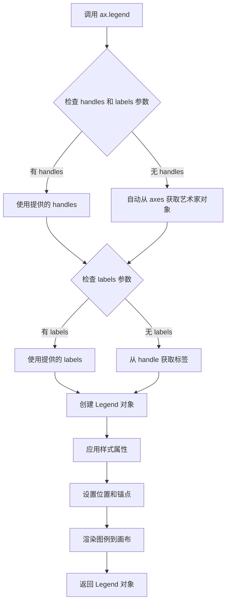

#### 带注释源码

```python
# 以下是 ax.legend 方法的典型调用示例，展示了各种参数的使用方式

# 示例1：基本用法 - 指定句柄和标签
# (l2, l4) 是要显示的图例句柄，('oscillatory', 'damped') 是对应的标签
# loc='upper right' 指定图例位于右上角
# shadow=True 开启阴影效果
ax.legend((l2, l4), ('oscillatory', 'damped'), loc='upper right', shadow=True)

# 示例2：高级布局 - 使用 bbox_to_anchor 精确定位
# bbox_to_anchor=[0, 1] 将图例锚点设置在 axes 的左上角
# ncols=2 使图例内容分成两列
# title="Legend" 设置图例标题
# fancybox=True 使用圆角边框
leg = ax0.legend(loc="upper left", bbox_to_anchor=[0, 1],
                 ncols=2, shadow=True, title="Legend", fancybox=True)

# 示例3：简单用法 - 使用默认参数
# 仅设置阴影和圆角效果，其他参数使用默认值
ax1.legend(shadow=True, fancybox=True)

# 示例4：无参数调用 - 自动从 axes 获取所有带标签的艺术家对象
# 适用于简单场景，自动显示所有已设置 label 的图形
top_ax.legend()

# 示例5：复杂图例 - 多句柄组合与自定义处理器
# [(p1, p3), p2] 将 p1 和 p3 组合为一个图例项
# scatterpoints=1 每个散点图图例只显示1个标记点
# handler_map={tuple: HandlerTuple(ndivide=None)} 自定义元组句柄的处理方式
l = ax1.legend([(p1, p3), p2], ['two keys', 'one key'], scatterpoints=1,
               numpoints=1, handler_map={tuple: HandlerTuple(ndivide=None)})

# 示例6：自定义句柄高度和长度
# handlelength=2.5 设置图例句柄长度为2.5
# handleheight=3 设置图例句柄高度为3
ax.legend([lc], ['multi-line'], handler_map={type(lc): HandlerDashedLines()},
          handlelength=2.5, handleheight=3)
```


### `ax.set_xlabel`

该方法用于设置 Axes 对象的 x 轴标签文本，是 Matplotlib 图表绑定的 Axes 对象的核心方法之一，用于为图表添加可读的 x 轴描述信息。

参数：

- `xlabel`：`str`，x 轴标签的文本内容，本例中传入 `'time'`

返回值：`str` 或 `None`，返回之前的标签文本（如果设置过）或 `None`（取决于 Matplotlib 版本），通常用于链式调用时返回 `self`

#### 流程图

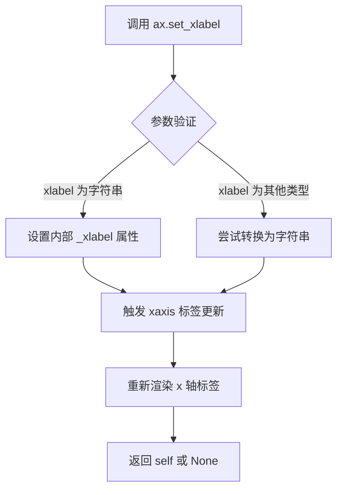

#### 带注释源码

```python
# 在示例代码中的调用方式
ax.set_xlabel('time')

# 对应的 Matplotlib 内部实现逻辑（简化版）
def set_xlabel(self, xlabel, fontdict=None, labelpad=None, **kwargs):
    """
    Set the label for the x-axis.
    
    参数:
        xlabel: 标签文本内容
        fontdict: 可选的字体属性字典
        labelpad: 标签与轴之间的间距
        **kwargs: 其他文本属性（如 fontsize, color 等）
    """
    # 1. 获取 xaxis 对象
    self.xaxis._set_label_text(xlabel, **kwargs)
    
    # 2. 如果指定了 labelpad，设置间距
    if labelpad is not None:
        self.xaxis.labelpad = labelpad
    
    # 3. 返回 self 以支持链式调用（如 ax.set_xlabel('x').set_title('title')）
    return self
```


### `Axes.set_ylabel`

该方法是Matplotlib库中`Axes`类的成员方法，用于设置y轴的标签（y-axis label）。在给定的代码中，调用形式为`ax.set_ylabel('volts')`，用于为图表的y轴添加"volts"（伏特）标签。

参数：

- `ylabel`：`str`，y轴标签的文本内容
- `fontdict`：可选参数，`dict`，用于控制标签的字体属性（如字体大小、颜色等）
- `labelpad`：可选参数，`float`或`None`，指定标签与y轴之间的间距（以点为单位）
- `**kwargs`：可选参数，其他关键字参数，用于传递给`Text`对象的属性设置（如`fontsize`、`color`、`rotation`等）

返回值：`matplotlib.text.Text`，返回创建的文本对象，可用于进一步自定义标签样式

#### 流程图

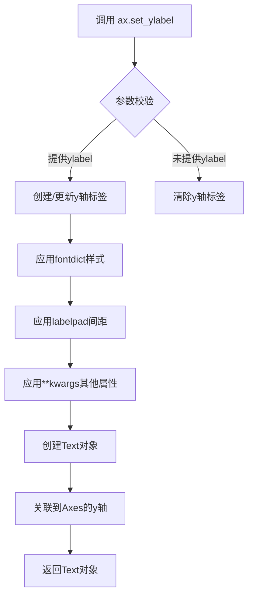

#### 带注释源码

```python
# 在代码中的调用示例（来自主代码文件）
ax.set_ylabel('volts')

# 完整的方法签名（基于Matplotlib库）
# def set_ylabel(self, ylabel, fontdict=None, labelpad=None, **kwargs):

# 参数说明：
# - ylabel: str 类型，要显示的y轴标签文本
# - fontdict: dict 类型（可选），字体属性字典，如 {'fontsize': 12, 'color': 'red'}
# - labelpad: float 类型（可选），标签与坐标轴之间的间距
# - **kwargs: 传递给matplotlib.text.Text的关键字参数

# 返回值：
# - 返回一个matplotlib.text.Text对象，可以对其进行进一步样式设置
#   例如：ylabel_obj = ax.set_ylabel('volts'); ylabel_obj.set_color('blue')

# 该方法内部实现逻辑（简化版）：
# 1. 检查ylabel参数是否为空
# 2. 创建一个Text对象或更新现有的y轴标签
# 3. 应用fontdict中指定的字体属性
# 4. 设置labelpad指定的间距
# 5. 应用**kwargs中的其他样式属性
# 6. 将Text对象与Axes的y轴关联
# 7. 返回创建的Text对象供后续操作
```

---
**注意**：由于`set_ylabel`是Matplotlib库的预定义方法，上述信息基于Matplotlib官方文档和代码中对该方法的调用方式整理而成。该方法不属于当前代码文件定义的范畴，而是对外部库方法的调用。


### `ax.set_title`

设置 Axes 对象的标题文本和样式，是 Matplotlib 中用于为图表添加标题的核心方法，支持多种样式参数配置。

参数：

- `s`：`str`，标题文本内容，如 "Damped oscillation"
- `loc`：`{'center', 'left', 'right'}`，可选，标题对齐方式，默认为 'center'
- `pad`：`float`，可选，标题与 Axes 顶部的距离（以点为单位）
- `**kwargs`：可选，关键字参数，传递给 `matplotlib.text.Text` 对象，用于设置字体大小、颜色、样式等（如 `fontsize=14`, `fontweight='bold'`, `color='red'` 等）

返回值：`matplotlib.text.Text`，返回创建的 Text 对象，可用于后续对标题进行进一步操作（如获取标题文本、设置颜色等）

#### 流程图

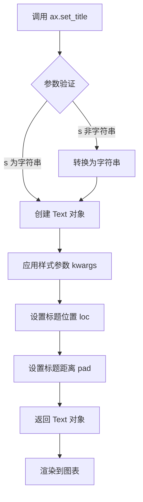

#### 带注释源码

```python
# 在代码中的调用示例
ax.set_title('Damped oscillation')

# 等效的完整调用（包含常用参数）
ax.set_title(
    s='Damped oscillation',      # 标题文本内容
    loc='center',                # 标题对齐方式：居中
    pad=6.0,                     # 标题与轴顶部的距离（点）
    fontsize=12,                 # 字体大小
    fontweight='normal',         # 字体粗细
    color='black',               # 字体颜色
    verticalalignment='center',  # 垂直对齐方式
    horizontalalignment='center' # 水平对齐方式
)
```


### `ax.bar`

这是 Matplotlib 中 Axes 类的条形图绘制方法，用于在坐标轴上创建条形图以可视化类别数据。该方法接受位置参数指定 x 轴位置和条形高度，通过关键字参数自定义条形宽度、颜色、对齐方式、标签等属性，并返回包含条形容器的列表用于后续图例绑定和图形更新。

参数：

- `left`：`list` 或 `array`，条形图的 x 轴位置（代码中使用位置参数，未显式使用 left 关键字）
- `height`：`list` 或 `array`，条形图的高度（代码中使用位置参数，未显式使用 height 关键字）
- `width`：`float`，条形的宽度，默认为 0.8（代码中使用 width=0.4）
- `color`：`str` 或 `color`，条形的填充颜色（代码中使用 color="red"）
- `label`：`str`，图例标签，用于标识该组条形（代码中使用 label="Bar 1"）
- `align`：`str`，条形与指定 x 位置的对其方式，可选 'center' 或 'edge'（代码中使用 align="center"）
- `hatch`：`str`，条形的阴影图案样式（代码中使用 hatch='///'）

返回值：`list` of `BarContainer`，返回包含一个或多个 BarContainer 对象的列表，每个容器管理一组条形对象，用于后续的图例绑定和图形更新。

#### 流程图

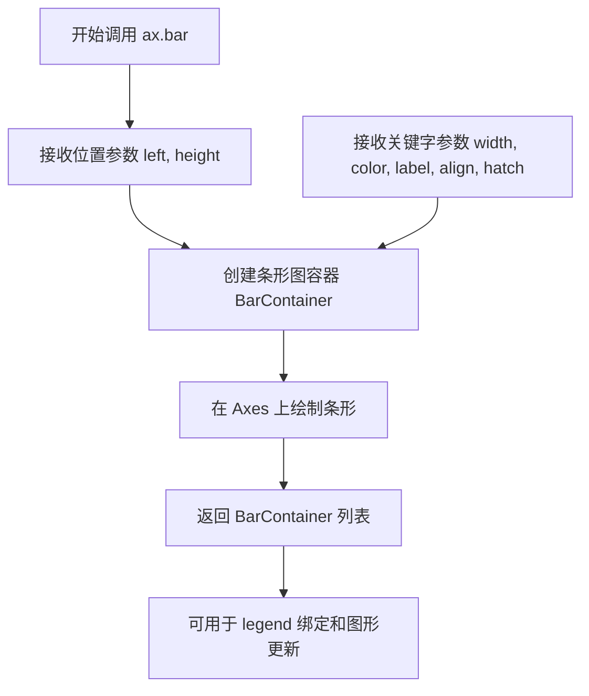

#### 带注释源码

```python
# 示例代码中的 ax.bar 调用
top_ax.bar([0, 1, 2],          # left: 条形的 x 位置列表
           [0.2, 0.3, 0.1],    # height: 条形的高度列表
           width=0.4,          # width: 条形宽度为 0.4
           label="Bar 1",      # label: 图例标签为 "Bar 1"
           align="center")     # align: 条形居中对齐

top_ax.bar([0.5, 1.5, 2.5],    # 另一组条形的 x 位置
           [0.3, 0.2, 0.2],    # 另一组条形的高度
           color="red",        # color: 红色填充
           width=0.4,          # width: 条形宽度为 0.4
           label="Bar 2",      # label: 图例标签为 "Bar 2"
           align="center")     # align: 条形居中对齐

# 带有阴影图案的条形图
rneg = ax2.bar(x_left, y_neg, width=0.5, color='w', hatch='///', label='-1')
# hatch='///' 表示使用斜线阴影图案

rpos = ax2.bar(x_left, y_pos, width=0.5, color='k', label='+1')
# color='k' 表示黑色填充
```


### `ax.errorbar`

在 Matplotlib 中，`ax.errorbar` 是 Axes 类的一个方法，用于绘制带有误差棒的线图或散点图。该方法可以同时绘制数据点和对应的误差范围，支持 x 轴和 y 轴方向的误差棒，并返回用于自定义样式的图形元素句柄。

参数：

- `x`：`array-like`，x 轴数据点
- `y`：`array-like`，y 轴数据点
- `xerr`：`scalar` 或 `array-like`，可选，x 方向的误差值
- `yerr`：`scalar` 或 `array-like`，可选，y 方向的误差值
- `fmt`：`str`，可选，格式字符串，用于指定主数据线的样式（如 's' 表示方形，'o' 表示圆形，'^' 表示三角形）
- `ecolor`：`color`，可选，误差线的颜色
- `elinewidth`：`float`，可选，误差线的线宽
- `capsize`：`float`，可选，误差线端点标记的大小
- `capthick`：`float`，可选，误差线端点标记的厚度
- `label`：`str`，可选，图例标签

返回值：`tuple`，返回一个包含三个元素的元组：
- `linecontainer`：`LineContainer`，主数据线的容器
- `barlines`：`tuple`，包含 (xerr_linecontainer, yerr_linecontainer)
- `caplines`：`tuple`，误差线端点的 Line2D 对象列表

#### 流程图

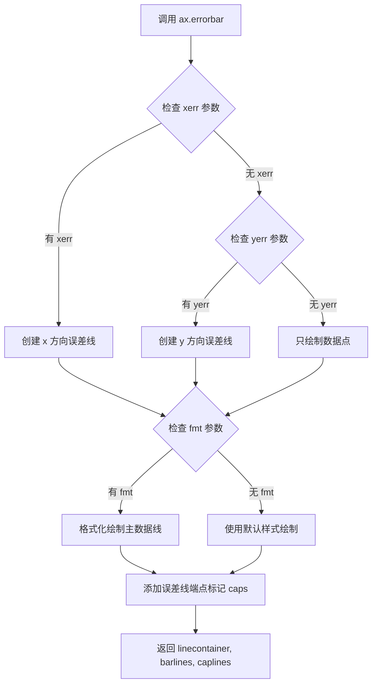

#### 带注释源码

```python
# 代码中 ax.errorbar 的实际调用示例

# 示例 1：只包含 x 方向误差棒
middle_ax.errorbar([0, 1, 2],          # x: x 轴数据点
                   [2, 3, 1],          # y: y 轴数据点
                   xerr=0.4,           # xerr: x 方向误差值
                   fmt="s",            # fmt: 方形标记
                   label="test 1")     # label: 图例标签

# 示例 2：只包含 y 方向误差棒
middle_ax.errorbar([0, 1, 2],          # x: x 轴数据点
                   [3, 2, 4],          # y: y 轴数据点
                   yerr=0.3,           # yerr: y 方向误差值
                   fmt="o",            # fmt: 圆形标记
                   label="test 2")     # label: 图例标签

# 示例 3：同时包含 x 和 y 方向误差棒
middle_ax.errorbar([0, 1, 2],          # x: x 轴数据点
                   [1, 1, 3],          # y: y 轴数据点
                   xerr=0.4,           # xerr: x 方向误差值
                   yerr=0.3,           # yerr: y 方向误差值
                   fmt="^",            # fmt: 三角形标记
                   label="test 3")     # label: 图例标签
```


### `ax.stem`

在给定的代码中，`ax.stem` 被用于绘制茎叶图（stem plot），这是一种用于显示离散数据点的图形，类似于离散时间的信号波形图。每个数据点由一条从基线延伸到数据值的垂直线（stem）和顶部的一个标记（marker）组成。

参数：

- `x`：`array-like`，x轴坐标数据，指定每个数据点的水平位置
- `y`：`array-like`，y轴数据，指定每个数据点的垂直高度
- `linefmt`：`str`，可选，茎线（垂直线）的格式字符串，控制线条颜色、样式
- `markerfmt`：`str`，可选，标记的格式字符串，控制标记的样式
- `basefmt`：`str`，可选，基线的格式字符串
- `bottom`：`float`，可选，基线的y坐标值，默认为0
- `label`：`str`，可选，图例标签，用于标识该数据系列

返回值：`StemContainer`，返回一个包含三个元素的容器对象：
- `markerline`：标记线的 Line2D 对象
- `stemline`：茎线的 Line2D 对象
- `baseline`：基线的 Line2D 对象

#### 流程图

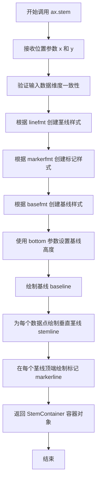

#### 带注释源码

```python
# 在代码中的实际调用示例
bottom_ax.stem([0.3, 1.5, 2.7], [1, 3.6, 2.7], label="stem test")

# 参数说明：
# - 第一个参数 [0.3, 1.5, 2.7] 是 x 坐标数组，表示三个数据点的水平位置
# - 第二个参数 [1, 3.6, 2.7] 是 y 坐标数组，表示三个数据点的垂直高度
# - label="stem test" 设置图例标签为 "stem test"

# 完整方法签名（参考 matplotlib 官方文档）：
# Axes.stem(self, x, y, linefmt=None, markerfmt=None, basefmt=None, bottom=0, label=None, data=None)

# 返回值 StemContainer 是一个容器对象，包含以下属性：
# - markerline: Line2D - 顶部标记的线条对象
# - stemline: LineCollection - 茎线（垂直线）的集合
# - baseline: Line2D - 底部基线的线条对象
# - all_lines: list - 包含上述所有线条的列表
```


### `Axes.scatter`

在给定的代码中，ax.scatter被用于创建散点图来展示数据，特别是用于图例演示中创建多个图例键的场景。该方法是matplotlib.axes.Axes类的核心绘图方法之一，用于在坐标系中绘制散点标记。

参数：

- `x`：`array-like`，X轴坐标数据，指定散点的水平位置
- `y`：`array-like`，Y轴坐标数据，指定散点的垂直位置  
- `c`：`颜色、颜色序列或None`，散点的颜色，可以是单个颜色值或颜色序列
- `marker`：`marker样式字符串或MarkerStyle`，散点的标记形状，如's'表示方形，'o'表示圆形
- `s`：`标量或array-like`，散点的大小，以平方点为单位
- `cmap`：`Colormap或None`，当c为数值数组时使用的颜色映射
- `alpha`：`float或None`，散点的透明度，范围0-1
- `linewidths`：`float或array-like`，标记边缘的线宽
- `edgecolors`：`颜色、颜色序列或'face'或'none'`，标记边缘的颜色
- `norm`：`Normalize实例`，用于归一化颜色数据
- `vmin, vmax`：`float`，当使用norm时颜色映射的最小/最大值

返回值：`PathCollection`，返回一个PathCollection对象，包含所有散点的艺术家对象，可用于图例处理或进一步自定义

#### 流程图

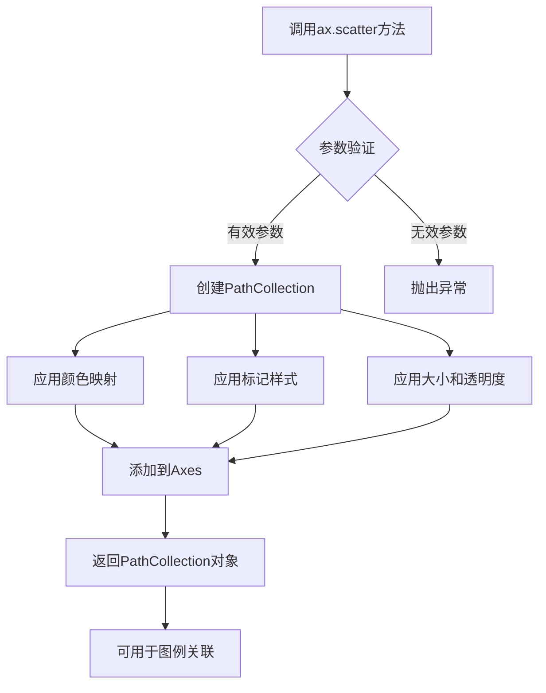

#### 带注释源码

```python
# 代码中的实际调用示例
# 创建两个散点图对象，每个都有不同的颜色和标记
p1 = ax1.scatter([1], [5], c='r', marker='s', s=100)  # 红色方形散点，位置(1,5)，大小100
p2 = ax1.scatter([3], [2], c='b', marker='o', s=100)  # 蓝色圆形散点，位置(3,2)，大小100

# 详细参数说明：
# ax1.scatter(
#     [1],          # x: X坐标数组 [1]
#     [5],          # y: Y坐标数组 [5]  
#     c='r',        # c: 红色 ('r' = red)
#     marker='s',   # marker: 方形标记 ('s' = square)
#     s=100         # s: 大小为100平方点
# )

# 返回的p1和p2是PathCollection对象
# 可以被传递给ax1.legend()用于创建自定义图例项
# 例如将p1和p3组合成一个图例项：
l = ax1.legend([(p1, p3), p2], ['two keys', 'one key'], ...)
```


### `plt.show`

显示所有打开的图形窗口，并进入交互式显示模式。在脚本中调用此函数会阻塞程序执行，直到所有图形窗口关闭（除非设置 `block=False`）。

参数：

- `block`：`bool`，可选，控制是否阻塞程序执行。默认值为 `True`，表示阻塞直到图形窗口关闭；设置为 `False` 时立即返回并继续执行。

返回值：无返回值（`None`）

#### 流程图

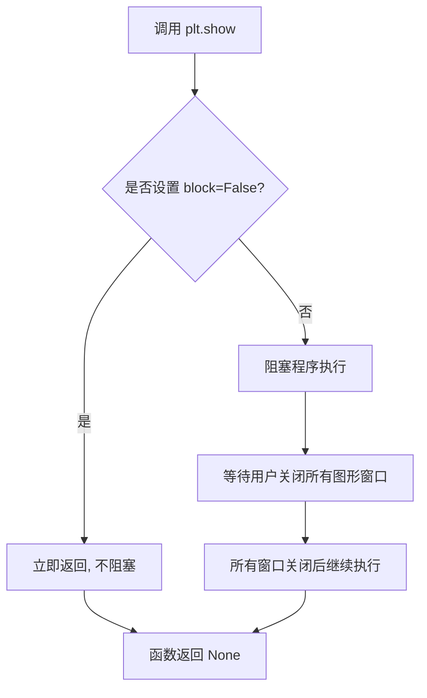

#### 带注释源码

```python
def show(*, block=None):
    """
    显示所有打开的图形窗口。
    
    对于非交互式后端，此函数会确保图形被渲染并显示给用户。
    对于交互式后端，它可能只是将控制权交给事件循环。
    
    参数:
        block (bool, optional): 
            控制是否阻塞程序执行。如果为 True（默认值），
            程序将暂停直到所有图形窗口被关闭。
            如果为 False，函数立即返回。
            在某些后端（如 Qt、Tkinter）中，即使 block=False，
            事件循环也会继续运行，允许图形保持响应。
    
    返回值:
        None
    """
    # 获取当前所有的图形对象
    global _showregistry
    # 遍历所有注册的显示函数并调用它们
    for manager in get_all_fig_managers():
        # 触发图形的绘制和显示
        # 对于大多数后端，这会打开一个窗口并显示内容
        manager.show()
    
    # 处理 block 参数
    # 如果 block 为 None，默认行为取决于后端
    # 对于某些后端（如 Qt），默认可能不阻塞
    if block:
        # 阻塞主线程，等待用户交互
        # 这允许图形保持活跃，用户可以缩放、平移等
        # 直到用户手动关闭所有窗口
        import time
        while any(manager.canvas.figure.number in plt._pylab_helpers.Gcf.destroying
                  for manager in get_all_fig_managers() if manager):
            time.sleep(0.1)
    
    return None
```

#### 在代码中的调用示例

```python
# 第一次调用：显示第一个图形（包含阻尼振荡图例）
fig, ax = plt.subplots()
l1, = ax.plot(t2, np.exp(-t2))
l2, l3 = ax.plot(t2, np.sin(2 * np.pi * t2), '--o', t1, np.log(1 + t1), '.')
l4, = ax.plot(t2, np.exp(-t2) * np.sin(2 * np.pi * t2), 's-.')
ax.legend((l2, l4), ('oscillatory', 'damped'), loc='upper right', shadow=True)
ax.set_xlabel('time')
ax.set_ylabel('volts')
ax.set_title('Damped oscillation')
plt.show()  # <--- 第一次调用

# 第二次调用：显示第二个图形（包含复杂图例标签）
fig, (ax0, ax1) = plt.subplots(2, 1)
# ... 绘图代码 ...
plt.show()  # <--- 第二次调用

# 第三次调用：显示第三个图形（包含条形图、误差线和stem图）
fig, axs = plt.subplots(3, 1, layout="constrained")
# ... 绘图代码 ...
plt.show()  # <--- 第三次调用

# 第四次调用：显示第四个图形（包含复合图例条目）
fig, (ax1, ax2) = plt.subplots(2, 1, layout='constrained')
# ... 绘图代码 ...
plt.show()  # <--- 第四次调用

# 第五次调用：显示最后一个图形（使用自定义HandlerDashedLines）
fig, ax = plt.subplots()
# ... 绘图代码 ...
plt.show()  # <--- 第五次调用
```


### HandlerTuple

`HandlerTuple` 是 Matplotlib 图例处理器的基类，用于自定义图例中多个句柄（handles）的渲染方式。在给定的代码中，它被用于将多个图例键（legend keys）组合成单个图例条目，支持自定义分隔和排列方式。

参数：

- `ndivide`：`int` 或 `None`，指定图例键之间的垂直分隔数量。`None`表示使用默认值
- `pad`：`float`，图例键之间的间距（以字体大小为单位）
- `fontsize`：图例项的字体大小

返回值：返回 `HandlerTuple` 实例，用于图例处理映射

#### 流程图

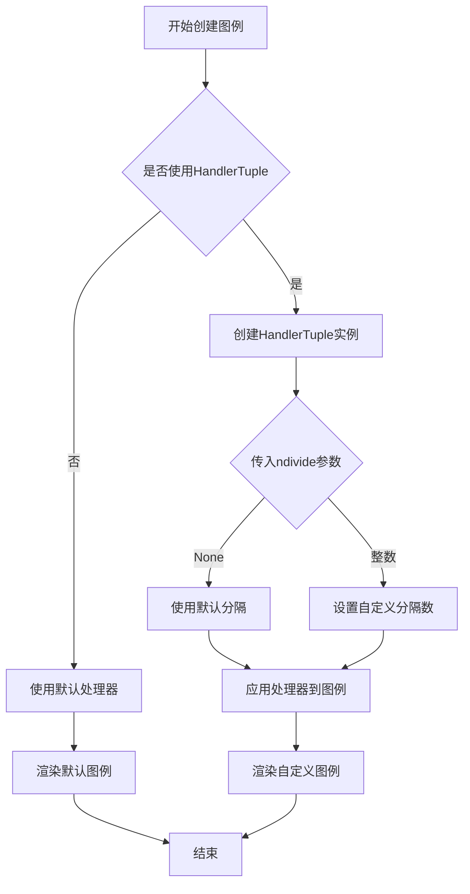

#### 带注释源码

```python
# 在代码中的使用示例 1：将多个句柄组合成单个图例条目
l = ax1.legend(
    [(p1, p3), p2],                  # 图例句柄列表，元组表示组合多个键
    ['two keys', 'one key'],         # 图例标签
    scatterpoints=1,                # 散点图中每个句柄显示的点数
    numpoints=1,                     # 线条端点显示的点数
    handler_map={tuple: HandlerTuple(ndivide=None)}  # 使用HandlerTuple处理元组
)

# 在代码中的使用示例 2：不同的padding设置
l = ax2.legend(
    [(rpos, rneg), (rneg, rpos)],   # 多个元组句柄
    ['pad!=0', 'pad=0'],             # 对应标签
    handler_map={
        (rpos, rneg): HandlerTuple(ndivide=None),      # 无分隔
        (rneg, rpos): HandlerTuple(ndivide=None, pad=0.) # 无间距
    }
)
```

#### 详细说明

| 属性 | 说明 |
|------|------|
| 类名 | HandlerTuple |
| 所属模块 | matplotlib.legend_handler |
| 功能 | 将多个图例句柄（handles）组合成单个图例条目 |
| 继承自 | HandlerBase |

**典型用途：**
- 将散点图和线条图组合为单一图例项
- 为同一图例条目指定多个图标（键）
- 自定义多个图例键之间的间距和排列

**技术债务与优化空间：**
1. 当前代码使用元组作为handler_map的键，可能导致类型匹配问题
2. HandlerTuple的内部实现未在此代码中展示，依赖Matplotlib库内部实现
3. 可以考虑将重复的handler_map配置提取为常量或配置对象


### HandlerLineCollection

HandlerLineCollection 是 Matplotlib 图例处理模块中的一个类，用于处理 LineCollection（线条集合）类型的图例项。它是 HandlerLineCollection 的基类，提供了自定义线条集合在图例中如何渲染的默认实现。在代码中，HandlerDashedLines 类继承自此类，以自定义具有不同线型的线条集合在图例中的显示方式。

参数：

- `legend`：matplotlib.legend.Legend，图例对象，包含图例的位置和样式信息
- `orig_handle`：matplotlib.collections.LineCollection，要为其创建图例项的原始线条集合对象
- `xdescent`：int，图例标记的水平偏移量
- `ydescent`：int，图例标记的垂直偏移量
- `width`：int，图例标记的宽度
- `height`：int，图例标记的高度
- `fontsize`：int，图例文本的字体大小
- `trans`：matplotlib.transforms.Transform，用于坐标变换的变换对象

返回值：`list`，返回创建的艺术家对象列表（Line2D 对象列表），用于在图例中显示

#### 流程图

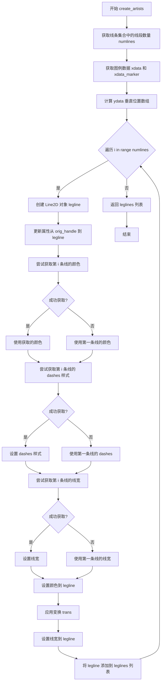

#### 带注释源码

```python
class HandlerDashedLines(HandlerLineCollection):
    """
    Custom Handler for LineCollection instances.
    """
    def create_artists(self, legend, orig_handle,
                       xdescent, ydescent, width, height, fontsize, trans):
        """
        创建用于图例的艺术家对象（线条）。
        
        参数:
            legend: 图例对象
            orig_handle: 原始的 LineCollection 对象
            xdescent: 水平偏移量
            ydescent: 垂直偏移量
            width: 图例标记宽度
            height: 图例标记高度
            fontsize: 字体大小
            trans: 变换对象
        
        返回:
            Line2D 对象列表
        """
        # 计算线条集合中有多少条线
        numlines = len(orig_handle.get_segments())
        
        # 获取图例的数据坐标
        xdata, xdata_marker = self.get_xdata(legend, xdescent, ydescent,
                                             width, height, fontsize)
        leglines = []
        
        # 计算垂直空间，将图例标记区域等分给每条线
        # 创建与 xdata 相同形状的 ydata，填充高度/（线条数+1）
        ydata = np.full_like(xdata, height / (numlines + 1))
        
        # 遍历每条线，为每条线创建对应的图例线条
        for i in range(numlines):
            # 创建 Line2D 对象，计算 y 坐标位置
            legline = Line2D(xdata, ydata * (numlines - i) - ydescent)
            
            # 从原始句柄更新属性（颜色、线宽等）到新创建的线条
            self.update_prop(legline, orig_handle, legend)
            
            # 尝试获取第 i 条线的颜色
            try:
                color = orig_handle.get_colors()[i]
            except IndexError:
                # 如果索引超出范围，使用第一条线的颜色
                color = orig_handle.get_colors()[0]
            
            # 尝试获取第 i 条线的 dashes 样式
            try:
                dashes = orig_handle.get_dashes()[i]
            except IndexError:
                dashes = orig_handle.get_dashes()[0]
            
            # 尝试获取第 i 条线的线宽
            try:
                lw = orig_handle.get_linewidths()[i]
            except IndexError:
                lw = orig_handle.get_linewidths()[0]
            
            # 如果 dashes 有间隔信息，设置到线条上
            if dashes[1] is not None:
                legline.set_dashes(dashes[1])
            
            # 设置颜色
            legline.set_color(color)
            
            # 应用变换
            legline.set_transform(trans)
            
            # 设置线宽
            legline.set_linewidth(lw)
            
            # 添加到列表
            leglines.append(legline)
        
        return leglines
```


### HandlerDashedLines.create_artists

该方法是`HandlerDashedLines`类的核心方法，用于为`LineCollection`实例创建自定义的图例条目。它通过遍历原始`LineCollection`中的所有线段，根据线段数量在垂直方向上平分空间，为每条线段创建对应的`Line2D`图例线条，并设置相应的颜色、线型（dash pattern）和线宽，从而实现对多线条集合的自定义图例渲染。

参数：

- `self`：`HandlerDashedLines`实例，自定义图例处理器本身
- `legend`：`matplotlib.legend.Legend`对象，目标图例实例，用于获取图例属性和更新线条属性
- `orig_handle`：`matplotlib.collections.LineCollection`对象，原始的线条集合句柄，包含待渲染的线条信息（颜色、线型、线宽等）
- `xdescent`：浮点数，x方向上的偏移量，表示图例框左侧向外的延伸距离
- `ydescent`：浮点数，y方向上的偏移量，表示图例框底部向下的延伸距离
- `width`：浮点数，图例框的有效宽度
- `height`：浮点数，图例框的有效高度
- `fontsize`：整数，文本字体大小
- `trans`：`matplotlib.transforms.Transform`对象，用于将数据坐标转换为显示坐标的变换对象

返回值：`list[Line2D]`，返回创建的`Line2D`图例线条对象列表

#### 流程图

```mermaid
flowchart TD
    A[开始创建图例线条] --> B[获取orig_handle中的线段数量numlines]
    B --> C[调用get_xdata获取x轴数据xdata和xdata_marker]
    C --> D[计算y轴数据ydata<br/>y = height / (numlines + 1)]
    D --> E{遍历 i in range(numlines)}
    E -->|是| F[创建Line2D对象legline<br/>xdata, ydata*(numlines-i)-ydescent]
    F --> G[调用update_prop更新legline属性]
    G --> H{尝试获取第i个颜色}
    H -->|成功| I[color = orig_handle.get_colors()[i]]
    H -->|失败| J[color = orig_handle.get_colors()[0]
    J --> K{尝试获取第i个线型}
    K -->|成功| L[dashes = orig_handle.get_dashes()[i]]
    K -->|失败| M[dashes = orig_handle.get_dashes()[0]
    M --> N{尝试获取第i个线宽]
    N -->|成功| O[lw = orig_handle.get_linewidths()[i]]
    N -->|失败| P[lw = orig_handle.get_linewidths()[0]
    O --> Q{检查dashes[1]是否非None]
    Q -->|是| R[调用set_dashes设置线型]
    Q -->|否| S[跳过设置线型]
    R --> T[调用set_color设置颜色]
    S --> U[调用set_transform设置变换]
    U --> V[调用set_linewidth设置线宽]
    V --> W[将legline添加到leglines列表]
    W --> E
    E -->|否| X[返回leglines列表]
```

#### 带注释源码

```python
def create_artists(self, legend, orig_handle,
                   xdescent, ydescent, width, height, fontsize, trans):
    """
    为LineCollection创建自定义图例线条。
    
    参数:
        legend: 图例对象
        orig_handle: LineCollection实例
        xdescent: x方向偏移
        ydescent: y方向偏移
        width: 图例宽度
        height: 图例高度
        fontsize: 字体大小
        trans: 坐标变换对象
    """
    # 获取LineCollection中的线段数量
    numlines = len(orig_handle.get_segments())
    
    # 获取图例的x轴数据，用于确定线条的水平和垂直位置
    # 返回两个值：xdata（线条的x坐标）和xdata_marker（标记的x坐标）
    xdata, xdata_marker = self.get_xdata(legend, xdescent, ydescent,
                                         width, height, fontsize)
    
    # 初始化图例线条列表
    leglines = []
    
    # 计算y轴数据：根据线段数量将垂直空间等分
    # 使用np.full_like创建与xdata形状相同的数组，值为height/(numlines+1)
    # 这样每条线将占据相等的垂直空间
    ydata = np.full_like(xdata, height / (numlines + 1))
    
    # 遍历每一条线，创建对应的图例线条
    for i in range(numlines):
        # 计算当前线条的y坐标：基础高度 * (numlines - i) - ydescent
        # 从上到下依次排列各条线条
        legline = Line2D(xdata, ydata * (numlines - i) - ydescent)
        
        # 从原始LineCollection更新属性（颜色、线型等）到新创建的线条
        self.update_prop(legline, orig_handle, legend)
        
        # --- 设置颜色 ---
        try:
            # 尝试获取第i个颜色
            color = orig_handle.get_colors()[i]
        except IndexError:
            # 如果索引超出范围，使用第一个颜色作为后备
            color = orig_handle.get_colors()[0]
        
        # --- 设置线型（Dashes） ---
        try:
            # 尝试获取第i个线型设置
            dashes = orig_handle.get_dashes()[i]
        except IndexError:
            # 如果索引超出范围，使用第一个线型作为后备
            dashes = orig_handle.get_dashes()[0]
        
        # --- 设置线宽 ---
        try:
            # 尝试获取第i个线宽
            lw = orig_handle.get_linewidths()[i]
        except IndexError:
            # 如果索引超出范围，使用第一个线宽作为后备
            lw = orig_handle.get_linewidths()[0]
        
        # 如果线型中有自定义的dash模式（dashes[1]不为None），则应用到图例线条
        if dashes[1] is not None:
            legline.set_dashes(dashes[1])
        
        # 应用颜色到图例线条
        legline.set_color(color)
        
        # 应用坐标变换
        legline.set_transform(trans)
        
        # 应用线宽
        legline.set_linewidth(lw)
        
        # 将创建的图例线条添加到列表中
        leglines.append(legline)
    
    # 返回所有创建的图例线条
    return leglines
```

## 关键组件


### Matplotlib 图例（Legend）系统

Matplotlib 的图例系统用于为图表中的可视化元素提供说明和标识，是数据可视化的重要组成部分。

### ax.legend() 图例创建方法

用于在 Axes 上创建图例，支持位置、对齐方式、阴影、边框样式等自定义配置。

### HandlerLineCollection

Matplotlib 内置的图例处理器，用于处理 LineCollection 类型的图形对象，将其转换为图例项。

### HandlerTuple

用于处理多个图例键（handle）组合成单一图例条目的处理器，支持将多个图形元素组合显示。

### HandlerDashedLines 自定义图例类

继承自 HandlerLineCollection 的自定义处理器，用于为 LineCollection 创建具有虚线样式的图例条目，支持获取线段数量、颜色、虚线模式和线宽。

### Line2D 二维线条对象

表示二维线条的图形对象，用于在图例中创建代理线条，支持坐标、颜色、线型、线宽等属性设置。

### plt.subplots() 图形窗口创建

用于创建包含一个或多个子图的图形窗口和 Axes 对象，是 Matplotlib 绑制的基础。

### 多种绘图函数

包括 plot（折线图）、bar（柱状图）、errorbar（误差棒图）、stem（茎叶图）、scatter（散点图）等，用于创建不同类型的可视化图形。

### 图形属性配置

包括 rcParams 全局参数设置、颜色映射、线型设置、对齐方式等，用于控制图表的视觉外观。

### bbox_to_anchor 图例定位

用于将图例放置在 Axes 外部的指定位置，支持灵活的定位和布局控制。

### ncols/nrows 图例列/行数设置

用于控制图例中多列或多行的排列方式，实现更紧凑的布局显示。


## 问题及建议


### 已知问题

-   **Magic Numbers 遍布**：代码中大量使用未解释的数值如 `0.1`, `0.01`, `0.4`, `0.5`, `100`, `2.5`, `3` 等，缺乏常量定义，降低了可维护性
-   **变量命名不清晰**：使用 `t1`, `t2`, `l1`, `l2`, `l3`, `l4`, `x`, `x_left`, `xdata` 等简短且无描述性的命名，影响代码可读性
-   **代码重复**：多处重复设置 `legend()` 参数（如 `shadow=True`, `fancybox=True`），以及相似模式的 subplot 创建和配置
-   **类定义位置不当**：`HandlerDashedLines` 自定义类定义在代码中间（最后一个 `# %%` 块），而不是文件开头或专门的模块中
-   **缺少类型注解**：所有函数和方法均无类型提示（type hints），不利于静态分析和 IDE 支持
-   **硬编码颜色和样式**：颜色数组、线型样式等直接硬编码在代码中，不利于配置管理
-   **无错误处理**：代码未包含任何异常处理机制（如 try-except）
-   **数据重复计算**：`np.exp(-t2)` 在同一段代码中被多次计算
-   **注释不规范**：`# note that plot returns a list of lines...` 这种解释性注释应放在文档字符串中

### 优化建议

-   **提取配置常量**：将 magic numbers 提取为命名常量或配置文件，如 `FIGURE_SIZE`, `DEFAULT_WIDTH`, `COLOR_PALETTE` 等
-   **改进命名**：使用描述性变量名，如 `time_data` 代替 `t1`，`damping_factor` 代替 `0.1` 等
-   **抽象重复代码**：创建辅助函数如 `create_legend_with_style()` 来封装重复的图例配置逻辑
-   **重新组织类定义**：将 `HandlerDashedLines` 类移至文件开头或单独的模块
-   **添加类型注解**：为函数参数和返回值添加类型提示
-   **使用配置对象**：定义颜色主题、样式配置字典，便于统一修改
-   **缓存计算结果**：对于重复使用的计算结果（如 `np.exp(-t2)`），预先计算并缓存
-   **添加文档字符串**：为关键代码块和函数添加规范的文档字符串，说明参数、返回值和用途
-   **考虑参数化**：将可变的绘图参数提取为函数参数，提高代码的通用性和可测试性


## 其它


### 设计目标与约束

本代码旨在演示Matplotlib中图例（Legend）的多种创建和自定义方式，包括基础图例、复杂标签图例、条形图图例、散点图图例以及自定义图例处理器。代码运行于Python 3.x环境，需安装matplotlib和numpy库。性能约束方面，图形渲染依赖于matplotlib的后端实现，数据点数量应控制在合理范围内以保证渲染效率。

### 错误处理与异常设计

代码主要使用Matplotlib的异常处理机制。当绘制数据为空或格式不当时，matplotlib会自动忽略或给出警告。自定义类HandlerDashedLines中的异常处理包括：索引越界时使用默认颜色、虚线样式和线宽，确保图例渲染的鲁棒性。代码未显式抛出自定义异常，依赖matplotlib本身的错误处理。

### 数据流与状态机

代码数据流主要包括：1）数值数据生成（np.arange, np.linspace生成时间序列和函数值）；2）图形对象创建（ax.plot, ax.bar, ax.scatter创建线条、柱状、散点图形）；3）图例绑定（ax.legend创建图例并关联图形句柄）；4）图形显示（plt.show渲染最终图像）。状态机转换：数据准备 → 图形创建 → 图例配置 → 渲染显示。

### 外部依赖与接口契约

主要外部依赖包括：matplotlib.pyplot（图形创建）、matplotlib.collections（LineCollection类）、matplotlib.legend_handler（HandlerLineCollection, HandlerTuple）、matplotlib.lines（Line2D）、numpy（数值计算）。接口契约：ax.plot()返回Line2D列表；ax.legend()接受句柄列表和标签列表，返回Legend对象；自定义Handler需实现create_artists方法。

### 性能考虑

代码中数据点数量较少（t1约20点，t2约200点，x约50点），性能无明显瓶颈。大量数据时可考虑：1）降采样处理；2）使用set_data而非重新创建图形对象；3）关闭交互式显示，批量保存图像。

### 可维护性与扩展性

代码采用面向对象方式，自定义HandlerDashedLines类继承自HandlerLineCollection，便于扩展新的图例样式。模块化程度较高，每组示例相互独立。可扩展方向：1）添加更多图例处理器类型；2）支持动态图例更新；3）集成到GUI应用中。

### 测试建议

建议添加单元测试验证：1）图例正确绑定到对应图形；2）自定义处理器正确渲染LineCollection；3）不同图形类型的图例显示正确；4）图形保存功能正常。

### 安全考虑

代码为演示脚本，无用户输入，无安全风险。生产环境中需注意：1）避免将未验证的数据直接传入绘图函数；2）大规模数据渲染时考虑内存限制；3）自定义样式需验证跨版本兼容性。

    