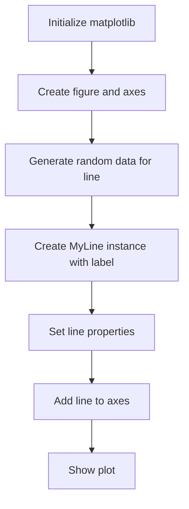
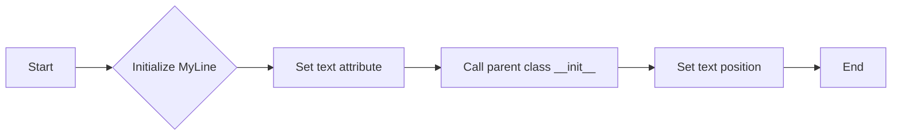
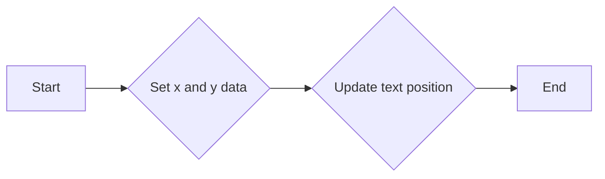
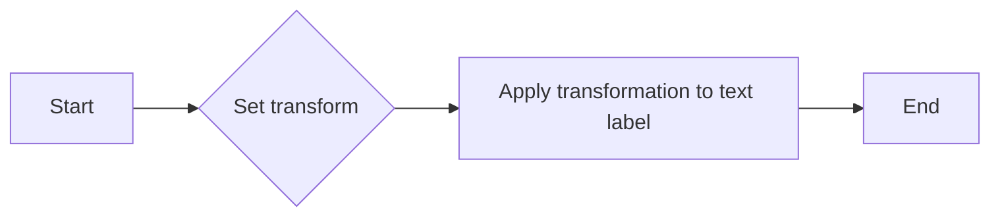
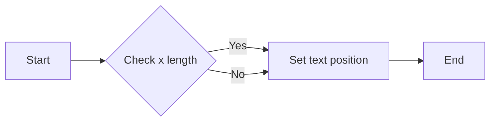
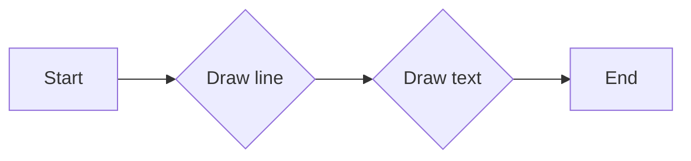

# `matplotlib\galleries\examples\text_labels_and_annotations\line_with_text.py` 详细设计文档

This code defines a custom line object in matplotlib that can display a label at its end, allowing for artist objects to contain additional text annotations.

## 整体流程



## 类结构

```
MyLine (Custom Line class)
```

## 全局变量及字段


### `text`
    
The text label associated with the line.

类型：`matplotlib.text.Text`
    


### `MyLine.text`
    
The text label associated with the line.

类型：`matplotlib.text.Text`
    
    

## 全局函数及方法


### MyLine.__init__

This method initializes a `MyLine` object, which is a subclass of `matplotlib.lines.Line2D`. It sets up the line with additional text labeling capabilities.

参数：

- `*args`：`tuple`，Positional arguments passed to the parent class `Line2D`.
- `**kwargs`：`dict`，Keyword arguments passed to the parent class `Line2D`.

返回值：`None`，This method does not return a value.

#### 流程图



#### 带注释源码

```python
def __init__(self, *args, **kwargs):
    # we'll update the position when the line data is set
    self.text = mtext.Text(0, 0, '')
    super().__init__(*args, **kwargs)

    # we can't access the label attr until *after* the line is
    # initiated
    self.text.set_text(self.get_label())
```


### MyLine.set_figure

`MyLine.set_figure` 方法用于设置 MyLine 对象的文本标签（Text 实例）的图形对象（Figure）。

参数：

- `figure`：`matplotlib.figure.Figure`，图形对象，用于设置文本标签的图形上下文。

返回值：无

#### 流程图

```mermaid
graph LR
A[MyLine.set_figure] --> B{参数：figure}
B --> C[设置 Text 的 figure]
C --> D[调用 super().set_figure(figure)]
```

#### 带注释源码

```python
def set_figure(self, figure):
    self.text.set_figure(figure)  # 设置文本标签的图形对象
    super().set_figure(figure)  # 调用父类的 set_figure 方法
```


### MyLine.set_data

This method sets the data for the MyLine object, which includes the x and y coordinates of the line. It also updates the position of the text label attached to the line.

参数：

- `x`：`numpy.ndarray`，The x coordinates of the line.
- `y`：`numpy.ndarray`，The y coordinates of the line.

返回值：`None`，This method does not return any value.

#### 流程图



#### 带注释源码

```python
def set_data(self, x, y):
    # Set the data for the line
    if len(x):
        self.text.set_position((x[-1], y[-1]))

    # Call the superclass method to set the data
    super().set_data(x, y)
```


### MyLine.set_transform

This method sets the transformation for the text label of the MyLine object.

参数：

- `transform`：`matplotlib.transforms.Transform`，The transformation to apply to the text label.

返回值：`None`，No value is returned.

#### 流程图



#### 带注释源码

```python
def set_transform(self, transform):
    # 2 pixel offset
    texttrans = transform + mtransforms.Affine2D().translate(2, 2)
    self.text.set_transform(texttrans)
    super().set_transform(transform)
```


### MyLine.set_data

This method updates the data of the MyLine instance, which includes the x and y coordinates of the line.

参数：

- `x`：`numpy.ndarray`，The x coordinates of the line data.
- `y`：`numpy.ndarray`，The y coordinates of the line data.

返回值：`None`，This method does not return any value.

#### 流程图



#### 带注释源码

```python
def set_data(self, x, y):
    # Check if x has elements
    if len(x):
        # Set the position of the text to the last point of the line
        self.text.set_position((x[-1], y[-1]))

    # Call the superclass method to update the line data
    super().set_data(x, y)
```


### MyLine.draw

This method draws the label text at the end of the line with a 2 pixel offset.

参数：

- `renderer`：`matplotlib.backends.backend_agg.FigureCanvasAgg.FigureCanvasAgg`，The renderer object used to draw the figure.

返回值：`None`，This method does not return any value.

#### 流程图



#### 带注释源码

```python
def draw(self, renderer):
    # draw my label at the end of the line with 2 pixel offset
    super().draw(renderer)
    self.text.draw(renderer)
```


## 关键组件


### 张量索引与惰性加载

张量索引与惰性加载是深度学习框架中用于高效处理大型数据集的关键技术。它允许在需要时才计算数据，从而减少内存消耗和提高计算效率。

### 反量化支持

反量化支持是深度学习模型优化中的一个重要特性，它允许模型在量化过程中保持较高的精度，从而在降低模型大小和计算量的同时，保持模型性能。

### 量化策略

量化策略是深度学习模型压缩技术的一部分，它通过将模型中的浮点数参数转换为低精度整数来减少模型大小和计算量，同时尽量保持模型性能。常见的量化策略包括全局量化、局部量化等。


## 问题及建议


### 已知问题

-   **代码复用性低**：`MyLine` 类继承自 `matplotlib.lines.Line2D`，但大部分方法都是重写以添加文本标签功能。这种情况下，可以考虑使用继承和组合来提高代码复用性。
-   **全局变量和函数的使用**：代码中使用了全局变量和函数，如 `np.random.seed` 和 `plt.subplots`，这可能导致代码难以维护和理解。
-   **异常处理**：代码中没有显示异常处理机制，如果出现错误，可能会导致程序崩溃。

### 优化建议

-   **提高代码复用性**：考虑使用组合而非继承，创建一个新的类来封装文本标签，并在需要时将其与线条组合。
-   **减少全局变量和函数的使用**：将全局变量和函数封装在类中，或者使用参数传递的方式，以减少全局状态的使用。
-   **添加异常处理**：在代码中添加异常处理机制，以捕获和处理可能出现的错误。
-   **代码注释和文档**：添加更多的代码注释和文档，以提高代码的可读性和可维护性。
-   **单元测试**：编写单元测试来验证代码的功能，确保代码的稳定性和可靠性。
-   **性能优化**：考虑性能优化，例如减少不必要的计算和内存使用。


## 其它


### 设计目标与约束

- 设计目标：实现一个自定义的线对象，该对象可以在其末端包含一个文本标签。
- 约束条件：必须使用matplotlib库中的Line2D类作为基础，并扩展其功能以包含文本标签。

### 错误处理与异常设计

- 错误处理：确保在设置数据或转换时，如果传入的参数类型不正确，将抛出适当的异常。
- 异常设计：定义自定义异常类，以提供更具体的错误信息。

### 数据流与状态机

- 数据流：数据从matplotlib的Line2D类传入，经过自定义的MyLine类处理，并最终绘制到图上。
- 状态机：MyLine类没有明确的状态机，但它的方法（如set_data和set_transform）会影响对象的内部状态。

### 外部依赖与接口契约

- 外部依赖：依赖于matplotlib库中的Line2D、Text和transforms模块。
- 接口契约：MyLine类提供了一个接口，允许用户设置数据、转换和属性，如颜色和字体大小。


    