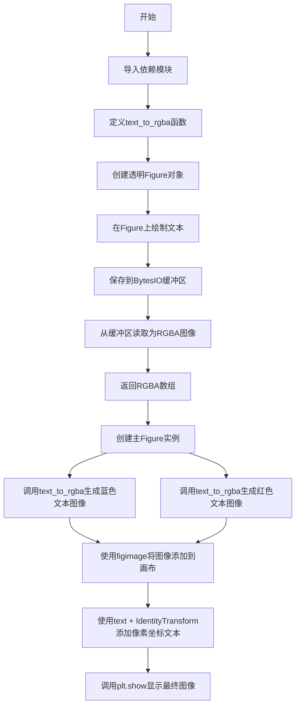

# `matplotlib\galleries\examples\text_labels_and_annotations\mathtext_asarray.py` 详细设计文档

该代码演示了如何使用matplotlib将文本字符串转换为RGBA图像，并通过figimage和text方法将文本图像或原始文本绘制到Figure画布上，支持像素级定位和自定义样式。

## 整体流程



## 类结构

```
模块级
├── text_to_rgba (函数)
├── fig (全局变量 - Figure实例)
├── rgba1 (全局变量 - RGBA图像数组)
└── rgba2 (全局变量 - RGBA图像数组)
```

## 全局变量及字段


### `fig`
    
主画布实例，用于承载所有文本和图像

类型：`matplotlib.figure.Figure`
    


### `rgba1`
    
蓝色文本'IQ: $\sigma_i=15$'对应的RGBA图像数组

类型：`numpy.ndarray`
    


### `rgba2`
    
红色文本'some other string'对应的RGBA图像数组

类型：`numpy.ndarray`
    


    

## 全局函数及方法


### `text_to_rgba`

该函数是文本转图像的核心转换工具，通过在透明Matplotlib Figure画布上渲染文本，并利用内存缓冲区导出为PNG格式，最后解码为RGBA像素数组返回，实现从字符串到图像数据的完整转换链路。

参数：

- `s`：`str`，要转换为图像的文本字符串，支持LaTeX数学公式等
- `dpi`：`int`，图像的分辨率（每英寸点数），直接影响输出图像的清晰度和尺寸
- `**kwargs`：`Any`，其他关键字参数，将透传给`matplotlib.figure.Figure.text()`方法，用于控制文本样式（如color、fontsize等）

返回值：`numpy.ndarray`，返回形状为(H, W, 4)的RGBA图像数组，其中H为图像高度，W为图像宽度，4通道分别为红、绿、蓝、透明度

#### 流程图

```mermaid
flowchart TD
    A[接收文本字符串s] --> B{设置dpi分辨率}
    B --> C[创建无背景色Figure对象]
    C --> D[调用fig.text在(0,0)位置绘制文本s]
    D --> E[创建BytesIO内存缓冲区]
    E --> F[调用fig.savefig保存为PNG格式到缓冲区]
    F --> G[bbox_inches='tight', pad_inches=0裁剪边界]
    G --> H[缓冲区seek到起始位置]
    H --> I[plt.imread读取为RGBA数组]
    I --> J[返回numpy数组]
    
    style A fill:#e1f5fe
    style J fill:#e8f5e8
```

#### 带注释源码

```python
def text_to_rgba(s, *, dpi, **kwargs):
    """
    将文本字符串转换为RGBA图像数组
    
    参数:
        s: 要转换的文本字符串
        dpi: 输出图像的分辨率
        **kwargs: 传递给fig.text的样式参数
    """
    # 步骤1: 创建无背景色（透明）的Figure画布
    # facecolor="none"确保生成的图像背景透明
    fig = Figure(facecolor="none")
    
    # 步骤2: 在Figure左下角(0,0)位置绘制文本
    # 文本内容为s，其他样式参数通过kwargs传递
    fig.text(0, 0, s, **kwargs)
    
    # 步骤3: 将Figure保存到内存缓冲区
    # - BytesIO()创建内存缓冲区，避免磁盘IO
    # - format="png"指定PNG格式以支持透明度
    # - bbox_inches="tight"自动裁剪到文本边界
    # - pad_inches=0移除额外空白边距
    with BytesIO() as buf:
        fig.savefig(buf, dpi=dpi, format="png", 
                    bbox_inches="tight", pad_inches=0)
        # 缓冲区指针回到起始位置
        buf.seek(0)
        # 步骤4: 使用matplotlib读取图像为RGBA数组
        rgba = plt.imread(buf)
    
    # 返回RGBA图像数组
    return rgba
```

## 关键组件


### text_to_rgba 函数

将文本字符串转换为 RGBA 图像的核心函数，通过在透明 Figure 上绘制文本并保存到内存缓冲区实现转换

### Figure 对象

matplotlib 图形容器，用于承载文本绘制，配置为透明背景以支持图像输出

### BytesIO 缓冲区

内存中的二进制流，用于临时存储生成的 PNG 图像数据，实现无文件IO的图像处理

### figimage 方法

Figure 的 figimage 方法，用于将 RGBA 数组直接绘制到画布指定像素位置

### IdentityTransform 变换

matplotlib 坐标变换类，用于将文本定位转换为屏幕像素坐标系统

### RGBA 图像数组

四通道图像数据（红、绿、蓝、透明度），作为文本转图像的最终输出格式


## 问题及建议


### 已知问题

-   **全局状态污染**：模块级别的 `fig = plt.figure()` 和 `plt.show()` 在导入模块时即执行，可能在某些环境（如Jupyter notebook、多线程环境）中导致意外行为或状态冲突
-   **缺少参数验证**：函数 `text_to_rgba` 未对输入参数进行校验，`s` 为空字符串、`dpi` 为非正值或 `kwargs` 包含无效参数时可能产生异常或不可预期结果
-   **资源未显式释放**：`Figure` 对象未显式关闭，在频繁调用场景下可能导致内存泄漏或资源占用累积
-   **硬编码格式依赖**：仅支持 PNG 格式输出，缺少格式参数化和扩展性
-   **错误处理缺失**：无 try-except 保护，文件操作（BytesIO）和图像读取失败时程序直接崩溃
-   **代码可测试性差**：顶层代码（示例部分）与核心函数耦合，未提供独立的调用入口

### 优化建议

-   **增加参数验证**：在 `text_to_rgba` 函数开头添加参数校验逻辑，确保 `s` 为非空字符串、`dpi` 为正数、`kwargs` 中的参数合法
-   **引入异常处理**：用 try-except 包裹文件操作和图像读取逻辑，捕获可能的 IOError、ValueError 等异常并给出明确错误信息
-   **提供上下文管理器支持**：实现 `__enter__` 和 `__exit__` 方法或使用 contextlib，确保 Figure 对象在使用后被正确关闭
-   **支持格式参数化**：添加 `format` 参数，允许调用者指定输出格式（如 'png', 'jpeg', 'svg'），默认值保持为 'png'
-   **示例与核心逻辑分离**：将示例代码放入 `if __name__ == "__main__":` 块中，防止模块被导入时执行示例代码
-   **考虑缓存优化**：对于相同文本和参数的重复调用，可引入缓存机制（如 functools.lru_cache）提升性能
-   **返回值增强**：可考虑返回更多元信息（如图像尺寸、Figure对象引用），便于调用者进行后续处理


## 其它


### 设计目标与约束

本模块的核心设计目标是将任意文本字符串转换为RGBA图像数组，支持自定义字体大小、颜色和DPI分辨率。主要约束包括：依赖matplotlib库进行渲染，必须在有图形界面的环境中运行或配置合适的matplotlib后端，生成的图像使用PNG格式进行内存缓冲区传输，返回的RGBA数组维度需与渲染文本的实际边界框匹配。

### 错误处理与异常设计

text_to_rgba函数的错误处理设计如下：1）当s参数不是字符串类型时，matplotlib.figure.Figure.text方法会抛出TypeError；2）当dpi参数为非正数时，Figure.savefig会抛出ValueError；3）当系统内存不足导致BytesIO缓冲区分配失败时，会抛出MemoryError；4）当matplotlib未正确安装或后端配置错误时，导入阶段会抛出ImportError。建议调用方对输入参数进行预验证，确保s为字符串且dpi为正整数。

### 数据流与状态机

数据流处理流程为：输入文本字符串s和关键字参数kwargs → 创建透明背景的Figure对象 → 在Figure左下角(0,0)位置绘制文本 → 使用BytesIO内存缓冲区 → 调用savefig将Figure渲染为PNG格式 → 使用bbox_inches="tight"和pad_inches=0裁剪至文本实际边界 → 使用plt.imread读取为RGBA数组 → 返回numpy数组。无复杂状态机设计，属于单向数据转换流水线。

### 外部依赖与接口契约

主要外部依赖包括：matplotlib>=3.0用于图形渲染，numpy用于数组操作，Python标准库io.BytesIO用于内存缓冲。text_to_rgba函数的接口契约：输入参数s为字符串类型，dpi为正整数类型，**kwargs传递给matplotlib.text.Text对象的属性（如color、fontsize、fontfamily等）；返回值类型为numpy.ndarray，形状为(height, width, 4)的RGBA图像数组。

### 性能考虑与优化空间

当前实现的主要性能瓶颈：1）每次调用都创建新的Figure对象，开销较大；2）savefig和imread涉及编解码操作；3）bbox_inches计算可能较慢。优化建议：1）对于批量文本转换，可考虑复用Figure对象并使用clf清除内容；2）对于需要多次渲染的相同文本，可增加缓存机制存储已转换的RGBA数组；3）可考虑使用agg渲染后端替代默认后端以提升性能；4）可添加可选参数允许调用方复用Figure实例。

### 安全性考虑

当前代码安全性风险较低，因为：1）文本渲染在内存中进行，不涉及文件系统和网络交互；2）kwargs参数直接传递给matplotlib，需确保调用方可信以避免注入恶意渲染参数。建议：1）在文档中说明哪些kwargs参数是安全的；2）可考虑对kwargs进行白名单验证；3）若用于用户输入场景，需对s参数进行长度和内容限制以防止资源耗尽。

### 可维护性与代码组织

代码组织优点：单一函数实现核心功能，职责清晰；示例代码展示了两种使用方式（figimage和text+IdentityTransform）。改进建议：1）将text_to_rgba函数封装为类TextToImageConverter，提供更丰富的配置选项；2）添加类型注解（type hints）提升代码可读性和IDE支持；3）将示例代码与核心函数分离到不同模块；4）添加docstring详细说明参数和返回值格式。

### 测试策略建议

建议的测试覆盖：1）单元测试验证text_to_rgba对不同输入的输出格式和维度；2）测试空字符串、单字符、长文本等边界情况；3）测试不同dpi值对输出分辨率的影响；4）测试各种kwargs参数（color、fontsize、fontweight等）的渲染效果；5）性能测试评估批量转换的处理速度；6）集成测试验证生成的RGBA数组能正确显示在Figure上。

### 扩展性设计

可扩展方向包括：1）支持多种输出格式（不仅限于PNG，可扩展为JPEG、SVG等）；2）支持文本对齐方式配置（当前固定在左下角）；3）支持多行文本自动换行；4）支持背景色自定义；5）支持字体属性更精细控制（字体名称、样式等）；6）可考虑添加异步处理接口支持非阻塞转换；7）可考虑添加Web API封装。

### 使用示例与用例

典型用例场景：1）将数学公式渲染为图像用于报告或网页；2）批量生成带样式标签图像用于数据可视化；3）创建动态文本按钮或覆盖层；4）将用户输入的文本生成为个性化图像。代码中已展示两种使用模式：模式一使用text_to_rgba+figimage将文本图像嵌入Figure；模式二直接使用text+IdentityTransform进行像素级定位绘制。

    