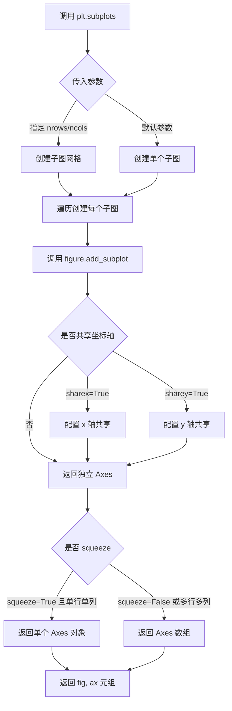
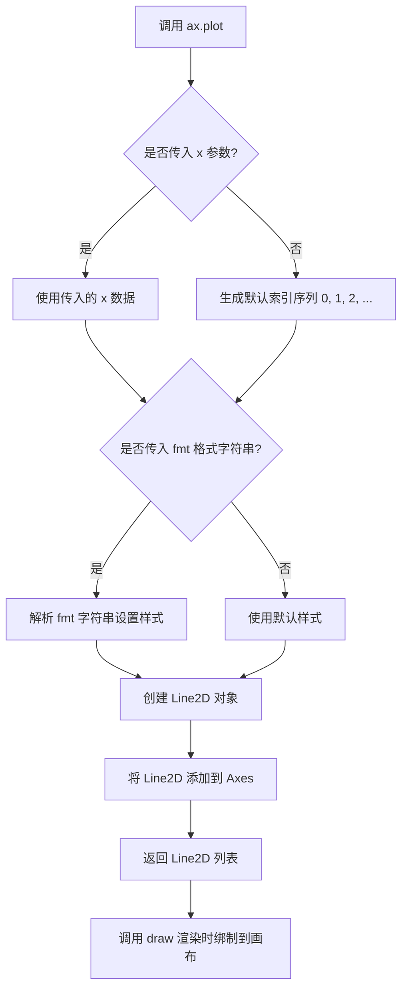
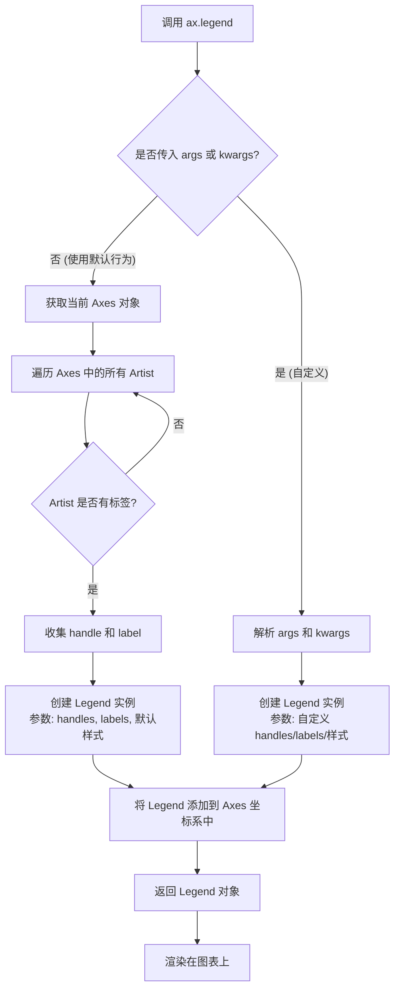
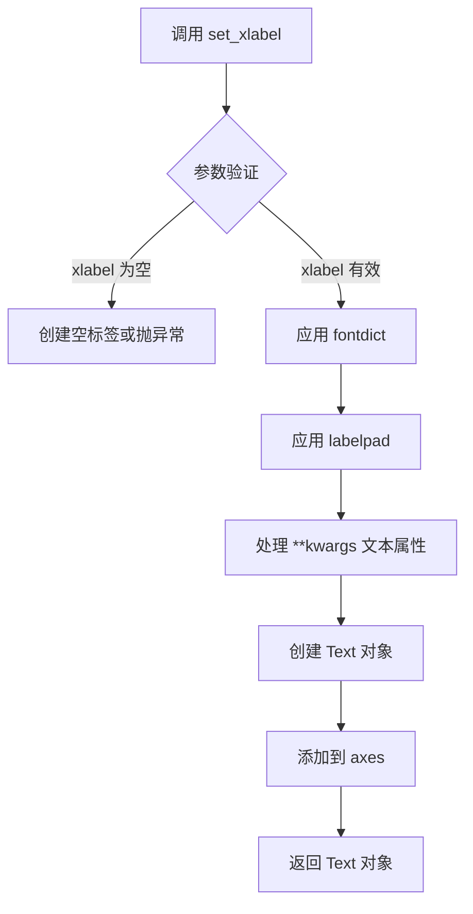
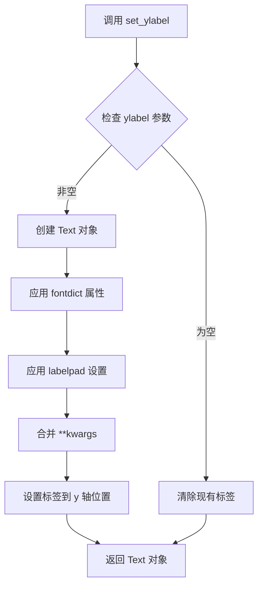
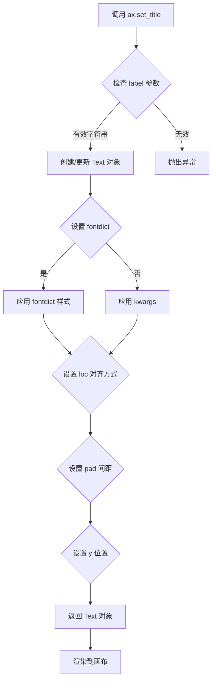
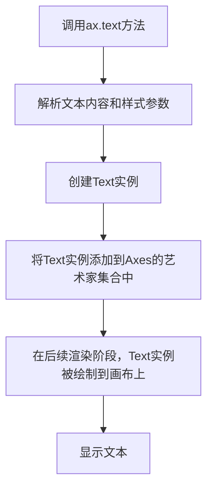
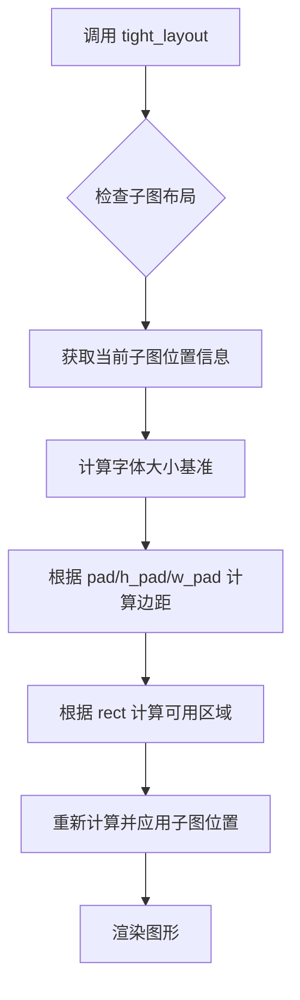
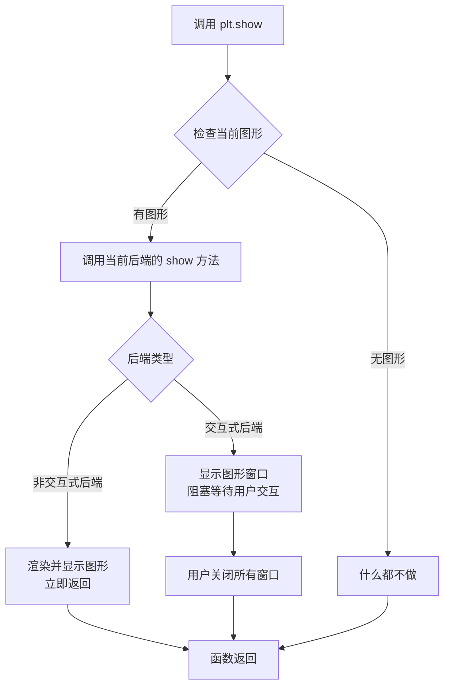

# `matplotlib\galleries\examples\text_labels_and_annotations\mathtext_demo.py` 详细设计文档

该脚本是一个使用 Matplotlib 库的数据可视化示例，它创建了一个包含单一折线图的 Figure，并通过 Axes 对象设置了带有 LaTeX 语法（Mathtext）的坐标轴标签、标题和自由文本，演示了 Matplotlib 渲染数学公式的能力。

## 整体流程

```mermaid
graph TD
    Start((开始)) --> Import[import matplotlib.pyplot as plt]
    Import --> Subplots[plt.subplots: 创建 Figure 和 Axes]
    Subplots --> Plot[ax.plot: 绑定数据 [1, 2, 3]]
    Plot --> Legend[ax.legend: 渲染图例]
    Legend --> SetXLabel[ax.set_xlabel: 设置 X 轴 LaTeX 标签]
    SetXLabel --> SetYLabel[ax.set_ylabel: 设置 Y 轴 LaTeX 标签]
    SetYLabel --> SetTitle[ax.set_title: 设置标题 LaTeX]
    SetTitle --> Text[ax.text: 在坐标轴添加数学公式文本]
    Text --> TightLayout[fig.tight_layout: 调整布局]
    TightLayout --> Show[plt.show: 显示图形]
    Show --> End((结束))
```

## 类结构

```
该代码为脚本式程序，未定义自定义类结构。
主要交互的库类结构 (Matplotlib):
└── matplotlib.figure.Figure
    └── matplotlib.axes.Axes
```

## 全局变量及字段


### `fig`
    
当前图形对象

类型：`matplotlib.figure.Figure`
    


### `ax`
    
当前坐标轴对象

类型：`matplotlib.axes.Axes`
    


### `tex`
    
存储 LaTeX 数学公式的字符串变量

类型：`str`
    


    

## 全局函数及方法


### `plt.subplots`

创建包含 axes 的 figure 实例。这是 matplotlib.pyplot 模块中的一个函数，用于创建一个新的 Figure 对象和一个或多个 Axes 对象，是最常用的 matplotlib 初始化方式之一。

参数：

- `nrows`：`int`，默认值 1，子图网格的行数
- `ncols`：`int`，默认值 1，子图网格的列数
- `sharex`：`bool` 或 `str`，默认值 False，是否共享 x 轴
- `sharey`：`bool` 或 `str`，默认值 False，是否共享 y 轴
- `squeeze`：`bool`，默认值 True，是否压缩返回的 Axes 数组维度
- `width_ratios`：`array-like`，可选，子图列宽比例
- `height_ratios`：`array-like`，可选，子图行高比例
- `**subplot_kw`：关键字参数，传递给 add_subplot 调用用于创建每个子图

返回值：`tuple(Figure, Axes or array of Axes)`，返回 Figure 对象和 Axes 对象（或 Axes 数组）

#### 流程图



#### 带注释源码

```python
# 在给定代码中的实际使用方式：
fig, ax = plt.subplots()

# 等效的完整调用形式（包含默认参数）：
# fig, ax = plt.subplots(
#     nrows=1,      # 默认值：创建 1 行子图
#     ncols=1,      # 默认值：创建 1 列子图
#     squeeze=True, # 默认值：如果为 True 且只有 1 个子图，返回单个 Axes 对象而非数组
#     sharex=False, # 默认值：每个子图有独立的 x 轴
#     sharey=False, # 默认值：每个子图有独立的 y 轴
#     **subplot_kw   # 可选：传递给 add_subplot 的关键字参数
# )

# 函数返回值：
# - fig: Figure 对象，整个图形容器
# - ax: Axes 对象，单个子图时的 Axes 实例

# 后续操作示例：
ax.plot([1, 2, 3], label=r'$\sqrt{x^2}$')  # 绘制数据
ax.legend()                                  # 显示图例
ax.set_xlabel(r'$\Delta_i^j$')              # 设置 x 轴标签
ax.set_ylabel(r'$\Delta_{i+1}^j$')          # 设置 y 轴标签
ax.set_title(r'$\Delta_i^j$')               # 设置标题
ax.text(1, 1.6, tex)                        # 添加文本
fig.tight_layout()                          # 调整布局
plt.show()                                   # 显示图形
```


# matplotlib.axes.Axes.plot 详细设计文档

### `ax.plot`

`ax.plot` 是 Matplotlib 库中 `Axes` 类的核心方法，用于在坐标系中绑制 y 相对于 x 的线条或散点，是最基本的数据可视化方法之一。

## 参数：

- `x`：`array-like` 或 `scalar`，x 轴数据，可选。若未指定，则使用默认的索引序列（0, 1, 2, ...）
- `y`：`array-like` 或 `scalar`，y 轴数据，必填。要绑制的数值或数值序列
- `fmt`：`str`，格式字符串，可选。用于快速设置线条颜色、标记样式和线条风格的简写形式（如 'ro-' 表示红色圆形标记加实线）
- `**kwargs`：其他关键字参数，用于设置线条属性，如 `color`（颜色）、`linewidth`（线宽）、`marker`（标记样式）等

## 返回值：`list of Line2D`，返回绑制到 Axes 上的线条对象列表，每个 `Line2D` 对象代表一条绑制的线条

## 流程图



## 带注释源码

```python
# 注意：以下为 matplotlib.axes.Axes.plot 方法的核心逻辑伪代码
# 实际源码位于 matplotlib 库中，此处为逻辑流程展示

def plot(self, *args, **kwargs):
    """
    在 Axes 上绑制 y 相对于 x 的线条或散点
    
    参数:
        x: array-like, x 轴数据
        y: array-like, y 轴数据  
        fmt: str, 格式字符串如 'b-' 表示蓝色实线
        **kwargs: 其他线条属性
    """
    
    # 1. 参数解析处理
    # 处理不同形式的输入参数：
    # - plot(y) 只提供 y 数据
    # - plot(x, y) 提供 x 和 y 数据
    # - plot(x, y, fmt) 提供 x、y 和格式字符串
    # - plot(x, y, **kwargs) 提供 x、y 和属性参数
    # - plot(x, y, fmt, **kwargs) 提供所有参数
    
    # 2. 创建 Line2D 对象
    # 根据解析的参数创建 matplotlib.lines.Line2D 实例
    # 设置颜色、线型、线宽、标记等属性
    
    # 3. 将线条添加到 Axes
    # self.lines.append(line)  # 添加到线条列表
    # self.add_line(line)      # 注册到 Axes 管理
    
    # 4. 返回 Line2D 对象列表
    # return [line]
    
    # 延迟绑制机制：
    # 实际绑制操作在调用 fig.canvas.draw() 或 plt.show() 时
    # 由 Axes.draw() 方法触发，通过 Renderer 完成可视化
```

## 关键组件信息

| 组件名称 | 描述 |
|---------|------|
| `Line2D` | 表示绑制线条的图形对象，包含数据、样式和属性 |
| `Axes.lines` | 存储当前 Axes 中所有绑制线条的列表 |
| `Renderer` | 渲染器，负责将图形对象绘制到画布（FigureCanvas）上 |

## 潜在的技术债务或优化空间

1. **参数解析复杂性**：`plot` 方法支持多种参数组合形式（位置参数、格式字符串、关键字参数），导致参数解析逻辑复杂，可考虑简化 API 设计
2. **延迟绑制机制**：数据修改后需要显式调用 `draw()` 或 `plt.show()` 才能看到更新，交互性有待增强
3. **格式字符串解析**：虽然 `fmt` 提供了快速绑制的便利，但功能相对有限，部分高级样式仍需通过 `**kwargs` 设置

## 其它项目

### 设计目标与约束
- **目标**：提供统一的数据可视化接口，支持线条、散点等多种绑制方式
- **约束**：必须与 Figure、Axes、Renderer 等组件协同工作，遵循 Matplotlib 的图形架构

### 错误处理与异常设计
- 当 `y` 数据为空时抛出 `ValueError`
- 当 `x` 和 `y` 长度不匹配时抛出 `ValueError`
- 当格式字符串解析失败时抛出 `ValueError`

### 数据流与状态机
1. **输入阶段**：接收用户提供的 x、y 数据和样式参数
2. **对象创建阶段**：创建 Line2D 对象并配置属性
3. **注册阶段**：将 Line2D 添加到 Axes 管理
4. **渲染阶段**：在 Canvas 绘制时，Renderer 读取 Line2D 数据进行绑制


### `ax.legend` (matplotlib.axes.Axes.legend)

#### 描述
该方法用于在当前坐标轴（Axes）上创建并显示图例（Legend）。在给定的代码示例中，`ax.legend()` 以无参数方式调用，这会触发默认行为：自动扫描当前 Axes 中所有已注册标签（如 `ax.plot` 中定义的 `label`）的图形元素（如线条、补丁），并根据这些标签生成对应的图例项。

#### 参数
- `*args`：`tuple`，可变长度参数列表。通常用于显式传递图例句柄（handles）和标签（labels），例如 `ax.legend(handles, labels)`。
- `**kwargs`：`dict`，可变关键字参数。用于指定图例的样式和属性，常见的参数包括：
  - `loc`：`str` 或 `int`，图例位置（如 `'upper right'`, `'best'`）。
  - `fontsize`：`int` 或 `float`，图例字体大小。
  - `frameon`：`bool`，是否显示图例边框。
  - `title`：`str`，图例标题。
  *(注：在给定的代码片段中，该方法未传入任何参数，使用默认参数配置。)*

#### 返回值
`matplotlib.legend.Legend`，返回创建的图例（Legend）对象。该对象是对应图例实例的引用，可用于后续进一步的属性修改或事件绑定。

#### 流程图



#### 带注释源码

```python
# matplotlib.axes.Axes 类中的 legend 方法原型（简化模拟）

def legend(self, *args, **kwargs):
    """
    在 Axes 上创建图例。
    
    参数:
        *args: 可选。通常用于传递 (handles, labels) 元组列表。
               在本代码示例中为空，触发自动检测模式。
        **kwargs: 可选。用于控制图例外观，如 loc, fontsize 等。
    
    返回值:
        matplotlib.legend.Legend: 创建的图例对象。
    """
    
    # 1. 初始化图例参数
    handles = []
    labels = []
    
    # 2. 如果没有传入参数，则进入自动模式
    if not args and not kwargs:
        # 自动获取所有带有标签的 Artist (如 Line2D, Patch)
        # 在本代码中，这一步会获取 ax.plot([1,2,3], label=...) 中的线条
        for artist in self.get_children():
            if hasattr(artist, 'get_label'):
                label = artist.get_label()
                # 忽略空标签或默认标签
                if label and not label.startswith('_'):
                    handles.append(artist)
                    labels.append(label)
    
    # 3. 创建 Legend 实例
    # loc='best' 是常见默认值，在本代码中生效
    legend = Legend(self, handles, labels, **kwargs)
    
    # 4. 将 Legend 添加到 Axes 的艺术家列表中
    self._add_artist(legend)
    
    # 5. 返回 Legend 对象以便用户进一步操作
    return legend
```


### `matplotlib.axes.Axes.set_xlabel`

设置 x 轴标签的方法，用于为图表的 x 轴添加标签文本，支持 LaTeX 数学表达式渲染。

参数：

- `xlabel`：`str`，要设置的 x 轴标签文本，支持 mathtext 语法
- `fontdict`：`dict`，可选，用于控制标签外观的字体属性字典
- `labelpad`：`float`，可选，标签与坐标轴边框之间的间距（以点为单位）
- `**kwargs`：可选，传递给 `matplotlib.text.Text` 的额外关键字参数，如 fontsize、color、fontfamily 等

返回值：`matplotlib.text.Text`，返回创建的 x 轴标签文本对象

#### 流程图



#### 带注释源码

```python
# 以下为 matplotlib Axes.set_xlabel 的典型实现逻辑
# 实际源码位于 matplotlib/lib/matplotlib/axes/_axes.py

def set_xlabel(self, xlabel, fontdict=None, labelpad=None, **kwargs):
    """
    设置 x 轴标签
    
    参数:
        xlabel: str - 标签文本内容
        fontdict: dict - 字体属性字典（如 {'fontsize': 12, 'color': 'red'}）
        labelpad: float - 标签与轴的间距
        **kwargs: 传递给 Text 的其他参数
    """
    # 1. 获取 xaxis 对象（X轴容器）
    xaxis = self.xaxis
    
    # 2. 创建标签文本对象，label 属性存储标签文本
    #    支持 mathtext 渲染（如 r'$\Delta_i^j$'）
    label = xaxis.set_label_text(xlabel)
    
    # 3. 如果提供了 fontdict，应用字体属性
    if fontdict:
        label.update(fontdict)
    
    # 4. 如果提供了 labelpad，设置标签与轴的间距
    if labelpad is not None:
        xaxis.set_label_props(labelpad=labelpad)
    
    # 5. 应用额外的文本属性（颜色、字体大小等）
    #    **kwargs 会传递给底层的 Text 对象
    label.update(kwargs)
    
    # 6. 返回创建的 Text 对象，供后续操作
    return label
```

**使用示例（来自提供的代码）：**

```python
# 设置带 mathtext 的 x 轴标签
ax.set_xlabel(r'$\Delta_i^j$', fontsize=20)

# 效果：在 x 轴显示希腊字母 Δ 组成的数学符号
```


### `Axes.set_ylabel`

设置 y 轴的标签文本，可自定义字体属性、标签位置以及通过关键字参数传递额外的文本样式配置。

参数：

- `ylabel`：`str`，要显示的 y 轴标签文本内容
- `fontdict`：`dict`，可选，用于设置标签文本的字体属性字典（如 fontsize、color 等）
- `labelpad`：`float`，可选，标签与 y 轴的距离（以点为单位），默认值为 None
- `**kwargs`：可变关键字参数，传递给 `matplotlib.text.Text` 对象的额外属性（如 color、rotation、horizontalalignment 等）

返回值：`matplotlib.text.Text`，返回创建的文本对象，可用于后续进一步自定义标签样式

#### 流程图



#### 带注释源码

```python
def set_ylabel(self, ylabel, fontdict=None, labelpad=None, **kwargs):
    """
    设置 y 轴的标签文本。
    
    参数:
    -------
    ylabel : str
        要显示在 y 轴上的文本标签内容。
    fontdict : dict, optional
        一个字典，用于控制文本的外观属性。
        常见键包括 'fontsize', 'fontweight', 'color' 等。
    labelpad : float, optional
        标签与坐标轴之间的间距（以点为单位）。
        正值会使标签向外移动，负值向内移动。
    **kwargs : dict
        传递给 Text 类的额外关键字参数，用于自定义文本样式。
        例如：rotation, ha, va, color, fontsize 等。
    
    返回值:
    -------
    text : matplotlib.text.Text
        返回创建的 Text 对象，允许后续对其进行样式修改。
    
    示例:
    -------
    >>> ax.set_ylabel('Y轴标签', fontsize=12, color='blue')
    >>> ax.set_ylabel(r'$\Delta_{i+1}^j$', fontsize=20)  # 支持 LaTeX 渲染
    """
    # 获取 y 轴对象
    yaxis = self.yaxis
    
    # 创建文本对象并设置标签
    # ylabel 参数被传递给 yaxis 的 set_label_text 方法
    return yaxis.set_label_text(ylabel, fontdict=fontdict, 
                                 labelpad=labelpad, **kwargs)
```


### `matplotlib.axes.Axes.set_title`

设置 Axes（坐标轴）的标题，支持数学文本（mathtext）渲染。

参数：

- `label`：`str`，要设置的标题文本内容，支持 LaTeX 数学表达式
- `fontdict`：`dict`，可选，用于控制标题样式的字典（如 fontsize、color 等）
- `loc`：`str`，可选，标题对齐方式，可选值有 'center'、'left'、'right'，默认 'center'
- `pad`：`float`，可选，标题与 Axes 顶部的间距（以 points 为单位）
- `y`：`float`，可选，标题在 y 轴方向上的位置（0-1 之间）
- `**kwargs`：其他关键字参数，直接传递给 `matplotlib.text.Text` 对象

返回值：`Text`，返回创建的 `Text` 对象，可用于进一步自定义样式

#### 流程图



#### 带注释源码

```python
# matplotlib.axes.Axes.set_title 方法的调用示例
# 来自提供的代码示例

ax.set_title(
    r'$\Delta_i^j \hspace{0.4} \mathrm{versus} \hspace{0.4} '
    r'\Delta_{i+1}^j$',  # str: 标题文本，支持 LaTeX 数学表达式
    fontsize=20          # int: 字体大小，通过 kwargs 传递给 Text 对象
)

# 完整方法签名（基于 matplotlib 源码）
def set_title(self, label, fontdict=None, loc='center', pad=None, *, y=None, **kwargs):
    """
    Set a title for the axes.
    
    Parameters
    ----------
    label : str
        The title text string supporting LaTeX math syntax.
    
    fontdict : dict, optional
        A dictionary controlling the appearance of the title text,
        e.g., {'fontsize': 12, 'fontweight': 'bold'}.
    
    loc : {'center', 'left', 'right'}, default: 'center'
        Alignment of the title text.
    
    pad : float, default: rcParams['axes.titlepad']
        The offset (in points) from the top of the axes.
    
    y : float, optional
        The y position of the title text (0-1 range).
    
    **kwargs
        Additional keyword arguments are passed to the Text instance.
    
    Returns
    -------
    text : matplotlib.text.Text
        The matplotlib Text instance representing the title.
    """
    # 实现逻辑概要：
    # 1. 验证 label 参数
    # 2. 使用 _set_title_positon 确定标题位置
    # 3. 创建或更新 Text 对象
    # 4. 应用 fontdict 和 kwargs 中的样式
    # 5. 返回 Text 对象供进一步操作
```


### Axes.text

在matplotlib的Axes对象上添加文本标签，支持数学文本（mathtext）渲染。

参数：
- `x`：float，文本放置的X坐标（数据坐标）。
- `y`：float，文本放置的Y坐标（数据坐标）。
- `s`：str，要显示的文本内容，支持Mathtext格式（如`$\mathcal{R}...$`）。
- `fontdict`：dict，可选，默认文本属性字典，用于统一设置字体样式。
- `**kwargs`：可变关键字参数，支持以下常用属性：
  - `fontsize`：int，字体大小。
  - `color`：str，文本颜色。
  - `va`：str，垂直对齐方式（如`'bottom'`、`'top'`、`'center'`）。
  - `ha`：str，水平对齐方式（如`'left'`、`'right'`、`'center'`）。

返回值：`matplotlib.text.Text`，返回创建的文本对象，可用于后续修改（如添加注解）。

#### 流程图



#### 带注释源码

```python
# 导入matplotlib.pyplot库，用于创建图形和坐标轴
import matplotlib.pyplot as plt

# 创建一个新的图形和一个子图（Axes对象）
fig, ax = plt.subplots()

# 在Axes上绘制一条折线，数据点为[1, 2, 3]，并设置图例标签（此处未显示）
ax.plot([1, 2, 3], label=r'$\sqrt{x^2}$')
ax.legend()

# 设置X轴标签，使用Mathtext渲染数学符号Δ_i^j
ax.set_xlabel(r'$\Delta_i^j$', fontsize=20)
# 设置Y轴标签，类似X轴
ax.set_ylabel(r'$\Delta_{i+1}^j$', fontsize=20)
# 设置标题，包含更复杂的Mathtext表达式和水平间距
ax.set_title(r'$\Delta_i^j \hspace{0.4} \mathrm{versus} \hspace{0.4} '
             r'\Delta_{i+1}^j$', fontsize=20)

# 定义一个包含复杂数学公式的字符串，使用Mathtext语法
# \mathcal{R}表示花体R，\prod表示乘积，\sin表示正弦函数等
tex = r'$\mathcal{R}\prod_{i=\alpha_{i+1}}^\infty a_i\sin(2 \pi f x_i)$'

# 调用ax.text方法在指定位置添加文本
# 参数1: x=1，文本X坐标
# 参数2: y=1.6，文本Y坐标
# 参数3: s=tex，文本内容（公式）
# 参数4: fontsize=20，字体大小为20
# 参数5: va='bottom'，垂直对齐方式为底部对齐
ax.text(1, 1.6, tex, fontsize=20, va='bottom')

# 调整图形布局，避免重叠
fig.tight_layout()
# 显示图形
plt.show()
```


### `Figure.tight_layout`

调整子图参数以填充整个图形，自动计算并应用边距以避免子图之间以及与图形边缘的重叠。

参数：

- `pad`：`float`，默认 1.08，图形边缘与子图之间的填充间距（相对于字体大小）
- `h_pad`：`float` 或 `None`，子图之间的垂直间距（默认自动计算）
- `w_pad`：`float` 或 `None`，子图之间的水平间距（默认自动计算）
- `rect`：`tuple`，相对坐标系的矩形区域 (left, bottom, right, top)，默认 (0, 0, 1, 1)

返回值：`None`，该方法直接修改图形布局，不返回任何值

#### 流程图



#### 带注释源码

**注意**：用户提供的代码是 `tight_layout` 方法的**调用方代码**，而非该方法的实现源码。以下为调用方代码及方法签名说明：

```python
"""
========
Mathtext
========

Use Matplotlib's internal LaTeX parser and layout engine.  For true LaTeX
rendering, see the text.usetex option.
"""

import matplotlib.pyplot as plt

# 创建图形和坐标轴对象
fig, ax = plt.subplots()

# 绘制数据曲线并添加图例
ax.plot([1, 2, 3], label=r'$\sqrt{x^2}$')
ax.legend()

# 设置坐标轴标签和标题（支持 LaTeX 格式）
ax.set_xlabel(r'$\Delta_i^j$', fontsize=20)
ax.set_ylabel(r'$\Delta_{i+1}^j$', fontsize=20)
ax.set_title(r'$\Delta_i^j \hspace{0.4} \mathrm{versus} \hspace{0.4} '
             r'\Delta_{i+1}^j$', fontsize=20)

# 添加包含复杂数学公式的文本
tex = r'$\mathcal{R}\prod_{i=\alpha_{i+1}}^\infty a_i\sin(2 \pi f x_i)$'
ax.text(1, 1.6, tex, fontsize=20, va='bottom')

# 调用 tight_layout 方法调整子图布局
# 方法签名: tight_layout(*, pad=1.08, h_pad=None, w_pad=None, rect=(0, 0, 1, 1))
# 参数说明:
#   - pad: 图形边缘与子图之间的间距（相对于字体大小）
#   - h_pad: 子图间垂直间距（None 表示自动计算）
#   - w_pad: 子图间水平间距（None 表示自动计算）
#   - rect: 调整区域的相对坐标 (left, bottom, right, top)
fig.tight_layout()  # <- 关键方法调用

# 显示图形
plt.show()
```

#### 方法签名（来自 matplotlib 官方文档）

```python
Figure.tight_layout(*, pad=1.08, h_pad=None, w_pad=None, rect=(0, 0, 1, 1))
```

---

### 潜在技术债务与优化空间

1. **缺少错误处理**：代码未对 `tight_layout()` 可能引发的异常（如子图为空、图形已关闭等）进行处理
2. **硬编码参数**：示例中使用默认参数，缺乏灵活性，建议根据实际图表内容动态调整 `pad`、`h_pad`、`w_pad` 等参数以获得最佳布局效果

---

### 补充说明

- `tight_layout()` 适用于单图或多子图场景，能够有效解决标签被裁切、标题与子图重叠等问题
- 对于复杂的嵌套子图布局，建议使用 `constrained_layout()` 作为更现代的替代方案


### `plt.show`

显示所有当前打开的图形窗口。`plt.show()` 会阻塞程序执行直到用户关闭所有图形窗口（在某些交互式后端中），或者在非交互式后端中渲染并显示图形。

参数：

- 该函数无参数

返回值：`None`，无返回值

#### 流程图



#### 带注释源码

```python
def show(*, block=None):
    """
    显示所有打开的图形窗口。
    
    参数:
        block: bool, optional
            控制是否阻塞程序执行。
            - None (默认): 阻塞（True）在交互式后端，非阻塞（False）在非交互式后端
            - True: 强制阻塞，等待用户关闭窗口
            - False: 强制不阻塞，立即返回
    """
    # 获取当前matplotlib的后端
    backend = matplotlib.get_backend()
    
    # 检查是否有打开的图形
    allnums = get_fignums()
    if not allnums:
        # 如果没有图形，直接返回
        return
    
    # 对于交互式后端（如TkAgg, Qt5Agg等）
    if backend in ['TkAgg', 'Qt5Agg', 'MacOSX']:
        # 创建并显示图形窗口
        for fig_num in allnums:
            fig = figure(fig_num)
            # 调用后端的show方法显示图形
            fig.canvas.draw_idle()
            fig.canvas.flush_events()
        
        # 如果block不为False，则阻塞等待
        if block is None or block:
            # 在交互式后端中通常会进入主循环
            # 等待用户关闭窗口
            import matplotlib.pyplot as plt
            plt._backend.show()  # 调用底层后端的show
    
    # 对于非交互式后端（如Agg, PDF等）
    else:
        # 直接渲染图形到显示设备
        for fig_num in allnums:
            fig = figure(fig_num)
            fig.canvas.draw_idle()
        
        # 非阻塞模式，直接返回
        return None
```

## 关键组件


### Mathtext 渲染引擎

Matplotlib 内置的 LaTeX 数学文本解析和渲染引擎，通过 `$...$` 语法包裹数学表达式，实现数学符号的渲染

### 数学表达式语法

使用 LaTeX 风格的数学符号表示，包括上标 `^`、下标 `_`、希腊字母（如 `\Delta`）、数学函数（如 `\sqrt`、`\sin`）和大型运算符（如 `\prod`）

### 文本对象创建

通过 `ax.text()` 方法在图表指定位置创建数学文本，支持自定义字体大小和垂直对齐方式

### 坐标轴标签系统

使用 `set_xlabel()`、`set_ylabel()` 和 `set_title()` 方法为图表轴和标题设置数学表达式标签

### 布局管理

通过 `tight_layout()` 自动调整子图参数以防止标签重叠，确保视觉美观


## 问题及建议


### 已知问题

- 缺少图像保存逻辑，仅依赖`plt.show()`交互式显示，在非交互式环境（如服务器、无头服务器）中无法生成输出
- 未指定matplotlib后端，不同环境可能产生不可预期的行为
- LaTeX表达式字符串散落在各行，缺乏统一管理，后续维护和修改困难
- 字体大小硬编码为多个位置（fontsize=20），违反DRY原则
- 文本位置(1, 1.6)为硬编码值，缺乏自适应布局机制，可能导致文本溢出或位置不当
- 缺少错误处理机制，若LaTeX表达式语法错误或系统缺少必要字体/LaTeX支持，程序将直接崩溃
- `ax.plot()`仅提供y值数据，x轴自动生成为[0,1,2]，语义不明确

### 优化建议

- 添加图像保存代码：`fig.savefig('output.png', dpi=150, bbox_inches='tight')`
- 显式指定后端或使用`matplotlib.use('Agg')`用于非交互环境
- 将LaTeX表达式提取为常量或配置文件集中管理
- 定义全局字体大小常量：`FONT_SIZE = 20`
- 使用`fig.text()`或`ax.text()`的`ha`/`va`参数配合`transform`实现相对定位
- 添加try-except捕获LaTeX渲染异常，提供降级方案
- 为`plot()`显式提供x和y数据：`ax.plot(x_data, y_data, label=r'$\sqrt{x^2}$')`


## 其它


### 设计目标与约束

本代码示例旨在演示Matplotlib的mathtext功能，即使用LaTeX风格的数学符号在图表中渲染数学表达式。核心设计目标包括：（1）提供与LaTeX兼容的数学文本渲染能力；（2）支持复杂的数学符号和公式；（3）通过内部LaTeX解析器实现轻量级数学排版。约束条件方面，代码使用matplotlib自带的内部LaTeX解析器，而非完整的LaTeX系统，因此某些复杂的LaTeX功能可能不受支持；若需要完整LaTeX渲染，应使用text.usetex选项。

### 错误处理与异常设计

本示例代码较为简单，未包含复杂的错误处理机制。在实际应用中，mathtext解析可能产生的异常包括：数学表达式语法错误会导致渲染失败或显示异常字符；字体缺失可能导致特定数学符号无法显示；plt.show()在无图形环境（如某些服务器环境）可能失败。对于这些情况，Matplotlib通常会捕获解析错误并尝试显示原始文本或警告信息。开发者应确保表达式语法正确，并在必要时添加try-except块处理显示异常。

### 数据流与状态机

代码的数据流相对简单：输入为预定义的数学表达式字符串（如r'$\sqrt{x^2}$'），经过Matplotlib的mathtext引擎解析后，转换为渲染指令，最终在图形画布上输出可视化的数学符号。状态机方面，matplotlib保持内部状态管理图形元素：从fig和ax的初始化状态，到plot()、set_xlabel()、set_ylabel()、set_title()、text()的添加状态，再到最终的render状态。plt.show()触发状态转换至显示状态。

### 外部依赖与接口契约

本代码依赖的核心外部库为Matplotlib，其内部又依赖于字体渲染系统（如FreeType）和LaTeX解析组件。接口契约方面：ax.plot()接受列表形式的x和y坐标数据；ax.set_xlabel()、ax.set_ylabel()、ax.set_title()均接受字符串参数，其中包含数学表达式时需使用$符号包裹；ax.text()接受坐标参数(x, y)、文本内容字符串以及可选的字体大小和对齐参数；fig.tight_layout()用于自动调整子图参数以适应图形内容。这些接口均返回对应的Artist或Text对象，支持链式调用和进一步定制。

### 性能考虑

本示例为静态图形生成，性能影响较小。在大规模应用或动态生成场景中需注意：复杂的数学表达式会增加解析时间；频繁调用plt.show()或重新创建图形会有较大开销；大量使用mathtext的图表渲染速度可能慢于纯文本图表。优化建议包括：预先定义复杂的数学表达式字符串以复用；使用blitting技术进行动态更新；必要时考虑缓存已渲染的表达式图像。

### 安全性考虑

本代码主要涉及字符串内容的显示，安全性风险较低。主要考虑包括：避免将用户输入直接用于数学表达式渲染，以防注入恶意代码（尽管Matplotlib的mathtext沙箱提供了基本防护）；在Web应用中使用matplotlib时需注意输出图像的安全传输。Matplotlib的mathtext解析器本身是一个受限的解析器，设计上防止了大多数安全风险。

### 可测试性

代码的可测试性主要体现在输出图像的验证。测试策略可包括：单元测试级别验证各个接口调用的返回类型和基本属性；集成测试级别验证最终生成的图形对象结构；图像回归测试验证渲染输出的视觉一致性。Matplotlib提供了matplotlib.testing模块支持测试用例的编写，包括装饰器@image_comparison用于自动化图形比对。

### 版本兼容性

Matplotlib版本迭代可能导致API变化。代码使用了较为稳定的面向对象接口（fig, ax = plt.subplots()），这是推荐的现代API风格。建议在项目依赖中声明Matplotlib的最低支持版本（如>=3.5），并定期测试与新版本的兼容性。mathtext的语法和可用符号集在不同版本间基本保持一致，但某些高级功能可能随版本改进。

### 配置管理

代码运行时涉及多个配置层面：Matplotlib全局配置可通过plt.rcParams修改，如设置默认字体大小、数学符号字体等；图形级配置通过Figure和Axes对象的属性设置；文本级配置通过fontsize、fontfamily等参数指定。推荐的做法是将样式配置集中管理，避免在代码中硬编码过多渲染参数。对于项目级应用，可使用matplotlibrc配置文件或样式表（plt.style.use()）统一管理外观主题。

### 资源管理

本代码运行时间较短，资源管理相对简单。关键资源包括：图形内存（fig对象）、字体资源（系统字体或Matplotlib自带字体）、显示窗口资源（plt.show()时打开）。在长时间运行的应用中，应注意及时关闭不再使用的图形对象以释放内存。Matplotlib的后端（如Agg）支持无显示环境的内存渲染，适用于服务器端图形生成场景。


    