# `matplotlib\galleries\examples\text_labels_and_annotations\mathtext_examples.py` 详细设计文档

This code provides a demonstration of various mathematical expressions rendering capabilities using Matplotlib's math rendering engine.

## 整体流程

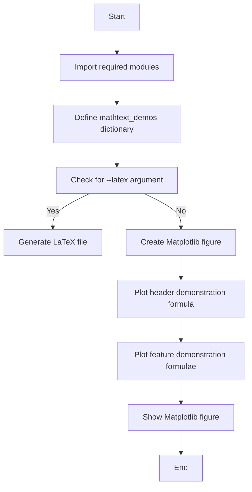

## 类结构

```
matplotlib.pyplot (Matplotlib library)
├── subprocess (Python library)
└── sys (Python library)
```

## 全局变量及字段


### `mathtext_demos`
    
Dictionary containing mathematical expression examples with titles as keys.

类型：`dict`
    


### `n_lines`
    
Number of lines in the mathtext_demos dictionary.

类型：`int`
    


### `mpl_grey_rgb`
    
RGB color value for grey used in Matplotlib.

类型：`tuple`
    


### `fig`
    
Figure object created by Matplotlib.

类型：`matplotlib.figure.Figure`
    


### `ax`
    
Axes object created within the figure.

类型：`matplotlib.axes._subplots.AxesSubplot`
    


### `line_axesfrac`
    
Fraction of the axes height used for spacing between lines.

类型：`float`
    


### `full_demo`
    
The full mathematical expression for the header demonstration.

类型：`str`
    


### `title`
    
Title of the plot.

类型：`str`
    


### `demo`
    
The mathematical expression to be displayed on the plot.

类型：`str`
    


### `baseline`
    
Baseline position for annotations on the plot.

类型：`float`
    


### `baseline_next`
    
Next baseline position for annotations on the plot.

类型：`float`
    


### `fill_color`
    
Color used to fill the area under the annotations.

类型：`str`
    


### `argv`
    
List of command-line arguments passed to the script.

类型：`list`
    


### `matplotlib.pyplot.fig`
    
Figure object created by Matplotlib.

类型：`matplotlib.figure.Figure`
    


### `matplotlib.pyplot.ax`
    
Axes object created within the figure.

类型：`matplotlib.axes._subplots.AxesSubplot`
    


### `matplotlib.pyplot.mpl_grey_rgb`
    
RGB color value for grey used in Matplotlib.

类型：`tuple`
    


### `sys.argv`
    
List of command-line arguments passed to the script.

类型：`list`
    
    

## 全局函数及方法


### doall()

This function generates a Matplotlib plot that demonstrates various mathematical expressions using Matplotlib's math rendering engine.

参数：

- 无

返回值：无

#### 流程图

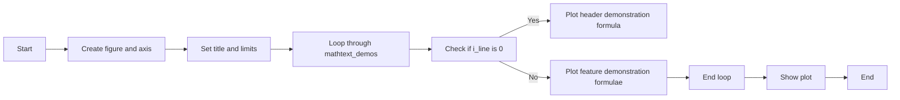

#### 带注释源码

```python
def doall():
    # Creating figure and axis.
    fig = plt.figure(figsize=(7, 7))
    ax = fig.add_axes((0.01, 0.01, 0.98, 0.90),
                      facecolor="white", frameon=True)
    ax.set_xlim(0, 1)
    ax.set_ylim(0, 1)
    ax.set_title("Matplotlib's math rendering engine",
                 color=mpl_grey_rgb, fontsize=14, weight='bold')
    ax.set_xticks([])
    ax.set_yticks([])

    # Gap between lines in axes coords
    line_axesfrac = 1 / n_lines

    # Plot header demonstration formula.
    full_demo = mathtext_demos['Header demo']
    ax.annotate(full_demo,
                xy=(0.5, 1. - 0.59 * line_axesfrac),
                color='tab:orange', ha='center', fontsize=20)

    # Plot feature demonstration formulae.
    for i_line, (title, demo) in enumerate(mathtext_demos.items()):
        print(i_line, demo)
        if i_line == 0:
            continue

        baseline = 1 - i_line * line_axesfrac
        baseline_next = baseline - line_axesfrac
        fill_color = ['white', 'tab:blue'][i_line % 2]
        ax.axhspan(baseline, baseline_next, color=fill_color, alpha=0.2)
        ax.annotate(f'{title}:',
                    xy=(0.06, baseline - 0.3 * line_axesfrac),
                    color=mpl_grey_rgb, weight='bold')
        ax.annotate(demo,
                    xy=(0.04, baseline - 0.75 * line_axesfrac),
                    color=mpl_grey_rgb, fontsize=16)

    plt.show()
```


### re.sub

`re.sub` 是 Python 的正则表达式模块中的一个函数，用于在字符串中替换匹配的子串。

参数：

- `pattern`：`str`，正则表达式模式，用于匹配要替换的子串。
- `repl`：`str`，用于替换匹配子串的字符串。
- `string`：`str`，要搜索和替换的原始字符串。

返回值：`str`，替换后的字符串。

#### 流程图

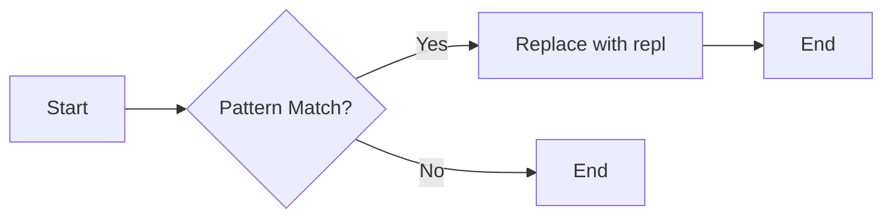

#### 带注释源码

```python
import re

def doall():
    # ... (其他代码)

    # Run: python mathtext_examples.py --latex
    # Need amsmath and amssymb packages.
    with open("mathtext_examples.ltx", "w") as fd:
        fd.write("\\documentclass{article}\n")
        fd.write("\\usepackage{amsmath, amssymb}\n")
        fd.write("\\begin{document}\n")
        fd.write("\\begin{enumerate}\n")

        for s in mathtext_demos.values():
            s = re.sub(r"(?<!\\)\$", "$$", s)  # Replace unmatched '$' with escaped '$'
            fd.write("\\item %s\n" % s)

        fd.write("\\end{enumerate}\n")
        fd.write("\\end{document}\n")

    subprocess.call(["pdflatex", "mathtext_examples.ltx"])
    # ... (其他代码)

# ... (其他代码)
```


### doall()

This function is responsible for rendering mathematical expressions using Matplotlib's math rendering engine. It creates a figure and an axis, sets up the title and limits, and plots the mathematical expressions provided in the `mathtext_demos` dictionary.

参数：

- 无

返回值：无

#### 流程图

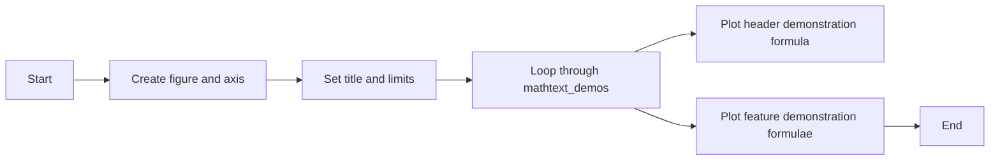

#### 带注释源码

```python
def doall():
    # Creating figure and axis.
    fig = plt.figure(figsize=(7, 7))
    ax = fig.add_axes((0.01, 0.01, 0.98, 0.90),
                      facecolor="white", frameon=True)
    ax.set_xlim(0, 1)
    ax.set_ylim(0, 1)
    ax.set_title("Matplotlib's math rendering engine",
                 color=mpl_grey_rgb, fontsize=14, weight='bold')
    ax.set_xticks([])
    ax.set_yticks([])

    # Gap between lines in axes coords
    line_axesfrac = 1 / n_lines

    # Plot header demonstration formula.
    full_demo = mathtext_demos['Header demo']
    ax.annotate(full_demo,
                xy=(0.5, 1. - 0.59 * line_axesfrac),
                color='tab:orange', ha='center', fontsize=20)

    # Plot feature demonstration formulae.
    for i_line, (title, demo) in enumerate(mathtext_demos.items()):
        if i_line == 0:
            continue

        baseline = 1 - i_line * line_axesfrac
        baseline_next = baseline - line_axesfrac
        fill_color = ['white', 'tab:blue'][i_line % 2]
        ax.axhspan(baseline, baseline_next, color=fill_color, alpha=0.2)
        ax.annotate(f'{title}:',
                    xy=(0.06, baseline - 0.3 * line_axesfrac),
                    color=mpl_grey_rgb, weight='bold')
        ax.annotate(demo,
                    xy=(0.04, baseline - 0.75 * line_axesfrac),
                    color=mpl_grey_rgb, fontsize=16)
```


### doall()

This function is responsible for rendering mathematical expressions using Matplotlib's math rendering engine. It creates a figure and an axis, sets up the title and limits, and plots the mathematical expressions provided in the `mathtext_demos` dictionary.

参数：

- 无

返回值：无

#### 流程图


#### 带注释源码

```python
def doall():
    # Colors used in Matplotlib online documentation.
    mpl_grey_rgb = (51 / 255, 51 / 255, 51 / 255)

    # Creating figure and axis.
    fig = plt.figure(figsize=(7, 7))
    ax = fig.add_axes((0.01, 0.01, 0.98, 0.90),
                      facecolor="white", frameon=True)
    ax.set_xlim(0, 1)
    ax.set_ylim(0, 1)
    ax.set_title("Matplotlib's math rendering engine",
                 color=mpl_grey_rgb, fontsize=14, weight='bold')
    ax.set_xticks([])
    ax.set_yticks([])

    # Gap between lines in axes coords
    line_axesfrac = 1 / n_lines

    # Plot header demonstration formula.
    full_demo = mathtext_demos['Header demo']
    ax.annotate(full_demo,
                xy=(0.5, 1. - 0.59 * line_axesfrac),
                color='tab:orange', ha='center', fontsize=20)

    # Plot feature demonstration formulae.
    for i_line, (title, demo) in enumerate(mathtext_demos.items()):
        print(i_line, demo)
        if i_line == 0:
            continue

        baseline = 1 - i_line * line_axesfrac
        baseline_next = baseline - line_axesfrac
        fill_color = ['white', 'tab:blue'][i_line % 2]
        ax.axhspan(baseline, baseline_next, color=fill_color, alpha=0.2)
        ax.annotate(f'{title}:',
                    xy=(0.06, baseline - 0.3 * line_axesfrac),
                    color=mpl_grey_rgb, weight='bold')
        ax.annotate(demo,
                    xy=(0.04, baseline - 0.75 * line_axesfrac),
                    color=mpl_grey_rgb, fontsize=16)
```


### doall()

This function is responsible for rendering mathematical expressions using Matplotlib's math rendering engine. It creates a figure and an axis, sets up the title and limits, and plots the mathematical expressions provided in the `mathtext_demos` dictionary.

参数：

- 无

返回值：无

#### 流程图


#### 带注释源码

```python
def doall():
    # Colors used in Matplotlib online documentation.
    mpl_grey_rgb = (51 / 255, 51 / 255, 51 / 255)

    # Creating figure and axis.
    fig = plt.figure(figsize=(7, 7))
    ax = fig.add_axes((0.01, 0.01, 0.98, 0.90),
                      facecolor="white", frameon=True)
    ax.set_xlim(0, 1)
    ax.set_ylim(0, 1)
    ax.set_title("Matplotlib's math rendering engine",
                 color=mpl_grey_rgb, fontsize=14, weight='bold')
    ax.set_xticks([])
    ax.set_yticks([])

    # Gap between lines in axes coords
    line_axesfrac = 1 / n_lines

    # Plot header demonstration formula.
    full_demo = mathtext_demos['Header demo']
    ax.annotate(full_demo,
                xy=(0.5, 1. - 0.59 * line_axesfrac),
                color='tab:orange', ha='center', fontsize=20)

    # Plot feature demonstration formulae.
    for i_line, (title, demo) in enumerate(mathtext_demos.items()):
        print(i_line, demo)
        if i_line == 0:
            continue

        baseline = 1 - i_line * line_axesfrac
        baseline_next = baseline - line_axesfrac
        fill_color = ['white', 'tab:blue'][i_line % 2]
        ax.axhspan(baseline, baseline_next, color=fill_color, alpha=0.2)
        ax.annotate(f'{title}:',
                    xy=(0.06, baseline - 0.3 * line_axesfrac),
                    color=mpl_grey_rgb, weight='bold')
        ax.annotate(demo,
                    xy=(0.04, baseline - 0.75 * line_axesfrac),
                    color=mpl_grey_rgb, fontsize=16)
```


### matplotlib.pyplot.figure

matplotlib.pyplot.figure 是一个用于创建图形的函数。

参数：

- figsize：`tuple`，图形的大小，例如 (width, height)。
- dpi：`int`，图形的分辨率，默认为 100。
- facecolor：`color`，图形的背景颜色，默认为白色。
- edgecolor：`color`，图形的边缘颜色，默认为 None。
- frameon：`bool`，是否显示图形的边框，默认为 True。
- subplot_kw：`dict`，子图的关键字参数，默认为 None。
- constrained_layout：`bool`，是否启用约束布局，默认为 None。

返回值：`Figure`，图形对象。

#### 流程图

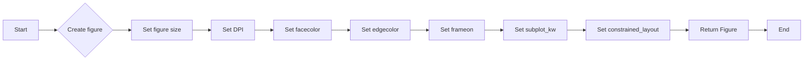

#### 带注释源码

```python
fig = plt.figure(figsize=(7, 7))
# 创建一个图形对象，大小为 (7, 7)。
```


### matplotlib.pyplot.add_axes

`matplotlib.pyplot.add_axes` 是一个用于在 Matplotlib 图形中添加轴的函数。

参数：

- `position`：`tuple`，表示轴的位置和大小，格式为 `(left, bottom, width, height)`，其中 `left` 和 `bottom` 的值范围在 0 到 1 之间，表示相对于图形的左下角的位置，`width` 和 `height` 的值范围在 0 到 1 之间，表示轴的宽度和高度。
- `facecolor`：`color`，轴的背景颜色。
- `frameon`：`bool`，是否显示轴的框。

返回值：`Axes` 对象，表示添加的轴。

#### 流程图

```mermaid
graph LR
A[Start] --> B{Call matplotlib.pyplot.add_axes()}
B --> C[Create Axes]
C --> D[Return Axes]
D --> E[End]
```

#### 带注释源码

```python
import matplotlib.pyplot as plt

# Creating figure and axis.
fig = plt.figure(figsize=(7, 7))
ax = fig.add_axes((0.01, 0.01, 0.98, 0.90),
                  facecolor="white", frameon=True)
```


### matplotlib.pyplot.figure

`matplotlib.pyplot.figure` 是一个用于创建图形的函数。

参数：

- `figsize`：`tuple`，图形的大小，格式为 `(width, height)`，单位为英寸。

返回值：`Figure` 对象，表示创建的图形。

#### 流程图

```mermaid
graph LR
A[Start] --> B{Call matplotlib.pyplot.figure()}
B --> C[Create Figure]
C --> D[Return Figure]
D --> E[End]
```

#### 带注释源码

```python
import matplotlib.pyplot as plt

# Creating figure and axis.
fig = plt.figure(figsize=(7, 7))
```


### matplotlib.pyplot.annotate

`matplotlib.pyplot.annotate` 是一个用于在图形上添加注释的函数。

参数：

- `s`：`str`，注释的文本。
- `xy`：`tuple`，注释的位置，格式为 `(x, y)`，其中 `x` 和 `y` 的值范围在 0 到 1 之间，表示相对于图形的位置。
- `color`：`color`，注释的颜色。
- `ha`：`str`，水平对齐方式。
- `fontsize`：`int`，注释的字体大小。

#### 流程图

```mermaid
graph LR
A[Start] --> B{Call matplotlib.pyplot.annotate()}
B --> C[Add Annotation]
C --> D[End]
```

#### 带注释源码

```python
# Plot header demonstration formula.
ax.annotate(full_demo,
            xy=(0.5, 1. - 0.59 * line_axesfrac),
            color='tab:orange', ha='center', fontsize=20)
```


### matplotlib.pyplot.axhspan

`matplotlib.pyplot.axhspan` 是一个用于在轴上添加水平跨度的函数。

参数：

- `ymin`：`float`，跨度的起始 y 坐标。
- `ymax`：`float`，跨度的结束 y 坐标。
- `color`：`color`，跨度的颜色。
- `alpha`：`float`，跨度的透明度。

#### 流程图

```mermaid
graph LR
A[Start] --> B{Call matplotlib.pyplot.axhspan()}
B --> C[Add Horizontal Span]
C --> D[End]
```

#### 带注释源码

```python
# Plot feature demonstration formulae.
for i_line, (title, demo) in enumerate(mathtext_demos.items()):
    # ...
    ax.axhspan(baseline, baseline_next, color=fill_color, alpha=0.2)
```


### matplotlib.pyplot.show

`matplotlib.pyplot.show` 是一个用于显示图形的函数。

#### 流程图

```mermaid
graph LR
A[Start] --> B{Call matplotlib.pyplot.show()}
B --> C[Show Figure]
C --> D[End]
```

#### 带注释源码

```python
# Plot feature demonstration formulae.
# ...
plt.show()
```


### sys.argv

`sys.argv` 是一个全局变量，包含传递给 Python 脚本的命令行参数。

#### 流程图

```mermaid
graph LR
A[Start] --> B{Check sys.argv}
B --> C{If '--latex' in sys.argv}
C --> D[Write LaTeX file]
D --> E[End]
C --> F[Else]
F --> G[Call doall()]
G --> H[End]
```

#### 带注释源码

```python
if '--latex' in sys.argv:
    # ...
else:
    doall()
```


### matplotlib.pyplot.set_xlim

matplotlib.pyplot.set_xlim 是一个用于设置当前轴的 x 轴限制的全局函数。

参数：

- `left`：`float`，x 轴的左边界。
- `right`：`float`，x 轴的右边界。

返回值：无

#### 流程图

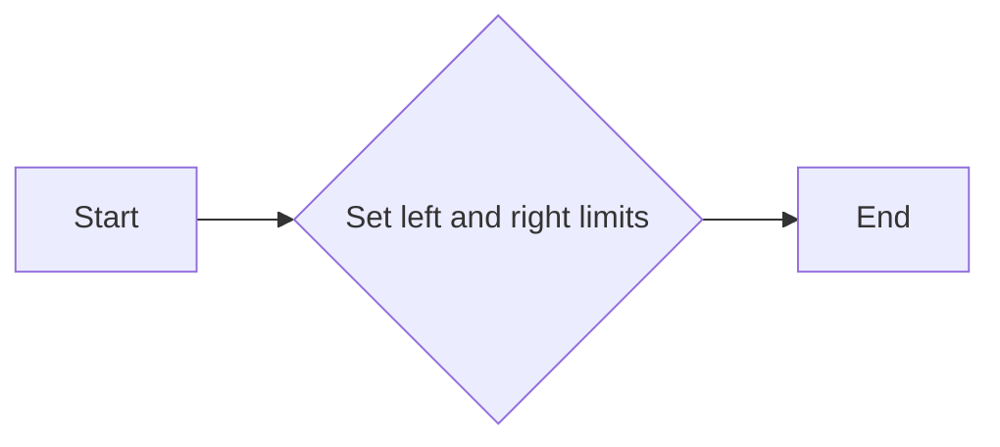

#### 带注释源码

```python
# Creating figure and axis.
fig = plt.figure(figsize=(7, 7))
ax = fig.add_axes((0.01, 0.01, 0.98, 0.90),
                  facecolor="white", frameon=True)
# Set x-axis limits to 0 and 1
ax.set_xlim(0, 1)
```


### matplotlib.pyplot.set_ylim

matplotlib.pyplot.set_ylim 是一个用于设置当前轴的 y 轴限制的全局函数。

参数：

- `vmin`：`float` 或 `None`，表示 y 轴的最小值。
- `vmax`：`float` 或 `None`，表示 y 轴的最大值。

返回值：无

#### 流程图

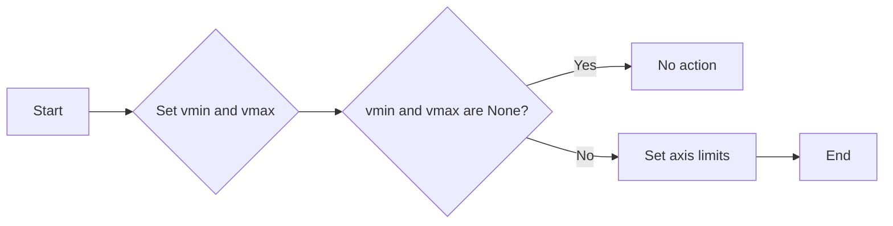

#### 带注释源码

```python
def set_ylim(vmin=None, vmax=None):
    """
    Set the y-axis limits of the current axis.

    Parameters
    ----------
    vmin : float or None, optional
        The minimum y-axis value. If None, the current minimum is kept.
    vmax : float or None, optional
        The maximum y-axis value. If None, the current maximum is kept.

    Returns
    -------
    None
    """
    ax = gca()
    ax.set_ylim(vmin, vmax)
```


### matplotlib.pyplot.set_title

设置当前轴的标题。

参数：

- `title`：`str`，标题文本
- `loc`：`str`，标题位置，默认为'center'，可选值包括'left', 'right', 'center', 'upper left', 'upper right', 'lower left', 'lower right'
- `pad`：`float`，标题与轴边缘的距离，默认为3.0
- `fontsize`：`float`，标题字体大小，默认为10.0
- `fontweight`：`str`，标题字体粗细，默认为'normal'，可选值包括'normal', 'bold', 'italic', 'light', 'dark'
- `color`：`str`，标题颜色，默认为'black'
- `verticalalignment`：`str`，垂直对齐方式，默认为'bottom'，可选值包括'bottom', 'middle', 'top'
- `horizontalalignment`：`str`，水平对齐方式，默认为'center'，可选值包括'left', 'right', 'center'

返回值：`None`

#### 流程图

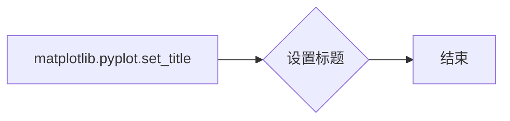

#### 带注释源码

```python
import matplotlib.pyplot as plt

# 创建一个图形和轴
fig, ax = plt.subplots()

# 设置标题
ax.set_title("示例标题", fontsize=14, color='red')

# 显示图形
plt.show()
```


### matplotlib.pyplot.set_xticks

matplotlib.pyplot.set_xticks 是一个用于设置 x 轴刻度的函数。

参数：

- `ticks`：`array_like`，指定 x 轴的刻度值。
- `labels`：`array_like`，可选，指定每个刻度的标签。如果未提供，则使用默认的标签。

返回值：无

#### 流程图

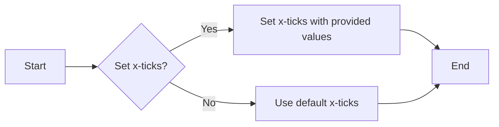

#### 带注释源码

```python
def set_xticks(self, ticks=None, labels=None):
    """
    Set the x-ticks of the axes.

    Parameters
    ----------
    ticks : array_like, optional
        The x-ticks to use. If not provided, the current x-ticks are used.
    labels : array_like, optional
        The labels for each x-tick. If not provided, default labels are used.

    Returns
    -------
    None
    """
    # Implementation details are omitted for brevity.
    pass
```


### matplotlib.pyplot.set_yticks

matplotlib.pyplot.set_yticks 是一个用于设置 y 轴刻度的函数。

参数：

- `ticks`：`array_like`，指定 y 轴的刻度值。

返回值：无

#### 流程图

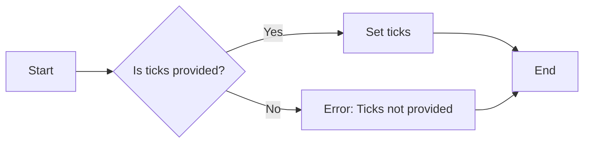

#### 带注释源码

```python
def set_yticks(ticks=None):
    """
    Set the y-axis ticks.

    Parameters
    ----------
    ticks : array_like, optional
        The y-axis ticks. If not provided, the current ticks are used.

    Returns
    -------
    None
    """
    # Set the y-axis ticks
    self._ax.set_yticks(ticks)
```


### matplotlib.pyplot.annotate

matplotlib.pyplot.annotate 是一个用于在 matplotlib 图形上添加文本标注的函数。

参数：

- `s`：`str`，要添加的文本内容。
- `xy`：`tuple`，文本标注的位置，格式为 `(x, y)`。
- `color`：`str` 或 `tuple`，文本的颜色。
- `ha`：`str`，水平对齐方式，可以是 'left', 'center', 'right'。
- `fontsize`：`int` 或 `float`，文本的大小。

返回值：`Text` 对象，表示添加的文本标注。

#### 流程图

```mermaid
graph LR
A[Start] --> B{Call matplotlib.pyplot.annotate()}
B --> C[End]
```

#### 带注释源码

```python
ax.annotate(full_demo,
            xy=(0.5, 1. - 0.59 * line_axesfrac),
            color='tab:orange', ha='center', fontsize=20)
```

在这个例子中，`annotate` 函数被用来在图形上添加一个文本标注，文本内容为 `full_demo`，位置在 `(0.5, 1. - 0.59 * line_axesfrac)`，颜色为 'tab:orange'，水平对齐方式为 'center'，文本大小为 20。


### matplotlib.pyplot.axhspan

matplotlib.pyplot.axhspan is a method used to draw a horizontal span on an axes object.

参数：

- `ymin`：`float`，The lower y-coordinate of the span.
- `ymax`：`float`，The upper y-coordinate of the span.
- `color`：`color`，The color of the span.
- `alpha`：`float`，The alpha value of the span.
- `zorder`：`int`，The zorder of the span.
- `clip_on`：`bool`，Whether to clip the span to the axes.
- `transform`：`Transform`，The transform to use for the span.

参数描述：

- `ymin`：指定水平跨度下限的y坐标。
- `ymax`：指定水平跨度上限的y坐标。
- `color`：指定水平跨度的颜色。
- `alpha`：指定水平跨度的透明度。
- `zorder`：指定水平跨度的z顺序。
- `clip_on`：指定是否将水平跨度裁剪到轴上。
- `transform`：指定用于跨度的变换。

返回值：`None`

返回值描述：该方法不返回任何值。

#### 流程图

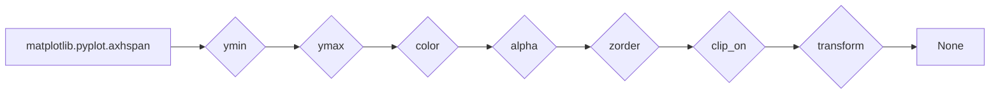

#### 带注释源码

```python
ax.axhspan(baseline, baseline_next, color=fill_color, alpha=0.2)
```

在这段代码中，`ax.axhspan(baseline, baseline_next, color=fill_color, alpha=0.2)` 调用用于在轴 `ax` 上绘制一个从 `baseline` 到 `baseline_next` 的水平跨度，颜色为 `fill_color`，透明度为 `0.2`。


### matplotlib.pyplot.show

matplotlib.pyplot.show 是一个全局函数，用于显示当前图形。

参数：

- 无

返回值：无

#### 流程图

```mermaid
graph LR
A[Start] --> B[Call matplotlib.pyplot.show]
B --> C[Display the plot]
C --> D[End]
```

#### 带注释源码

```python
# 在 doall 函数的最后调用
plt.show()
```


### matplotlib.pyplot.figure

matplotlib.pyplot.figure 是一个全局函数，用于创建一个新的图形。

参数：

- figsize：`tuple`，图形的宽度和高度（英寸）
- dpi：`int`，图形的分辨率（点每英寸）
- facecolor：`color`，图形的背景颜色
- frameon：`bool`，是否显示图形的边框

返回值：`Figure` 对象

#### 流程图

```mermaid
graph LR
A[Start] --> B[Call matplotlib.pyplot.figure]
B --> C[Create a new Figure object]
C --> D[End]
```

#### 带注释源码

```python
fig = plt.figure(figsize=(7, 7))
```


### matplotlib.pyplot.axes

matplotlib.pyplot.axes 是一个全局函数，用于创建一个新的轴。

参数：

- fig：`Figure` 对象，图形对象
- rect：`tuple`，轴的位置和大小（左，下，宽，高）
- facecolor：`color`，轴的背景颜色
- frameon：`bool`，是否显示轴的边框

返回值：`Axes` 对象

#### 流程图

```mermaid
graph LR
A[Start] --> B[Call matplotlib.pyplot.axes]
B --> C[Create a new Axes object]
C --> D[End]
```

#### 带注释源码

```python
ax = fig.add_axes((0.01, 0.01, 0.98, 0.90),
                  facecolor="white", frameon=True)
```


### matplotlib.pyplot.annotate

matplotlib.pyplot.annotate 是一个全局函数，用于在图形上添加文本注释。

参数：

- s：`str`，要显示的文本
- xy：`tuple`，文本的位置
- color：`color`，文本的颜色
- ha：`str`，水平对齐方式
- fontsize：`int`，文本的大小

返回值：`Text` 对象

#### 流程图

```mermaid
graph LR
A[Start] --> B[Call matplotlib.pyplot.annotate]
B --> C[Add text annotation to the plot]
C --> D[End]
```

#### 带注释源码

```python
ax.annotate(full_demo,
            xy=(0.5, 1. - 0.59 * line_axesfrac),
            color='tab:orange', ha='center', fontsize=20)
```


### matplotlib.pyplot.axhspan

matplotlib.pyplot.axhspan 是一个全局函数，用于在轴上添加一个水平填充区域。

参数：

- ax：`Axes` 对象，轴对象
- y0：`float`，填充区域的起始y坐标
- y1：`float`，填充区域的结束y坐标
- color：`color`，填充区域的颜色
- alpha：`float`，填充区域的透明度

返回值：`Patch` 对象

#### 流程图

```mermaid
graph LR
A[Start] --> B[Call matplotlib.pyplot.axhspan]
B --> C[Add a horizontal span to the axis]
C --> D[End]
```

#### 带注释源码

```python
ax.axhspan(baseline, baseline_next, color=fill_color, alpha=0.2)
```


### matplotlib.pyplot.title

matplotlib.pyplot.title 是一个全局函数，用于设置图形的标题。

参数：

- s：`str`，标题文本
- color：`color`，标题的颜色
- fontsize：`int`，标题的大小
- weight：`str`，标题的粗细

返回值：无

#### 流程图

```mermaid
graph LR
A[Start] --> B[Call matplotlib.pyplot.title]
B --> C[Set the title of the plot]
C --> D[End]
```

#### 带注释源码

```python
ax.set_title("Matplotlib's math rendering engine",
             color=mpl_grey_rgb, fontsize=14, weight='bold')
```


### matplotlib.pyplot.xlim

matplotlib.pyplot.xlim 是一个全局函数，用于设置轴的x轴限制。

参数：

- x0：`float`，x轴的起始限制
- x1：`float`，x轴的结束限制

返回值：无

#### 流程图

```mermaid
graph LR
A[Start] --> B[Call matplotlib.pyplot.xlim]
B --> C[Set the x-axis limits of the axis]
C --> D[End]
```

#### 带注释源码

```python
ax.set_xlim(0, 1)
```


### matplotlib.pyplot.ylim

matplotlib.pyplot.ylim 是一个全局函数，用于设置轴的y轴限制。

参数：

- y0：`float`，y轴的起始限制
- y1：`float`，y轴的结束限制

返回值：无

#### 流程图

```mermaid
graph LR
A[Start] --> B[Call matplotlib.pyplot.ylim]
B --> C[Set the y-axis limits of the axis]
C --> D[End]
```

#### 带注释源码

```python
ax.set_ylim(0, 1)
```


### matplotlib.pyplot.xticks

matplotlib.pyplot.xticks 是一个全局函数，用于设置轴的x轴刻度。

参数：

- ticks：`list`，x轴刻度值
- labels：`list`，x轴刻度标签

返回值：无

#### 流程图

```mermaid
graph LR
A[Start] --> B[Call matplotlib.pyplot.xticks]
B --> C[Set the x-axis ticks of the axis]
C --> D[End]
```

#### 带注释源码

```python
ax.set_xticks([])
```


### matplotlib.pyplot.yticks

matplotlib.pyplot.yticks 是一个全局函数，用于设置轴的y轴刻度。

参数：

- ticks：`list`，y轴刻度值
- labels：`list`，y轴刻度标签

返回值：无

#### 流程图

```mermaid
graph LR
A[Start] --> B[Call matplotlib.pyplot.yticks]
B --> C[Set the y-axis ticks of the axis]
C --> D[End]
```

#### 带注释源码

```python
ax.set_yticks([])
```


### matplotlib.pyplot.text

matplotlib.pyplot.text 是一个全局函数，用于在图形上添加文本。

参数：

- s：`str`，要显示的文本
- xy：`tuple`，文本的位置
- color：`color`，文本的颜色
- ha：`str`，水平对齐方式
- fontsize：`int`，文本的大小

返回值：`Text` 对象

#### 流程图

```mermaid
graph LR
A[Start] --> B[Call matplotlib.pyplot.text]
B --> C[Add text to the plot]
C --> D[End]
```

#### 带注释源码

```python
ax.text(0.06, baseline - 0.3 * line_axesfrac,
        f'{title}:',
        color=mpl_grey_rgb, weight='bold')
```


### matplotlib.pyplot.grid

matplotlib.pyplot.grid 是一个全局函数，用于在图形上添加网格。

参数：

- visible：`bool`，是否显示网格
- which：`str`，显示哪些网格（major, minor, both）

返回值：无

#### 流程图

```mermaid
graph LR
A[Start] --> B[Call matplotlib.pyplot.grid]
B --> C[Add a grid to the plot]
C --> D[End]
```

#### 带注释源码

```python
ax.grid(visible=False)
```


### matplotlib.pyplot.savefig

matplotlib.pyplot.savefig 是一个全局函数，用于保存图形到文件。

参数：

- filename：`str`，保存的文件名
- dpi：`int`，图形的分辨率（点每英寸）
- bbox_inches：`str`，裁剪边界框

返回值：无

#### 流程图

```mermaid
graph LR
A[Start] --> B[Call matplotlib.pyplot.savefig]
B --> C[Save the plot to a file]
C --> D[End]
```

#### 带注释源码

```python
plt.savefig("plot.png", dpi=300)
```


### matplotlib.pyplot.close

matplotlib.pyplot.close 是一个全局函数，用于关闭图形。

参数：

- fig：`Figure` 对象，图形对象

返回值：无

#### 流程图

```mermaid
graph LR
A[Start] --> B[Call matplotlib.pyplot.close]
B --> C[Close the plot]
C --> D[End]
```

#### 带注释源码

```python
plt.close(fig)
```


### matplotlib.pyplot.tight_layout

matplotlib.pyplot.tight_layout 是一个全局函数，用于自动调整子图参数，使之填充整个图像区域。

参数：

- pad：`float`，子图之间的间距
- h_pad：`float`，水平间距
- w_pad：`float`，垂直间距

返回值：无

#### 流程图

```mermaid
graph LR
A[Start] --> B[Call matplotlib.pyplot.tight_layout]
B --> C[Adjust the layout of the plot]
C --> D[End]
```

#### 带注释源码

```python
plt.tight_layout()
```


### matplotlib.pyplot.show

matplotlib.pyplot.show 是一个全局函数，用于显示当前图形。

参数：

- blit：`bool`，是否使用blit模式

返回值：无

#### 流程图

```mermaid
graph LR
A[Start] --> B[Call matplotlib.pyplot.show]
B --> C[Display the plot]
C --> D[End]
```

#### 带注释源码

```python
plt.show()
```


### matplotlib.pyplot.subplot

matplotlib.pyplot.subplot 是一个全局函数，用于创建一个新的子图。

参数：

- nrows：`int`，子图行数
- ncols：`int`，子图列数
- index：`int`，子图的索引

返回值：`Axes` 对象

#### 流程图

```mermaid
graph LR
A[Start] --> B[Call matplotlib.pyplot.subplot]
B --> C[Create a new subplot]
C --> D[End]
```

#### 带注释源码

```python
ax = plt.subplot(1, 1, 1)
```


### matplotlib.pyplot.plot

matplotlib.pyplot.plot 是一个全局函数，用于在图形上绘制线条。

参数：

- x：`array_like`，x轴数据
- y：`array_like`，y轴数据
- color：`color`，线条颜色
- linestyle：`str`，线条样式
- linewidth：`float`，线条宽度

返回值：`Line2D` 对象

#### 流程图

```mermaid
graph LR
A[Start] --> B[Call matplotlib.pyplot.plot]
B --> C[Plot a line on the plot]
C --> D[End]
```

#### 带注释源码

```python
ax.plot(x, y, color='blue', linestyle='-', linewidth=2)
```


### matplotlib.pyplot.scatter

matplotlib.pyplot.scatter 是一个全局函数，用于在图形上绘制散点图。

参数：

- x：`array_like`，x轴数据
- y：`array_like`，y轴数据
- s：`array_like`，散点的大小
- c：`array_like`，散点的颜色
- marker：`str`，散点的标记
- alpha：`float`，散点的透明度

返回值：`Scatter` 对象

#### 流程图

```mermaid
graph LR
A[Start] --> B[Call matplotlib.pyplot.scatter]
B --> C[Plot a scatter plot on the plot]
C --> D[End]
```

#### 带注释源码

```python
ax.scatter(x, y, s=sizes, c=colors, marker='o', alpha=0.5)
```


### matplotlib.pyplot.bar

matplotlib.pyplot.bar 是一个全局函数，用于在图形上绘制条形图。

参数：

- x：`array_like`，条形图的x轴位置
- height：`array_like`，条形图的高度
- width：`float`，条形图的宽度
- bottom：`float`，条形图的底部位置

返回值：`BarContainer` 对象

#### 流程图

```mermaid
graph LR
A[Start] --> B[Call matplotlib.pyplot.bar]
B --> C[Plot a bar plot on the plot]
C --> D[End]
```

#### 带注释源码

```python
ax.bar(x, height, width, bottom)
```


### matplotlib.pyplot.pie

matplotlib.pyplot.pie 是一个全局函数，用于在图形上绘制饼图。

参数：

- x：`array_like`，饼图的x轴数据
- y：`array_like`，饼图的y轴数据
- labels：`array_like`，饼图的标签
- autopct：`str`，饼图中的百分比格式

返回值：`Pie` 对象

#### 流程图

```mermaid
graph LR
A[Start] --> B[Call matplotlib.pyplot.pie]
B --> C[Plot a pie plot on the plot]
C --> D[End]
```

#### 带注释源码

```python
ax.pie(x, labels=labels, autopct='%1.1f%%')
```


### matplotlib.pyplot.hist

matplotlib.pyplot.hist 是一个全局函数，用于在图形上绘制直方图。

参数：

- x：`array_like`，直方图的x轴数据
- bins：`int`，直方图的条形数
- color：`color`，直方图的条形颜色
- edgecolor：`color`，直方图的边框颜色

返回值：`BinnedArray` 对象

#### 流程图

```mermaid
graph LR
A[Start] --> B[Call matplotlib.pyplot.hist]
B --> C[Plot a histogram on the plot]
C --> D[End]
```

#### 带注释源码

```python
ax.hist(x, bins=bins, color='blue', edgecolor='black')
```


### matplotlib.pyplot.imshow

matplotlib.pyplot.imshow 是一个全局函数，用于在图形上绘制图像。

参数：

- data：`array_like`，图像数据
- cmap：`str`，颜色映射
- interpolation：`str`，插值方法

返回值：`AxesImage` 对象

#### 流程图

```mermaid
graph LR
A[Start] --> B[Call matplotlib.pyplot.imshow]
B --> C[Plot an image on the plot]
C --> D[End]
```

#### 带注释源码

```python
ax.imshow(data, cmap='gray', interpolation='nearest')
```


### matplotlib.pyplot.colorbar

matplotlib.pyplot.colorbar 是一个全局函数，用于在图形上添加颜色条。

参数：

- mappable：`Mappable` 对象，颜色映射对象
- ax：`Axes` 对象，轴对象
- orientation：`str`，颜色条的方向
- aspect：`float`，颜色条的宽度

返回值：`Colorbar` 对象

#### 流程图

```mermaid
graph LR
A[Start] --> B[Call matplotlib.pyplot.colorbar]
B --> C[Add a colorbar to the plot]
C --> D[End]
```

#### 带注释源码

```python
cbar = plt.colorbar(mappable, ax=ax, orientation='vertical', aspect=20)
```


### matplotlib.pyplot.legend

matplotlib.pyplot.legend 是一个全局函数，用于在图形上添加图例。

参数：

- handles：`list`，图例的句柄
- labels：`list`，图例的标签
- loc：`str`，图例的位置
- bbox_to_anchor：`tuple`，图例的锚点位置

返回值：`Legend` 对象

#### 流程图

```mermaid
graph LR
A[Start] --> B[Call matplotlib.pyplot.legend]
B --> C[Add a legend to the plot]
C --> D[End]
```

#### 带注释源码

```python
ax.legend(handles, labels, loc='upper left', bbox_to_anchor=(1, 1))
```


### matplotlib.pyplot.tight_layout

matplotlib.pyplot.tight_layout 是一个全局函数，用于自动调整子图参数，使之填充整个图像区域。

参数：

- pad：`float`，子图之间的间距
- h_pad：`float`，水平间距
- w_pad：`float`，垂直间距

返回值：无

#### 流程图

```mermaid
graph LR
A[Start] --> B[Call matplotlib.pyplot.tight_layout]
B --> C[Adjust the layout of the plot]
C --> D[End]
```

#### 带注释源码

```python
plt.tight_layout()
```


### matplotlib.pyplot.show

matplotlib.pyplot.show 是一个全局函数，用于显示当前图形。

参数：

- blit：`bool`，是否使用blit模式

返回值：无

#### 流程图

```mermaid
graph LR
A[Start] --> B[Call matplotlib.pyplot.show]
B --> C[Display the plot]
C --> D[End]
```

#### 带注释源码

```python
plt.show()
```


### matplotlib.pyplot.subplot

matplotlib.pyplot.subplot 是一个全局函数，用于创建一个新的子图。

参数：

- nrows：`int`，子图行数
- ncols：`int`，子图列数
- index：`int`，子图的索引

返回值：`Axes` 对象

#### 流程图

```mermaid
graph LR
A[Start] --> B[Call matplotlib.pyplot.subplot]
B --> C[Create a new subplot]
C --> D[End]
```

#### 带注释源码

```python
ax = plt.subplot(1, 1, 1)
```


### matplotlib.pyplot.plot

matplotlib.pyplot.plot 是一个全局函数，用于在图形上绘制线条。

参数：

- x：`array_like`，x轴数据
- y：`array_like`，y轴数据
- color：`color`，线条颜色
- linestyle：`str`，线条样式
- linewidth：`float`


### subprocess.call

`subprocess.call` is a function used to run a command in a new subprocess.

参数：

- `["pdflatex", "mathtext_examples.ltx"]`：`list`，A list of arguments to be passed to the subprocess. The first element is the command to execute, and the subsequent elements are the arguments to that command. In this case, it runs the `pdflatex` command with the `mathtext_examples.ltx` file as an argument.

返回值：`None`，The return value is `None` since `subprocess.call` does not return any value.

#### 流程图

```mermaid
graph LR
A[Start] --> B[Check if --latex in sys.argv]
B -- Yes --> C[Open file "mathtext_examples.ltx"]
C --> D[Write LaTeX document]
D --> E[Run pdflatex]
E --> F[End]
B -- No --> G[Call doall()]
G --> F
```

#### 带注释源码

```python
if '--latex' in sys.argv:
    # Run: python mathtext_examples.py --latex
    # Need amsmath and amssymb packages.
    with open("mathtext_examples.ltx", "w") as fd:
        fd.write("\\documentclass{article}\n")
        fd.write("\\usepackage{amsmath, amssymb}\n")
        fd.write("\\begin{document}\n")
        fd.write("\\begin{enumerate}\n")

        for s in mathtext_demos.values():
            s = re.sub(r"(?<!\\)\$", "$$", s)
            fd.write("\\item %s\n" % s)

        fd.write("\\end{enumerate}\n")
        fd.write("\\end{document}\n")

    subprocess.call(["pdflatex", "mathtext_examples.ltx"])
else:
    doall()
```


## 关键组件


### 张量索引与惰性加载

张量索引与惰性加载是数学表达式中处理大型数据结构的关键组件，允许在需要时才计算数据，从而提高效率。

### 反量化支持

反量化支持是数学表达式中处理变量和参数的关键组件，允许在表达式中使用未知的量化变量。

### 量化策略

量化策略是数学表达式中处理数值计算的关键组件，决定了如何将数学表达式转换为数值结果。


## 问题及建议


### 核心功能描述
该代码的核心功能是展示Matplotlib的数学表达式渲染功能，通过在图形界面上显示一系列数学公式和表达式，展示Matplotlib在数学渲染方面的能力。

### 文件整体运行流程
1. 导入必要的库，包括matplotlib.pyplot、re、subprocess和sys。
2. 定义一个包含数学表达式的字典`mathtext_demos`。
3. 定义一个函数`doall()`，用于在图形界面上展示数学表达式。
4. 检查命令行参数，如果包含`--latex`，则生成LaTeX文件并编译为PDF。
5. 如果不包含`--latex`，则调用`doall()`函数。

### 类的详细信息
该代码中没有定义类。

### 全局变量和全局函数的详细信息
#### 全局变量
- `mathtext_demos`: 字典，包含数学表达式的示例。
- `mpl_grey_rgb`: 元组，表示matplotlib文档中使用的灰色RGB值。

#### 全局函数
- `doall()`: 无参数，展示数学表达式。
  - 参数：无
  - 返回值：无
  - 描述：创建图形界面，展示数学表达式。
  - Mermaid流程图：
    ```mermaid
    graph TD
    A[Start] --> B[Create figure and axis]
    B --> C[Set title and limits]
    C --> D[Plot header demonstration formula]
    D --> E[Loop through demos]
    E --> F[Plot feature demonstration formulae]
    F --> G[End]
    ```
  - 带注释源码：
    ```python
    def doall():
        # Creating figure and axis.
        fig = plt.figure(figsize=(7, 7))
        ax = fig.add_axes((0.01, 0.01, 0.98, 0.90),
                          facecolor="white", frameon=True)
        ax.set_xlim(0, 1)
        ax.set_ylim(0, 1)
        ax.set_title("Matplotlib's math rendering engine",
                     color=mpl_grey_rgb, fontsize=14, weight='bold')
        ax.set_xticks([])
        ax.set_yticks([])

        # Plot header demonstration formula.
        full_demo = mathtext_demos['Header demo']
        ax.annotate(full_demo,
                    xy=(0.5, 1. - 0.59 * line_axesfrac),
                    color='tab:orange', ha='center', fontsize=20)

        # Plot feature demonstration formulae.
        for i_line, (title, demo) in enumerate(mathtext_demos.items()):
            if i_line == 0:
                continue

            baseline = 1 - i_line * line_axesfrac
            baseline_next = baseline - line_axesfrac
            fill_color = ['white', 'tab:blue'][i_line % 2]
            ax.axhspan(baseline, baseline_next, color=fill_color, alpha=0.2)
            ax.annotate(f'{title}:',
                        xy=(0.06, baseline - 0.3 * line_axesfrac),
                        color=mpl_grey_rgb, weight='bold')
            ax.annotate(demo,
                        xy=(0.04, baseline - 0.75 * line_axesfrac),
                        color=mpl_grey_rgb, fontsize=16)

        plt.show()
    ```

### 关键组件信息
- `matplotlib.pyplot`: 用于创建图形界面和渲染数学表达式。
- `subprocess`: 用于调用外部程序，如pdflatex。

### 潜在的技术债务或优化空间
- **代码复用性**：`doall()`函数中的代码可以封装成类或模块，以提高代码复用性。
- **错误处理**：代码中没有错误处理机制，对于可能出现的异常情况（如文件操作失败）没有进行处理。
- **性能优化**：对于包含大量数学表达式的展示，可以考虑使用更高效的数据结构和算法来优化渲染性能。

### 已知问题
- 代码中没有错误处理机制。
- 代码复用性较低。

### 优化建议
- 添加错误处理机制，以处理可能出现的异常情况。
- 将`doall()`函数封装成类或模块，以提高代码复用性。
- 考虑使用更高效的数据结构和算法来优化渲染性能。


## 其它


### 设计目标与约束

- 设计目标：
  - 提供一个模块，用于展示Matplotlib的数学表达式渲染功能。
  - 支持多种数学表达式的格式和样式。
  - 支持生成LaTeX代码，以便在文档中使用数学表达式。

- 约束：
  - 必须使用Matplotlib库进行渲染。
  - 必须支持LaTeX代码生成，但不需要实现完整的LaTeX编译过程。
  - 代码应具有良好的可读性和可维护性。

### 错误处理与异常设计

- 错误处理：
  - 当输入的数学表达式格式不正确时，应抛出异常。
  - 当LaTeX代码生成失败时，应记录错误信息并返回错误代码。

- 异常设计：
  - 定义自定义异常类，如`MathExpressionError`和`LaTeXGenerationError`。
  - 在关键操作中捕获并处理这些异常。

### 数据流与状态机

- 数据流：
  - 输入：数学表达式字符串。
  - 处理：解析数学表达式，生成渲染结果或LaTeX代码。
  - 输出：渲染结果或LaTeX代码。

- 状态机：
  - 无状态机，因为代码逻辑是线性的。

### 外部依赖与接口契约

- 外部依赖：
  - Matplotlib库：用于渲染数学表达式。
  - subprocess模块：用于调用外部LaTeX编译器。

- 接口契约：
  - `doall()`函数：负责渲染所有数学表达式并显示结果。
  - `subprocess.call()`：用于调用外部LaTeX编译器。


    