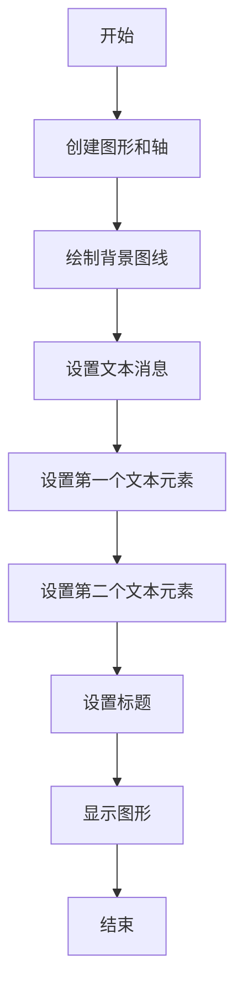
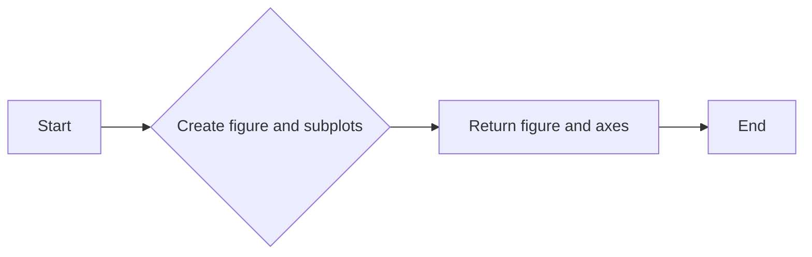
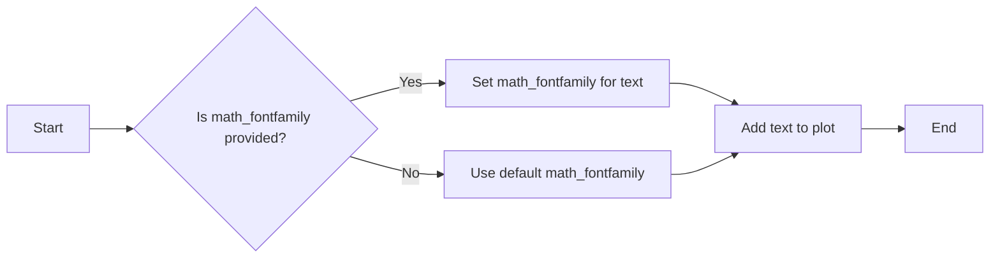
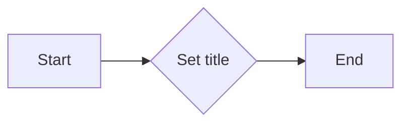
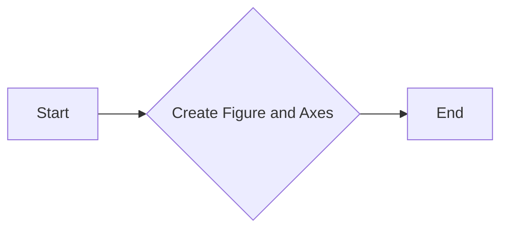
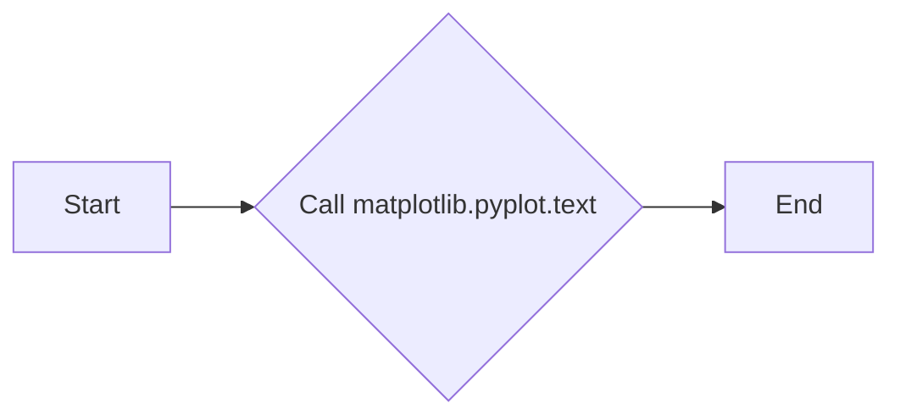

# `matplotlib\galleries\examples\text_labels_and_annotations\mathtext_fontfamily_example.py` 详细设计文档

This code demonstrates the use of the 'math_fontfamily' parameter in matplotlib to change the font family for mathematical expressions in a plot.

## 整体流程



## 类结构

```
matplotlib.pyplot (matplotlib 库)
├── fig, ax = plt.subplots(figsize=(6, 5))
│   ├── fig
│   └── ax
├── ax.plot(range(11), color="0.9")
├── msg = (r"Normal Text. $Text\ in\ math\ mode:\ \int_{0}^{\infty } x^2 dx$")
│   ├── msg
├── ax.text(1, 7, msg, size=12, math_fontfamily='cm')
│   ├── ax.text(1, 3, msg, size=12, math_fontfamily='dejavuserif')
│   └── ax.set_title(r"$Title\ in\ math\ mode:\ \int_{0}^{\infty } x^2 dx$", math_fontfamily='stixsans', size=14)
└── plt.show()
```

## 全局变量及字段


### `fig`
    
A matplotlib figure object representing the entire plot.

类型：`matplotlib.figure.Figure`
    


### `ax`
    
An axes object representing a single plot in a figure.

类型：`matplotlib.axes._subplots.AxesSubplot`
    


### `msg`
    
A string containing both normal text and math text to be displayed in the plot.

类型：`str`
    


### `matplotlib.pyplot.fig`
    
The figure object used for the plot.

类型：`matplotlib.figure.Figure`
    


### `matplotlib.pyplot.ax`
    
The axes object used for the plot.

类型：`matplotlib.axes._subplots.AxesSubplot`
    


### `matplotlib.pyplot.subplots`
    
A method to create a figure and a set of subplots.

类型：`tuple`
    


### `matplotlib.pyplot.plot`
    
A method to create a line plot.

类型：`matplotlib.axes._subplots.AxesSubplot`
    


### `matplotlib.pyplot.text`
    
A method to add text to the plot.

类型：`matplotlib.text.Text`
    


### `matplotlib.pyplot.set_title`
    
A method to set the title of the plot.

类型：`None`
    


### `matplotlib.pyplot.show`
    
A method to display the plot.

类型：`None`
    
    

## 全局函数及方法


### subplots

`subplots` is a function used to create a figure and a set of subplots (axes) in a single call.

参数：

- `figsize`：`tuple`，指定图形的大小，例如 `(6, 5)` 表示宽度为 6 英寸，高度为 5 英寸。

返回值：`fig`：`matplotlib.figure.Figure`，图形对象；`ax`：`matplotlib.axes.Axes`，子图对象。

#### 流程图



#### 带注释源码

```python
import matplotlib.pyplot as plt

fig, ax = plt.subplots(figsize=(6, 5))
```


### plot

This function demonstrates the usage of the `math_fontfamily` parameter in matplotlib to change the font family for individual text elements in a plot.

参数：

- `range(11)`：`range`，A range object representing a sequence of numbers from 0 to 10.
- `color="0.9"`：`str`，The color of the plot line.
- `msg`：`str`，The message containing both normal text and math text.
- `size=12`：`int`，The size of the text.
- `math_fontfamily='cm'`：`str`，The font family for the math text.
- `msg`：`str`，The message containing both normal text and math text.
- `math_fontfamily='dejavuserif'`：`str`，The font family for the math text.
- `r"$Title\ in\ math\ mode:\ \int_{0}^{\infty } x^2 dx$"`：`str`，The title of the plot with math text.
- `math_fontfamily='stixsans'`：`str`，The font family for the math text.
- `size=14`：`int`，The size of the title text.

返回值：`None`，This function does not return any value.

#### 流程图


#### 带注释源码

```
"""
===============
Math fontfamily
===============

A simple example showcasing the new *math_fontfamily* parameter that can
be used to change the family of fonts for each individual text
element in a plot.

If no parameter is set, the global value
:rc:`mathtext.fontset` will be used.
"""

import matplotlib.pyplot as plt

fig, ax = plt.subplots(figsize=(6, 5))

# A simple plot for the background.
ax.plot(range(11), color="0.9")

# A text mixing normal text and math text.
msg = (r"Normal Text. $Text\ in\ math\ mode:\ "
       r"\int_{0}^{\infty } x^2 dx$")

# Set the text in the plot.
ax.text(1, 7, msg, size=12, math_fontfamily='cm')

# Set another font for the next text.
ax.text(1, 3, msg, size=12, math_fontfamily='dejavuserif')

# *math_fontfamily* can be used in most places where there is text,
# like in the title:
ax.set_title(r"$Title\ in\ math\ mode:\ \int_{0}^{\infty } x^2 dx$",
             math_fontfamily='stixsans', size=14)

# Note that the normal text is not changed by *math_fontfamily*.
plt.show()
```


### matplotlib.pyplot.text

matplotlib.pyplot.text is a method used to add text to a plot.

参数：

- `x`：`float`，指定文本的x坐标。
- `y`：`float`，指定文本的y坐标。
- `s`：`str`，要添加的文本字符串。
- `size`：`float`，文本的大小。
- `math_fontfamily`：`str`，指定用于数学文本的字体家族。

返回值：`Text`，返回添加到轴上的文本对象。

#### 流程图



#### 带注释源码

```python
ax.text(1, 7, msg, size=12, math_fontfamily='cm')
```

在这个例子中，`ax.text` 方法被用来在坐标 (1, 7) 处添加文本 `msg`，文本大小为 12，并且指定了数学文本的字体家族为 'cm'。如果 `math_fontfamily` 参数没有被提供，那么将使用默认的数学文本字体家族。


### ax.set_title

`ax.set_title` 是一个用于设置图表标题的方法。

参数：

- `title`：`str`，标题文本，可以是普通文本或数学公式。
- `fontname`：`str`，字体名称，默认为全局设置 `rc.mathtext.fontset`。
- `size`：`int`，字体大小。

返回值：无

#### 流程图



#### 带注释源码

```python
# Set the title in the math mode with a specific font family.
ax.set_title(
    r"$Title\ in\ math\ mode:\ \int_{0}^{\infty } x^2 dx$",  # Title text in math mode
    math_fontfamily='stixsans',  # Font family for math text
    size=14  # Font size
)
```


### plt.show()

显示matplotlib图形的窗口。

参数：

- 无

返回值：无

#### 流程图


#### 带注释源码

```python
plt.show()
```


### ax.text()

在轴上添加文本。

参数：

- x：`float`，文本的x坐标。
- y：`float`，文本的y坐标。
- msg：`str`，要显示的文本消息。
- size：`int`，文本的大小。
- math_fontfamily：`str`，数学文本的字体家族。

返回值：`matplotlib.text.Text`，添加的文本对象。

#### 流程图


#### 带注释源码

```python
ax.text(1, 7, msg, size=12, math_fontfamily='cm')
```


### ax.set_title()

设置轴的标题。

参数：

- title：`str`，标题文本。
- size：`int`，标题的大小。
- math_fontfamily：`str`，数学文本的字体家族。

返回值：无

#### 流程图


#### 带注释源码

```python
ax.set_title(r"$Title\ in\ math\ mode:\ \int_{0}^{\infty } x^2 dx$", math_fontfamily='stixsans', size=14)
```


### plt.subplots

`subplots` 是 `matplotlib.pyplot` 模块中的一个函数，用于创建一个图形和一个轴（或多个轴）。

参数：

- `figsize`：`tuple`，指定图形的大小（宽度和高度）。
  - 描述：图形的大小，以英寸为单位。
- `*args` 和 `**kwargs`：用于传递其他参数给 `matplotlib.figure.Figure` 构造函数。

返回值：`Figure` 对象和 `Axes` 对象。
- 描述：`Figure` 对象代表整个图形，而 `Axes` 对象代表图形中的一个轴。

#### 流程图



#### 带注释源码

```python
import matplotlib.pyplot as plt

fig, ax = plt.subplots(figsize=(6, 5))
```


### matplotlib.pyplot.plot

matplotlib.pyplot.plot 是一个用于绘制二维线条图的函数。

参数：

- `range(11)`：`int`，一个整数序列，表示x轴的数据点。
- `color="0.9"`：`str`，表示线条的颜色，这里使用灰度值。

返回值：`None`，该函数不返回任何值，它直接在matplotlib图形中绘制线条。

#### 流程图


#### 带注释源码

```
import matplotlib.pyplot as plt

fig, ax = plt.subplots(figsize=(6, 5))

# A simple plot for the background.
ax.plot(range(11), color="0.9")
```


### matplotlib.pyplot.text

The `matplotlib.pyplot.text` function is used to add text annotations to a plot in Matplotlib.

参数：

- `x`：`float`，指定文本的x坐标。
- `y`：`float`，指定文本的y坐标。
- `s`：`str`，要添加的文本字符串。
- `fontdict`：`dict`，指定文本的字体属性，如字体大小、颜色等。
- `transform`：`Transform`，指定文本的坐标系统。
- `horizontalalignment`：`str`，指定文本的水平对齐方式。
- `verticalalignment`：`str`，指定文本的垂直对齐方式。
- `color`：`color`，指定文本的颜色。
- `weight`：`str`，指定文本的粗细。
- `style`：`str`，指定文本的样式。
- `bbox`：`dict`，指定文本的边框属性。
- `zorder`：`float`，指定文本的z顺序。

返回值：`Text`，返回添加到轴上的文本对象。

#### 流程图



#### 带注释源码

```python
import matplotlib.pyplot as plt

fig, ax = plt.subplots(figsize=(6, 5))

# A simple plot for the background.
ax.plot(range(11), color="0.9")

# A text mixing normal text and math text.
msg = (r"Normal Text. $Text\ in\ math\ mode:\ "
       r"\int_{0}^{\infty } x^2 dx$")

# Set the text in the plot.
ax.text(1, 7, msg, size=12, math_fontfamily='cm')

# Set another font for the next text.
ax.text(1, 3, msg, size=12, math_fontfamily='dejavuserif')

# *math_fontfamily* can be used in most places where there is text,
# like in the title:
ax.set_title(r"$Title\ in\ math\ mode:\ \int_{0}^{\infty } x^2 dx$",
             math_fontfamily='stixsans', size=14)

# Note that the normal text is not changed by *math_fontfamily*.
plt.show()
```


### matplotlib.pyplot.set_title

设置图表的标题。

参数：

- `title`：`str`，标题文本。
- `loc`：`str`，标题的位置，默认为'center'。
- `pad`：`float`，标题与图表边缘的距离，默认为3。
- `fontsize`：`float`，标题的字体大小，默认为12。
- `color`：`str`，标题的颜色，默认为'black'。
- `weight`：`str`，标题的字体粗细，默认为'normal'。
- `verticalalignment`：`str`，垂直对齐方式，默认为'bottom'。
- `horizontalalignment`：`str`，水平对齐方式，默认为'center'。
- `x`：`float`，标题的x坐标，默认为0.5。
- `y`：`float`，标题的y坐标，默认为1.05。
- `bbox`：`dict`，标题的边界框，默认为`{'boxstyle': 'square,pad=0.3', 'facecolor': 'white', 'edgecolor': '0.8'}`。
- `transform`：`matplotlib.transforms.Transform`，标题的变换，默认为轴的变换。
- `fontname`：`str`，标题的字体名称，默认为'Arial'。
- `fontweight`：`str`，标题的字体粗细，默认为'normal'。
- `fontstyle`：`str`，标题的字体样式，默认为'normal'。
- `math_fontfamily`：`str`，数学文本的字体家族，默认为'msy'。

返回值：`matplotlib.text.Text`，标题的文本对象。

#### 流程图


#### 带注释源码

```python
# Set the title in the plot.
ax.set_title(r"$Title\ in\ math\ mode:\ \int_{0}^{\infty } x^2 dx$",
             math_fontfamily='stixsans', size=14)
```


### plt.show()

显示matplotlib图形的窗口。

参数：

- 无

返回值：无

#### 流程图

```mermaid
graph LR
A[开始] --> B{调用plt.show()}
B --> C[结束]
```

#### 带注释源码

```
plt.show()
```


### matplotlib.pyplot.show()

显示matplotlib图形的窗口。

参数：

- 无

返回值：无

#### 流程图

```mermaid
graph LR
A[开始] --> B{调用plt.show()}
B --> C[结束]
```

#### 带注释源码

```
# 显示matplotlib图形的窗口
plt.show()
```

## 关键组件


### 张量索引与惰性加载

张量索引与惰性加载允许在处理大型数据集时，只加载和处理所需的数据部分，从而提高内存使用效率和计算速度。

### 反量化支持

反量化支持使得代码能够处理非整数索引，提供更灵活的数据访问方式。

### 量化策略

量化策略涉及对数据量化的方法，以减少数据大小并提高处理速度，同时保持数据的准确性。


## 问题及建议


### 已知问题

-   **代码重复性**：在代码中，`msg` 字符串被重复使用两次，这可能导致维护困难，如果需要修改文本内容，需要在两个地方进行更改。
-   **全局变量使用**：代码中使用了全局变量 `rc:`mathtext.fontset`，这可能导致代码的可移植性和可维护性降低，因为全局变量的值可能会在不同的环境中有所不同。
-   **异常处理**：代码中没有异常处理机制，如果出现错误（例如，matplotlib库未安装或配置错误），程序可能会崩溃。

### 优化建议

-   **减少代码重复性**：将 `msg` 字符串定义为一个变量，并在需要的地方引用该变量，以减少代码重复。
-   **避免使用全局变量**：如果可能，避免使用全局变量，而是通过函数参数或类属性来传递配置信息。
-   **添加异常处理**：在代码中添加异常处理机制，以便在出现错误时能够优雅地处理异常，并提供有用的错误信息。
-   **代码注释**：添加必要的代码注释，以提高代码的可读性和可维护性。
-   **单元测试**：编写单元测试来验证代码的功能，确保代码在未来的修改中仍然能够正常工作。
-   **文档化**：为代码添加详细的文档，包括代码的功能、如何使用以及可能的配置选项。


## 其它


### 设计目标与约束

- 设计目标：实现一个简单的示例，展示如何使用 `math_fontfamily` 参数来改变图表中每个文本元素的字体家族。
- 约束条件：代码应兼容 Matplotlib 库，并确保在大多数文本位置（如标题、标签等）都能使用 `math_fontfamily` 参数。

### 错误处理与异常设计

- 错误处理：代码中未包含显式的错误处理机制，但应确保在调用 Matplotlib 相关函数时捕获可能的异常。
- 异常设计：对于不支持的 `math_fontfamily` 值，应提供友好的错误信息，并允许用户选择合适的字体家族。

### 数据流与状态机

- 数据流：代码中的数据流简单，主要涉及创建图表、设置文本和显示图表。
- 状态机：代码中没有复杂的状态转换，主要执行线性流程。

### 外部依赖与接口契约

- 外部依赖：代码依赖于 Matplotlib 库，需要确保该库已正确安装。
- 接口契约：Matplotlib 提供了 `text` 和 `set_title` 方法，用于设置文本内容和标题，并支持 `math_fontfamily` 参数。


    